# REST API Reference

<cite>
**Referenced Files in This Document**   
- [opencontext/server/api.py](file://opencontext/server/api.py)
- [opencontext/server/middleware/auth.py](file://opencontext/server/middleware/auth.py)
- [opencontext/server/routes/agent_chat.py](file://opencontext/server/routes/agent_chat.py)
- [opencontext/server/routes/completions.py](file://opencontext/server/routes/completions.py)
- [opencontext/server/routes/context.py](file://opencontext/server/routes/context.py)
- [opencontext/server/routes/content_generation.py](file://opencontext/server/routes/content_generation.py)
- [opencontext/server/routes/settings.py](file://opencontext/server/routes/settings.py)
- [opencontext/server/routes/vaults.py](file://opencontext/server/routes/vaults.py)
- [opencontext/server/routes/documents.py](file://opencontext/server/routes/documents.py)
- [opencontext/server/routes/screenshots.py](file://opencontext/server/routes/screenshots.py)
- [opencontext/server/routes/health.py](file://opencontext/server/routes/health.py)
- [opencontext/server/routes/monitoring.py](file://opencontext/server/routes/monitoring.py)
- [opencontext/server/routes/conversation.py](file://opencontext/server/routes/conversation.py)
- [opencontext/server/routes/messages.py](file://opencontext/server/routes/messages.py)
- [opencontext/server/routes/web.py](file://opencontext/server/routes/web.py)
- [opencontext/server/routes/events.py](file://opencontext/server/routes/events.py)
- [opencontext/server/routes/debug.py](file://opencontext/server/routes/debug.py)
</cite>

## Table of Contents
1. [Introduction](#introduction)
2. [API Router and Endpoint Aggregation](#api-router-and-endpoint-aggregation)
3. [Authentication Mechanism](#authentication-mechanism)
4. [Agent Chat Endpoints](#agent-chat-endpoints)
5. [Completions Endpoints](#completions-endpoints)
6. [Context Operations Endpoints](#context-operations-endpoints)
7. [Content Generation Endpoints](#content-generation-endpoints)
8. [Settings Endpoints](#settings-endpoints)
9. [Vaults Endpoints](#vaults-endpoints)
10. [Documents Endpoints](#documents-endpoints)
11. [Screenshots Endpoints](#screenshots-endpoints)
12. [Health Check Endpoints](#health-check-endpoints)
13. [Monitoring Endpoints](#monitoring-endpoints)
14. [Conversation Management Endpoints](#conversation-management-endpoints)
15. [Messages Management Endpoints](#messages-management-endpoints)
16. [Web Interface Endpoints](#web-interface-endpoints)
17. [Events Endpoints](#events-endpoints)
18. [Debug Endpoints](#debug-endpoints)
19. [Error Handling and Response Format](#error-handling-and-response-format)
20. [Client Implementation Guidelines](#client-implementation-guidelines)

## Introduction
The MineContext application provides a comprehensive REST API for managing context capture, AI-powered chat, content generation, and system configuration. This documentation details all available endpoints, their request/response schemas, authentication requirements, and usage examples. The API is organized into logical groups based on functionality, with each group exposed through dedicated route modules aggregated by the main API router.

The API follows RESTful principles with clear URL patterns, standardized HTTP methods, and JSON-based request/response payloads. All endpoints require API key authentication (except health checks and static resources), ensuring secure access to the application's functionality. The API supports both synchronous and streaming responses, particularly for AI-generated content, allowing clients to handle responses appropriately based on their use case.

**Section sources**
- [opencontext/server/api.py](file://opencontext/server/api.py#L1-L58)
- [opencontext/server/middleware/auth.py](file://opencontext/server/middleware/auth.py#L1-L113)

## API Router and Endpoint Aggregation
The main API router in `api.py` serves as the central aggregation point for all route modules in the application. It imports and includes routers from individual route modules, creating a unified API interface. The router is implemented using FastAPI's APIRouter class and includes routes for agent chat, completions, content generation, context operations, debugging, documents, events, health checks, monitoring, screenshots, settings, vaults, web interfaces, conversations, and messages.

The router includes all route modules in a specific order, ensuring that endpoints are properly registered and accessible. Each route module is mounted with its own prefix and tags, allowing for logical grouping of related endpoints. The main router does not define any endpoints itself but acts as a container that aggregates functionality from specialized route modules.

```mermaid
graph TD
api_router[Main API Router] --> agent_chat_router[Agent Chat Router]
api_router --> completions_router[Completions Router]
api_router --> content_generation_router[Content Generation Router]
api_router --> context_router[Context Router]
api_router --> debug_router[Debug Router]
api_router --> documents_router[Documents Router]
api_router --> events_router[Events Router]
api_router --> health_router[Health Router]
api_router --> monitoring_router[Monitoring Router]
api_router --> screenshots_router[Screenshots Router]
api_router --> settings_router[Settings Router]
api_router --> vaults_router[Vaults Router]
api_router --> web_router[Web Router]
api_router --> conversation_router[Conversation Router]
api_router --> messages_router[Messages Router]
```

**Diagram sources**
- [opencontext/server/api.py](file://opencontext/server/api.py#L1-L58)

**Section sources**
- [opencontext/server/api.py](file://opencontext/server/api.py#L1-L58)

## Authentication Mechanism
The MineContext API implements API key-based authentication through the `auth.py` middleware. Authentication is configurable and can be enabled or disabled via the application's configuration. When enabled, clients must provide a valid API key either in the `X-API-Key` header or as a `api_key` query parameter for all protected endpoints.

The authentication middleware checks if authentication is enabled globally and whether the requested path is excluded from authentication (e.g., health checks and static resources). Valid API keys are defined in the application's configuration, and the middleware validates that the provided key matches one of the configured keys. The middleware supports wildcard matching for excluded paths, allowing flexible configuration of public endpoints.

Authentication is implemented as a FastAPI dependency that can be injected into any route that requires protection. The dependency function `verify_api_key` handles the authentication logic and returns the authenticated API key or raises appropriate HTTP exceptions for unauthorized access. This approach allows for consistent authentication across all endpoints while maintaining flexibility in configuration.

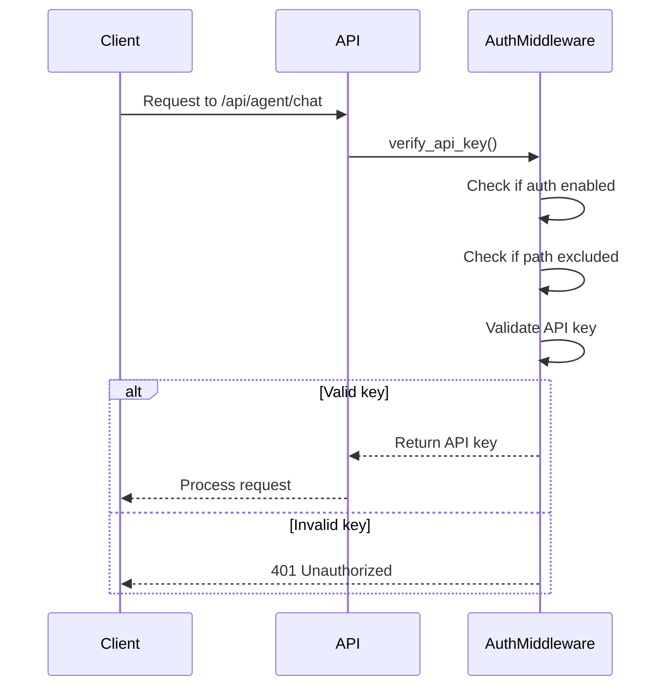

**Diagram sources**
- [opencontext/server/middleware/auth.py](file://opencontext/server/middleware/auth.py#L1-L113)

**Section sources**
- [opencontext/server/middleware/auth.py](file://opencontext/server/middleware/auth.py#L1-L113)

## Agent Chat Endpoints
The agent chat endpoints provide intelligent conversation capabilities based on the Context Agent. These endpoints support both non-streaming and streaming chat interfaces, allowing clients to choose the appropriate response format based on their needs. The chat functionality is designed to maintain conversation context across multiple interactions, with support for session management and workflow resumption.

The endpoints include chat initiation, streaming chat, workflow resumption, workflow state retrieval, and workflow cancellation. The chat interface accepts user queries along with optional context information, session IDs, and user IDs. The streaming endpoint supports real-time response generation with event-based updates, including thinking, running, and completion events. The API also provides a test endpoint to verify that the Context Agent is functioning properly.

### Chat Request and Response Models
The agent chat endpoints use Pydantic models to define the structure of requests and responses. The `ChatRequest` model includes fields for the user query, context information, session ID, user ID, and conversation ID. The `ChatResponse` model includes fields for success status, workflow ID, processing stage, query, intent, context, execution details, reflection, and errors.

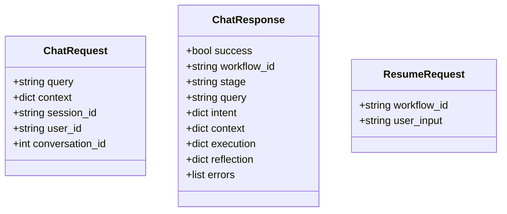

**Diagram sources**
- [opencontext/server/routes/agent_chat.py](file://opencontext/server/routes/agent_chat.py#L48-L77)

### Chat Endpoints
The `/api/agent/chat` endpoint provides a non-streaming chat interface that returns a complete response after processing the user query. The endpoint accepts a `ChatRequest` object and returns a `ChatResponse` object with the AI-generated response and associated metadata.

The `/api/agent/chat/stream` endpoint provides a streaming chat interface that returns responses as Server-Sent Events (SSE). This allows clients to display responses incrementally as they are generated. The stream includes various event types such as session start, thinking, running, completed, and error events.

The `/api/agent/resume/{workflow_id}` endpoint allows clients to resume a previously interrupted workflow by providing additional user input. This is useful for multi-step interactions where the AI needs clarification or additional information from the user.

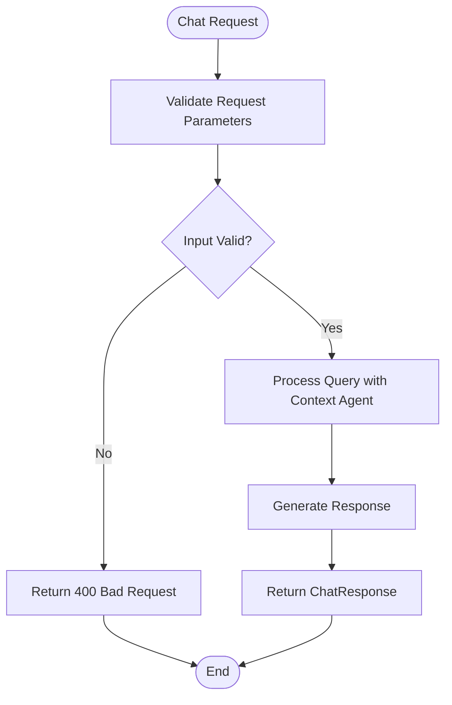

**Diagram sources**
- [opencontext/server/routes/agent_chat.py](file://opencontext/server/routes/agent_chat.py#L80-L367)

**Section sources**
- [opencontext/server/routes/agent_chat.py](file://opencontext/server/routes/agent_chat.py#L1-L367)

## Completions Endpoints
The completions endpoints provide intelligent content completion functionality similar to GitHub Copilot. These endpoints analyze the current document content and cursor position to generate context-aware suggestions for code, text, or structured content. The API supports multiple completion strategies including semantic continuation, template completion, and reference suggestions.

The completions service can return suggestions synchronously or as a stream, allowing clients to display suggestions in real-time as the user types. The API also includes endpoints for submitting feedback on suggestions, retrieving completion statistics, and managing the completion cache. This feedback mechanism helps improve the quality of future suggestions by learning from user interactions.

### Completion Request and Response Models
The completions endpoints use Pydantic models to define the structure of requests and responses. The `CompletionRequest` model includes fields for the current document content, cursor position, document ID, completion types, maximum number of suggestions, and additional context information. The `CompletionResponse` model includes fields for success status, suggestions, processing time, cache hit status, and error information.

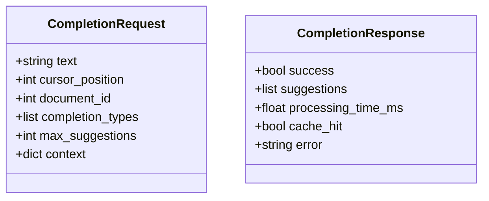

**Diagram sources**
- [opencontext/server/routes/completions.py](file://opencontext/server/routes/completions.py#L30-L55)

### Completions Endpoints
The `/api/completions/suggest` endpoint returns intelligent completion suggestions based on the current document content and cursor position. Clients can specify which completion types to include and limit the number of suggestions returned. The endpoint returns a JSON response with the generated suggestions and metadata.

The `/api/completions/suggest/stream` endpoint provides streaming completion suggestions, suitable for scenarios requiring real-time feedback. The stream includes processing status updates and individual suggestions as they are generated, allowing clients to display them incrementally.

The `/api/completions/feedback` endpoint allows clients to submit feedback on completion suggestions, indicating whether the user accepted or rejected a suggestion. This feedback is used to improve the completion service over time.

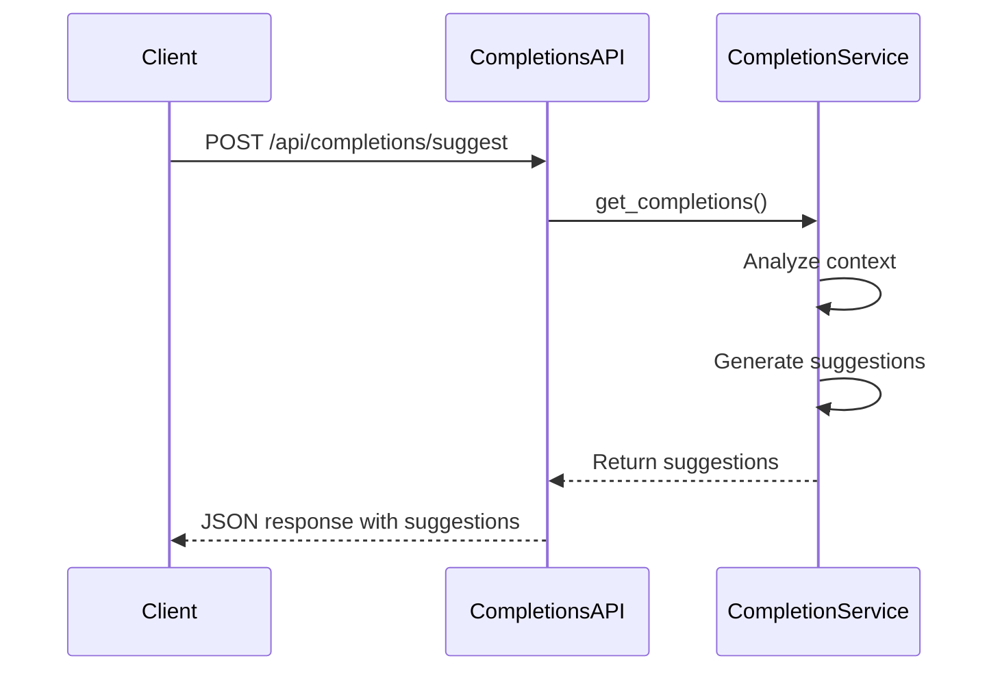

**Diagram sources**
- [opencontext/server/routes/completions.py](file://opencontext/server/routes/completions.py#L57-L329)

**Section sources**
- [opencontext/server/routes/completions.py](file://opencontext/server/routes/completions.py#L1-L329)

## Context Operations Endpoints
The context operations endpoints provide functionality for managing processed context data within the application. These endpoints allow clients to delete context records, view context details, retrieve available context types, and perform vector searches on the context database. The API supports both programmatic access and web-based viewing of context information.

The context management system organizes information into different context types, which can be retrieved using the `/api/context_types` endpoint. The vector search functionality allows clients to search for relevant context records based on a query, without requiring LLM processing. This is useful for quickly finding related information based on semantic similarity.

### Context Request and Response Models
The context endpoints use Pydantic models to define the structure of requests and responses. The `ContextDetailRequest` model includes fields for the context ID and context type, used when retrieving or deleting specific context records. The `VectorSearchRequest` model includes fields for the search query, number of results to return, context types to search, and additional filters.

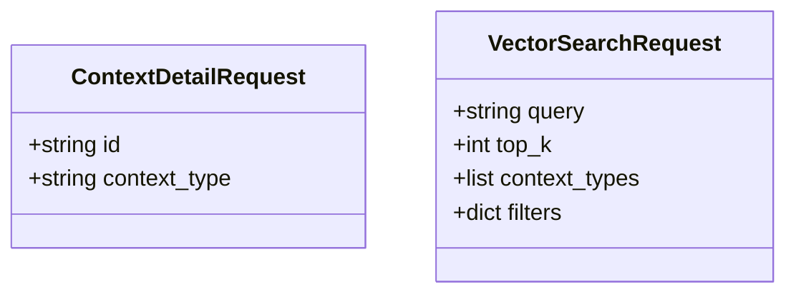

**Diagram sources**
- [opencontext/server/routes/context.py](file://opencontext/server/routes/context.py#L57-L67)

### Context Operations Endpoints
The `/contexts/delete` endpoint allows clients to delete a processed context record by its ID and context type. This performs a soft delete, marking the record as deleted rather than removing it permanently from the database.

The `/contexts/detail` endpoint returns an HTML page displaying the details of a specific context record. This endpoint is primarily used by the web interface to provide a user-friendly view of context information.

The `/api/context_types` endpoint returns a list of all available context types in the system. This information can be used by clients to filter or categorize context records.

The `/api/vector_search` endpoint performs a direct search on the vector database using the provided query. This returns results based on semantic similarity without involving the LLM, making it faster than full AI-powered searches.

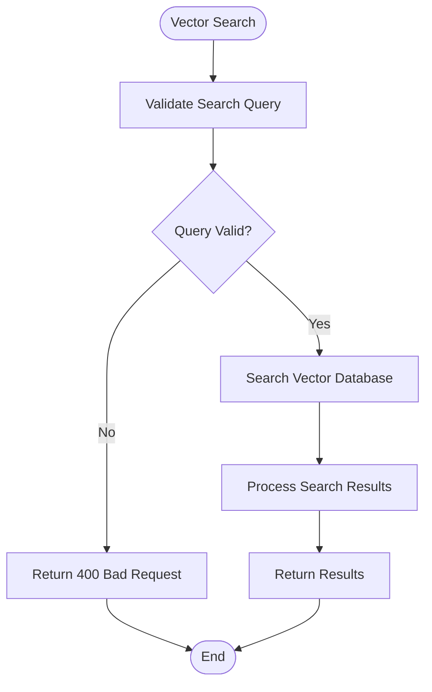

**Diagram sources**
- [opencontext/server/routes/context.py](file://opencontext/server/routes/context.py#L69-L146)

**Section sources**
- [opencontext/server/routes/context.py](file://opencontext/server/routes/context.py#L1-L146)

## Content Generation Endpoints
The content generation endpoints provide configuration and management functionality for automated content generation tasks. These tasks include activity monitoring, smart tips, todo extraction, and daily report generation. The API allows clients to retrieve and update the configuration for these tasks, controlling their frequency and enabling/disabling status.

The content generation system operates as background tasks that periodically analyze captured context and generate insights, suggestions, or summaries. The configuration endpoints allow clients to customize the behavior of these tasks, such as setting the interval between executions or specifying when daily reports should be generated.

### Content Generation Request and Response Models
The content generation endpoints use Pydantic models to define the structure of requests and responses. The models include configuration classes for different types of content generation tasks, such as activity monitoring, smart tips, todos, and reports. The `ContentGenerationConfig` model combines these individual configurations into a complete configuration object.

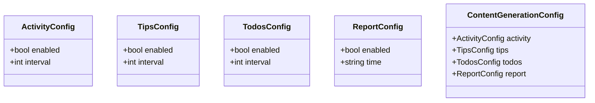

**Diagram sources**
- [opencontext/server/routes/content_generation.py](file://opencontext/server/routes/content_generation.py#L26-L67)

### Content Generation Endpoints
The `/api/content_generation/config` endpoint returns the current configuration for all content generation tasks. This includes the enabled status, execution intervals, and other parameters for each task type.

The `/api/content_generation/config` endpoint (POST) allows clients to update the content generation configuration. Updates are applied in memory and saved to the user settings file, ensuring persistence across application restarts. The endpoint supports partial updates, allowing clients to modify specific task configurations without affecting others.

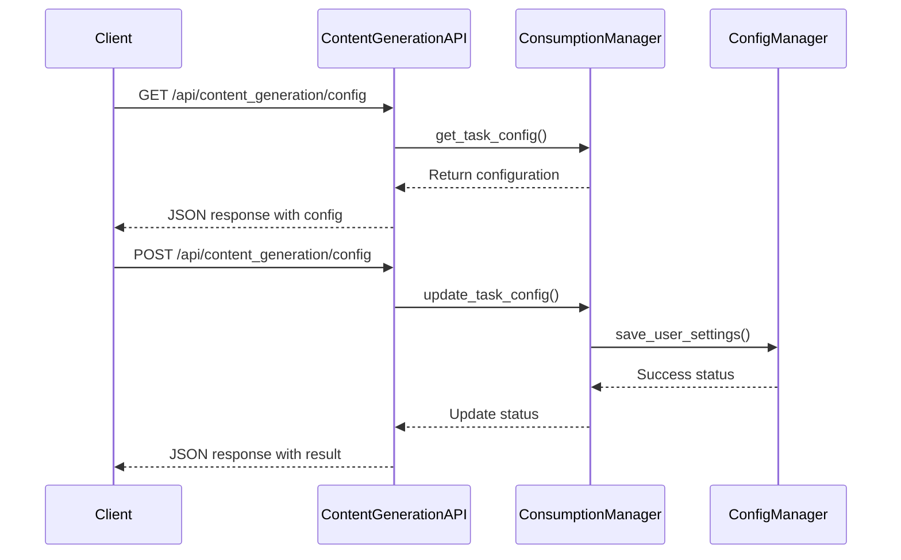

**Diagram sources**
- [opencontext/server/routes/content_generation.py](file://opencontext/server/routes/content_generation.py#L69-L144)

**Section sources**
- [opencontext/server/routes/content_generation.py](file://opencontext/server/routes/content_generation.py#L1-L144)

## Settings Endpoints
The settings endpoints provide comprehensive functionality for managing application configuration, including model settings, general system settings, prompts, and system information. These endpoints allow clients to configure the AI models used by the application, customize system behavior, manage prompts, and retrieve system information.

The settings API is organized into several sub-sections, each handling a specific aspect of configuration. Model settings include configuration for the VLM (Vision Language Model) and embedding models, including API endpoints, keys, and providers. General settings cover various system components such as capture, processing, logging, and content generation.

### Settings Request and Response Models
The settings endpoints use Pydantic models to define the structure of requests and responses. The `ModelSettingsVO` model includes fields for the model platform, model ID, base URL, API key, and embedding-specific configuration. Other models include request and response objects for general settings, prompts, and language configuration.

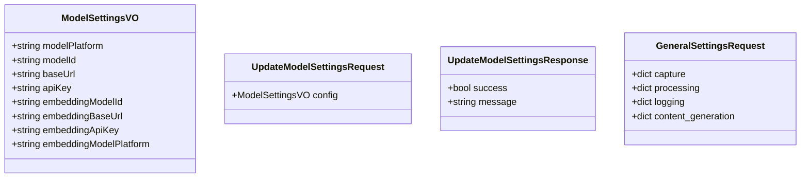

**Diagram sources**
- [opencontext/server/routes/settings.py](file://opencontext/server/routes/settings.py#L32-L56)

### Settings Endpoints
The `/api/model_settings/get` endpoint returns the current model configuration, including VLM and embedding model settings. This allows clients to retrieve the current AI model configuration for display or backup purposes.

The `/api/model_settings/update` endpoint allows clients to update the model configuration and reinitialize the LLM clients. This endpoint validates the new configuration before applying it, ensuring that the specified models are accessible and functional.

The `/api/model_settings/validate` endpoint tests the connectivity and validity of model configuration without saving it. This allows clients to verify that API keys and endpoints are correct before applying changes.

The `/api/settings/general` endpoints (GET and POST) retrieve and update general system settings for components like capture, processing, logging, and content generation.

The `/api/settings/prompts` endpoints provide functionality for managing prompts, including retrieving current prompts, updating prompts, importing prompts from YAML files, and exporting prompts for backup or sharing.

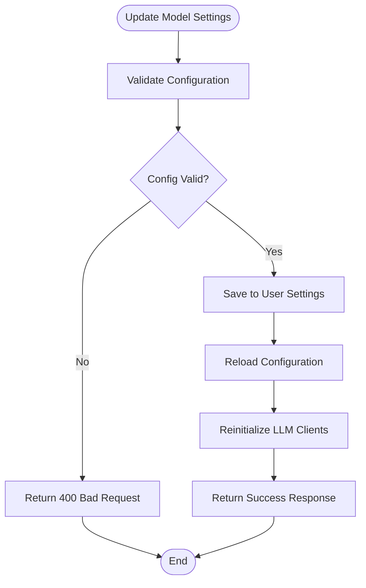

**Diagram sources**
- [opencontext/server/routes/settings.py](file://opencontext/server/routes/settings.py#L79-L791)

**Section sources**
- [opencontext/server/routes/settings.py](file://opencontext/server/routes/settings.py#L1-L791)

## Vaults Endpoints
The vaults endpoints provide CRUD operations for managing documents within the application's vault system. These endpoints allow clients to create, read, update, and delete documents, as well as manage document context processing. The vault system serves as a central repository for user-created content, with AI-powered features for organization and insight generation.

The endpoints include functionality for listing documents, creating new documents, retrieving document details, saving document changes, and deleting documents. Each document operation triggers appropriate context processing to ensure that the document's content is properly indexed and available for AI-powered features. The API also provides endpoints to check the context processing status of documents.

### Vaults Request and Response Models
The vaults endpoints use Pydantic models to define the structure of requests and responses. The `VaultDocument` model includes fields for the document ID, title, content, summary, tags, and document type. This model is used for both creating new documents and updating existing ones.

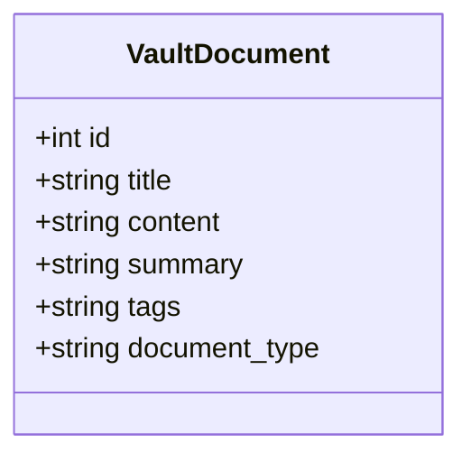

**Diagram sources**
- [opencontext/server/routes/vaults.py](file://opencontext/server/routes/vaults.py#L37-L47)

### Vaults Endpoints
The `/vaults` endpoint returns an HTML page for the vaults workspace, which serves as the main interface for document management. This endpoint redirects to the intelligent agent chat interface, providing a unified experience for document collaboration.

The `/api/vaults/list` endpoint returns a list of documents with basic information such as title, summary, creation date, and content length. Clients can specify limits and offsets for pagination.

The `/api/vaults/create` endpoint creates a new document with the provided content and metadata. After creation, the endpoint triggers asynchronous context processing to index the document's content.

The `/api/vaults/{document_id}` endpoints (GET and POST) retrieve and update document details. The GET endpoint returns the complete document content, while the POST endpoint saves changes and triggers reprocessing of the document's context.

The `/api/vaults/{document_id}` endpoint (DELETE) performs a soft delete of a document, marking it as deleted in the database. This also triggers cleanup of the document's context data.

The `/api/vaults/{document_id}/context` endpoint returns the context processing status for a document, including whether context data exists and the number of chunks processed.

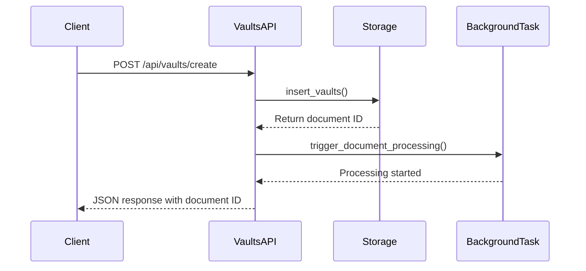

**Diagram sources**
- [opencontext/server/routes/vaults.py](file://opencontext/server/routes/vaults.py#L77-L424)

**Section sources**
- [opencontext/server/routes/vaults.py](file://opencontext/server/routes/vaults.py#L1-L424)

## Documents Endpoints
The documents endpoints provide functionality for uploading and processing documents from external sources. These endpoints support both local file uploads and web link processing, allowing clients to add content from various sources to the application's context system. The API handles the conversion of uploaded documents into a format suitable for AI processing and indexing.

The document upload functionality includes support for local files and web links. For web links, the system converts the linked content to PDF format before processing. The endpoints add documents to a processing queue, where they are handled asynchronously by the appropriate components. This ensures that document processing does not block the API response.

### Documents Request and Response Models
The documents endpoints use Pydantic models to define the structure of requests and responses. The `UploadDocumentRequest` model includes a field for the file path of the document to upload. The `UploadWebLinkRequest` model includes fields for the URL to process and an optional filename hint.

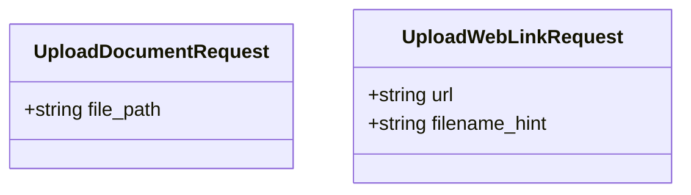

**Diagram sources**
- [opencontext/server/routes/documents.py](file://opencontext/server/routes/documents.py#L27-L38)

### Documents Endpoints
The `/api/documents/upload` endpoint adds a local document to the processing queue. Clients provide the file path, and the system handles the rest of the processing asynchronously. This endpoint validates the file path and queues the document for processing by the document processor.

The `/api/weblinks/upload` endpoint submits a web link for processing. The system converts the linked content to PDF format and adds it to the processing queue. If the web link capture component is not initialized, it is initialized with default configuration before processing the link.

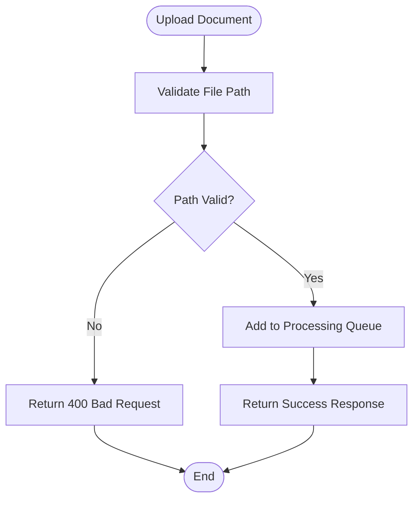

**Diagram sources**
- [opencontext/server/routes/documents.py](file://opencontext/server/routes/documents.py#L40-L101)

**Section sources**
- [opencontext/server/routes/documents.py](file://opencontext/server/routes/documents.py#L1-L101)

## Screenshots Endpoints
The screenshots endpoints provide functionality for adding screenshot data to the application's context system. These endpoints allow clients to submit individual screenshots or batches of screenshots for processing. The API captures metadata about each screenshot, including the file path, window title, creation time, and source.

The screenshot functionality supports both single and batch operations, allowing efficient processing of multiple screenshots. Each screenshot is added to the context system with its associated metadata, enabling AI-powered analysis and insight generation based on visual content.

### Screenshots Request and Response Models
The screenshots endpoints use Pydantic models to define the structure of requests and responses. The `AddScreenshotRequest` model includes fields for the screenshot path, window title, creation time, and source. The `AddScreenshotsRequest` model contains a list of `AddScreenshotRequest` objects for batch operations.

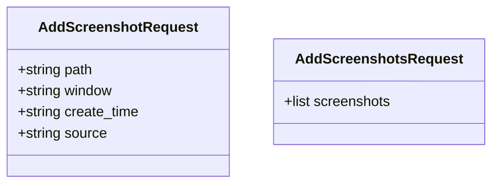

**Diagram sources**
- [opencontext/server/routes/screenshots.py](file://opencontext/server/routes/screenshots.py#L25-L34)

### Screenshots Endpoints
The `/api/add_screenshot` endpoint adds a single screenshot to the context system. Clients provide the screenshot metadata, and the system processes it for AI analysis. This endpoint validates the provided information and adds the screenshot to the processing queue.

The `/api/add_screenshots` endpoint adds multiple screenshots in a single request. This is useful for efficiently processing batches of screenshots captured over time. The endpoint processes each screenshot in the list and returns a success response only if all screenshots are added successfully.

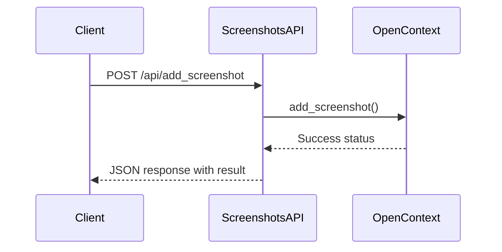

**Diagram sources**
- [opencontext/server/routes/screenshots.py](file://opencontext/server/routes/screenshots.py#L36-L71)

**Section sources**
- [opencontext/server/routes/screenshots.py](file://opencontext/server/routes/screenshots.py#L1-L71)

## Health Check Endpoints
The health check endpoints provide functionality for monitoring the status and availability of the application. These endpoints are designed to be lightweight and do not require authentication, making them suitable for use by external monitoring systems. The API includes both simple and detailed health checks to accommodate different monitoring needs.

The health check system provides information about the overall service status, component health, and authentication configuration. This allows clients and monitoring systems to quickly determine if the application is functioning properly and identify any potential issues.

### Health Endpoints
The `/health` endpoint provides a simple health check that returns a basic status response. This endpoint is unauthenticated and returns a 200 status code with a "healthy" status if the service is running.

The `/api/health` endpoint provides a detailed health check that includes information about the health of various components within the application. This endpoint requires authentication and returns a comprehensive status report including component health information.

The `/api/auth/status` endpoint returns information about the authentication configuration, indicating whether API authentication is currently enabled. This allows clients to determine the authentication requirements for other endpoints.

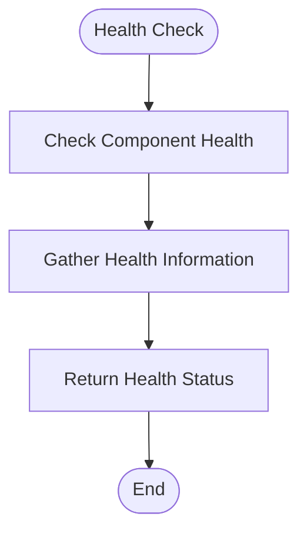

**Diagram sources**
- [opencontext/server/routes/health.py](file://opencontext/server/routes/health.py#L19-L47)

**Section sources**
- [opencontext/server/routes/health.py](file://opencontext/server/routes/health.py#L1-L47)

## Monitoring Endpoints
The monitoring endpoints provide comprehensive system monitoring and analytics functionality. These endpoints expose various metrics and statistics about the application's performance, resource usage, and operational status. The monitoring system collects data on token usage, processing performance, data statistics, and system health.

The monitoring API includes endpoints for retrieving system overviews, context type statistics, token usage summaries, processing metrics, stage timing metrics, data statistics, and processing errors. These endpoints provide valuable insights into the application's operation and can be used for performance optimization and troubleshooting.

### Monitoring Endpoints
The `/api/monitoring/overview` endpoint returns a comprehensive overview of the system's current status, including resource usage and operational metrics.

The `/api/monitoring/context-types` endpoint returns statistics on the number of records for each context type, providing insight into the distribution of captured data.

The `/api/monitoring/token-usage` endpoint returns detailed information about model token consumption over a specified time period.

The `/api/monitoring/processing` endpoint returns performance metrics for the various processors in the system, including processing times and success rates.

The `/api/monitoring/stage-timing` endpoint returns timing metrics for different processing stages, helping to identify performance bottlenecks.

The `/api/monitoring/data-stats` and `/api/monitoring/data-stats-trend` endpoints return statistics on captured data such as screenshots, documents, and contexts, with the trend endpoint providing time-series data.

The `/api/monitoring/processing-errors` endpoint returns information about processing errors, including the most common errors over a specified time period.

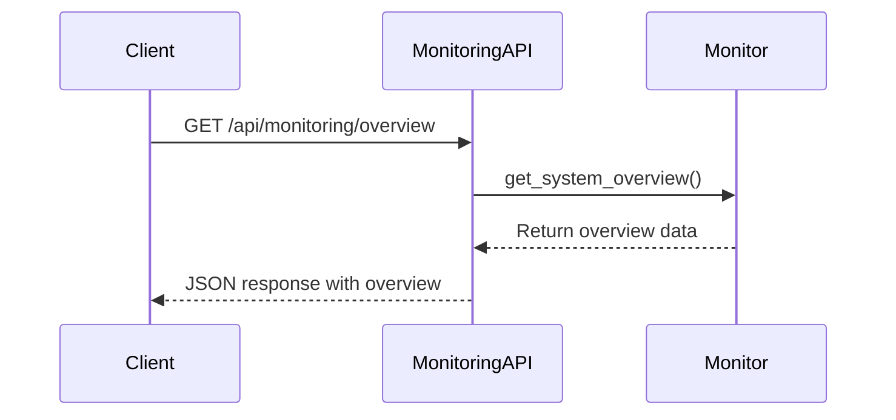

**Diagram sources**
- [opencontext/server/routes/monitoring.py](file://opencontext/server/routes/monitoring.py#L23-L245)

**Section sources**
- [opencontext/server/routes/monitoring.py](file://opencontext/server/routes/monitoring.py#L1-L245)

## Conversation Management Endpoints
The conversation management endpoints provide CRUD operations for managing chat conversations within the application. These endpoints allow clients to create, retrieve, list, update, and delete conversations. The conversation system supports metadata storage, filtering by various criteria, and pagination for large result sets.

The endpoints are designed to support the AI chat interface, providing the backend functionality for conversation persistence and management. Each conversation can have associated metadata, such as the document it's related to, and can be filtered by page name, user ID, and status.

### Conversation Request and Response Models
The conversation endpoints use Pydantic models to define the structure of requests and responses. The `CreateConversationRequest` model includes fields for the page name and an optional document ID to store in metadata. The `ConversationResponse` model includes fields for the conversation ID, title, user ID, timestamps, metadata, page name, and status.

```mermaid
classDiagram
class CreateConversationRequest {
+string page_name
+string document_id
}
class ConversationResponse {
+int id
+string title
+string user_id
+string created_at
+string updated_at
+string metadata
+string page_name
+string status
}
class GetConversationListResponse {
+list items
+int total
}
class UpdateConversationRequest {
+string title
}
class DeleteConversationResponse {
+bool success
+int id
}
```

**Diagram sources**
- [opencontext/server/routes/conversation.py](file://opencontext/server/routes/conversation.py#L30-L73)

### Conversation Management Endpoints
The `/api/agent/chat/conversations` endpoint (POST) creates a new conversation with the specified page name and optional document ID in metadata. The endpoint returns the created conversation details.

The `/api/agent/chat/conversations/list` endpoint returns a list of conversations with pagination and filtering options. Clients can filter by page name, user ID, and status, and specify limits and offsets for pagination.

The `/api/agent/chat/conversations/{cid}` endpoint (GET) retrieves the details of a specific conversation by its ID.

The `/api/agent/chat/conversations/{cid}/update` endpoint (PATCH) updates the title of a conversation. This allows clients to rename conversations based on their content or purpose.

The `/api/agent/chat/conversations/{cid}/update` endpoint (DELETE) marks a conversation as deleted (soft delete). This preserves the conversation data while removing it from normal views.

```mermaid
flowchart TD
Start([Create Conversation]) --> ValidateInput["Validate Request Parameters"]
ValidateInput --> InputValid{"Input Valid?"}
InputValid --> |No| ReturnError["Return 400 Bad Request"]
InputValid --> |Yes| CreateConversation["Create Conversation in Database"]
CreateConversation --> ReturnDetails["Return Conversation Details"]
ReturnError --> End([End])
ReturnDetails --> End
```

**Diagram sources**
- [opencontext/server/routes/conversation.py](file://opencontext/server/routes/conversation.py#L77-L234)

**Section sources**
- [opencontext/server/routes/conversation.py](file://opencontext/server/routes/conversation.py#L1-L234)

## Messages Management Endpoints
The messages management endpoints provide CRUD operations for managing individual messages within conversations. These endpoints allow clients to create, update, append to, and mark messages as finished. The API supports both regular and streaming messages, with special handling for streaming responses that are generated incrementally.

The endpoints include functionality for interrupting message generation, which is important for streaming responses that may take significant time to complete. This allows clients to cancel long-running AI operations when necessary.

### Messages Request and Response Models
The messages endpoints use Pydantic models to define the structure of requests and responses. The `CreateMessageParams` model includes fields for the conversation ID, role, content, completion status, and token count. The `CreateStreamingMessageParams` model includes fields for the conversation ID and role, used when creating placeholders for streaming messages.

The `UpdateMessageContentParams` model includes fields for the message ID, new content, completion status, and token count. The `AppendMessageContentParams` model includes fields for the message ID, content chunk, and token count, used when incrementally updating streaming messages.

The `ConversationMessage` model defines the structure of a message in the response, including ID, conversation ID, parent message ID, role, content, status, token count, metadata, latency, error message, thinking records, and timestamps.

```mermaid
classDiagram
class CreateMessageParams {
+int conversation_id
+string role
+string content
+bool is_complete
+int token_count
}
class CreateStreamingMessageParams {
+int conversation_id
+string role
}
class UpdateMessageContentParams {
+int message_id
+string new_content
+bool is_complete
+int token_count
}
class AppendMessageContentParams {
+int message_id
+string content_chunk
+int token_count
}
class ConversationMessage {
+int id
+int conversation_id
+string parent_message_id
+string role
+string content
+string status
+int token_count
+string metadata
+int latency_ms
+string error_message
+list thinking
+string completed_at
+string created_at
+string updated_at
}
class MessageInterruptResponse {
+string message_id
}
```

**Diagram sources**
- [opencontext/server/routes/messages.py](file://opencontext/server/routes/messages.py#L41-L100)

### Messages Management Endpoints
The `/api/agent/chat/message/{mid}/create` endpoint creates a new message in a conversation. The `mid` parameter is used as the parent message ID, establishing the conversation thread structure.

The `/api/agent/chat/message/stream/{mid}/create` endpoint creates a new streaming message, which serves as a placeholder for content that will be generated incrementally. This is used for AI responses that take time to produce.

The `/api/agent/chat/message/{mid}/update` endpoint updates the content of an existing message. This can be used to correct or modify message content after it has been created.

The `/api/agent/chat/message/{mid}/append` endpoint appends content to an existing message, which is particularly useful for streaming responses where content is generated in chunks.

The `/api/agent/chat/message/{mid}/finished` endpoint marks a message as complete, indicating that all content has been received and processed.

The `/api/agent/chat/conversations/{cid}/messages` endpoint returns all messages for a specific conversation, allowing clients to retrieve the complete conversation history.

The `/api/agent/chat/messages/{mid}/interrupt` endpoint interrupts the generation of a message, setting its status to 'cancelled' and stopping further processing. This is useful for stopping long-running AI operations.

```mermaid
sequenceDiagram
participant Client
participant MessagesAPI
participant Storage
Client->>MessagesAPI : POST /api/agent/chat/message/stream/{mid}/create
MessagesAPI->>Storage : create_streaming_message()
Storage-->>MessagesAPI : Return message ID
MessagesAPI-->>Client : Return message ID
Client->>MessagesAPI : POST /api/agent/chat/message/{mid}/append
MessagesAPI->>Storage : append_message_content()
Storage-->>MessagesAPI : Success status
MessagesAPI-->>Client : Return success
Client->>MessagesAPI : POST /api/agent/chat/message/{mid}/finished
MessagesAPI->>Storage : mark_message_finished()
Storage-->>MessagesAPI : Success status
MessagesAPI-->>Client : Return success
```

**Diagram sources**
- [opencontext/server/routes/messages.py](file://opencontext/server/routes/messages.py#L102-L316)

**Section sources**
- [opencontext/server/routes/messages.py](file://opencontext/server/routes/messages.py#L1-L316)

## Web Interface Endpoints
The web interface endpoints provide HTML pages for the various user interfaces within the application. These endpoints serve the frontend components and handle navigation between different views. The API includes routes for the main contexts view, vector search interface, debug page, chat interface, monitoring dashboard, assistant page, and settings page.

The web endpoints also include functionality for serving static files, with security measures to prevent access to sensitive directories. The file serving endpoint validates requested paths against allowed prefixes and performs security checks to prevent directory traversal attacks.

### Web Endpoints
The `/` endpoint redirects to the main contexts view, providing a default entry point for the application.

The `/contexts` endpoint returns the main contexts page, which displays a list of processed contexts with filtering and pagination.

The `/vector_search` endpoint returns the vector search interface, allowing users to perform semantic searches on the context database.

The `/debug` endpoint returns the debug page, which provides tools for developers and advanced users to inspect system state and troubleshoot issues.

The `/chat` and `/advanced_chat` endpoints redirect to the vaults workspace, which serves as the main AI chat and document collaboration interface.

The `/files/{file_path:path}` endpoint serves static files from allowed directories, with security checks to prevent access to sensitive files.

The `/monitoring` endpoint returns the monitoring dashboard, which displays system metrics and analytics.

The `/assistant` endpoint returns the intelligent assistant page, providing AI-powered help and guidance.

The `/settings` endpoint returns the system settings page, where users can configure application behavior.

```mermaid
flowchart TD
Start([Web Request]) --> CheckPath["Check Requested Path"]
CheckPath --> IsSensitive{"Path Sensitive?"}
IsSensitive --> |Yes| ReturnForbidden["Return 403 Forbidden"]
IsSensitive --> |No| IsAllowed{"Path Allowed?"}
IsAllowed --> |No| ReturnForbidden
IsAllowed --> |Yes| ResolvePath["Resolve File Path"]
ResolvePath --> PathValid{"Path Valid?"}
PathValid --> |No| ReturnForbidden
PathValid --> |Yes| ServeFile["Serve File"]
ServeFile --> End([End])
ReturnForbidden --> End
```

**Diagram sources**
- [opencontext/server/routes/web.py](file://opencontext/server/routes/web.py#L1-L181)

**Section sources**
- [opencontext/server/routes/web.py](file://opencontext/server/routes/web.py#L1-L181)

## Events Endpoints
The events endpoints provide functionality for event publishing and retrieval within the application. These endpoints support a fetch-and-clear mechanism for cached events, allowing clients to retrieve new events and clear them from the cache. The system is designed for periodic polling by clients to receive updates and notifications.

The events API includes endpoints for fetching and clearing events, checking event status, and publishing events (primarily for testing). The event system uses predefined event types and carries arbitrary data with each event, providing flexibility for different use cases.

### Events Request and Response Models
The events endpoints use Pydantic models to define the structure of requests and responses. The `PublishEventRequest` model includes fields for the event type and data payload. The event type must be a valid value from the `EventType` enumeration.

```mermaid
classDiagram
class PublishEventRequest {
+string event_type
+dict data
}
```

**Diagram sources**
- [opencontext/server/routes/events.py](file://opencontext/server/routes/events.py#L25-L28)

### Events Endpoints
The `/api/events/fetch` endpoint retrieves all cached events and clears the cache. This fetch-and-clear mechanism ensures that clients receive each event exactly once, preventing duplicate processing.

The `/api/events/status` endpoint returns the current status of the event system, including cache statistics and system health.

The `/api/events/publish` endpoint allows clients to publish new events to the system. This is primarily used for testing and development purposes, as most events are generated internally by the application.

```mermaid
sequenceDiagram
participant Client
participant EventsAPI
participant EventManager
Client->>EventsAPI : GET /api/events/fetch
EventsAPI->>EventManager : fetch_and_clear_events()
EventManager-->>EventsAPI : Return events
EventsAPI-->>Client : JSON response with events
```

**Diagram sources**
- [opencontext/server/routes/events.py](file://opencontext/server/routes/events.py#L30-L99)

**Section sources**
- [opencontext/server/routes/events.py](file://opencontext/server/routes/events.py#L1-L99)

## Debug Endpoints
The debug endpoints provide functionality for debugging and development purposes. These endpoints allow developers and advanced users to inspect system state, manually trigger content generation, and manage prompts. The API includes endpoints for retrieving debug data from various tables, manually generating reports and activities, and managing prompts for content generation.

The debug endpoints are particularly useful for testing and troubleshooting, as they allow manual execution of automated processes and inspection of internal data structures. The prompt management functionality enables experimentation with different prompt configurations to optimize AI-generated content.

### Debug Endpoints
The `/api/debug/reports`, `/api/debug/todos`, `/api/debug/activities`, and `/api/debug/tips` endpoints return data from the corresponding SQLite tables, allowing inspection of generated content.

The `/api/debug/generate/report`, `/api/debug/generate/activity`, `/api/debug/generate/tips`, and `/api/debug/generate/todos` endpoints manually trigger the generation of corresponding content types, useful for testing without waiting for scheduled execution.

The `/api/debug/prompts/export`, `/api/debug/prompts/restore`, `/api/debug/prompts/{category}`, and `/api/debug/prompts/{category}` endpoints provide comprehensive functionality for managing generation prompts, including exporting, restoring, retrieving, and updating prompts.

The `/api/debug/generate/{category}/custom` endpoint generates content using custom prompts, allowing experimentation with different prompt configurations.

```mermaid
flowchart TD
Start([Generate with Custom Prompts]) --> GetCustomPrompts["Get Custom Prompts"]
GetCustomPrompts --> PromptsExist{"Custom Prompts Exist?"}
PromptsExist --> |No| UseOriginal["Use Original Prompts"]
PromptsExist --> |Yes| ReplacePrompts["Replace with Custom Prompts"]
ReplacePrompts --> GenerateContent["Generate Content"]
UseOriginal --> GenerateContent
GenerateContent --> RestorePrompts["Restore Original Prompts"]
RestorePrompts --> ReturnResult["Return Result"]
ReturnResult --> End([End])
```

**Diagram sources**
- [opencontext/server/routes/debug.py](file://opencontext/server/routes/debug.py#L1-L691)

**Section sources**
- [opencontext/server/routes/debug.py](file://opencontext/server/routes/debug.py#L1-L691)

## Error Handling and Response Format
The MineContext API uses a consistent error handling and response format across all endpoints. Successful responses typically return a 200 status code with a JSON body containing the requested data. Error responses use appropriate HTTP status codes and include detailed error information in the response body.

The API uses the `convert_resp` utility function to standardize response formatting. This function creates a consistent response structure with fields for success status, data, message, and error codes. Common status codes include 200 for success, 400 for bad requests, 401 for unauthorized access, 403 for forbidden access, 404 for not found, and 500 for internal server errors.

Error responses include descriptive messages that help clients understand the cause of the error and take appropriate action. The API also includes detailed logging of errors for troubleshooting and debugging purposes, with error messages that include relevant context without exposing sensitive information.

```mermaid
flowchart TD
Start([API Request]) --> ProcessRequest["Process Request"]
ProcessRequest --> Success{"Success?"}
Success --> |Yes| FormatSuccess["Format Success Response"]
Success --> |No| FormatError["Format Error Response"]
FormatSuccess --> Return200["Return 200 OK"]
FormatError --> ReturnError["Return Error Status"]
Return200 --> End([End])
ReturnError --> End
```

**Section sources**
- [opencontext/server/utils.py](file://opencontext/server/utils.py)
- [opencontext/server/routes/agent_chat.py](file://opencontext/server/routes/agent_chat.py#L113-L115)
- [opencontext/server/routes/completions.py](file://opencontext/server/routes/completions.py#L119-L131)

## Client Implementation Guidelines
When implementing clients for the MineContext API, consider the following guidelines for optimal integration and user experience:

### Authentication
Always include a valid API key in requests to protected endpoints, either in the `X-API-Key` header or as a `api_key` query parameter. Store API keys securely and avoid hardcoding them in client applications. Implement proper error handling for authentication failures (401 status codes) and provide clear feedback to users.

### Handling Streaming Responses
For endpoints that support streaming responses (e.g., agent chat stream), implement proper handling of Server-Sent Events (SSE). Set appropriate timeouts and handle connection interruptions gracefully. Display streaming content incrementally to provide a responsive user experience.

### Rate Limiting Considerations
While the current API documentation does not specify explicit rate limits, implement reasonable request throttling in client applications to avoid overwhelming the server. Use exponential backoff for retrying failed requests, and respect any rate limit headers that may be added in future versions.

### Error Handling
Implement comprehensive error handling for all API calls. Handle common HTTP status codes appropriately:
- 400 Bad Request: Validate input parameters and provide user feedback
- 401 Unauthorized: Prompt for API key or re-authentication
- 403 Forbidden: Inform user of permission issues
- 404 Not Found: Handle missing resources gracefully
- 500 Internal Server Error: Implement retry logic with backoff

### Example curl Commands
```bash
# Get health status (no authentication required)
curl -X GET http://localhost:8000/health

# Get model settings (authentication required)
curl -X GET http://localhost:8000/api/model_settings/get \
  -H "X-API-Key: your-api-key"

# Start a chat session
curl -X POST http://localhost:8000/api/agent/chat \
  -H "X-API-Key: your-api-key" \
  -H "Content-Type: application/json" \
  -d '{"query": "Hello, how are you?", "session_id": "session-123"}'

# Stream chat responses
curl -X POST http://localhost:8000/api/agent/chat/stream \
  -H "X-API-Key: your-api-key" \
  -H "Content-Type: application/json" \
  -d '{"query": "Explain quantum computing", "session_id": "session-123"}'
```

### Best Practices
- Cache responses when appropriate to reduce server load and improve performance
- Implement proper session management for conversational interfaces
- Handle large responses efficiently, especially for streaming endpoints
- Provide clear feedback to users during long-running operations
- Respect user privacy and data protection requirements
- Implement proper logging and monitoring for client-side issues

**Section sources**
- [opencontext/server/middleware/auth.py](file://opencontext/server/middleware/auth.py#L68-L109)
- [opencontext/server/routes/agent_chat.py](file://opencontext/server/routes/agent_chat.py#L118-L290)
- [opencontext/server/utils.py](file://opencontext/server/utils.py)