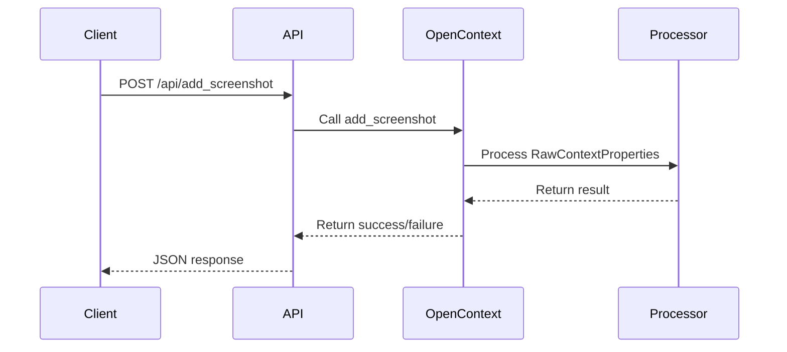
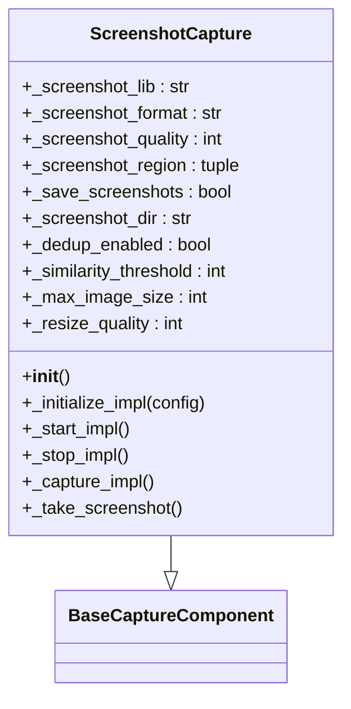
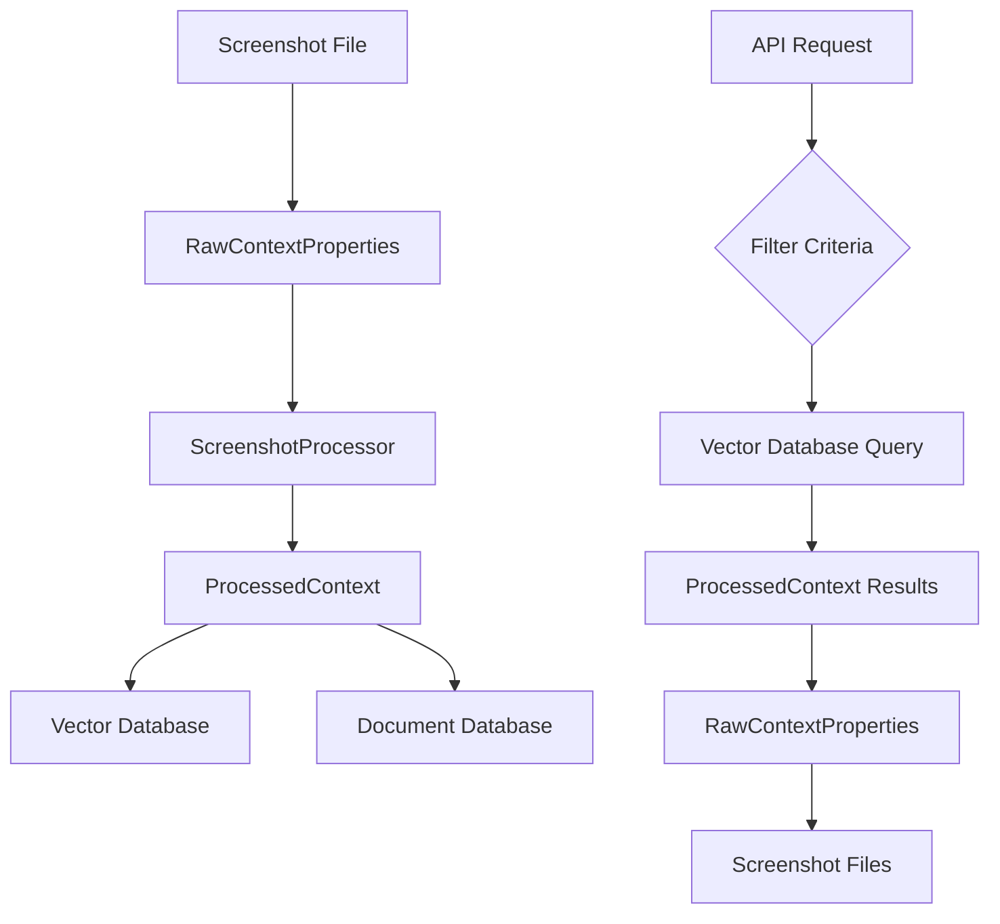
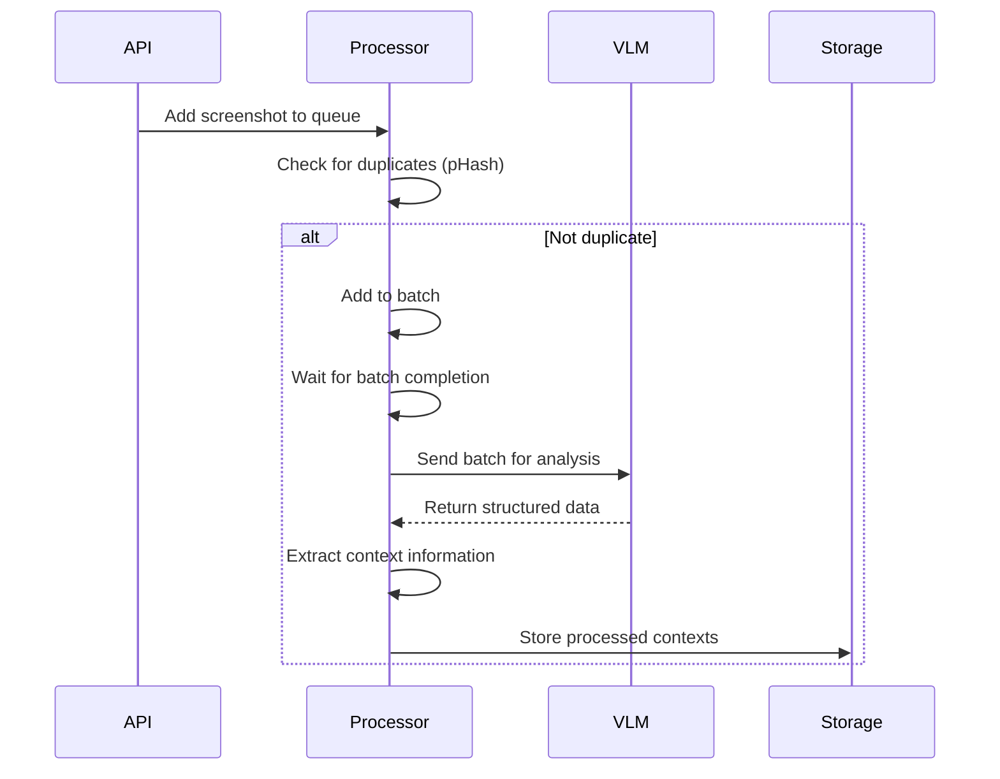

# Screenshots API

<cite>
**Referenced Files in This Document**   
- [screenshots.py](file://opencontext/server/routes/screenshots.py)
- [screenshot.py](file://opencontext/context_capture/screenshot.py)
- [screenshot_processor.py](file://opencontext/context_processing/processor/screenshot_processor.py)
- [context_operations.py](file://opencontext/server/context_operations.py)
- [models/context.py](file://opencontext/models/context.py)
- [unified_storage.py](file://opencontext/storage/unified_storage.py)
</cite>

## Table of Contents
1. [Introduction](#introduction)
2. [API Endpoints](#api-endpoints)
3. [Response Schema](#response-schema)
4. [Screenshot Capture Component](#screenshot-capture-component)
5. [Storage and Retrieval](#storage-and-retrieval)
6. [Integration with Screenshot Processor](#integration-with-screenshot-processor)
7. [Examples](#examples)
8. [Thumbnail Retrieval and Bandwidth Considerations](#thumbnail-retrieval-and-bandwidth-considerations)
9. [Implementing Screenshot Browsing Interfaces](#implementing-screenshot-browsing-interfaces)
10. [Handling Large Volumes of Data](#handling-large-volumes-of-data)
11. [Conclusion](#conclusion)

## Introduction
The Screenshots API provides endpoints for managing and retrieving captured screenshots within the OpenContext system. This API enables clients to add new screenshots, retrieve existing ones with various filtering options, and access metadata about captured images. The system integrates with a screenshot capture component that periodically captures screen images and processes them through a vision language model (VLM) to extract contextual information.

The API is built using FastAPI and follows RESTful principles. Screenshots are captured by the ScreenshotCapture component, stored on disk, and their metadata is indexed in a vector database for efficient retrieval. The system supports filtering by date, application, and window title, making it easy to find specific screenshots among large collections.

**Section sources**
- [screenshots.py](file://opencontext/server/routes/screenshots.py#L1-L70)
- [screenshot.py](file://opencontext/context_capture/screenshot.py#L1-L508)

## API Endpoints
The Screenshots API provides two main endpoints for managing screenshots:

### POST /api/add_screenshot
This endpoint adds a single screenshot to the system. It accepts a JSON payload with the following fields:
- `path`: The file path of the screenshot image
- `window`: The window title where the screenshot was taken
- `create_time`: The timestamp when the screenshot was created (ISO format)
- `source`: The source application or component that generated the screenshot (optional, defaults to "unknown")

The endpoint validates the screenshot path and creates a RawContextProperties object that is processed by the system. If successful, it returns a 200 status code with a success message. If there are validation errors, it returns a 400 status code with an error message.

### POST /api/add_screenshots
This endpoint allows adding multiple screenshots in a single request. It accepts a JSON payload with a "screenshots" array, where each item follows the same structure as the single screenshot endpoint. This batch operation is more efficient when adding multiple screenshots at once.

Both endpoints are protected by authentication and require valid credentials to access. They are implemented in the screenshots.py module and registered with the main API router.



**Diagram sources**
- [screenshots.py](file://opencontext/server/routes/screenshots.py#L36-L70)
- [context_operations.py](file://opencontext/server/context_operations.py#L67-L108)

**Section sources**
- [screenshots.py](file://opencontext/server/routes/screenshots.py#L36-L70)
- [context_operations.py](file://opencontext/server/context_operations.py#L67-L108)

## Response Schema
The Screenshots API returns structured JSON responses with consistent formatting. When a screenshot is successfully added, the response includes:

```json
{
  "code": 200,
  "status": 200,
  "message": "Screenshot added successfully",
  "data": null
}
```

For error responses, the schema includes:
- `code`: HTTP status code
- `status`: Application-specific status code
- `message`: Descriptive error message
- `data`: Additional error details (if available)

The underlying data model for screenshots is based on the RawContextProperties class, which includes:
- `content_format`: The format of the content (IMAGE for screenshots)
- `source`: The source of the context (SCREENSHOT)
- `create_time`: Timestamp when the screenshot was created
- `object_id`: Unique identifier for the context
- `content_path`: File system path to the screenshot image
- `additional_info`: Dictionary containing metadata such as window title, application name, and screenshot format

When retrieving processed contexts, the system returns ProcessedContext objects that include extracted information such as title, summary, keywords, and entities identified through vision language model analysis.

**Section sources**
- [models/context.py](file://opencontext/models/context.py#L35-L241)
- [screenshots.py](file://opencontext/server/routes/screenshots.py#L19)
- [context_operations.py](file://opencontext/server/context_operations.py#L84-L103)

## Screenshot Capture Component
The ScreenshotCapture component is responsible for capturing periodic screenshots of the user's screen. It is implemented as a class that extends BaseCaptureComponent and provides the following functionality:

### Configuration Options
The component can be configured with various options:
- `screenshot_format`: Image format (png, jpg, jpeg)
- `screenshot_quality`: Quality level for JPEG images (1-100)
- `screenshot_region`: Specific screen region to capture (left, top, width, height)
- `storage_path`: Directory where screenshots are saved
- `dedup_enabled`: Whether to enable screenshot deduplication
- `similarity_threshold`: Image similarity threshold for deduplication (0-100)

### Capture Process
The capture process works as follows:
1. The component uses the mss library to capture screen images
2. For each monitor or specified region, it takes a screenshot
3. The image is converted to the configured format (PNG or JPEG)
4. If deduplication is enabled, it compares the new screenshot with the previous one using perceptual hashing
5. If the images are sufficiently similar (based on the similarity threshold), the screenshot is discarded
6. Otherwise, the screenshot is saved to disk and a RawContextProperties object is created

The component supports capturing from multiple monitors and can be configured to capture specific screen regions rather than the entire screen. It also handles image scaling and quality settings to balance file size and visual quality.



**Diagram sources**
- [screenshot.py](file://opencontext/context_capture/screenshot.py#L28-L508)

**Section sources**
- [screenshot.py](file://opencontext/context_capture/screenshot.py#L28-L508)

## Storage and Retrieval
Screenshots are stored and retrieved through a multi-layered storage system that combines file storage with vector database indexing.

### File Storage
Screenshots are saved as image files on the local file system in the directory specified by the `storage_path` configuration parameter. The files are named using a consistent pattern:
```
screenshot_monitor_{id}_{timestamp}.{format}
```
Where:
- `monitor_id` identifies which monitor was captured
- `timestamp` is in YYYYMMDD_HHMMSS_microseconds format
- `format` is the image format (png, jpg, or jpeg)

The absolute path to each screenshot is stored in the `content_path` field of the RawContextProperties object.

### Database Indexing
While the actual image files are stored on disk, their metadata and extracted context information are indexed in a vector database (ChromaDB or Qdrant). This allows for efficient searching and retrieval based on content, time ranges, and other criteria.

The UnifiedStorage system manages multiple storage backends:
- Vector database for processed contexts and semantic search
- Document database (SQLite) for structured data storage

When a screenshot is added, the system:
1. Validates the file path and existence
2. Creates a RawContextProperties object with metadata
3. Processes the context through the ScreenshotProcessor
4. Stores the processed context in the vector database
5. Returns a success response

The storage system supports querying contexts by various filters, including time ranges, context types, and custom metadata filters.



**Diagram sources**
- [unified_storage.py](file://opencontext/storage/unified_storage.py#L90-L925)
- [context_operations.py](file://opencontext/server/context_operations.py#L67-L108)

**Section sources**
- [unified_storage.py](file://opencontext/storage/unified_storage.py#L90-L925)
- [context_operations.py](file://opencontext/server/context_operations.py#L67-L108)

## Integration with Screenshot Processor
The Screenshots API integrates closely with the ScreenshotProcessor component, which analyzes captured screenshots and extracts meaningful context information.

### Processing Pipeline
When a screenshot is added through the API, it triggers the following processing pipeline:

1. **Input Queue**: The screenshot context is placed in a thread-safe input queue
2. **Deduplication**: Before processing, the system checks for duplicate images using perceptual hashing
3. **Batch Processing**: Screenshots are processed in batches to improve efficiency
4. **Vision Language Model**: Each screenshot is analyzed by a VLM that generates a natural language description
5. **Context Extraction**: The VLM output is parsed to extract structured information like title, summary, keywords, and entities
6. **Storage**: The processed context is stored in the vector database

### Real-time Deduplication
The ScreenshotProcessor implements real-time deduplication to avoid processing identical screenshots. It uses perceptual hashing (pHash) to create a compact representation of each image. When a new screenshot arrives, its pHash is compared with recent screenshots in the cache. If the Hamming distance between hashes is below a configurable threshold, the screenshot is considered a duplicate and discarded.

### Batch Processing
The processor uses a background thread model with configurable batch size and timeout:
- `batch_size`: Number of screenshots to process in each batch (default: 10)
- `batch_timeout`: Maximum time to wait for a full batch (default: 20 seconds)
- `max_raw_properties`: Maximum number of raw properties to include (default: 5)

This approach balances processing latency with efficiency, ensuring that screenshots are processed in a timely manner while maximizing throughput.



**Diagram sources**
- [screenshot_processor.py](file://opencontext/context_processing/processor/screenshot_processor.py#L47-L590)
- [screenshot.py](file://opencontext/context_capture/screenshot.py#L217-L244)

**Section sources**
- [screenshot_processor.py](file://opencontext/context_processing/processor/screenshot_processor.py#L47-L590)

## Examples
This section provides practical examples of using the Screenshots API.

### Adding a Single Screenshot
To add a single screenshot, send a POST request to `/api/add_screenshot`:

```bash
curl -X POST http://localhost:8000/api/add_screenshot \
  -H "Content-Type: application/json" \
  -H "Authorization: Bearer your-token" \
  -d '{
    "path": "/path/to/screenshot.png",
    "window": "Chrome - Example Website",
    "create_time": "2025-01-15T14:30:00Z",
    "source": "manual_capture"
  }'
```

### Adding Multiple Screenshots
To add multiple screenshots in a batch:

```bash
curl -X POST http://localhost:8000/api/add_screenshots \
  -H "Content-Type: application/json" \
  -H "Authorization: Bearer your-token" \
  -d '{
    "screenshots": [
      {
        "path": "/path/to/screenshot1.png",
        "window": "Chrome - Example Website",
        "create_time": "2025-01-15T14:30:00Z",
        "source": "manual_capture"
      },
      {
        "path": "/path/to/screenshot2.png",
        "window": "VS Code - Project",
        "create_time": "2025-01-15T14:31:00Z",
        "source": "manual_capture"
      }
    ]
  }'
```

### Retrieving Screenshots by Time Range
Although the direct GET endpoint is not implemented in the provided code, screenshots can be retrieved through the context search functionality. To find screenshots within a specific time range:

```python
# This would be implemented in a GET endpoint
def get_screenshots_by_time_range(start_time, end_time):
    filters = {
        "create_time": {
            "$gte": start_time,
            "$lte": end_time
        },
        "source": "SCREENSHOT"
    }
    return context_operations.get_all_contexts(filter_criteria=filters)
```

### Filtering by Application
To retrieve screenshots from a specific application, filter by the window title pattern:

```python
def get_screenshots_by_application(app_name):
    filters = {
        "additional_info.window": {
            "$regex": f".*{app_name}.*"
        }
    }
    return context_operations.get_all_contexts(filter_criteria=filters)
```

**Section sources**
- [screenshots.py](file://opencontext/server/routes/screenshots.py#L36-L70)
- [context_operations.py](file://opencontext/server/context_operations.py#L30-L44)

## Thumbnail Retrieval and Bandwidth Considerations
The system handles thumbnail generation and bandwidth usage through several mechanisms:

### Image Optimization
The ScreenshotCapture component includes built-in image optimization features:
- **Format Selection**: Supports PNG (lossless) and JPEG (lossy) formats
- **Quality Control**: Configurable quality settings for JPEG images (1-100)
- **Image Scaling**: Automatic resizing of images to a maximum size to reduce file size
- **Compression**: Efficient compression algorithms to minimize storage requirements

### Bandwidth Efficiency
To minimize bandwidth usage when retrieving screenshots:
- The API returns metadata without the actual image data by default
- Clients can request specific screenshots by ID rather than retrieving all data
- The system supports range requests for large image files
- Thumbnails can be generated on-demand by the client or a dedicated service

### Considerations for High-Volume Usage
When dealing with large numbers of screenshots:
- Implement client-side caching of frequently accessed images
- Use lazy loading for screenshot galleries
- Consider generating lower-resolution thumbnails for preview purposes
- Implement pagination for listing operations
- Use web workers or background threads to avoid blocking the UI during image processing

The system's architecture separates the metadata storage (vector database) from the actual image files, allowing efficient querying without transferring large binary data over the network.

**Section sources**
- [screenshot.py](file://opencontext/context_capture/screenshot.py#L119-L121)
- [screenshot_processor.py](file://opencontext/context_processing/processor/screenshot_processor.py#L69-L70)

## Implementing Screenshot Browsing Interfaces
When building user interfaces for browsing screenshots, consider the following best practices:

### UI Design Patterns
- **Timeline View**: Display screenshots in chronological order, grouped by day or hour
- **Grid Layout**: Show thumbnails in a responsive grid for quick scanning
- **Filter Controls**: Provide filters for date range, application, and window title
- **Search Functionality**: Enable text search within extracted context information
- **Detail Panel**: Show full-size images and metadata when a screenshot is selected

### Performance Optimization
To ensure smooth performance with large screenshot collections:
- **Virtual Scrolling**: Only render visible items in the viewport
- **Lazy Loading**: Load images as they come into view
- **Caching**: Cache frequently accessed screenshots and metadata
- **Pagination**: Load data in chunks rather than all at once
- **Web Workers**: Perform image processing in background threads

### Integration with the API
A typical screenshot browsing interface would:
1. Fetch a list of processed contexts with filtering
2. Extract screenshot metadata and paths from raw contexts
3. Display thumbnails or placeholders initially
4. Load full images on demand when users interact with them
5. Provide options to filter and search the collection

The frontend can use the existing API endpoints to add new screenshots and retrieve existing ones, creating a seamless user experience.

**Section sources**
- [screenshot_processor.py](file://opencontext/context_processing/processor/screenshot_processor.py#L172-L235)
- [context_operations.py](file://opencontext/server/context_operations.py#L30-L44)

## Handling Large Volumes of Data
When working with large volumes of screenshot data, several strategies can be employed to maintain performance and usability:

### Data Management Strategies
- **Retention Policies**: Automatically delete old screenshots based on configurable retention periods
- **Archiving**: Move older screenshots to cold storage while keeping metadata accessible
- **Tiered Storage**: Use different storage classes for frequently vs. rarely accessed images
- **Data Pruning**: Remove duplicate or low-value screenshots automatically

### Performance Optimization
- **Indexing**: Ensure proper indexes on timestamp, application, and other frequently queried fields
- **Caching**: Implement multi-level caching (memory, disk, CDN) for frequently accessed images
- **Batch Operations**: Process multiple screenshots in batches to reduce overhead
- **Asynchronous Processing**: Perform intensive operations like VLM analysis in the background

### System Configuration
Optimize the following settings for high-volume scenarios:
- Increase `batch_size` to process more screenshots per batch
- Adjust `batch_timeout` based on capture frequency
- Configure appropriate `similarity_threshold` to balance deduplication sensitivity
- Set `max_image_size` to control memory usage during processing
- Monitor and tune `capture_interval` to avoid overwhelming the system

The system's modular architecture allows scaling individual components independently, such as adding more processing workers or upgrading storage infrastructure.

**Section sources**
- [screenshot.py](file://opencontext/context_capture/screenshot.py#L65-L71)
- [screenshot_processor.py](file://opencontext/context_processing/processor/screenshot_processor.py#L65-L71)

## Conclusion
The Screenshots API provides a comprehensive solution for managing and retrieving captured screenshots within the OpenContext system. By combining efficient file storage with powerful vector database indexing, it enables fast and flexible access to screenshot data with rich metadata and contextual information.

Key features include:
- RESTful API endpoints for adding screenshots
- Flexible filtering by date, application, and window title
- Integration with vision language models for context extraction
- Efficient storage and retrieval mechanisms
- Support for high-volume screenshot collections

The system's modular design allows for easy extension and customization, making it suitable for various use cases from personal productivity tools to enterprise monitoring solutions. By following the best practices outlined in this documentation, developers can effectively implement screenshot management features that are both powerful and user-friendly.

**Section sources**
- [screenshots.py](file://opencontext/server/routes/screenshots.py#L1-L70)
- [screenshot.py](file://opencontext/context_capture/screenshot.py#L1-L508)
- [screenshot_processor.py](file://opencontext/context_processing/processor/screenshot_processor.py#L1-L590)