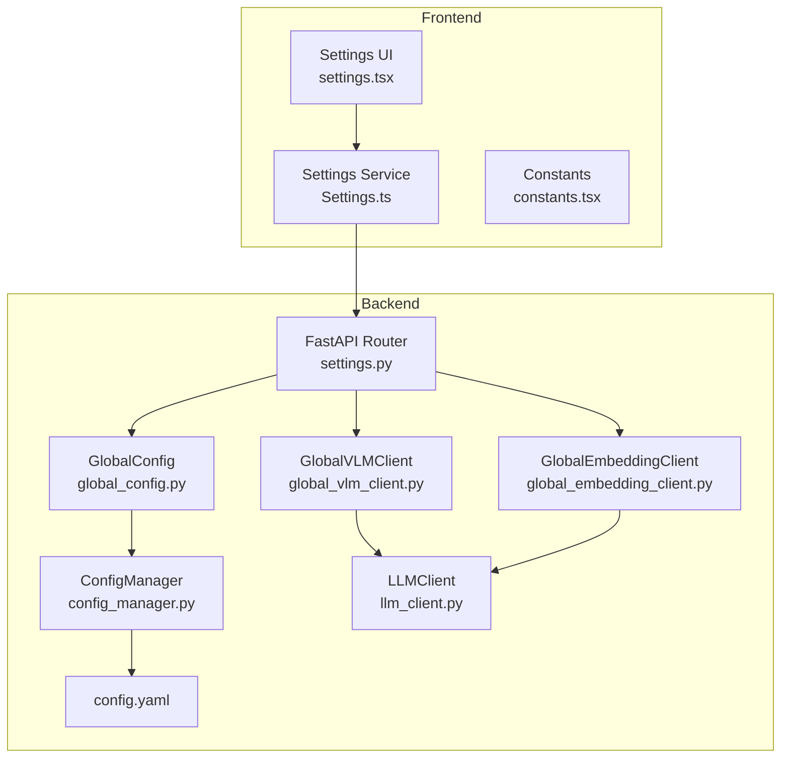
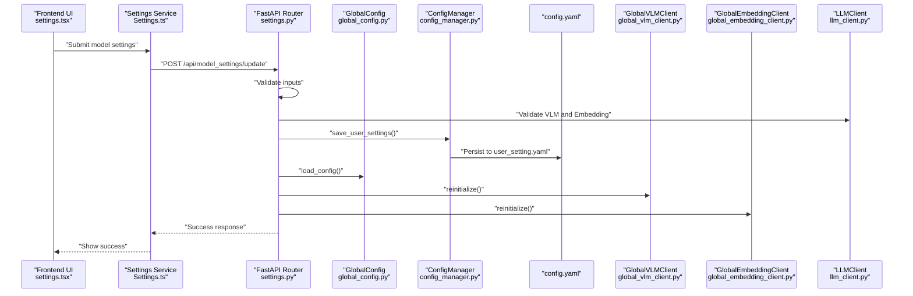
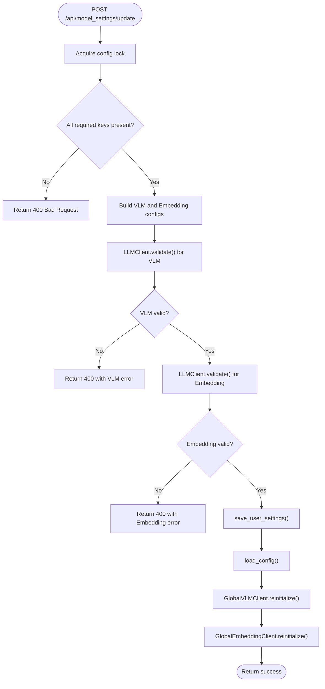
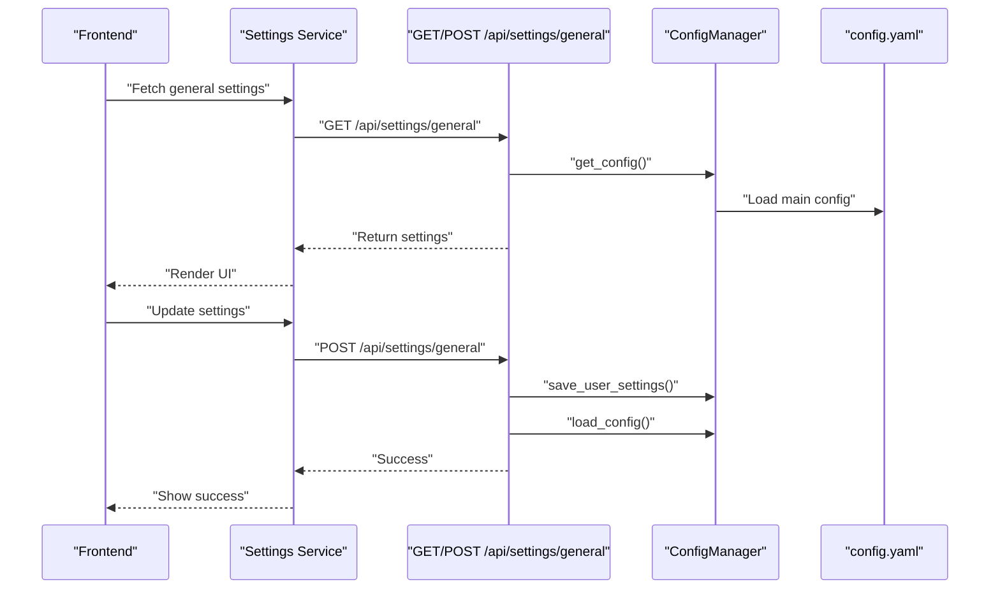
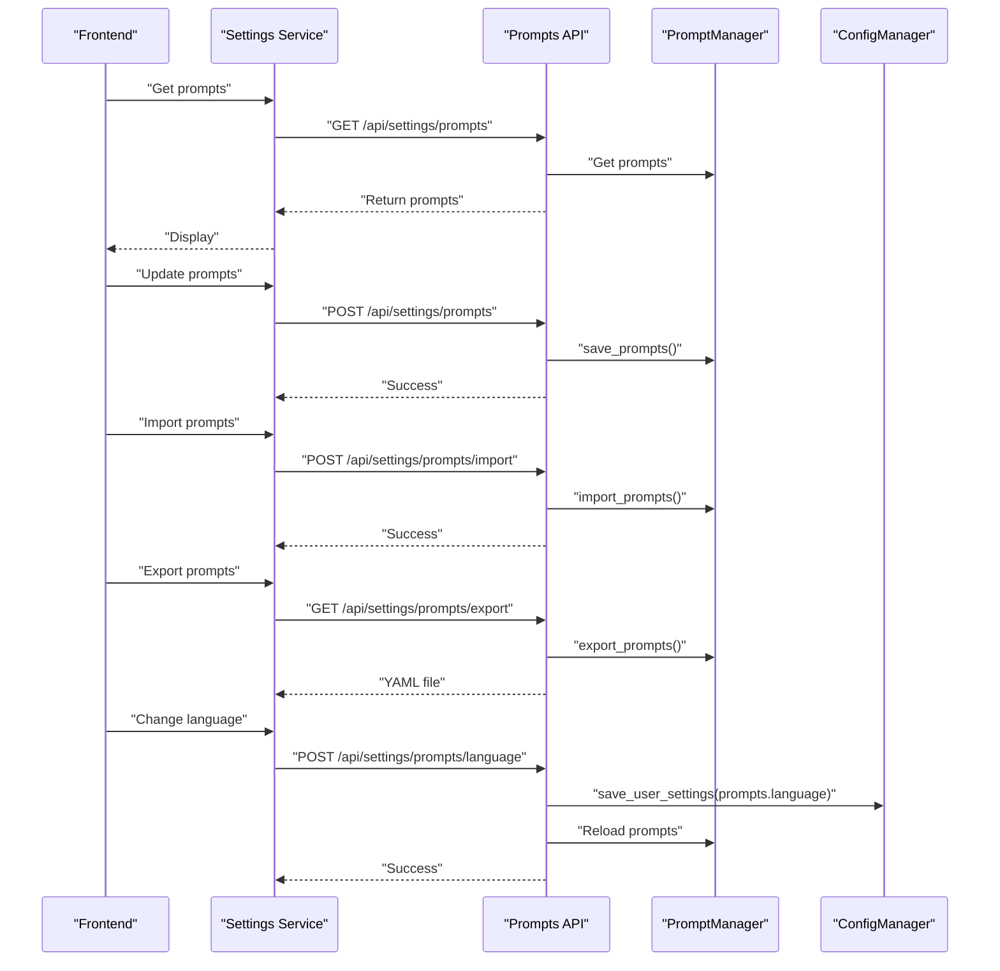
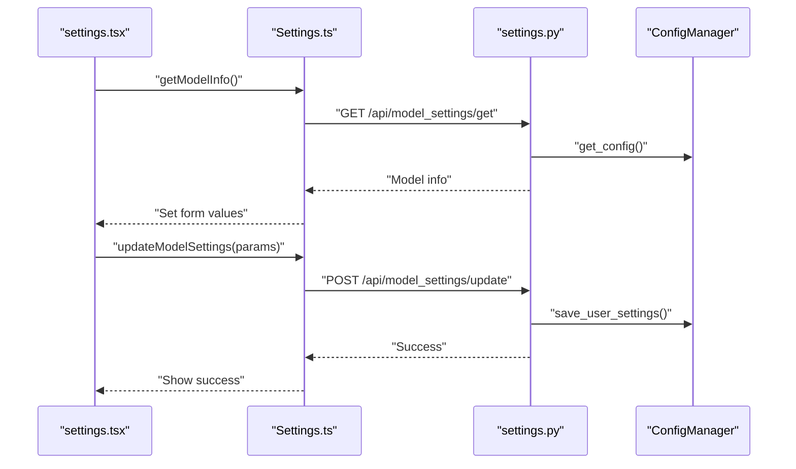
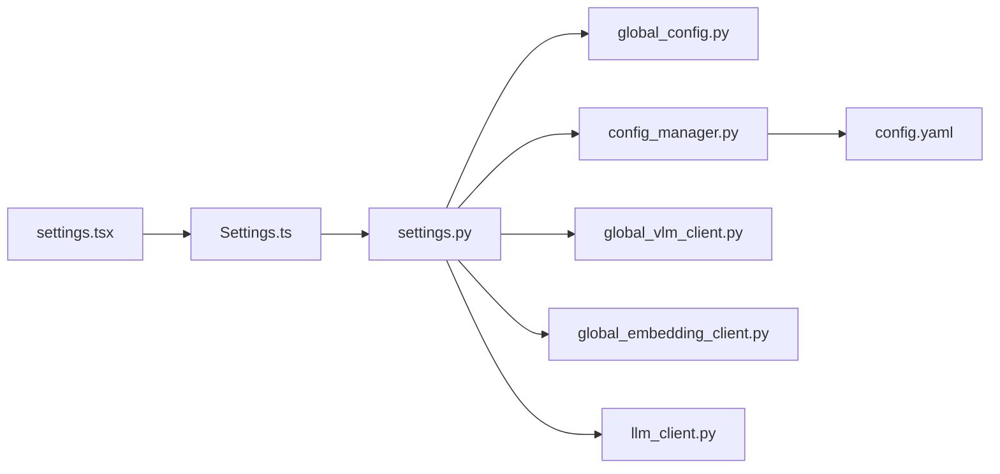

# Settings API

<cite>
**Referenced Files in This Document**
- [settings.py](file://opencontext/server/routes/settings.py)
- [config_manager.py](file://opencontext/config/config_manager.py)
- [global_config.py](file://opencontext/config/global_config.py)
- [config.yaml](file://config/config.yaml)
- [settings.tsx](file://frontend/src/renderer/src/pages/settings/settings.tsx)
- [Settings.ts](file://frontend/src/renderer/src/services/Settings.ts)
- [constants.tsx](file://frontend/src/renderer/src/pages/settings/constants.tsx)
- [global_vlm_client.py](file://opencontext/llm/global_vlm_client.py)
- [global_embedding_client.py](file://opencontext/llm/global_embedding_client.py)
- [llm_client.py](file://opencontext/llm/llm_client.py)
</cite>

## Table of Contents
1. [Introduction](#introduction)
2. [Project Structure](#project-structure)
3. [Core Components](#core-components)
4. [Architecture Overview](#architecture-overview)
5. [Detailed Component Analysis](#detailed-component-analysis)
6. [Dependency Analysis](#dependency-analysis)
7. [Performance Considerations](#performance-considerations)
8. [Troubleshooting Guide](#troubleshooting-guide)
9. [Conclusion](#conclusion)
10. [Appendices](#appendices)

## Introduction
This document describes the Settings API endpoints that manage application configuration. It covers:
- Retrieving and updating model settings (Vision-Language Model and Embedding)
- Retrieving and updating general system settings (capture, processing, logging, content generation)
- Managing prompts (get, update, import/export, language switching)
- Resetting settings to defaults
- How settings changes integrate with the configuration manager and configuration file
- How settings changes trigger system reconfiguration and client reinitialization
- Guidance for synchronizing settings between the frontend and backend

## Project Structure
The Settings API is implemented in the backend FastAPI router and integrates with the configuration manager and LLM clients. The frontend provides a settings UI that communicates with these endpoints.

**Diagram sources**
- [settings.py](file://opencontext/server/routes/settings.py#L79-L196)
- [global_config.py](file://opencontext/config/global_config.py#L153-L235)
- [config_manager.py](file://opencontext/config/config_manager.py#L168-L224)
- [config.yaml](file://config/config.yaml#L1-L253)
- [global_vlm_client.py](file://opencontext/llm/global_vlm_client.py#L94-L113)
- [global_embedding_client.py](file://opencontext/llm/global_embedding_client.py#L81-L100)
- [llm_client.py](file://opencontext/llm/llm_client.py#L344-L466)
- [settings.tsx](file://frontend/src/renderer/src/pages/settings/settings.tsx#L1-L337)
- [Settings.ts](file://frontend/src/renderer/src/services/Settings.ts#L1-L55)
- [constants.tsx](file://frontend/src/renderer/src/pages/settings/constants.tsx#L1-L79)

**Section sources**
- [settings.py](file://opencontext/server/routes/settings.py#L79-L196)
- [config_manager.py](file://opencontext/config/config_manager.py#L168-L224)
- [config.yaml](file://config/config.yaml#L1-L253)
- [settings.tsx](file://frontend/src/renderer/src/pages/settings/settings.tsx#L1-L337)
- [Settings.ts](file://frontend/src/renderer/src/services/Settings.ts#L1-L55)
- [constants.tsx](file://frontend/src/renderer/src/pages/settings/constants.tsx#L1-L79)

## Core Components
- Settings API endpoints in the backend router handle:
  - Model settings retrieval and update
  - General settings retrieval and update
  - Prompts management (get, update, import/export, language)
  - Reset settings to defaults
  - System info endpoint
- The configuration manager loads and merges configuration from the main YAML file and user settings, and persists updates to user_setting.yaml.
- Global configuration exposes centralized access to configuration and prompt managers.
- LLM clients are reinitialized after model settings updates to apply new credentials and endpoints.
- Frontend settings UI posts model settings to the backend and displays results.

**Section sources**
- [settings.py](file://opencontext/server/routes/settings.py#L79-L196)
- [config_manager.py](file://opencontext/config/config_manager.py#L168-L224)
- [global_config.py](file://opencontext/config/global_config.py#L153-L235)
- [global_vlm_client.py](file://opencontext/llm/global_vlm_client.py#L94-L113)
- [global_embedding_client.py](file://opencontext/llm/global_embedding_client.py#L81-L100)
- [settings.tsx](file://frontend/src/renderer/src/pages/settings/settings.tsx#L1-L337)
- [Settings.ts](file://frontend/src/renderer/src/services/Settings.ts#L1-L55)

## Architecture Overview
The Settings API follows a layered architecture:
- Presentation layer: FastAPI routes
- Domain layer: Pydantic models for request/response schemas
- Application layer: Validation and persistence logic
- Infrastructure layer: Config manager and LLM clients

**Diagram sources**
- [settings.py](file://opencontext/server/routes/settings.py#L108-L196)
- [global_config.py](file://opencontext/config/global_config.py#L153-L235)
- [config_manager.py](file://opencontext/config/config_manager.py#L168-L224)
- [config.yaml](file://config/config.yaml#L1-L253)
- [global_vlm_client.py](file://opencontext/llm/global_vlm_client.py#L94-L113)
- [global_embedding_client.py](file://opencontext/llm/global_embedding_client.py#L81-L100)
- [llm_client.py](file://opencontext/llm/llm_client.py#L344-L466)
- [settings.tsx](file://frontend/src/renderer/src/pages/settings/settings.tsx#L1-L337)
- [Settings.ts](file://frontend/src/renderer/src/services/Settings.ts#L1-L55)

## Detailed Component Analysis

### Model Settings Endpoints
- Endpoint: GET /api/model_settings/get
  - Purpose: Retrieve current model configuration (VLM and Embedding)
  - Response schema: GetModelSettingsResponse with a config object containing:
    - modelPlatform: string
    - modelId: string
    - baseUrl: string
    - apiKey: string
    - embeddingModelId: string
    - embeddingBaseUrl: string | null
    - embeddingApiKey: string | null
    - embeddingModelPlatform: string | null
  - Notes: Values are read from the merged configuration (main YAML plus user settings).

- Endpoint: POST /api/model_settings/update
  - Purpose: Update model configuration and reinitialize LLM clients
  - Request schema: UpdateModelSettingsRequest with a config object matching the response schema above
  - Validation rules:
    - VLM API key cannot be empty
    - Embedding API key cannot be empty
    - VLM model ID cannot be empty
    - Embedding model ID cannot be empty
    - Validates VLM and Embedding via LLMClient.validate()
  - Persistence:
    - Saves to user_setting.yaml under vlm_model and embedding_model
    - Reloads configuration
  - Reinitialization:
    - Reinitializes GlobalVLMClient and GlobalEmbeddingClient
  - Response: UpdateModelSettingsResponse with success and message

- Endpoint: POST /api/model_settings/validate
  - Purpose: Validate configuration without persisting
  - Request/Response: Same as update but returns success if both validations pass

**Diagram sources**
- [settings.py](file://opencontext/server/routes/settings.py#L108-L196)
- [llm_client.py](file://opencontext/llm/llm_client.py#L344-L466)
- [global_vlm_client.py](file://opencontext/llm/global_vlm_client.py#L94-L113)
- [global_embedding_client.py](file://opencontext/llm/global_embedding_client.py#L81-L100)

**Section sources**
- [settings.py](file://opencontext/server/routes/settings.py#L79-L196)
- [llm_client.py](file://opencontext/llm/llm_client.py#L344-L466)
- [global_vlm_client.py](file://opencontext/llm/global_vlm_client.py#L94-L113)
- [global_embedding_client.py](file://opencontext/llm/global_embedding_client.py#L81-L100)

### General Settings Endpoints
- Endpoint: GET /api/settings/general
  - Purpose: Retrieve general system settings (capture, processing, logging, content_generation)
  - Behavior: Reads from merged configuration; resolves environment variables in debug output path for display

- Endpoint: POST /api/settings/general
  - Purpose: Update general system settings
  - Request schema: GeneralSettingsRequest with optional fields capture, processing, logging, content_generation
  - Behavior:
    - Builds a settings dict from provided fields
    - Persists to user_setting.yaml
    - Reloads configuration

**Diagram sources**
- [settings.py](file://opencontext/server/routes/settings.py#L291-L367)
- [config_manager.py](file://opencontext/config/config_manager.py#L168-L224)
- [config.yaml](file://config/config.yaml#L1-L253)

**Section sources**
- [settings.py](file://opencontext/server/routes/settings.py#L291-L367)
- [config_manager.py](file://opencontext/config/config_manager.py#L168-L224)
- [config.yaml](file://config/config.yaml#L1-L253)

### Prompts Management Endpoints
- GET /api/settings/prompts
  - Purpose: Retrieve current prompts
  - Response: prompts object from prompt manager

- POST /api/settings/prompts
  - Purpose: Update prompts
  - Request: PromptsUpdateRequest with prompts object
  - Behavior: Persists to user_setting.yaml under prompts

- POST /api/settings/prompts/import
  - Purpose: Import prompts from a YAML file
  - Request: multipart/form-data with file field
  - Behavior: Imports YAML content into prompt manager

- GET /api/settings/prompts/export
  - Purpose: Export prompts as YAML file
  - Response: YAML content as downloadable file named prompts_<lang>.yaml

- GET /api/settings/prompts/language
  - Purpose: Get current prompt language
  - Response: language string

- POST /api/settings/prompts/language
  - Purpose: Change prompt language
  - Request: LanguageChangeRequest with language field constrained to zh or en
  - Behavior: Updates language in user settings, reloads prompts

**Diagram sources**
- [settings.py](file://opencontext/server/routes/settings.py#L370-L495)
- [global_config.py](file://opencontext/config/global_config.py#L187-L235)

**Section sources**
- [settings.py](file://opencontext/server/routes/settings.py#L370-L495)
- [global_config.py](file://opencontext/config/global_config.py#L187-L235)

### Reset Settings Endpoint
- Endpoint: POST /api/settings/reset
  - Purpose: Reset all user settings to defaults
  - Behavior: Deletes user_setting.yaml and reloads configuration

**Section sources**
- [settings.py](file://opencontext/server/routes/settings.py#L497-L531)
- [config_manager.py](file://opencontext/config/config_manager.py#L225-L253)

### System Info Endpoint
- Endpoint: GET /api/settings/system_info
  - Purpose: Get system information including data directory path
  - Response: context_path and context_path_absolute

**Section sources**
- [settings.py](file://opencontext/server/routes/settings.py#L256-L277)

### Frontend Integration
- Frontend settings UI:
  - Uses settings.tsx to render model selection and input fields
  - Uses Settings.ts to call GET /api/model_settings/get and POST /api/model_settings/update
  - Uses constants.tsx for model options and base URLs
- The UI formats the payload to match the backend schema and handles success/error messaging.

**Diagram sources**
- [settings.tsx](file://frontend/src/renderer/src/pages/settings/settings.tsx#L1-L337)
- [Settings.ts](file://frontend/src/renderer/src/services/Settings.ts#L1-L55)
- [settings.py](file://opencontext/server/routes/settings.py#L79-L196)
- [config_manager.py](file://opencontext/config/config_manager.py#L168-L224)

**Section sources**
- [settings.tsx](file://frontend/src/renderer/src/pages/settings/settings.tsx#L1-L337)
- [Settings.ts](file://frontend/src/renderer/src/services/Settings.ts#L1-L55)
- [constants.tsx](file://frontend/src/renderer/src/pages/settings/constants.tsx#L1-L79)

## Dependency Analysis
- Backend dependencies:
  - settings.py depends on GlobalConfig, ConfigManager, LLMClient, GlobalVLMClient, GlobalEmbeddingClient
  - ConfigManager depends on YAML and environment variable resolution
  - GlobalConfig manages ConfigManager and PromptManager instances
  - LLMClient validates configurations by making test API calls
- Frontend dependencies:
  - settings.tsx depends on Settings.ts and constants.tsx
  - Settings.ts depends on axios instance and defines typed interfaces for requests/responses

**Diagram sources**
- [settings.tsx](file://frontend/src/renderer/src/pages/settings/settings.tsx#L1-L337)
- [Settings.ts](file://frontend/src/renderer/src/services/Settings.ts#L1-L55)
- [settings.py](file://opencontext/server/routes/settings.py#L79-L196)
- [global_config.py](file://opencontext/config/global_config.py#L153-L235)
- [config_manager.py](file://opencontext/config/config_manager.py#L168-L224)
- [config.yaml](file://config/config.yaml#L1-L253)
- [global_vlm_client.py](file://opencontext/llm/global_vlm_client.py#L94-L113)
- [global_embedding_client.py](file://opencontext/llm/global_embedding_client.py#L81-L100)
- [llm_client.py](file://opencontext/llm/llm_client.py#L344-L466)

**Section sources**
- [settings.py](file://opencontext/server/routes/settings.py#L79-L196)
- [global_config.py](file://opencontext/config/global_config.py#L153-L235)
- [config_manager.py](file://opencontext/config/config_manager.py#L168-L224)
- [config.yaml](file://config/config.yaml#L1-L253)
- [global_vlm_client.py](file://opencontext/llm/global_vlm_client.py#L94-L113)
- [global_embedding_client.py](file://opencontext/llm/global_embedding_client.py#L81-L100)
- [llm_client.py](file://opencontext/llm/llm_client.py#L344-L466)
- [settings.tsx](file://frontend/src/renderer/src/pages/settings/settings.tsx#L1-L337)
- [Settings.ts](file://frontend/src/renderer/src/services/Settings.ts#L1-L55)

## Performance Considerations
- Validation calls to external LLM providers are synchronous and include timeouts; avoid frequent validation calls in rapid succession.
- Reinitializing LLM clients acquires locks and may block concurrent operations; batch settings updates when possible.
- Persisting user settings writes YAML files; ensure disk I/O is not a bottleneck in constrained environments.
- Environment variable resolution occurs during config load; keep environment variables minimal and deterministic.

[No sources needed since this section provides general guidance]

## Troubleshooting Guide
Common issues and resolutions:
- Validation failures:
  - Ensure API keys, base URLs, and model IDs are correct and not empty.
  - Check provider-specific quotas and model availability.
  - Review extracted error summaries returned by validation.
- Persistence failures:
  - Verify user_setting_path exists and is writable.
  - Confirm YAML formatting and keys match expected structure.
- Reinitialization failures:
  - After updating model settings, confirm GlobalVLMClient and GlobalEmbeddingClient reinitialize successfully.
- Frontend sync issues:
  - Ensure GET /api/model_settings/get is called after POST /api/model_settings/update to refresh UI state.
  - Confirm axios instance is configured to target the backend API.

**Section sources**
- [settings.py](file://opencontext/server/routes/settings.py#L108-L196)
- [llm_client.py](file://opencontext/llm/llm_client.py#L344-L466)
- [config_manager.py](file://opencontext/config/config_manager.py#L168-L224)
- [global_vlm_client.py](file://opencontext/llm/global_vlm_client.py#L94-L113)
- [global_embedding_client.py](file://opencontext/llm/global_embedding_client.py#L81-L100)

## Conclusion
The Settings API provides a comprehensive interface for managing application configuration, including model settings, general system settings, and prompts. It integrates tightly with the configuration manager and LLM clients to persist changes and apply them immediately. The frontend settings UI communicates with these endpoints to synchronize configuration state seamlessly.

[No sources needed since this section summarizes without analyzing specific files]

## Appendices

### Request and Response Schemas

- Model Settings
  - GET /api/model_settings/get
    - Response: GetModelSettingsResponse
      - config: ModelSettingsVO
        - modelPlatform: string
        - modelId: string
        - baseUrl: string
        - apiKey: string
        - embeddingModelId: string
        - embeddingBaseUrl: string | null
        - embeddingApiKey: string | null
        - embeddingModelPlatform: string | null
  - POST /api/model_settings/update
    - Request: UpdateModelSettingsRequest
      - config: ModelSettingsVO
    - Response: UpdateModelSettingsResponse
      - success: boolean
      - message: string
  - POST /api/model_settings/validate
    - Request: UpdateModelSettingsRequest
    - Response: Generic success/failure message indicating validation outcome

- General Settings
  - GET /api/settings/general
    - Response: Dictionary with keys capture, processing, logging, content_generation
  - POST /api/settings/general
    - Request: GeneralSettingsRequest
      - capture: dict | null
      - processing: dict | null
      - logging: dict | null
      - content_generation: dict | null
    - Response: Success message

- Prompts
  - GET /api/settings/prompts
    - Response: { prompts: object }
  - POST /api/settings/prompts
    - Request: PromptsUpdateRequest
      - prompts: object
  - POST /api/settings/prompts/import
    - Request: multipart/form-data with file
  - GET /api/settings/prompts/export
    - Response: YAML file attachment
  - GET /api/settings/prompts/language
    - Response: { language: string }
  - POST /api/settings/prompts/language
    - Request: LanguageChangeRequest
      - language: "zh" | "en"

- Reset and System Info
  - POST /api/settings/reset
    - Response: Success message
  - GET /api/settings/system_info
    - Response: { context_path: string, context_path_absolute: string }

**Section sources**
- [settings.py](file://opencontext/server/routes/settings.py#L79-L196)
- [settings.py](file://opencontext/server/routes/settings.py#L291-L367)
- [settings.py](file://opencontext/server/routes/settings.py#L370-L495)
- [settings.py](file://opencontext/server/routes/settings.py#L497-L531)
- [settings.py](file://opencontext/server/routes/settings.py#L256-L277)

### Configuration File Integration
- The configuration manager loads config/config.yaml and merges user_setting.yaml into the runtime configuration.
- Environment variables are resolved in-place during load.
- General settings endpoints write to user_setting.yaml under the appropriate sections.

**Section sources**
- [config_manager.py](file://opencontext/config/config_manager.py#L37-L119)
- [config_manager.py](file://opencontext/config/config_manager.py#L168-L224)
- [config.yaml](file://config/config.yaml#L1-L253)

### Frontend Settings Synchronization
- The frontend retrieves current settings via GET /api/model_settings/get and populates the form.
- On save, it posts to POST /api/model_settings/update and refreshes the form with the updated values.
- The UI uses constants for model options and base URLs and displays success/error messages.

**Section sources**
- [settings.tsx](file://frontend/src/renderer/src/pages/settings/settings.tsx#L1-L337)
- [Settings.ts](file://frontend/src/renderer/src/services/Settings.ts#L1-L55)
- [constants.tsx](file://frontend/src/renderer/src/pages/settings/constants.tsx#L1-L79)