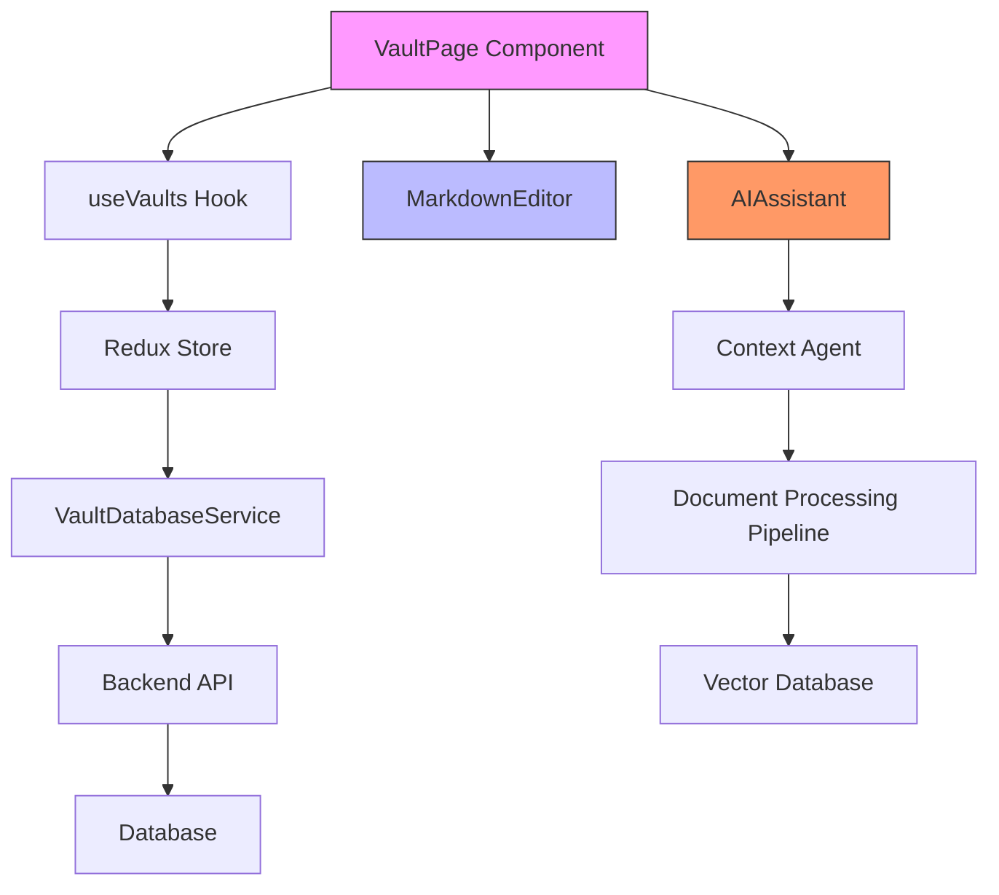
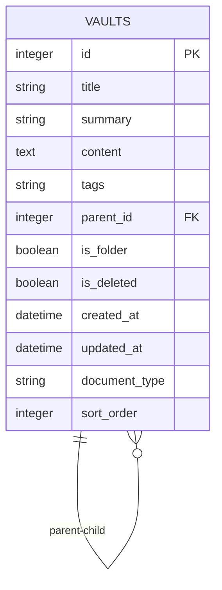
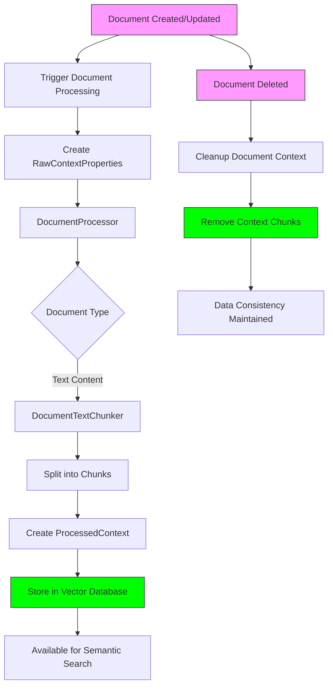

# Vaults API

<cite>
**Referenced Files in This Document**   
- [vaults.py](file://opencontext/server/routes/vaults.py)
- [vault_document_monitor.py](file://opencontext/context_capture/vault_document_monitor.py)
- [Vault.tsx](file://frontend/src/renderer/src/pages/vault/Vault.tsx)
- [vault.ts](file://frontend/src/renderer/src/types/vault.ts)
- [VaultDatabaseService.ts](file://frontend/src/main/services/VaultDatabaseService.ts)
- [sqlite_backend.py](file://opencontext/storage/backends/sqlite_backend.py)
- [unified_storage.py](file://opencontext/storage/unified_storage.py)
- [document_processor.py](file://opencontext/context_processing/processor/document_processor.py)
- [enums.py](file://opencontext/models/enums.py)
</cite>

## Table of Contents
1. [Introduction](#introduction)
2. [API Endpoints](#api-endpoints)
3. [Request and Response Schemas](#request-and-response-schemas)
4. [Vault Creation and Storage Configuration](#vault-creation-and-storage-configuration)
5. [File System Monitoring and Document Processing](#file-system-monitoring-and-document-processing)
6. [Frontend Integration](#frontend-integration)
7. [Database Schema](#database-schema)
8. [Processing Pipeline](#processing-pipeline)
9. [Vault Management and Synchronization](#vault-management-and-synchronization)
10. [Examples](#examples)
11. [Troubleshooting](#troubleshooting)

## Introduction

The Vaults API provides a comprehensive system for managing knowledge vaults within the application. It enables users to create, retrieve, update, and delete vault documents through a RESTful interface. The API serves as the backbone for the intelligent note-taking and knowledge management features, allowing users to organize information across different domains such as daily reports, weekly reports, and general notes.

The system integrates with a document processing pipeline that automatically analyzes and indexes vault content for enhanced search and retrieval capabilities. When a vault is created or modified, the system triggers asynchronous processing to extract semantic meaning, generate summaries, and create vector embeddings for AI-powered interactions. This integration enables advanced features like intelligent suggestions, context-aware completions, and semantic search across the user's knowledge base.

The Vaults API works in conjunction with the frontend Vault component to provide a seamless user experience for knowledge management. The API endpoints are designed to support both direct document manipulation and higher-level operations for organizing vaults into hierarchical structures. The system also includes monitoring capabilities to track changes to vaults and ensure data consistency across devices.

**Section sources**
- [vaults.py](file://opencontext/server/routes/vaults.py#L1-L424)

## API Endpoints

The Vaults API exposes several endpoints for managing knowledge vaults:

- **GET /api/vaults/list**: Retrieves a paginated list of vault documents with metadata including title, summary, creation date, update date, document type, and content length. This endpoint supports pagination through limit and offset parameters.

- **POST /api/vaults/create**: Creates a new vault document with the specified title, content, summary, tags, and document type. Upon successful creation, the system asynchronously triggers context processing to analyze and index the document content.

- **GET /api/vaults/{document_id}**: Retrieves the complete details of a specific vault document, including its full content, metadata, and timestamps. Returns a 404 error if the document is not found.

- **POST /api/vaults/{document_id}**: Updates an existing vault document with new content, title, summary, or tags. Before updating, the system cleans up existing context data and then triggers reprocessing of the updated content.

- **DELETE /api/vaults/{document_id}**: Performs a soft delete of a vault document by marking it as deleted in the database. The system asynchronously cleans up related context data to maintain data consistency.

- **GET /api/vaults/{document_id}/context**: Retrieves the context processing status for a specific document, including whether it has associated context data and the number of processed chunks.

- **GET /vaults**: Renders the main vaults workspace page as an HTML response, redirecting to the unified document collaboration interface.

- **GET /vaults/editor**: Renders the intelligent note editor page with AI completion functionality.

These endpoints provide a complete CRUD interface for vault management while integrating with the application's AI capabilities through asynchronous context processing. The API uses JSON responses with a consistent structure containing success status, data, and error information as needed.

**Section sources**
- [vaults.py](file://opencontext/server/routes/vaults.py#L77-L293)

## Request and Response Schemas

### Request Schema

The request schema for vault operations is defined by the `VaultDocument` model, which includes the following fields:

- **id** (optional integer): The unique identifier for the vault document
- **title** (string): The title of the vault document
- **content** (string): The main content of the vault document
- **summary** (optional string): A brief summary of the document content
- **tags** (optional string): Comma-separated tags for categorizing the document
- **document_type** (string): The type of document, defaulting to "note"

### Response Schema

The API returns JSON responses with a consistent structure:

```json
{
  "success": boolean,
  "data": object,
  "total": integer,
  "error": string
}
```

For the GET /api/vaults/list endpoint, the response includes an array of document objects with the following fields:
- **id**: Document identifier
- **title**: Document title
- **summary**: Truncated summary (first 100 characters with ellipsis if longer)
- **created_at**: Creation timestamp
- **updated_at**: Last update timestamp
- **document_type**: Document type (e.g., "note", "DailyReport")
- **content_length**: Length of the document content in characters

For document creation and update operations, the response includes:
- **doc_id**: The identifier of the created or updated document
- **table_name**: The database table name ("vaults")
- **context_processing**: Status indicator ("triggered" or "reprocessing")

For document deletion, the response includes:
- **context_cleanup**: Status indicator ("triggered")

Error responses include a "success": false flag and an error message describing the failure reason.

**Section sources**
- [vaults.py](file://opencontext/server/routes/vaults.py#L37-L46)
- [vaults.py](file://opencontext/server/routes/vaults.py#L109-L113)
- [vaults.py](file://opencontext/server/routes/vaults.py#L147-L154)
- [vaults.py](file://opencontext/server/routes/vaults.py#L242-L249)
- [vaults.py](file://opencontext/server/routes/vaults.py#L278-L284)

## Vault Creation and Storage Configuration

The vault creation process begins with a POST request to the /api/vaults/create endpoint, which accepts a VaultDocument object containing the document's title, content, summary, tags, and document type. The document_type field must be one of the predefined values from the VaultType enumeration: "DailyReport", "WeeklyReport", or "Note".

When a vault is created, the system stores the document in the SQLite database using the insert_vaults method of the storage backend. The database schema includes fields for hierarchical organization with parent_id and sort_order columns, allowing vaults to be organized in a tree structure. The is_folder field indicates whether a vault serves as a container for other vaults.

The storage configuration supports various document types through the document_type field, enabling specialized handling and display of different knowledge domains. For example, daily reports might have different processing rules or UI treatments compared to general notes. The tags field allows for flexible categorization and filtering of vaults across multiple dimensions.

After storing the document, the system triggers asynchronous context processing by adding a background task that calls the trigger_document_processing function. This ensures that the API response is not delayed by potentially time-consuming analysis operations. The processing pipeline will extract semantic information, generate embeddings, and make the content available for AI-powered features.

The system also supports hierarchical organization of vaults through the parent_id field, enabling users to create nested structures for better knowledge organization. The sort_order field allows for custom ordering of vaults within their parent container, providing flexibility in how content is presented to users.

**Section sources**
- [vaults.py](file://opencontext/server/routes/vaults.py#L116-L154)
- [unified_storage.py](file://opencontext/storage/unified_storage.py#L475-L495)
- [enums.py](file://opencontext/models/enums.py#L103-L109)
- [sqlite_backend.py](file://opencontext/storage/backends/sqlite_backend.py#L73-L87)

## File System Monitoring and Document Processing

The vault document monitoring system is implemented in the VaultDocumentMonitor class, which continuously monitors changes to the vaults table and generates context capture events. This component runs as a background thread that periodically scans for new or updated documents, with a configurable monitor_interval (default: 5 seconds).

The monitoring process works by tracking the _last_scan_time and comparing it with the created_at and updated_at timestamps of documents in the database. When a document is created or updated after the last scan time, the monitor creates an event that triggers the context processing pipeline. The system maintains a set of _processed_vault_ids to avoid reprocessing the same document multiple times.

When a change is detected, the monitor creates a RawContextProperties object containing the document's content, metadata, and source information. The source is set to ContextSource.VAULT, and the content_format is ContentFormat.TEXT. The additional_info dictionary includes the vault_id, title, summary, tags, document_type, and event_type (created, updated, or existing).

The document processing pipeline is implemented in the DocumentProcessor class, which handles various document types including text content from vaults. For vault documents, the processor uses the _process_text_content method, which chunks the document text using the DocumentTextChunker with a maximum chunk size of 1000 characters and 100-character overlap.

Each text chunk is converted into a ProcessedContext object containing:
- Raw context properties with metadata
- Extracted data including summary and keywords
- Vectorized text representation for semantic search
- Knowledge context metadata linking back to the original vault

The processed contexts are stored in the vector database (ChromaDB or Qdrant) through the batch_upsert_processed_context method, making them available for semantic search and AI-powered features. The system also maintains statistics on processing performance and can be configured with different batch sizes and timeouts.

**Section sources**
- [vault_document_monitor.py](file://opencontext/context_capture/vault_document_monitor.py#L26-L42)
- [vault_document_monitor.py](file://opencontext/context_capture/vault_document_monitor.py#L179-L247)
- [document_processor.py](file://opencontext/context_processing/processor/document_processor.py#L303-L311)
- [document_processor.py](file://opencontext/context_processing/processor/document_processor.py#L262-L302)

## Frontend Integration

The frontend Vault component is implemented in the VaultPage React component, which provides a user interface for viewing and editing vault documents. The component integrates with the backend API through the useVaults hook, which handles data fetching and mutation operations.

The VaultPage component uses a split-pane layout with the Allotment library, allowing users to view the document editor alongside the AI assistant panel. The editor supports Markdown formatting and includes real-time saving with debounced updates to prevent excessive API calls. Changes to the title, content, summary, or tags are automatically saved after a 300ms delay since the last change.

The component retrieves vault data using the findVaultById function from the useVaults hook, which queries the Redux store for the specified vault. When the component mounts, it extracts the vault ID from the URL query parameters and fetches the corresponding document. The content is displayed in a MarkdownEditor component that supports rich text editing with AI-powered completions.

The frontend implements a state management system using Redux, with actions for initializing vaults, adding new vaults, deleting vaults, renaming vaults, and updating vault content. The vault state is stored as a tree structure with nested children arrays, enabling hierarchical organization of vaults in the UI.

The AI integration is facilitated through the AIAssistant component, which can be toggled open to provide intelligent suggestions, completions, and insights based on the current vault content. When the AI assistant is active, it can access the current document context to provide relevant recommendations and generate content.

The frontend also handles vault synchronization across devices by listening for store sync events and updating the local state accordingly. This ensures that changes made on one device are reflected on other devices when they reconnect to the network.



**Diagram sources**
- [Vault.tsx](file://frontend/src/renderer/src/pages/vault/Vault.tsx#L22-L123)
- [use-vault.ts](file://frontend/src/renderer/src/hooks/use-vault.ts#L61-L105)
- [vault.ts](file://frontend/src/renderer/src/types/vault.ts#L14-L28)
- [vault.ts](file://frontend/src/renderer/src/store/vault.ts#L11-L146)

## Database Schema

The vaults database schema is implemented in the SQLiteBackend class and defines a comprehensive structure for storing and organizing knowledge vaults. The vaults table includes the following columns:

- **id**: Primary key with auto-increment (INTEGER)
- **title**: Document title (TEXT)
- **summary**: Brief summary of content (TEXT)
- **content**: Main document content (TEXT)
- **tags**: Comma-separated tags for categorization (TEXT)
- **parent_id**: Foreign key referencing parent vault for hierarchical organization (INTEGER)
- **is_folder**: Boolean flag indicating if the vault is a container (BOOLEAN, DEFAULT 0)
- **is_deleted**: Boolean flag for soft deletion (BOOLEAN, DEFAULT 0)
- **created_at**: Timestamp of creation (DATETIME, DEFAULT CURRENT_TIMESTAMP)
- **updated_at**: Timestamp of last update (DATETIME, DEFAULT CURRENT_TIMESTAMP)
- **document_type**: Type of document (TEXT, DEFAULT 'vaults')
- **sort_order**: Integer for custom ordering within parent (INTEGER, DEFAULT 0)

The schema supports hierarchical organization through the parent_id field, which creates a self-referencing foreign key relationship allowing vaults to be nested within other vaults. This enables users to create folder-like structures for organizing their knowledge.

Multiple indexes are created to optimize query performance:
- idx_vaults_created: Index on created_at for chronological queries
- idx_vaults_type: Index on document_type for filtering by document type
- idx_vaults_folder: Index on is_folder for identifying containers
- idx_vaults_deleted: Index on is_deleted for excluding deleted items
- idx_vaults_parent_id: Index on parent_id for hierarchical queries (frontend)

The database also includes other related tables such as todo, activity, and conversations, but the vaults table is specifically designed for long-form knowledge storage and retrieval. The schema supports soft deletion through the is_deleted flag, allowing documents to be hidden from normal views while preserving their data for potential restoration.



**Diagram sources**
- [sqlite_backend.py](file://opencontext/storage/backends/sqlite_backend.py#L73-L87)
- [DatabaseService.ts](file://frontend/src/main/services/DatabaseService.ts#L114-L127)

## Processing Pipeline

The vault document processing pipeline is a sophisticated system that transforms raw document content into structured, searchable knowledge. When a vault is created or updated, the system triggers this pipeline asynchronously to extract semantic meaning and enable AI-powered features.

The pipeline begins with the trigger_document_processing function, which creates a RawContextProperties object containing the document's content and metadata. This object is then passed to the DocumentProcessor, which determines the appropriate processing strategy based on the content type.

For vault documents, the processor uses the _process_text_content method, which employs the DocumentTextChunker to split the content into manageable chunks. The chunker is configured with a maximum chunk size of 1000 characters and a 100-character overlap to preserve context between chunks. This ensures that semantic meaning is maintained even when content is split across multiple chunks.

Each text chunk is converted into a ProcessedContext object that includes:
- Raw context properties with metadata about the source document
- Extracted data containing the chunk text as a summary
- Vectorized representation of the text for semantic search
- Knowledge context metadata linking back to the original vault

The processed contexts are stored in the vector database through the batch_upsert_processed_context method, making them available for semantic search and AI-powered features. The system uses either ChromaDB or Qdrant as the vector database backend, depending on the configuration.

The pipeline also includes error handling and performance monitoring. If processing fails, the system records the error and continues with other documents. Performance metrics are collected for each processing operation, including duration and context count, which can be used for optimization and debugging.

When a document is deleted, the system triggers the cleanup_document_context function, which uses the DocumentManagementTool to remove all associated context chunks from the vector database. This ensures data consistency and prevents orphaned data from consuming storage space.

The entire pipeline is designed to be asynchronous and non-blocking, ensuring that API responses are fast while still providing comprehensive document analysis. Background tasks handle the processing, allowing the main application to remain responsive even when dealing with large documents or high volumes of changes.



**Diagram sources**
- [vaults.py](file://opencontext/server/routes/vaults.py#L314-L361)
- [document_processor.py](file://opencontext/context_processing/processor/document_processor.py#L223-L245)
- [document_processor.py](file://opencontext/context_processing/processor/document_processor.py#L303-L311)
- [vaults.py](file://opencontext/server/routes/vaults.py#L363-L390)

## Vault Management and Synchronization

Vault management is implemented through a combination of backend API endpoints and frontend components that work together to provide a seamless user experience. The system supports hierarchical organization of vaults through parent-child relationships, allowing users to create nested structures for better knowledge organization.

The frontend Vault component provides a tree-based interface for navigating and managing vaults, with support for drag-and-drop reordering and folder creation. When a user moves a vault to a new location or changes its position, the updateVaultPosition action is dispatched, which updates the parent_id and sort_order fields in the database.

Synchronization across devices is handled through the store sync system, which propagates changes to vaults between devices. When a vault is created, updated, or deleted on one device, the change is serialized and sent to other connected devices. The VaultDatabaseService handles the application of these changes to the local database, ensuring consistency across the user's devices.

The system supports soft deletion through the is_deleted flag, allowing users to remove vaults from view without permanently losing the data. Deleted vaults can be restored by clearing the is_deleted flag, providing a safety net against accidental deletions. The cleanup_document_context function ensures that associated context data is removed when a vault is deleted, maintaining data integrity.

The API provides endpoints for bulk operations and filtering, such as retrieving recently updated vaults or vaults within a specific time range. These features enable efficient management of large vault collections and support use cases like daily review of recent changes.

The system also includes error handling and conflict resolution for synchronization scenarios. When conflicts occur (e.g., the same vault is modified on two devices simultaneously), the system uses timestamp-based resolution, favoring the most recent change. Users can also manually resolve conflicts through the UI when necessary.

**Section sources**
- [Vault.tsx](file://frontend/src/renderer/src/pages/vault/Vault.tsx#L22-L123)
- [vault.ts](file://frontend/src/renderer/src/store/vault.ts#L89-L139)
- [VaultDatabaseService.ts](file://frontend/src/main/services/VaultDatabaseService.ts#L372-L411)
- [vaults.py](file://opencontext/server/routes/vaults.py#L261-L292)

## Examples

### Creating a Daily Report Vault

To create a daily report vault, send a POST request to /api/vaults/create with the following JSON payload:

```json
{
  "title": "Daily Report - 2025-01-15",
  "content": "Today I worked on the Vaults API documentation. Completed the initial draft and integrated with the frontend components. Also fixed several bugs in the document processing pipeline.",
  "summary": "Worked on Vaults API documentation and fixed bugs in processing pipeline",
  "tags": "documentation,api,bug-fix",
  "document_type": "DailyReport"
}
```

The response will indicate success and provide the document ID:

```json
{
  "success": true,
  "message": "Document created successfully",
  "doc_id": 123,
  "table_name": "vaults",
  "context_processing": "triggered"
}
```

### Retrieving Vault Contents

To retrieve the contents of a specific vault, send a GET request to /api/vaults/123:

```json
{
  "success": true,
  "data": {
    "id": 123,
    "title": "Daily Report - 2025-01-15",
    "content": "Today I worked on the Vaults API documentation. Completed the initial draft and integrated with the frontend components. Also fixed several bugs in the document processing pipeline.",
    "summary": "Worked on Vaults API documentation and fixed bugs in processing pipeline",
    "tags": "documentation,api,bug-fix",
    "created_at": "2025-01-15T10:30:00Z",
    "updated_at": "2025-01-15T10:30:00Z",
    "document_type": "DailyReport"
  }
}
```

### Creating a Knowledge Domain Vault

To create a vault for a specific knowledge domain (e.g., machine learning), use:

```json
{
  "title": "Machine Learning Concepts",
  "content": "# Neural Networks\nNeural networks are computing systems inspired by biological neural networks...\n\n# Gradient Descent\nGradient descent is an optimization algorithm used to minimize a function...\n\n# Overfitting\nOverfitting occurs when a model learns the training data too well...",
  "summary": "Collection of machine learning concepts and definitions",
  "tags": "machine-learning,concepts,study",
  "document_type": "Note"
}
```

### Importing Documents into Vaults

To import an existing document into a vault, first create the vault with the document content, then the system will automatically process the content through the document processing pipeline. For example, to import a research paper:

```json
{
  "title": "Attention Is All You Need",
  "content": "[Full text of the research paper]",
  "summary": "Seminal paper introducing the Transformer architecture for neural networks",
  "tags": "research,paper,transformer,nlp",
  "document_type": "Note"
}
```

The system will chunk the content and create vector embeddings, making the paper's content searchable and available for AI-powered features.

**Section sources**
- [vaults.py](file://opencontext/server/routes/vaults.py#L116-L154)
- [vaults.py](file://opencontext/server/routes/vaults.py#L204-L250)

## Troubleshooting

### Common Issues and Solutions

**Issue: Vault creation fails with 500 error**
- **Cause**: Database connection issues or invalid input data
- **Solution**: Check server logs for specific error messages. Validate that the request payload contains valid JSON and required fields. Ensure the database file is writable and not corrupted.

**Issue: Document content not appearing in AI suggestions**
- **Cause**: Context processing pipeline failed to execute
- **Solution**: Check if the trigger_document_processing function was called after vault creation. Verify that the DocumentProcessor is running and has access to the required dependencies. Check the vector database connection.

**Issue: Vault synchronization problems across devices**
- **Cause**: Network connectivity issues or conflicting changes
- **Solution**: Ensure all devices are connected to the same synchronization service. Check for timestamp conflicts in the store sync logs. Restart the synchronization service if necessary.

**Issue: Slow vault loading times**
- **Cause**: Large document size or inefficient queries
- **Solution**: Implement pagination for large vault lists. Ensure database indexes are properly created. Consider chunking very large documents into smaller vaults.

**Issue: Deleted vaults reappearing**
- **Cause**: Soft deletion not properly synchronized
- **Solution**: Verify that the is_deleted flag is being properly set and synchronized across devices. Check that the cleanup_document_context function is being called after deletion.

### Monitoring and Debugging

The system provides several endpoints and tools for monitoring and debugging vault operations:

- **GET /api/vaults/{document_id}/context**: Check the context processing status for a specific document
- **Monitoring tables**: The database includes monitoring_data_stats, monitoring_stage_timing, and monitoring_token_usage tables for tracking system performance
- **Log files**: The system logs detailed information about vault operations, including creation, updates, and processing events
- **Statistics endpoint**: The VaultDocumentMonitor provides status information including processed vault count and pending events

When troubleshooting, first check the server logs for error messages related to vault operations. Then verify the database state by querying the vaults table directly. Finally, check the status of background processes like the document monitor and processor to ensure they are running correctly.

**Section sources**
- [vaults.py](file://opencontext/server/routes/vaults.py#L295-L308)
- [vault_document_monitor.py](file://opencontext/context_capture/vault_document_monitor.py#L354-L367)
- [vaults.py](file://opencontext/server/routes/vaults.py#L156-L158)
- [vaults.py](file://opencontext/server/routes/vaults.py#L256-L258)