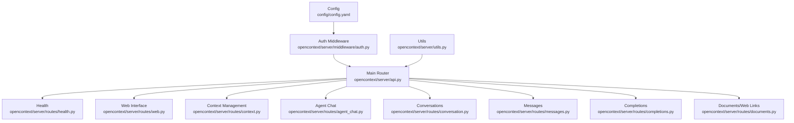
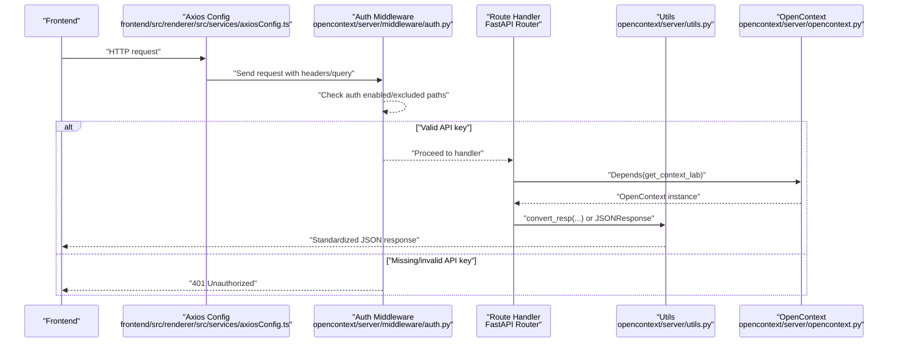
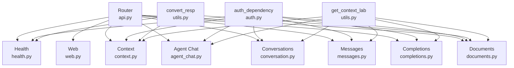

# API Endpoints

<cite>
**Referenced Files in This Document**
- [api.py](file://opencontext/server/api.py)
- [health.py](file://opencontext/server/routes/health.py)
- [auth.py](file://opencontext/server/middleware/auth.py)
- [utils.py](file://opencontext/server/utils.py)
- [config.yaml](file://config/config.yaml)
- [context.py](file://opencontext/server/routes/context.py)
- [agent_chat.py](file://opencontext/server/routes/agent_chat.py)
- [conversation.py](file://opencontext/server/routes/conversation.py)
- [messages.py](file://opencontext/server/routes/messages.py)
- [completions.py](file://opencontext/server/routes/completions.py)
- [documents.py](file://opencontext/server/routes/documents.py)
- [web.py](file://opencontext/server/routes/web.py)
- [axiosConfig.ts](file://frontend/src/renderer/src/services/axiosConfig.ts)
- [api_auth.js](file://opencontext/web/static/js/api_auth.js)
</cite>

## Table of Contents
1. [Introduction](#introduction)
2. [Project Structure](#project-structure)
3. [Core Components](#core-components)
4. [Architecture Overview](#architecture-overview)
5. [Detailed Component Analysis](#detailed-component-analysis)
6. [Dependency Analysis](#dependency-analysis)
7. [Performance Considerations](#performance-considerations)
8. [Troubleshooting Guide](#troubleshooting-guide)
9. [Conclusion](#conclusion)
10. [Appendices](#appendices)

## Introduction
This document provides comprehensive API documentation for the MineContext backend REST API. It covers the main router configuration, endpoint groups, HTTP methods, URL patterns, request/response schemas, authentication requirements, and operational guidance. It also explains the health check endpoint, agent chat endpoints for AI-powered conversation with context awareness, context management endpoints for retrieving and managing captured context data, and the authentication middleware. Guidance on rate limiting and versioning is included, along with examples of request/response payloads and how frontend components use these endpoints.

## Project Structure
The backend API is organized around a central router that includes multiple route modules. Each module encapsulates a functional domain (e.g., health, context, agent chat, completions, documents, web interface). The authentication middleware enforces API key validation and supports excluded paths. Utilities standardize response formatting.

**Diagram sources**
- [api.py](file://opencontext/server/api.py#L1-L58)
- [health.py](file://opencontext/server/routes/health.py#L1-L47)
- [web.py](file://opencontext/server/routes/web.py#L1-L181)
- [context.py](file://opencontext/server/routes/context.py#L1-L146)
- [agent_chat.py](file://opencontext/server/routes/agent_chat.py#L1-L367)
- [conversation.py](file://opencontext/server/routes/conversation.py#L1-L234)
- [messages.py](file://opencontext/server/routes/messages.py#L1-L316)
- [completions.py](file://opencontext/server/routes/completions.py#L1-L329)
- [documents.py](file://opencontext/server/routes/documents.py#L1-L101)
- [auth.py](file://opencontext/server/middleware/auth.py#L1-L113)
- [utils.py](file://opencontext/server/utils.py#L1-L41)
- [config.yaml](file://config/config.yaml#L1-L253)

**Section sources**
- [api.py](file://opencontext/server/api.py#L1-L58)

## Core Components
- Main Router: Aggregates all route modules under a single APIRouter.
- Health Check: Provides lightweight and detailed health endpoints plus authentication status.
- Authentication Middleware: Validates API keys from configuration and supports excluded paths.
- Utilities: Standardized JSON response wrapper and OpenContext dependency injection.
- Route Modules: Group endpoints by domain (context, agent chat, conversations/messages, completions, documents, web).

**Section sources**
- [api.py](file://opencontext/server/api.py#L1-L58)
- [health.py](file://opencontext/server/routes/health.py#L1-L47)
- [auth.py](file://opencontext/server/middleware/auth.py#L1-L113)
- [utils.py](file://opencontext/server/utils.py#L1-L41)

## Architecture Overview
The backend exposes REST endpoints grouped by functionality. Authentication is enforced globally via a dependency that checks configuration and excluded paths. Responses are standardized using a utility that wraps data with code, status, and message fields. Some endpoints stream data (e.g., agent chat streaming) and others return structured JSON.

**Diagram sources**
- [axiosConfig.ts](file://frontend/src/renderer/src/services/axiosConfig.ts#L1-L62)
- [auth.py](file://opencontext/server/middleware/auth.py#L1-L113)
- [utils.py](file://opencontext/server/utils.py#L1-L41)
- [api.py](file://opencontext/server/api.py#L1-L58)

## Detailed Component Analysis

### Health Check Endpoints
- Endpoint: GET /api/health
  - Purpose: Detailed health check including component status.
  - Response: Standardized JSON with code, status, message, and data containing service and component health.
  - Error: Returns 503 with standardized error payload if health check fails.
  - Authentication: Not enforced by default; can be excluded via configuration.

- Endpoint: GET /health
  - Purpose: Lightweight health check returning basic status.
  - Response: Standardized JSON with code, status, message, and data indicating service health.

- Endpoint: GET /api/auth/status
  - Purpose: Reports whether API authentication is enabled on the server.
  - Response: Standardized JSON with data.auth_enabled.

**Section sources**
- [health.py](file://opencontext/server/routes/health.py#L1-L47)
- [utils.py](file://opencontext/server/utils.py#L1-L41)
- [config.yaml](file://config/config.yaml#L192-L211)

### Authentication Middleware
- Configuration:
  - Enabled: api_auth.enabled
  - API Keys: api_auth.api_keys
  - Excluded Paths: api_auth.excluded_paths (supports wildcards)

- Validation Logic:
  - If authentication is disabled, requests are allowed.
  - If the current path matches an excluded pattern, requests are allowed.
  - Otherwise, the request must include a valid API key via X-API-Key header or api_key query parameter.
  - Invalid or missing keys result in 401 Unauthorized.

- Dependency Injection:
  - auth_dependency is used across routes to enforce validation.

**Section sources**
- [auth.py](file://opencontext/server/middleware/auth.py#L1-L113)
- [config.yaml](file://config/config.yaml#L192-L211)

### Context Management Endpoints
- Endpoint: POST /contexts/delete
  - Purpose: Delete a processed context by ID and type.
  - Request Body: ContextDetailRequest with id and context_type.
  - Response: Standardized JSON with message on success; raises 404 if not found.

- Endpoint: POST /contexts/detail
  - Purpose: Render context detail page (HTML).
  - Request Body: ContextDetailRequest with id and context_type.
  - Response: HTML template rendering context details; returns 404 if not found.

- Endpoint: GET /api/context_types
  - Purpose: Retrieve all available context types.
  - Response: Array of context types; returns 500 on failure.

- Endpoint: POST /api/vector_search
  - Purpose: Direct vector database search without LLM.
  - Request Body: VectorSearchRequest with query, top_k, context_types, filters.
  - Response: Standardized JSON with results, total, query, top_k, context_types, filters; returns 500 on failure.

**Section sources**
- [context.py](file://opencontext/server/routes/context.py#L1-L146)
- [utils.py](file://opencontext/server/utils.py#L1-L41)

### Agent Chat Endpoints (AI-Powered Conversations)
- Prefix: /api/agent
- Endpoint: POST /chat
  - Purpose: Non-streaming intelligent chat.
  - Request Body: ChatRequest with query, context, session_id, user_id, conversation_id.
  - Response: ChatResponse with success, workflow_id, stage, query, and optional intent/context/execution/reflection/errors.

- Endpoint: POST /chat/stream
  - Purpose: Streaming intelligent chat.
  - Request Body: Same as POST /chat.
  - Response: Server-Sent Events (SSE) stream with session_start, stream chunks, and completion/failure events.
  - Behavior: Creates user and assistant messages when conversation_id is provided; supports interruption via cancellation.

- Endpoint: POST /resume/{workflow_id}
  - Purpose: Resume workflow execution.
  - Request Body: ResumeRequest with workflow_id and optional user_input.
  - Response: ChatResponse mirroring POST /chat.

- Endpoint: GET /state/{workflow_id}
  - Purpose: Get workflow state.
  - Response: JSON with success and state or error.

- Endpoint: DELETE /cancel/{workflow_id}
  - Purpose: Cancel workflow.
  - Response: JSON with success and message or error.

- Endpoint: GET /test
  - Purpose: Test agent availability.
  - Response: JSON with success, message, and test_response.

**Section sources**
- [agent_chat.py](file://opencontext/server/routes/agent_chat.py#L1-L367)

### Conversation Management Endpoints
- Prefix: /api/agent/chat
- Endpoint: POST /conversations
  - Purpose: Create a new conversation.
  - Request Body: CreateConversationRequest with page_name and optional document_id.
  - Response: ConversationResponse with id, title, user_id, timestamps, metadata, page_name, status.

- Endpoint: GET /conversations/list
  - Purpose: List conversations with pagination and filters.
  - Query Parameters: limit, offset, page_name, user_id, status.
  - Response: GetConversationListResponse with items and total.

- Endpoint: GET /conversations/{cid}
  - Purpose: Get a single conversation’s details.
  - Response: ConversationResponse; returns 404 if not found.

- Endpoint: PATCH /conversations/{cid}/update
  - Purpose: Update a conversation’s title.
  - Request Body: UpdateConversationRequest with title.
  - Response: ConversationResponse; returns 404 if not found or update failed.

- Endpoint: DELETE /conversations/{cid}/update
  - Purpose: Soft delete a conversation (mark as deleted).
  - Response: DeleteConversationResponse with success and id; returns 404 if not found or delete failed.

**Section sources**
- [conversation.py](file://opencontext/server/routes/conversation.py#L1-L234)

### Message Management Endpoints
- Prefix: /api/agent/chat
- Endpoint: POST /message/{mid}/create
  - Purpose: Create a new message.
  - Request Body: CreateMessageParams with conversation_id, role, content, is_complete, token_count; mid is parent_message_id.
  - Response: Integer message_id; returns 500 on failure.

- Endpoint: POST /message/stream/{mid}/create
  - Purpose: Create a streaming message placeholder.
  - Request Body: CreateStreamingMessageParams with conversation_id, role; mid is parent_message_id.
  - Response: Integer message_id; returns 500 on failure.

- Endpoint: POST /message/{mid}/update
  - Purpose: Update a message’s content.
  - Request Body: UpdateMessageContentParams with message_id, new_content, is_complete, token_count.
  - Response: Boolean success; returns 404 if not found or update failed.

- Endpoint: POST /message/{mid}/append
  - Purpose: Append content to an existing message (streaming).
  - Request Body: AppendMessageContentParams with message_id, content_chunk, token_count.
  - Response: Boolean success; returns 404 if not found or append failed.

- Endpoint: POST /message/{mid}/finished
  - Purpose: Mark a message as complete.
  - Response: Boolean success; returns 404 if not found or update failed.

- Endpoint: GET /conversations/{cid}/messages
  - Purpose: Get all messages for a specific conversation.
  - Response: Array of ConversationMessage; returns 500 on failure.

- Endpoint: POST /messages/{mid}/interrupt
  - Purpose: Interrupt message generation (mark as cancelled).
  - Response: MessageInterruptResponse with message_id; returns 404 if not found or interrupt failed.

**Section sources**
- [messages.py](file://opencontext/server/routes/messages.py#L1-L316)

### Completions Endpoints (Intelligent Note Completion)
- Endpoint: POST /api/completions/suggest
  - Purpose: Get intelligent completion suggestions.
  - Request Body: CompletionRequest with text, cursor_position, document_id, completion_types, max_suggestions, context.
  - Response: JSON with success, suggestions, processing_time_ms, cache_hit, timestamp; returns 400/500 on validation/error.

- Endpoint: POST /api/completions/suggest/stream
  - Purpose: Stream completion suggestions.
  - Request Body: Same as POST /api/completions/suggest.
  - Response: SSE stream with start, processing, suggestion, complete, and [DONE] events.

- Endpoint: POST /api/completions/feedback
  - Purpose: Submit completion feedback to improve quality.
  - Query Parameters: suggestion_text, document_id, accepted, completion_type.
  - Response: JSON with success and message or error.

- Endpoint: GET /api/completions/stats
  - Purpose: Get completion service statistics.
  - Response: JSON with success, data including service_status, cache_stats, supported_types, timestamp.

- Endpoint: GET /api/completions/cache/stats
  - Purpose: Get completion cache statistics.
  - Response: JSON with success, data, timestamp.

- Endpoint: POST /api/completions/cache/optimize
  - Purpose: Optimize completion cache.
  - Response: JSON with success, message, and stats.

- Endpoint: POST /api/completions/precompute/{document_id}
  - Purpose: Precompute document context.
  - Request Body: JSON with content.
  - Response: JSON with success and message.

- Endpoint: POST /api/completions/cache/clear
  - Purpose: Clear completion cache.
  - Response: JSON with success and message.

**Section sources**
- [completions.py](file://opencontext/server/routes/completions.py#L1-L329)

### Documents and Web Links Endpoints
- Endpoint: POST /api/documents/upload
  - Purpose: Queue a local document for processing.
  - Request Body: UploadDocumentRequest with file_path.
  - Response: Standardized JSON; returns 400/500 on failure.

- Endpoint: POST /api/weblinks/upload
  - Purpose: Submit a web link to be converted to PDF and processed.
  - Request Body: UploadWebLinkRequest with url and optional filename_hint.
  - Response: Standardized JSON; initializes capture component if needed and triggers immediate capture.

**Section sources**
- [documents.py](file://opencontext/server/routes/documents.py#L1-L101)
- [utils.py](file://opencontext/server/utils.py#L1-L41)

### Web Interface Endpoints
- Endpoint: GET /
  - Purpose: Redirect to contexts page.

- Endpoint: GET /contexts
  - Purpose: Render contexts page with pagination and type filter.

- Endpoint: GET /vector_search
  - Purpose: Render vector search page.

- Endpoint: GET /debug
  - Purpose: Render debug page.

- Endpoint: GET /chat
  - Purpose: Redirect to advanced chat.

- Endpoint: GET /advanced_chat
  - Purpose: Redirect to vaults.

- Endpoint: GET /files/{file_path:path}
  - Purpose: Serve files from allowed directories with security checks; returns 403/404 on violations.

- Endpoint: GET /monitoring
  - Purpose: Render monitoring page.

- Endpoint: GET /assistant
  - Purpose: Render intelligent assistant page.

- Endpoint: GET /settings
  - Purpose: Render system settings page.

**Section sources**
- [web.py](file://opencontext/server/routes/web.py#L1-L181)

## Dependency Analysis
- Router Composition: The main router includes all route modules, enabling centralized endpoint registration.
- Authentication Dependency: auth_dependency is injected into route handlers to enforce API key validation and excluded path logic.
- Response Standardization: convert_resp ensures consistent JSON responses across endpoints.
- OpenContext Dependency: get_context_lab injects the OpenContext instance for handlers that require it.

**Diagram sources**
- [api.py](file://opencontext/server/api.py#L1-L58)
- [auth.py](file://opencontext/server/middleware/auth.py#L1-L113)
- [utils.py](file://opencontext/server/utils.py#L1-L41)
- [health.py](file://opencontext/server/routes/health.py#L1-L47)
- [context.py](file://opencontext/server/routes/context.py#L1-L146)
- [agent_chat.py](file://opencontext/server/routes/agent_chat.py#L1-L367)
- [conversation.py](file://opencontext/server/routes/conversation.py#L1-L234)
- [messages.py](file://opencontext/server/routes/messages.py#L1-L316)
- [completions.py](file://opencontext/server/routes/completions.py#L1-L329)
- [documents.py](file://opencontext/server/routes/documents.py#L1-L101)
- [web.py](file://opencontext/server/routes/web.py#L1-L181)

**Section sources**
- [api.py](file://opencontext/server/api.py#L1-L58)
- [auth.py](file://opencontext/server/middleware/auth.py#L1-L113)
- [utils.py](file://opencontext/server/utils.py#L1-L41)

## Performance Considerations
- Streaming Endpoints: Agent chat streaming and completions streaming endpoints reduce perceived latency by delivering incremental updates. Ensure clients handle SSE gracefully and close connections on navigation or interruption.
- Vector Search: The vector search endpoint bypasses LLM, minimizing cost and latency for pure retrieval tasks.
- Caching: Completions endpoints expose cache statistics and optimization operations; leverage these to improve throughput.
- Pagination: Conversation listing uses limit/offset; tune values to balance responsiveness and load.
- Rate Limiting: No built-in rate limiting is present in the provided code. Consider integrating rate limiting at the gateway or middleware layer to protect backend resources.

[No sources needed since this section provides general guidance]

## Troubleshooting Guide
- Authentication Failures:
  - Symptom: 401 Unauthorized on protected endpoints.
  - Cause: Missing or invalid API key; authentication enabled; path not excluded.
  - Resolution: Provide a valid API key via X-API-Key header or api_key query parameter; confirm configuration.

- Health Check Issues:
  - Symptom: 503 Service Unavailable on /api/health.
  - Cause: Component health check failure.
  - Resolution: Inspect logs and component initialization; fix configuration.

- Context Operations:
  - Symptom: 404 Not Found when deleting or retrieving context.
  - Cause: Invalid id or context_type; context not found.
  - Resolution: Verify identifiers and ensure context exists.

- Streaming Interruption:
  - Symptom: Assistant message marked as interrupted.
  - Cause: Client triggered interruption endpoint or internal flag set.
  - Resolution: Use the interrupt endpoint to cancel; ensure client handles SSE interruptions.

- Frontend Integration:
  - Base URL: Axios is configured with a default base URL and dynamically updated at runtime.
  - Authentication UI: The web static script checks auth status and prompts for API key when enabled.

**Section sources**
- [auth.py](file://opencontext/server/middleware/auth.py#L1-L113)
- [health.py](file://opencontext/server/routes/health.py#L1-L47)
- [context.py](file://opencontext/server/routes/context.py#L1-L146)
- [agent_chat.py](file://opencontext/server/routes/agent_chat.py#L1-L367)
- [axiosConfig.ts](file://frontend/src/renderer/src/services/axiosConfig.ts#L1-L62)
- [api_auth.js](file://opencontext/web/static/js/api_auth.js#L1-L153)

## Conclusion
MineContext exposes a comprehensive REST API organized by functional domains, with standardized responses and robust authentication controls. Health endpoints provide visibility into service status, while agent chat and completions endpoints deliver AI-powered capabilities. Context management endpoints support retrieval and manipulation of captured context. Authentication middleware enforces API key validation with configurable exclusions. Frontend integration is straightforward via Axios configuration and a simple authentication UI.

[No sources needed since this section summarizes without analyzing specific files]

## Appendices

### Request/Response Payload Examples
- Health Check
  - Request: GET /api/health
  - Response: Standardized JSON with code, status, message, and data including service and component health.

- Context Management
  - Request: POST /api/vector_search
    - Body: { query, top_k, context_types, filters }
  - Response: Standardized JSON with results, total, query, top_k, context_types, filters.

- Agent Chat (Non-streaming)
  - Request: POST /api/agent/chat
    - Body: { query, context, session_id, user_id, conversation_id }
  - Response: ChatResponse with success, workflow_id, stage, query, and optional fields.

- Agent Chat (Streaming)
  - Request: POST /api/agent/chat/stream
    - Body: Same as non-streaming
  - Response: SSE stream with session_start, stream chunks, and completion/failure events.

- Completions
  - Request: POST /api/completions/suggest
    - Body: { text, cursor_position, document_id, completion_types, max_suggestions, context }
  - Response: JSON with success, suggestions, processing_time_ms, cache_hit, timestamp.

- Documents/Web Links
  - Request: POST /api/documents/upload
    - Body: { file_path }
  - Response: Standardized JSON with message on success.

  - Request: POST /api/weblinks/upload
    - Body: { url, filename_hint }
  - Response: Standardized JSON with message on success.

**Section sources**
- [health.py](file://opencontext/server/routes/health.py#L1-L47)
- [context.py](file://opencontext/server/routes/context.py#L1-L146)
- [agent_chat.py](file://opencontext/server/routes/agent_chat.py#L1-L367)
- [completions.py](file://opencontext/server/routes/completions.py#L1-L329)
- [documents.py](file://opencontext/server/routes/documents.py#L1-L101)
- [utils.py](file://opencontext/server/utils.py#L1-L41)

### Error Codes
- 400 Bad Request: Validation failures (e.g., empty text, invalid cursor position).
- 401 Unauthorized: Missing or invalid API key.
- 403 Forbidden: Access to sensitive files or outside allowed directories.
- 404 Not Found: Resource not found (context, conversation, message).
- 500 Internal Server Error: Unexpected server errors.
- 503 Service Unavailable: Health check failure.

**Section sources**
- [completions.py](file://opencontext/server/routes/completions.py#L1-L329)
- [web.py](file://opencontext/server/routes/web.py#L1-L181)
- [health.py](file://opencontext/server/routes/health.py#L1-L47)
- [context.py](file://opencontext/server/routes/context.py#L1-L146)
- [conversation.py](file://opencontext/server/routes/conversation.py#L1-L234)
- [messages.py](file://opencontext/server/routes/messages.py#L1-L316)

### Frontend Usage Notes
- Base URL: Axios instance uses a default port and updates at runtime via IPC.
- Authentication: The web static script checks auth status and prompts for API key when enabled.
- Streaming: Clients should handle SSE streams for agent chat and completions streaming endpoints.

**Section sources**
- [axiosConfig.ts](file://frontend/src/renderer/src/services/axiosConfig.ts#L1-L62)
- [api_auth.js](file://opencontext/web/static/js/api_auth.js#L1-L153)

### Rate Limiting and Versioning
- Rate Limiting: Not implemented in the provided code. Consider adding rate limiting at the gateway or middleware layer.
- Versioning: No explicit API versioning is shown. Consider adopting URL-based versioning (e.g., /v1/...) or header-based versioning for future-proofing.

[No sources needed since this section provides general guidance]