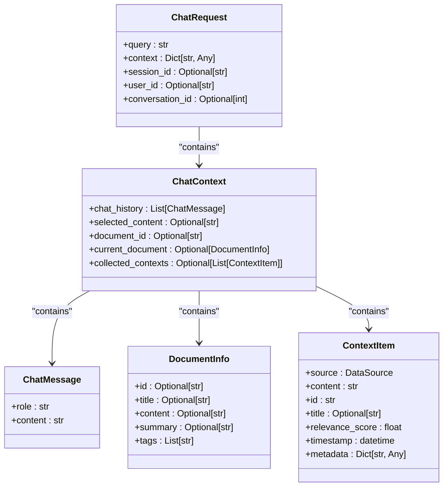
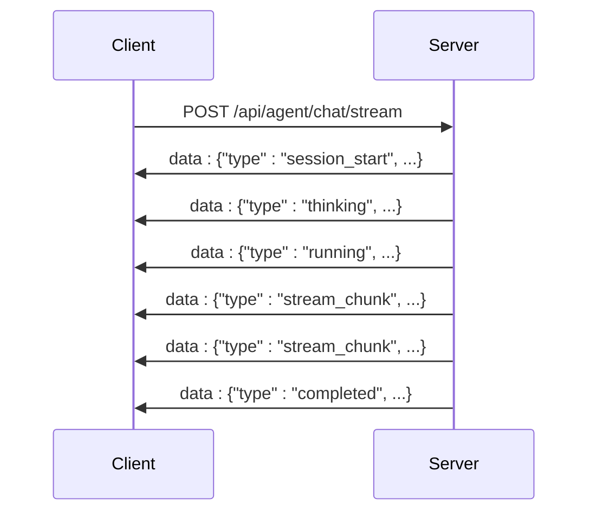
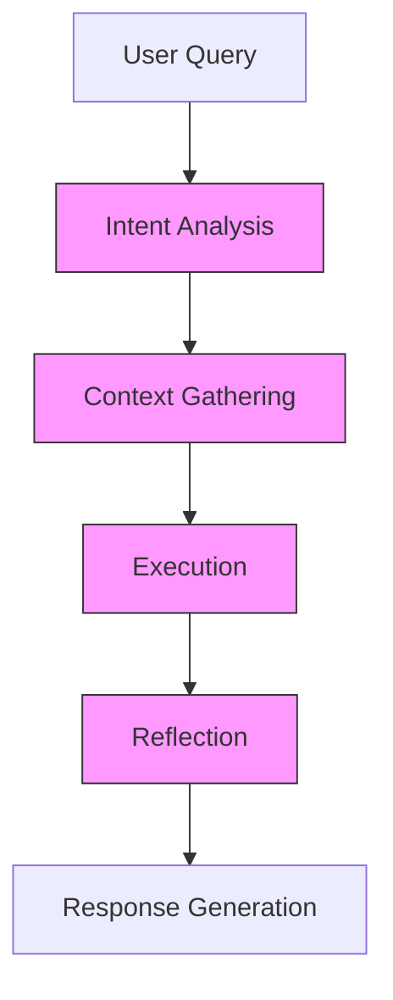
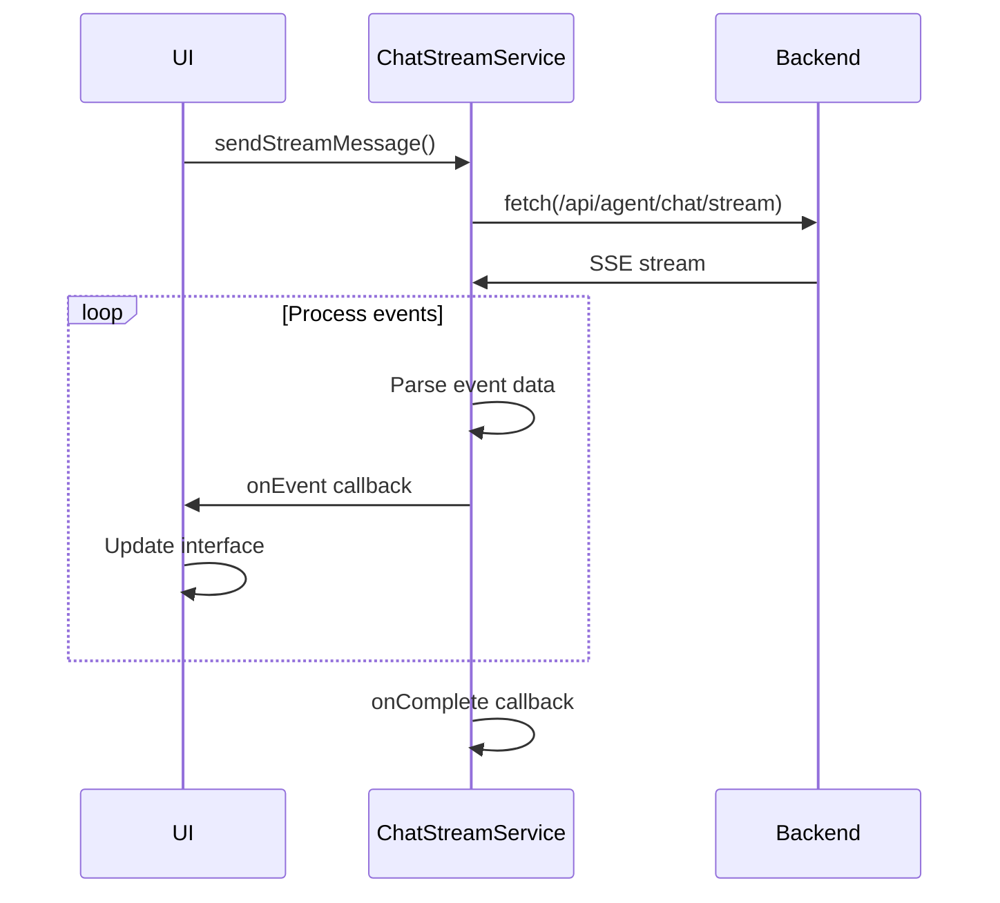
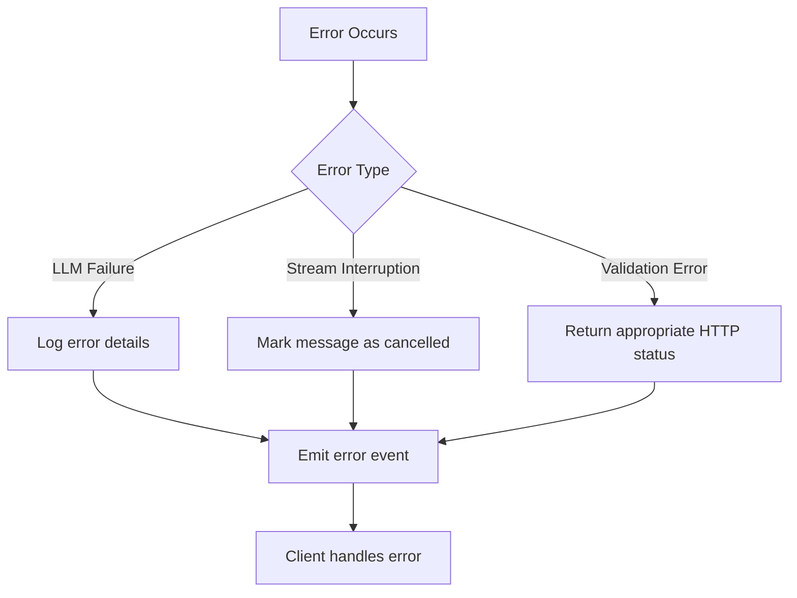
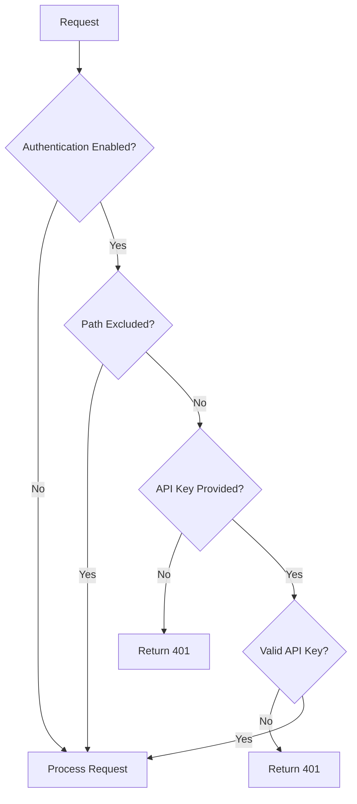
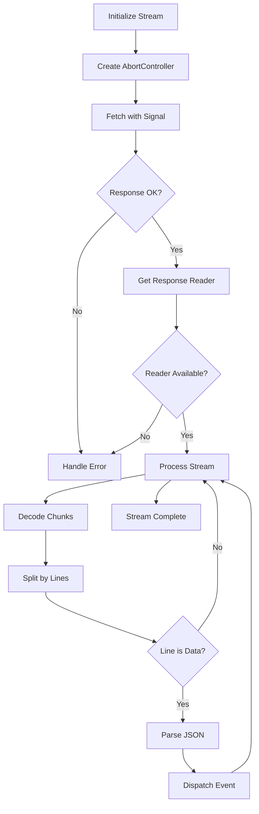

# Agent Chat Endpoints

<cite>
**Referenced Files in This Document**   
- [agent_chat.py](file://opencontext/server/routes/agent_chat.py)
- [ChatStreamService.ts](file://frontend/src/renderer/src/services/ChatStreamService.ts)
- [agent.py](file://opencontext/context_consumption/context_agent/agent.py)
- [streaming.py](file://opencontext/context_consumption/context_agent/core/streaming.py)
- [auth.py](file://opencontext/server/middleware/auth.py)
- [events.py](file://opencontext/context_consumption/context_agent/models/events.py)
- [schemas.py](file://opencontext/context_consumption/context_agent/models/schemas.py)
- [enums.py](file://opencontext/context_consumption/context_agent/models/enums.py)
- [context.py](file://opencontext/context_consumption/context_agent/nodes/context.py)
- [executor.py](file://opencontext/context_consumption/context_agent/nodes/executor.py)
- [config.yaml](file://config/config.yaml)
</cite>

## Table of Contents
1. [Introduction](#introduction)
2. [API Endpoint Overview](#api-endpoint-overview)
3. [Request Parameters](#request-parameters)
4. [Streaming Response Format](#streaming-response-format)
5. [Context Agent Integration](#context-agent-integration)
6. [Frontend Implementation](#frontend-implementation)
7. [Error Handling](#error-handling)
8. [Authentication](#authentication)
9. [Example Payloads](#example-payloads)
10. [Streaming Considerations](#streaming-considerations)

## Introduction

The Agent Chat Endpoints provide AI-powered conversational capabilities with context awareness, enabling intelligent interactions between users and the system. The core endpoint, POST /api/agent/chat/stream, facilitates real-time streaming conversations by integrating the Context Agent module with LLM clients to generate context-aware responses. This documentation details the endpoint's functionality, request parameters, response formats, and integration patterns.

The system architecture combines backend AI processing with frontend streaming capabilities to deliver responsive, context-rich conversations. The Context Agent orchestrates a multi-stage workflow that analyzes user intent, gathers relevant context, executes appropriate actions, and reflects on outcomes to provide comprehensive responses.

**Section sources**
- [agent_chat.py](file://opencontext/server/routes/agent_chat.py#L1-L50)
- [agent.py](file://opencontext/context_consumption/context_agent/agent.py#L1-L20)

## API Endpoint Overview

The Agent Chat API provides several endpoints for managing AI-powered conversations:

```mermaid
graph TD
A[POST /api/agent/chat] --> B[Non-streaming chat interface]
C[POST /api/agent/chat/stream] --> D[Streaming chat interface]
E[POST /api/agent/resume/{workflow_id}] --> F[Resume workflow execution]
G[GET /api/agent/state/{workflow_id}] --> H[Get workflow state]
I[DELETE /api/agent/cancel/{workflow_id}] --> J[Cancel workflow]
```

**Diagram sources**
- [agent_chat.py](file://opencontext/server/routes/agent_chat.py#L80-L367)

The primary endpoint for real-time interactions is POST /api/agent/chat/stream, which returns a streaming response with Server-Sent Events (SSE). This endpoint processes user queries through the Context Agent, which follows a structured workflow to generate context-aware responses. The non-streaming endpoint (POST /api/agent/chat) provides a complete response after processing, while the streaming version delivers incremental updates as the response is generated.

The endpoint supports workflow management through resume, state retrieval, and cancellation operations, allowing clients to control ongoing conversations. Each conversation is associated with a unique workflow ID that tracks its progress through various stages.

**Section sources**
- [agent_chat.py](file://opencontext/server/routes/agent_chat.py#L80-L367)
- [agent.py](file://opencontext/context_consumption/context_agent/agent.py#L38-L49)

## Request Parameters

The POST /api/agent/chat/stream endpoint accepts a JSON payload with the following parameters:



**Diagram sources**
- [agent_chat.py](file://opencontext/server/routes/agent_chat.py#L49-L57)
- [schemas.py](file://opencontext/context_consumption/context_agent/models/schemas.py#L17-L178)

### Required Parameters

- **query** (string): The user's input text that initiates the conversation or continues an existing one. This is the primary content that the AI will respond to.

### Optional Parameters

- **context** (object): Additional context information that influences the response generation. This can include:
  - chat_history: Previous messages in the conversation
  - selected_content: Text selected by the user for reference
  - document_id: Identifier of a specific document to focus on
  - current_document: Information about the currently active document
  - collected_contexts: Pre-gathered context items from various sources

- **session_id** (string): A unique identifier for the conversation session. If not provided, the system generates one automatically using UUID.

- **user_id** (string): Identifier for the user making the request, used for personalization and tracking.

- **conversation_id** (integer): Database identifier for storing the conversation messages. When provided, the system saves both user and assistant messages to persistent storage.

The context parameter enables the AI to provide more relevant and personalized responses by incorporating conversation history, document content, and other contextual information into its processing.

**Section sources**
- [agent_chat.py](file://opencontext/server/routes/agent_chat.py#L49-L57)
- [schemas.py](file://opencontext/context_consumption/context_agent/models/schemas.py#L17-L178)

## Streaming Response Format

The streaming endpoint returns responses in Server-Sent Events (SSE) format with the media type "text/event-stream". Each event is delivered as a separate message with a "data:" prefix followed by JSON content.



**Diagram sources**
- [agent_chat.py](file://opencontext/server/routes/agent_chat.py#L118-L290)
- [events.py](file://opencontext/context_consumption/context_agent/models/events.py#L16-L134)

### Event Types

The streaming response includes various event types that represent different stages of processing:

- **session_start**: Initial event containing the session ID and assistant message ID
- **thinking**: Indicates the AI is analyzing the query and planning its response
- **running**: Indicates active processing in a specific workflow stage
- **stream_chunk**: Contains a portion of the generated response text
- **completed**: Final event indicating successful completion
- **failed**: Event indicating processing failure
- **interrupted**: Event indicating the stream was interrupted by the client

Each event includes metadata such as timestamp, progress percentage, workflow stage, and additional context-specific information. The stream_chunk events contain incremental portions of the AI's response, allowing the frontend to display content as it's generated.

**Section sources**
- [agent_chat.py](file://opencontext/server/routes/agent_chat.py#L166-L245)
- [events.py](file://opencontext/context_consumption/context_agent/models/events.py#L16-L134)

## Context Agent Integration

The Agent Chat endpoint integrates with the Context Agent module to provide context-aware responses through a structured workflow process.



**Diagram sources**
- [agent.py](file://opencontext/context_consumption/context_agent/agent.py#L21-L165)
- [enums.py](file://opencontext/context_consumption/context_agent/models/enums.py#L21-L31)

### Workflow Stages

The Context Agent processes requests through the following stages:

1. **Intent Analysis**: Determines the user's query type and intent, classifying it into categories such as simple chat, document editing, Q&A analysis, or content generation.

2. **Context Gathering**: Collects relevant context from various sources including document libraries, web search, chat history, and entity databases. This stage uses an LLM-driven strategy to determine which retrieval tools to call.

3. **Execution**: Performs the requested action based on the identified intent and gathered context. This may involve generating new content, editing existing documents, or answering questions.

4. **Reflection**: Evaluates the quality and completeness of the response, determining if additional information is needed or if the response should be modified.

The Context Agent uses a streaming manager to emit events at each stage, allowing the system to provide real-time feedback to the client about the processing status.

**Section sources**
- [agent.py](file://opencontext/context_consumption/context_agent/agent.py#L38-L49)
- [context.py](file://opencontext/context_consumption/context_agent/nodes/context.py#L27-L165)
- [executor.py](file://opencontext/context_consumption/context_agent/nodes/executor.py#L29-L87)

## Frontend Implementation

The frontend implements the ChatStreamService to handle real-time interactions with the Agent Chat endpoint.



**Diagram sources**
- [ChatStreamService.ts](file://frontend/src/renderer/src/services/ChatStreamService.ts#L91-L192)

### ChatStreamService Class

The ChatStreamService class manages the streaming connection and event processing:

- **sendStreamMessage**: Initiates a streaming request to the backend with the user's query and context
- **onEvent callback**: Receives and processes individual events from the stream
- **onError callback**: Handles errors that occur during the streaming process
- **onComplete callback**: Called when the stream completes successfully
- **abortStream**: Cancels an ongoing streaming request
- **generateSessionId**: Creates a unique session identifier

The service uses the Fetch API with a ReadableStream to handle the SSE response, parsing each line and dispatching events to the appropriate callbacks. It also manages request cancellation through AbortController, allowing users to interrupt ongoing responses.

**Section sources**
- [ChatStreamService.ts](file://frontend/src/renderer/src/services/ChatStreamService.ts#L91-L192)

## Error Handling

The system implements comprehensive error handling for both server-side processing failures and client-side communication issues.



**Diagram sources**
- [agent_chat.py](file://opencontext/server/routes/agent_chat.py#L260-L274)
- [ChatStreamService.ts](file://frontend/src/renderer/src/services/ChatStreamService.ts#L165-L173)

### Server-Side Error Handling

When exceptions occur during processing, the system:

1. Logs detailed error information for debugging
2. Emits an error event with the error message
3. Marks any associated messages as failed in storage
4. Returns an appropriate HTTP response

The streaming endpoint specifically handles LLM client failures by catching exceptions and emitting error events that the frontend can display to users.

### Client-Side Error Handling

The ChatStreamService handles various error scenarios:

- **Network errors**: Displayed as connection issues
- **Abort errors**: Occur when the user cancels a request
- **Parsing errors**: Handled gracefully with warnings
- **HTTP errors**: Displayed with specific status information

The service provides an onError callback that applications can use to display appropriate error messages to users.

**Section sources**
- [agent_chat.py](file://opencontext/server/routes/agent_chat.py#L260-L274)
- [ChatStreamService.ts](file://frontend/src/renderer/src/services/ChatStreamService.ts#L165-L173)

## Authentication

The API requires authentication via API key validation, which can be provided in either the request header or query parameters.



**Diagram sources**
- [auth.py](file://opencontext/server/middleware/auth.py#L68-L109)

### Authentication Methods

Clients can authenticate using one of two methods:

- **Header**: Include the API key in the "X-API-Key" header
- **Query Parameter**: Include the API key as "api_key" in the query string

The system checks for authentication based on the configuration in config.yaml. When enabled, all endpoints require a valid API key except for those specifically excluded in the configuration.

Authentication is implemented as a FastAPI dependency that automatically validates requests before they reach the endpoint handlers.

**Section sources**
- [auth.py](file://opencontext/server/middleware/auth.py#L68-L109)
- [config.yaml](file://config/config.yaml#L193-L208)

## Example Payloads

### Request Example

```json
{
  "query": "Summarize the key points from the document about project timelines",
  "context": {
    "chat_history": [
      {
        "role": "user",
        "content": "I need to understand the project schedule"
      },
      {
        "role": "assistant",
        "content": "I can help you with that. Could you specify which aspects of the project timeline you're interested in?"
      }
    ],
    "document_id": "12345",
    "selected_content": "The project will be completed in Q4 2025 with milestones in March, June, and September."
  },
  "session_id": "session_123",
  "user_id": "user_789",
  "conversation_id": 42
}
```

### Streaming Response Examples

**Session Start Event:**
```json
{
  "type": "session_start",
  "session_id": "session_123",
  "assistant_message_id": 987
}
```

**Thinking Event:**
```json
{
  "type": "thinking",
  "content": "Analyzing the document to extract key timeline information",
  "stage": "context_gathering",
  "progress": 0.3,
  "timestamp": "2025-01-15T10:30:45.123Z"
}
```

**Stream Chunk Event:**
```json
{
  "type": "stream_chunk",
  "content": "Based on the document, the project has three main milestones:",
  "stage": "execution",
  "progress": 0.6,
  "timestamp": "2025-01-15T10:30:47.456Z",
  "metadata": {
    "index": 0
  }
}
```

**Completed Event:**
```json
{
  "type": "completed",
  "content": "Response generation complete",
  "stage": "completed",
  "progress": 1.0,
  "timestamp": "2025-01-15T10:30:52.789Z"
}
```

**Section sources**
- [agent_chat.py](file://opencontext/server/routes/agent_chat.py#L166-L245)
- [ChatStreamService.ts](file://frontend/src/renderer/src/services/ChatStreamService.ts#L148-L154)

## Streaming Considerations

When implementing client-side handling of the streaming endpoint, several considerations ensure optimal user experience:



**Diagram sources**
- [ChatStreamService.ts](file://frontend/src/renderer/src/services/ChatStreamService.ts#L106-L164)

### Client-Side Handling

Key implementation considerations include:

- **Buffer Management**: Maintain a buffer for incomplete JSON messages that span multiple chunks
- **Event Parsing**: Properly parse the "data:" prefixed lines and handle potential parsing errors
- **Progress Updates**: Use the progress field in events to update loading indicators
- **Cancellation Support**: Implement proper cleanup when requests are aborted
- **Reconnection Logic**: Handle network interruptions with appropriate retry mechanisms

The ChatStreamService demonstrates best practices for handling streaming responses, including proper error handling, buffer management, and event dispatching.

**Section sources**
- [ChatStreamService.ts](file://frontend/src/renderer/src/services/ChatStreamService.ts#L106-L164)
- [agent_chat.py](file://opencontext/server/routes/agent_chat.py#L282-L290)