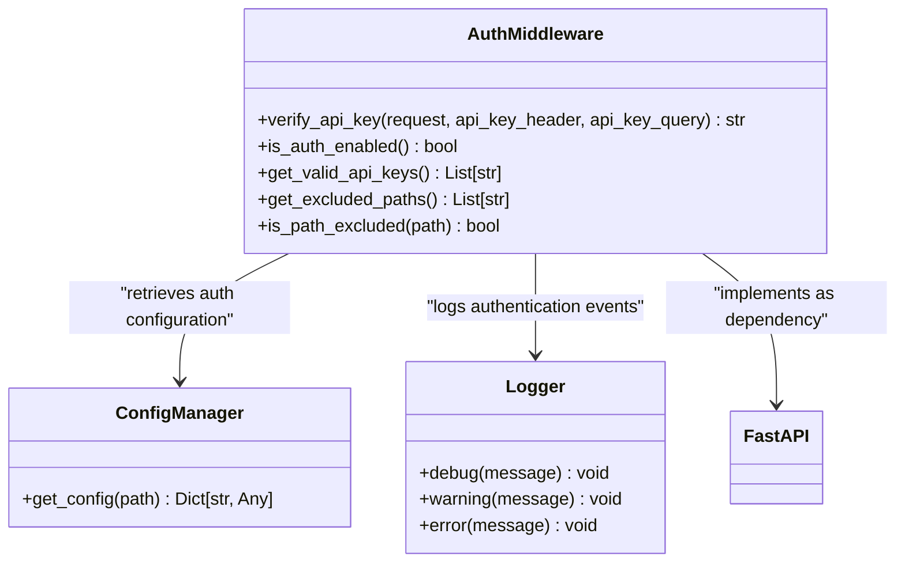
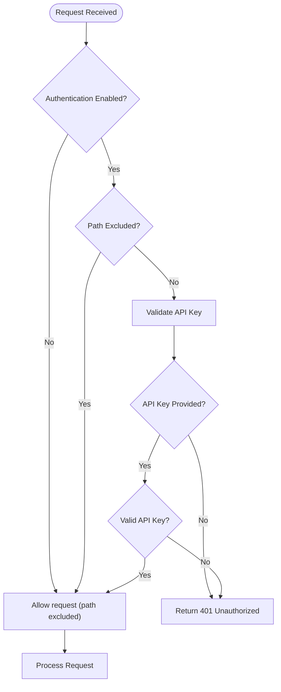
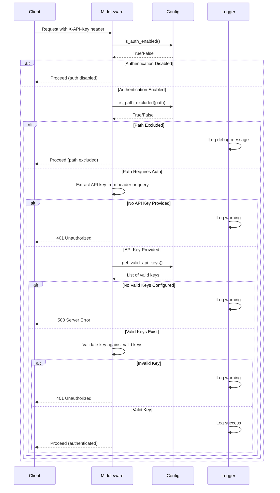
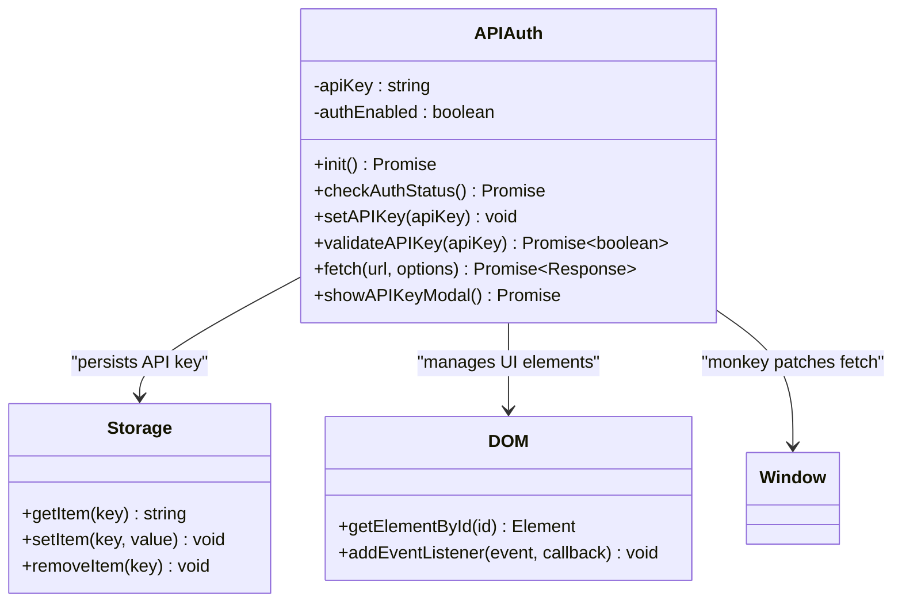
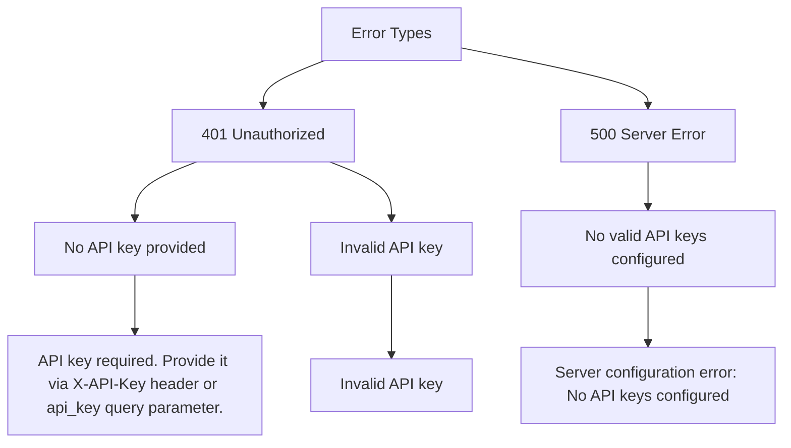

# Authentication Middleware

<cite>
**Referenced Files in This Document**   
- [auth.py](file://opencontext/server/middleware/auth.py)
- [config.yaml](file://config/config.yaml)
- [health.py](file://opencontext/server/routes/health.py)
- [context.py](file://opencontext/server/routes/context.py)
- [completions.py](file://opencontext/server/routes/completions.py)
- [vaults.py](file://opencontext/server/routes/vaults.py)
- [api_auth.js](file://opencontext/web/static/js/api_auth.js)
</cite>

## Table of Contents
1. [Introduction](#introduction)
2. [Authentication Middleware Architecture](#authentication-middleware-architecture)
3. [API Key Configuration](#api-key-configuration)
4. [Path Exclusion Mechanism](#path-exclusion-mechanism)
5. [Authentication Flow](#authentication-flow)
6. [Frontend Integration](#frontend-integration)
7. [Security Considerations](#security-considerations)
8. [Error Handling](#error-handling)
9. [Best Practices](#best-practices)

## Introduction

The authentication middleware in the OpenContext system provides API key-based security for protecting sensitive endpoints while allowing public access to health checks and static resources. This middleware is implemented as a FastAPI dependency that can be applied to individual routes or entire API routers. The system supports multiple authentication methods (header and query parameter) and provides flexible configuration through the config.yaml file. The middleware is designed to be lightweight, efficient, and easy to integrate across the application.

**Section sources**
- [auth.py](file://opencontext/server/middleware/auth.py#L1-L112)

## Authentication Middleware Architecture

The authentication middleware is implemented as a comprehensive system with multiple components working together to secure API endpoints. The architecture follows a layered approach with clear separation of concerns.



**Diagram sources**
- [auth.py](file://opencontext/server/middleware/auth.py#L1-L112)

The middleware is structured around several key functions that handle different aspects of the authentication process. The `verify_api_key` function serves as the main entry point, coordinating the authentication flow by checking whether authentication is enabled, determining if the requested path should be excluded from authentication, and validating the provided API key against the configured valid keys. The system uses a dependency injection pattern through FastAPI's Depends mechanism, making it easy to apply authentication to specific routes.

**Section sources**
- [auth.py](file://opencontext/server/middleware/auth.py#L1-L112)

## API Key Configuration

API key configuration is managed through the config.yaml file, providing a flexible and secure way to manage authentication settings. The configuration is structured under the `api_auth` section with several key parameters.

```yaml
api_auth:
  enabled: false # Enable authentication in production environment for security
  api_keys:
    - "${CONTEXT_API_KEY:test}"
  excluded_paths:
    - "/health"
    - "/api/health"
    - "/api/auth/status"
    - "/"
    - "/static/*"
    - "/contexts"
    - "/vector_search"
    - "/debug"
    - "/chat"
    - "/advanced_chat"
    - "/monitoring"
    - "/assistant"
    - "/vaults"
```

The configuration supports environment variable interpolation through the `${VARIABLE_NAME:default}` syntax, allowing API keys to be securely stored in environment variables rather than in the configuration file itself. This approach enhances security by preventing API keys from being exposed in version control systems. The `enabled` flag controls whether authentication is active, with a default value of `false` for development environments. Multiple API keys can be configured in the `api_keys` list, supporting scenarios where multiple clients or services need access to the API.

**Section sources**
- [config.yaml](file://config/config.yaml#L192-L211)
- [auth.py](file://opencontext/server/middleware/auth.py#L42-L47)

## Path Exclusion Mechanism

The authentication middleware implements a sophisticated path exclusion mechanism that allows certain endpoints to remain publicly accessible while protecting sensitive routes. This is particularly important for health checks, static resources, and certain API endpoints that need to be accessible without authentication.



**Diagram sources**
- [auth.py](file://opencontext/server/middleware/auth.py#L50-L65)
- [auth.py](file://opencontext/server/middleware/auth.py#L77-L83)

The exclusion mechanism supports wildcard patterns through the `fnmatch` module, allowing flexible path matching. For example, `/static/*` will match any path under the `/static` directory, enabling all static resources to be served without authentication. The system checks for path exclusion before validating the API key, optimizing performance by avoiding unnecessary key validation for excluded paths. The list of excluded paths is configurable in the config.yaml file, allowing administrators to customize which endpoints should be publicly accessible.

**Section sources**
- [auth.py](file://opencontext/server/middleware/auth.py#L50-L65)
- [config.yaml](file://config/config.yaml#L197-L211)

## Authentication Flow

The authentication flow follows a systematic process to verify API requests, ensuring that only authorized clients can access protected endpoints. The flow is implemented in the `verify_api_key` function and follows a specific sequence of checks.



**Diagram sources**
- [auth.py](file://opencontext/server/middleware/auth.py#L68-L109)

The authentication process begins by checking if authentication is enabled globally. If disabled, the request proceeds without further checks. If enabled, the middleware checks if the requested path is in the excluded paths list. For non-excluded paths, the middleware attempts to extract the API key from either the `X-API-Key` header or the `api_key` query parameter. If no key is provided, a 401 Unauthorized response is returned. If a key is provided, it is validated against the list of valid keys from the configuration. The system logs various events at different levels (debug, warning) to provide visibility into the authentication process.

**Section sources**
- [auth.py](file://opencontext/server/middleware/auth.py#L68-L109)

## Frontend Integration

The frontend integration of the authentication system is implemented through a JavaScript utility that handles API key management and request authorization. This ensures a seamless user experience while maintaining security requirements.



**Diagram sources**
- [api_auth.js](file://opencontext/web/static/js/api_auth.js#L9-L287)

The frontend authentication system automatically checks the authentication status on initialization by calling the `/api/auth/status` endpoint. If authentication is enabled, it attempts to load the API key from localStorage. If no key is found, it displays a modal prompting the user to enter their API key. The system monkey patches the global `fetch` function to automatically include the API key in requests to protected endpoints. This transparent integration ensures that all API calls are properly authenticated without requiring changes to existing code that uses fetch. The system also handles authentication failures by clearing invalid keys and prompting the user to enter a new one.

**Section sources**
- [api_auth.js](file://opencontext/web/static/js/api_auth.js#L1-L308)
- [health.py](file://opencontext/server/routes/health.py#L43-L46)

## Security Considerations

The authentication system incorporates several security measures to protect against common vulnerabilities and ensure the integrity of the API key authentication mechanism.

### Key Storage and Transmission
API keys should never be stored in version control or configuration files in plaintext. The system supports environment variable interpolation (`${CONTEXT_API_KEY:test}`) to encourage secure key management. When transmitted, API keys should always be sent over HTTPS to prevent interception. The frontend stores keys in localStorage, which is accessible to JavaScript running on the same origin, so it's important to protect against cross-site scripting (XSS) attacks.

### Rate Limiting and Brute Force Protection
While not implemented in the current middleware, rate limiting should be considered to prevent brute force attacks on API keys. Without rate limiting, attackers could potentially try large numbers of API keys to gain unauthorized access.

### Key Rotation
The system should support key rotation, allowing administrators to invalidate compromised keys and issue new ones. This is particularly important in multi-user environments where individual users may have their own API keys.

### Logging and Monitoring
The authentication middleware includes comprehensive logging of authentication events, including warnings for missing or invalid keys. These logs should be monitored for suspicious activity, such as repeated failed authentication attempts from the same IP address.

**Section sources**
- [config.yaml](file://config/config.yaml#L192-L211)
- [auth.py](file://opencontext/server/middleware/auth.py#L1-L112)
- [api_auth.js](file://opencontext/web/static/js/api_auth.js#L1-L308)

## Error Handling

The authentication middleware implements comprehensive error handling to provide clear feedback to clients while maintaining security.



**Diagram sources**
- [auth.py](file://opencontext/server/middleware/auth.py#L88-L106)

The system returns specific HTTP status codes and error messages for different failure scenarios. When no API key is provided, a 401 Unauthorized response is returned with a message explaining how to provide the key. When an invalid API key is provided, a 401 Unauthorized response is returned with a generic "Invalid API key" message to avoid revealing information about valid keys. If the server is misconfigured with no valid API keys, a 500 Server Error is returned, indicating a server-side configuration issue. The frontend handles 401 responses by clearing the stored API key and prompting the user to enter a new one, creating a seamless recovery flow.

**Section sources**
- [auth.py](file://opencontext/server/middleware/auth.py#L88-L106)

## Best Practices

Implementing effective API key management requires following several best practices to ensure both security and usability.

### Configuration Management
Always use environment variables for API key values in production environments, never store them directly in configuration files. Use the `${VARIABLE_NAME:default}` syntax to reference environment variables, with appropriate defaults for development environments.

### Key Generation
Generate API keys using cryptographically secure random number generators with sufficient entropy. Keys should be long enough to prevent brute force attacks (typically 32 characters or more) and should use a diverse character set.

### Scope and Permissions
Consider implementing scoped API keys that have limited permissions based on the client's needs. This principle of least privilege reduces the potential impact of a compromised key.

### Monitoring and Auditing
Implement monitoring of API key usage patterns to detect suspicious activity. Regularly audit key usage and rotate keys periodically, especially for high-privilege keys.

### Documentation
Clearly document the authentication requirements for API consumers, including how to obtain API keys, where to include them in requests, and which endpoints require authentication.

**Section sources**
- [config.yaml](file://config/config.yaml#L192-L211)
- [auth.py](file://opencontext/server/middleware/auth.py#L1-L112)