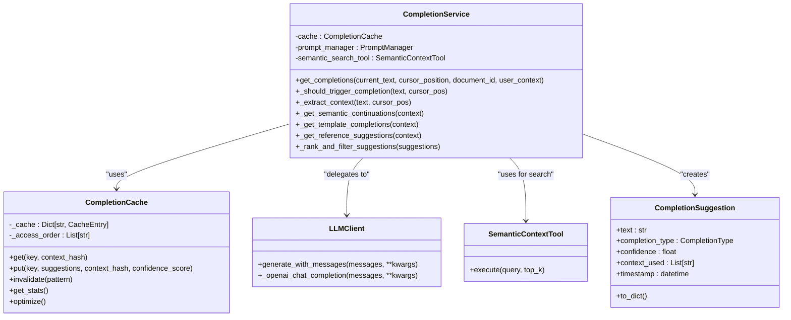

# Completions Endpoints

<cite>
**Referenced Files in This Document**   
- [completions.py](file://opencontext/server/routes/completions.py)
- [completion_service.py](file://opencontext/context_consumption/completion/completion_service.py)
- [completion_cache.py](file://opencontext/context_consumption/completion/completion_cache.py)
- [llm_client.py](file://opencontext/llm/llm_client.py)
- [global_vlm_client.py](file://opencontext/llm/global_vlm_client.py)
- [enums.py](file://opencontext/models/enums.py)
- [completion_handler.js](file://opencontext/web/static/js/completion_handler.js)
</cite>

## Table of Contents
1. [Introduction](#introduction)
2. [POST /api/completions/suggest](#post-apicompletionsuggest)
3. [Request Parameters](#request-parameters)
4. [Response Format](#response-format)
5. [Completion Service Architecture](#completion-service-architecture)
6. [Caching Mechanism](#caching-mechanism)
7. [Frontend Integration](#frontend-integration)
8. [Error Handling](#error-handling)
9. [Rate Limiting and Performance](#rate-limiting-and-performance)
10. [Examples](#examples)

## Introduction
The completions endpoints provide AI-powered content suggestion capabilities similar to GitHub Copilot, enabling intelligent text completion within the application. This API analyzes the current document context and user input to generate relevant suggestions for content continuation, template completion, and reference suggestions. The system integrates with a Large Language Model (LLM) client to generate intelligent suggestions and employs a sophisticated caching mechanism to optimize response times. This documentation details the POST /api/completions/suggest endpoint, its parameters, response format, and integration with the completion_service and LLM client for generating context-aware suggestions.

## POST /api/completions/suggest
The primary endpoint for retrieving intelligent completion suggestions is `POST /api/completions/suggest`. This endpoint analyzes the current document content and cursor position to generate context-aware suggestions that can assist users in content creation. The endpoint supports multiple completion strategies including semantic continuation, template completion, and reference suggestions based on vector database retrieval. When a request is received, the system validates the input parameters, extracts relevant context information, and utilizes the completion_service to generate appropriate suggestions. The response includes the generated suggestions along with metadata such as processing time and cache status. This endpoint is designed to be responsive and efficient, leveraging caching to minimize latency for repeated or similar requests.

**Section sources**
- [completions.py](file://opencontext/server/routes/completions.py#L57-L132)

## Request Parameters
The POST /api/completions/suggest endpoint accepts a JSON payload with several parameters that control the completion behavior. The primary parameter is `text`, which contains the current document content that serves as the context for generating suggestions. The `cursor_position` parameter specifies the exact position within the text where the completion should be generated, allowing the system to understand the context before and after the cursor. An optional `document_id` can be provided to associate the completion request with a specific document, enabling document-specific context and caching. The `completion_types` parameter allows clients to filter suggestions by specific types such as 'semantic_continuation', 'template_completion', or 'reference_suggestion'. The `max_suggestions` parameter limits the number of suggestions returned, with a default value of 3. Additionally, an optional `context` object can be included to provide additional user context or metadata that may influence the completion generation process.


**Diagram sources**
- [completions.py](file://opencontext/server/routes/completions.py#L31-L45)

**Section sources**
- [completions.py](file://opencontext/server/routes/completions.py#L31-L45)

## Response Format
The response from the POST /api/completions/suggest endpoint is a JSON object containing the completion suggestions and associated metadata. The response includes a `success` boolean field indicating whether the request was processed successfully. The `suggestions` field contains an array of suggestion objects, each with properties such as the suggested text, completion type, confidence score, and any context used in generating the suggestion. The `processing_time_ms` field provides the time taken to generate the suggestions in milliseconds, which can be useful for performance monitoring. A `cache_hit` boolean indicates whether the response was served from the cache, helping to understand the effectiveness of the caching mechanism. In case of errors, the response includes an `error` field with a descriptive message. The response also includes a `timestamp` field with the ISO-formatted time of the response. Each suggestion in the array includes a `text` field with the suggested content, a `type` field indicating the completion strategy used, a `confidence` score between 0 and 1, and a `context_used` array listing any sources or context that influenced the suggestion.


**Diagram sources**
- [completions.py](file://opencontext/server/routes/completions.py#L47-L55)

**Section sources**
- [completions.py](file://opencontext/server/routes/completions.py#L47-L55)

## Completion Service Architecture
The completion service architecture is designed as a modular system that integrates multiple components to deliver intelligent suggestions. At the core is the CompletionService class, which coordinates the generation of completion suggestions through various strategies. The service utilizes the LLM client to generate semantic continuations by sending contextual prompts to the language model. For template completions, the service analyzes document structure such as headings, lists, and code blocks to provide appropriate syntactic suggestions. Reference suggestions are generated by querying the vector database through the SemanticContextTool to find relevant content based on semantic similarity. The service extracts context from the document including the text before and after the cursor, the current line, and paragraph structure to inform the suggestion generation process. The CompletionService also implements filtering and ranking logic to ensure the most relevant suggestions are presented first, based on confidence scores and deduplication. This architecture allows for extensible completion strategies while maintaining a clean separation of concerns between context extraction, suggestion generation, and result processing.



**Diagram sources**
- [completion_service.py](file://opencontext/context_consumption/completion/completion_service.py#L56-L492)
- [completion_cache.py](file://opencontext/context_consumption/completion/completion_cache.py#L45-L399)
- [llm_client.py](file://opencontext/llm/llm_client.py#L32-L466)
- [global_vlm_client.py](file://opencontext/llm/global_vlm_client.py#L27-L317)

**Section sources**
- [completion_service.py](file://opencontext/context_consumption/completion/completion_service.py#L56-L492)

## Caching Mechanism
The caching mechanism for completions is implemented through the CompletionCache class, which provides high-performance storage and retrieval of completion results to minimize redundant processing. The cache uses a hybrid strategy combining LRU (Least Recently Used) and TTL (Time To Live) eviction policies to balance performance and freshness of suggestions. Each cache entry includes the suggestion data, creation and access timestamps, access count, confidence score, and context hash to ensure suggestions remain relevant to the document state. The cache key is generated based on the context before the cursor, the current line, and the document ID, ensuring that similar contexts can benefit from cached results. When a completion request is received, the system first checks the cache using the generated key and context hash, returning cached results if available and valid. The cache also tracks hot keys—frequently accessed patterns—to prioritize their retention during eviction. Cache statistics are available through the /api/completions/cache/stats endpoint, providing insights into hit rates, memory usage, and performance metrics. The system includes optimization endpoints to clear or optimize the cache, allowing for maintenance and troubleshooting.

```mermaid
flowchart TD
Start["Cache Operation"]
Start --> Check["Check if key exists in cache"]
Check --> |No| Generate["Generate new suggestions"]
Check --> |Yes| Expired["Check if entry is expired"]
Expired --> |Yes| Generate
Expired --> |No| ContextMatch["Check context hash matches"]
ContextMatch --> |No| Generate
ContextMatch --> |Yes| Update["Update access information"]
Update --> Return["Return cached suggestions"]
Generate --> Store["Store in cache"]
Store --> Return
classDef process fill:#4CAF50,stroke:#388E3C,color:white;
classDef decision fill:#2196F3,stroke:#1976D2,color:white;
classDef end fill:#F44336,stroke:#D32F2F,color:white;
class Check,Expired,ContextMatch decision
class Generate,Update,Store,Return process
class Start,End end
```

**Diagram sources**
- [completion_cache.py](file://opencontext/context_consumption/completion/completion_cache.py#L45-L399)

**Section sources**
- [completion_cache.py](file://opencontext/context_consumption/completion/completion_cache.py#L45-L399)

## Frontend Integration
The frontend integration of the completions endpoint is handled by the CompletionHandler class in the completion_handler.js file, which manages the user interface and interaction flow for completion suggestions. The handler is initialized with a reference to the note editor and sets up event listeners for cursor activity, document changes, and keyboard interactions. When the user types or moves the cursor, the handler determines if completion should be triggered based on configurable rules such as minimum trigger length and context. The handler implements debouncing to prevent excessive API calls during rapid typing. When a completion request is triggered, the handler sends a POST request to /api/completions/suggest with the current document content, cursor position, and additional context. The response is processed to display suggestions in an overlay positioned near the cursor. Users can navigate suggestions using arrow keys or mouse clicks, with the selected suggestion being inserted into the document when accepted. The handler also manages feedback by sending usage data to /api/completions/feedback when suggestions are accepted or rejected, which helps improve the suggestion quality over time. The integration includes status indicators to inform users about the completion process, such as loading states and error messages.


**Diagram sources**
- [completion_handler.js](file://opencontext/web/static/js/completion_handler.js#L6-L605)

**Section sources**
- [completion_handler.js](file://opencontext/web/static/js/completion_handler.js#L6-L605)

## Error Handling
The completions endpoint implements comprehensive error handling to ensure robust operation and provide meaningful feedback when issues occur. When validation errors are detected, such as empty text content or invalid cursor positions, the endpoint returns appropriate HTTP 400 Bad Request responses with descriptive error messages. For internal server errors during suggestion generation, the system catches exceptions and returns HTTP 500 responses with error details in the response body. The error handling includes detailed logging through the application's logging system, capturing both the error and relevant context for debugging purposes. The frontend handler also implements client-side error handling, with timeout protection for API requests and graceful degradation when the backend service is unavailable. Network errors, timeouts, and parsing errors are caught and presented to users through the UI status indicators. The system distinguishes between different error types, such as validation errors, service failures, and network issues, allowing for appropriate user feedback and potential recovery strategies. Additionally, the feedback mechanism continues to operate even when suggestion generation fails, allowing the system to learn from unsuccessful interactions.

**Section sources**
- [completions.py](file://opencontext/server/routes/completions.py#L119-L131)
- [completion_handler.js](file://opencontext/web/static/js/completion_handler.js#L251-L257)

## Rate Limiting and Performance
The completions system incorporates several mechanisms to manage rate limiting and ensure optimal performance. While explicit rate limiting is not implemented in the current code, the architecture includes natural throttling through debouncing in the frontend handler, which prevents excessive requests during rapid typing by enforcing a minimum interval between requests. The caching mechanism significantly improves performance by serving repeated or similar requests from memory rather than generating suggestions anew. The cache statistics endpoint (/api/completions/cache/stats) provides visibility into cache effectiveness, including hit rates and average response times, allowing administrators to monitor performance. The system is designed to handle concurrent requests efficiently, with thread-safe operations in the cache implementation. For high-volume scenarios, the architecture could be extended with explicit rate limiting using tokens or quotas. Performance is further optimized through context extraction that limits the amount of text processed, focusing on relevant portions near the cursor. The LLM client implementation includes timeout handling to prevent hanging requests, ensuring the system remains responsive even under heavy load or when the AI service is slow to respond.

**Section sources**
- [completion_handler.js](file://opencontext/web/static/js/completion_handler.js#L29-L30)
- [completion_cache.py](file://opencontext/context_consumption/completion/completion_cache.py#L331-L333)
- [completions.py](file://opencontext/server/routes/completions.py#L67-L100)

## Examples
The following examples demonstrate typical request and response payloads for the completions endpoint. A basic request includes the current document text and cursor position:

```json
{
  "text": "# Introduction\nThis is a sample document for demonstrating completions. The user is writing about AI-powered features and how they can enhance productivity. As the user types, the system provides intelligent suggestions based on the context.",
  "cursor_position": 150,
  "document_id": 12345,
  "max_suggestions": 3,
  "context": {
    "current_line": "As the user types, the system provides intelligent suggestions based on the context.",
    "line_number": 3,
    "char_position": 75
  }
}
```

The corresponding response might look like:

```json
{
  "success": true,
  "suggestions": [
    {
      "text": "These suggestions can include content continuation, template completion, and reference suggestions drawn from the user's knowledge base.",
      "type": "semantic_continuation",
      "confidence": 0.85,
      "context_used": [],
      "timestamp": "2025-01-15T10:30:45.123Z"
    },
    {
      "text": "\n\n## Key Features\n- Intelligent text completion\n- Context-aware suggestions\n- Real-time feedback",
      "type": "template_completion",
      "confidence": 0.92,
      "context_used": [],
      "timestamp": "2025-01-15T10:30:45.124Z"
    }
  ],
  "processing_time_ms": 450.2,
  "cache_hit": false,
  "timestamp": "2025-01-15T10:30:45.125Z"
}
```

For a request with specific completion types:

```json
{
  "text": "- First item\n- Second item",
  "cursor_position": 25,
  "completion_types": ["template_completion"]
}
```

This would return only template completions, such as another list item suggestion.

**Section sources**
- [completions.py](file://opencontext/server/routes/completions.py#L57-L132)
- [completion_handler.js](file://opencontext/web/static/js/completion_handler.js#L204-L216)