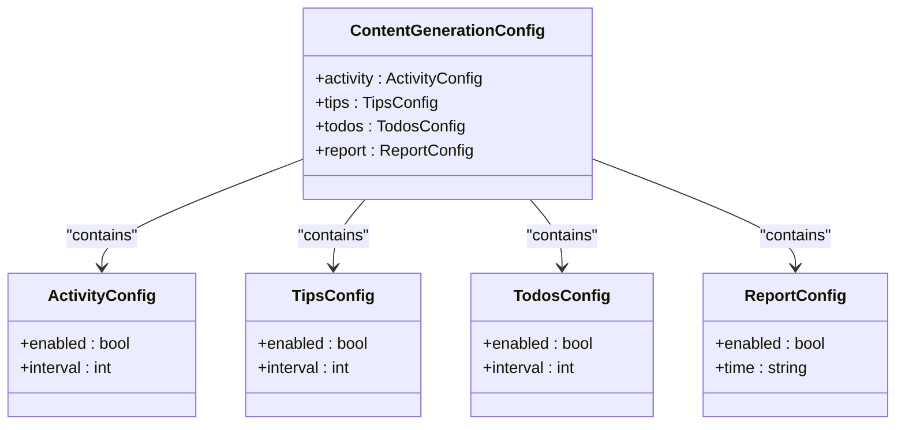
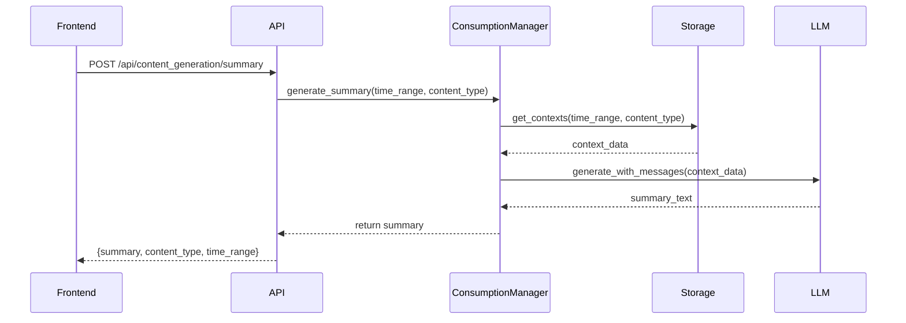
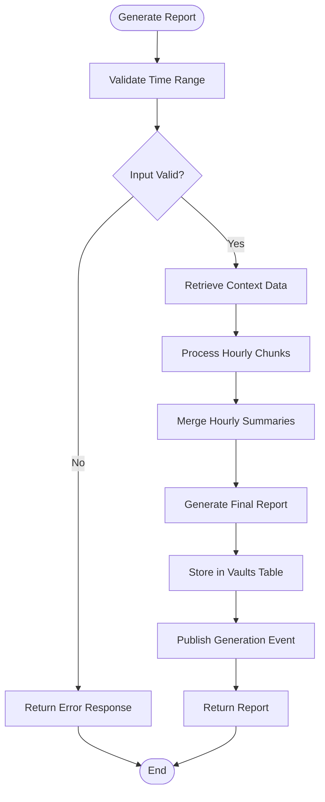
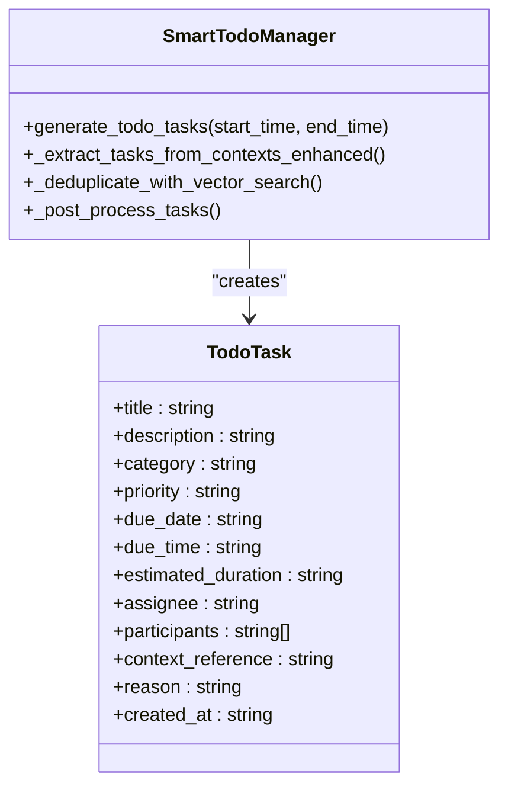
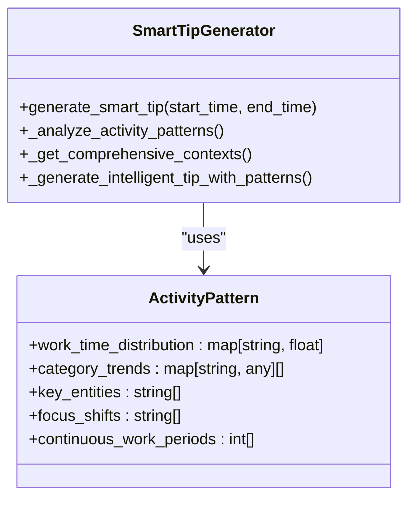
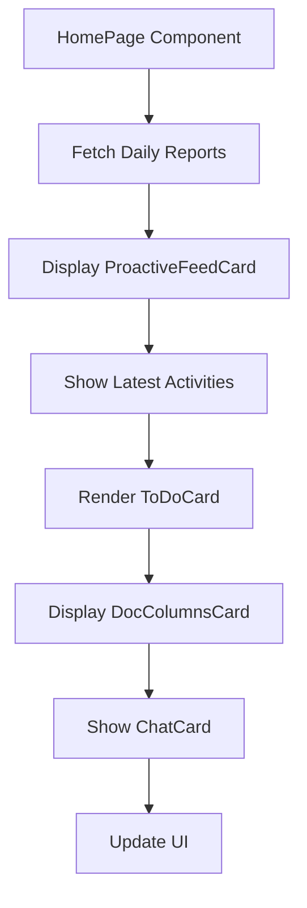

# Content Generation Endpoints

<cite>
**Referenced Files in This Document**   
- [content_generation.py](file://opencontext/server/routes/content_generation.py)
- [smart_todo_manager.py](file://opencontext/context_consumption/generation/smart_todo_manager.py)
- [smart_tip_generator.py](file://opencontext/context_consumption/generation/smart_tip_generator.py)
- [generation_report.py](file://opencontext/context_consumption/generation/generation_report.py)
- [get_daily_reports_tool.py](file://opencontext/tools/retrieval_tools/get_daily_reports_tool.py)
- [get_tips_tool.py](file://opencontext/tools/retrieval_tools/get_tips_tool.py)
- [get_todos_tool.py](file://opencontext/tools/retrieval_tools/get_todos_tool.py)
- [consumption_manager.py](file://opencontext/managers/consumption_manager.py)
- [home-page.tsx](file://frontend/src/renderer/src/pages/home/home-page.tsx)
</cite>

## Table of Contents
1. [Introduction](#introduction)
2. [Content Generation Configuration](#content-generation-configuration)
3. [Summary Generation Endpoint](#summary-generation-endpoint)
4. [Report Generation Endpoint](#report-generation-endpoint)
5. [Insights Generation Endpoint](#insights-generation-endpoint)
6. [Integration with Smart Modules](#integration-with-smart-modules)
7. [Frontend Consumption Examples](#frontend-consumption-examples)
8. [Processing Time Expectations](#processing-time-expectations)
9. [Error Handling](#error-handling)

## Introduction
The content generation endpoints transform captured user activity data into structured outputs including summaries, reports, and insights. These endpoints leverage AI-powered modules to analyze context data and generate actionable items. The system supports configurable generation intervals and time-based scheduling for different content types. The endpoints integrate with smart modules for todo management and tip generation, providing comprehensive productivity insights to the frontend application.

## Content Generation Configuration
The content generation system provides configuration endpoints to manage generation intervals and scheduling for different content types.

**Diagram sources**
- [content_generation.py](file://opencontext/server/routes/content_generation.py#L26-L58)

**Section sources**
- [content_generation.py](file://opencontext/server/routes/content_generation.py#L69-L144)
- [consumption_manager.py](file://opencontext/managers/consumption_manager.py#L57-L72)

## Summary Generation Endpoint
The summary generation endpoint creates concise summaries from user activity data within specified time ranges.

### Request Parameters
- **time_range**: Object containing start_time and end_time as Unix timestamps
- **content_type**: Type of content to summarize (e.g., "activity", "document", "webpage")
- **output_format**: Desired output format ("text", "markdown", "html")

### Response Structure
The endpoint returns a JSON object containing:
- **summary**: Generated summary text
- **content_type**: Type of content summarized
- **time_range**: Original time range used for generation
- **processing_time**: Time taken to generate the summary

**Diagram sources**
- [content_generation.py](file://opencontext/server/routes/content_generation.py)
- [consumption_manager.py](file://opencontext/managers/consumption_manager.py)

**Section sources**
- [content_generation.py](file://opencontext/server/routes/content_generation.py#L69-L144)
- [consumption_manager.py](file://opencontext/managers/consumption_manager.py#L249-L274)

## Report Generation Endpoint
The report generation endpoint creates comprehensive daily reports by aggregating activity data across multiple dimensions.

### Request Parameters
- **start_time**: Start timestamp for the report period (Unix timestamp)
- **end_time**: End timestamp for the report period (Unix timestamp)
- **report_type**: Type of report ("daily", "weekly", "custom")
- **output_format**: Output format ("markdown", "pdf", "html")

### Report Structure
The generated report includes:
- **Work Focus & Domain Analysis**: Identification of primary work domains and focus areas
- **Time Allocation Analysis**: Breakdown of time spent across different activity types
- **Learning & Growth**: Specific knowledge, skills, and concepts learned
- **Key Achievements**: Completed tasks and important decisions
- **Recommendations**: Actionable suggestions for improvement

**Diagram sources**
- [generation_report.py](file://opencontext/context_consumption/generation/generation_report.py#L34-L74)
- [get_daily_reports_tool.py](file://opencontext/tools/retrieval_tools/get_daily_reports_tool.py)

**Section sources**
- [generation_report.py](file://opencontext/context_consumption/generation/generation_report.py#L34-L277)
- [get_daily_reports_tool.py](file://opencontext/tools/retrieval_tools/get_daily_reports_tool.py#L19-L153)

## Insights Generation Endpoint
The insights generation endpoint produces actionable insights and recommendations based on user activity patterns.

### Request Parameters
- **start_time**: Start timestamp for insight generation
- **end_time**: End timestamp for insight generation
- **insight_type**: Type of insight ("productivity", "focus", "workflow", "all")
- **output_format**: Desired output format

### Insight Categories
The endpoint generates insights across multiple dimensions:
- **Productivity Patterns**: Analysis of work efficiency and task completion rates
- **Focus Analysis**: Evaluation of concentration levels and context switching
- **Workflow Optimization**: Recommendations for improving work processes
- **Habit Formation**: Identification of recurring patterns and behaviors

**Section sources**
- [smart_tip_generator.py](file://opencontext/context_consumption/generation/smart_tip_generator.py#L46-L87)
- [get_tips_tool.py](file://opencontext/tools/retrieval_tools/get_tips_tool.py#L19-L123)

## Integration with Smart Modules
The content generation system integrates with smart modules to create actionable items from generated content.

### Smart Todo Manager Integration
The system automatically generates todo items based on identified tasks in user activity.

**Diagram sources**
- [smart_todo_manager.py](file://opencontext/context_consumption/generation/smart_todo_manager.py#L28-L505)

**Section sources**
- [smart_todo_manager.py](file://opencontext/context_consumption/generation/smart_todo_manager.py#L57-L128)
- [get_todos_tool.py](file://opencontext/tools/retrieval_tools/get_todos_tool.py#L19-L156)

### Smart Tip Generator Integration
The system generates personalized tips and suggestions based on user activity patterns.

**Diagram sources**
- [smart_tip_generator.py](file://opencontext/context_consumption/generation/smart_tip_generator.py#L29-L373)

**Section sources**
- [smart_tip_generator.py](file://opencontext/context_consumption/generation/smart_tip_generator.py#L46-L87)
- [get_tips_tool.py](file://opencontext/tools/retrieval_tools/get_tips_tool.py#L19-L123)

## Frontend Consumption Examples
The frontend consumes content generation endpoints to display daily reports and productivity insights.

### Daily Report Display
The home page displays daily reports and insights in a structured layout.

**Section sources**
- [home-page.tsx](file://frontend/src/renderer/src/pages/home/home-page.tsx#L1-L106)
- [content_generation.py](file://opencontext/server/routes/content_generation.py#L69-L144)

### Productivity Insights
The frontend displays productivity insights through various components.

**Section sources**
- [home-page.tsx](file://frontend/src/renderer/src/pages/home/home-page.tsx#L11-L85)
- [smart_tip_generator.py](file://opencontext/context_consumption/generation/smart_tip_generator.py#L46-L87)

## Processing Time Expectations
The processing time for content generation varies based on content type and complexity.

### Expected Processing Times
- **Summaries**: 1-3 seconds for standard time ranges
- **Reports**: 5-15 seconds depending on data volume
- **Insights**: 3-8 seconds for comprehensive analysis
- **Todo Generation**: 2-6 seconds including deduplication
- **Tip Generation**: 2-5 seconds including pattern analysis

The system processes content in chunks to optimize performance, with hourly summaries generated concurrently before merging into final reports.

**Section sources**
- [generation_report.py](file://opencontext/context_consumption/generation/generation_report.py#L76-L109)
- [smart_todo_manager.py](file://opencontext/context_consumption/generation/smart_todo_manager.py#L57-L128)

## Error Handling
The content generation endpoints implement comprehensive error handling for various failure scenarios.

### Error Response Structure
All endpoints return standardized error responses:
- **code**: Error code (500 for server errors, 400 for client errors)
- **status**: HTTP status code
- **message**: Human-readable error description
- **details**: Optional technical details for debugging

### Common Error Scenarios
- **Configuration Errors**: Invalid time ranges or unsupported content types
- **Processing Failures**: LLM generation failures or timeout errors
- **Storage Issues**: Database connection problems or write failures
- **Authentication Problems**: Invalid or expired authentication tokens

The system logs all errors with detailed context for debugging and monitoring purposes.

**Section sources**
- [content_generation.py](file://opencontext/server/routes/content_generation.py#L76-L85)
- [generation_report.py](file://opencontext/context_consumption/generation/generation_report.py#L71-L73)
- [smart_todo_manager.py](file://opencontext/context_consumption/generation/smart_todo_manager.py#L130-L132)
- [smart_tip_generator.py](file://opencontext/context_consumption/generation/smart_tip_generator.py#L85-L87)