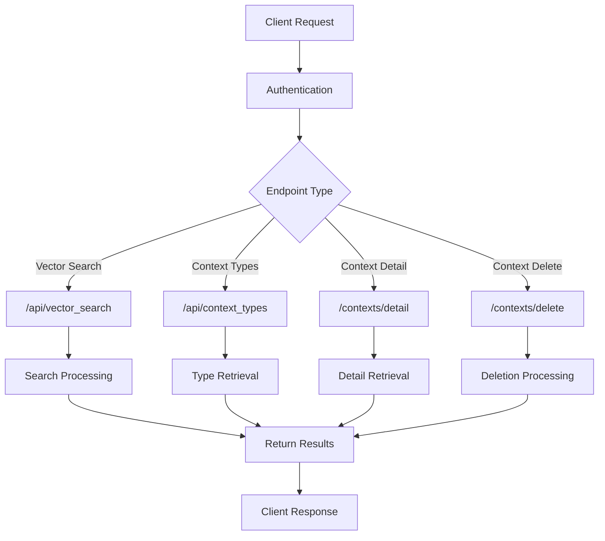
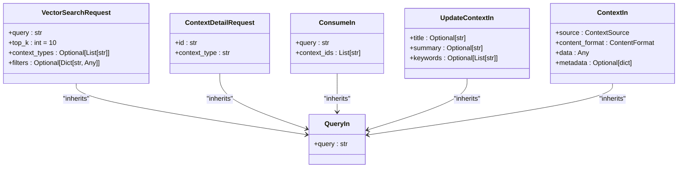
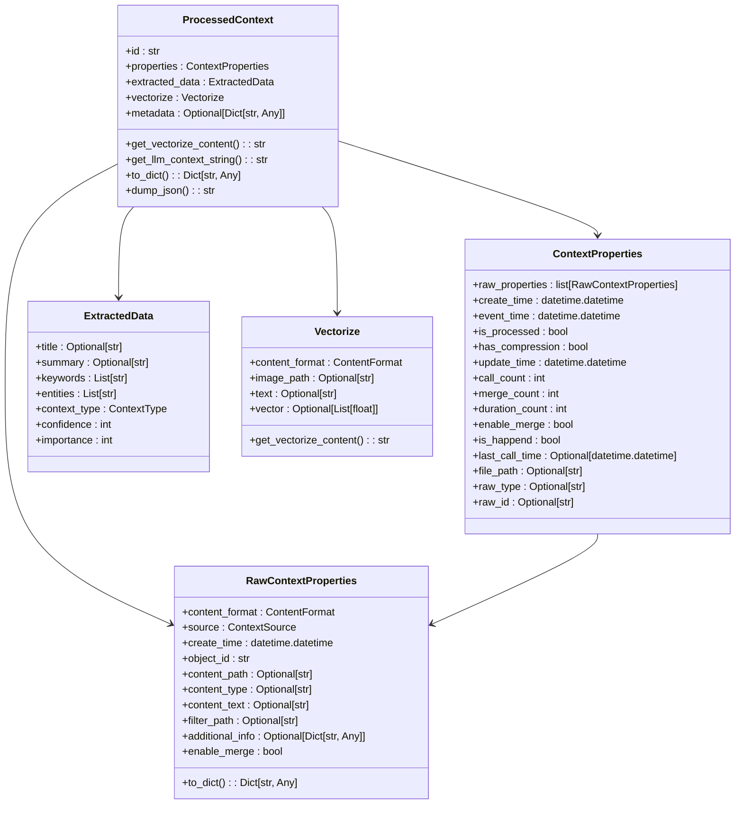
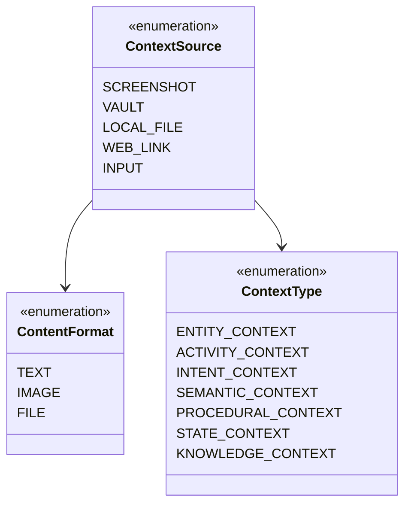
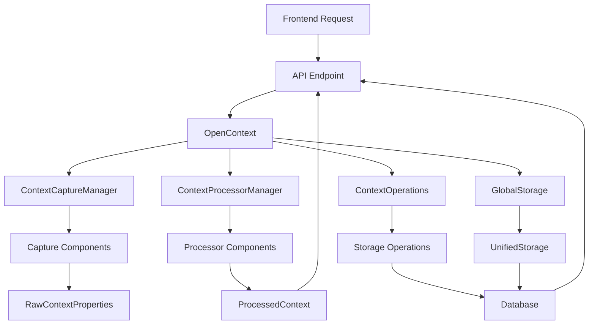
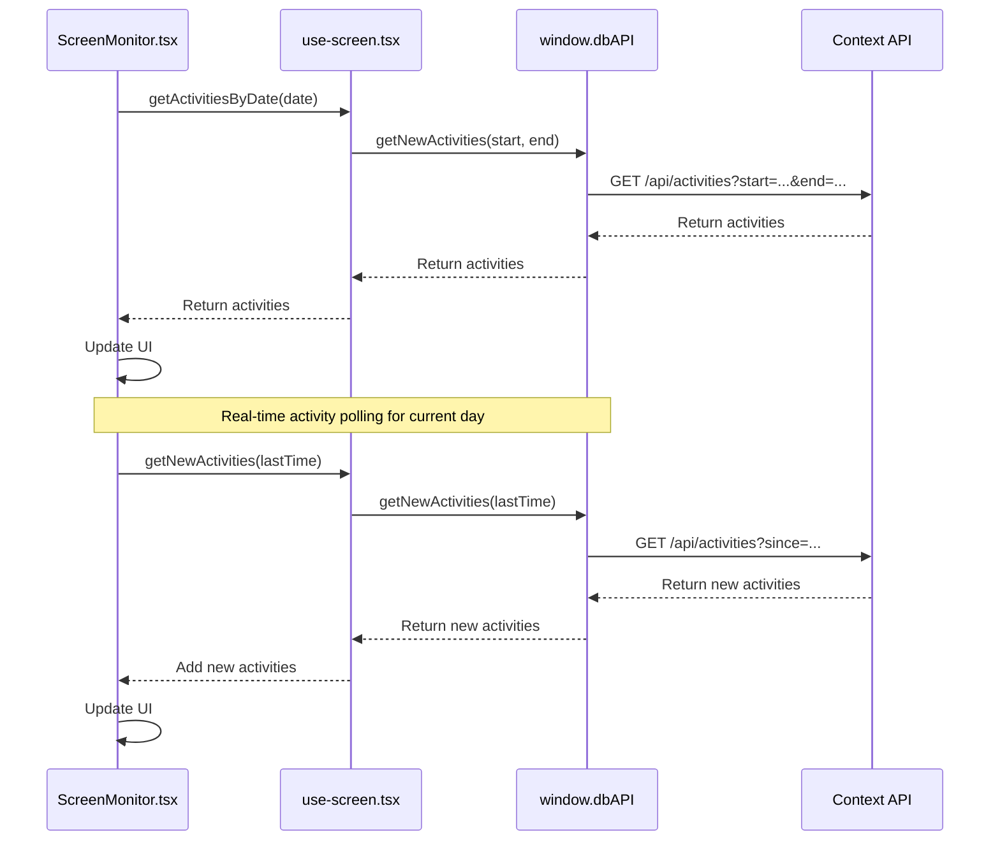
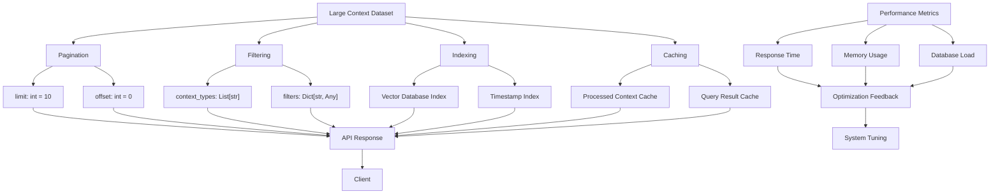

# Context Management Endpoints

<cite>
**Referenced Files in This Document**   
- [context.py](file://opencontext/server/routes/context.py)
- [context_operations.py](file://opencontext/server/context_operations.py)
- [opencontext.py](file://opencontext/server/opencontext.py)
- [context.py](file://opencontext/models/context.py)
- [enums.py](file://opencontext/models/enums.py)
- [global_storage.py](file://opencontext/storage/global_storage.py)
- [screen-monitor.tsx](file://frontend/src/renderer/src/pages/screen-monitor/screen-monitor.tsx)
- [home-page.tsx](file://frontend/src/renderer/src/pages/home/home-page.tsx)
- [use-screen.tsx](file://frontend/src/renderer/src/hooks/use-screen.tsx)
- [use-home-info.ts](file://frontend/src/renderer/src/hooks/use-home-info.ts)
</cite>

## Table of Contents
1. [Introduction](#introduction)
2. [Core Endpoints](#core-endpoints)
3. [Request/Response Schemas](#requestresponse-schemas)
4. [Context Data Model](#context-data-model)
5. [Source Type Filtering](#source-type-filtering)
6. [Integration with Processing Modules](#integration-with-processing-modules)
7. [Frontend Consumption](#frontend-consumption)
8. [Performance Considerations](#performance-considerations)

## Introduction
The Context Management API provides endpoints for retrieving, filtering, and managing captured user context data. This documentation details the endpoints that handle context data captured from various sources such as screenshots, documents, and web links. The API enables clients to retrieve context by time range, filter by source type, and manage context metadata. The system integrates with context_capture and context_processing modules to provide processed context data to the frontend components, particularly the ScreenMonitor and Home pages.

## Core Endpoints

The context management endpoints are implemented in the FastAPI application and provide comprehensive functionality for managing user context data. The primary endpoints include vector search, context type retrieval, and context deletion operations.

**Diagram sources**
- [context.py](file://opencontext/server/routes/context.py#L1-L146)

**Section sources**
- [context.py](file://opencontext/server/routes/context.py#L1-L146)

## Request/Response Schemas

The API endpoints use Pydantic models to define request and response schemas, ensuring type safety and proper validation. The schemas define the structure of data exchanged between the client and server.

**Diagram sources**
- [context.py](file://opencontext/server/routes/context.py#L48-L67)

**Section sources**
- [context.py](file://opencontext/server/routes/context.py#L48-L67)

## Context Data Model

The context data model defines the structure of processed context data, including properties, extracted data, and vectorization information. The model supports various context types and metadata storage.

**Diagram sources**
- [context.py](file://opencontext/models/context.py#L131-L343)

**Section sources**
- [context.py](file://opencontext/models/context.py#L131-L343)

## Source Type Filtering

The system supports filtering context data by source type, including screenshot, document, web link, and other sources. The ContextSource enumeration defines the available source types.

**Diagram sources**
- [enums.py](file://opencontext/models/enums.py#L15-L101)

**Section sources**
- [enums.py](file://opencontext/models/enums.py#L15-L101)

## Integration with Processing Modules

The context management endpoints integrate with the context_capture and context_processing modules to retrieve and process context data. The OpenContext class serves as the main entry point, coordinating between capture, processing, and storage components.

**Diagram sources**
- [opencontext.py](file://opencontext/server/opencontext.py#L31-L300)
- [context_operations.py](file://opencontext/server/context_operations.py#L24-L224)

**Section sources**
- [opencontext.py](file://opencontext/server/opencontext.py#L31-L300)
- [context_operations.py](file://opencontext/server/context_operations.py#L24-L224)

## Frontend Consumption

The frontend components consume the context management API endpoints to display context data in the ScreenMonitor and Home pages. The React components use hooks to fetch and manage context data.

**Diagram sources**
- [screen-monitor.tsx](file://frontend/src/renderer/src/pages/screen-monitor/screen-monitor.tsx#L1-L575)
- [use-screen.tsx](file://frontend/src/renderer/src/hooks/use-screen.tsx#L1-L261)

**Section sources**
- [screen-monitor.tsx](file://frontend/src/renderer/src/pages/screen-monitor/screen-monitor.tsx#L1-L575)
- [use-screen.tsx](file://frontend/src/renderer/src/hooks/use-screen.tsx#L1-L261)

## Performance Considerations

The context management system implements several performance optimizations for handling large context datasets, including pagination, filtering, and efficient storage operations.

**Diagram sources**
- [context_operations.py](file://opencontext/server/context_operations.py#L30-L44)
- [global_storage.py](file://opencontext/storage/global_storage.py#L1-L196)

**Section sources**
- [context_operations.py](file://opencontext/server/context_operations.py#L30-L44)
- [global_storage.py](file://opencontext/storage/global_storage.py#L1-L196)