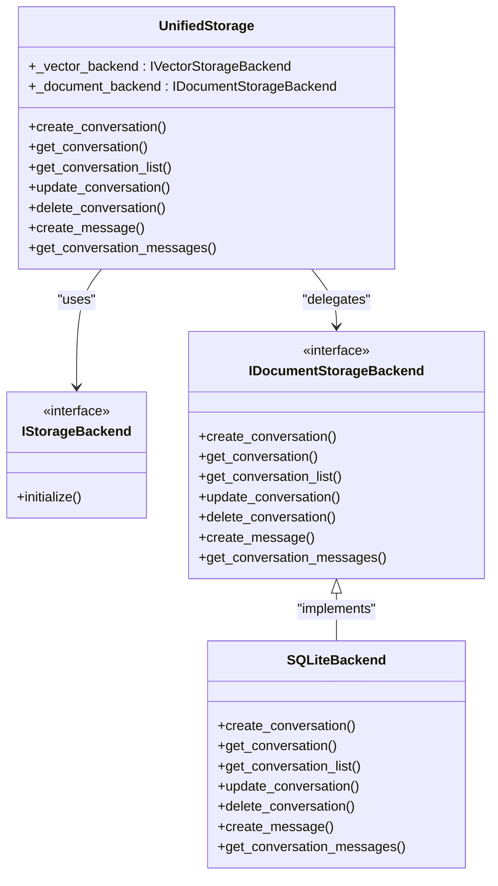
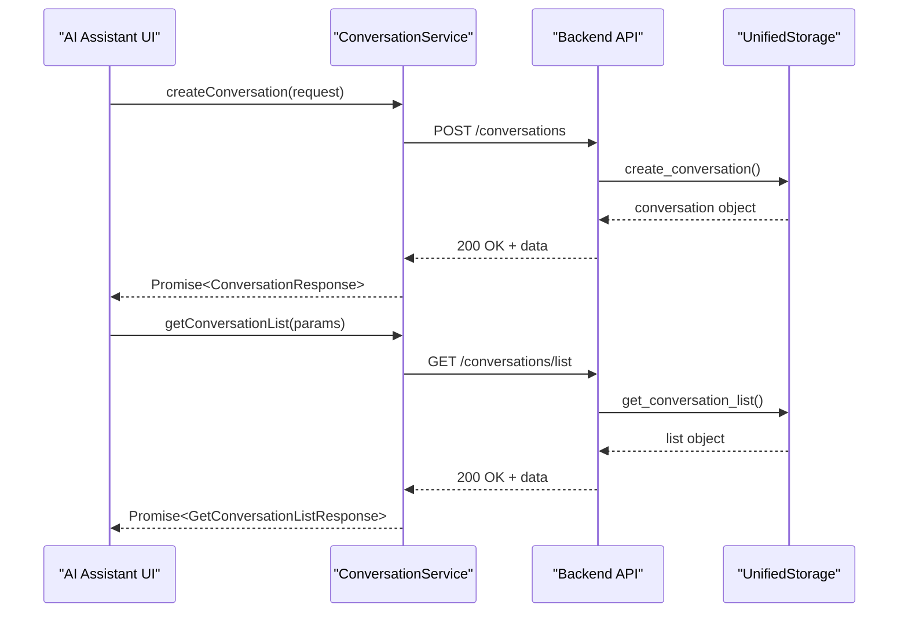

# Conversation Management Endpoints

<cite>
**Referenced Files in This Document**   
- [conversation.py](file://opencontext/server/routes/conversation.py)
- [messages.py](file://opencontext/server/routes/messages.py)
- [unified_storage.py](file://opencontext/storage/unified_storage.py)
- [conversation-service.ts](file://frontend/src/renderer/src/services/conversation-service.ts)
- [messages-service.ts](file://frontend/src/renderer/src/services/messages-service.ts)
- [ai-assistant/index.tsx](file://frontend/src/renderer/src/components/ai-assistant/index.tsx)
</cite>

## Table of Contents
1. [Introduction](#introduction)
2. [Core Endpoints](#core-endpoints)
3. [Data Model](#data-model)
4. [Database Storage System](#database-storage-system)
5. [Frontend Integration](#frontend-integration)
6. [Data Retention and Privacy](#data-retention-and-privacy)
7. [Error Handling](#error-handling)
8. [Conclusion](#conclusion)

## Introduction

The Conversation Management API provides a comprehensive set of endpoints for managing AI conversation history and state within the application. These endpoints enable the creation, retrieval, updating, and deletion of conversations, along with detailed message management for chat threads. The system is designed to support the AI assistant interface, allowing users to maintain context-aware conversations across different application pages and document contexts.

The API follows RESTful principles with clear endpoint structures and consistent response formats. All endpoints are grouped under the `/api/agent/chat` prefix and require authentication via the auth dependency system. The conversation management system is tightly integrated with the application's storage layer, which handles persistence to a document database backend.

**Section sources**
- [conversation.py](file://opencontext/server/routes/conversation.py#L1-L234)
- [messages.py](file://opencontext/server/routes/messages.py#L1-L316)

## Core Endpoints

### Conversation Management Endpoints

The conversation management endpoints handle the lifecycle of conversations, from creation to deletion.

#### Create Conversation
- **Endpoint**: `POST /api/agent/chat/conversations`
- **Request Model**: `CreateConversationRequest`
- **Response Model**: `ConversationResponse`

This endpoint creates a new conversation with the specified page context. The request requires a `page_name` parameter (e.g., 'home' or 'creation') and optionally accepts a `document_id` to associate the conversation with a specific document.

#### Get Conversation List
- **Endpoint**: `GET /api/agent/chat/conversations/list`
- **Response Model**: `GetConversationListResponse`

Retrieves a paginated list of conversations with filtering capabilities. Query parameters include:
- `limit`: Number of conversations to return (default: 20)
- `offset`: Pagination offset (default: 0)
- `page_name`: Filter by page name
- `user_id`: Filter by user ID
- `status`: Filter by status ('active' or 'deleted')

#### Get Conversation Detail
- **Endpoint**: `GET /api/agent/chat/conversations/{cid}`
- **Response Model**: `ConversationResponse`

Retrieves detailed information about a specific conversation by its ID.

#### Update Conversation Title
- **Endpoint**: `PATCH /api/agent/chat/conversations/{cid}/update`
- **Request Model**: `UpdateConversationRequest`
- **Response Model**: `ConversationResponse`

Updates the title of an existing conversation. The request body contains the new title string.

#### Delete Conversation
- **Endpoint**: `DELETE /api/agent/chat/conversations/{cid}/update`
- **Response Model**: `DeleteConversationResponse`

Marks a conversation as deleted (soft delete) by updating its status to 'deleted'. This preserves the conversation data while removing it from active views.

**Section sources**
- [conversation.py](file://opencontext/server/routes/conversation.py#L77-L234)

### Message Management Endpoints

The message management endpoints handle the creation and modification of messages within conversations.

#### Create Message
- **Endpoint**: `POST /api/agent/chat/message/{mid}/create`
- **Request Model**: `CreateMessageParams`
- **Response**: `int` (message ID)

Creates a new message in a conversation. The URL parameter `mid` is used as the parent message ID. The request includes conversation ID, role, content, and optional completion and token count information.

#### Create Streaming Message
- **Endpoint**: `POST /api/agent/chat/message/stream/{mid}/create`
- **Request Model**: `CreateStreamingMessageParams`
- **Response**: `int` (message ID)

Creates a placeholder for a streaming message that will be updated incrementally as content is generated.

#### Update Message
- **Endpoint**: `POST /api/agent/chat/message/{mid}/update`
- **Request Model**: `UpdateMessageContentParams`
- **Response**: `bool`

Updates the content of an existing message. The URL parameter `mid` specifies the message ID to update.

#### Append Message Content
- **Endpoint**: `POST /api/agent/chat/message/{mid}/append`
- **Request Model**: `AppendMessageContentParams`
- **Response**: `bool`

Appends content to an existing message, primarily used for streaming responses where content is generated incrementally.

#### Mark Message as Finished
- **Endpoint**: `POST /api/agent/chat/message/{mid}/finished`
- **Response**: `bool`

Marks a message as complete, updating its status to 'completed'.

#### Get Conversation Messages
- **Endpoint**: `GET /api/agent/chat/conversations/{cid}/messages`
- **Response**: `List[ConversationMessage]`

Retrieves all messages for a specific conversation.

#### Interrupt Message Generation
- **Endpoint**: `POST /api/agent/chat/messages/{mid}/interrupt`
- **Response Model**: `MessageInterruptResponse`

Interrupts ongoing message generation by setting both database status and in-memory interrupt flags.

**Section sources**
- [messages.py](file://opencontext/server/routes/messages.py#L102-L316)

## Data Model

### Conversation Data Structure

The conversation data model includes the following fields:

- `id`: Integer identifier for the conversation
- `title`: Optional title string
- `user_id`: Optional user identifier
- `created_at`: ISO format timestamp of creation
- `updated_at`: ISO format timestamp of last update
- `metadata`: JSON string containing additional metadata
- `page_name`: String indicating the application page context
- `status`: String indicating conversation status ('active' or 'deleted')

### Message Data Structure

The message data model includes comprehensive fields for tracking conversation content and state:

- `id`: Integer identifier for the message
- `conversation_id`: Reference to the parent conversation
- `parent_message_id`: Optional reference to parent message in thread
- `role`: String indicating message role ('user' or 'assistant')
- `content`: Message content string
- `status`: Message status ('pending', 'completed', 'cancelled', etc.)
- `token_count`: Integer count of tokens in the message
- `metadata`: JSON string containing additional metadata
- `latency_ms`: Integer representing processing latency
- `error_message`: Optional error message string
- `thinking`: Array of thinking records for AI processing
- `completed_at`: Optional ISO format timestamp of completion
- `created_at`: ISO format timestamp of creation
- `updated_at`: ISO format timestamp of last update

### Request and Response Models

The API uses Pydantic models for request validation and response formatting, ensuring consistent data structures across endpoints. These models are mirrored in the frontend TypeScript code for type safety.

**Section sources**
- [conversation.py](file://opencontext/server/routes/conversation.py#L30-L73)
- [messages.py](file://opencontext/server/routes/messages.py#L41-L99)
- [conversation-service.ts](file://frontend/src/renderer/src/services/conversation-service.ts#L5-L35)
- [messages-service.ts](file://frontend/src/renderer/src/services/messages-service.ts#L5-L50)

## Database Storage System

### Storage Architecture

The conversation management system uses a unified storage architecture that abstracts the underlying database implementation. The `UnifiedStorage` class provides a single interface for all data operations, with the actual persistence handled by a document database backend.

**Diagram sources**
- [unified_storage.py](file://opencontext/storage/unified_storage.py#L90-L800)
- [conversation.py](file://opencontext/server/routes/conversation.py#L18-L19)

### Data Persistence Flow

When a conversation operation is requested, the flow follows this pattern:

1. The API endpoint receives the request and validates parameters
2. The `get_storage()` function retrieves the global storage instance
3. The appropriate method on the `UnifiedStorage` class is called
4. The method delegates to the document backend (e.g., SQLite)
5. The backend executes the database operation and returns results
6. The response is formatted according to the Pydantic model

The system uses soft deletes for conversations, marking them as 'deleted' rather than removing them from the database. This allows for potential recovery and maintains referential integrity with associated messages.

**Section sources**
- [unified_storage.py](file://opencontext/storage/unified_storage.py#L382-L789)
- [conversation.py](file://opencontext/server/routes/conversation.py#L86-L234)

## Frontend Integration

### Service Layer Implementation

The frontend implements a service layer that wraps API calls with type safety and error handling. The `ConversationService` and `MessageService` classes provide a clean interface for the UI components.

**Diagram sources**
- [conversation-service.ts](file://frontend/src/renderer/src/services/conversation-service.ts#L40-L164)
- [messages-service.ts](file://frontend/src/renderer/src/services/messages-service.ts#L55-L199)

### AI Assistant Integration

The AI assistant component uses the conversation endpoints to manage user interactions:

1. When the assistant is opened, it checks for an existing conversation ID
2. If no conversation exists, it creates a new one with the current page context
3. Messages are sent to the backend and streamed back to the UI
4. The conversation history is maintained and displayed in the interface
5. Users can start new conversations or continue existing ones

The integration handles various states including loading, error conditions, and streaming responses. The UI displays workflow stages (intent analysis, context gathering, execution, reflection) to provide feedback on the AI processing status.

**Section sources**
- [ai-assistant/index.tsx](file://frontend/src/renderer/src/components/ai-assistant/index.tsx#L1-L356)
- [conversation-service.ts](file://frontend/src/renderer/src/services/conversation-service.ts#L58-L145)

## Data Retention and Privacy

### Data Retention Policy

The system implements a soft delete mechanism for conversations, which means:

- Deleted conversations are marked with status 'deleted' but remain in the database
- This allows for potential recovery of accidentally deleted conversations
- No automatic purging of deleted conversations is currently implemented
- Users can restore deleted conversations through the UI

### Privacy Considerations

The conversation management system addresses privacy through several mechanisms:

1. **Authentication**: All endpoints require authentication via the auth dependency system
2. **User Isolation**: Conversations can be filtered by user_id, supporting multi-user scenarios
3. **Metadata Handling**: Sensitive information should not be stored in metadata fields
4. **Document Context**: When associating conversations with documents, only the document ID is stored, not the document content

The system does not currently implement end-to-end encryption for conversation data, and all data is stored in the local database without additional encryption at rest.

**Section sources**
- [conversation.py](file://opencontext/server/routes/conversation.py#L206-L234)
- [unified_storage.py](file://opencontext/storage/unified_storage.py#L463-L473)

## Error Handling

The API implements comprehensive error handling to ensure robust operation:

- **HTTP Status Codes**: Standard HTTP status codes are used (200 for success, 404 for not found, 500 for server errors)
- **Exception Handling**: Try-catch blocks wrap all database operations
- **Logging**: Detailed logging is implemented for debugging and monitoring
- **Validation**: Pydantic models validate request data before processing

Frontend services include error handling with user-friendly messages and retry capabilities. Network errors and API failures are caught and reported to the user interface.

**Section sources**
- [conversation.py](file://opencontext/server/routes/conversation.py#L108-L111)
- [messages.py](file://opencontext/server/routes/messages.py#L131-L134)
- [conversation-service.ts](file://frontend/src/renderer/src/services/conversation-service.ts#L152-L159)
- [messages-service.ts](file://frontend/src/renderer/src/services/messages-service.ts#L188-L194)

## Conclusion

The Conversation Management API provides a robust foundation for handling AI conversation history and state in the application. With comprehensive endpoints for CRUD operations on conversations and messages, the system supports the AI assistant's functionality while maintaining data integrity and user context.

The architecture effectively separates concerns between the API layer, storage abstraction, and frontend integration, allowing for maintainable and extensible code. The integration with the document database ensures persistent storage of conversation history, while the service layer implementation provides a clean interface for the user interface.

Future enhancements could include hard deletion with data purging, improved data encryption, and more sophisticated data retention policies based on age or user preferences.