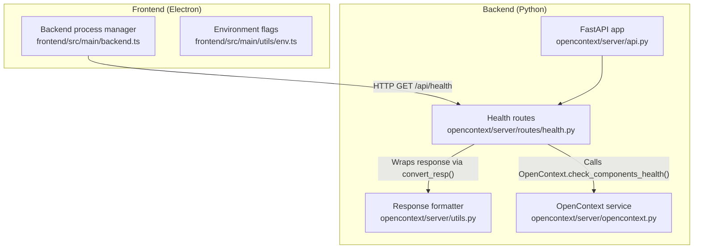
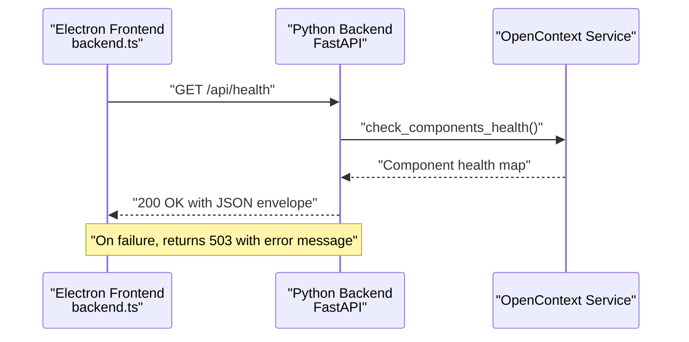
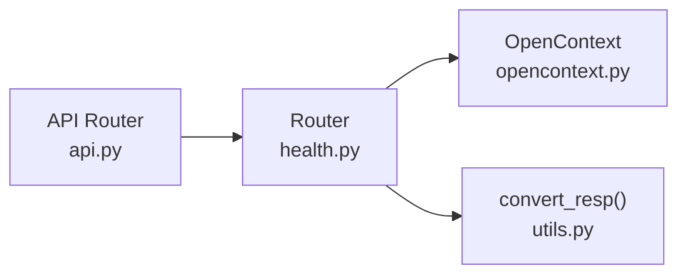

# Health Check Endpoint

<cite>
**Referenced Files in This Document**
- [health.py](file://opencontext/server/routes/health.py)
- [utils.py](file://opencontext/server/utils.py)
- [api.py](file://opencontext/server/api.py)
- [opencontext.py](file://opencontext/server/opencontext.py)
- [backend.ts](file://frontend/src/main/backend.ts)
- [env.ts](file://frontend/src/main/utils/env.ts)
</cite>

## Table of Contents
1. [Introduction](#introduction)
2. [Project Structure](#project-structure)
3. [Core Components](#core-components)
4. [Architecture Overview](#architecture-overview)
5. [Detailed Component Analysis](#detailed-component-analysis)
6. [Dependency Analysis](#dependency-analysis)
7. [Performance Considerations](#performance-considerations)
8. [Troubleshooting Guide](#troubleshooting-guide)
9. [Conclusion](#conclusion)

## Introduction
This document describes the health check endpoint at /api/health, its HTTP semantics, response schema, and operational role in verifying backend service availability. It explains how the Electron frontend uses this endpoint during application startup to confirm the Python backend readiness, including success (200) and error (503) scenarios. It also covers development versus production behavior and how the endpoint fits into the overall system monitoring strategy.

## Project Structure
The health check endpoint is implemented in the Python FastAPI backend and consumed by the Electron frontend. The relevant pieces are:
- Backend: FastAPI router exposing /api/health and related helpers
- Frontend: Electron process manager that starts the backend and polls /api/health until ready

**Diagram sources**
- [api.py](file://opencontext/server/api.py#L37-L58)
- [health.py](file://opencontext/server/routes/health.py#L19-L41)
- [utils.py](file://opencontext/server/utils.py#L28-L41)
- [opencontext.py](file://opencontext/server/opencontext.py#L259-L270)
- [backend.ts](file://frontend/src/main/backend.ts#L83-L137)
- [env.ts](file://frontend/src/main/utils/env.ts#L8-L11)

**Section sources**
- [api.py](file://opencontext/server/api.py#L37-L58)
- [health.py](file://opencontext/server/routes/health.py#L19-L41)
- [utils.py](file://opencontext/server/utils.py#L28-L41)
- [opencontext.py](file://opencontext/server/opencontext.py#L259-L270)
- [backend.ts](file://frontend/src/main/backend.ts#L83-L137)
- [env.ts](file://frontend/src/main/utils/env.ts#L8-L11)

## Core Components
- Health route handler: Implements HTTP GET /api/health and returns a standardized JSON envelope with service status and component health.
- Response formatter: Ensures consistent JSON shape across all API responses.
- OpenContext service: Provides component health checks used by the detailed health endpoint.
- Frontend process manager: Starts the backend process and polls /api/health until healthy.

Key responsibilities:
- Backend: Validate service readiness and report component status.
- Frontend: Manage lifecycle of the backend process and gate UI startup on readiness.

**Section sources**
- [health.py](file://opencontext/server/routes/health.py#L19-L41)
- [utils.py](file://opencontext/server/utils.py#L28-L41)
- [opencontext.py](file://opencontext/server/opencontext.py#L259-L270)
- [backend.ts](file://frontend/src/main/backend.ts#L83-L137)

## Architecture Overview
The health check endpoint is mounted on the main FastAPI router and depends on the OpenContext service to evaluate component readiness. The Electron frontend orchestrates backend startup and performs repeated polling until the backend responds with success.

**Diagram sources**
- [health.py](file://opencontext/server/routes/health.py#L25-L41)
- [opencontext.py](file://opencontext/server/opencontext.py#L259-L270)
- [backend.ts](file://frontend/src/main/backend.ts#L83-L137)

## Detailed Component Analysis

### Backend Health Endpoint (/api/health)
- Method: GET
- Path: /api/health
- Purpose: Return service health and component readiness
- Success response (200): JSON envelope containing status, service name, and component health map
- Failure response (503): JSON envelope indicating service unhealthy

Response schema (200 OK):
{
  "code": 0,
  "status": 200,
  "message": "success",
  "data": {
    "status": "healthy",
    "service": "opencontext",
    "components": {
      "config": true,
      "storage": true,
      "llm": true,
      "capture": true,
      "consumption": true
    }
  }
}

Error response schema (503):
{
  "code": 503,
  "status": 503,
  "message": "Service unhealthy"
}

Implementation highlights:
- Uses a dependency injection to obtain the OpenContext instance
- Calls OpenContext.check_components_health() to produce the components map
- Wraps the payload using convert_resp() to ensure consistent JSON envelope

**Section sources**
- [health.py](file://opencontext/server/routes/health.py#L25-L41)
- [opencontext.py](file://opencontext/server/opencontext.py#L259-L270)
- [utils.py](file://opencontext/server/utils.py#L28-L41)

### Response Envelope Standardization
All API responses are normalized by convert_resp(), which ensures:
- Consistent fields: code, status, message
- Optional data payload
- JSON serialization handled safely

This guarantees that clients receive predictable response shapes regardless of the endpoint.

**Section sources**
- [utils.py](file://opencontext/server/utils.py#L28-L41)

### Frontend Startup and Health Polling
The Electron backend manager:
- Starts the Python backend process
- Polls /api/health at intervals with a timeout
- On success, marks backend as running and proceeds with UI initialization
- On repeated failures, surfaces a clear error and stops

Behavioral details:
- Polling URL: http://127.0.0.1:<selected_port>/api/health
- Retry count and delay configured in the frontend
- Timeout per request is enforced
- Status transitions are logged and surfaced to the UI

Development vs production:
- Development mode flag controls whether the backend is started by the frontend or expected to run externally
- Packaging and resource paths differ between development and production

**Section sources**
- [backend.ts](file://frontend/src/main/backend.ts#L83-L137)
- [env.ts](file://frontend/src/main/utils/env.ts#L8-L11)

### Example Request/Response Payloads
Success (200):
- Request: GET /api/health
- Response body:
{
  "code": 0,
  "status": 200,
  "message": "success",
  "data": {
    "status": "healthy",
    "service": "opencontext",
    "components": {
      "config": true,
      "storage": true,
      "llm": true,
      "capture": true,
      "consumption": true
    }
  }
}

Error (503):
- Request: GET /api/health
- Response body:
{
  "code": 503,
  "status": 503,
  "message": "Service unhealthy"
}

**Section sources**
- [health.py](file://opencontext/server/routes/health.py#L25-L41)
- [utils.py](file://opencontext/server/utils.py#L28-L41)

### Integration with Electron Backend Management
The frontend backend.ts orchestrates:
- Port selection and availability checks
- Backend process spawning with appropriate environment and working directory
- Startup detection via stdout/stderr patterns
- Health polling loop with retries and timeouts
- Status updates and IPC notifications to the renderer process

This integration ensures the UI waits for a fully initialized backend before rendering.

**Section sources**
- [backend.ts](file://frontend/src/main/backend.ts#L347-L583)
- [backend.ts](file://frontend/src/main/backend.ts#L83-L137)

## Dependency Analysis
The health endpoint depends on:
- FastAPI router registration
- OpenContext service for component health evaluation
- Response formatter for consistent envelopes

**Diagram sources**
- [health.py](file://opencontext/server/routes/health.py#L19-L41)
- [opencontext.py](file://opencontext/server/opencontext.py#L259-L270)
- [utils.py](file://opencontext/server/utils.py#L28-L41)
- [api.py](file://opencontext/server/api.py#L37-L58)

**Section sources**
- [health.py](file://opencontext/server/routes/health.py#L19-L41)
- [opencontext.py](file://opencontext/server/opencontext.py#L259-L270)
- [utils.py](file://opencontext/server/utils.py#L28-L41)
- [api.py](file://opencontext/server/api.py#L37-L58)

## Performance Considerations
- Health endpoint is lightweight and synchronous; it evaluates component readiness without heavy computation.
- Frontend polling uses bounded retries and timeouts to avoid blocking startup indefinitely.
- Response envelope normalization adds negligible overhead and improves client parsing reliability.

## Troubleshooting Guide
Common issues and diagnostics:
- 503 Service Unhealthy
  - Cause: An exception occurred during health evaluation
  - Action: Inspect backend logs for the exception and component initialization errors
  - Evidence: The endpoint logs the exception and returns a 503 envelope

- Repeated 503 responses
  - Cause: Backend not fully initialized or components failing health checks
  - Action: Verify configuration, storage, and LLM clients are available; check backend logs

- ECONNREFUSED or timeout
  - Cause: Backend process not yet listening or port conflicts
  - Action: Confirm port selection and availability; ensure the backend started successfully

- Development vs production differences
  - Behavior: In development, the backend may be expected to run externally depending on flags
  - Action: Adjust environment flags and packaging settings accordingly

**Section sources**
- [health.py](file://opencontext/server/routes/health.py#L35-L41)
- [backend.ts](file://frontend/src/main/backend.ts#L83-L137)
- [env.ts](file://frontend/src/main/utils/env.ts#L8-L11)

## Conclusion
The /api/health endpoint provides a reliable mechanism to verify backend readiness. Its standardized response envelope and component health evaluation enable robust frontend orchestration and clear error signaling. Combined with Electron’s backend management, it ensures a smooth application startup experience across development and production environments.