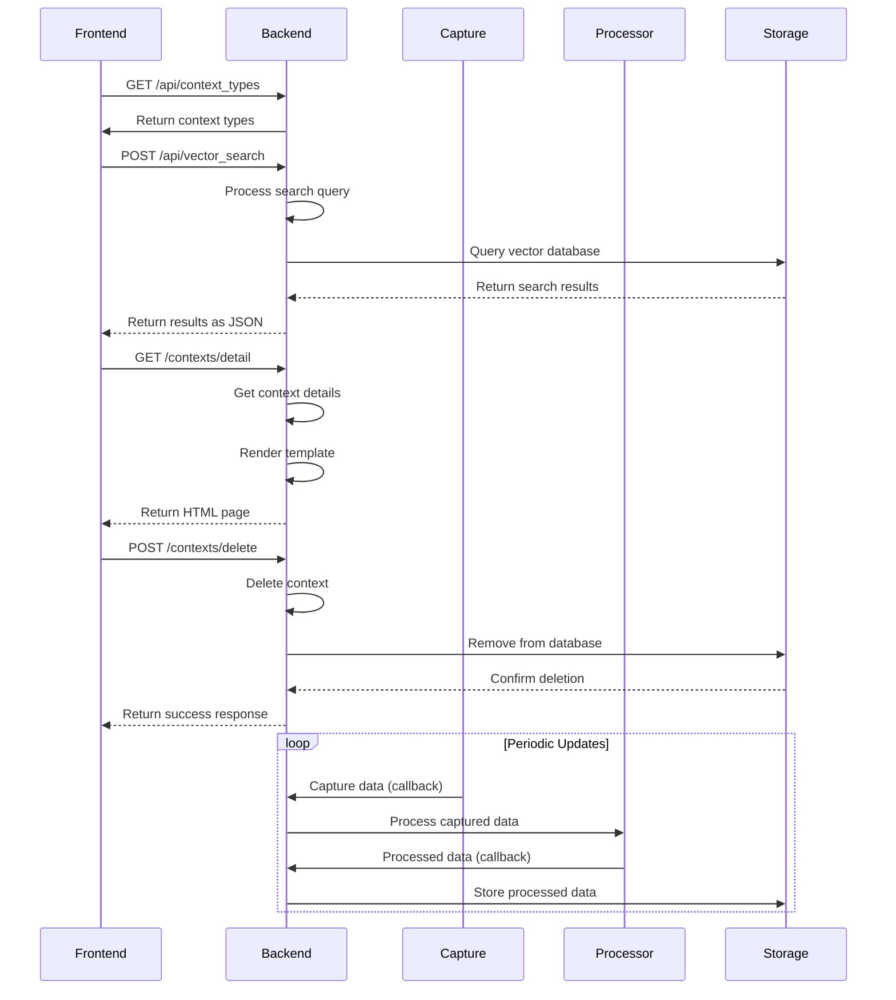

# Backend Architecture

<cite>
**Referenced Files in This Document**   
- [opencontext/__init__.py](file://opencontext/__init__.py)
- [opencontext/server/api.py](file://opencontext/server/api.py)
- [opencontext/managers/capture_manager.py](file://opencontext/managers/capture_manager.py)
- [opencontext/managers/processor_manager.py](file://opencontext/managers/processor_manager.py)
- [opencontext/managers/consumption_manager.py](file://opencontext/managers/consumption_manager.py)
- [opencontext/config/config_manager.py](file://opencontext/config/config_manager.py)
- [opencontext/config/global_config.py](file://opencontext/config/global_config.py)
- [opencontext/server/component_initializer.py](file://opencontext/server/component_initializer.py)
- [opencontext/server/opencontext.py](file://opencontext/server/opencontext.py)
- [config/config.yaml](file://config/config.yaml)
- [opencontext/utils/logging_utils.py](file://opencontext/utils/logging_utils.py)
- [opencontext/interfaces/capture_interface.py](file://opencontext/interfaces/capture_interface.py)
- [opencontext/interfaces/processor_interface.py](file://opencontext/interfaces/processor_interface.py)
- [opencontext/models/context.py](file://opencontext/models/context.py)
</cite>

## Table of Contents
1. [Introduction](#introduction)
2. [Project Structure](#project-structure)
3. [Core Components](#core-components)
4. [API Entry Points](#api-entry-points)
5. [Configuration Management](#configuration-management)
6. [Service Architecture](#service-architecture)
7. [Component Initialization](#component-initialization)
8. [Frontend Integration](#frontend-integration)
9. [Lifecycle Management](#lifecycle-management)
10. [Context Processing Pipeline](#context-processing-pipeline)
11. [Logging and Error Handling](#logging-and-error-handling)
12. [Conclusion](#conclusion)

## Introduction
The MineContext backend architecture is a comprehensive context management system designed for intelligent applications. Built primarily in Python, the system is organized within the opencontext package and provides a robust framework for capturing, processing, and consuming contextual data from various sources. The architecture follows a modular design with clearly defined components for capture, processing, and consumption, enabling flexible integration with frontend applications through HTTP API endpoints. This documentation provides a detailed overview of the backend architecture, focusing on the organization of service components, API entry points, configuration management, and the overall system design.

## Project Structure
The MineContext project follows a well-organized directory structure that separates concerns and facilitates maintainability. The core backend functionality resides in the opencontext package, which contains several subdirectories for different aspects of the system. The config directory houses configuration files including config.yaml and prompts files for different languages. The opencontext package is divided into logical modules: context_capture for capturing contextual data, context_processing for processing captured data, context_consumption for generating insights from processed data, managers for coordinating components, and server for the API and web interface. This structure enables clear separation of concerns and makes the system easier to understand and extend.

**Diagram sources**
- [opencontext/__init__.py](file://opencontext/__init__.py)
- [config/config.yaml](file://config/config.yaml)

**Section sources**
- [opencontext/__init__.py](file://opencontext/__init__.py)
- [config/config.yaml](file://config/config.yaml)

## Core Components
The MineContext backend architecture is built around several core components that work together to capture, process, and consume contextual data. The system is organized within the opencontext package and follows a modular design pattern. The main components include the CaptureManager, ProcessorManager, and ConsumptionManager, each responsible for a specific aspect of the context management pipeline. These managers coordinate various specialized components that handle specific tasks such as screenshot capture, document processing, or content generation. The architecture is designed to be extensible, allowing new capture sources or processing algorithms to be added without modifying the core system. The components communicate through well-defined interfaces and callbacks, ensuring loose coupling and maintainability.

**Section sources**
- [opencontext/managers/capture_manager.py](file://opencontext/managers/capture_manager.py)
- [opencontext/managers/processor_manager.py](file://opencontext/managers/processor_manager.py)
- [opencontext/managers/consumption_manager.py](file://opencontext/managers/consumption_manager.py)

## API Entry Points
The API entry points for MineContext are defined in the server/api.py file, which serves as the main router configuration for the FastAPI application. The api.py module imports and includes routers from various submodules, creating a comprehensive API surface for interacting with the backend system. The main router includes endpoints from health, web, context, content_generation, screenshots, debug, monitoring, vaults, agent_chat, completions, events, settings, conversation, messages, and documents modules. This modular approach to routing allows for clear separation of concerns and makes the API easier to maintain and extend. The API provides endpoints for health checks, context management, content generation, debugging, monitoring, user settings, and various other functionalities required by the frontend application.

**Diagram sources**
- [opencontext/server/api.py](file://opencontext/server/api.py)

**Section sources**
- [opencontext/server/api.py](file://opencontext/server/api.py)

## Configuration Management
The configuration management system in MineContext is centered around the ConfigManager class and the GlobalConfig singleton, which work together to load and manage system configurations from YAML files. The system uses a hierarchical configuration approach with a primary config.yaml file that can be extended with user-specific settings stored in a separate user_setting.yaml file. The configuration system supports environment variable substitution, allowing sensitive information like API keys to be injected at runtime. The GlobalConfig class provides a unified interface for accessing configuration values and prompts, implementing the singleton pattern to ensure consistent access across the application. Configuration values can be accessed using dot notation for nested structures, and the system supports dynamic reloading of configuration changes.

**Diagram sources**
- [opencontext/config/config_manager.py](file://opencontext/config/config_manager.py)
- [opencontext/config/global_config.py](file://opencontext/config/global_config.py)

**Section sources**
- [opencontext/config/config_manager.py](file://opencontext/config/config_manager.py)
- [opencontext/config/global_config.py](file://opencontext/config/global_config.py)
- [config/config.yaml](file://config/config.yaml)

## Service Architecture
The service architecture of MineContext is built around three main manager classes: CaptureManager, ProcessorManager, and ConsumptionManager. These managers coordinate specialized components that handle specific aspects of context management. The CaptureManager manages context capture components like screenshot capture and document monitoring, providing a unified interface for starting, stopping, and monitoring capture operations. The ProcessorManager handles the processing of captured context data through various processors like document_processor and screenshot_processor, coordinating the flow of data through the processing pipeline. The ConsumptionManager manages content generation services that create insights from processed data, including activity summaries, smart tips, and todo lists. These managers work together to form a complete context management pipeline, with data flowing from capture to processing to consumption.

**Diagram sources**
- [opencontext/managers/capture_manager.py](file://opencontext/managers/capture_manager.py)
- [opencontext/managers/processor_manager.py](file://opencontext/managers/processor_manager.py)
- [opencontext/managers/consumption_manager.py](file://opencontext/managers/consumption_manager.py)

**Section sources**
- [opencontext/managers/capture_manager.py](file://opencontext/managers/capture_manager.py)
- [opencontext/managers/processor_manager.py](file://opencontext/managers/processor_manager.py)
- [opencontext/managers/consumption_manager.py](file://opencontext/managers/consumption_manager.py)

## Component Initialization
The component initialization process in MineContext is handled by the ComponentInitializer class and the OpenContext main class, which work together to instantiate and configure all system components in the correct order. The initialization process begins with the creation of the OpenContext instance, which sets up the core managers (CaptureManager, ProcessorManager, etc.). The initialize() method then orchestrates the initialization of all components, starting with global singletons like GlobalConfig and GlobalStorage, followed by the capture components, processors, and consumption components. The ComponentInitializer class provides specialized methods for initializing different types of components, using configuration data to determine which components to enable and how to configure them. This modular initialization approach ensures that components are properly configured and connected before the system becomes operational.

**Diagram sources**
- [opencontext/server/component_initializer.py](file://opencontext/server/component_initializer.py)
- [opencontext/server/opencontext.py](file://opencontext/server/opencontext.py)

**Section sources**
- [opencontext/server/component_initializer.py](file://opencontext/server/component_initializer.py)
- [opencontext/server/opencontext.py](file://opencontext/server/opencontext.py)

## Frontend Integration
The backend integrates with the frontend through a comprehensive HTTP API implemented with FastAPI. The API endpoints are defined in the server/api.py file and organized into modular routers for different functionality areas. The frontend communicates with the backend through these RESTful endpoints, enabling features like context management, content generation, monitoring, and settings configuration. The API uses standard HTTP methods and returns JSON responses, making it easy for the frontend to consume. Authentication is optional and can be enabled through the api_auth configuration in config.yaml. The API also supports HTML responses for certain endpoints, allowing the backend to serve web pages directly to the frontend. This integration model enables a clean separation between the frontend and backend while providing a rich set of functionality for the user interface.

**Diagram sources**
- [opencontext/server/api.py](file://opencontext/server/api.py)
- [opencontext/server/routes/context.py](file://opencontext/server/routes/context.py)

**Section sources**
- [opencontext/server/api.py](file://opencontext/server/api.py)
- [opencontext/server/routes/context.py](file://opencontext/server/routes/context.py)

## Lifecycle Management
The lifecycle management of capture components in MineContext is handled by the ContextCaptureManager, which provides a comprehensive interface for controlling the lifecycle of capture components. The manager maintains a registry of registered components and tracks their running state, allowing for controlled startup and shutdown of individual components or all components at once. Components are started and stopped through the start_component() and stop_component() methods, which handle the necessary setup and cleanup operations. The manager also supports graceful shutdown, allowing components to complete ongoing operations before stopping. The lifecycle management system includes error handling and statistics tracking, providing visibility into the status and performance of capture components. This centralized approach to lifecycle management ensures consistent behavior across different capture components and simplifies the overall system architecture.

**Diagram sources**
- [opencontext/managers/capture_manager.py](file://opencontext/managers/capture_manager.py)

**Section sources**
- [opencontext/managers/capture_manager.py](file://opencontext/managers/capture_manager.py)

## Context Processing Pipeline
The context processing pipeline in MineContext is designed as a modular system where captured raw context data is transformed into processed, structured context through a series of processing steps. The pipeline begins with raw context data captured by various sources (screenshots, documents, etc.) and flows through specialized processors that extract meaningful information. The ProcessorManager coordinates this process, using a routing table to determine which processor should handle each type of input based on its source and content format. Processors implement the IContextProcessor interface, ensuring consistent behavior across different processing algorithms. The pipeline supports both synchronous and batch processing, with the ability to process multiple inputs concurrently using a thread pool. Processed contexts are then stored in the storage system and made available for consumption by other components.

**Diagram sources**
- [opencontext/managers/processor_manager.py](file://opencontext/managers/processor_manager.py)
- [opencontext/context_processing/processor/document_processor.py](file://opencontext/context_processing/processor/document_processor.py)
- [opencontext/context_processing/processor/screenshot_processor.py](file://opencontext/context_processing/processor/screenshot_processor.py)

**Section sources**
- [opencontext/managers/processor_manager.py](file://opencontext/managers/processor_manager.py)
- [opencontext/context_processing/processor/document_processor.py](file://opencontext/context_processing/processor/document_processor.py)
- [opencontext/context_processing/processor/screenshot_processor.py](file://opencontext/context_processing/processor/screenshot_processor.py)

## Logging and Error Handling
The logging system in MineContext is implemented through the logging_utils module, which provides a consistent interface for logging across all components. The system uses the loguru library for logging, with a custom setup that includes structured logging and configurable log levels. Each major component creates its own logger instance using the get_logger() function, which binds the component name to log messages for easier filtering and analysis. The error handling patterns follow a consistent approach across the codebase, with try-except blocks used to catch and log exceptions, often with additional context information. Critical operations include comprehensive error handling with appropriate logging levels (info, warning, error, exception), and many methods return boolean success indicators to allow calling code to handle failures appropriately. The system also includes statistics tracking for errors, providing visibility into the reliability of different components.

**Diagram sources**
- [opencontext/utils/logging_utils.py](file://opencontext/utils/logging_utils.py)
- [opencontext/managers/capture_manager.py](file://opencontext/managers/capture_manager.py)
- [opencontext/managers/processor_manager.py](file://opencontext/managers/processor_manager.py)

**Section sources**
- [opencontext/utils/logging_utils.py](file://opencontext/utils/logging_utils.py)
- [opencontext/managers/capture_manager.py](file://opencontext/managers/capture_manager.py)
- [opencontext/managers/processor_manager.py](file://opencontext/managers/processor_manager.py)

## Conclusion
The MineContext backend architecture presents a well-structured and modular system for context management in intelligent applications. Built on Python and organized within the opencontext package, the system follows a clear separation of concerns with distinct components for capture, processing, and consumption of contextual data. The architecture leverages modern Python practices including type hints, dataclasses, and asynchronous programming where appropriate. The configuration system based on YAML files and the GlobalConfig singleton provides a flexible way to manage settings across the application. The API entry points in server/api.py expose a comprehensive set of endpoints that enable seamless integration with the frontend application. The service architecture, centered around the CaptureManager, ProcessorManager, and ConsumptionManager, provides a robust foundation for extending the system with new capture sources, processing algorithms, or content generation capabilities. Overall, the architecture demonstrates thoughtful design with an emphasis on maintainability, extensibility, and clear component boundaries.