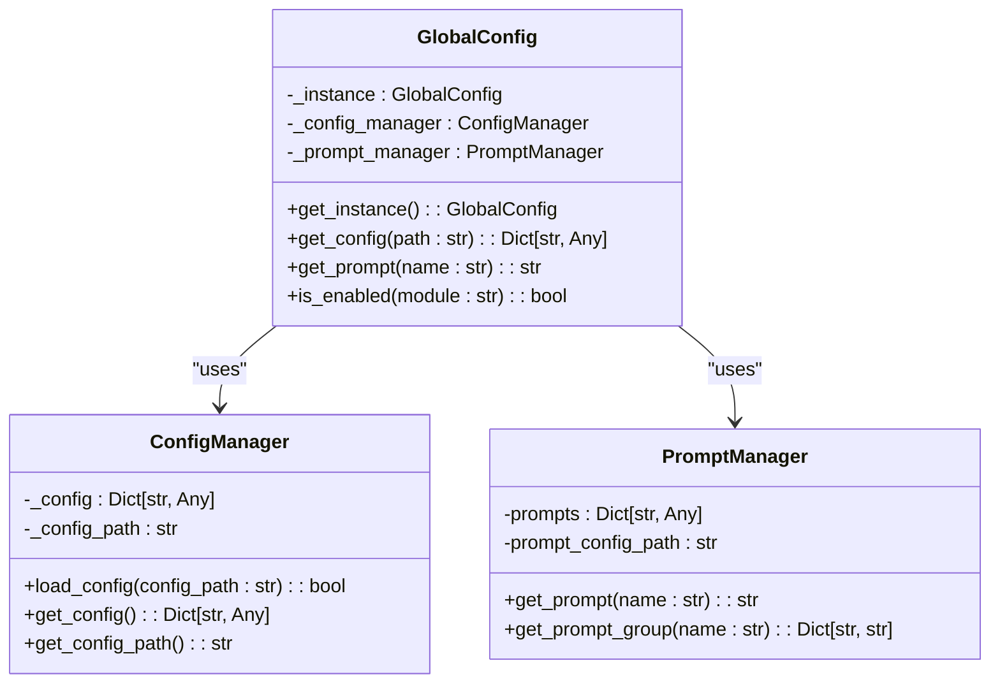
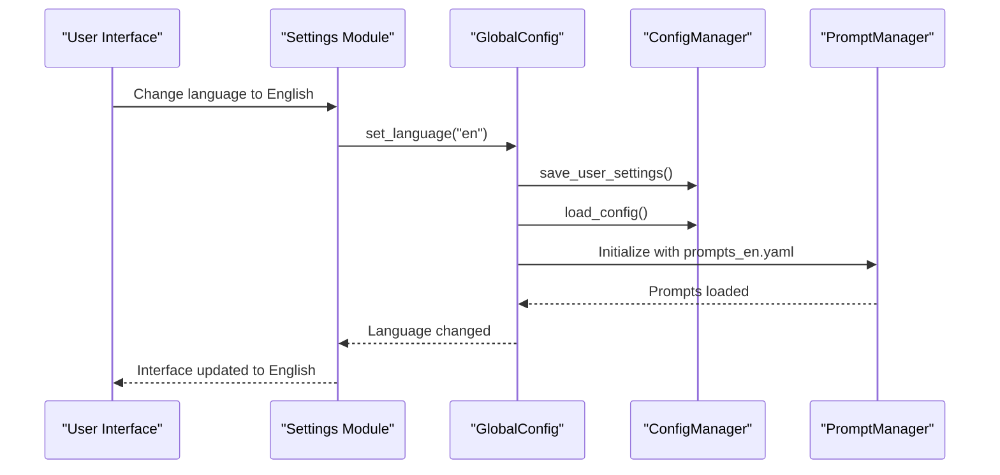

# Configuration Management

<cite>
**Referenced Files in This Document**   
- [config.yaml](file://config/config.yaml)
- [prompts_en.yaml](file://config/prompts_en.yaml)
- [prompts_zh.yaml](file://config/prompts_zh.yaml)
- [quick_start_default.md](file://config/quick_start_default.md)
- [config_manager.py](file://opencontext/config/config_manager.py)
- [global_config.py](file://opencontext/config/global_config.py)
- [prompt_manager.py](file://opencontext/config/prompt_manager.py)
- [consumption_manager.py](file://opencontext/managers/consumption_manager.py)
</cite>

## Table of Contents
1. [Configuration Management](#configuration-management)
2. [ConfigManager Class and Configuration Loading](#configmanager-class-and-configuration-loading)
3. [Config File Structure](#config-file-structure)
4. [GlobalConfig Singleton](#globalconfig-singleton)
5. [Prompt Management System](#prompt-management-system)
6. [Runtime Configuration Handling](#runtime-configuration-handling)
7. [Default Configuration and Quick Start](#default-configuration-and-quick-start)
8. [Common Configuration Scenarios](#common-configuration-scenarios)
9. [Troubleshooting Configuration Issues](#troubleshooting-configuration-issues)

## ConfigManager Class and Configuration Loading

The configuration management system in MineContext is centered around the `ConfigManager` class, which is responsible for loading, parsing, and managing the application's configuration. This class provides a centralized way to access configuration data throughout the application.

The `ConfigManager` class is initialized and used to load the `config.yaml` file from the configuration directory. It handles environment variable substitution within the configuration file, allowing values like `${CONTEXT_PATH:.}` to be replaced with actual environment variable values or defaults. The class also supports loading user-specific settings from a separate `user_setting.yaml` file, which are then merged with the main configuration to override default values.

Components throughout the application access configuration data through the `GlobalConfig` singleton, which internally uses the `ConfigManager` to provide a unified interface. This design pattern ensures that all components have consistent access to the latest configuration without needing to pass configuration objects between components.

**Section sources**
- [config_manager.py](file://opencontext/config/config_manager.py#L24-L253)
- [global_config.py](file://opencontext/config/global_config.py#L23-L331)

## Config File Structure

The `config.yaml` file is the central configuration file for the MineContext application, containing various sections that control different aspects of the system's behavior. The file is structured into several logical sections, each responsible for a specific domain of functionality.

### General and Logging Configuration
The configuration begins with general settings and logging configuration. The `enabled` flag controls whether the system is active, while the `logging` section specifies the log level and output path. This allows users to control the verbosity of logging and where log files are stored.

### API Authentication
The `api_auth` section controls API authentication settings. It includes an `enabled` flag to turn authentication on or off, a list of API keys, and a list of `excluded_paths` that do not require authentication. This provides a flexible security model where certain endpoints can be accessed without authentication while others require valid API keys.

### Content Generation Intervals
The `content_generation` section defines the timing and frequency of various automated content generation tasks. This includes settings for activity monitoring, smart tips, todo generation, and daily reports. Each task has an `enabled` flag and specific timing parameters:
- `activity`: Controls how frequently activity summaries are generated (interval in seconds)
- `tips`: Controls the frequency of smart tip generation 
- `todos`: Controls how frequently todo items are generated
- `report`: Specifies the daily time for generating comprehensive reports

### LLM Settings
The configuration includes settings for Large Language Model (LLM) integration, with separate sections for the Vision Language Model (`vlm_model`) and embedding model (`embedding_model`). These sections specify the base URL, API key, model name, and provider for each service. The use of environment variable references (e.g., `${LLM_BASE_URL}`) allows sensitive credentials to be kept outside the configuration file.

### Module-Specific Configuration
Additional sections configure specific modules within the application:
- `document_processing`: Controls document processing behavior including batch size and image size limits
- `capture`: Configures screen capture, folder monitoring, and file monitoring settings
- `processing`: Defines settings for document and screenshot processing, including batch sizes and timeouts
- `storage`: Specifies storage backends and their configurations
- `consumption`: Controls the context consumption module
- `web`: Sets the host and port for the web server
- `tools`: Configures available tools and their settings
- `completion`: Enables or disables the intelligent completion service

**Section sources**
- [config.yaml](file://config/config.yaml#L1-L253)

## GlobalConfig Singleton

The `GlobalConfig` class implements the singleton pattern to provide a unified interface for accessing configuration data throughout the application. This singleton serves as the primary access point for all components that need to retrieve configuration values or prompts.

The `GlobalConfig` instance is automatically initialized when first accessed, loading the configuration from the `config.yaml` file and initializing the prompt manager based on the configured language. Components can access the singleton instance through the `get_instance()` class method or convenience functions like `get_config()`, `get_prompt()`, and `is_enabled()`.

This design ensures that all components in the application have consistent access to the same configuration state. The singleton maintains references to both the `ConfigManager` and `PromptManager`, providing methods to retrieve configuration values by path (e.g., `get_config("content_generation.activity.interval")`) and to check if specific modules are enabled.

The `GlobalConfig` also provides convenience functions that allow components to access configuration data without directly referencing the singleton instance, promoting cleaner code and reducing dependencies.



**Diagram sources**
- [global_config.py](file://opencontext/config/global_config.py#L23-L331)
- [config_manager.py](file://opencontext/config/config_manager.py#L24-L253)
- [prompt_manager.py](file://opencontext/config/prompt_manager.py#L17-L220)

**Section sources**
- [global_config.py](file://opencontext/config/global_config.py#L23-L331)

## Prompt Management System

MineContext implements a sophisticated prompt management system that supports multiple languages and user customization. The system is designed to load AI prompts from language-specific YAML files based on the user's language preferences.

The prompt system uses two primary files: `prompts_en.yaml` for English prompts and `prompts_zh.yaml` for Chinese prompts. The active language is determined by the `language` setting in the `prompts` section of the `config.yaml` file. When the application starts, the `GlobalConfig` singleton initializes the `PromptManager` with the appropriate prompt file based on this setting.

The prompt files are structured into logical groups that correspond to different aspects of the AI workflow:
- `chat_workflow`: Contains prompts for different stages of the chat workflow including intent analysis, query classification, and social interaction handling
- `processing`: Includes prompts for content extraction and processing tasks
- `merging`: Contains prompts for context merging operations
- `generation`: Includes prompts for content generation tasks

Each prompt group contains multiple prompts with descriptive names that indicate their purpose. For example, the `chat_workflow` group includes prompts like `intent_analysis`, `query_classification`, and `executor` for different stages of processing user queries.

Users can customize prompts through a user-specific prompts file (e.g., `user_prompts_zh.yaml` or `user_prompts_en.yaml`). The `PromptManager` loads these user prompts and merges them with the default prompts, allowing users to override or extend the default prompt behavior. This merging is done deeply, so users can modify specific parts of complex prompt structures without having to redefine entire prompts.

The system also provides methods to export and import prompt configurations, enabling users to share or backup their custom prompt setups.

**Section sources**
- [prompts_en.yaml](file://config/prompts_en.yaml#L1-L800)
- [prompts_zh.yaml](file://config/prompts_zh.yaml#L1-L800)
- [prompt_manager.py](file://opencontext/config/prompt_manager.py#L17-L220)

## Runtime Configuration Handling

MineContext supports dynamic configuration changes at runtime through a combination of configuration reloading and component reinitialization. The system is designed to respond to configuration changes without requiring a full application restart.

The `ConfigManager` class provides methods to save user settings to the `user_setting.yaml` file, which are then automatically merged with the main configuration. When user settings are updated, the `GlobalConfig` singleton can reload the configuration to incorporate the changes. This is particularly important for settings like API keys or model configurations that may need to be updated during application operation.

For language changes, the `GlobalConfig` class provides a `set_language()` method that updates the language setting, saves it to user settings, and reloads the prompt manager with the new language-specific prompt file. This allows users to switch between English and Chinese interfaces dynamically.

The `ConsumptionManager` class demonstrates how configuration changes are handled for time-based tasks. It monitors configuration changes for content generation intervals and can restart scheduled tasks when these intervals are modified. This ensures that changes to generation frequencies take effect immediately without requiring a restart.

The system also supports resetting user settings to defaults by deleting the `user_setting.yaml` file and reloading the base configuration. This provides a way to recover from configuration issues or revert to default behavior.



**Diagram sources**
- [global_config.py](file://opencontext/config/global_config.py#L23-L331)
- [config_manager.py](file://opencontext/config/config_manager.py#L24-L253)
- [prompt_manager.py](file://opencontext/config/prompt_manager.py#L17-L220)

**Section sources**
- [global_config.py](file://opencontext/config/global_config.py#L23-L331)
- [config_manager.py](file://opencontext/config/config_manager.py#L24-L253)
- [consumption_manager.py](file://opencontext/managers/consumption_manager.py#L31-L524)

## Default Configuration and Quick Start

The MineContext application includes a default configuration setup to help users get started quickly. The `quick_start_default.md` file provides a user-friendly introduction to the application's main features and serves as a guide for new users.

This markdown file explains the core functionality of MineContext, including:
- Screen monitoring capabilities for capturing and analyzing user activities
- The Home interface where daily summaries, todos, and tips are displayed
- Content creation features with AI enhancement
- Support for various content types including images, tables, math expressions, and code blocks

The default configuration in `config.yaml` is designed to work out of the box with reasonable default values for most settings. For example, content generation tasks are enabled by default with intervals that balance responsiveness and resource usage. The API authentication is disabled by default to simplify initial setup, with instructions to enable it in production environments.

The configuration system uses environment variable references with defaults (e.g., `${CONTEXT_PATH:.}`) to ensure the application can run in different environments without requiring configuration changes. This allows the same configuration file to work in development, testing, and production environments with appropriate environment variable settings.

**Section sources**
- [quick_start_default.md](file://config/quick_start_default.md#L1-L61)
- [config.yaml](file://config/config.yaml#L1-L253)

## Common Configuration Scenarios

### Enabling Screen Capture
To enable periodic screen capture, modify the `capture.screenshot` section in `config.yaml`:
```yaml
capture:
  screenshot:
    enabled: true
    capture_interval: 30
    storage_path: "${CONTEXT_PATH:.}/screenshots"
```

### Configuring LLM API Access
Set up LLM integration by providing API credentials through environment variables or directly in configuration:
```yaml
vlm_model:
  base_url: "https://api.example.com/v1"
  api_key: "your-api-key-here"
  model: "gpt-4-vision"
```

### Adjusting Content Generation Frequency
Modify the intervals for automated content generation tasks:
```yaml
content_generation:
  activity:
    enabled: true
    interval: 1800  # Generate activity summaries every 30 minutes
  tips:
    enabled: true
    interval: 7200  # Generate tips every 2 hours
  todos:
    enabled: true
    interval: 3600  # Generate todos every hour
  report:
    enabled: true
    time: "09:00"   # Generate daily report at 9:00 AM
```

### Switching User Interface Language
Change the application language by modifying the prompts configuration:
```yaml
prompts:
  language: "en"  # Change from "zh" to "en" for English interface
```

### Configuring Storage Backend
Switch from the default ChromaDB to Qdrant vector database:
```yaml
storage:
  backends:
    - name: "default_vector"
      storage_type: "vector_db"
      backend: "qdrant"
      config:
        vector_size: 2048
        path: "${CONTEXT_PATH:.}/persist/qdrant"
```

**Section sources**
- [config.yaml](file://config/config.yaml#L1-L253)

## Troubleshooting Configuration Issues

### Configuration File Not Found
If the application cannot find the configuration file, ensure that:
- The `config.yaml` file exists in the `config` directory
- The working directory is correctly set when launching the application
- Environment variables like `CONTEXT_PATH` are properly defined

### Environment Variables Not Resolved
When environment variables in the configuration (e.g., `${LLM_API_KEY}`) are not being replaced:
- Verify that the environment variables are set in the operating system
- Check that the variable names match exactly (case-sensitive)
- Ensure there are no spaces around the variable name or default value

### Language Prompts Not Loading
If the application fails to load prompts for the selected language:
- Verify that the corresponding prompt file (`prompts_en.yaml` or `prompts_zh.yaml`) exists
- Check that the `language` setting in `config.yaml` is correctly set to "en" or "zh"
- Ensure the prompt files are in the correct directory and have the correct permissions

### API Authentication Issues
When experiencing issues with API authentication:
- Verify that `api_auth.enabled` is set correctly for your environment
- Check that API keys in the configuration are correct and properly formatted
- Ensure that the endpoints you're accessing are not in the `excluded_paths` list

### Content Generation Tasks Not Running
If automated content generation tasks are not executing:
- Verify that the `content_generation` tasks are enabled in the configuration
- Check that the intervals are set to reasonable values (minimum 600 seconds for activity, 1800 seconds for others)
- Ensure that the `ConsumptionManager` is properly initialized and started

### Storage Configuration Problems
For issues with storage backends:
- Verify that the specified storage paths exist and are writable
- Check that the vector size in Qdrant configuration matches the embedding model output dimension
- Ensure that database files are not corrupted and have proper permissions

**Section sources**
- [config.yaml](file://config/config.yaml#L1-L253)
- [config_manager.py](file://opencontext/config/config_manager.py#L24-L253)
- [global_config.py](file://opencontext/config/global_config.py#L23-L331)