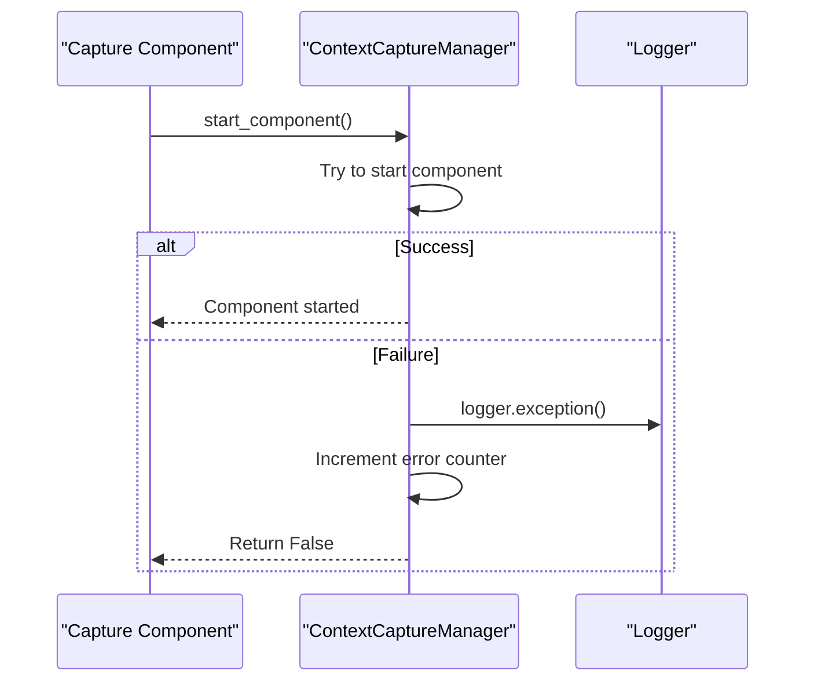
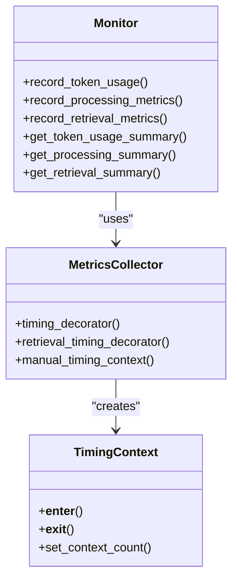
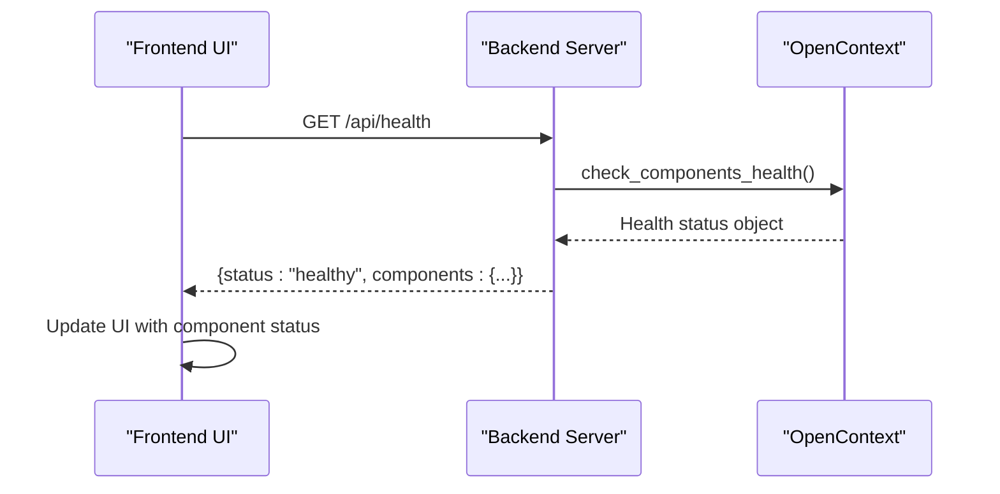
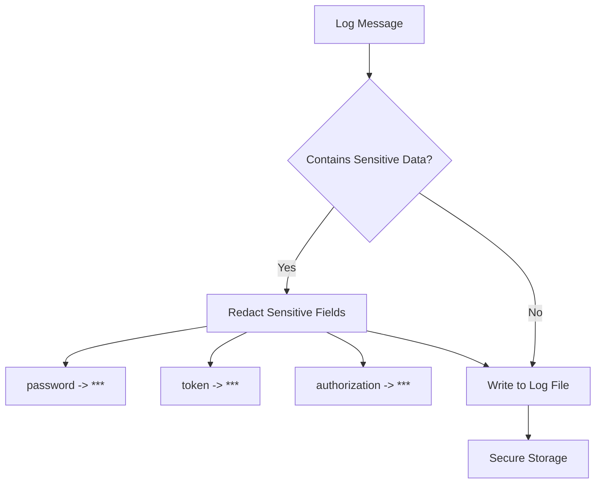

# Logging and Error Handling

<cite>
**Referenced Files in This Document**   
- [logger.py](file://opencontext/utils/logger.py)
- [logging_utils.py](file://opencontext/utils/logging_utils.py)
- [monitor.py](file://opencontext/monitoring/monitor.py)
- [metrics_collector.py](file://opencontext/monitoring/metrics_collector.py)
- [health.py](file://opencontext/server/routes/health.py)
- [capture_manager.py](file://opencontext/managers/capture_manager.py)
- [consumption_manager.py](file://opencontext/managers/consumption_manager.py)
- [event_manager.py](file://opencontext/managers/event_manager.py)
- [processor_manager.py](file://opencontext/managers/processor_manager.py)
- [opencontext.py](file://opencontext/server/opencontext.py)
- [init.ts](file://frontend/packages/shared/logger/init.ts)
- [main.ts](file://frontend/packages/shared/logger/main.ts)
- [redact.ts](file://frontend/packages/shared/logger/redact.ts)
</cite>

## Table of Contents
1. [Introduction](#introduction)
2. [Logging Infrastructure](#logging-infrastructure)
3. [Log Levels and Formatting](#log-levels-and-formatting)
4. [Log File Rotation Strategy](#log-file-rotation-strategy)
5. [Error Handling in Manager Classes](#error-handling-in-manager-classes)
6. [Graceful Degradation](#graceful-degradation)
7. [Monitoring System](#monitoring-system)
8. [Frontend Health Monitoring](#frontend-health-monitoring)
9. [Troubleshooting with Log Files](#troubleshooting-with-log-files)
10. [Best Practices for Logging](#best-practices-for-logging)
11. [Security Considerations](#security-considerations)

## Introduction
The MineContext backend employs a comprehensive logging and error handling system designed to ensure reliability, observability, and maintainability. This documentation details the architecture and implementation of the logging infrastructure, error handling mechanisms, and monitoring capabilities. The system is built on Python's logging module with custom enhancements using the loguru library, providing structured logging, comprehensive error tracking, and real-time monitoring. The frontend monitors backend health through periodic checks to the /api/health endpoint, enabling users to view system status in the UI. This documentation covers the complete logging pipeline, from configuration and formatting to storage, monitoring, and security considerations.

## Logging Infrastructure
The logging infrastructure in MineContext is built on the loguru library, which provides a modern and feature-rich alternative to Python's standard logging module. The core of the logging system is the LogManager class defined in logger.py, which centralizes the configuration and management of logging across the application. The LogManager initializes by removing default handlers and setting up both console and file logging with custom formatters. It supports configurable log levels and output paths, allowing for flexible deployment scenarios. The logging configuration is managed through a dictionary that specifies the log level and file path. The system uses a global log manager instance (log_manager) and logger (log) that are imported and used throughout the codebase, ensuring consistent logging practices. The logging_utils.py module provides convenience functions for setting up logging and obtaining logger instances with contextual information.

**Section sources**
- [logger.py](file://opencontext/utils/logger.py#L1-L86)
- [logging_utils.py](file://opencontext/utils/logging_utils.py#L1-L31)

## Log Levels and Formatting
MineContext implements a clear log level hierarchy with standardized formatting for both console and file outputs. The system supports standard log levels (DEBUG, INFO, WARNING, ERROR, CRITICAL) with INFO as the default level. For console output, logs are formatted with color-coded timestamps, log levels, and messages using the format: `<green>{time:YYYY-MM-DD HH:mm:ss}</green> | <level>{level}</level> | <cyan>{message}</cyan>`. This colorful formatting enhances readability during development and debugging. For file logging, a simpler, machine-readable format is used: `{time:YYYY-MM-DD HH:mm:ss} | {level} | {message}`. This plain text format ensures compatibility with log analysis tools and systems. The formatting conventions are designed to provide sufficient context for troubleshooting while maintaining readability. The log messages include timestamps with millisecond precision, enabling precise correlation of events across different components.

```mermaid
flowchart TD
A[Log Message] --> B{Log Level}
B --> |DEBUG| C[Console: Colorful Format]
B --> |INFO| C
B --> |WARNING| C
B --> |ERROR| C
B --> |CRITICAL| C
C --> D[<green>{time}</green> | <level>{level}</level> | <cyan>{message}</cyan>]
B --> |All Levels| E[File: Plain Text Format]
E --> F[{time} | {level} | {message}]
```

**Diagram sources **
- [logger.py](file://opencontext/utils/logger.py#L40-L43)
- [logger.py](file://opencontext/utils/logger.py#L58-L59)

## Log File Rotation Strategy
The log file rotation strategy in MineContext is designed to balance disk space usage with the need for historical log data. The system implements file rotation based on size, with logs rotated when they reach 100 MB. This prevents individual log files from becoming excessively large and difficult to manage. The rotation strategy also includes retention policies, keeping only the two most recent log files. This ensures that disk space is not consumed indefinitely while still providing access to recent log data for troubleshooting. A key feature of the rotation strategy is the use of date-based filenames, where logs are stored with the pattern `opentext_{time:YYYY-MM-DD}.log`. When a file is rotated, it is renamed with a timestamp suffix (e.g., `opentext_2025-10-13.log.2025-10-13_14-30-00`), making it easy to identify when rotation occurred. The system automatically creates the log directory if it does not exist, ensuring that logging can proceed even if the directory structure is not pre-configured.

**Section sources**
- [logger.py](file://opencontext/utils/logger.py#L44-L69)

## Error Handling in Manager Classes
The manager classes in MineContext implement comprehensive error handling to ensure system stability and provide meaningful error information. Each manager class (CaptureManager, ConsumptionManager, ProcessorManager) follows a consistent pattern of exception handling around critical operations. When exceptions occur during component initialization, startup, or processing, they are caught, logged with full stack traces using the `logger.exception()` method, and appropriate error counters are incremented. For example, in the CaptureManager, if a component fails to initialize or start, the exception is caught, logged, and the method returns False to indicate failure. The managers maintain internal statistics that track error counts, allowing for monitoring of component reliability over time. In the ConsumptionManager, scheduled tasks are wrapped in try-except blocks to prevent a single task failure from stopping the entire scheduler. This defensive programming approach ensures that transient errors do not cascade into system-wide failures.



**Diagram sources **
- [capture_manager.py](file://opencontext/managers/capture_manager.py#L118-L133)
- [consumption_manager.py](file://opencontext/managers/consumption_manager.py#L270-L271)

## Graceful Degradation
MineContext implements graceful degradation to maintain core functionality when components fail. The system is designed with loose coupling between components, allowing the failure of one component to not necessarily impact others. For example, if the screenshot capture component fails, document processing and web link capture can continue to function. The manager classes are designed to handle component failures without crashing the entire application. When a component fails to initialize or start, the manager logs the error but continues to initialize other components. The system also implements retry mechanisms and fallback behaviors where appropriate. In the ProcessorManager, if a processor encounters an exception while processing data, it returns False but allows other processors to continue. The shutdown process is designed to be graceful, with components being stopped in an orderly fashion, allowing them to complete any ongoing operations before termination. This approach ensures that the system remains usable even when individual components are experiencing issues.

**Section sources**
- [capture_manager.py](file://opencontext/managers/capture_manager.py#L145-L171)
- [processor_manager.py](file://opencontext/managers/processor_manager.py#L153-L159)

## Monitoring System
The monitoring system in MineContext collects comprehensive metrics and health information to provide insights into system performance and reliability. The core of the monitoring system is the Monitor class in monitor.py, which maintains in-memory data structures for various types of metrics, including token usage, processing performance, retrieval performance, and processing errors. The system uses thread-safe data structures with locks to ensure data consistency in a multi-threaded environment. Metrics are collected in real-time and can be queried through various summary methods that provide aggregated views over configurable time windows (e.g., last 24 hours). The monitoring system also persists key metrics to the database for long-term storage and analysis. The MetricsCollector class provides decorators and context managers that simplify the collection of timing metrics for functions and code blocks. This allows developers to easily add performance monitoring to new components without complex instrumentation code.



**Diagram sources **
- [monitor.py](file://opencontext/monitoring/monitor.py#L89-L740)
- [metrics_collector.py](file://opencontext/monitoring/metrics_collector.py#L21-L144)

## Frontend Health Monitoring
The frontend monitors backend health through periodic checks to the /api/health endpoint, providing users with real-time system status information in the UI. The health.py module defines the health check endpoints, with the /api/health endpoint providing detailed status information about all major components. When a health check request is received, the OpenContext class's check_components_health() method is called to evaluate the status of configuration, storage, LLM services, capture, and consumption components. The health check aggregates the status of these components into a comprehensive health report that is returned to the frontend. The frontend can then display this information in the UI, typically using visual indicators (e.g., green/red lights) to show the status of each component. This allows users to quickly identify if there are any issues with the backend system. The health check mechanism also serves as a canary, helping to detect issues before they impact user experience.



**Diagram sources **
- [health.py](file://opencontext/server/routes/health.py#L19-L40)
- [opencontext.py](file://opencontext/server/opencontext.py#L260-L269)

## Troubleshooting with Log Files
Interpreting log files is a critical skill for troubleshooting issues in MineContext. The logs provide a chronological record of system events, making them invaluable for diagnosing problems. When troubleshooting, start by identifying the timestamp of the issue and examining logs from that period. Look for ERROR or CRITICAL level messages, which indicate significant problems. Warning messages may also provide clues about potential issues. The structured format of the logs makes it easy to filter and search for specific information. For component-specific issues, look for log messages from the relevant component (e.g., "screenshot_processor" or "document_processor"). The monitoring system's error tracking can also be used to identify recurring issues. The get_processing_errors() method in the Monitor class can provide a summary of recent processing errors, helping to identify patterns. When analyzing logs, pay attention to the context provided in log messages, such as component names, operation types, and error messages, as this information can help pinpoint the root cause of issues.

**Section sources**
- [monitor.py](file://opencontext/monitoring/monitor.py#L530-L568)
- [web/templates/monitoring.html](file://opencontext/web/templates/monitoring.html#L566-L582)

## Best Practices for Logging
When adding new log statements in MineContext, follow these best practices to ensure logs are useful and maintainable. Use appropriate log levels: DEBUG for detailed information useful for debugging, INFO for general operational information, WARNING for potential issues, ERROR for errors that prevent functions from completing, and CRITICAL for serious errors that may require immediate attention. Include sufficient context in log messages to make them self-explanatory, such as component names, operation types, and relevant identifiers. Avoid logging sensitive information such as passwords, tokens, or personal data. When logging complex objects, consider logging only the relevant fields rather than the entire object to keep logs readable. Use structured logging patterns where possible, such as logging key-value pairs that can be easily parsed by log analysis tools. Finally, ensure that log messages are clear and concise, providing enough information to understand what happened without being overly verbose.

**Section sources**
- [llm/llm_client.py](file://opencontext/llm/llm_client.py#L389-L420)
- [capture_manager.py](file://opencontext/managers/capture_manager.py#L63-L64)

## Security Considerations
Security considerations for log data in MineContext focus on protecting sensitive information that might be inadvertently logged. The system implements several measures to prevent the exposure of sensitive data. In the frontend, the redact.ts module automatically sanitizes sensitive information from logs by replacing values of fields named "password", "token", or "headers.authorization" with asterisks ("***"). This ensures that authentication credentials and other sensitive data are not written to log files. The backend should follow a similar pattern, avoiding the logging of sensitive information in the first place. When logging is necessary for debugging, sensitive fields should be explicitly redacted or masked. Log files should be stored with appropriate file permissions to prevent unauthorized access. In production environments, log levels should be set to minimize the amount of detailed information logged, reducing the risk of sensitive data exposure. Regular review of log content should be performed to ensure that no sensitive information is being logged inadvertently.



**Diagram sources **
- [redact.ts](file://frontend/packages/shared/logger/redact.ts#L6-L12)
- [init.ts](file://frontend/packages/shared/logger/init.ts#L63-L111)