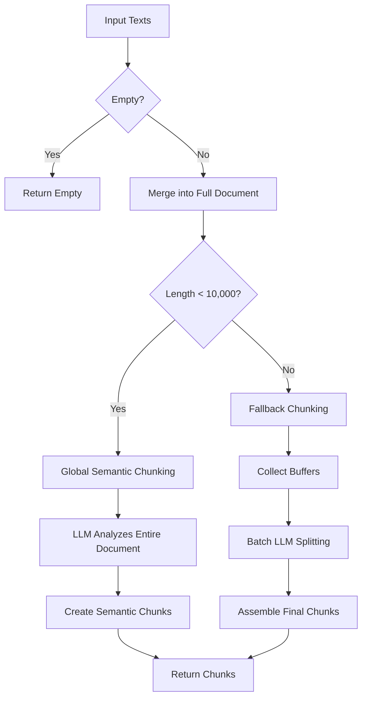
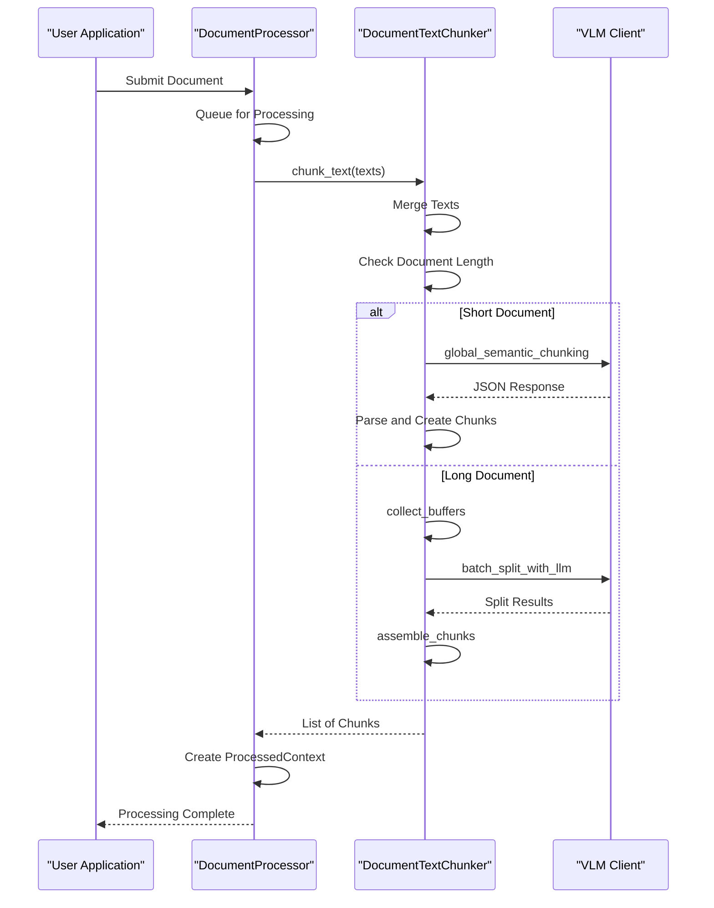

# Chunking Strategy

<cite>
**Referenced Files in This Document**   
- [chunkers.py](file://opencontext/context_processing/chunker/chunkers.py)
- [document_text_chunker.py](file://opencontext/context_processing/chunker/document_text_chunker.py)
- [context.py](file://opencontext/models/context.py)
- [document_processor.py](file://opencontext/context_processing/processor/document_processor.py)
- [config.yaml](file://config/config.yaml)
</cite>

## Table of Contents
1. [Introduction](#introduction)
2. [Core Components](#core-components)
3. [DocumentTextChunker Implementation](#documenttextchunker-implementation)
4. [Configuration and Parameters](#configuration-and-parameters)
5. [Processing Pipeline Integration](#processing-pipeline-integration)
6. [Performance Considerations](#performance-considerations)
7. [Extensibility and Customization](#extensibility-and-customization)

## Introduction

The chunking strategy component is a critical part of the processing pipeline responsible for breaking down raw context data into semantically meaningful fragments suitable for AI processing. This system handles various data types including documents, screenshots, and structured files, transforming them into manageable chunks that preserve context integrity while optimizing for downstream AI analysis. The architecture is designed to be memory-efficient and scalable, with specialized chunkers for different content types and intelligent strategies for text segmentation.

The chunking process plays a vital role in the overall system by enabling efficient vectorization, retrieval, and analysis of content. By dividing large documents into smaller, semantically coherent segments, the system can better capture the meaning and context of information, improving the accuracy and relevance of AI-generated insights. The implementation balances the need for comprehensive context preservation with practical constraints around memory usage and processing time.

**Section sources**
- [chunkers.py](file://opencontext/context_processing/chunker/chunkers.py#L1-L439)
- [document_text_chunker.py](file://opencontext/context_processing/chunker/document_text_chunker.py#L1-L349)

## Core Components

The chunking system is built around a modular architecture with several key components that work together to process different types of content. At the foundation is the `BaseChunker` abstract class, which provides the common interface and shared functionality for all chunking strategies. This base class implements memory-efficient chunking through iterator-based processing and includes configurable parameters for chunk size, overlap, and caching.

Three primary chunker implementations extend this base class: `StructuredFileChunker` for handling CSV, XLSX, and JSONL files; `FAQChunker` for specialized processing of FAQ Excel files; and `DocumentTextChunker` for intelligent text segmentation. Each of these chunkers is optimized for its specific use case, with `StructuredFileChunker` using streaming and batching to handle large files without loading everything into memory at once, and `FAQChunker` treating each Q&A pair as a separate chunk.

The `ChunkingConfig` class provides a centralized way to configure chunking operations with parameters such as maximum chunk size, overlap, minimum chunk size, batch size, and caching. This configuration is passed to chunker instances and influences their behavior, allowing for fine-tuned control over the chunking process based on the specific requirements of different data types and use cases.

**Section sources**
- [chunkers.py](file://opencontext/context_processing/chunker/chunkers.py#L28-L439)
- [document_text_chunker.py](file://opencontext/context_processing/chunker/document_text_chunker.py#L25-L349)
- [context.py](file://opencontext/models/context.py#L24-L34)

## DocumentTextChunker Implementation

The `DocumentTextChunker` class represents the most sophisticated chunking strategy in the system, specifically designed for processing text extracted from visual language models (VLM). This chunker employs a multi-phase approach that combines semantic boundary detection with LLM-powered intelligent splitting to create high-quality text fragments. The implementation follows a three-phase strategy: buffer collection, concurrent LLM processing, and chunk assembly.

The chunking process begins with the `_collect_buffers` method, which accumulates text elements into buffers that need LLM splitting while identifying text that can be used directly as chunks. This phase handles oversized elements by mechanically splitting them when necessary. The system then moves to the `_batch_split_with_llm` phase, where it makes concurrent asynchronous LLM calls to intelligently split the collected buffers. This parallel processing approach maximizes efficiency by leveraging the async capabilities of the LLM client.

For short documents (under 10,000 characters), the system uses global semantic chunking, where the entire document is analyzed at once by the LLM to identify optimal chunk boundaries. For longer documents, it falls back to a paragraph-based strategy that still incorporates LLM intelligence but processes the document in smaller segments. The final phase, `_assemble_chunks`, combines the results from LLM processing with directly usable chunks to create the final output, ensuring that all chunks meet the minimum size requirements and are properly indexed.

**Diagram sources **
- [document_text_chunker.py](file://opencontext/context_processing/chunker/document_text_chunker.py#L39-L339)

**Section sources**
- [document_text_chunker.py](file://opencontext/context_processing/chunker/document_text_chunker.py#L25-L349)

## Configuration and Parameters

The chunking system is highly configurable through the `ChunkingConfig` class, which defines key parameters that control the behavior of all chunkers. The most important configuration options include `max_chunk_size`, which determines the maximum number of characters in a chunk (default 1000), `chunk_overlap` which specifies the number of overlapping characters between adjacent chunks (default 200), and `min_chunk_size` which sets the minimum acceptable chunk size (default 100).

These parameters have significant implications for downstream AI analysis. The `max_chunk_size` directly affects how much context the AI can consider at once, with larger chunks preserving more context but potentially exceeding model token limits. The `chunk_overlap` parameter helps maintain context continuity across chunk boundaries, ensuring that important information at the edges of chunks is not lost. The `min_chunk_size` prevents the creation of trivially small chunks that would be inefficient to process and store.

In the `DocumentProcessor`, these parameters are configured with specific values: a maximum chunk size of 1000 characters, a minimum chunk size of 100 characters, and an overlap of 100 characters. This configuration strikes a balance between preserving sufficient context within each chunk and maintaining reasonable overlap to ensure continuity. The system also supports batch processing with a configurable batch size, which affects how many chunks are processed simultaneously and can impact both performance and memory usage.

**Section sources**
- [chunkers.py](file://opencontext/context_processing/chunker/chunkers.py#L28-L44)
- [document_processor.py](file://opencontext/context_processing/processor/document_processor.py#L78-L84)
- [config.yaml](file://config/config.yaml#L17-L25)

## Processing Pipeline Integration

The chunking system is tightly integrated into the broader processing pipeline through the `DocumentProcessor` class, which serves as the main entry point for document processing. When a document is processed, the system first determines its type and selects the appropriate chunker based on the content format. For structured files like CSV and Excel, it uses the `StructuredFileChunker`; for FAQ Excel files, it employs the specialized `FAQChunker`; and for general text and visual documents, it utilizes the `DocumentTextChunker`.

The integration follows a consistent pattern across different document types: the processor calls the appropriate chunking method, receives an iterator of chunks, and then converts these chunks into `ProcessedContext` objects that can be stored and analyzed. For text content, the `DocumentProcessor` calls the `chunk_text` method of `DocumentTextChunker` with a list of text elements, which then applies the intelligent chunking strategy described earlier. The resulting chunks are wrapped in `ProcessedContext` objects that include metadata about the source document and other contextual information.

This integration is designed to be asynchronous and memory-efficient, with documents being processed in the background by a dedicated thread. The processor uses a queue to manage incoming documents, allowing it to handle multiple processing requests without blocking the main application. This architecture ensures that chunking operations do not impact the responsiveness of the user interface while still providing timely processing of documents.

**Diagram sources **
- [document_processor.py](file://opencontext/context_processing/processor/document_processor.py#L223-L400)
- [document_text_chunker.py](file://opencontext/context_processing/chunker/document_text_chunker.py#L39-L339)

**Section sources**
- [document_processor.py](file://opencontext/context_processing/processor/document_processor.py#L41-L400)

## Performance Considerations

The chunking system incorporates several performance optimizations to handle large documents efficiently while minimizing memory usage. One of the key strategies is the use of iterator-based processing in the base `BaseChunker` class, which allows chunks to be generated on-demand rather than storing all chunks in memory at once. This approach is particularly important when dealing with large documents that could otherwise consume significant memory resources.

For structured files, the `StructuredFileChunker` implements streaming processing using pandas' chunking capabilities, reading and processing files in smaller segments rather than loading the entire file into memory. This is especially beneficial for large CSV and Excel files that might be too big to fit in memory when processed as a whole. The chunk size for streaming operations is configurable through the `batch_size` parameter, allowing users to balance processing speed with memory usage.

The `DocumentTextChunker` employs additional optimizations for handling large text documents. By using LLM caching with the `@lru_cache` decorator on the `_get_sentence_boundaries` method, it avoids redundant sentence boundary detection for the same text. The system also implements a fallback strategy for long documents, avoiding the high cost of analyzing very large documents with the LLM in a single request. Instead, it processes long documents in smaller segments, reducing both processing time and API costs.

Memory usage is further optimized through the use of asynchronous processing and concurrent LLM calls. The `_batch_split_with_llm` method runs multiple LLM requests concurrently, maximizing throughput while keeping memory usage predictable. The system also includes error handling and fallback mechanisms, such as mechanical splitting when LLM calls fail, ensuring that processing can continue even if external services are temporarily unavailable.

**Section sources**
- [chunkers.py](file://opencontext/context_processing/chunker/chunkers.py#L50-L153)
- [document_text_chunker.py](file://opencontext/context_processing/chunker/document_text_chunker.py#L82-L83)
- [document_processor.py](file://opencontext/context_processing/processor/document_processor.py#L69-L70)

## Extensibility and Customization

The chunking system is designed with extensibility in mind, allowing developers to create custom chunkers for new data types or specialized processing requirements. The abstract `BaseChunker` class provides a clear interface that any new chunker must implement, with the `chunk` method serving as the primary entry point. Developers can extend this base class to create specialized chunkers that handle specific file formats or content types not covered by the existing implementations.

To create a custom chunker, developers would typically override the `chunk` method to implement their specific logic for dividing content into meaningful fragments. They can leverage the existing `ChunkingConfig` class to access standardized configuration parameters, ensuring consistency with the rest of the system. The chunker can also utilize the `Chunk` model to create properly formatted output that integrates seamlessly with the downstream processing pipeline.

The system's modular design makes it easy to integrate new chunkers by simply adding them to the processor that handles the relevant content types. For example, a new chunker for a specific document format could be added to the `DocumentProcessor` by extending its type detection logic and adding support for the new file extension. This extensibility allows the system to adapt to new requirements and data types without requiring changes to the core architecture.

**Section sources**
- [chunkers.py](file://opencontext/context_processing/chunker/chunkers.py#L46-L68)
- [document_processor.py](file://opencontext/context_processing/processor/document_processor.py#L111-L131)