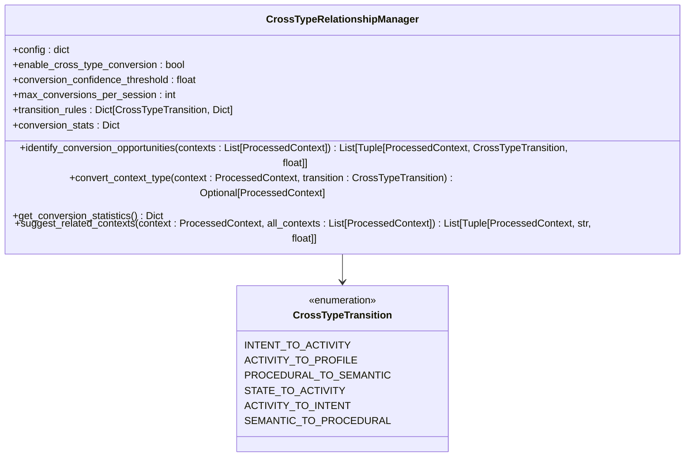
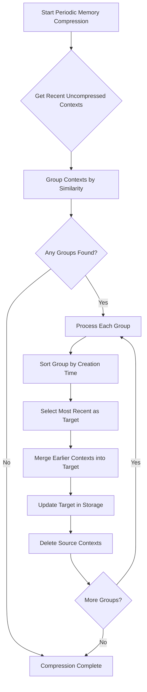
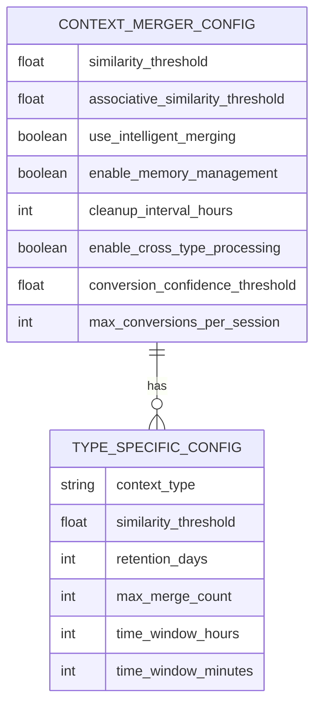

# Context Merging

<cite>
**Referenced Files in This Document**   
- [context_merger.py](file://opencontext/context_processing/merger/context_merger.py)
- [merge_strategies.py](file://opencontext/context_processing/merger/merge_strategies.py)
- [cross_type_relationships.py](file://opencontext/context_processing/merger/cross_type_relationships.py)
- [config.yaml](file://config/config.yaml)
- [context.py](file://opencontext/models/context.py)
- [screenshot_processor.py](file://opencontext/context_processing/processor/screenshot_processor.py)
- [document_processor.py](file://opencontext/context_processing/processor/document_processor.py)
</cite>

## Table of Contents
1. [Introduction](#introduction)
2. [ContextMerger Core Component](#contextmerger-core-component)
3. [Merge Strategies Implementation](#merge-strategies-implementation)
4. [Cross-Type Relationships](#cross-type-relationships)
5. [Memory Compression Process](#memory-compression-process)
6. [Context Merging Example](#context-merging-example)
7. [Configuration Options](#configuration-options)
8. [Performance Considerations](#performance-considerations)
9. [Extending the Merging System](#extending-the-merging-system)
10. [Conclusion](#conclusion)

## Introduction
The context merging component is a critical part of the processing pipeline in the MineContext system, responsible for consolidating related context fragments across different capture types into coherent knowledge units. This system analyzes and merges context data from various sources such as screenshots, documents, and web links, creating a unified representation of user activities and information. The merging process employs multiple strategies including temporal proximity, semantic similarity, and application context matching to identify related contexts. The system also implements periodic memory compression to reduce redundancy while preserving important context associations. This documentation provides a comprehensive overview of the context merging architecture, implementation details, and configuration options.

## ContextMerger Core Component
The ContextMerger class serves as the central component for merging similar contexts into coherent knowledge units. It extends the BaseContextProcessor and implements intelligent merging strategies to consolidate related context fragments. The merger operates by first determining whether a context can be merged based on its properties and vectorization status. When a new context is processed, the system searches for potential merge targets using either intelligent strategies or legacy logic, depending on the configuration. The intelligent merging approach utilizes type-aware strategies to evaluate similarity between contexts, while the legacy approach employs associative and similarity-based merging. The ContextMerger maintains statistics on merge attempts, successes, and errors, providing insights into the merging process efficiency. It also manages the periodic memory compression process, which systematically reduces redundancy in the context graph while preserving important associations.

**Section sources**
- [context_merger.py](file://opencontext/context_processing/merger/context_merger.py#L35-L85)

## Merge Strategies Implementation
The merge strategies are implemented through a type-aware strategy pattern that provides specialized merging logic for different context types. The StrategyFactory initializes and manages various strategy instances, each tailored to a specific context type such as profile, activity, state, intent, semantic, and procedural contexts. Each strategy implements the can_merge method to determine if two contexts can be merged based on type-specific criteria, returning both a boolean result and a similarity score. The merge_contexts method executes the actual merging logic, creating a new ProcessedContext that consolidates information from multiple source contexts. Strategies consider multiple factors including entity overlap, keyword similarity, vector similarity, and temporal proximity when evaluating potential merges. The system also implements a forgetting curve model to determine when contexts should be cleaned up based on their age, importance, and access frequency.

```mermaid
classDiagram
class ContextTypeAwareStrategy {
+config : dict
+context_type : ContextType
+similarity_threshold : float
+retention_days : int
+max_merge_count : int
+can_merge(target : ProcessedContext, source : ProcessedContext) Tuple[bool, float]
+merge_contexts(target : ProcessedContext, sources : List[ProcessedContext]) Optional[ProcessedContext]
+calculate_forgetting_probability(context : ProcessedContext) float
+should_cleanup(context : ProcessedContext) bool
}
class ProfileContextStrategy {
+get_context_type() ContextType
+can_merge(target : ProcessedContext, source : ProcessedContext) Tuple[bool, float]
+merge_contexts(target : ProcessedContext, sources : List[ProcessedContext]) Optional[ProcessedContext]
}
class ActivityContextStrategy {
+get_context_type() ContextType
+can_merge(target : ProcessedContext, source : ProcessedContext) Tuple[bool, float]
+merge_contexts(target : ProcessedContext, sources : List[ProcessedContext]) Optional[ProcessedContext]
}
class StateContextStrategy {
+get_context_type() ContextType
+can_merge(target : ProcessedContext, source : ProcessedContext) Tuple[bool, float]
+merge_contexts(target : ProcessedContext, sources : List[ProcessedContext]) Optional[ProcessedContext]
}
class IntentContextStrategy {
+get_context_type() ContextType
+can_merge(target : ProcessedContext, source : ProcessedContext) Tuple[bool, float]
+merge_contexts(target : ProcessedContext, sources : List[ProcessedContext]) Optional[ProcessedContext]
}
class SemanticContextStrategy {
+get_context_type() ContextType
+can_merge(target : ProcessedContext, source : ProcessedContext) Tuple[bool, float]
+merge_contexts(target : ProcessedContext, sources : List[ProcessedContext]) Optional[ProcessedContext]
}
class ProceduralContextStrategy {
+get_context_type() ContextType
+can_merge(target : ProcessedContext, source : ProcessedContext) Tuple[bool, float]
+merge_contexts(target : ProcessedContext, sources : List[ProcessedContext]) Optional[ProcessedContext]
}
class StrategyFactory {
+config : dict
+_strategies : Dict[ContextType, ContextTypeAwareStrategy]
+get_strategy(context_type : ContextType) Optional[ContextTypeAwareStrategy]
}
ContextTypeAwareStrategy <|-- ProfileContextStrategy
ContextTypeAwareStrategy <|-- ActivityContextStrategy
ContextTypeAwareStrategy <|-- StateContextStrategy
ContextTypeAwareStrategy <|-- IntentContextStrategy
ContextTypeAwareStrategy <|-- SemanticContextStrategy
ContextTypeAwareStrategy <|-- ProceduralContextStrategy
StrategyFactory --> ContextTypeAwareStrategy : "creates"
```

**Diagram sources **
- [merge_strategies.py](file://opencontext/context_processing/merger/merge_strategies.py#L24-L1287)

**Section sources**
- [merge_strategies.py](file://opencontext/context_processing/merger/merge_strategies.py#L24-L1287)

## Cross-Type Relationships
The CrossTypeRelationshipManager establishes connections between different context types to enable holistic insights across the knowledge graph. It implements intelligent conversion and association between different ContextTypes, simulating the process of mutual transformation of information in human memory. The system defines six primary transition types: intent to activity, activity to profile, procedural to semantic, state to activity, activity to intent, and semantic to procedural. Each transition has specific rules and confidence thresholds that determine when a conversion should occur. The manager evaluates conversion opportunities by analyzing content for trigger keywords, context confidence, importance, and other rule-specific criteria. When a conversion is executed, the system creates a new context of the target type while preserving the original context's information. This cross-type relationship system enables the creation of a rich, interconnected knowledge graph that captures the complex relationships between different types of user activities and information.

**Diagram sources **
- [cross_type_relationships.py](file://opencontext/context_processing/merger/cross_type_relationships.py#L24-L430)

**Section sources**
- [cross_type_relationships.py](file://opencontext/context_processing/merger/cross_type_relationships.py#L24-L430)

## Memory Compression Process
The periodic memory compression process systematically reduces redundancy in the context graph while preserving important context associations. This process is triggered at regular intervals by the processor manager and operates by identifying groups of similar contexts within a specified time window. The compression algorithm first retrieves recent contexts that have not been compressed and are eligible for merging. It then groups these contexts by similarity using a greedy algorithm that compares vector embeddings. Within each group, the system sorts contexts by creation time and selects the most recent context as the target for merging. All earlier contexts in the group are merged into this target context, which is then updated in storage. The source contexts are subsequently deleted to eliminate redundancy. This process helps maintain a clean and efficient context graph while preserving the temporal sequence and important information from related contexts.

**Diagram sources **
- [context_merger.py](file://opencontext/context_processing/merger/context_merger.py#L465-L547)

**Section sources**
- [context_merger.py](file://opencontext/context_processing/merger/context_merger.py#L465-L547)

## Context Merging Example
The context merging system demonstrates its capabilities when processing screenshot and document contexts captured during the same activity session. For example, when a user captures multiple screenshots while working on a document, the system identifies these contexts as related based on their temporal proximity and semantic similarity. The ContextMerger first detects that the screenshots and document fragments were created within a short time window, typically defined by the merge_window_duration configuration. It then analyzes the content of these contexts, extracting entities and keywords to determine their semantic relationship. If the system identifies significant entity overlap and high vector similarity, it initiates a merge operation. The resulting merged context consolidates the information from both the screenshots and document text, creating a comprehensive representation of the user's activity. This merged context preserves the temporal sequence of events while eliminating redundant information, providing a coherent narrative of the user's workflow.

**Section sources**
- [context_merger.py](file://opencontext/context_processing/merger/context_merger.py#L185-L238)
- [screenshot_processor.py](file://opencontext/context_processing/processor/screenshot_processor.py#L303-L450)
- [document_processor.py](file://opencontext/context_processing/processor/document_processor.py#L223-L402)

## Configuration Options
The context merging system provides several configuration options to customize its behavior according to specific requirements. The primary configuration parameters are defined in the config.yaml file under the processing.context_merger section. The similarity_threshold parameter controls the minimum similarity score required for contexts to be merged, with a default value of 0.90. The associative_similarity_threshold determines the threshold for associative merging based on temporal proximity, set to 0.6 by default. The use_intelligent_merging flag enables or disables the intelligent strategy-based merging approach. Type-specific configurations allow fine-tuning of merging parameters for different context types, such as ENTITY_CONTEXT_similarity_threshold and activity_context_time_window_hours. The system also supports cross-type processing configuration through parameters like enable_cross_type_processing and conversion_confidence_threshold, which control the creation of relationships between different context types.

**Diagram sources **
- [config.yaml](file://config/config.yaml#L95-L144)

**Section sources**
- [config.yaml](file://config/config.yaml#L95-L144)

## Performance Considerations
The context merging system is designed with performance considerations to efficiently handle large context graphs and maintain responsive operation. The system implements efficient relationship indexing through vector databases like ChromaDB or Qdrant, which enable fast similarity searches for identifying potential merge candidates. The periodic memory compression process is optimized to minimize performance impact by processing contexts in batches and using efficient grouping algorithms. The system also implements intelligent memory management strategies that balance the need for comprehensive context preservation with storage efficiency. For large context graphs, the system employs pagination and filtering mechanisms to limit the scope of operations and reduce memory usage. The merging process is designed to be incremental, allowing the system to handle new contexts as they arrive without requiring complete reprocessing of the entire context graph. These performance optimizations ensure that the system can scale effectively while maintaining responsive operation.

**Section sources**
- [context_merger.py](file://opencontext/context_processing/merger/context_merger.py#L145-L167)
- [global_storage.py](file://opencontext/storage/global_storage.py#L124-L161)
- [config.yaml](file://config/config.yaml#L146-L182)

## Extending the Merging System
The context merging system is designed to be extensible, allowing developers to add custom relationship detectors for domain-specific contexts. The modular architecture, based on the strategy pattern, facilitates the addition of new merge strategies for specialized context types. To extend the system, developers can create new strategy classes that inherit from ContextTypeAwareStrategy and implement the required methods for merge evaluation and execution. These custom strategies can incorporate domain-specific logic for determining context similarity and merging criteria. The StrategyFactory automatically integrates new strategies when they are added to the system configuration. Additionally, developers can extend the cross-type relationship system by defining new transition types and implementing corresponding conversion rules. This extensibility enables the system to adapt to specific use cases and domains, enhancing its ability to create meaningful connections between context fragments.

**Section sources**
- [merge_strategies.py](file://opencontext/context_processing/merger/merge_strategies.py#L24-L1287)
- [context_merger.py](file://opencontext/context_processing/merger/context_merger.py#L66-L77)

## Conclusion
The context merging component plays a vital role in transforming fragmented context captures into coherent knowledge units. By implementing sophisticated merging strategies based on temporal proximity, semantic similarity, and application context matching, the system creates a unified representation of user activities and information. The integration of cross-type relationships enables holistic insights across different context types, while the periodic memory compression process maintains efficiency by reducing redundancy. The system's configurable parameters allow customization for specific use cases, and its extensible architecture supports the addition of domain-specific merging logic. Together, these features create a robust foundation for building a comprehensive and intelligent context-aware system that effectively captures and organizes user information.