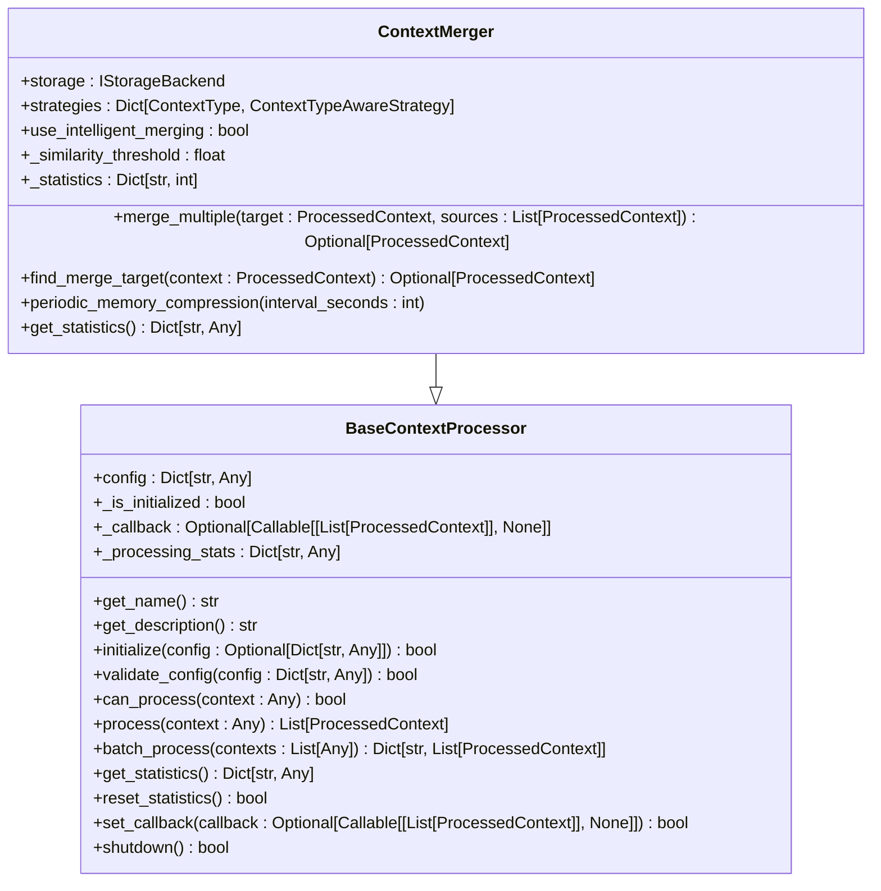
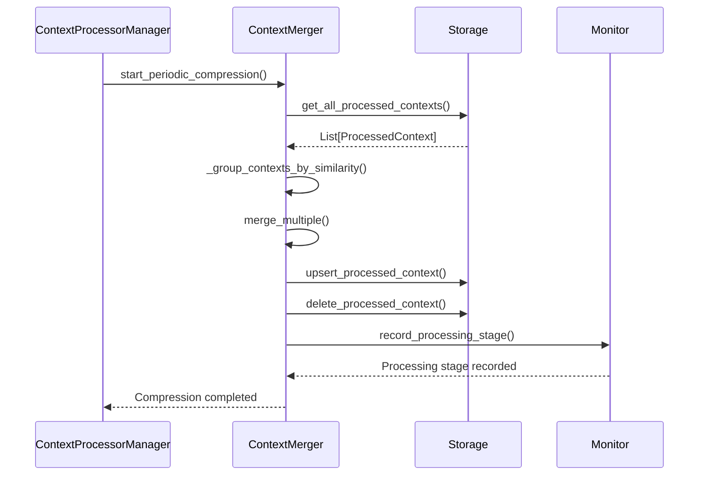
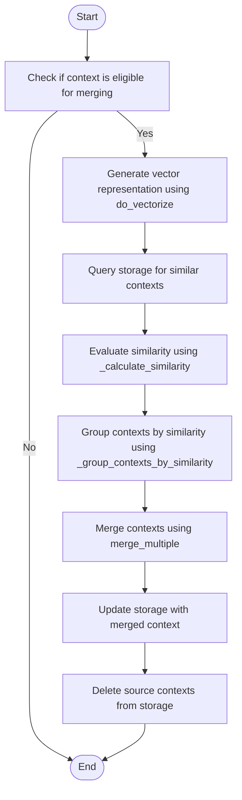
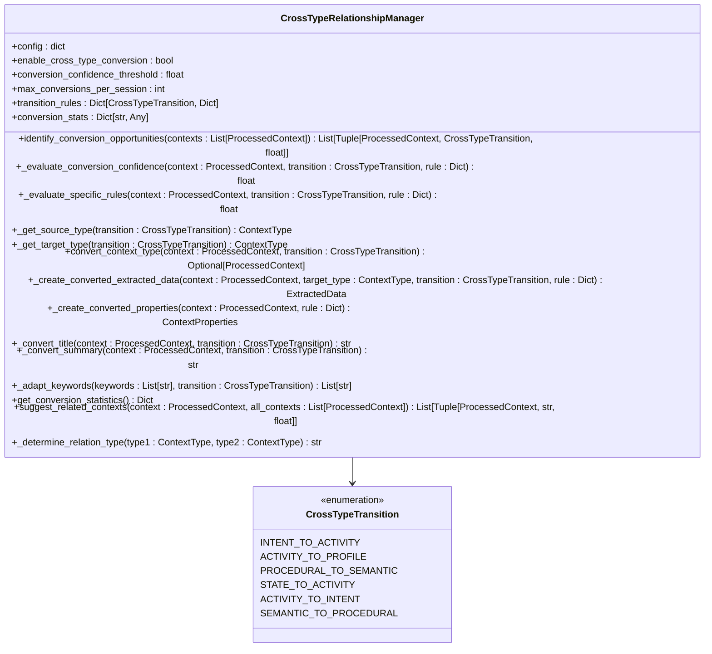
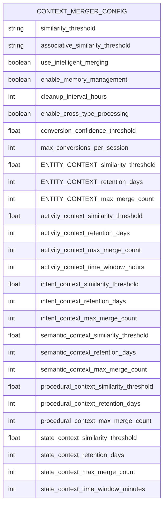
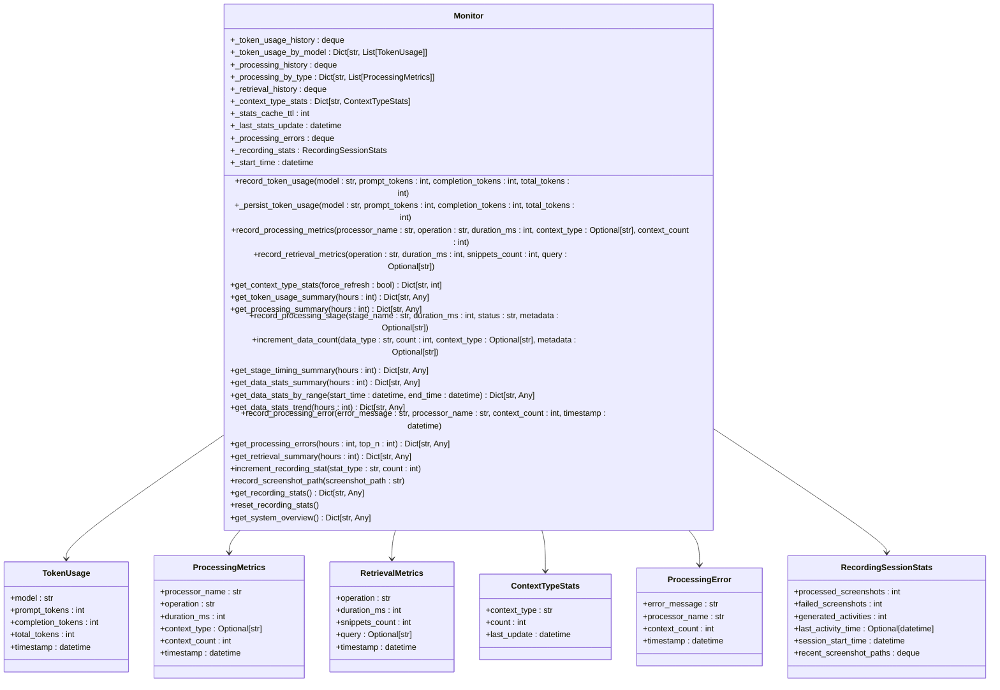
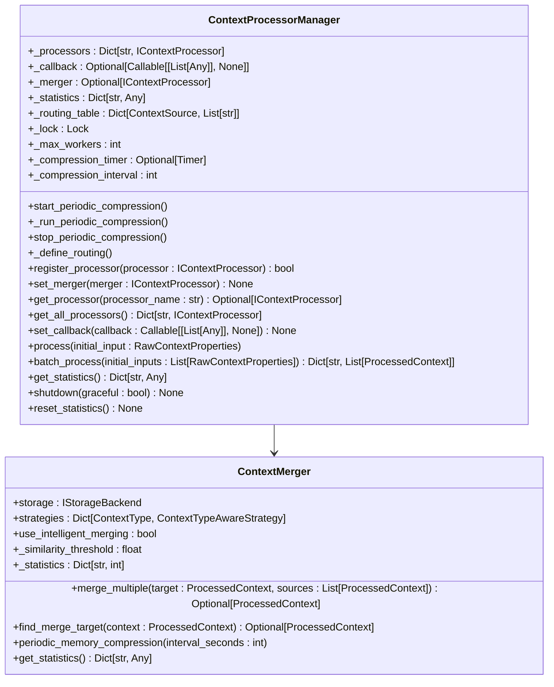

# ContextMerger Core

<cite>
**Referenced Files in This Document**   
- [context_merger.py](file://opencontext/context_processing/merger/context_merger.py)
- [merge_strategies.py](file://opencontext/context_processing/merger/merge_strategies.py)
- [cross_type_relationships.py](file://opencontext/context_processing/merger/cross_type_relationships.py)
- [unified_storage.py](file://opencontext/storage/unified_storage.py)
- [config.yaml](file://config/config.yaml)
- [processor_manager.py](file://opencontext/managers/processor_manager.py)
- [monitor.py](file://opencontext/monitoring/monitor.py)
</cite>

## Table of Contents
1. [Introduction](#introduction)
2. [Core Functionality](#core-functionality)
3. [Merge Cycle and Orchestration](#merge-cycle-and-orchestration)
4. [Deduplication and Clustering](#deduplication-and-clustering)
5. [Merge Strategies](#merge-strategies)
6. [Cross-Type Relationships](#cross-type-relationships)
7. [Configuration Parameters](#configuration-parameters)
8. [Monitoring and Performance](#monitoring-and-performance)
9. [Troubleshooting](#troubleshooting)
10. [Integration with ContextProcessorManager](#integration-with-contextprocessormanager)

## Introduction
The ContextMerger class serves as the central orchestrator for the context merging system within the OpenContext application. It is responsible for periodically scanning raw context entries from multiple capture sources, applying intelligent merge strategies to form coherent activity sessions, and persisting the merged contexts to storage. The system is designed to handle various context types, including activity, intent, state, and profile contexts, using type-aware strategies that optimize the merging process based on the specific characteristics of each context type. The ContextMerger integrates with the ContextStorage and ContextProcessor components to ensure seamless data flow and processing, while also coordinating with the monitoring system for performance tracking and error logging.

**Section sources**
- [context_merger.py](file://opencontext/context_processing/merger/context_merger.py#L35-L800)

## Core Functionality
The ContextMerger class is designed to merge similar contexts into a unified representation, enhancing the coherence and usability of the captured data. It inherits from the BaseContextProcessor class, which provides common functionality and interface for all processors. The primary method for merging contexts is the `merge_multiple` method, which takes a target context and a list of source contexts to be merged into the target. The merging process involves several steps, including deduplication, temporal clustering, and relationship enrichment, before persisting the merged contexts to storage. The ContextMerger uses a combination of vector similarity and semantic analysis to determine the similarity between contexts, ensuring that only relevant and related contexts are merged.

**Diagram sources **
- [context_merger.py](file://opencontext/context_processing/merger/context_merger.py#L35-L800)
- [base_processor.py](file://opencontext/context_processing/processor/base_processor.py#L23-L261)

**Section sources**
- [context_merger.py](file://opencontext/context_processing/merger/context_merger.py#L35-L800)
- [base_processor.py](file://opencontext/context_processing/processor/base_processor.py#L23-L261)

## Merge Cycle and Orchestration
The merge cycle in the ContextMerger is triggered by time-based intervals or system events, ensuring that the merging process is both efficient and responsive to changes in the system. The `periodic_memory_compression` method is responsible for initiating the merge cycle at regular intervals, as defined by the `interval_seconds` parameter. This method scans for recent contexts that have not been compressed and are eligible for merging, grouping them by similarity and merging them into coherent activity sessions. The merge cycle is coordinated with the ContextProcessorManager, which manages the overall processing pipeline and ensures that the ContextMerger is properly integrated with other components.

**Diagram sources **
- [processor_manager.py](file://opencontext/managers/processor_manager.py#L46-L86)
- [context_merger.py](file://opencontext/context_processing/merger/context_merger.py#L465-L547)
- [unified_storage.py](file://opencontext/storage/unified_storage.py#L213-L243)
- [monitor.py](file://opencontext/monitoring/monitor.py#L337-L349)

**Section sources**
- [processor_manager.py](file://opencontext/managers/processor_manager.py#L46-L86)
- [context_merger.py](file://opencontext/context_processing/merger/context_merger.py#L465-L547)

## Deduplication and Clustering
The ContextMerger employs a sophisticated deduplication and clustering mechanism to ensure that only relevant and related contexts are merged. The `find_merge_target` method is used to identify potential merge targets for a given context, using a combination of vector similarity and semantic analysis. The method first checks if the context is eligible for merging based on its properties, and then uses the `do_vectorize` function to generate a vector representation of the context. The vector representation is then used to query the storage backend for similar contexts, which are evaluated for potential merging. The `periodic_memory_compression` method groups contexts by similarity using the `_group_contexts_by_similarity` method, which employs a greedy algorithm to group contexts based on their vector similarity.

**Diagram sources **
- [context_merger.py](file://opencontext/context_processing/merger/context_merger.py#L85-L144)
- [context_merger.py](file://opencontext/context_processing/merger/context_merger.py#L548-L577)
- [context_merger.py](file://opencontext/context_processing/merger/context_merger.py#L579-L594)
- [unified_storage.py](file://opencontext/storage/unified_storage.py#L213-L243)

**Section sources**
- [context_merger.py](file://opencontext/context_processing/merger/context_merger.py#L85-L144)
- [context_merger.py](file://opencontext/context_processing/merger/context_merger.py#L548-L577)

## Merge Strategies
The ContextMerger utilizes a strategy pattern to apply different merge strategies based on the context type. The `ContextTypeAwareStrategy` class serves as the base class for all merge strategies, providing a common interface for merging contexts. The `StrategyFactory` class is responsible for initializing and managing the different merge strategies, which are registered in the `ContextMerger` during initialization. Each strategy is designed to handle a specific context type, such as activity, intent, state, or profile contexts, and applies type-specific logic to determine the similarity and mergeability of contexts. The `ProfileContextStrategy`, for example, requires a high entity overlap and vector similarity to merge contexts, while the `ActivityContextStrategy` considers time windows and entity overlap.

```mermaid
classDiagram
class ContextTypeAwareStrategy {
<<abstract>>
+config : dict
+context_type : ContextType
+similarity_threshold : float
+retention_days : int
+max_merge_count : int
+get_context_type() ContextType
+can_merge(target : ProcessedContext, source : ProcessedContext) Tuple[bool, float]
+merge_contexts(target : ProcessedContext, sources : List[ProcessedContext]) Optional[ProcessedContext]
+calculate_forgetting_probability(context : ProcessedContext) float
+should_cleanup(context : ProcessedContext) bool
+get_merge_prompt_name() str
}
class ProfileContextStrategy {
+get_context_type() ContextType
+can_merge(target : ProcessedContext, source : ProcessedContext) Tuple[bool, float]
+merge_contexts(target : ProcessedContext, sources : List[ProcessedContext]) Optional[ProcessedContext]
+_merge_profile_titles(target : ProcessedContext, sources : List[ProcessedContext]) str
+_merge_profile_summaries(target : ProcessedContext, sources : List[ProcessedContext]) str
+_calculate_cosine_similarity(vec1 : List[float], vec2 : List[float]) float
+_create_merged_context(target : ProcessedContext, sources : List[ProcessedContext], merged_data : Dict[str, Any]) ProcessedContext
}
class ActivityContextStrategy {
+get_context_type() ContextType
+can_merge(target : ProcessedContext, source : ProcessedContext) Tuple[bool, float]
+merge_contexts(target : ProcessedContext, sources : List[ProcessedContext]) Optional[ProcessedContext]
+_merge_with_frequency(item_lists : List[List[str]]) List[str]
+_create_activity_sequence_summary(contexts : List[ProcessedContext]) str
+_calculate_cosine_similarity(vec1 : List[float], vec2 : List[float]) float
+_create_merged_context(target : ProcessedContext, sources : List[ProcessedContext], merged_data : Dict[str, Any]) ProcessedContext
}
class StateContextStrategy {
+get_context_type() ContextType
+can_merge(target : ProcessedContext, source : ProcessedContext) Tuple[bool, float]
+merge_contexts(target : ProcessedContext, sources : List[ProcessedContext]) Optional[ProcessedContext]
+_extract_state_trends(keyword_lists : List[List[str]]) List[str]
+_create_state_trend_summary(contexts : List[ProcessedContext]) str
+calculate_forgetting_probability(context : ProcessedContext) float
+should_cleanup(context : ProcessedContext) bool
+_create_merged_context(target : ProcessedContext, sources : List[ProcessedContext], merged_data : Dict[str, Any]) ProcessedContext
}
class IntentContextStrategy {
+get_context_type() ContextType
+can_merge(target : ProcessedContext, source : ProcessedContext) Tuple[bool, float]
+merge_contexts(target : ProcessedContext, sources : List[ProcessedContext]) Optional[ProcessedContext]
+_merge_intent_entities(entity_lists : List[List[str]]) List[str]
+_merge_intent_keywords(keyword_lists : List[List[str]]) List[str]
+_create_integrated_intent_title(contexts : List[ProcessedContext]) str
+_create_integrated_intent_summary(contexts : List[ProcessedContext]) str
+calculate_forgetting_probability(context : ProcessedContext) float
+_create_merged_context(target : ProcessedContext, sources : List[ProcessedContext], merged_data : Dict[str, Any]) ProcessedContext
}
ContextTypeAwareStrategy <|-- ProfileContextStrategy
ContextTypeAwareStrategy <|-- ActivityContextStrategy
ContextTypeAwareStrategy <|-- StateContextStrategy
ContextTypeAwareStrategy <|-- IntentContextStrategy
```

**Diagram sources **
- [merge_strategies.py](file://opencontext/context_processing/merger/merge_strategies.py#L24-L800)
- [context_merger.py](file://opencontext/context_processing/merger/context_merger.py#L49-L51)

**Section sources**
- [merge_strategies.py](file://opencontext/context_processing/merger/merge_strategies.py#L24-L800)
- [context_merger.py](file://opencontext/context_processing/merger/context_merger.py#L49-L51)

## Cross-Type Relationships
The ContextMerger also supports cross-type relationships, allowing for the conversion and association of different context types. The `CrossTypeRelationshipManager` class is responsible for identifying and managing these relationships, using a set of predefined transition rules to determine when and how contexts should be converted. For example, an intent context that has been completed can be converted into an activity context, while an activity context that demonstrates personal growth can be converted into a profile context. The `identify_conversion_opportunities` method is used to identify potential conversion opportunities, and the `convert_context_type` method is used to execute the conversion.

**Diagram sources **
- [cross_type_relationships.py](file://opencontext/context_processing/merger/cross_type_relationships.py#L35-L430)

**Section sources**
- [cross_type_relationships.py](file://opencontext/context_processing/merger/cross_type_relationships.py#L35-L430)

## Configuration Parameters
The ContextMerger is highly configurable, with a range of parameters that can be adjusted to optimize performance and memory usage. The configuration is defined in the `config.yaml` file, under the `processing.context_merger` section. Key parameters include `similarity_threshold`, which determines the minimum similarity score required for two contexts to be merged, and `associative_similarity_threshold`, which is used for associative merging. The `use_intelligent_merging` parameter enables or disables the use of intelligent strategies for merging, while the `enable_memory_management` parameter controls whether memory management features are enabled. Additionally, there are type-specific configuration parameters, such as `ENTITY_CONTEXT_similarity_threshold` and `activity_context_time_window_hours`, which allow for fine-tuning of the merging process for specific context types.

**Diagram sources **
- [config.yaml](file://config/config.yaml#L96-L144)

**Section sources**
- [config.yaml](file://config/config.yaml#L96-L144)

## Monitoring and Performance
The ContextMerger integrates with the monitoring system to track performance and log errors. The `Monitor` class is responsible for collecting and managing various system metrics, including token usage, processing performance, and retrieval performance. The `record_processing_stage` method is used to record the duration of each processing stage, while the `record_token_usage` method is used to track the number of tokens used by the LLM. The `get_system_overview` method provides a comprehensive overview of the system's performance, including uptime, context type statistics, and token usage summaries. The monitoring system also includes a mechanism for tracking and logging processing errors, which can be accessed through the `get_processing_errors` method.

**Diagram sources **
- [monitor.py](file://opencontext/monitoring/monitor.py#L89-L721)

**Section sources**
- [monitor.py](file://opencontext/monitoring/monitor.py#L89-L721)

## Troubleshooting
Common issues with the ContextMerger include incomplete merges and orphaned context fragments. Incomplete merges can occur when the similarity threshold is set too high, preventing contexts from being merged even when they are related. This can be resolved by adjusting the `similarity_threshold` parameter in the configuration file. Orphaned context fragments can occur when the merge process fails to properly update the storage with the merged context, leaving the source contexts in an inconsistent state. This can be mitigated by ensuring that the `upsert_processed_context` and `delete_processed_context` methods are called correctly and that the storage backend is properly initialized. Additionally, monitoring the system logs for errors and warnings can help identify and resolve issues with the merging process.

**Section sources**
- [context_merger.py](file://opencontext/context_processing/merger/context_merger.py#L274-L299)
- [unified_storage.py](file://opencontext/storage/unified_storage.py#L188-L212)

## Integration with ContextProcessorManager
The ContextMerger is integrated with the ContextProcessorManager, which manages the overall processing pipeline and ensures that the ContextMerger is properly coordinated with other components. The `ContextProcessorManager` is responsible for initializing and managing the ContextMerger, as well as starting and stopping the periodic memory compression process. The `set_merger` method is used to set the ContextMerger instance, and the `start_periodic_compression` method is used to initiate the merge cycle. The `ContextProcessorManager` also provides a callback mechanism for handling processed contexts, ensuring that they are properly stored and made available for further processing.

**Diagram sources **
- [processor_manager.py](file://opencontext/managers/processor_manager.py#L21-L213)
- [context_merger.py](file://opencontext/context_processing/merger/context_merger.py#L35-L800)

**Section sources**
- [processor_manager.py](file://opencontext/managers/processor_manager.py#L21-L213)
- [context_merger.py](file://opencontext/context_processing/merger/context_merger.py#L35-L800)