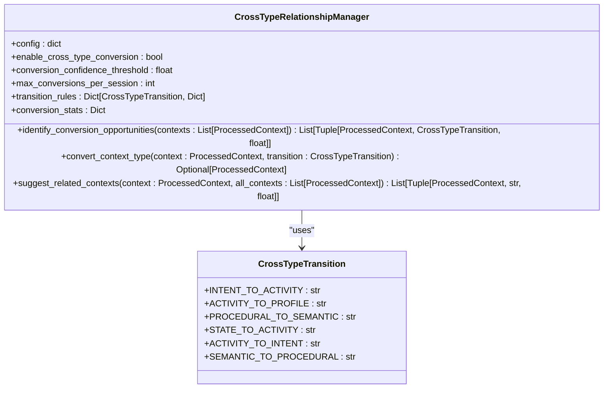
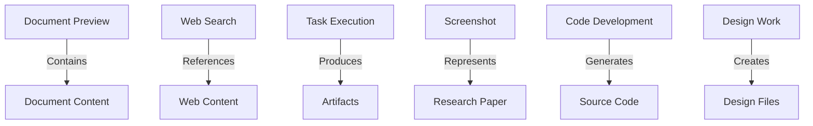
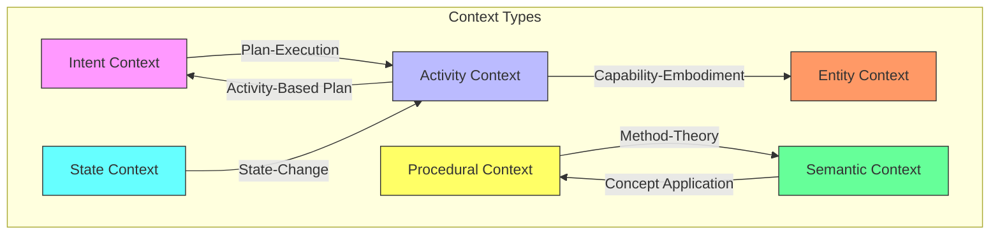
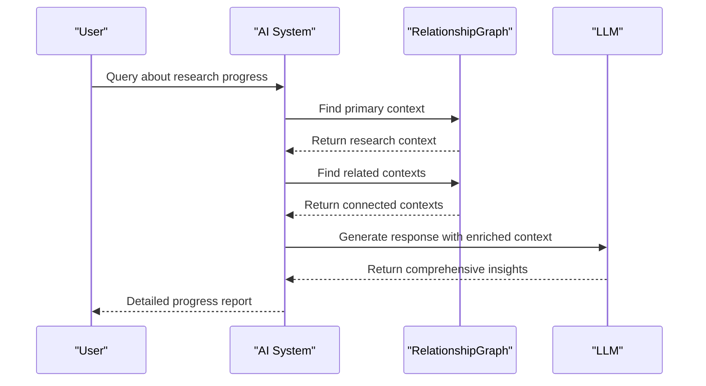
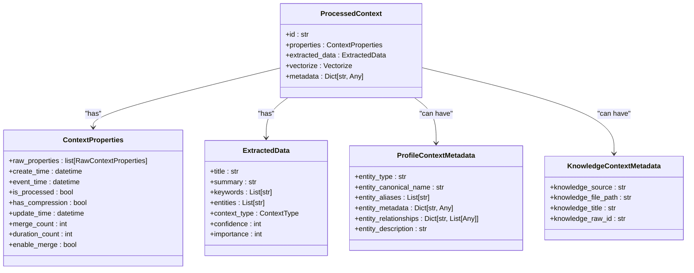
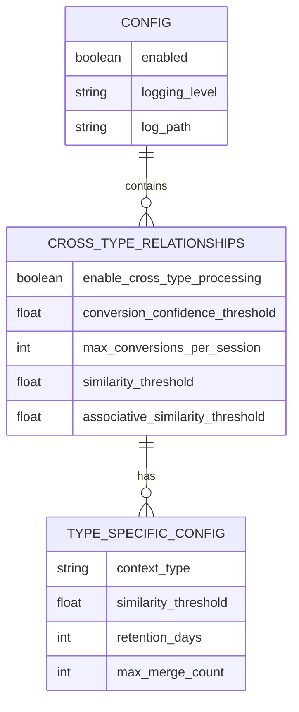

# Cross-Type Relationships

<cite>
**Referenced Files in This Document**   
- [cross_type_relationships.py](file://opencontext/context_processing/merger/cross_type_relationships.py)
- [context_merger.py](file://opencontext/context_processing/merger/context_merger.py)
- [context.py](file://opencontext/models/context.py)
- [enums.py](file://opencontext/models/enums.py)
- [config.yaml](file://config/config.yaml)
</cite>

## Table of Contents
1. [Introduction](#introduction)
2. [Cross-Type Relationship Detection System](#cross-type-relationship-detection-system)
3. [Relationship Detectors and Patterns](#relationship-detectors-and-patterns)
4. [RelationshipGraph and Knowledge Network](#relationshipgraph-and-knowledge-network)
5. [Enhancing AI-Generated Insights](#enhancing-ai-generated-insights)
6. [Context Model Schema Extensions](#context-model-schema-extensions)
7. [Configuration Options](#configuration-options)
8. [Custom Relationship Detectors](#custom-relationship-detectors)
9. [Conclusion](#conclusion)

## Introduction
The Cross-Type Relationships system in MineContext is designed to identify and establish meaningful connections between different types of contextual information. This system enables the AI to understand relationships between various data fragments such as screenshots, documents, web searches, and other context types, creating a comprehensive knowledge network. By detecting cross-type relationships, the system enhances the AI's ability to provide richer, more contextual insights to users.

**Section sources**
- [cross_type_relationships.py](file://opencontext/context_processing/merger/cross_type_relationships.py#L1-L430)

## Cross-Type Relationship Detection System
The cross-type relationship detection system is implemented in the `CrossTypeRelationshipManager` class, which identifies meaningful connections between different context types. This system simulates the process of mutual transformation of different types of information in human memory, enabling the AI to understand complex relationships between various data fragments.

The system works by analyzing processed contexts and identifying opportunities for cross-type conversion based on predefined transition rules. These rules define how one type of context can be transformed into another, such as converting an intent into an activity record when the intent is completed, or transforming procedural knowledge into semantic concepts through abstraction.

**Diagram sources **
- [cross_type_relationships.py](file://opencontext/context_processing/merger/cross_type_relationships.py#L35-L430)

**Section sources**
- [cross_type_relationships.py](file://opencontext/context_processing/merger/cross_type_relationships.py#L1-L430)

## Relationship Detectors and Patterns
The system implements several relationship detectors for common patterns that frequently occur in user workflows. These detectors identify specific relationships between different context types, enabling the system to create meaningful connections between disparate pieces of information.

### Document-Preview Relationship
This pattern connects a screenshot (preview) with the actual document it represents. When a user takes a screenshot of a research paper, the system can identify the relationship between the visual preview and the original PDF document. This is achieved by analyzing metadata, text content, and visual features to establish the connection.

### Web-Content-Source Relationship
This pattern links web searches with the content they reference. When a user performs a web search about a topic and then views related articles, the system can establish a relationship between the search query and the viewed content. This helps in understanding the user's research trajectory and information needs.

### Task-Artifact Association
This pattern connects tasks or activities with the artifacts they produce. For example, when a user works on a coding task, the system can link the activity context with the resulting code files, documentation, or design artifacts. This creates a complete picture of the task execution process.

**Diagram sources **
- [cross_type_relationships.py](file://opencontext/context_processing/merger/cross_type_relationships.py#L24-L429)

**Section sources**
- [cross_type_relationships.py](file://opencontext/context_processing/merger/cross_type_relationships.py#L1-L430)

## RelationshipGraph and Knowledge Network
The RelationshipGraph is a core component that builds a knowledge network by connecting context fragments with typed edges. This graph structure enables the system to represent complex relationships between different types of information, creating a rich knowledge base that enhances AI processing.

The graph is constructed by the `ContextMerger` class, which integrates with the `CrossTypeRelationshipManager` to identify and establish relationships between contexts. When analyzing a context, the system can find related contexts across different types and create connections based on semantic similarity, entity overlap, and predefined relationship patterns.

**Diagram sources **
- [cross_type_relationships.py](file://opencontext/context_processing/merger/cross_type_relationships.py#L409-L429)
- [context_merger.py](file://opencontext/context_processing/merger/context_merger.py#L860-L887)

**Section sources**
- [context_merger.py](file://opencontext/context_processing/merger/context_merger.py#L840-L887)

## Enhancing AI-Generated Insights
The cross-type relationship system significantly enhances AI-generated insights by providing richer context for LLM processing. By understanding the connections between different types of information, the AI can generate more comprehensive and relevant responses to user queries.

When processing a user request, the system can retrieve not only directly relevant contexts but also related contexts connected through the relationship graph. This allows the AI to provide insights that consider the broader context of the user's activities, intentions, and knowledge base.

For example, when a user asks about their progress on a research project, the AI can combine information from:
- Activity contexts (research activities performed)
- Intent contexts (research goals and plans)
- Semantic contexts (research concepts and knowledge)
- Entity contexts (research subjects and collaborators)
- State contexts (project progress and status)

This holistic view enables the AI to generate more meaningful and actionable insights than would be possible with isolated context fragments.

**Diagram sources **
- [context_merger.py](file://opencontext/context_processing/merger/context_merger.py#L860-L887)
- [cross_type_relationships.py](file://opencontext/context_processing/merger/cross_type_relationships.py#L362-L407)

**Section sources**
- [cross_type_relationships.py](file://opencontext/context_processing/merger/cross_type_relationships.py#L362-L407)
- [context_merger.py](file://opencontext/context_processing/merger/context_merger.py#L860-L887)

## Context Model Schema Extensions
The Context model has been extended to support relationship metadata and provenance tracking. These extensions enable the system to store and manage information about the relationships between different context fragments, as well as track the origin and evolution of contextual information.

The `ProcessedContext` model includes several fields that support relationship tracking:
- `metadata`: A dictionary field that can store structured relationship information
- `properties`: Contains fields for tracking creation time, update time, and merge count
- `extracted_data`: Includes context type, confidence, and importance scores

Additionally, specialized metadata models like `ProfileContextMetadata` and `KnowledgeContextMetadata` provide domain-specific fields for storing relationship information. For example, `ProfileContextMetadata` includes fields for entity relationships, while `KnowledgeContextMetadata` includes fields for tracking knowledge sources and file paths.

**Diagram sources **
- [context.py](file://opencontext/models/context.py#L131-L343)

**Section sources**
- [context.py](file://opencontext/models/context.py#L131-L343)

## Configuration Options
The cross-type relationship system provides several configuration options to control its behavior. These options are defined in the `config.yaml` file and can be adjusted to fine-tune the system's performance and sensitivity.

Key configuration options include:
- `enable_cross_type_processing`: A boolean flag to enable or disable cross-type processing
- `conversion_confidence_threshold`: The minimum confidence score required for a cross-type conversion to be executed
- `max_conversions_per_session`: The maximum number of cross-type conversions allowed per processing session
- Type-specific similarity thresholds: Different thresholds for different context types to control merge sensitivity

These configuration options allow users and administrators to balance the system's aggressiveness in identifying relationships with the need to maintain accuracy and avoid false connections.

**Diagram sources **
- [config.yaml](file://config/config.yaml#L107-L144)

**Section sources**
- [config.yaml](file://config/config.yaml#L107-L144)

## Custom Relationship Detectors
The system supports the implementation of custom relationship detectors for domain-specific use cases. This extensibility allows developers to add new relationship patterns tailored to specific domains or applications.

To implement a custom relationship detector, developers can extend the existing framework by:
1. Defining new context types in the `ContextType` enum
2. Creating specialized metadata models for domain-specific relationship information
3. Implementing custom transition rules in the `CrossTypeRelationshipManager`
4. Adding domain-specific confidence calculation logic

For example, for code-documentation links, a custom detector could:
- Identify relationships between source code files and their documentation
- Track the completeness and accuracy of documentation
- Suggest improvements to documentation based on code changes

Similarly, for design-implementation pairs, a custom detector could:
- Connect design documents with their implementation code
- Track the fidelity of implementation to design specifications
- Identify deviations between design and implementation

This extensible architecture ensures that the system can adapt to new domains and use cases while maintaining a consistent approach to relationship detection and management.

**Section sources**
- [cross_type_relationships.py](file://opencontext/context_processing/merger/cross_type_relationships.py#L24-L429)
- [enums.py](file://opencontext/models/enums.py#L84-L101)

## Conclusion
The Cross-Type Relationships system in MineContext provides a sophisticated framework for identifying and establishing meaningful connections between different types of contextual information. By detecting relationships between context fragments such as document previews, web content sources, and task artifacts, the system creates a rich knowledge network that enhances AI-generated insights.

The system's architecture, centered around the `CrossTypeRelationshipManager` and integrated with the `RelationshipGraph`, enables the AI to understand complex relationships between disparate pieces of information. This capability significantly improves the quality and relevance of AI responses by providing richer context for LLM processing.

With configurable parameters and support for custom relationship detectors, the system offers both flexibility and extensibility, allowing it to adapt to various domains and use cases. The schema extensions in the Context model ensure that relationship metadata and provenance information are properly tracked and maintained.

Overall, the Cross-Type Relationships system represents a significant advancement in contextual AI, enabling more intelligent and comprehensive understanding of user activities, intentions, and knowledge.