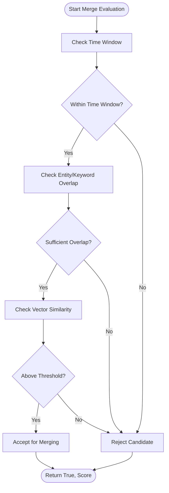
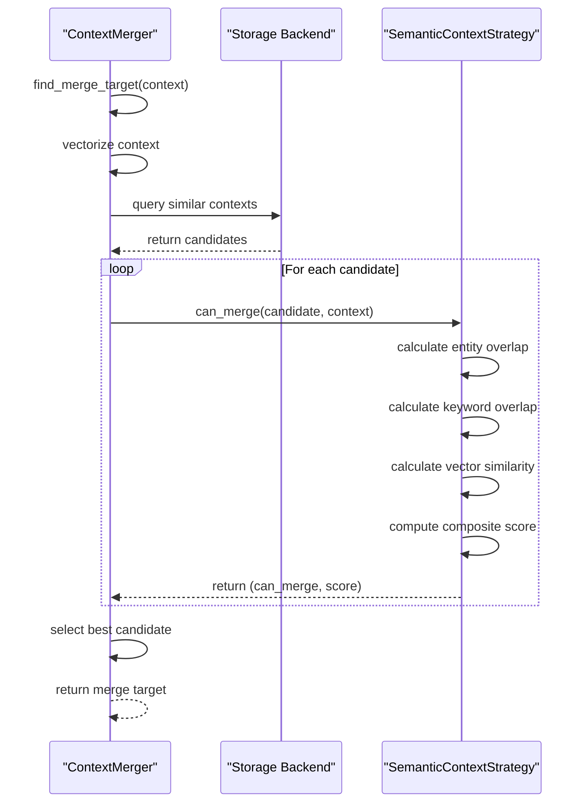
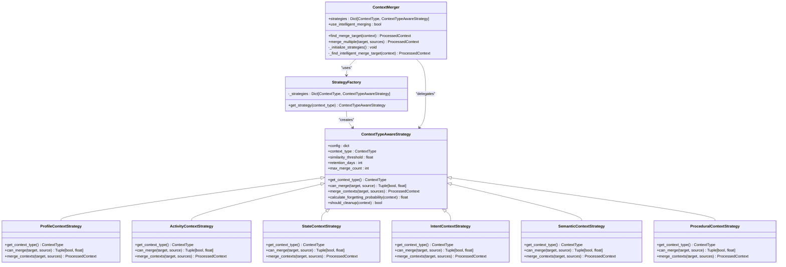

# Merge Strategies

<cite>
**Referenced Files in This Document**   
- [merge_strategies.py](file://opencontext/context_processing/merger/merge_strategies.py)
- [context_merger.py](file://opencontext/context_processing/merger/context_merger.py)
- [__init__.py](file://opencontext/context_processing/merger/__init__.py)
</cite>

## Table of Contents
1. [Introduction](#introduction)
2. [Core Merge Strategies](#core-merge-strategies)
3. [Temporal Proximity Strategy](#temporal-proximity-strategy)
4. [Semantic Similarity Strategy](#semantic-similarity-strategy)
5. [Application Context Matching Strategy](#application-context-matching-strategy)
6. [Strategy Registration and Execution](#strategy-registration-and-execution)
7. [Scoring and Weighting Mechanism](#scoring-and-weighting-mechanism)
8. [Configuration Options](#configuration-options)
9. [Performance Implications and Optimization](#performance-implications-and-optimization)

## Introduction
The merge strategies system in OpenContext provides a sophisticated framework for intelligently combining context fragments captured from various sources. This document details the implementation of specialized merge strategies that group related contexts based on temporal proximity, semantic similarity, and application context matching. The system employs a strategy pattern with type-aware merging logic, allowing different context types to have customized merging behaviors. The ContextMerger pipeline orchestrates these strategies, applying configurable thresholds and weights to determine optimal merge candidates and produce consolidated context representations.

## Core Merge Strategies
The merge strategies system implements a context type-aware architecture where each context type has specialized merging logic and memory management strategies. The base `ContextTypeAwareStrategy` class provides common functionality including forgetting probability calculation, cleanup determination, and configuration management. Specific strategies inherit from this base class and implement type-specific merging logic for different context types such as profile, activity, state, intent, semantic, and procedural contexts. Each strategy defines its own criteria for determining merge eligibility through the `can_merge` method, which returns both a boolean indicating merge possibility and a similarity score. The `merge_contexts` method executes the actual merging logic, combining multiple source contexts into a target context while preserving relevant information and metadata.

**Section sources**
- [merge_strategies.py](file://opencontext/context_processing/merger/merge_strategies.py#L24-L1287)

## Temporal Proximity Strategy
The Temporal Proximity Strategy groups context fragments captured within a configurable time window, ensuring that temporally related events are merged into coherent narratives. This strategy is implemented differently across various context types, with each type having its own time window configuration. For example, the `ActivityContextStrategy` uses a default 24-hour time window, while the `StateContextStrategy` employs a much shorter 30-minute window to capture rapidly changing system states. The time window duration is configurable through the context type-specific configuration parameters (e.g., `{context_type}_time_window_hours` for activities). When evaluating merge candidates, the strategy calculates the absolute time difference between the creation times of the target and source contexts, rejecting any candidates that fall outside the configured time window. This approach ensures that only contexts captured within the relevant temporal scope are considered for merging, maintaining the temporal coherence of the resulting merged context.

**Diagram sources **
- [merge_strategies.py](file://opencontext/context_processing/merger/merge_strategies.py#L277-L285)
- [merge_strategies.py](file://opencontext/context_processing/merger/merge_strategies.py#L455-L463)

**Section sources**
- [merge_strategies.py](file://opencontext/context_processing/merger/merge_strategies.py#L264-L440)
- [merge_strategies.py](file://opencontext/context_processing/merger/merge_strategies.py#L442-L628)

## Semantic Similarity Strategy
The Semantic Similarity Strategy uses embedding vectors to identify related content across different capture types, enabling the merging of contexts that share conceptual or thematic relationships. This strategy leverages vector similarity to determine the semantic relatedness between contexts, with each context being represented by an embedding vector generated from its title and summary text. The strategy calculates cosine similarity between the embedding vectors of candidate contexts, comparing the result against a configurable similarity threshold (default 0.85). For different context types, the strategy combines vector similarity with other factors such as entity overlap and keyword overlap to produce a composite similarity score. For example, the `SemanticContextStrategy` uses a weighted combination of entity overlap (30%), keyword overlap (40%), and vector similarity (30%) to determine merge eligibility. The strategy also supports associative merging, which finds recently created contexts of the same type that are semantically similar and share common entities, using a lower similarity threshold (0.6) to capture loosely related contexts.

**Diagram sources **
- [context_merger.py](file://opencontext/context_processing/merger/context_merger.py#L145-L163)
- [merge_strategies.py](file://opencontext/context_processing/merger/merge_strategies.py#L887-L898)

**Section sources**
- [merge_strategies.py](file://opencontext/context_processing/merger/merge_strategies.py#L801-L919)
- [context_merger.py](file://opencontext/context_processing/merger/context_merger.py#L145-L163)

## Application Context Matching Strategy
The Application Context Matching Strategy links contexts based on active application and window titles, enabling the grouping of activities that occur within the same application context. This strategy examines the entities and metadata associated with each context to identify the active application and window title at the time of capture. When evaluating merge candidates, the strategy checks for high entity overlap between contexts, particularly focusing on application names and window titles. For example, the `StateContextStrategy` requires an entity overlap of greater than 0.8 to ensure that both contexts are monitoring the same object or system component. The strategy also considers the temporal proximity of contexts, with a default 30-minute window for state contexts to capture related monitoring events. By linking contexts based on application and window information, this strategy creates coherent narratives of user activity within specific applications, preserving the context of the user's workflow and enabling more meaningful analysis of application usage patterns.

**Section sources**
- [merge_strategies.py](file://opencontext/context_processing/merger/merge_strategies.py#L442-L628)

## Strategy Registration and Execution
The merge strategies are registered and executed within the ContextMerger pipeline through a factory pattern that initializes and manages strategy instances for each supported context type. The `StrategyFactory` class creates instances of all supported strategies (Profile, Activity, State, Intent, Semantic, and Procedural) and stores them in a dictionary indexed by context type. During initialization, the ContextMerger retrieves the supported context types from the factory and initializes the corresponding strategies with configuration parameters. When processing a context for merging, the ContextMerger first determines the context type and then delegates to the appropriate strategy via the `can_merge` and `merge_contexts` methods. The pipeline supports both intelligent merging (using type-specific strategies) and legacy merging (using generic similarity or associative merging) as fallback options. The execution flow involves finding merge candidates through vector similarity queries, evaluating each candidate with the appropriate strategy, and selecting the best match based on the highest similarity score.

**Diagram sources **
- [context_merger.py](file://opencontext/context_processing/merger/context_merger.py#L35-L80)
- [merge_strategies.py](file://opencontext/context_processing/merger/merge_strategies.py#L1270-L1286)
- [__init__.py](file://opencontext/context_processing/merger/__init__.py#L14-L22)

**Section sources**
- [context_merger.py](file://opencontext/context_processing/merger/context_merger.py#L35-L80)
- [merge_strategies.py](file://opencontext/context_processing/merger/merge_strategies.py#L1270-L1286)

## Scoring and Weighting Mechanism
The scoring and weighting mechanism combines multiple strategy outputs into a final merge decision through a composite scoring system that balances different similarity metrics. Each merge strategy computes a final score by combining various factors with configurable weights, such as entity overlap, keyword overlap, and vector similarity. For example, the `ProfileContextStrategy` uses a weighted combination of 40% entity overlap and 60% vector similarity, while the `ActivityContextStrategy` uses 30% entity overlap, 30% keyword overlap, and 40% vector similarity. The similarity threshold for each context type is configurable through parameters like `{context_type}_similarity_threshold`, allowing fine-tuning of precision and recall. The final merge decision is based on whether the composite score exceeds the configured threshold, with the highest-scoring candidate being selected as the merge target. This weighted approach ensures that the merge decision considers multiple dimensions of similarity, producing more accurate and meaningful merged contexts.

**Section sources**
- [merge_strategies.py](file://opencontext/context_processing/merger/merge_strategies.py#L137-L146)
- [merge_strategies.py](file://opencontext/context_processing/merger/merge_strategies.py#L307-L317)
- [merge_strategies.py](file://opencontext/context_processing/merger/merge_strategies.py#L667-L676)
- [merge_strategies.py](file://opencontext/context_processing/merger/merge_strategies.py#L887-L898)

## Configuration Options
The merge strategies system provides several configuration options that impact precision and recall, allowing users to tune the behavior of the merging process. The `similarity_threshold` parameter (default 0.85) controls the minimum similarity score required for contexts to be merged, with higher values increasing precision but reducing recall. The `associative_similarity_threshold` (default 0.6) is used for finding recently created, associatively related contexts, enabling the capture of loosely related activities. Each context type has specific configuration parameters such as `{context_type}_time_window_hours` for controlling the temporal proximity window, `{context_type}_similarity_threshold` for setting type-specific similarity thresholds, and `{context_type}_retention_days` for determining how long contexts are retained before cleanup. The `use_intelligent_merging` flag enables or disables the use of type-aware strategies, falling back to legacy merging logic when disabled. These configuration options provide fine-grained control over the merging process, allowing users to balance the trade-off between creating comprehensive merged contexts and avoiding inappropriate merges.

**Section sources**
- [context_merger.py](file://opencontext/context_processing/merger/context_merger.py#L43-L44)
- [merge_strategies.py](file://opencontext/context_processing/merger/merge_strategies.py#L33-L37)
- [merge_strategies.py](file://opencontext/context_processing/merger/merge_strategies.py#L279-L280)
- [merge_strategies.py](file://opencontext/context_processing/merger/merge_strategies.py#L457-L458)

## Performance Implications and Optimization
The merge strategies system has several performance implications, particularly for computationally intensive operations like vector similarity calculations and large-scale context queries. The system optimizes performance by using vector similarity queries to efficiently find merge candidates, limiting the number of candidates to a configurable maximum (default 10) to reduce computational overhead. The `periodic_memory_compression` method processes contexts in batches to avoid memory issues when handling large datasets. For large-scale deployments, the system can be optimized by adjusting the `interval_seconds` parameter to control how frequently memory compression runs, and by tuning the similarity thresholds to reduce the number of merge operations. The use of type-specific strategies also improves performance by avoiding unnecessary computations for context types that don't require merging. Additionally, the system's modular design allows for the implementation of caching mechanisms and parallel processing to further enhance performance in high-volume scenarios.

**Section sources**
- [context_merger.py](file://opencontext/context_processing/merger/context_merger.py#L476-L547)
- [context_merger.py](file://opencontext/context_processing/merger/context_merger.py#L548-L577)
- [context_merger.py](file://opencontext/context_processing/merger/context_merger.py#L146-L163)