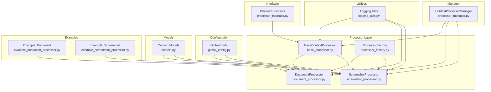
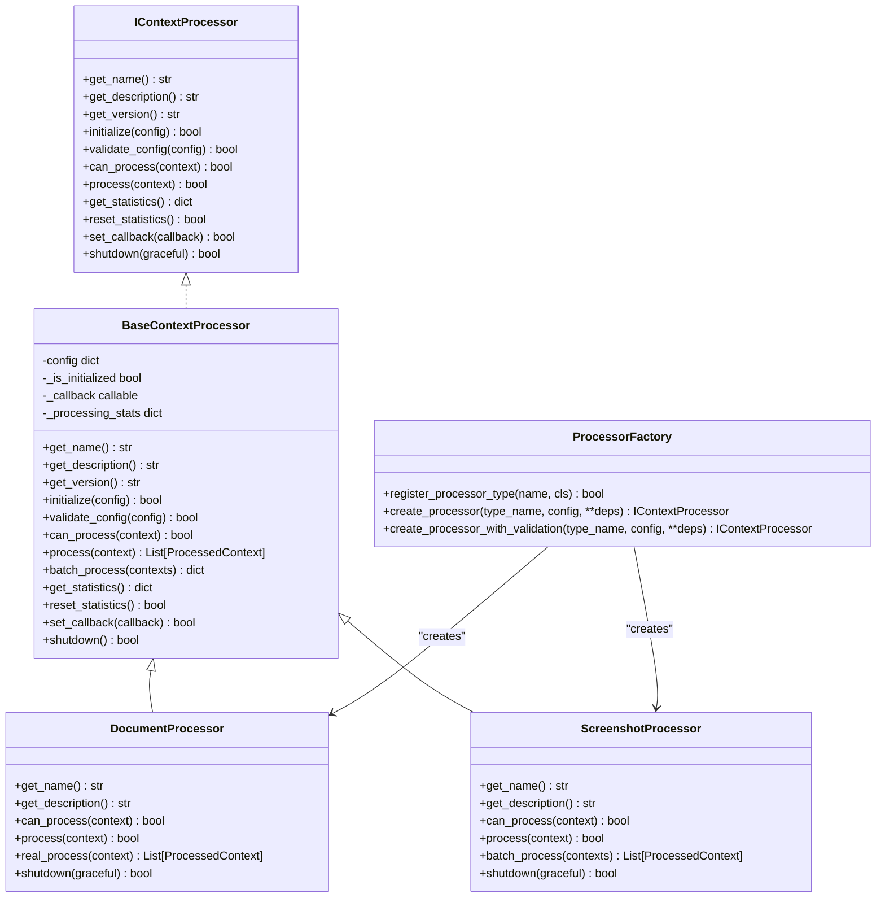
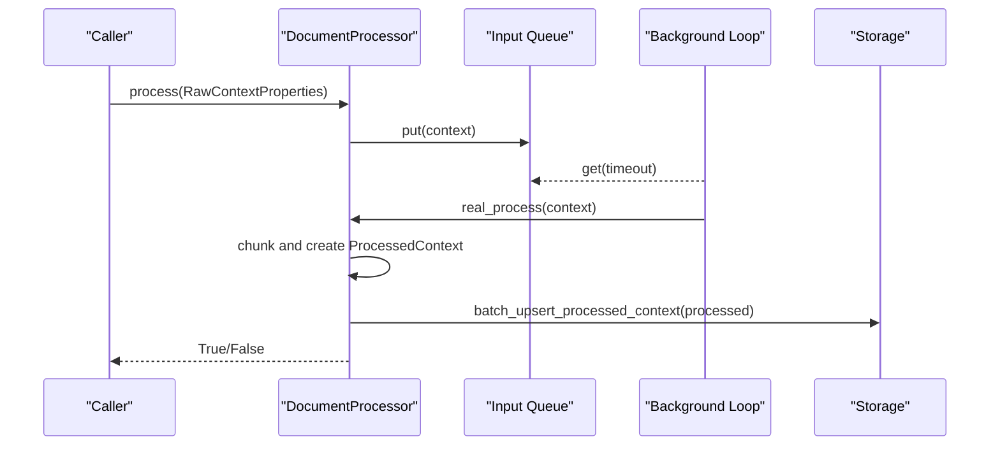
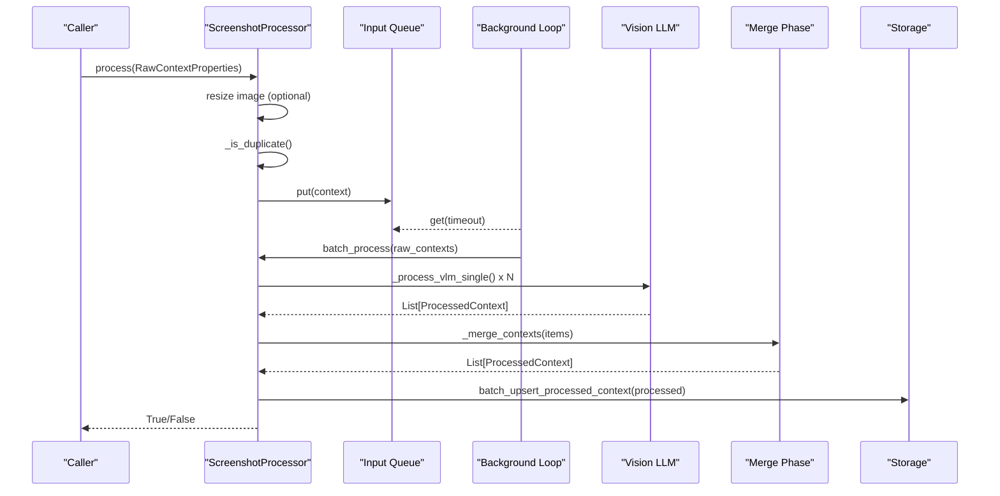
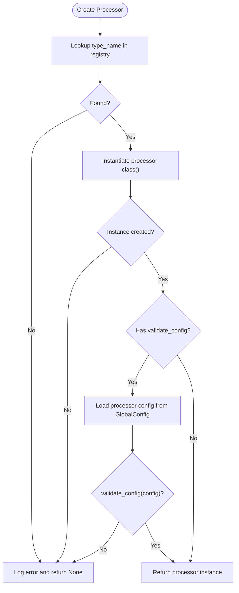
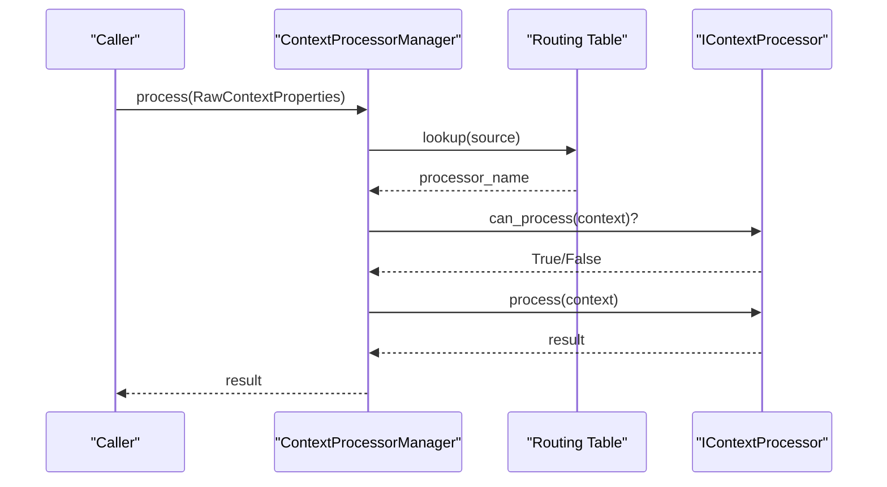
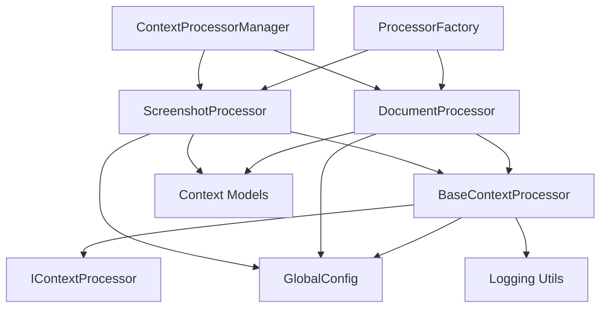

# Base Processor

<cite>
**Referenced Files in This Document**
- [base_processor.py](file://opencontext/context_processing/processor/base_processor.py)
- [processor_interface.py](file://opencontext/interfaces/processor_interface.py)
- [document_processor.py](file://opencontext/context_processing/processor/document_processor.py)
- [screenshot_processor.py](file://opencontext/context_processing/processor/screenshot_processor.py)
- [processor_factory.py](file://opencontext/context_processing/processor/processor_factory.py)
- [global_config.py](file://opencontext/config/global_config.py)
- [logging_utils.py](file://opencontext/utils/logging_utils.py)
- [context.py](file://opencontext/models/context.py)
- [processor_manager.py](file://opencontext/managers/processor_manager.py)
- [example_document_processor.py](file://examples/example_document_processor.py)
- [example_screenshot_processor.py](file://examples/example_screenshot_processor.py)
</cite>

## Table of Contents
1. [Introduction](#introduction)
2. [Project Structure](#project-structure)
3. [Core Components](#core-components)
4. [Architecture Overview](#architecture-overview)
5. [Detailed Component Analysis](#detailed-component-analysis)
6. [Dependency Analysis](#dependency-analysis)
7. [Performance Considerations](#performance-considerations)
8. [Troubleshooting Guide](#troubleshooting-guide)
9. [Conclusion](#conclusion)
10. [Appendices](#appendices)

## Introduction
This document explains the BaseContextProcessor component, which serves as the abstract foundation for all context processors in the system. It defines the standardized interface contract, common lifecycle and configuration management, error handling and logging, and provides a shared infrastructure for derived processors. Concrete examples show how DocumentProcessor and ScreenshotProcessor inherit from BaseContextProcessor and extend its functionality. We also cover the factory pattern integration via ProcessorFactory, the threading and queue management patterns used for asynchronous processing, and guidelines for implementing new processors.

## Project Structure
The BaseContextProcessor resides in the processor layer alongside other processors and integrates with the configuration, logging, and models subsystems. The manager orchestrates routing and coordination among processors.

**Diagram sources**
- [base_processor.py](file://opencontext/context_processing/processor/base_processor.py#L1-L261)
- [processor_interface.py](file://opencontext/interfaces/processor_interface.py#L1-L136)
- [document_processor.py](file://opencontext/context_processing/processor/document_processor.py#L1-L653)
- [screenshot_processor.py](file://opencontext/context_processing/processor/screenshot_processor.py#L1-L590)
- [processor_factory.py](file://opencontext/context_processing/processor/processor_factory.py#L1-L175)
- [global_config.py](file://opencontext/config/global_config.py#L1-L331)
- [logging_utils.py](file://opencontext/utils/logging_utils.py#L1-L31)
- [context.py](file://opencontext/models/context.py#L1-L200)
- [processor_manager.py](file://opencontext/managers/processor_manager.py#L1-L213)
- [example_document_processor.py](file://examples/example_document_processor.py#L1-L237)
- [example_screenshot_processor.py](file://examples/example_screenshot_processor.py#L1-L181)

**Section sources**
- [base_processor.py](file://opencontext/context_processing/processor/base_processor.py#L1-L261)
- [processor_interface.py](file://opencontext/interfaces/processor_interface.py#L1-L136)
- [processor_factory.py](file://opencontext/context_processing/processor/processor_factory.py#L1-L175)
- [global_config.py](file://opencontext/config/global_config.py#L1-L331)
- [logging_utils.py](file://opencontext/utils/logging_utils.py#L1-L31)
- [context.py](file://opencontext/models/context.py#L1-L200)
- [processor_manager.py](file://opencontext/managers/processor_manager.py#L1-L213)
- [example_document_processor.py](file://examples/example_document_processor.py#L1-L237)
- [example_screenshot_processor.py](file://examples/example_screenshot_processor.py#L1-L181)

## Core Components
- BaseContextProcessor: Abstract base class implementing IContextProcessor, providing common lifecycle, configuration, statistics, callbacks, and error handling.
- IContextProcessor: Interface defining the contract for all processors.
- ProcessorFactory: Factory enabling dynamic instantiation of processors by type.
- GlobalConfig: Centralized configuration access used by processors to load their settings.
- Logging Utilities: Consistent logging via get_logger.
- Context Models: Shared data structures used across processors.

Key responsibilities:
- Interface compliance: get_name, get_description, get_version, initialize, validate_config, can_process, process, get_statistics, reset_statistics, set_callback, shutdown.
- Lifecycle management: initialization with configuration, graceful shutdown, and statistics tracking.
- Common configuration: loading processor-specific settings from the global configuration.
- Error handling and logging: uniform logging across processors and safe error propagation.
- Threading and queues: background processing loops and queue management in derived processors.

**Section sources**
- [base_processor.py](file://opencontext/context_processing/processor/base_processor.py#L1-L261)
- [processor_interface.py](file://opencontext/interfaces/processor_interface.py#L1-L136)
- [processor_factory.py](file://opencontext/context_processing/processor/processor_factory.py#L1-L175)
- [global_config.py](file://opencontext/config/global_config.py#L1-L331)
- [logging_utils.py](file://opencontext/utils/logging_utils.py#L1-L31)
- [context.py](file://opencontext/models/context.py#L1-L200)

## Architecture Overview
The BaseContextProcessor establishes a common contract and shared infrastructure. Derived processors extend it to implement specialized logic while inheriting lifecycle and configuration management. The factory pattern centralizes creation and registration. The manager routes inputs to appropriate processors based on source and content type.

**Diagram sources**
- [processor_interface.py](file://opencontext/interfaces/processor_interface.py#L1-L136)
- [base_processor.py](file://opencontext/context_processing/processor/base_processor.py#L1-L261)
- [document_processor.py](file://opencontext/context_processing/processor/document_processor.py#L1-L653)
- [screenshot_processor.py](file://opencontext/context_processing/processor/screenshot_processor.py#L1-L590)
- [processor_factory.py](file://opencontext/context_processing/processor/processor_factory.py#L1-L175)

## Detailed Component Analysis

### BaseContextProcessor
- Role: Abstract base class implementing IContextProcessor, providing shared lifecycle, configuration, statistics, callbacks, and error handling.
- Interface methods:
  - get_name(): returns the class name by default.
  - get_description(): must be implemented by subclasses.
  - get_version(): returns a fixed version string.
  - initialize(config): validates and updates configuration, sets initialization flag, logs outcomes.
  - validate_config(config): default accepts any configuration; subclasses override for validation.
  - can_process(context): must be implemented by subclasses.
  - process(context): must be implemented by subclasses; BaseContextProcessor provides a default batch processing method.
  - get_statistics(): returns a copy of internal statistics counters.
  - reset_statistics(): resets counters safely and logs errors.
  - set_callback(callback): sets a callback invoked after processing; BaseContextProcessor provides a protected invocation wrapper.
  - shutdown(): resets initialization and callback state, logs outcomes.
- Lifecycle management:
  - Initialization: initialize() validates and applies configuration; subclasses may override validate_config().
  - Shutdown: shutdown() performs cleanup and logs results.
- Configuration system:
  - BaseContextProcessor holds a config dict and exposes get_config() via GlobalConfig.get_config() in derived processors.
  - Subclasses load their own settings from the global configuration namespace.
- Error handling and logging:
  - Uses get_logger() to log initialization, validation, processing, and shutdown events.
  - Catches exceptions and increments error counters in batch processing.
- Threading and queues:
  - BaseContextProcessor does not enforce threading; derived processors implement their own background threads and queues.

Concrete examples:
- DocumentProcessor inherits BaseContextProcessor and implements specialized logic for document formats, VLM integration, chunking, and batching.
- ScreenshotProcessor inherits BaseContextProcessor and implements real-time deduplication, VLM extraction, merging, and periodic compression.

Integration points:
- ProcessorFactory registers and instantiates processors by type.
- ContextProcessorManager routes inputs to the appropriate processor based on source and content type.

**Section sources**
- [base_processor.py](file://opencontext/context_processing/processor/base_processor.py#L1-L261)
- [processor_interface.py](file://opencontext/interfaces/processor_interface.py#L1-L136)
- [processor_factory.py](file://opencontext/context_processing/processor/processor_factory.py#L1-L175)
- [processor_manager.py](file://opencontext/managers/processor_manager.py#L1-L213)

### DocumentProcessor
- Purpose: Unified document processor supporting structured, text, and visual documents.
- Configuration:
  - Loads settings from processing.document_processor and document_processing namespaces via GlobalConfig.get_config().
- Threading and queue:
  - Uses a background thread and a bounded queue to consume contexts asynchronously.
  - Supports graceful shutdown via a stop event and sentinel value.
- Processing pipeline:
  - can_process(): checks enabled flag, content type, and supported formats.
  - process(): enqueues contexts; real_process() performs the heavy lifting.
  - real_process(): selects processing strategy based on file type and content characteristics; creates ProcessedContext objects.
  - Metrics: records processing duration and counts via monitoring helpers.
- Asynchronous VLM:
  - Uses asyncio to run VLM tasks concurrently and gather results.

**Diagram sources**
- [document_processor.py](file://opencontext/context_processing/processor/document_processor.py#L186-L218)
- [document_processor.py](file://opencontext/context_processing/processor/document_processor.py#L223-L246)
- [context.py](file://opencontext/models/context.py#L131-L170)

**Section sources**
- [document_processor.py](file://opencontext/context_processing/processor/document_processor.py#L1-L653)
- [global_config.py](file://opencontext/config/global_config.py#L236-L261)
- [context.py](file://opencontext/models/context.py#L131-L170)
- [example_document_processor.py](file://examples/example_document_processor.py#L1-L237)

### ScreenshotProcessor
- Purpose: Analyze screenshot streams, deduplicate images, and asynchronously extract context information.
- Configuration:
  - Loads settings from processing.screenshot_processor via GlobalConfig.get_config().
- Threading and queue:
  - Uses a background thread and a bounded queue; supports graceful shutdown with sentinel value.
- Processing pipeline:
  - can_process(): filters by ContextSource.SCREENSHOT.
  - process(): resizes images if configured, performs real-time deduplication, and enqueues contexts.
  - _run_processing_loop(): batches contexts, runs concurrent VLM processing, merges results, and records metrics.
  - _merge_contexts(): groups by context type and merges items using LLM; updates caches and deletes obsolete items.
- Asynchronous VLM and merging:
  - Uses asyncio to run VLM tasks concurrently and gather results.
  - Merges items using LLM and parallel entity refresh.

**Diagram sources**
- [screenshot_processor.py](file://opencontext/context_processing/processor/screenshot_processor.py#L149-L171)
- [screenshot_processor.py](file://opencontext/context_processing/processor/screenshot_processor.py#L172-L235)
- [screenshot_processor.py](file://opencontext/context_processing/processor/screenshot_processor.py#L498-L531)
- [context.py](file://opencontext/models/context.py#L131-L170)

**Section sources**
- [screenshot_processor.py](file://opencontext/context_processing/processor/screenshot_processor.py#L1-L590)
- [global_config.py](file://opencontext/config/global_config.py#L236-L261)
- [context.py](file://opencontext/models/context.py#L131-L170)
- [example_screenshot_processor.py](file://examples/example_screenshot_processor.py#L1-L181)

### ProcessorFactory
- Purpose: Factory implementing the Factory design pattern to create processor instances by type.
- Features:
  - Built-in registration of DocumentProcessor and ScreenshotProcessor.
  - Type-safe registration and creation.
  - Validation using GlobalConfig.get_config() for processor-specific settings.
- Usage:
  - create_processor(type_name) returns an instance of the requested processor type.
  - create_processor_with_validation(type_name) validates configuration before returning an instance.

**Diagram sources**
- [processor_factory.py](file://opencontext/context_processing/processor/processor_factory.py#L1-L175)
- [global_config.py](file://opencontext/config/global_config.py#L236-L261)

**Section sources**
- [processor_factory.py](file://opencontext/context_processing/processor/processor_factory.py#L1-L175)
- [global_config.py](file://opencontext/config/global_config.py#L236-L261)

### ContextProcessorManager
- Purpose: Orchestrates processors, routes inputs by source, and aggregates statistics.
- Routing:
  - Maps ContextSource to processor names (e.g., SCREENSHOT -> screenshot_processor, LOCAL_FILE/Vault/WEB_LINK -> document_processor).
- Processing:
  - process(): selects processor by routing table and delegates to processor.process().
  - batch_process(): executes multiple inputs concurrently using ThreadPoolExecutor.
- Lifecycle:
  - shutdown(): shuts down all processors and stops periodic compression.

**Diagram sources**
- [processor_manager.py](file://opencontext/managers/processor_manager.py#L120-L160)
- [processor_interface.py](file://opencontext/interfaces/processor_interface.py#L1-L136)

**Section sources**
- [processor_manager.py](file://opencontext/managers/processor_manager.py#L1-L213)
- [processor_interface.py](file://opencontext/interfaces/processor_interface.py#L1-L136)

## Dependency Analysis
- Coupling:
  - BaseContextProcessor depends on IContextProcessor, GlobalConfig, and logging utilities.
  - Derived processors depend on BaseContextProcessor, GlobalConfig, models, and external services (VLM, storage).
  - ProcessorFactory depends on IContextProcessor and processor classes.
  - ContextProcessorManager depends on IContextProcessor and routing rules.
- Cohesion:
  - BaseContextProcessor encapsulates common concerns, improving cohesion in derived classes.
- External dependencies:
  - Async I/O, threading, queue, and storage integrations are used by derived processors.

**Diagram sources**
- [base_processor.py](file://opencontext/context_processing/processor/base_processor.py#L1-L261)
- [processor_interface.py](file://opencontext/interfaces/processor_interface.py#L1-L136)
- [document_processor.py](file://opencontext/context_processing/processor/document_processor.py#L1-L653)
- [screenshot_processor.py](file://opencontext/context_processing/processor/screenshot_processor.py#L1-L590)
- [processor_factory.py](file://opencontext/context_processing/processor/processor_factory.py#L1-L175)
- [processor_manager.py](file://opencontext/managers/processor_manager.py#L1-L213)
- [global_config.py](file://opencontext/config/global_config.py#L1-L331)
- [logging_utils.py](file://opencontext/utils/logging_utils.py#L1-L31)
- [context.py](file://opencontext/models/context.py#L1-L200)

**Section sources**
- [base_processor.py](file://opencontext/context_processing/processor/base_processor.py#L1-L261)
- [processor_interface.py](file://opencontext/interfaces/processor_interface.py#L1-L136)
- [processor_factory.py](file://opencontext/context_processing/processor/processor_factory.py#L1-L175)
- [processor_manager.py](file://opencontext/managers/processor_manager.py#L1-L213)
- [global_config.py](file://opencontext/config/global_config.py#L1-L331)
- [logging_utils.py](file://opencontext/utils/logging_utils.py#L1-L31)
- [context.py](file://opencontext/models/context.py#L1-L200)

## Performance Considerations
- Asynchronous processing:
  - Both DocumentProcessor and ScreenshotProcessor use background threads and queues to decouple ingestion from heavy computation.
  - ScreenshotProcessor uses asyncio for concurrent VLM tasks and merging.
- Batching:
  - ScreenshotProcessor batches contexts and processes them concurrently, reducing overhead.
  - DocumentProcessor uses a bounded queue and configurable batch sizes/timeouts.
- Metrics and monitoring:
  - Derived processors record processing metrics and errors to support performance tuning.
- Resource limits:
  - Queues have maximum sizes; processors expose configuration for batch sizes and timeouts to balance throughput and latency.

[No sources needed since this section provides general guidance]

## Troubleshooting Guide
Common issues and resolutions:
- Configuration validation failures:
  - Ensure processor-specific configuration exists under the expected namespace and passes validate_config().
- Initialization errors:
  - Check BaseContextProcessor.initialize() logs for invalid configuration or exceptions during setup.
- Background task not stopping:
  - Verify graceful shutdown paths in derived processors (stop events, sentinel values, join with timeouts).
- Queue blocking:
  - Confirm queue maxsize and timeouts are configured appropriately; inspect queue empties and timeouts in processing loops.
- VLM or storage errors:
  - Review derived processor logs for VLM response parsing, storage upsert failures, and metric recording exceptions.

**Section sources**
- [base_processor.py](file://opencontext/context_processing/processor/base_processor.py#L66-L91)
- [document_processor.py](file://opencontext/context_processing/processor/document_processor.py#L88-L96)
- [screenshot_processor.py](file://opencontext/context_processing/processor/screenshot_processor.py#L86-L96)
- [processor_factory.py](file://opencontext/context_processing/processor/processor_factory.py#L143-L171)

## Conclusion
BaseContextProcessor provides a robust, standardized foundation for all context processors. By adhering to the IContextProcessor interface and leveraging BaseContextProcessor’s lifecycle, configuration, and logging, derived processors can implement specialized logic while maintaining consistency. The factory pattern simplifies instantiation and registration, and the manager coordinates routing and orchestration. The threading and queue patterns in DocumentProcessor and ScreenshotProcessor demonstrate scalable asynchronous processing for diverse content types.

[No sources needed since this section summarizes without analyzing specific files]

## Appendices

### Guidelines for Implementing New Processors
- Extend BaseContextProcessor:
  - Implement get_name(), get_description(), can_process(), and process().
  - Override validate_config() if your processor requires configuration validation.
- Configuration:
  - Load settings from the global configuration namespace using GlobalConfig.get_config("processing.<your_processor_name>").
- Threading and queues:
  - Use a background thread and queue for asynchronous processing; support graceful shutdown with stop events and sentinel values.
- Error handling and logging:
  - Use get_logger(__name__) and wrap processing logic in try-except blocks; log warnings and errors consistently.
- Factory registration:
  - Register your processor type in ProcessorFactory.register_processor_type("<your_processor_name>", YourProcessorClass).
- Example references:
  - See DocumentProcessor and ScreenshotProcessor for concrete patterns and usage.

**Section sources**
- [base_processor.py](file://opencontext/context_processing/processor/base_processor.py#L1-L261)
- [processor_factory.py](file://opencontext/context_processing/processor/processor_factory.py#L62-L87)
- [global_config.py](file://opencontext/config/global_config.py#L236-L261)
- [document_processor.py](file://opencontext/context_processing/processor/document_processor.py#L1-L653)
- [screenshot_processor.py](file://opencontext/context_processing/processor/screenshot_processor.py#L1-L590)