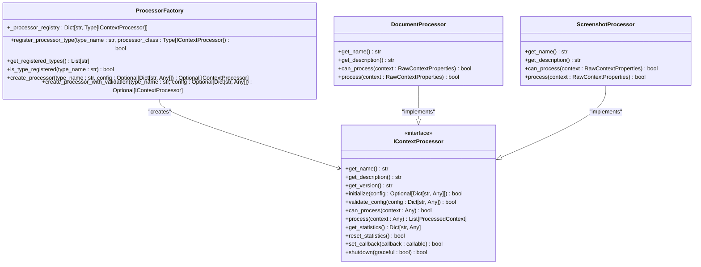
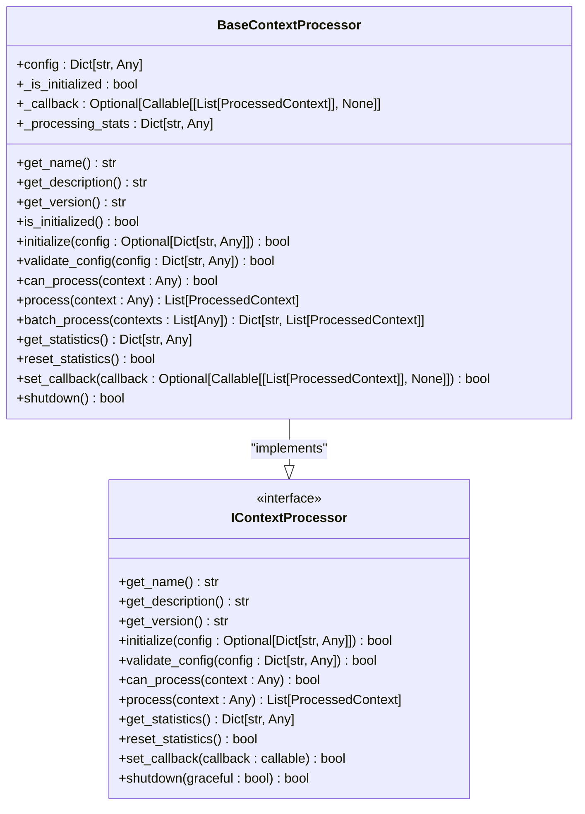
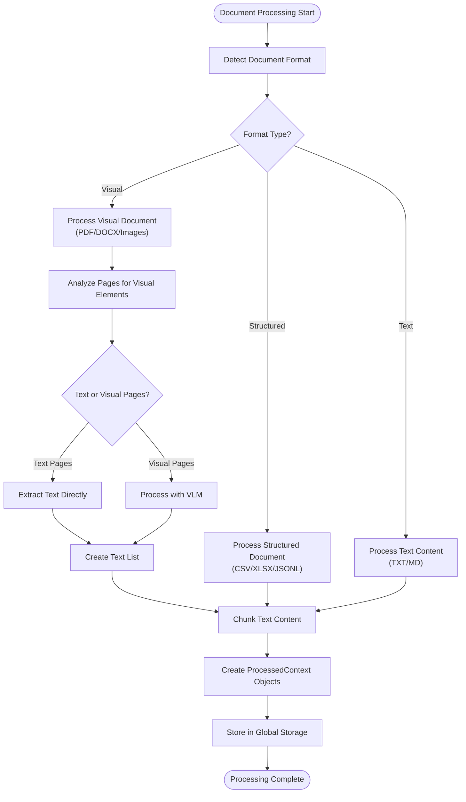
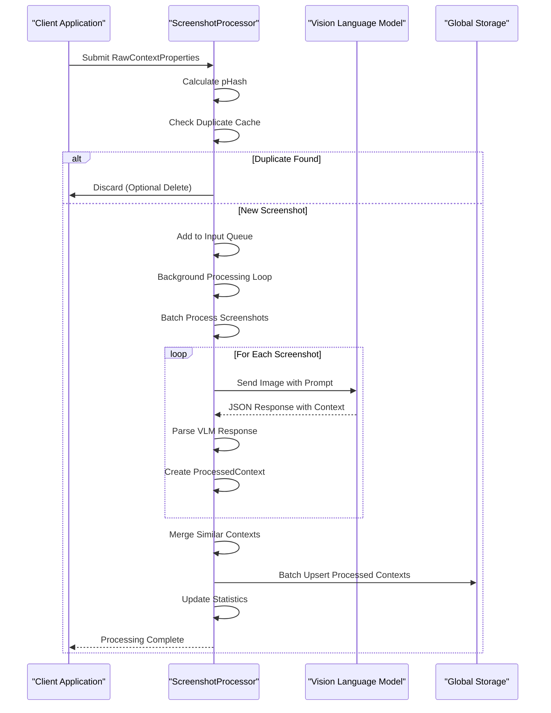
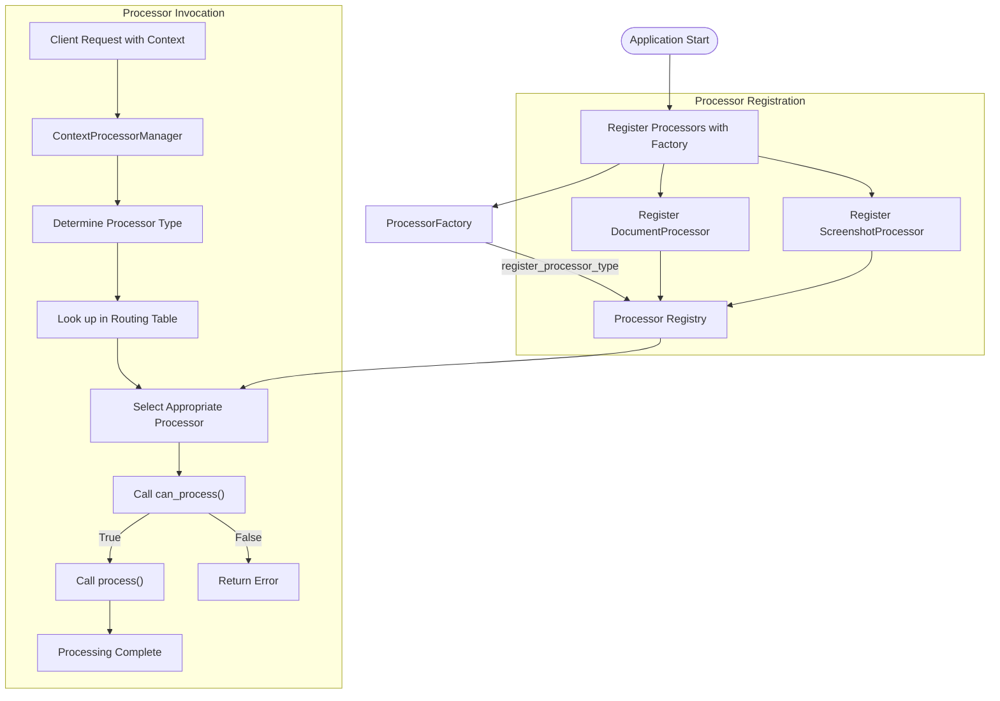
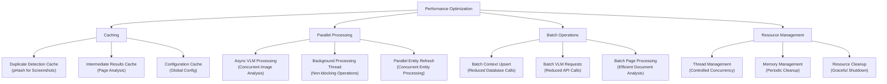

# Context Processors

<cite>
**Referenced Files in This Document**   
- [base_processor.py](file://opencontext/context_processing/processor/base_processor.py)
- [processor_factory.py](file://opencontext/context_processing/processor/processor_factory.py)
- [document_processor.py](file://opencontext/context_processing/processor/document_processor.py)
- [document_converter.py](file://opencontext/context_processing/processor/document_converter.py)
- [screenshot_processor.py](file://opencontext/context_processing/processor/screenshot_processor.py)
- [processor_interface.py](file://opencontext/interfaces/processor_interface.py)
- [config.yaml](file://config/config.yaml)
- [example_document_processor.py](file://examples/example_document_processor.py)
- [example_screenshot_processor.py](file://examples/example_screenshot_processor.py)
</cite>

## Table of Contents
1. [Introduction](#introduction)
2. [Processor Factory and Dynamic Instantiation](#processor-factory-and-dynamic-instantiation)
3. [Base Processor Implementation](#base-processor-implementation)
4. [Document Processor Workflow](#document-processor-workflow)
5. [Screenshot Processor Workflow](#screenshot-processor-workflow)
6. [Processor Registration and Invocation](#processor-registration-and-invocation)
7. [Error Handling Strategies](#error-handling-strategies)
8. [Performance Optimization Techniques](#performance-optimization-techniques)
9. [Custom Processor Development](#custom-processor-development)
10. [Conclusion](#conclusion)

## Introduction
The context processors component is a core part of the processing pipeline responsible for transforming raw context data into structured, meaningful information. This system employs a modular architecture with specialized processors for different data types, coordinated through a factory pattern and a common interface. The processors handle various input types including documents, screenshots, and other structured data, converting them into standardized ProcessedContext objects that can be used throughout the application. This document provides a comprehensive analysis of the processor architecture, implementation details, and usage patterns.

## Processor Factory and Dynamic Instantiation

The ProcessorFactory class implements the Factory design pattern to provide centralized creation and management of processor instances. This factory enables dynamic instantiation of appropriate processor types based on the input context type by leveraging the IContextProcessor interface. The factory maintains a registry of processor types and provides methods to create instances with automatic dependency injection and configuration management.

The factory is initialized with built-in processor types, currently including DocumentProcessor and ScreenshotProcessor. When a processor instance is requested, the factory checks if the requested type is registered and creates an instance accordingly. This design allows for extensibility, as new processor types can be registered at runtime without modifying the factory code.

**Diagram sources**
- [processor_factory.py](file://opencontext/context_processing/processor/processor_factory.py#L31-L175)
- [processor_interface.py](file://opencontext/interfaces/processor_interface.py#L16-L136)
- [document_processor.py](file://opencontext/context_processing/processor/document_processor.py#L41-L653)
- [screenshot_processor.py](file://opencontext/context_processing/processor/screenshot_processor.py#L47-L590)

**Section sources**
- [processor_factory.py](file://opencontext/context_processing/processor/processor_factory.py#L31-L175)
- [processor_interface.py](file://opencontext/interfaces/processor_interface.py#L16-L136)

## Base Processor Implementation

The BaseContextProcessor class provides common functionality and interface that all processors should implement. It serves as the foundation for all specific processor implementations, offering shared features such as statistics tracking, configuration management, and callback handling. This base class implements the IContextProcessor interface and uses abstract methods to enforce the implementation of core functionality in derived classes.

The base processor includes methods for initialization, configuration validation, and lifecycle management. It maintains processing statistics including the number of processed contexts, contexts generated, and error count. The processor also supports callback functions that are invoked when processing is complete, enabling event-driven architectures. The base implementation includes a shutdown method for cleaning up resources and gracefully terminating the processor.

**Diagram sources**
- [base_processor.py](file://opencontext/context_processing/processor/base_processor.py#L23-L261)

**Section sources**
- [base_processor.py](file://opencontext/context_processing/processor/base_processor.py#L23-L261)

## Document Processor Workflow

The DocumentProcessor handles the conversion of raw document content into structured context through a sophisticated workflow that includes format detection, text extraction, and metadata enrichment. This processor supports a wide range of document formats including PDF, DOCX, XLSX, CSV, Markdown, images, and plain text files. The processing workflow is designed to optimize performance by minimizing the use of expensive Vision Language Models (VLM) when simpler text extraction methods suffice.

The document processing workflow begins with format detection based on the file extension. For visual documents like PDF and DOCX, the processor employs a page-by-page analysis strategy to determine whether VLM processing is necessary. Pages with visual elements such as images or charts are processed using VLM, while text-only pages are processed using direct text extraction. This hybrid approach balances accuracy with cost efficiency.

**Diagram sources**
- [document_processor.py](file://opencontext/context_processing/processor/document_processor.py#L41-L653)
- [document_converter.py](file://opencontext/context_processing/processor/document_converter.py#L46-L607)

**Section sources**
- [document_processor.py](file://opencontext/context_processing/processor/document_processor.py#L41-L653)
- [document_converter.py](file://opencontext/context_processing/processor/document_converter.py#L46-L607)

## Screenshot Processor Workflow

The ScreenshotProcessor is responsible for analyzing screenshot streams, deduplicating images, and asynchronously extracting context information. This processor uses a background thread model, placing processing tasks in a queue and executing them in the background. The workflow includes real-time deduplication, concurrent VLM processing, and intelligent context merging.

The processor begins by checking for duplicate screenshots using perceptual hashing (pHash). When a new screenshot is received, its pHash is calculated and compared against recently processed screenshots. If the difference is below a configurable threshold, the screenshot is considered a duplicate and discarded. This deduplication step reduces unnecessary processing and storage.

**Diagram sources**
- [screenshot_processor.py](file://opencontext/context_processing/processor/screenshot_processor.py#L47-L590)

**Section sources**
- [screenshot_processor.py](file://opencontext/context_processing/processor/screenshot_processor.py#L47-L590)

## Processor Registration and Invocation

Processor registration and invocation follows a standardized pattern that enables flexible integration of new processor types. The ProcessorFactory maintains a registry of processor types that can be queried and instantiated as needed. Processors are registered with unique names and class references, allowing the factory to create instances dynamically based on the requested type.

The invocation pattern typically involves checking whether a processor can handle a given context using the can_process method, then calling the process method to initiate processing. For batch operations, the batch_process method is used to process multiple contexts efficiently. The processor manager coordinates the routing of contexts to appropriate processors based on the source type, as defined in the routing table.

**Diagram sources**
- [processor_factory.py](file://opencontext/context_processing/processor/processor_factory.py#L31-L175)
- [processor_manager.py](file://opencontext/managers/processor_manager.py#L21-L213)

**Section sources**
- [processor_factory.py](file://opencontext/context_processing/processor/processor_factory.py#L31-L175)
- [processor_manager.py](file://opencontext/managers/processor_manager.py#L21-L213)

## Error Handling Strategies

The context processors implement comprehensive error handling strategies to ensure robust operation in the face of malformed inputs and failed conversions. Each processor includes try-catch blocks around critical operations to prevent unhandled exceptions from crashing the application. When errors occur, they are logged with detailed information to facilitate debugging and monitoring.

For malformed inputs, processors validate the context before processing and return appropriate error responses. The DocumentProcessor checks for valid file paths and supported formats, while the ScreenshotProcessor verifies image integrity. When conversion failures occur, such as VLM processing errors, the processors implement retry logic and fallback strategies. The processing statistics track error counts, providing visibility into system reliability.

The processors also implement graceful shutdown procedures that allow for cleanup of resources and completion of pending operations. This ensures that the system can be restarted or updated without data loss. The error handling is designed to be non-blocking, allowing other processing tasks to continue even when individual operations fail.

**Section sources**
- [base_processor.py](file://opencontext/context_processing/processor/base_processor.py#L23-L261)
- [document_processor.py](file://opencontext/context_processing/processor/document_processor.py#L41-L653)
- [screenshot_processor.py](file://opencontext/context_processing/processor/screenshot_processor.py#L47-L590)

## Performance Optimization Techniques

The context processors employ several performance optimization techniques to handle large volumes of data efficiently. These include caching intermediate results, parallel processing, and batch operations. The processors are designed to minimize latency and maximize throughput while maintaining high accuracy.

Caching is implemented at multiple levels, including a duplicate screenshot cache in the ScreenshotProcessor and intermediate processing results in the DocumentProcessor. This reduces redundant computations and improves response times for frequently accessed data. The processors also leverage asynchronous operations and background threads to prevent blocking the main application flow.

Parallel processing is used extensively, particularly in the ScreenshotProcessor which processes multiple images concurrently using asyncio. The DocumentProcessor also employs parallel VLM analysis for pages that require visual processing. Batch operations are optimized to reduce database round-trips, with the processors batching multiple context upserts into single operations.

**Diagram sources**
- [screenshot_processor.py](file://opencontext/context_processing/processor/screenshot_processor.py#L47-L590)
- [document_processor.py](file://opencontext/context_processing/processor/document_processor.py#L41-L653)

**Section sources**
- [screenshot_processor.py](file://opencontext/context_processing/processor/screenshot_processor.py#L47-L590)
- [document_processor.py](file://opencontext/context_processing/processor/document_processor.py#L41-L653)

## Custom Processor Development

Developing custom processors for new data types involves extending the base classes and registering them with the factory. To create a custom processor, developers should inherit from BaseContextProcessor and implement the required abstract methods. The processor must provide a unique name, description, and version, and implement the can_process and process methods to handle the specific data type.

The custom processor should follow the same interface and lifecycle patterns as the built-in processors. This includes proper initialization, configuration validation, and error handling. The processor can leverage existing utilities such as the document converter or VLM client for common operations. Once implemented, the custom processor can be registered with the ProcessorFactory using the register_processor_type method.

Configuration for custom processors can be defined in the config.yaml file under the processing section, allowing users to customize behavior without modifying code. The processor should validate its configuration and provide sensible defaults for missing values. Testing should include both unit tests for individual methods and integration tests to verify the processor works correctly within the overall system.

**Section sources**
- [base_processor.py](file://opencontext/context_processing/processor/base_processor.py#L23-L261)
- [processor_factory.py](file://opencontext/context_processing/processor/processor_factory.py#L31-L175)
- [config.yaml](file://config/config.yaml#L77-L144)

## Conclusion
The context processors component provides a robust, extensible framework for transforming raw data into structured context. Through the use of the Factory pattern, a common interface, and well-defined base classes, the system enables dynamic instantiation of appropriate processors based on input context type. The DocumentProcessor and ScreenshotProcessor demonstrate sophisticated workflows for handling different data types, with optimizations for performance and accuracy. The architecture supports custom processor development, allowing the system to be extended for new data types and use cases. Comprehensive error handling and performance optimization techniques ensure reliable operation in production environments.