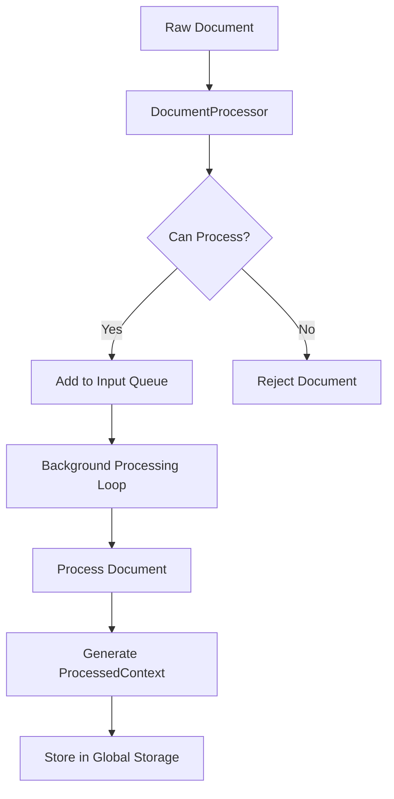
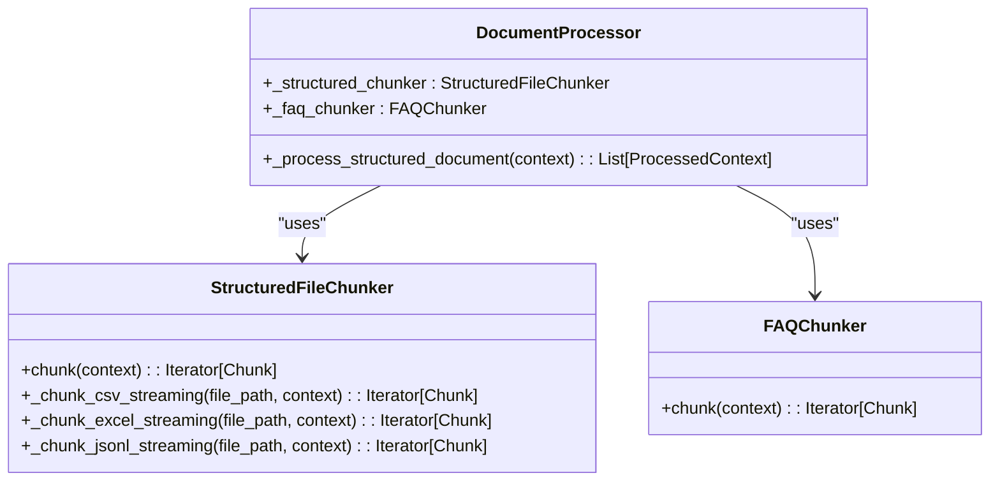
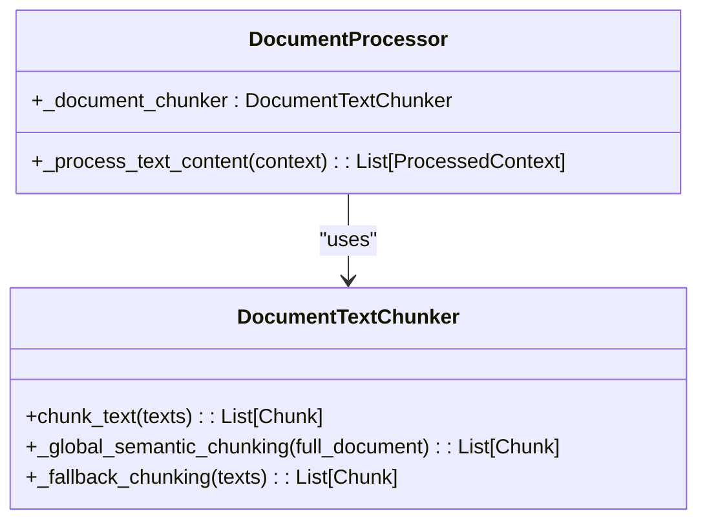
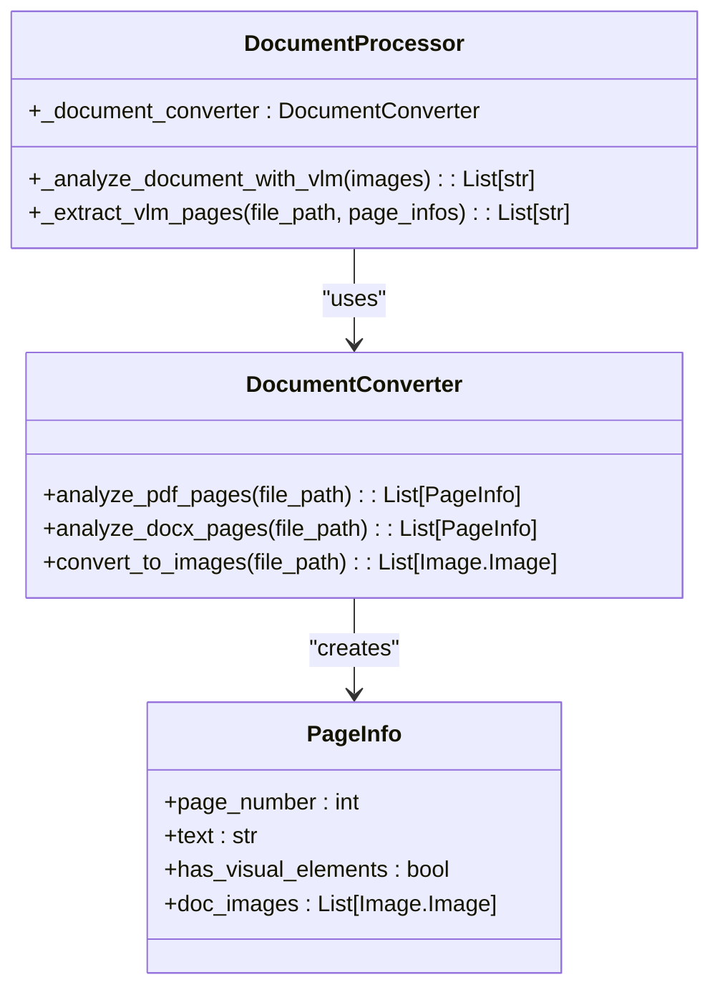
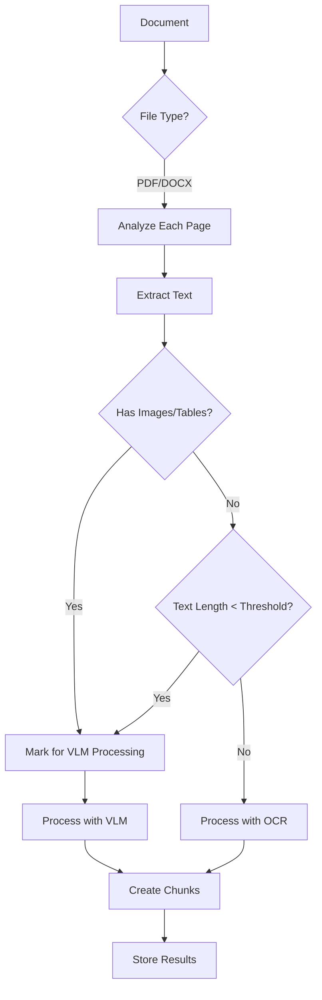
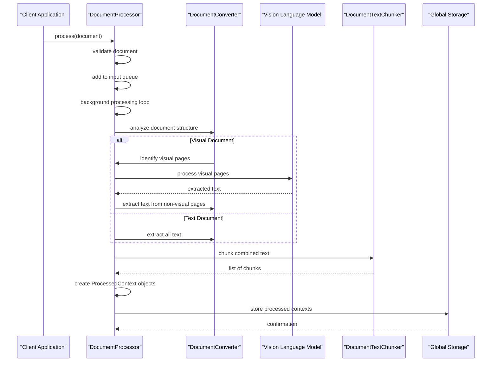
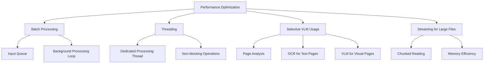

# Document Processor

<cite>
**Referenced Files in This Document**   
- [document_processor.py](file://opencontext/context_processing/processor/document_processor.py)
- [document_converter.py](file://opencontext/context_processing/processor/document_converter.py)
- [chunkers.py](file://opencontext/context_processing/chunker/chunkers.py)
- [document_text_chunker.py](file://opencontext/context_processing/chunker/document_text_chunker.py)
- [config.yaml](file://config/config.yaml)
- [prompts_en.yaml](file://config/prompts_en.yaml)
</cite>

## Table of Contents
1. [Introduction](#introduction)
2. [Core Architecture](#core-architecture)
3. [Processing Pathways](#processing-pathways)
4. [Intelligent Page Analysis](#intelligent-page-analysis)
5. [Configuration Parameters](#configuration-parameters)
6. [Processing Workflow](#processing-workflow)
7. [Error Handling](#error-handling)
8. [Performance Optimization](#performance-optimization)
9. [Extensibility](#extensibility)
10. [Conclusion](#conclusion)

## Introduction

The DocumentProcessor is a core component of the context processors system, designed as a multi-format document handler that processes various file types including PDF, DOCX, images, CSV, XLSX, and plain text files. It operates as an asynchronous background service with a queue-based architecture, enabling efficient processing of documents without blocking the main application flow. The processor intelligently routes documents through different processing pathways based on their content type and structure, utilizing specialized chunkers for structured data, text content, and visual analysis via a Vision Language Model (VLM) for documents with complex layouts or visual elements.

**Section sources**
- [document_processor.py](file://opencontext/context_processing/processor/document_processor.py#L41-L96)

## Core Architecture

The DocumentProcessor implements a background thread architecture with an input queue and processing loop that enables asynchronous document processing. When initialized, the processor starts a dedicated background thread (`_processing_task`) that continuously monitors an input queue for new documents to process. This design decouples document submission from processing, allowing the system to handle documents efficiently without blocking other operations.

The processor inherits from `BaseContextProcessor` and implements the `IContextProcessor` interface, providing standard methods for initialization, processing, and lifecycle management. Documents are submitted to the processor via the `process()` method, which adds them to the input queue. The background processing loop (`_run_processing_loop`) consumes documents from the queue, processes them, and stores the results in the global storage system.

**Diagram sources**
- [document_processor.py](file://opencontext/context_processing/processor/document_processor.py#L68-L71)
- [document_processor.py](file://opencontext/context_processing/processor/document_processor.py#L197-L222)

**Section sources**
- [document_processor.py](file://opencontext/context_processing/processor/document_processor.py#L41-L96)
- [document_processor.py](file://opencontext/context_processing/processor/document_processor.py#L186-L195)
- [document_processor.py](file://opencontext/context_processing/processor/document_processor.py#L197-L222)

## Processing Pathways

The DocumentProcessor employs three distinct processing pathways based on the document type and content characteristics. This intelligent routing ensures optimal processing for different document formats and content structures.

### Structured Document Handling

For structured documents such as CSV, XLSX, JSONL, and FAQ Excel files, the processor uses specialized chunkers that preserve the tabular structure and relationships within the data. The `StructuredFileChunker` handles general structured files by streaming them in batches to minimize memory usage, while the `FAQChunker` treats each Q&A pair in an FAQ Excel file as a separate chunk.

**Diagram sources**
- [document_processor.py](file://opencontext/context_processing/processor/document_processor.py#L75-L76)
- [chunkers.py](file://opencontext/context_processing/chunker/chunkers.py#L155-L348)

**Section sources**
- [document_processor.py](file://opencontext/context_processing/processor/document_processor.py#L247-L260)
- [chunkers.py](file://opencontext/context_processing/chunker/chunkers.py#L155-L348)

### Text Content Processing

For plain text content, including vaults text content and simple text files, the processor uses the `DocumentTextChunker` to split the text into semantically meaningful chunks. This chunker implements intelligent splitting strategies that consider paragraph boundaries and sentence structure to create coherent text segments.

**Diagram sources**
- [document_processor.py](file://opencontext/context_processing/processor/document_processor.py#L78-L84)
- [document_text_chunker.py](file://opencontext/context_processing/chunker/document_text_chunker.py#L25-L349)

**Section sources**
- [document_processor.py](file://opencontext/context_processing/processor/document_processor.py#L303-L310)
- [document_text_chunker.py](file://opencontext/context_processing/chunker/document_text_chunker.py#L25-L349)

### Visual Document Analysis

For visual documents such as PDFs, DOCX files, and images, the processor employs a Vision Language Model (VLM) to analyze pages with charts, complex layouts, or scanned content. The `DocumentConverter` first analyzes each page to determine if VLM processing is needed, then routes visual pages through the VLM while extracting text directly from pages with primarily textual content.

**Diagram sources**
- [document_processor.py](file://opencontext/context_processing/processor/document_processor.py#L73-L73)
- [document_converter.py](file://opencontext/context_processing/processor/document_converter.py#L27-L607)

**Section sources**
- [document_processor.py](file://opencontext/context_processing/processor/document_processor.py#L312-L402)
- [document_converter.py](file://opencontext/context_processing/processor/document_converter.py#L27-L607)

## Intelligent Page Analysis

The DocumentProcessor implements an intelligent page-by-page analysis strategy that combines OCR for text-only pages with VLM for visual elements, optimizing both performance and accuracy. This approach minimizes the use of computationally expensive VLM processing by only applying it to pages that contain visual elements such as charts, diagrams, or scanned content.

For PDF and DOCX documents, the processor first analyzes each page to determine its content characteristics. The `analyze_pdf_pages` method examines the PDF structure to detect embedded images and tables, while also checking the amount of extractable text. Pages with insufficient text (below the `text_threshold` parameter) are flagged for VLM processing, as they are likely scanned documents.

**Diagram sources**
- [document_processor.py](file://opencontext/context_processing/processor/document_processor.py#L339-L402)
- [document_converter.py](file://opencontext/context_processing/processor/document_converter.py#L142-L166)

**Section sources**
- [document_processor.py](file://opencontext/context_processing/processor/document_processor.py#L339-L402)
- [document_converter.py](file://opencontext/context_processing/processor/document_converter.py#L142-L166)

## Configuration Parameters

The DocumentProcessor's behavior is controlled by several configuration parameters that can be set in the system configuration file. These parameters allow fine-tuning of processing behavior to balance performance, accuracy, and resource usage.

| Parameter | Default Value | Description |
|---------|-------------|-----------|
| dpi | 200 | Resolution for converting PDF pages to images (higher values improve OCR accuracy but increase processing time and memory usage) |
| vlm_batch_size | 6 | Number of pages processed by the VLM in a single batch (larger batches improve throughput but require more memory) |
| text_threshold | 50 | Minimum number of characters required on a page before it's considered text-only (pages with fewer characters are processed with VLM) |
| batch_size | 5 | Maximum number of documents processed in a batch |
| batch_timeout | 30 | Timeout in seconds for processing a batch of documents |

These parameters are loaded from the `config.yaml` file during initialization and can be dynamically adjusted at runtime using the `set_vlm_batch_size()` method.

**Section sources**
- [document_processor.py](file://opencontext/context_processing/processor/document_processor.py#L57-L63)
- [config.yaml](file://config/config.yaml#L17-L25)

## Processing Workflow

The complete processing workflow begins when a document is submitted to the processor via the `process()` method. The processor first validates that it can handle the document type, then adds it to the input queue. The background processing loop consumes documents from the queue and routes them through the appropriate processing pathway based on their content type.

For visual documents, the workflow involves several stages: page analysis, selective VLM processing, text extraction, and chunking. The processor first analyzes the document structure to identify pages that require VLM processing. It then processes visual pages with the VLM to extract text and descriptions of visual elements, while using direct text extraction for pages with primarily textual content. Finally, all extracted text is combined and processed through the `DocumentTextChunker` to create semantically meaningful chunks.

**Diagram sources**
- [document_processor.py](file://opencontext/context_processing/processor/document_processor.py#L223-L239)
- [document_processor.py](file://opencontext/context_processing/processor/document_processor.py#L312-L402)

**Section sources**
- [document_processor.py](file://opencontext/context_processing/processor/document_processor.py#L223-L239)
- [document_processor.py](file://opencontext/context_processing/processor/document_processor.py#L312-L402)

## Error Handling

The DocumentProcessor implements comprehensive error handling strategies to manage various failure scenarios during document processing. Errors are categorized and handled appropriately to ensure system stability and provide meaningful feedback.

For file access failures, the processor checks if the file exists and is readable before processing. If a file cannot be accessed, a warning is logged and the document is rejected. For VLM processing errors, the processor catches exceptions during VLM calls and raises a `RuntimeError` with details about the failed page. Malformed documents are handled by wrapping parsing operations in try-catch blocks, with specific error messages logged for debugging.

All processing errors are recorded in the system monitoring component using the `record_processing_error()` function, which captures the error message, processor name, and context count for later analysis and troubleshooting.

**Section sources**
- [document_processor.py](file://opencontext/context_processing/processor/document_processor.py#L241-L245)
- [document_processor.py](file://opencontext/context_processing/processor/document_processor.py#L454-L457)
- [monitor.py](file://opencontext/monitoring/monitor.py#L530-L548)

## Performance Optimization

The DocumentProcessor incorporates several performance optimization techniques to handle large volumes of documents efficiently. These include batch processing, multithreading, and selective VLM usage.

Batch processing is implemented through the input queue and background processing loop, allowing multiple documents to be processed in sequence without blocking the main application. The processor uses threading to separate document submission from processing, ensuring responsive performance even when handling large documents.

Selective VLM usage is a key optimization that significantly reduces processing time and costs. By analyzing each page to determine if VLM processing is necessary, the processor avoids using the computationally expensive VLM on pages with primarily textual content. This intelligent routing ensures that VLM resources are used only when needed, optimizing both performance and cost.

**Diagram sources**
- [document_processor.py](file://opencontext/context_processing/processor/document_processor.py#L68-L71)
- [document_processor.py](file://opencontext/context_processing/processor/document_processor.py#L339-L402)
- [chunkers.py](file://opencontext/context_processing/chunker/chunkers.py#L197-L348)

**Section sources**
- [document_processor.py](file://opencontext/context_processing/processor/document_processor.py#L68-L71)
- [document_processor.py](file://opencontext/context_processing/processor/document_processor.py#L339-L402)
- [chunkers.py](file://opencontext/context_processing/chunker/chunkers.py#L197-L348)

## Extensibility

The DocumentProcessor is designed with extensibility in mind, allowing for easy addition of support for new document formats and custom chunking strategies. New format support can be added by extending the `get_supported_formats()` method and implementing appropriate processing logic in the `can_process()` and processing methods.

Custom chunking strategies can be implemented by creating new chunker classes that inherit from `BaseChunker` and overriding the `chunk()` method. These custom chunkers can then be integrated into the processor by adding them as instance variables and routing appropriate document types to them.

The processor's modular design, with separate components for document conversion, chunking, and VLM analysis, makes it easy to extend or replace individual components without affecting the overall system architecture.

**Section sources**
- [document_processor.py](file://opencontext/context_processing/processor/document_processor.py#L111-L131)
- [chunkers.py](file://opencontext/context_processing/chunker/chunkers.py#L46-L68)

## Conclusion

The DocumentProcessor is a sophisticated multi-format document handler that provides robust, asynchronous processing of various document types. Its intelligent architecture combines background threading, selective VLM usage, and specialized processing pathways to efficiently handle documents while maintaining high accuracy. The processor's modular design and comprehensive error handling make it a reliable component of the context processors system, capable of scaling to handle large volumes of diverse document types while providing extensibility for future enhancements.