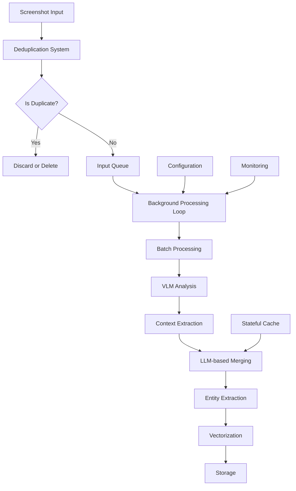

# Screenshot Processor

<cite>
**Referenced Files in This Document**   
- [screenshot_processor.py](file://opencontext/context_processing/processor/screenshot_processor.py)
- [base_processor.py](file://opencontext/context_processing/processor/base_processor.py)
- [config.yaml](file://config/config.yaml)
- [context.py](file://opencontext/models/context.py)
- [enums.py](file://opencontext/models/enums.py)
- [image.py](file://opencontext/utils/image.py)
- [prompts_en.yaml](file://config/prompts_en.yaml)
</cite>

## Table of Contents
1. [Introduction](#introduction)
2. [Architecture Overview](#architecture-overview)
3. [Background Thread Architecture](#background-thread-architecture)
4. [Perceptual Hashing Deduplication](#perceptual-hashing-deduplication)
5. [Two-Phase Processing Pipeline](#two-phase-processing-pipeline)
6. [Context Type Classification](#context-type-classification)
7. [Stateful Caching and Memory Management](#stateful-caching-and-memory-management)
8. [Error Handling Strategies](#error-handling-strategies)
9. [Performance Optimization Techniques](#performance-optimization-techniques)
10. [Configuration and Tuning](#configuration-and-tuning)

## Introduction

The ScreenshotProcessor component is a real-time screenshot analysis engine that serves as a core component of the context processors system. It extracts semantic context from screen captures using Vision Language Models (VLMs) and transforms raw screenshots into structured ProcessedContext objects containing titles, summaries, keywords, and entities. The processor implements a sophisticated background thread architecture with input queue and processing loop that handles screenshot streams with configurable batch sizes and timeouts.

This component plays a critical role in transforming visual information from screenshots into actionable context by analyzing screen content through VLMs and classifying the extracted information into meaningful categories such as activity, procedural, and semantic contexts. The processor employs a two-phase pipeline: concurrent VLM analysis of screenshot batches followed by intelligent context merging using Large Language Models (LLMs) to consolidate related items like multiple screenshots of the same task.

The ScreenshotProcessor incorporates advanced features including perceptual hashing (pHash) based deduplication to prevent redundant processing of similar screenshots, stateful caching to maintain processed contexts in memory for merging operations, and periodic compression of related items. It handles various error conditions including image encoding failures, VLM API errors, and JSON parsing issues, while implementing performance optimizations such as batched VLM requests, image resizing, and asynchronous processing.

**Section sources**
- [screenshot_processor.py](file://opencontext/context_processing/processor/screenshot_processor.py#L47-L590)

## Architecture Overview

The ScreenshotProcessor follows a modular architecture that integrates with the broader context processing system through well-defined interfaces. It inherits from the BaseContextProcessor class, implementing the IContextProcessor interface to ensure consistency with other processors in the system. The component operates as a background service with a dedicated processing thread that handles incoming screenshots through a queue-based system.

The architecture consists of several key components: an input queue that buffers incoming screenshots, a background processing thread that executes the main processing loop, a deduplication system based on perceptual hashing, a two-phase processing pipeline (VLM analysis followed by LLM-based merging), and a stateful caching mechanism that maintains processed contexts in memory. The processor integrates with external services including the VLM client for image analysis, the storage system for persistence, and the monitoring system for metrics collection.

The component follows a clear separation of concerns, with distinct methods handling different aspects of processing: deduplication, VLM analysis, context merging, and entity extraction. It leverages configuration from the global configuration system to control its behavior, including batch sizes, timeouts, deduplication thresholds, and image processing parameters. The architecture supports graceful shutdown through a stop event mechanism and includes comprehensive error handling and logging throughout the processing pipeline.

**Diagram sources **
- [screenshot_processor.py](file://opencontext/context_processing/processor/screenshot_processor.py#L47-L590)
- [base_processor.py](file://opencontext/context_processing/processor/base_processor.py#L23-L261)

**Section sources**
- [screenshot_processor.py](file://opencontext/context_processing/processor/screenshot_processor.py#L47-L590)
- [base_processor.py](file://opencontext/context_processing/processor/base_processor.py#L23-L261)

## Background Thread Architecture

The ScreenshotProcessor implements a background thread architecture that enables asynchronous processing of screenshot streams. This architecture is centered around a dedicated processing thread that runs a continuous loop, consuming screenshots from an input queue and processing them in batches according to configurable parameters. The background thread is initialized during the processor's construction and runs as a daemon thread, ensuring it doesn't prevent the application from terminating.

The processing loop operates on a dual-trigger mechanism: it processes screenshots when either the batch size threshold is reached or the batch timeout period expires. This ensures timely processing of screenshots even when the capture rate is low. The input queue has a maximum size of three times the batch size, providing sufficient buffering while preventing excessive memory usage. When the queue is empty, the thread waits for the specified timeout period before checking again, creating an efficient polling mechanism that balances responsiveness with resource usage.

The background thread architecture includes proper shutdown handling through a stop event and sentinel value mechanism. When shutdown is requested, a stop event is set and a None value (sentinel) is placed in the queue to unblock any waiting get() operations. The processing thread checks the stop event at the beginning of each iteration and exits cleanly when signaled. This ensures graceful shutdown without losing any queued screenshots. The architecture also includes error handling within the processing loop to prevent crashes from terminating the thread unexpectedly.

**Section sources**
- [screenshot_processor.py](file://opencontext/context_processing/processor/screenshot_processor.py#L76-L95)
- [screenshot_processor.py](file://opencontext/context_processing/processor/screenshot_processor.py#L172-L235)

## Perceptual Hashing Deduplication

The ScreenshotProcessor implements a real-time deduplication system based on perceptual hashing (pHash) to prevent redundant processing of similar screenshots. This system calculates a perceptual hash for each incoming screenshot and compares it against hashes of recently processed screenshots stored in a sliding window cache. The deduplication occurs immediately upon receiving a new screenshot, before it enters the processing queue, ensuring that duplicate images are identified and handled efficiently.

The perceptual hashing implementation uses the difference hash (dHash) algorithm with an 8x8 hash size, providing a good balance between accuracy and performance. The hash is calculated using the imagehash library, which converts the image to grayscale and computes the hash based on pixel intensity differences between adjacent pixels. When a new screenshot arrives, its pHash is compared to those in the current_screenshot deque by calculating the Hamming distance (number of differing bits) between hash values. If the distance is less than or equal to the configured similarity threshold, the screenshot is considered a duplicate.

The deduplication system includes configurable parameters that control its behavior: the similarity_hash_threshold determines how similar two screenshots must be to be considered duplicates (lower values require greater similarity), and the enabled_delete flag controls whether duplicate screenshot files are automatically deleted. When a duplicate is detected, the corresponding cache entry is moved to the end of the deque to implement a least-recently-used eviction policy, ensuring that frequently accessed screenshots remain in the cache. The current_screenshot deque has a maximum length of twice the batch size, providing sufficient history for effective deduplication while limiting memory usage.

**Section sources**
- [screenshot_processor.py](file://opencontext/context_processing/processor/screenshot_processor.py#L114-L147)
- [image.py](file://opencontext/utils/image.py#L33-L43)
- [config.yaml](file://config/config.yaml#L87)

## Two-Phase Processing Pipeline

The ScreenshotProcessor implements a two-phase processing pipeline that efficiently transforms raw screenshots into structured context information. The first phase involves concurrent Vision Language Model (VLM) analysis of screenshot batches, where multiple screenshots are processed simultaneously to maximize throughput. The second phase employs intelligent context merging using Large Language Models (LLMs) to consolidate related items and eliminate redundancy in the extracted information.

In the first phase, the processor collects screenshots into batches based on the configured batch_size and batch_timeout parameters. When either condition is met, the batch is processed by concurrently executing VLM analysis on all screenshots in the batch. This is achieved through asyncio.gather, which runs multiple _process_vlm_single coroutines in parallel. Each VLM analysis request includes a system prompt that defines the extraction task and a user prompt that provides contextual information such as the current date and timezone. The VLM returns structured JSON containing extracted information which is parsed and converted into preliminary ProcessedContext objects.

The second phase focuses on intelligent merging of the extracted contexts. The processor groups contexts by their context_type and uses LLM-based merging to consolidate related items. For each context type, the processor calls the _merge_items_with_llm method, which sends all relevant contexts (both new and cached) to an LLM with a specialized merging prompt. The LLM analyzes the semantic relationships between contexts and determines which items should be merged into a single consolidated context and which should remain as independent items. The merging process preserves all relevant details from the original contexts while eliminating redundancy, resulting in a more coherent and concise representation of the user's activities.

**Section sources**
- [screenshot_processor.py](file://opencontext/context_processing/processor/screenshot_processor.py#L498-L531)
- [screenshot_processor.py](file://opencontext/context_processing/processor/screenshot_processor.py#L303-L450)
- [prompts_en.yaml](file://config/prompts_en.yaml#L708-L899)

## Context Type Classification

The ScreenshotProcessor implements a sophisticated context type classification system that categorizes extracted information into distinct types including activity, procedural, semantic, and others. This classification is performed by the Vision Language Model during the initial analysis phase, guided by a comprehensive system prompt that defines the characteristics and examples of each context type. The classification system enables more effective organization, retrieval, and utilization of the extracted context information.

The processor supports multiple context types, each with specific characteristics and use cases:
- **Activity Context**: Represents specific behavioral trajectories, completed tasks, and participated activities. These contexts capture what the user did, such as "current_user reviewing memory repository configuration."
- **Procedural Context**: Records user operation flows and task procedures, capturing reusable operation patterns and workflows like "Steps for Code Merging Using Git."
- **Semantic Context**: Contains knowledge concepts and technical principles, focusing on what the knowledge is rather than how it was obtained, such as "MineContext Technical Architecture."
- **Intent Context**: Captures forward-looking information like future plans, goal setting, and action intentions, for example "Next Week Product Launch Preparation."
- **State Context**: Records status information such as current status, progress tracking, and performance indicators, like "Project Progress: Frontend Development 80% Complete."
- **Entity Context**: Manages profile information of various entities (people, projects, teams, organizations), supporting entity autonomous learning and knowledge accumulation.

The classification process is guided by detailed descriptions and key indicators for each context type, which are provided to the VLM in the system prompt. The prompt includes specific examples and classification priorities to help the model make accurate determinations. After extraction, the processor validates the context type and applies appropriate processing rules during the merging phase, with different merge criteria for each type. For instance, activity contexts require explicit evidence of the same task to merge, while semantic contexts can merge if they represent different descriptions of the same topic.

**Section sources**
- [screenshot_processor.py](file://opencontext/context_processing/processor/screenshot_processor.py#L277)
- [enums.py](file://opencontext/models/enums.py#L111-L231)
- [prompts_en.yaml](file://config/prompts_en.yaml#L714-L725)

## Stateful Caching and Memory Management

The ScreenshotProcessor implements a stateful caching mechanism that maintains processed contexts in memory to enable intelligent merging and relationship detection across multiple screenshots. This caching system is crucial for identifying and consolidating related items, such as multiple screenshots of the same task or different aspects of the same project. The cache is organized by context type, with separate dictionaries for each type to optimize lookup and merging operations.

The primary cache, _processed_cache, stores ProcessedContext objects indexed by their ID within each context type category. This allows the processor to quickly retrieve existing contexts when processing new screenshots, enabling comparison and potential merging. The cache is updated during the merging phase, where new contexts are added and obsolete ones are removed. When contexts are merged, the resulting consolidated context replaces the individual items in the cache, and the original items are marked for deletion in persistent storage.

The processor also maintains a secondary cache, _current_screenshot, specifically for deduplication purposes. This deque stores perceptual hashes of recently processed screenshots along with their object IDs, allowing the system to quickly identify and filter out duplicate images before they enter the processing pipeline. The size of this cache is limited to twice the batch size, implementing an automatic eviction policy where older entries are removed as new ones are added.

Memory management is further enhanced by the periodic compression feature, which analyzes cached contexts and identifies opportunities for consolidation based on similarity and temporal proximity. This process helps prevent cache bloat and ensures that the most relevant and recent information is retained. The cache operates entirely in memory for performance reasons, with changes synchronized to persistent storage through the batch_upsert_processed_context method after processing completes.

**Section sources**
- [screenshot_processor.py](file://opencontext/context_processing/processor/screenshot_processor.py#L80-L85)
- [screenshot_processor.py](file://opencontext/context_processing/processor/screenshot_processor.py#L318-L334)
- [screenshot_processor.py](file://opencontext/context_processing/processor/screenshot_processor.py#L434-L435)

## Error Handling Strategies

The ScreenshotProcessor implements comprehensive error handling strategies to ensure robust operation in the face of various failure scenarios. The component employs a layered approach to error management, with specific handling for different types of errors including image encoding failures, VLM API errors, JSON parsing issues, and general processing exceptions. This robust error handling ensures that transient issues do not disrupt the overall processing pipeline or cause data loss.

For image encoding failures, the processor includes specific validation when converting screenshots to base64 format for VLM analysis. If the encoding fails, a ValueError is raised with descriptive information, and the error is logged at the warning level. The _encode_image_to_base64 method includes a try-except block that catches any exceptions during file reading and returns None, which is then handled by the calling method. This prevents corrupted or inaccessible image files from crashing the processing thread.

VLM API errors are handled through try-except blocks around the generate_with_messages_async calls. Network issues, authentication failures, or service unavailability are caught and converted to ValueError with descriptive messages. These errors are logged at the error level and recorded in the monitoring system using the record_processing_error function, which tracks error frequency and context count. The processing loop continues after such errors, ensuring that a single failed request doesn't halt processing of subsequent screenshots.

JSON parsing issues are addressed in the VLM response handling, where the parse_json_from_response function attempts to extract valid JSON from the LLM output. If parsing fails, an empty result is returned, which is then handled by checking for empty responses before processing. The processor also includes general exception handling in the main processing loop, which catches unexpected errors, logs them with full traceback information, and continues processing after a brief delay. This prevents the background thread from terminating due to unhandled exceptions.

**Section sources**
- [screenshot_processor.py](file://opencontext/context_processing/processor/screenshot_processor.py#L582-L589)
- [screenshot_processor.py](file://opencontext/context_processing/processor/screenshot_processor.py#L287-L290)
- [screenshot_processor.py](file://opencontext/context_processing/processor/screenshot_processor.py#L292-L295)
- [screenshot_processor.py](file://opencontext/context_processing/processor/screenshot_processor.py#L198-L200)

## Performance Optimization Techniques

The ScreenshotProcessor incorporates several performance optimization techniques to maximize processing efficiency and minimize resource consumption. These optimizations address both computational efficiency and API cost reduction, ensuring the processor can handle high-volume screenshot streams without excessive latency or expense. The techniques include batched VLM requests, image resizing, asynchronous processing, and efficient data structures.

Batched VLM requests are a key optimization that reduces the number of API calls and associated latency. Instead of processing screenshots individually, the processor collects them into batches based on the configured batch_size and batch_timeout parameters. When a batch is ready, all screenshots are processed concurrently using asyncio.gather, which executes multiple VLM analysis tasks in parallel. This approach significantly improves throughput compared to sequential processing, especially when network latency is a factor.

Image resizing is another important optimization that reduces both processing time and API costs. Before VLM analysis, screenshots are resized proportionally if their dimensions exceed the configured max_image_size parameter. This reduces the data volume sent to the VLM API, which typically charges based on image resolution. The resize_image function uses the BILINEAR resampling algorithm for a good balance of quality and performance, and applies format-specific optimizations like JPEG quality settings and PNG compression.

The processor leverages asynchronous processing throughout its architecture, using asyncio for concurrent VLM requests and background thread execution for the main processing loop. This non-blocking design allows the processor to handle multiple operations simultaneously without blocking on I/O operations. The use of efficient data structures like deque for the deduplication cache ensures O(1) insertion and deletion operations, while the dictionary-based _processed_cache provides O(1) lookup performance for context merging operations.

**Section sources**
- [screenshot_processor.py](file://opencontext/context_processing/processor/screenshot_processor.py#L158-L159)
- [screenshot_processor.py](file://opencontext/context_processing/processor/screenshot_processor.py#L506-L508)
- [image.py](file://opencontext/utils/image.py#L46-L67)
- [config.yaml](file://config/config.yaml#L90-L91)

## Configuration and Tuning

The ScreenshotProcessor is highly configurable through the global configuration system, allowing users to tune its behavior for different use cases and performance requirements. Configuration parameters are defined in the config.yaml file under the processing.screenshot_processor section and can be adjusted without code changes. These parameters control various aspects of the processor's operation, including processing throughput, deduplication sensitivity, image quality, and resource usage.

Key configuration parameters include:
- **batch_size**: Controls the number of screenshots processed in each batch (default: 20). Higher values increase throughput but may increase latency.
- **batch_timeout**: Specifies the maximum time to wait for a batch to fill (default: 10 seconds). Lower values reduce latency but may result in smaller batches.
- **similarity_hash_threshold**: Determines the sensitivity of the deduplication system (default: 7). Lower values require greater similarity to consider screenshots as duplicates.
- **max_image_size**: Limits the maximum dimension of screenshots before processing (default: 1920 pixels). Reducing this value decreases API costs and processing time.
- **resize_quality**: Controls the quality of resized JPEG images (default: 85). Lower values reduce file size but may impact VLM analysis quality.
- **enabled_delete**: Enables automatic deletion of duplicate screenshot files (default: true).

For optimal performance tuning, users should consider their specific requirements. For real-time responsiveness, lower batch_timeout values (5-10 seconds) are recommended. For cost-sensitive environments, reducing max_image_size and resize_quality can significantly decrease VLM API costs. For environments with high duplicate rates, adjusting the similarity_hash_threshold can balance between aggressive deduplication and preserving slightly different screenshots. The batch_size should be tuned based on the expected screenshot capture rate and available system resources, with higher values generally providing better throughput for high-volume scenarios.

**Section sources**
- [config.yaml](file://config/config.yaml#L84-L94)
- [screenshot_processor.py](file://opencontext/context_processing/processor/screenshot_processor.py#L58-L72)