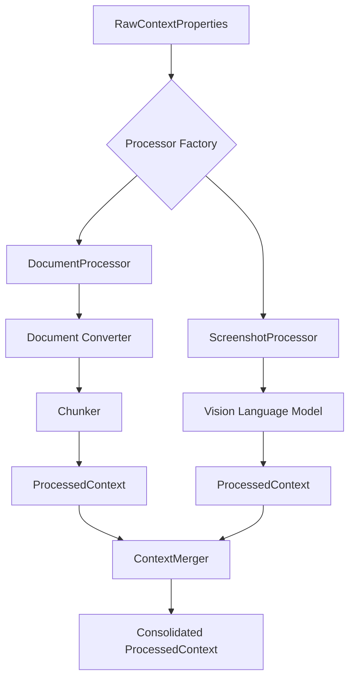
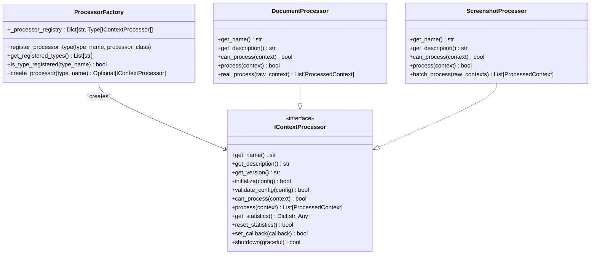
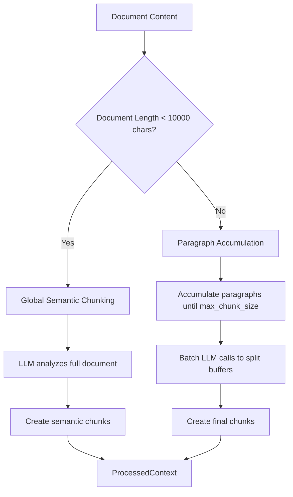
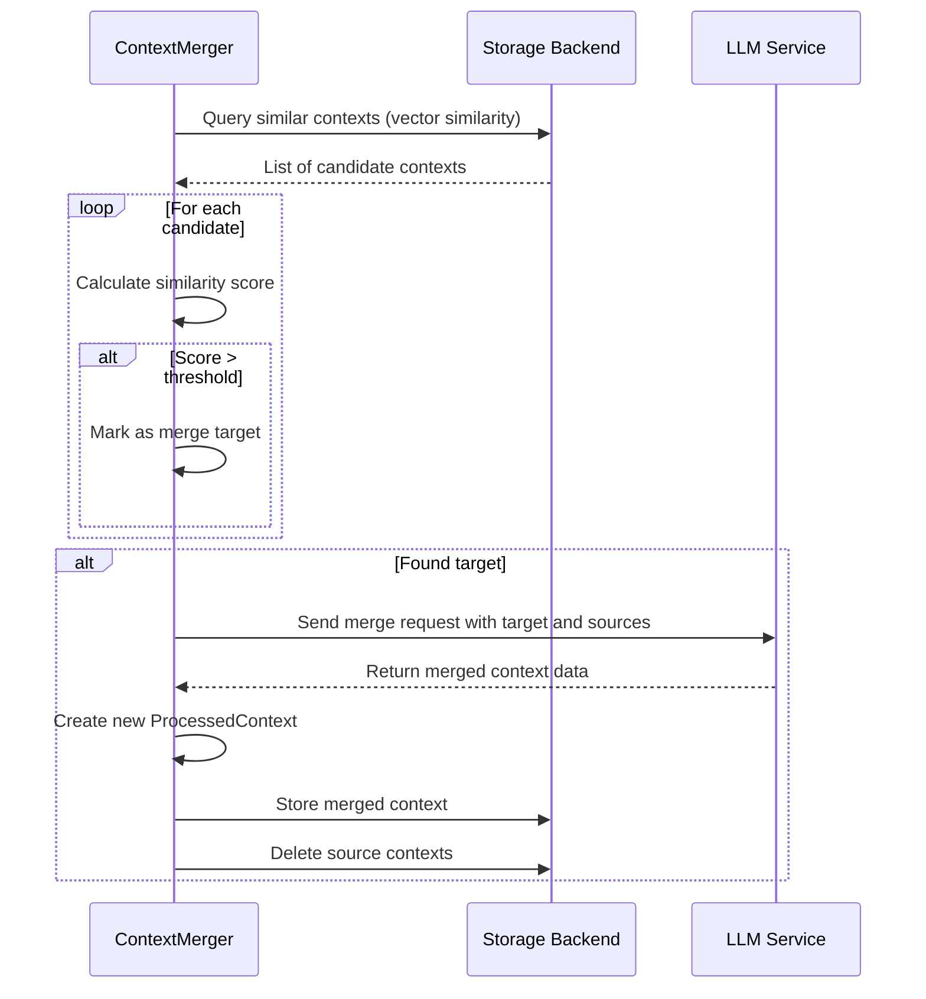
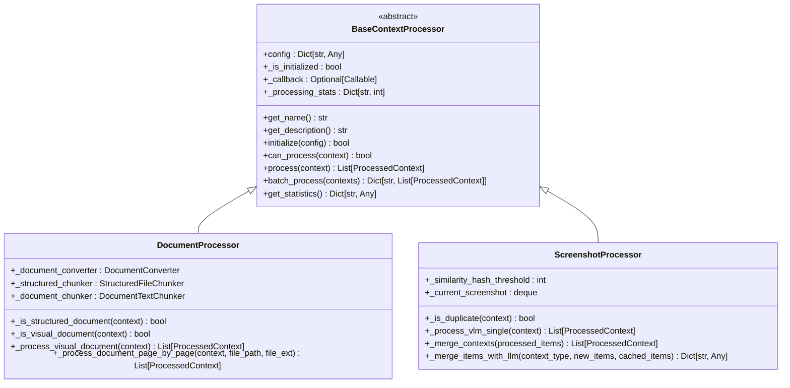
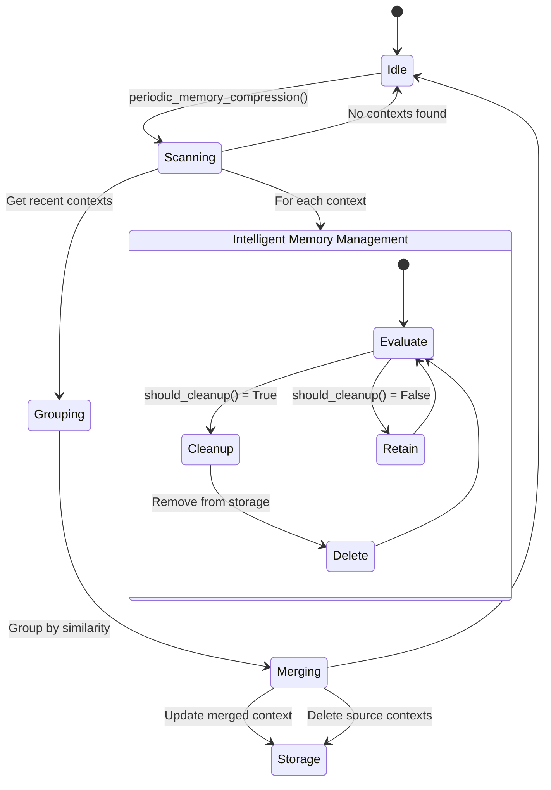

# Processing Pipeline

<cite>
**Referenced Files in This Document**   
- [processor_factory.py](file://opencontext/context_processing/processor/processor_factory.py)
- [chunkers.py](file://opencontext/context_processing/chunker/chunkers.py)
- [document_text_chunker.py](file://opencontext/context_processing/chunker/document_text_chunker.py)
- [context_merger.py](file://opencontext/context_processing/merger/context_merger.py)
- [merge_strategies.py](file://opencontext/context_processing/merger/merge_strategies.py)
- [cross_type_relationships.py](file://opencontext/context_processing/merger/cross_type_relationships.py)
- [base_processor.py](file://opencontext/context_processing/processor/base_processor.py)
- [document_processor.py](file://opencontext/context_processing/processor/document_processor.py)
- [screenshot_processor.py](file://opencontext/context_processing/processor/screenshot_processor.py)
- [context.py](file://opencontext/models/context.py)
</cite>

## Table of Contents
1. [Introduction](#introduction)
2. [Data Flow Overview](#data-flow-overview)
3. [Processor Factory and Creation](#processor-factory-and-creation)
4. [Chunking Strategies](#chunking-strategies)
5. [Context Merging Process](#context-merging-process)
6. [Processor Implementation](#processor-implementation)
7. [Merger Component and Memory Management](#merger-component-and-memory-management)
8. [Performance and Error Handling](#performance-and-error-handling)
9. [Conclusion](#conclusion)

## Introduction
The MineContext backend processing pipeline is responsible for transforming raw context data into structured, AI-processable information. This document details the architecture and operation of this pipeline, focusing on the flow from `RawContextProperties` to `ProcessedContext`. The system employs a modular design with specialized processors for different data types, intelligent chunking strategies for large documents, and a sophisticated merging mechanism to maintain context coherence and reduce redundancy. The pipeline is designed for efficiency, scalability, and robustness, handling various input sources such as screenshots, documents, and web links.

## Data Flow Overview
The processing pipeline begins with `RawContextProperties`, which encapsulates raw, unprocessed data from various sources like screenshots, documents, or user input. This data is then routed to a specific `IContextProcessor` implementation based on its type. The processor analyzes the content, often using external services like Vision Language Models (VLM) for images, to extract structured information. This information is organized into a `ProcessedContext` object, which contains a title, summary, keywords, entities, and a context type. For large documents, the content is first split into smaller, manageable pieces by a `Chunker` before being processed. Finally, a `ContextMerger` component periodically analyzes the processed contexts to identify and merge similar or related entries, maintaining a coherent and non-redundant knowledge base.

**Diagram sources**
- [context.py](file://opencontext/models/context.py#L35-L142)
- [base_processor.py](file://opencontext/context_processing/processor/base_processor.py#L23-L131)
- [processor_factory.py](file://opencontext/context_processing/processor/processor_factory.py#L31-L174)

**Section sources**
- [context.py](file://opencontext/models/context.py#L35-L142)
- [processor_factory.py](file://opencontext/context_processing/processor/processor_factory.py#L31-L174)

## Processor Factory and Creation
The `ProcessorFactory` is a central component that implements the Factory design pattern to create and manage processor instances. It maintains a registry of available processor types, such as `document_processor` and `screenshot_processor`, which are registered at initialization. When a new context needs processing, the factory's `create_processor` method is called with a type name. The factory looks up the corresponding processor class in its registry and instantiates it. This design decouples the processor creation logic from the rest of the system, allowing for easy extension with new processor types without modifying existing code. The factory also provides methods for configuration validation and dependency injection, ensuring processors are properly initialized before use.

**Diagram sources**
- [processor_factory.py](file://opencontext/context_processing/processor/processor_factory.py#L31-L174)
- [processor_interface.py](file://opencontext/interfaces/processor_interface.py#L16-L135)
- [document_processor.py](file://opencontext/context_processing/processor/document_processor.py#L41-L653)
- [screenshot_processor.py](file://opencontext/context_processing/processor/screenshot_processor.py#L47-L590)

**Section sources**
- [processor_factory.py](file://opencontext/context_processing/processor/processor_factory.py#L31-L174)

## Chunking Strategies
The pipeline employs several chunking strategies to handle large documents and structured data efficiently. The `BaseChunker` serves as an abstract base class, defining a common interface for all chunkers. Specific implementations include the `StructuredFileChunker` for CSV, Excel, and JSONL files, which streams data in batches to avoid memory issues. The `FAQChunker` is specialized for FAQ Excel files, treating each Q&A pair as a separate chunk. The most sophisticated is the `DocumentTextChunker`, which uses intelligent, semantic-based splitting. For short documents, it employs a "global semantic chunking" strategy where an LLM analyzes the entire text to determine optimal split points based on paragraphs and sections. For longer documents, it falls back to a paragraph accumulation strategy, using an LLM in batch mode to split accumulated text buffers. This ensures that chunks are meaningful and contextually coherent, rather than being arbitrary character sequences.

**Diagram sources**
- [chunkers.py](file://opencontext/context_processing/chunker/chunkers.py#L46-L354)
- [document_text_chunker.py](file://opencontext/context_processing/chunker/document_text_chunker.py#L25-L349)

**Section sources**
- [chunkers.py](file://opencontext/context_processing/chunker/chunkers.py#L46-L354)
- [document_text_chunker.py](file://opencontext/context_processing/chunker/document_text_chunker.py#L25-L349)

## Context Merging Process
The context merging process is a critical component for maintaining a coherent and non-redundant knowledge base. The `ContextMerger` identifies related `ProcessedContext` objects and combines them into a single, more comprehensive entry. It uses multiple strategies: **Similarity Merge** finds contexts with high vector similarity (above a threshold of 0.85), indicating they contain nearly identical information. **Associative Merge** finds contexts of the same type created within a short time window (e.g., 30 minutes) that share common entities, suggesting they are part of a related sequence of events. The merger can use either a legacy logic or an intelligent strategy system. The intelligent system uses `ContextTypeAwareStrategy` classes (e.g., `ActivityContextStrategy`, `ProfileContextStrategy`) that define type-specific rules for merging, such as time windows for activities or entity overlap for profiles, ensuring the merging logic is contextually appropriate.

**Diagram sources**
- [context_merger.py](file://opencontext/context_processing/merger/context_merger.py#L35-L800)
- [merge_strategies.py](file://opencontext/context_processing/merger/merge_strategies.py#L24-L800)

**Section sources**
- [context_merger.py](file://opencontext/context_processing/merger/context_merger.py#L35-L800)

## Processor Implementation
Individual processors like `DocumentProcessor` and `ScreenshotProcessor` implement the `IContextProcessor` interface to handle specific data types. The `DocumentProcessor` is a unified processor that handles various document formats (PDF, DOCX, images, structured files). It uses a `DocumentConverter` to analyze the document structure, determining which pages contain visual elements (charts, images) that require VLM analysis and which are pure text. It then processes visual pages with a VLM and extracts text from others, combining the results. For structured files, it uses specialized chunkers like `StructuredFileChunker`. The `ScreenshotProcessor` handles screenshot streams, performing real-time deduplication using perceptual hashing (pHash) to avoid processing identical or near-identical images. It then uses a VLM to extract context information from each unique screenshot, creating `ProcessedContext` objects for activities, intents, or states depicted in the image.

**Diagram sources**
- [base_processor.py](file://opencontext/context_processing/processor/base_processor.py#L23-L261)
- [document_processor.py](file://opencontext/context_processing/processor/document_processor.py#L41-L653)
- [screenshot_processor.py](file://opencontext/context_processing/processor/screenshot_processor.py#L47-L590)

**Section sources**
- [document_processor.py](file://opencontext/context_processing/processor/document_processor.py#L41-L653)
- [screenshot_processor.py](file://opencontext/context_processing/processor/screenshot_processor.py#L47-L590)

## Merger Component and Memory Management
The `ContextMerger` component plays a vital role in periodic memory compression and maintaining context coherence. Its `periodic_memory_compression` method runs at regular intervals, scanning for recent, unmerged contexts. It groups these contexts by their semantic similarity using a greedy algorithm and then merges the contexts within each group into a single, updated entry. This process reduces the total number of stored contexts, improving query performance and storage efficiency. Beyond simple merging, the merger implements intelligent memory management. It uses a "forgetting curve" model where the likelihood of a context being cleaned up increases with its age and decreases with its importance and access frequency. The `CrossTypeRelationshipManager` further enhances coherence by identifying opportunities for cross-type conversions, such as transforming a series of related activities into a personal profile update or converting a completed intent into an activity record, simulating the way human memory integrates different types of information.

**Diagram sources**
- [context_merger.py](file://opencontext/context_processing/merger/context_merger.py#L465-L687)
- [cross_type_relationships.py](file://opencontext/context_processing/merger/cross_type_relationships.py#L35-L430)

**Section sources**
- [context_merger.py](file://opencontext/context_processing/merger/context_merger.py#L465-L687)
- [cross_type_relationships.py](file://opencontext/context_processing/merger/cross_type_relationships.py#L35-L430)

## Performance and Error Handling
The processing pipeline is designed with performance and robustness in mind. It employs asynchronous and concurrent processing, especially for VLM calls, to maximize throughput. The `ScreenshotProcessor`, for instance, uses background threads and asyncio to process multiple screenshots in parallel. For large documents, the `DocumentTextChunker` uses batched LLM calls to split text buffers concurrently. Error handling is comprehensive and non-disruptive. Each processor and component logs errors using a structured logger, and critical operations are wrapped in try-except blocks to prevent a single failure from halting the entire pipeline. Statistics are meticulously tracked (e.g., processed count, error count) to monitor system health. The system also includes fallback mechanisms; for example, if an LLM call fails during chunking, the `DocumentTextChunker` falls back to mechanical splitting based on sentence boundaries. Configuration validation ensures processors are initialized correctly, and the factory pattern allows for graceful degradation if a specific processor type is not available.

**Section sources**
- [base_processor.py](file://opencontext/context_processing/processor/base_processor.py#L88-L90)
- [document_processor.py](file://opencontext/context_processing/processor/document_processor.py#L242-L245)
- [screenshot_processor.py](file://opencontext/context_processing/processor/screenshot_processor.py#L207-L212)
- [document_text_chunker.py](file://opencontext/context_processing/chunker/document_text_chunker.py#L219-L221)

## Conclusion
The MineContext backend processing pipeline is a sophisticated system that transforms raw, diverse data into a structured, coherent knowledge base. Its modular architecture, centered around the `ProcessorFactory`, allows for flexible and extensible processing of various data types. Intelligent chunking strategies ensure that large documents are broken down into meaningful pieces for AI processing, while the `ContextMerger` and its associated strategies maintain context coherence through periodic memory compression and intelligent merging. The implementation of processors like `DocumentProcessor` and `ScreenshotProcessor` demonstrates a deep understanding of the specific challenges of their respective domains, employing techniques like VLM analysis and perceptual hashing. The system's robust error handling and performance optimizations ensure it can operate reliably in a production environment, making it a powerful foundation for an AI-driven context-aware application.