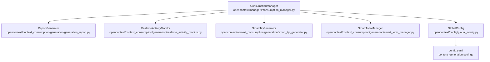
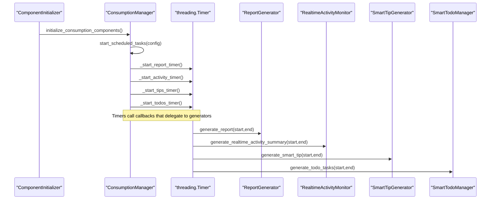
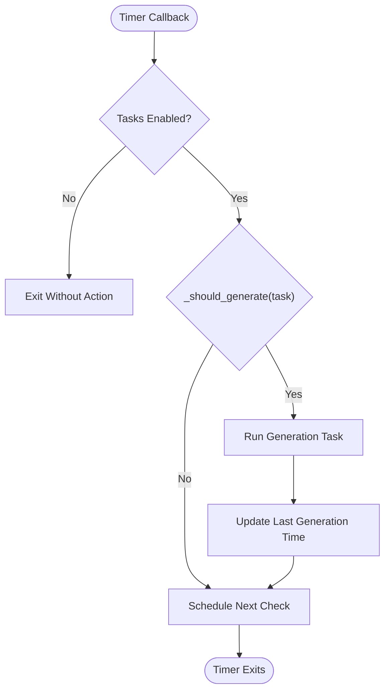
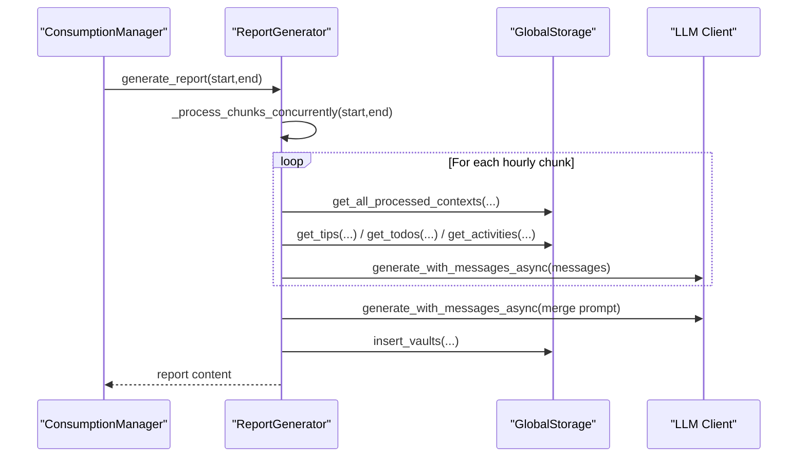
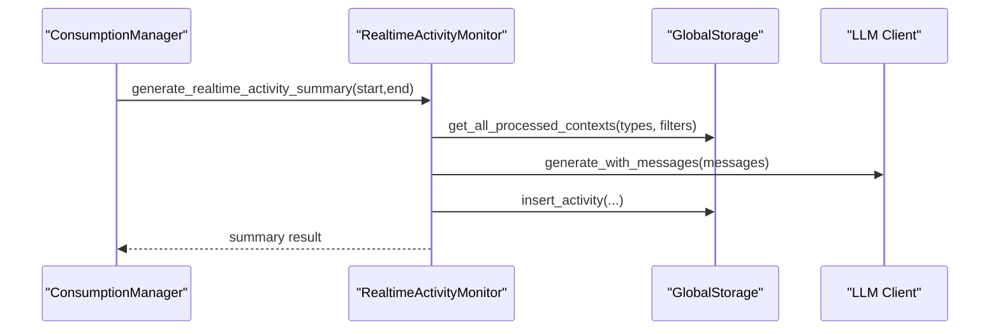
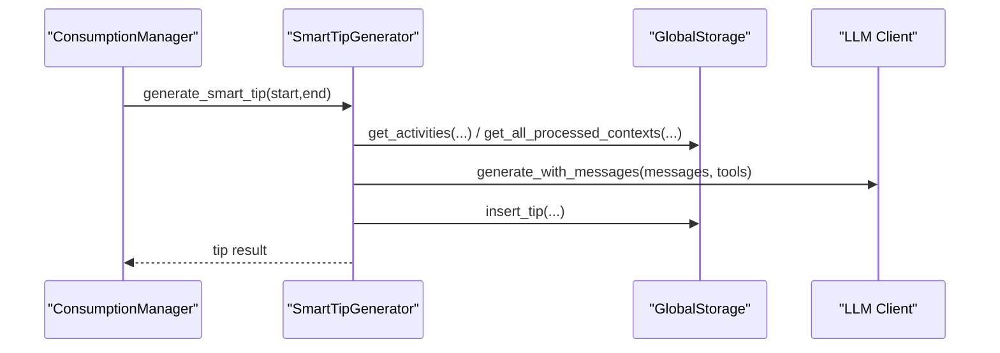
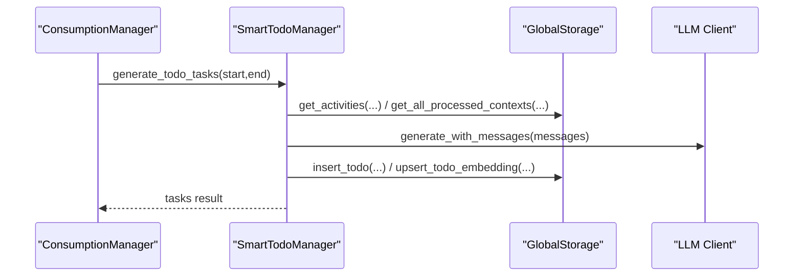
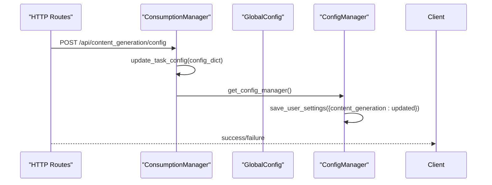
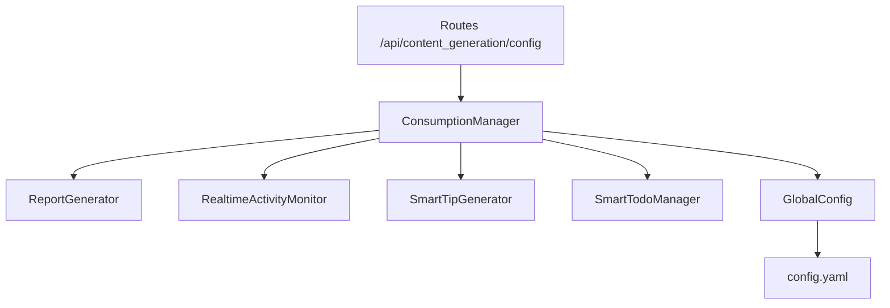

# Consumption Manager

<cite>
**Referenced Files in This Document**
- [consumption_manager.py](file://opencontext/managers/consumption_manager.py)
- [smart_tip_generator.py](file://opencontext/context_consumption/generation/smart_tip_generator.py)
- [smart_todo_manager.py](file://opencontext/context_consumption/generation/smart_todo_manager.py)
- [generation_report.py](file://opencontext/context_consumption/generation/generation_report.py)
- [realtime_activity_monitor.py](file://opencontext/context_consumption/generation/realtime_activity_monitor.py)
- [global_config.py](file://opencontext/config/global_config.py)
- [config.yaml](file://config/config.yaml)
- [component_initializer.py](file://opencontext/server/component_initializer.py)
- [content_generation.py](file://opencontext/server/routes/content_generation.py)
- [debug_helper.py](file://opencontext/context_consumption/generation/debug_helper.py)
</cite>

## Table of Contents
1. [Introduction](#introduction)
2. [Project Structure](#project-structure)
3. [Core Components](#core-components)
4. [Architecture Overview](#architecture-overview)
5. [Detailed Component Analysis](#detailed-component-analysis)
6. [Dependency Analysis](#dependency-analysis)
7. [Performance Considerations](#performance-considerations)
8. [Troubleshooting Guide](#troubleshooting-guide)
9. [Conclusion](#conclusion)
10. [Appendices](#appendices)

## Introduction
This document explains the ConsumptionManager in MineContext, focusing on how it orchestrates AI-powered insights through scheduled background tasks. It covers:
- How ConsumptionManager uses threading.Timer to periodically trigger ReportGenerator, SmartTipGenerator, and SmartTodoManager based on configurable intervals.
- The _should_generate() guard to prevent redundant executions.
- The _schedule_next_check() mechanism for efficient polling.
- Dynamic configuration updates via update_task_config() and persistence to user settings.
- Integration with GlobalConfig for initialization and shutdown behavior that cancels all active timers.

## Project Structure
The ConsumptionManager resides in the managers layer and coordinates three generation components:
- ReportGenerator: produces daily summaries by aggregating hourly chunks.
- SmartTipGenerator: creates personalized tips from recent activity patterns and context.
- SmartTodoManager: extracts actionable tasks from activity insights and context.
- RealtimeActivityMonitor: snapshots recent activity and emits insights used by other generators.

**Diagram sources**
- [consumption_manager.py](file://opencontext/managers/consumption_manager.py#L31-L120)
- [generation_report.py](file://opencontext/context_consumption/generation/generation_report.py#L26-L44)
- [realtime_activity_monitor.py](file://opencontext/context_consumption/generation/realtime_activity_monitor.py#L54-L120)
- [smart_tip_generator.py](file://opencontext/context_consumption/generation/smart_tip_generator.py#L40-L88)
- [smart_todo_manager.py](file://opencontext/context_consumption/generation/smart_todo_manager.py#L46-L133)
- [global_config.py](file://opencontext/config/global_config.py#L23-L65)
- [config.yaml](file://config/config.yaml#L216-L239)

**Section sources**
- [consumption_manager.py](file://opencontext/managers/consumption_manager.py#L31-L120)
- [config.yaml](file://config/config.yaml#L216-L239)

## Core Components
- ConsumptionManager: central coordinator that loads content_generation settings, starts/stops timers, and schedules periodic tasks.
- ReportGenerator: asynchronous daily report generator that chunks time windows and merges summaries.
- RealtimeActivityMonitor: generates concise activity summaries and metadata for downstream consumers.
- SmartTipGenerator: synthesizes tips from recent activity patterns and context.
- SmartTodoManager: extracts and deduplicates tasks from activity insights and context.

Key responsibilities:
- Load configuration from GlobalConfig and apply defaults.
- Start/stop scheduled tasks with threading.Timer.
- Enforce interval-based throttling via _should_generate().
- Efficient polling via _schedule_next_check() with calculated check intervals.
- Dynamic runtime updates via update_task_config() and persistence to user settings.

**Section sources**
- [consumption_manager.py](file://opencontext/managers/consumption_manager.py#L31-L120)
- [generation_report.py](file://opencontext/context_consumption/generation/generation_report.py#L26-L74)
- [realtime_activity_monitor.py](file://opencontext/context_consumption/generation/realtime_activity_monitor.py#L54-L120)
- [smart_tip_generator.py](file://opencontext/context_consumption/generation/smart_tip_generator.py#L40-L88)
- [smart_todo_manager.py](file://opencontext/context_consumption/generation/smart_todo_manager.py#L46-L133)

## Architecture Overview
ConsumptionManager initializes components and registers timers for:
- Daily report generation (based on a configured time-of-day).
- Real-time activity summaries (periodic snapshots).
- Smart tips generation (periodic).
- Smart todos generation (periodic).

**Diagram sources**
- [component_initializer.py](file://opencontext/server/component_initializer.py#L199-L207)
- [consumption_manager.py](file://opencontext/managers/consumption_manager.py#L132-L170)
- [consumption_manager.py](file://opencontext/managers/consumption_manager.py#L200-L241)
- [consumption_manager.py](file://opencontext/managers/consumption_manager.py#L243-L356)
- [generation_report.py](file://opencontext/context_consumption/generation/generation_report.py#L34-L74)
- [realtime_activity_monitor.py](file://opencontext/context_consumption/generation/realtime_activity_monitor.py#L60-L120)
- [smart_tip_generator.py](file://opencontext/context_consumption/generation/smart_tip_generator.py#L46-L88)
- [smart_todo_manager.py](file://opencontext/context_consumption/generation/smart_todo_manager.py#L57-L133)

## Detailed Component Analysis

### ConsumptionManager Responsibilities and Lifecycle
- Initialization:
  - Loads content_generation settings from GlobalConfig and applies defaults.
  - Creates instances of ReportGenerator, RealtimeActivityMonitor, SmartTipGenerator, and SmartTodoManager.
- Scheduled Tasks:
  - start_scheduled_tasks() starts timers for report, activity, tips, and todos.
  - stop_scheduled_tasks() cancels all timers and clears internal state.
- Interval Management:
  - _calculate_check_interval() computes a safe polling cadence (quarter of generation interval with limits).
  - _schedule_next_check() schedules the next callback only if tasks are enabled.
  - _should_generate() enforces minimum interval enforcement to avoid redundant runs.
- Daily Report:
  - _calculate_seconds_until_daily_time() computes delay until configured time-of-day.
  - _get_last_report_time() reads last daily report creation time from storage to avoid duplicates.
  - _start_report_timer() checks and triggers daily report generation at the configured time.
- Dynamic Updates:
  - update_task_config() supports partial updates to enabled flags and intervals.
  - _update_interval_task() and _update_report_task() handle changes and restart timers when needed.
  - _restart_task_timer() safely cancels and re-spawns a timer for a given task.
- Shutdown:
  - shutdown() calls stop_scheduled_tasks() to cancel all timers.

**Diagram sources**
- [consumption_manager.py](file://opencontext/managers/consumption_manager.py#L112-L127)
- [consumption_manager.py](file://opencontext/managers/consumption_manager.py#L358-L371)
- [consumption_manager.py](file://opencontext/managers/consumption_manager.py#L243-L356)

**Section sources**
- [consumption_manager.py](file://opencontext/managers/consumption_manager.py#L31-L120)
- [consumption_manager.py](file://opencontext/managers/consumption_manager.py#L128-L170)
- [consumption_manager.py](file://opencontext/managers/consumption_manager.py#L171-L241)
- [consumption_manager.py](file://opencontext/managers/consumption_manager.py#L243-L356)
- [consumption_manager.py](file://opencontext/managers/consumption_manager.py#L358-L512)

### ReportGenerator (Daily Summaries)
- Asynchronous processing:
  - generate_report() orchestrates concurrent hourly chunk processing and merges results.
  - _process_chunks_concurrently() splits the time window into hourly segments and processes them concurrently with a semaphore.
  - _process_single_chunk_async() collects contexts, tips, todos, and activities for a segment and builds a prompt.
  - _generate_report_with_llm() merges hourly summaries into a final report.
- Persistence and events:
  - Stores the report in vaults and publishes a daily summary event.

**Diagram sources**
- [generation_report.py](file://opencontext/context_consumption/generation/generation_report.py#L34-L74)
- [generation_report.py](file://opencontext/context_consumption/generation/generation_report.py#L76-L110)
- [generation_report.py](file://opencontext/context_consumption/generation/generation_report.py#L111-L205)
- [generation_report.py](file://opencontext/context_consumption/generation/generation_report.py#L206-L265)

**Section sources**
- [generation_report.py](file://opencontext/context_consumption/generation/generation_report.py#L26-L265)

### RealtimeActivityMonitor (Activity Summaries)
- Collects recent contexts and generates a concise summary with category distribution and extracted insights.
- Persists activity records with metadata and emits an activity-generated event.
- Resets recording stats after successful generation.

**Diagram sources**
- [realtime_activity_monitor.py](file://opencontext/context_consumption/generation/realtime_activity_monitor.py#L60-L120)
- [realtime_activity_monitor.py](file://opencontext/context_consumption/generation/realtime_activity_monitor.py#L153-L205)

**Section sources**
- [realtime_activity_monitor.py](file://opencontext/context_consumption/generation/realtime_activity_monitor.py#L54-L120)
- [realtime_activity_monitor.py](file://opencontext/context_consumption/generation/realtime_activity_monitor.py#L153-L205)

### SmartTipGenerator (Smart Tips)
- Builds a comprehensive prompt using recent contexts, activity patterns, and recent tips to avoid repetition.
- Calls the LLM with tools to gather background information.
- Stores the generated tip and publishes a tip-generated event.

**Diagram sources**
- [smart_tip_generator.py](file://opencontext/context_consumption/generation/smart_tip_generator.py#L46-L88)
- [smart_tip_generator.py](file://opencontext/context_consumption/generation/smart_tip_generator.py#L227-L304)

**Section sources**
- [smart_tip_generator.py](file://opencontext/context_consumption/generation/smart_tip_generator.py#L40-L88)
- [smart_tip_generator.py](file://opencontext/context_consumption/generation/smart_tip_generator.py#L227-L304)

### SmartTodoManager (Smart Todos)
- Gathers activity insights and relevant context, then extracts tasks via LLM.
- Applies post-processing to normalize deadlines and participant data.
- Deduplicates tasks using vector similarity against historical and batch tasks.
- Stores tasks and embeddings, publishing a todo-generated event.

**Diagram sources**
- [smart_todo_manager.py](file://opencontext/context_consumption/generation/smart_todo_manager.py#L57-L133)
- [smart_todo_manager.py](file://opencontext/context_consumption/generation/smart_todo_manager.py#L223-L296)
- [smart_todo_manager.py](file://opencontext/context_consumption/generation/smart_todo_manager.py#L370-L450)

**Section sources**
- [smart_todo_manager.py](file://opencontext/context_consumption/generation/smart_todo_manager.py#L46-L133)
- [smart_todo_manager.py](file://opencontext/context_consumption/generation/smart_todo_manager.py#L223-L296)
- [smart_todo_manager.py](file://opencontext/context_consumption/generation/smart_todo_manager.py#L370-L450)

### Configuration and Runtime Updates
- Initialization:
  - ConsumptionManager reads content_generation settings from GlobalConfig and sets defaults for intervals and enabled flags.
- Runtime updates:
  - update_task_config() accepts partial updates and restarts affected timers when necessary.
  - Routes expose GET/POST endpoints to query and update content generation configuration, persisting changes to user settings.

**Diagram sources**
- [content_generation.py](file://opencontext/server/routes/content_generation.py#L88-L144)
- [consumption_manager.py](file://opencontext/managers/consumption_manager.py#L402-L482)
- [global_config.py](file://opencontext/config/global_config.py#L236-L262)

**Section sources**
- [consumption_manager.py](file://opencontext/managers/consumption_manager.py#L31-L120)
- [consumption_manager.py](file://opencontext/managers/consumption_manager.py#L402-L482)
- [content_generation.py](file://opencontext/server/routes/content_generation.py#L69-L144)
- [global_config.py](file://opencontext/config/global_config.py#L236-L262)

## Dependency Analysis
- Internal dependencies:
  - ConsumptionManager depends on ReportGenerator, RealtimeActivityMonitor, SmartTipGenerator, SmartTodoManager, GlobalConfig, and storage/event systems.
- External dependencies:
  - LLM clients for generation.
  - Storage backends for persistence.
  - Threading for scheduling.

**Diagram sources**
- [consumption_manager.py](file://opencontext/managers/consumption_manager.py#L31-L120)
- [global_config.py](file://opencontext/config/global_config.py#L23-L65)
- [config.yaml](file://config/config.yaml#L216-L239)
- [content_generation.py](file://opencontext/server/routes/content_generation.py#L69-L144)

**Section sources**
- [consumption_manager.py](file://opencontext/managers/consumption_manager.py#L31-L120)
- [global_config.py](file://opencontext/config/global_config.py#L23-L65)
- [config.yaml](file://config/config.yaml#L216-L239)
- [content_generation.py](file://opencontext/server/routes/content_generation.py#L69-L144)

## Performance Considerations
- Concurrency:
  - ReportGenerator processes hourly chunks concurrently with a semaphore to bound resource usage.
- Polling cadence:
  - _calculate_check_interval() caps polling frequency to a quarter of the generation interval with per-task limits to reduce overhead.
- Deduplication:
  - SmartTodoManager performs vector-based deduplication to minimize redundant tasks.
- Resource-intensive tasks:
  - Consider adjusting intervals and concurrency limits in content_generation settings to balance responsiveness and resource consumption.
- Debugging overhead:
  - DebugHelper writes detailed logs only when enabled; disable content_generation.debug for production to reduce IO overhead.

[No sources needed since this section provides general guidance]

## Troubleshooting Guide
Common issues and mitigations:
- Timer drift:
  - ConsumptionManager uses fixed intervals and daily time-of-day calculations; drift is minimal because timers are restarted after each run. If drift accumulates, consider using monotonic time comparisons and rescheduling based on elapsed wall-clock time.
- Configuration loading failures:
  - GlobalConfig falls back to defaults if config files are missing; verify config.yaml paths and permissions. Ensure content_generation settings are present and valid.
- Race conditions during config updates:
  - ConsumptionManager uses a config lock to protect updates. Avoid simultaneous updates from multiple threads; the provided API serializes updates.
- Timer cancellation during shutdown:
  - shutdown() cancels all timers; ensure no pending callbacks are running before process exit.
- LLM/API errors:
  - Generators catch exceptions and log them; verify LLM credentials and network connectivity.
- Storage errors:
  - Generators rely on storage backends; ensure database/vector stores are reachable and initialized.

**Section sources**
- [consumption_manager.py](file://opencontext/managers/consumption_manager.py#L101-L111)
- [consumption_manager.py](file://opencontext/managers/consumption_manager.py#L156-L169)
- [global_config.py](file://opencontext/config/global_config.py#L73-L90)
- [smart_tip_generator.py](file://opencontext/context_consumption/generation/smart_tip_generator.py#L85-L88)
- [smart_todo_manager.py](file://opencontext/context_consumption/generation/smart_todo_manager.py#L130-L133)
- [generation_report.py](file://opencontext/context_consumption/generation/generation_report.py#L71-L74)

## Conclusion
ConsumptionManager provides a robust, configurable scheduler for MineContext’s AI-driven insights. By leveraging threading.Timer, interval guards, and dynamic configuration updates, it ensures timely, non-redundant generation of daily reports, activity summaries, smart tips, and todos. Its design cleanly separates concerns across components and integrates with GlobalConfig and storage/event systems for persistence and observability.

[No sources needed since this section summarizes without analyzing specific files]

## Appendices

### Configuration Reference
- content_generation settings in config.yaml:
  - activity.enabled, activity.interval
  - tips.enabled, tips.interval
  - todos.enabled, todos.interval
  - report.enabled, report.time

**Section sources**
- [config.yaml](file://config/config.yaml#L216-L239)

### Example: Timer Setup and Daily Report
- Daily report timer setup:
  - _start_report_timer() calculates delay until configured time-of-day and schedules periodic checks.
- Interval-based tasks:
  - _start_activity_timer(), _start_tips_timer(), _start_todos_timer() compute check intervals and schedule callbacks.

**Section sources**
- [consumption_manager.py](file://opencontext/managers/consumption_manager.py#L171-L241)
- [consumption_manager.py](file://opencontext/managers/consumption_manager.py#L243-L356)

### Integration Notes
- Initialization:
  - ComponentInitializer creates ConsumptionManager and starts scheduled tasks using content_generation config.
- API:
  - Routes expose configuration endpoints to query and update content generation settings, persisting changes to user settings.

**Section sources**
- [component_initializer.py](file://opencontext/server/component_initializer.py#L199-L207)
- [content_generation.py](file://opencontext/server/routes/content_generation.py#L69-L144)