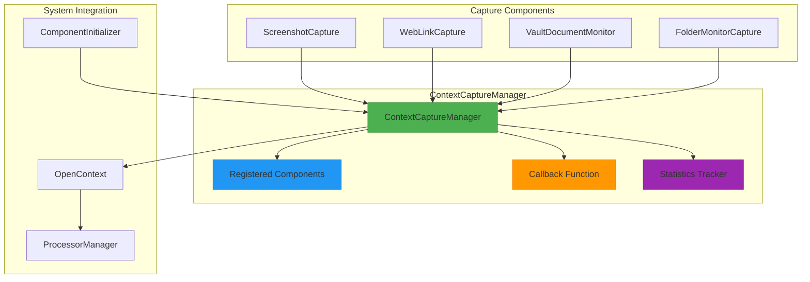
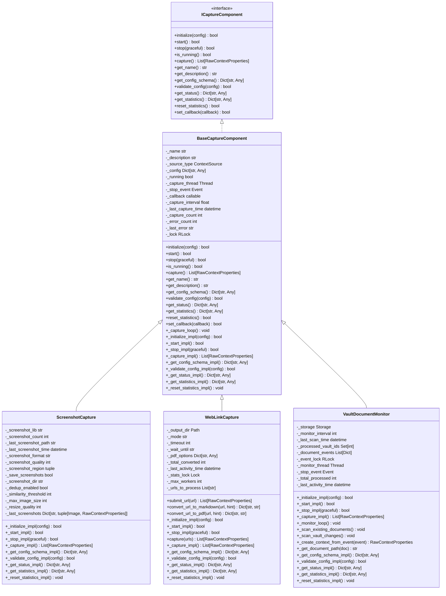
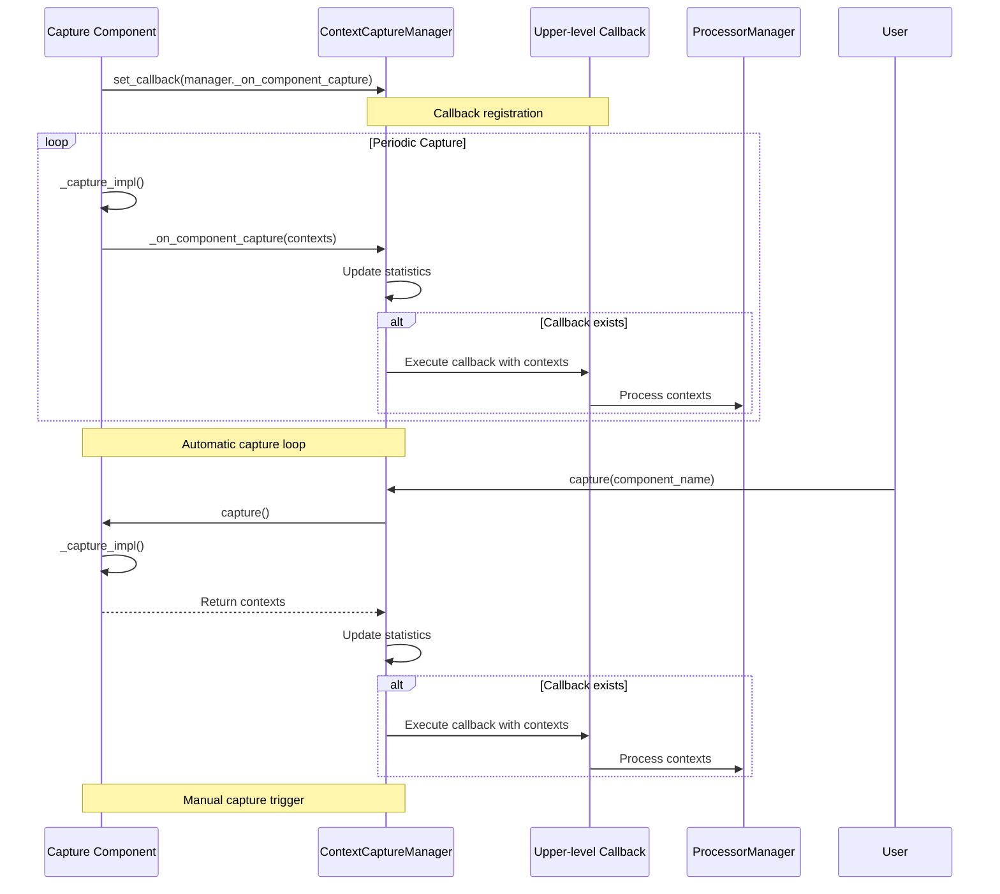
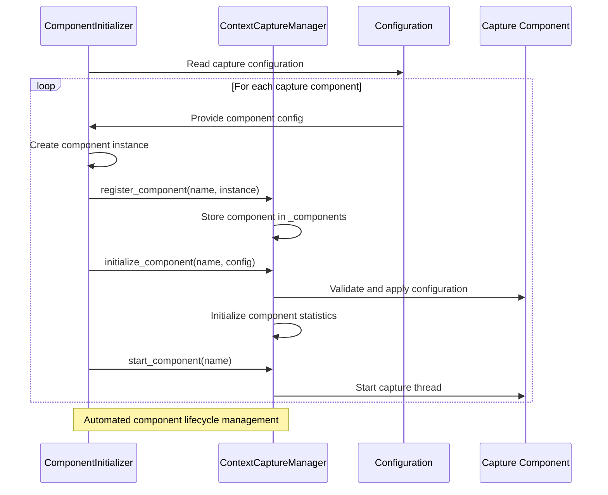

# Context Capture Manager

<cite>
**Referenced Files in This Document**   
- [capture_manager.py](file://opencontext/managers/capture_manager.py)
- [capture_interface.py](file://opencontext/interfaces/capture_interface.py)
- [base.py](file://opencontext/context_capture/base.py)
- [screenshot.py](file://opencontext/context_capture/screenshot.py)
- [web_link_capture.py](file://opencontext/context_capture/web_link_capture.py)
- [vault_document_monitor.py](file://opencontext/context_capture/vault_document_monitor.py)
- [component_initializer.py](file://opencontext/server/component_initializer.py)
- [opencontext.py](file://opencontext/server/opencontext.py)
- [context.py](file://opencontext/models/context.py)
</cite>

## Table of Contents
1. [Introduction](#introduction)
2. [Architecture Overview](#architecture-overview)
3. [Component Registration and Lifecycle Management](#component-registration-and-lifecycle-management)
4. [Capture Component Interface Standardization](#capture-component-interface-standardization)
5. [Data Flow and Callback Chain](#data-flow-and-callback-chain)
6. [Statistics and Health Monitoring](#statistics-and-health-monitoring)
7. [Thread-Safe Operation and Concurrency](#thread-safe-operation-and-concurrency)
8. [Manual Capture Triggers](#manual-capture-triggers)
9. [Graceful Shutdown Procedure](#graceful-shutdown-procedure)
10. [Integration with Component Initializer](#integration-with-component-initializer)
11. [Common Issues and Troubleshooting](#common-issues-and-troubleshooting)
12. [Performance Considerations](#performance-considerations)

## Introduction
The ContextCaptureManager is a central component in the MineContext system responsible for managing the lifecycle of various context capture components. It provides a unified interface for registering, initializing, starting, stopping, and monitoring capture components such as screenshot, document, and web link capture. The manager implements a thread-safe design to coordinate multiple capture sources while maintaining loose coupling between components through a standardized interface. This architectural documentation details the manager's role in the system, its internal mechanisms for data flow and statistics tracking, and its integration patterns with other system components.

## Architecture Overview

**Diagram sources**
- [capture_manager.py](file://opencontext/managers/capture_manager.py#L23-L391)
- [capture_interface.py](file://opencontext/interfaces/capture_interface.py#L18-L153)

## Component Registration and Lifecycle Management
The ContextCaptureManager provides a comprehensive lifecycle management system for capture components through a series of registration and control methods. Components are registered using the `register_component()` method, which stores component instances in a dictionary with their names as keys. Each registered component is automatically initialized with a statistics tracking structure that monitors captures, errors, and timing information.

The manager supports both individual and bulk lifecycle operations. The `start_component()` and `stop_component()` methods control individual components, while `start_all_components()` and `stop_all_components()` provide batch operations. The manager maintains a set of running components to prevent duplicate startups and ensure proper state management. When a component is stopped, it is removed from the running set, and its internal capture thread (if present) is terminated gracefully.

Component initialization follows a two-step process: registration followed by configuration-based initialization through `initialize_component()`. This separation allows components to be registered without immediate configuration, providing flexibility in system setup. The initialization process validates component-specific configuration against a schema before applying settings, ensuring configuration integrity.

**Section sources**
- [capture_manager.py](file://opencontext/managers/capture_manager.py#L51-L134)
- [capture_manager.py](file://opencontext/managers/capture_manager.py#L135-L207)
- [capture_manager.py](file://opencontext/managers/capture_manager.py#L208-L233)

## Capture Component Interface Standardization
The ContextCaptureManager enforces component standardization through the ICaptureComponent interface, which defines a consistent contract for all capture components. This interface mandates implementation of essential methods including `initialize()`, `start()`, `stop()`, `capture()`, and configuration validation methods. The interface also requires components to provide metadata such as name, description, and configuration schema, enabling dynamic discovery and configuration.

All concrete capture components inherit from the BaseCaptureComponent class, which provides common functionality and thread management. The base class implements a capture loop that periodically executes the `_capture_impl()` method when auto-capture is enabled, abstracting thread management from individual components. Components must implement abstract methods like `_initialize_impl()`, `_start_impl()`, and `_capture_impl()` to provide component-specific behavior while benefiting from the standardized infrastructure.

The interface design supports configuration validation through `get_config_schema()` and `validate_config()` methods, allowing the manager to validate component configurations before initialization. This ensures that components receive valid configuration parameters and provides a mechanism for configuration introspection and documentation.

**Diagram sources**
- [capture_interface.py](file://opencontext/interfaces/capture_interface.py#L18-L153)
- [base.py](file://opencontext/context_capture/base.py#L26-L515)
- [screenshot.py](file://opencontext/context_capture/screenshot.py#L28-L508)
- [web_link_capture.py](file://opencontext/context_capture/web_link_capture.py#L24-L351)
- [vault_document_monitor.py](file://opencontext/context_capture/vault_document_monitor.py#L26-L389)

## Data Flow and Callback Chain
The ContextCaptureManager implements a publish-subscribe pattern for data flow, routing captured RawContextProperties through a callback chain to downstream processors. When a component captures data, it invokes the manager's `_on_component_capture()` method through the registered callback function. This method serves as the central data processing hub, responsible for updating statistics and forwarding data to the upper-level callback.

The callback chain begins with component-specific capture operations that generate RawContextProperties objects containing context data, metadata, and source information. These objects are passed through the manager's callback mechanism to the OpenContext system, where they are processed by the ContextProcessorManager. The manager ensures that all captured data is properly attributed to its source component and timestamped for accurate tracking.

The data flow is designed to handle both automatic and manual capture scenarios. For automatic captures, components use their internal capture loops to periodically invoke the capture process. For manual captures, the manager provides direct methods like `capture()` and `capture_all()` that bypass the automatic loop and trigger immediate capture operations. In both cases, the captured data follows the same callback chain to ensure consistent processing.

**Diagram sources**
- [capture_manager.py](file://opencontext/managers/capture_manager.py#L273-L311)
- [capture_manager.py](file://opencontext/managers/capture_manager.py#L312-L355)
- [opencontext.py](file://opencontext/server/opencontext.py#L103-L117)

## Statistics and Health Monitoring
The ContextCaptureManager maintains comprehensive statistics for monitoring component health and system performance. The statistics structure tracks global metrics such as total captures, total contexts captured, last capture time, and error counts, as well as component-specific statistics including individual capture counts, contexts captured, and last capture times.

Each component has its own statistics entry in the manager's statistics dictionary, allowing for granular monitoring of individual component performance. The manager updates these statistics atomically during the `_on_component_capture()` method, ensuring thread-safe updates even when multiple components are capturing simultaneously. Component-specific statistics are updated when captures are successful, while error counts are incremented when capture operations fail.

The statistics system supports periodic monitoring and health checks through the `get_statistics()` method, which returns a copy of the current statistics. This enables external systems to monitor the capture manager's health without interfering with its operation. The manager also provides a `reset_statistics()` method to clear all statistics, which can be useful for performance testing or after system reconfiguration.

**Section sources**
- [capture_manager.py](file://opencontext/managers/capture_manager.py#L42-L49)
- [capture_manager.py](file://opencontext/managers/capture_manager.py#L290-L299)
- [capture_manager.py](file://opencontext/managers/capture_manager.py#L357-L364)
- [capture_manager.py](file://opencontext/managers/capture_manager.py#L377-L390)

## Thread-Safe Operation and Concurrency
The ContextCaptureManager is designed with thread safety as a core principle, using Python's threading module to coordinate concurrent operations. The manager employs a combination of locks, thread-safe data structures, and atomic operations to ensure safe access to shared resources. Component registration, lifecycle management, and statistics updates are all protected by appropriate synchronization mechanisms.

The manager coordinates multiple concurrent capture threads, each managed by individual components. The BaseCaptureComponent class uses a threading.RLock to protect its internal state, allowing reentrant access within the same thread while preventing race conditions across threads. The capture loop runs in a dedicated daemon thread, ensuring that capture operations do not block the main application thread.

For bulk operations like `start_all_components()` and `stop_all_components()`, the manager iterates through components safely by creating copies of component lists before iteration. This prevents issues that could arise from modifying collections during iteration. The manager also handles thread joining with timeouts during shutdown, ensuring that components have a reasonable amount of time to stop gracefully while preventing indefinite blocking.

**Section sources**
- [capture_manager.py](file://opencontext/managers/capture_manager.py#L208-L233)
- [capture_manager.py](file://opencontext/managers/capture_manager.py#L348-L354)
- [base.py](file://opencontext/context_capture/base.py#L48-L55)
- [base.py](file://opencontext/context_capture/base.py#L101-L124)

## Manual Capture Triggers
The ContextCaptureManager provides two methods for manual capture triggers: `capture()` for individual components and `capture_all()` for all running components. The `capture()` method allows external systems to request an immediate capture from a specific component, bypassing the component's automatic capture interval. This is useful for on-demand captures, such as when a user manually triggers a screenshot.

The `capture_all()` method invokes the `capture()` method on all currently running components, collecting their captured data into a dictionary mapping component names to their captured contexts. This method creates a copy of the running components set before iteration to ensure thread safety during the operation. The results from each component are collected and returned as a comprehensive capture from all active sources.

Both methods include comprehensive error handling, catching exceptions during capture operations and updating statistics accordingly. Failed captures increment the manager's error counter and the specific component's error count, while successful captures update the relevant statistics. The captured data is still passed through the callback chain even for manual captures, ensuring consistent processing regardless of capture trigger method.

**Section sources**
- [capture_manager.py](file://opencontext/managers/capture_manager.py#L312-L338)
- [capture_manager.py](file://opencontext/managers/capture_manager.py#L340-L355)

## Graceful Shutdown Procedure
The ContextCaptureManager implements a graceful shutdown procedure through its `shutdown()` method, which coordinates the orderly termination of all running components. The shutdown process begins by logging the shutdown initiation and then calls `stop_all_components()` with the graceful parameter, allowing components to complete their current capture operations before terminating.

During shutdown, each component's `stop()` method is called, which in turn invokes the component's `_stop_impl()` method and terminates any internal capture threads. Components have the opportunity to perform cleanup operations, such as submitting pending data or closing resources, before shutting down. The BaseCaptureComponent class handles thread joining with a timeout, ensuring that components do not hang indefinitely during shutdown.

The manager maintains proper state management during shutdown, removing components from the running set only after they have successfully stopped. If a component fails to stop, the manager logs the error but continues with the shutdown process to prevent a single faulty component from blocking system termination. After all components have been stopped, the manager logs the completion of shutdown.

**Section sources**
- [capture_manager.py](file://opencontext/managers/capture_manager.py#L366-L376)
- [base.py](file://opencontext/context_capture/base.py#L130-L164)
- [base.py](file://opencontext/context_capture/base.py#L408-L429)

## Integration with Component Initializer
The ContextCaptureManager integrates with the ComponentInitializer class to automate the registration and initialization of capture components based on configuration. The ComponentInitializer reads configuration from the system's config.yaml file and uses the CAPTURE_COMPONENTS mapping to instantiate and register components. This decouples component management from the main application logic, allowing for flexible configuration and easy addition of new capture components.

The initialization process follows a standardized pattern: the ComponentInitializer iterates through capture configurations, creates component instances, registers them with the ContextCaptureManager, and initializes them with their specific configuration. This process includes error handling and logging, ensuring that initialization failures are properly reported. The initializer also supports dynamic component loading, allowing components to be specified by module and class name in the configuration.

The integration between these components enables a plugin-like architecture where new capture sources can be added by simply implementing the ICaptureComponent interface and updating the configuration, without modifying the core manager or initializer code. This promotes extensibility and maintainability in the system architecture.

**Diagram sources**
- [component_initializer.py](file://opencontext/server/component_initializer.py#L71-L96)
- [component_initializer.py](file://opencontext/server/component_initializer.py#L98-L117)
- [capture_manager.py](file://opencontext/managers/capture_manager.py#L51-L74)
- [capture_manager.py](file://opencontext/managers/capture_manager.py#L100-L134)

## Common Issues and Troubleshooting
Common issues with the ContextCaptureManager typically fall into several categories: component initialization failures, callback propagation errors, and thread management problems. Initialization failures often occur due to invalid configuration parameters or missing dependencies. For example, the ScreenshotCapture component requires the mss library, and initialization will fail if this dependency is not installed.

Callback propagation errors can occur when the upper-level callback function raises exceptions during execution. The manager catches these exceptions and logs them, but they can still disrupt data flow. To troubleshoot these issues, examine the callback function implementation and ensure it can handle the expected data format and potential edge cases.

Thread management problems may manifest as components failing to stop gracefully or capture threads not terminating properly. These issues can be diagnosed by checking the component's `_stop_impl()` method and ensuring proper handling of the stop event. Monitoring the manager's statistics can also help identify components with high error rates or irregular capture patterns.

When troubleshooting, first verify that components are properly registered and initialized by checking the manager's component dictionary and statistics. Then confirm that the callback chain is correctly established by examining the `_callback` field in the manager. Finally, review component-specific status information through the `get_status()` method to identify any component-specific issues.

**Section sources**
- [capture_manager.py](file://opencontext/managers/capture_manager.py#L118-L133)
- [capture_manager.py](file://opencontext/managers/capture_manager.py#L303-L311)
- [base.py](file://opencontext/context_capture/base.py#L142-L164)

## Performance Considerations
Performance considerations for the ContextCaptureManager focus on efficient resource utilization, particularly in high-frequency capture scenarios. The manager's design minimizes overhead by using lightweight synchronization primitives and avoiding unnecessary data copying. Statistics updates are optimized to perform minimal computation during the critical capture path, with more intensive operations deferred to when statistics are accessed.

In high-frequency scenarios, the manager's ability to handle concurrent captures from multiple components becomes crucial. The thread-safe design allows components to capture independently without blocking each other, but system resources such as CPU, memory, and disk I/O may become bottlenecks. Components should implement appropriate capture intervals and resource management to prevent overwhelming the system.

Memory usage should be monitored, particularly when capturing large data types like screenshots or documents. Components should implement efficient data handling, such as streaming large files rather than loading them entirely into memory. The callback chain should also be optimized to process data efficiently, avoiding blocking operations that could delay subsequent captures.

For optimal performance, configure capture intervals appropriately for each component based on its resource requirements and the desired capture frequency. Monitor the manager's statistics to identify components with high error rates or long capture durations, which may indicate performance issues. Consider implementing rate limiting or queuing mechanisms for components that generate large volumes of data.

**Section sources**
- [capture_manager.py](file://opencontext/managers/capture_manager.py#L42-L49)
- [base.py](file://opencontext/context_capture/base.py#L49-L55)
- [screenshot.py](file://opencontext/context_capture/screenshot.py#L46-L58)
- [web_link_capture.py](file://opencontext/context_capture/web_link_capture.py#L46-L47)