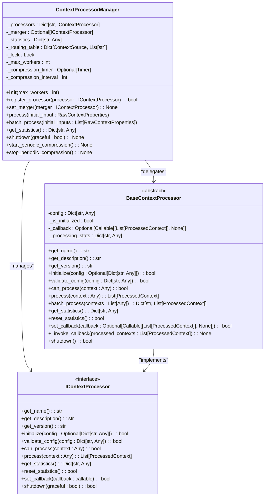
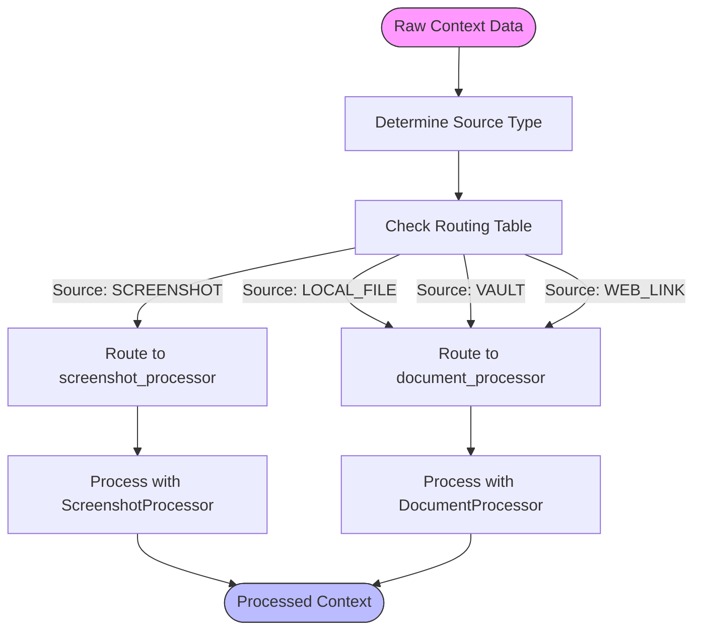
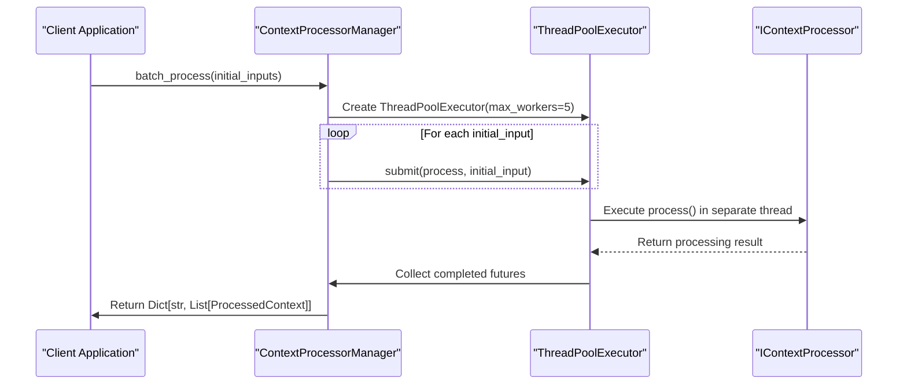
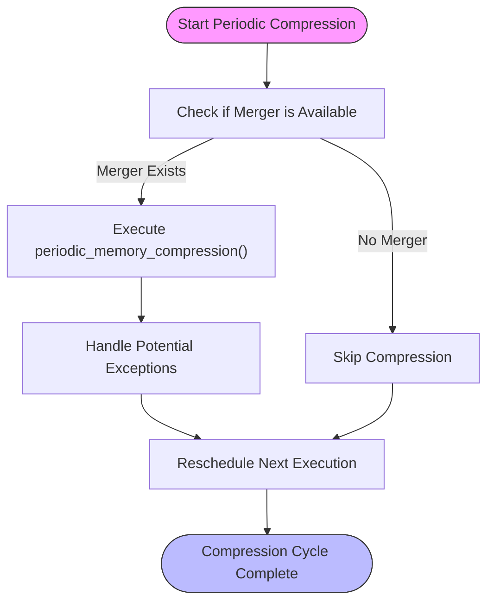
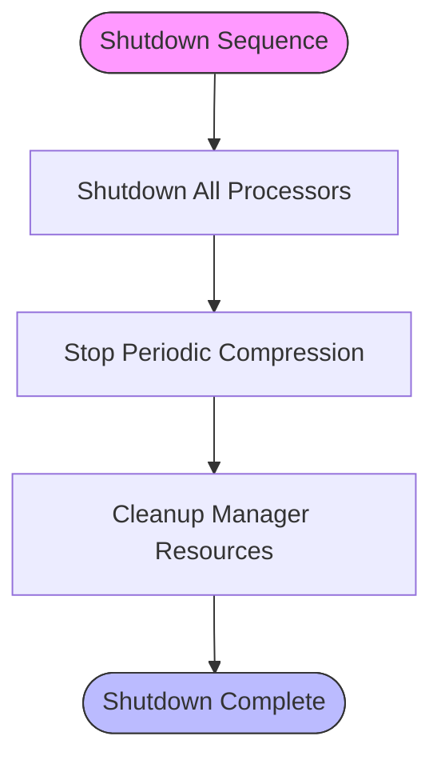
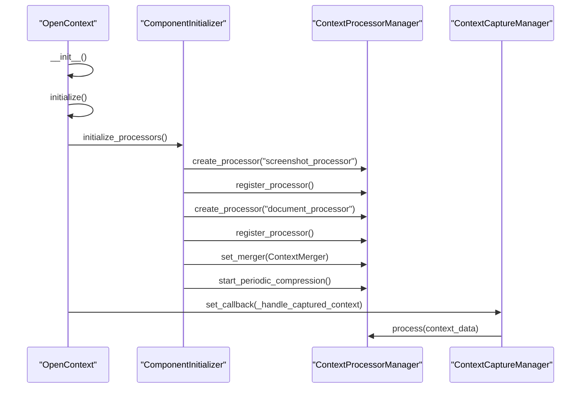

# Context Processor Manager

<cite>
**Referenced Files in This Document**   
- [processor_manager.py](file://opencontext/managers/processor_manager.py)
- [base_processor.py](file://opencontext/context_processing/processor/base_processor.py)
- [screenshot_processor.py](file://opencontext/context_processing/processor/screenshot_processor.py)
- [document_processor.py](file://opencontext/context_processing/processor/document_processor.py)
- [context_merger.py](file://opencontext/context_processing/merger/context_merger.py)
- [processor_factory.py](file://opencontext/context_processing/processor/processor_factory.py)
- [opencontext.py](file://opencontext/server/opencontext.py)
- [component_initializer.py](file://opencontext/server/component_initializer.py)
</cite>

## Table of Contents
1. [Introduction](#introduction)
2. [Core Architecture](#core-architecture)
3. [Routing and Processor Management](#routing-and-processor-management)
4. [Concurrency and Batch Processing](#concurrency-and-batch-processing)
5. [Periodic Memory Compression](#periodic-memory-compression)
6. [Statistics and Lifecycle Management](#statistics-and-lifecycle-management)
7. [Integration with Global Pipeline](#integration-with-global-pipeline)
8. [Common Issues and Optimization](#common-issues-and-optimization)
9. [Conclusion](#conclusion)

## Introduction
The ContextProcessorManager is a central component in the MineContext system responsible for managing and coordinating the processing of raw context data from various sources. It acts as a routing hub that directs incoming context data to appropriate processors based on source type, manages a pool of processor implementations, and handles concurrent processing through a thread pool executor. The manager also integrates with a merger component for periodic memory compression and provides thread-safe statistics aggregation. This documentation provides a comprehensive analysis of its architecture, functionality, and integration within the global processing pipeline.

**Section sources**
- [processor_manager.py](file://opencontext/managers/processor_manager.py#L21-L213)

## Core Architecture
The ContextProcessorManager implements a component-based architecture that manages multiple context processing components through a unified interface. The core design follows a manager-pattern where the manager maintains a registry of processors, handles routing decisions, and coordinates processing workflows.



**Diagram sources **
- [processor_manager.py](file://opencontext/managers/processor_manager.py#L21-L213)
- [base_processor.py](file://opencontext/context_processing/processor/base_processor.py#L23-L261)

**Section sources**
- [processor_manager.py](file://opencontext/managers/processor_manager.py#L21-L213)
- [base_processor.py](file://opencontext/context_processing/processor/base_processor.py#L23-L261)

## Routing and Processor Management
The ContextProcessorManager implements a routing mechanism that directs raw context data to appropriate processors based on the source type. This routing is defined in a routing table that maps context sources to specific processor names.

The manager maintains a pool of IContextProcessor implementations that can be registered dynamically. Each processor is responsible for handling a specific type of context data (e.g., screenshots, documents, web links). The routing table is defined in the `_define_routing` method, which establishes the mapping between context sources and processor names.



The processor registration system allows for dynamic addition of new processors at runtime. When a processor is registered, it is added to the internal `_processors` dictionary with its name as the key. This enables the manager to quickly look up and instantiate processors based on the routing table.

**Section sources**
- [processor_manager.py](file://opencontext/managers/processor_manager.py#L87-L97)
- [processor_manager.py](file://opencontext/managers/processor_manager.py#L99-L114)

## Concurrency and Batch Processing
The ContextProcessorManager leverages Python's concurrent.futures module to handle multiple processing tasks concurrently. It uses a ThreadPoolExecutor with a configurable number of worker threads (default: 5) to process context data in parallel.

The `batch_process` method is responsible for handling multiple raw context inputs simultaneously. It submits each processing task to the thread pool executor and collects the results as they complete. This approach allows the system to efficiently process large volumes of context data without blocking the main application thread.



The concurrency model ensures that processor implementations can perform potentially time-consuming operations (such as calling external APIs or processing large files) without affecting the responsiveness of the overall system. Each processor runs in its own thread, isolated from other processing tasks.

**Section sources**
- [processor_manager.py](file://opencontext/managers/processor_manager.py#L161-L179)
- [processor_manager.py](file://opencontext/managers/processor_manager.py#L28-L42)

## Periodic Memory Compression
The ContextProcessorManager integrates with a merger component to perform periodic memory compression on processed context data. This feature helps maintain system performance by consolidating similar contexts and reducing memory footprint over time.

The compression process is managed through a Timer object that executes the `_run_periodic_compression` method at configurable intervals (default: 1800 seconds or 30 minutes). When compression is triggered, the manager delegates the actual merging logic to the registered merger component.



The compression interval can be configured through the manager's initialization parameters or via the system configuration. The `start_periodic_compression` method initializes the timer and begins the periodic execution cycle, while `stop_periodic_compression` cancels any pending timers during shutdown.

**Section sources**
- [processor_manager.py](file://opencontext/managers/processor_manager.py#L46-L78)
- [processor_manager.py](file://opencontext/managers/processor_manager.py#L61-L78)

## Statistics and Lifecycle Management
The ContextProcessorManager maintains comprehensive statistics about processing activities and provides lifecycle management capabilities for graceful shutdown and resource cleanup.

### Statistics Aggregation
The manager collects thread-safe statistics through a dedicated Lock object that protects the statistics dictionary during updates. The statistics include:
- Total processed inputs
- Total contexts generated
- Processor-specific statistics
- Error counts

The `get_statistics` method provides a thread-safe way to access these statistics by acquiring the lock before reading the current state and returning a copy of the statistics dictionary.

### Lifecycle Management
The manager implements a proper shutdown sequence through the `shutdown` method, which:
1. Shuts down all registered processors
2. Stops the periodic compression timer
3. Cleans up any resources held by the manager



This ensures that all processing components are properly terminated and that no background tasks continue to run after the manager has been shut down.

**Section sources**
- [processor_manager.py](file://opencontext/managers/processor_manager.py#L181-L189)
- [processor_manager.py](file://opencontext/managers/processor_manager.py#L191-L199)

## Integration with Global Pipeline
The ContextProcessorManager is tightly integrated with the global processing pipeline through the OpenContext system. It is initialized and configured by the ComponentInitializer, which registers processors and sets up the merger component based on the system configuration.

The integration occurs in the following sequence:
1. The OpenContext instance creates a ContextProcessorManager during initialization
2. The ComponentInitializer calls `initialize_processors` to register all enabled processors
3. The initializer sets up the merger component and starts periodic compression if enabled
4. The processor manager is connected to the capture manager via callbacks



This integration ensures that captured context data is automatically routed to the processor manager for processing, creating a seamless flow from data capture to processing and storage.

**Section sources**
- [opencontext.py](file://opencontext/server/opencontext.py#L34-L44)
- [component_initializer.py](file://opencontext/server/component_initializer.py#L138-L172)
- [opencontext.py](file://opencontext/server/opencontext.py#L103-L113)

## Common Issues and Optimization
### Common Issues
1. **MISRouted Context Types**: When a context source type is not defined in the routing table, the manager will log an error and skip processing. This can occur when new source types are added without updating the routing configuration.

2. **Thread Pool Exhaustion**: Under heavy load, the thread pool may become exhausted, causing processing delays. This typically happens when processor tasks take longer than expected to complete.

3. **Processor Registration Conflicts**: Attempting to register multiple processors with the same name will result in the previous processor being overwritten, which may lead to unexpected behavior.

### Performance Optimization Tips
1. **Adjust Thread Pool Size**: For systems processing large volumes of context data, increase the `max_workers` parameter to match the available CPU cores:
```python
manager = ContextProcessorManager(max_workers=8)  # For 8-core systems
```

2. **Optimize Compression Interval**: Adjust the compression interval based on usage patterns. For systems with frequent context updates, consider a shorter interval (e.g., 900 seconds). For less active systems, a longer interval (e.g., 3600 seconds) may be more appropriate.

3. **Batch Processing Strategy**: When processing large batches of context data, consider breaking them into smaller chunks to avoid overwhelming the thread pool:
```python
# Process in chunks of 50 rather than all at once
for i in range(0, len(large_batch), 50):
    chunk = large_batch[i:i+50]
    results.update(manager.batch_process(chunk))
```

4. **Monitor Processor Performance**: Regularly check processor statistics to identify bottlenecks. Processors with high error rates or long processing times may need optimization.

**Section sources**
- [processor_manager.py](file://opencontext/managers/processor_manager.py#L138-L142)
- [processor_manager.py](file://opencontext/managers/processor_manager.py#L166-L179)

## Conclusion
The ContextProcessorManager serves as the central orchestrator for context processing in the MineContext system. It provides a robust framework for routing raw context data to appropriate processors based on source type, managing concurrent processing through a thread pool executor, and maintaining system performance through periodic memory compression. The manager's integration with the global processing pipeline ensures seamless data flow from capture to processing and storage. Its extensible architecture allows for easy addition of new processor types, making it adaptable to evolving requirements. By following the optimization tips outlined in this documentation, developers can ensure optimal performance even under heavy workloads.