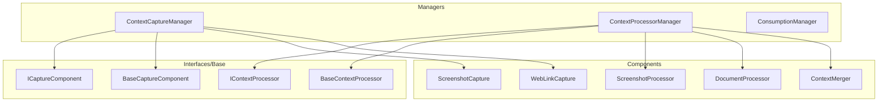
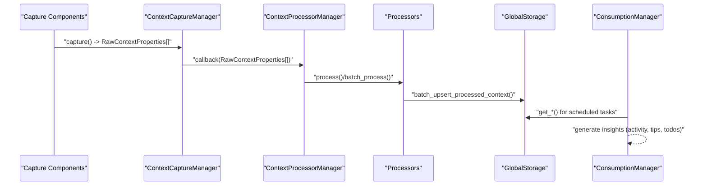
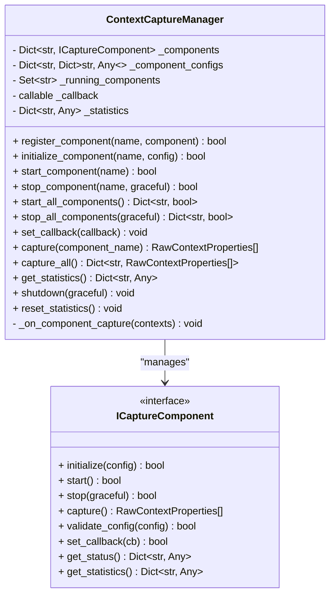
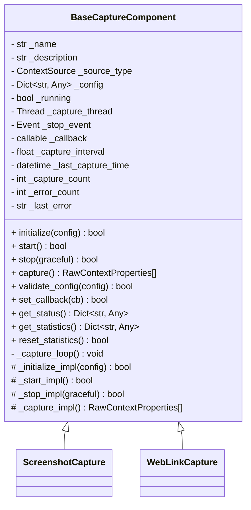
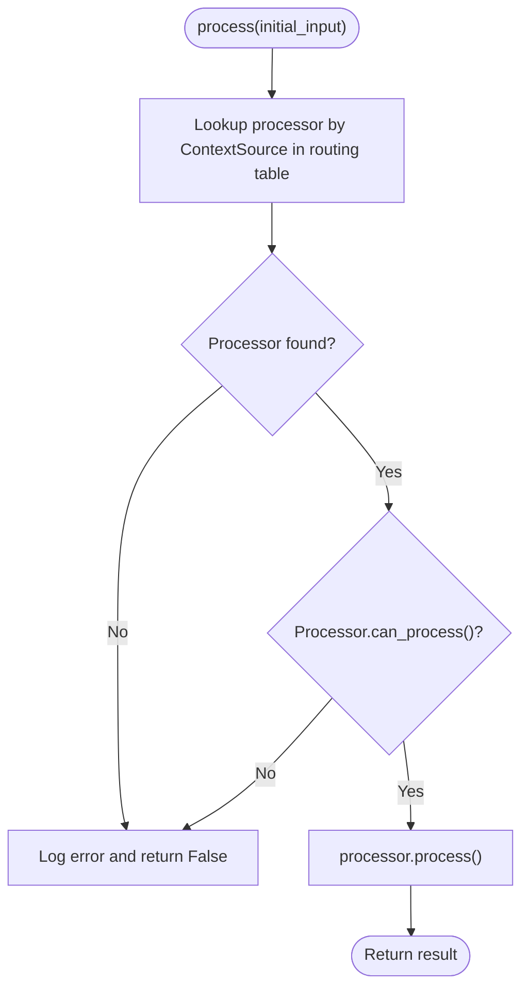
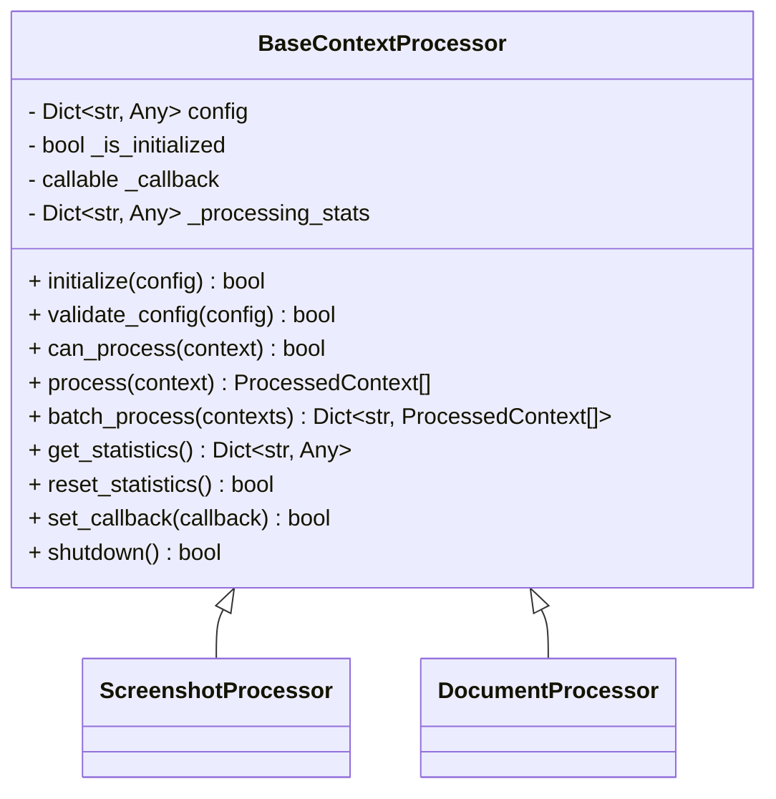
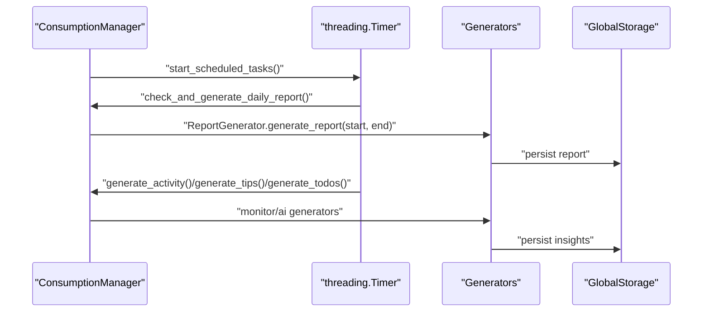
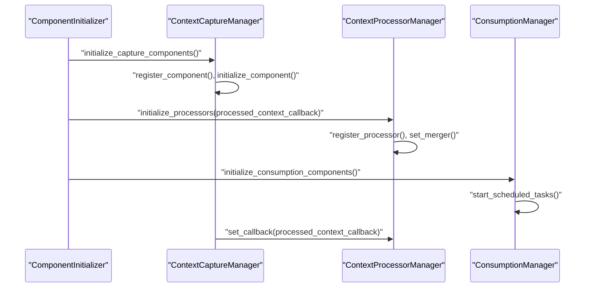
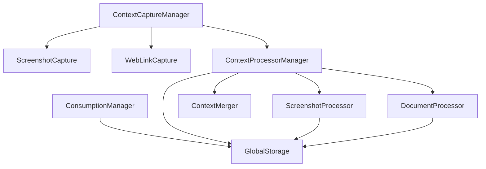

# Service Components

<cite>
**Referenced Files in This Document**
- [capture_manager.py](file://opencontext/managers/capture_manager.py)
- [processor_manager.py](file://opencontext/managers/processor_manager.py)
- [consumption_manager.py](file://opencontext/managers/consumption_manager.py)
- [component_initializer.py](file://opencontext/server/component_initializer.py)
- [screenshot.py](file://opencontext/context_capture/screenshot.py)
- [web_link_capture.py](file://opencontext/context_capture/web_link_capture.py)
- [screenshot_processor.py](file://opencontext/context_processing/processor/screenshot_processor.py)
- [document_processor.py](file://opencontext/context_processing/processor/document_processor.py)
- [context_merger.py](file://opencontext/context_processing/merger/context_merger.py)
- [capture_interface.py](file://opencontext/interfaces/capture_interface.py)
- [processor_interface.py](file://opencontext/interfaces/processor_interface.py)
- [base.py](file://opencontext/context_capture/base.py)
- [base_processor.py](file://opencontext/context_processing/processor/base_processor.py)
</cite>

## Table of Contents
1. [Introduction](#introduction)
2. [Project Structure](#project-structure)
3. [Core Components](#core-components)
4. [Architecture Overview](#architecture-overview)
5. [Detailed Component Analysis](#detailed-component-analysis)
6. [Dependency Analysis](#dependency-analysis)
7. [Performance Considerations](#performance-considerations)
8. [Troubleshooting Guide](#troubleshooting-guide)
9. [Conclusion](#conclusion)

## Introduction
This document describes the backend service components of MineContext with a focus on the three core managers: ContextCaptureManager, ContextProcessorManager, and ConsumptionManager. It explains how ContextCaptureManager registers, initializes, and controls lifecycle of capture components (screenshot and web link capture), how ContextProcessorManager routes raw context data to appropriate processors based on source type and manages periodic memory compression via the merger component, and how ConsumptionManager generates AI-powered insights through scheduled tasks for activity reports, smart tips, and todo generation. It also details how these managers are initialized and wired together in component_initializer.py, including the callback chain from capture to processing to consumption. Thread safety, statistics tracking, and shutdown procedures are covered for each manager.

## Project Structure
The MineContext backend is organized around three primary layers:
- Managers: orchestrate lifecycle and coordination of capture, processing, and consumption subsystems.
- Components: concrete implementations of capture and processing units.
- Interfaces and base classes: define contracts and reusable behavior.

**Diagram sources**
- [capture_manager.py](file://opencontext/managers/capture_manager.py#L1-L391)
- [processor_manager.py](file://opencontext/managers/processor_manager.py#L1-L213)
- [consumption_manager.py](file://opencontext/managers/consumption_manager.py#L1-L524)
- [screenshot.py](file://opencontext/context_capture/screenshot.py#L1-L508)
- [web_link_capture.py](file://opencontext/context_capture/web_link_capture.py#L1-L351)
- [screenshot_processor.py](file://opencontext/context_processing/processor/screenshot_processor.py#L1-L590)
- [document_processor.py](file://opencontext/context_processing/processor/document_processor.py#L1-L653)
- [context_merger.py](file://opencontext/context_processing/merger/context_merger.py#L1-L200)
- [capture_interface.py](file://opencontext/interfaces/capture_interface.py#L1-L153)
- [processor_interface.py](file://opencontext/interfaces/processor_interface.py#L1-L136)
- [base.py](file://opencontext/context_capture/base.py#L1-L515)
- [base_processor.py](file://opencontext/context_processing/processor/base_processor.py#L1-L261)

**Section sources**
- [capture_manager.py](file://opencontext/managers/capture_manager.py#L1-L391)
- [processor_manager.py](file://opencontext/managers/processor_manager.py#L1-L213)
- [consumption_manager.py](file://opencontext/managers/consumption_manager.py#L1-L524)
- [component_initializer.py](file://opencontext/server/component_initializer.py#L1-L229)

## Core Components
- ContextCaptureManager: central coordinator for capture components. Registers, initializes, starts/stops components, exposes callbacks, and tracks statistics.
- ContextProcessorManager: routes raw contexts to processors by source type, maintains processor instances, sets merger, and schedules periodic memory compression.
- ConsumptionManager: runs scheduled tasks for activity reports, smart tips, and todos; manages task timers and configuration.

Key responsibilities:
- Capture lifecycle: register_component, initialize_component, start_component, stop_component, start_all_components, stop_all_components, set_callback, get_statistics, shutdown.
- Processing routing: register_processor, set_merger, process, batch_process, get_statistics, shutdown, reset_statistics.
- Consumption scheduling: start_scheduled_tasks, stop_scheduled_tasks, get_scheduled_tasks_status, update_task_config, get_task_config, shutdown.

**Section sources**
- [capture_manager.py](file://opencontext/managers/capture_manager.py#L1-L391)
- [processor_manager.py](file://opencontext/managers/processor_manager.py#L1-L213)
- [consumption_manager.py](file://opencontext/managers/consumption_manager.py#L1-L524)

## Architecture Overview
The system follows a producer-consumer pipeline:
- Capture components produce RawContextProperties and push them to the ContextCaptureManager via callbacks.
- ContextCaptureManager forwards captured data to ContextProcessorManager via a callback.
- ContextProcessorManager selects the appropriate processor based on source type, processes the data, and persists results.
- ConsumptionManager consumes processed data indirectly through scheduled tasks and storage queries to generate insights.

**Diagram sources**
- [capture_manager.py](file://opencontext/managers/capture_manager.py#L264-L311)
- [processor_manager.py](file://opencontext/managers/processor_manager.py#L129-L179)
- [screenshot_processor.py](file://opencontext/context_processing/processor/screenshot_processor.py#L197-L235)
- [document_processor.py](file://opencontext/context_processing/processor/document_processor.py#L211-L222)
- [consumption_manager.py](file://opencontext/managers/consumption_manager.py#L243-L356)

## Detailed Component Analysis

### ContextCaptureManager
Responsibilities:
- Registration and lifecycle management of capture components.
- Validation and initialization of component configurations.
- Starting/stopping components and maintaining a set of running components.
- Exposing a callback to receive captured data and forwarding it upstream.
- Statistics tracking per component and totals.
- Manual capture triggers and bulk capture operations.
- Graceful shutdown of all components.

Thread safety:
- Uses locks and sets to guard component registry and running state.
- Callback invocation is guarded by exception handling to avoid crashing the pipeline.

Statistics:
- Tracks total captures, total contexts captured, last capture time, and per-component counters.

Shutdown:
- Stops all running components gracefully and logs shutdown status.

**Diagram sources**
- [capture_manager.py](file://opencontext/managers/capture_manager.py#L1-L391)
- [capture_interface.py](file://opencontext/interfaces/capture_interface.py#L1-L153)

**Section sources**
- [capture_manager.py](file://opencontext/managers/capture_manager.py#L1-L391)
- [base.py](file://opencontext/context_capture/base.py#L1-L515)

### Capture Components
Two concrete capture components are used in this system:
- ScreenshotCapture: periodic screen capture with deduplication, configurable region, and optional saving to disk.
- WebLinkCapture: converts URLs to Markdown or PDF using external libraries, with concurrency control.

Both inherit from BaseCaptureComponent, which provides:
- Configuration validation and schema extension.
- Auto-capture loop with configurable intervals.
- Thread-safe lifecycle management and statistics.

**Diagram sources**
- [base.py](file://opencontext/context_capture/base.py#L1-L515)
- [screenshot.py](file://opencontext/context_capture/screenshot.py#L1-L508)
- [web_link_capture.py](file://opencontext/context_capture/web_link_capture.py#L1-L351)

**Section sources**
- [screenshot.py](file://opencontext/context_capture/screenshot.py#L1-L508)
- [web_link_capture.py](file://opencontext/context_capture/web_link_capture.py#L1-L351)
- [base.py](file://opencontext/context_capture/base.py#L1-L515)

### ContextProcessorManager
Responsibilities:
- Routing raw contexts to processors based on source type via a routing table.
- Managing processor instances and their statistics.
- Setting a merger component and starting periodic memory compression.
- Batch processing with a thread pool and error handling.
- Providing statistics and shutdown routines.

Routing table:
- SCREENSHOT -> screenshot_processor
- LOCAL_FILE/Vault/WEB_LINK -> document_processor

Periodic compression:
- Starts a Timer to periodically call merger’s periodic_memory_compression.

**Diagram sources**
- [processor_manager.py](file://opencontext/managers/processor_manager.py#L87-L179)

**Section sources**
- [processor_manager.py](file://opencontext/managers/processor_manager.py#L1-L213)

### Processor Components
- ScreenshotProcessor: deduplicates screenshots, batches processing, uses LLM for VLM analysis, merges results, and persists to storage.
- DocumentProcessor: handles structured and visual documents, page-by-page analysis, VLM for visual pages, chunking, and knowledge context creation.

Both inherit from BaseContextProcessor, which provides:
- Configuration management, statistics tracking, and callback invocation.
- Background processing loops for batched workloads.

**Diagram sources**
- [base_processor.py](file://opencontext/context_processing/processor/base_processor.py#L1-L261)
- [screenshot_processor.py](file://opencontext/context_processing/processor/screenshot_processor.py#L1-L590)
- [document_processor.py](file://opencontext/context_processing/processor/document_processor.py#L1-L653)

**Section sources**
- [screenshot_processor.py](file://opencontext/context_processing/processor/screenshot_processor.py#L1-L590)
- [document_processor.py](file://opencontext/context_processing/processor/document_processor.py#L1-L653)
- [base_processor.py](file://opencontext/context_processing/processor/base_processor.py#L1-L261)

### ContextMerger
Role:
- Merges similar contexts using type-aware strategies and vector similarity.
- Supports intelligent merging and legacy associative/similarity strategies.
- Periodic memory compression is invoked via ContextProcessorManager’s timer.

Integration:
- Registered as merger in ContextProcessorManager and started via component_initializer.

**Section sources**
- [context_merger.py](file://opencontext/context_processing/merger/context_merger.py#L1-L200)
- [processor_manager.py](file://opencontext/managers/processor_manager.py#L46-L79)

### ConsumptionManager
Responsibilities:
- Scheduled tasks for:
  - Daily report generation at a configured time-of-day.
  - Realtime activity summaries with configurable intervals.
  - Smart tips generation with configurable intervals.
  - Smart todo generation with configurable intervals.
- Dynamic configuration updates for intervals and enabling/disabling tasks.
- Thread-safe configuration updates with a lock.
- Shutdown cancels all timers.

**Diagram sources**
- [consumption_manager.py](file://opencontext/managers/consumption_manager.py#L200-L356)

**Section sources**
- [consumption_manager.py](file://opencontext/managers/consumption_manager.py#L1-L524)

### Component Initialization and Wiring
ComponentInitializer orchestrates:
- Capture components: reads configuration, creates instances, registers, initializes, and starts them.
- Processors: creates processors via factory, registers them, and sets callbacks.
- Merger: instantiates ContextMerger, sets it on processor manager, and starts periodic compression.
- Completion service: optional service initialization.
- Consumption components: constructs ConsumptionManager and starts scheduled tasks.

**Diagram sources**
- [component_initializer.py](file://opencontext/server/component_initializer.py#L71-L207)

**Section sources**
- [component_initializer.py](file://opencontext/server/component_initializer.py#L1-L229)

## Dependency Analysis
- Capture components depend on BaseCaptureComponent and ICaptureComponent.
- Processor components depend on BaseContextProcessor and IContextProcessor.
- ContextProcessorManager depends on processors and merger.
- ContextCaptureManager depends on capture components and provides callbacks to ContextProcessorManager.
- ConsumptionManager depends on storage and generators for insights.

**Diagram sources**
- [capture_manager.py](file://opencontext/managers/capture_manager.py#L1-L391)
- [processor_manager.py](file://opencontext/managers/processor_manager.py#L1-L213)
- [consumption_manager.py](file://opencontext/managers/consumption_manager.py#L1-L524)
- [screenshot_processor.py](file://opencontext/context_processing/processor/screenshot_processor.py#L1-L590)
- [document_processor.py](file://opencontext/context_processing/processor/document_processor.py#L1-L653)
- [context_merger.py](file://opencontext/context_processing/merger/context_merger.py#L1-L200)

**Section sources**
- [capture_manager.py](file://opencontext/managers/capture_manager.py#L1-L391)
- [processor_manager.py](file://opencontext/managers/processor_manager.py#L1-L213)
- [consumption_manager.py](file://opencontext/managers/consumption_manager.py#L1-L524)

## Performance Considerations
- Concurrency:
  - ContextProcessorManager uses a ThreadPoolExecutor for batch processing.
  - ScreenshotProcessor and DocumentProcessor use background threads and queues to decouple capture from processing.
- Deduplication:
  - ScreenshotCapture performs image deduplication to reduce redundant processing.
  - ScreenshotProcessor uses perceptual hashing and caches to detect duplicates.
- Memory compression:
  - ContextProcessorManager starts a periodic timer to invoke merger’s memory compression routine.
- I/O and external dependencies:
  - WebLinkCapture uses concurrency to convert multiple URLs efficiently.
  - ScreenshotProcessor and DocumentProcessor rely on external LLM/VLM clients; batching reduces overhead.

[No sources needed since this section provides general guidance]

## Troubleshooting Guide
Common issues and diagnostics:
- Capture component errors:
  - Validate configuration using validate_config and inspect get_status/get_statistics.
  - Check capture thread lifecycle and stop events.
- Processor failures:
  - Review batch_process exceptions and per-processor statistics.
  - Verify can_process checks and source type routing.
- Merger and compression:
  - Ensure merger is set and periodic timer is running.
  - Inspect merger statistics and strategy initialization.
- Consumption tasks:
  - Confirm scheduled timers are active and intervals are valid.
  - Use get_scheduled_tasks_status to verify active timers.

Operational controls:
- Reset statistics for managers and processors.
- Graceful shutdown sequences for capture and processors.
- ConsumptionManager shutdown cancels all timers.

**Section sources**
- [base.py](file://opencontext/context_capture/base.py#L1-L515)
- [base_processor.py](file://opencontext/context_processing/processor/base_processor.py#L1-L261)
- [processor_manager.py](file://opencontext/managers/processor_manager.py#L191-L213)
- [consumption_manager.py](file://opencontext/managers/consumption_manager.py#L101-L111)

## Conclusion
MineContext’s backend is structured around three cohesive managers that coordinate capture, processing, and consumption. ContextCaptureManager provides a robust, thread-safe interface for registering and controlling capture components. ContextProcessorManager routes raw contexts to specialized processors, aggregates statistics, and integrates a merger for memory compression. ConsumptionManager automates AI-driven insights through scheduled tasks. ComponentInitializer wires these managers together and establishes the callback chain from capture to processing to consumption. Thread safety, statistics tracking, and graceful shutdown are integral to each manager’s design, ensuring reliability and observability across the system.