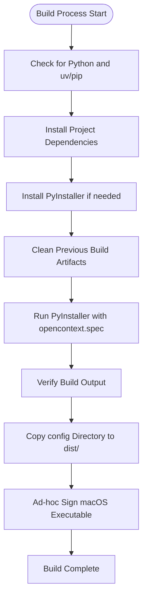
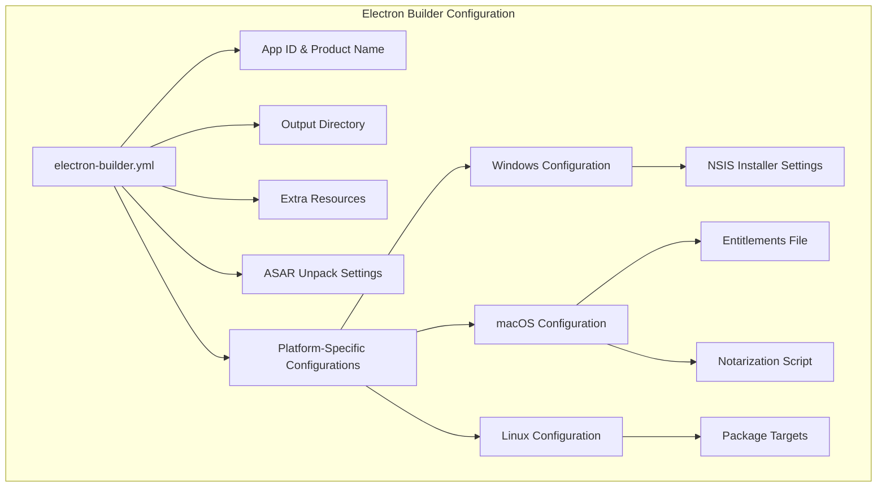
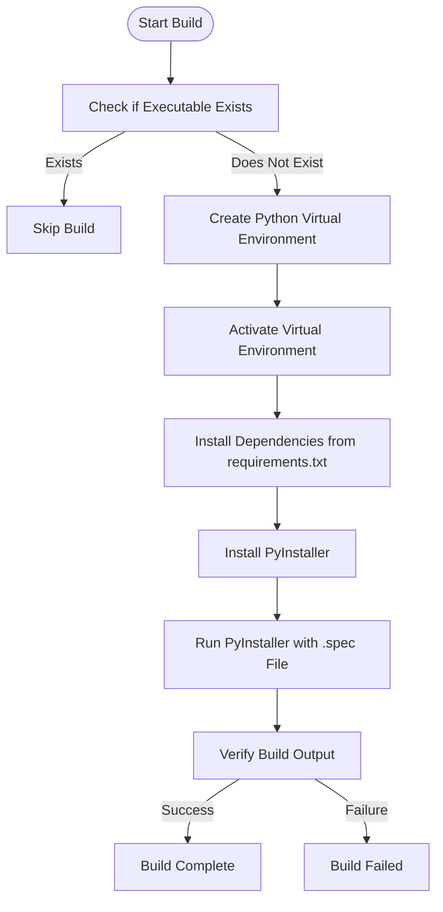
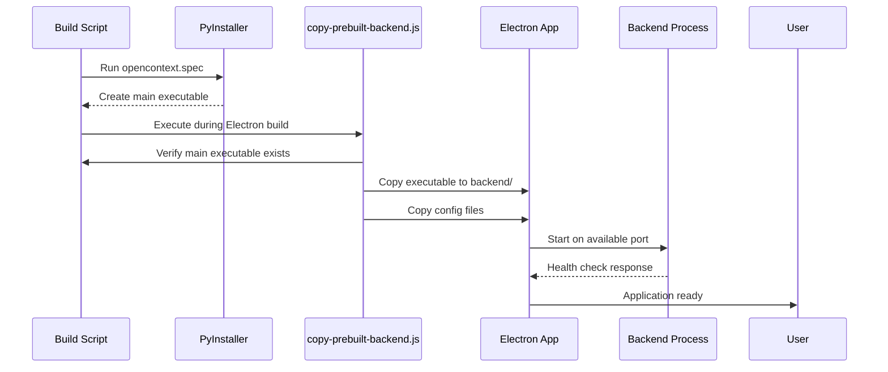
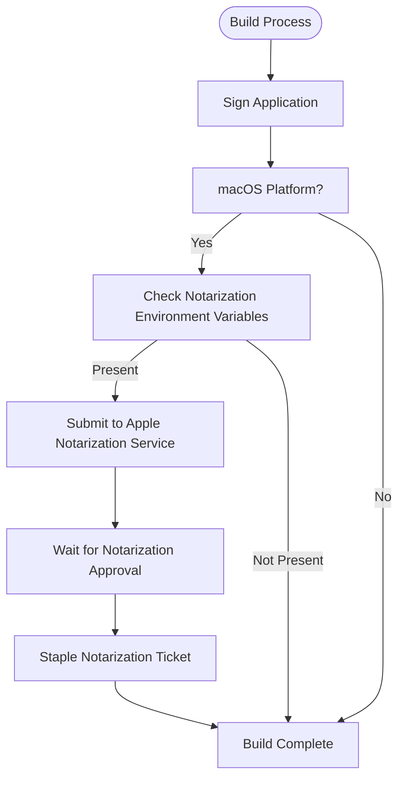
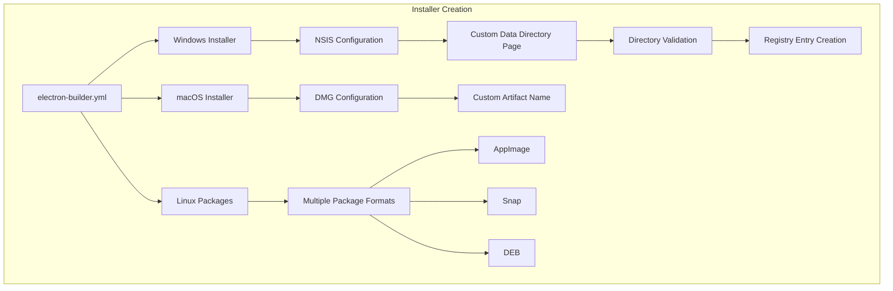

# Build and Deployment

<cite>
**Referenced Files in This Document**   
- [build.sh](file://build.sh)
- [build.bat](file://build.bat)
- [build-python.sh](file://frontend/build-python.sh)
- [build-python.js](file://frontend/build-python.js)
- [electron-builder.yml](file://frontend/electron-builder.yml)
- [opencontext.spec](file://opencontext.spec)
- [window_capture.spec](file://frontend/externals/python/window_capture/window_capture.spec)
- [window_inspector.spec](file://frontend/externals/python/window_inspector/window_inspector.spec)
- [hook-opencontext.py](file://hook-opencontext.py)
- [copy-prebuilt-backend.js](file://frontend/scripts/copy-prebuilt-backend.js)
- [backend.ts](file://frontend/src/main/backend.ts)
- [notarize.js](file://frontend/build/notarize.js)
- [entitlements.mac.plist](file://frontend/build/entitlements.mac.plist)
- [installer.nsh](file://frontend/build/installer.nsh)
</cite>

## Table of Contents
1. [Build Workflow Overview](#build-workflow-overview)
2. [Shell Script Orchestration](#shell-script-orchestration)
3. [Electron Packaging Configuration](#electron-packaging-configuration)
4. [Python Component Compilation](#python-component-compilation)
5. [Backend Bundling Process](#backend-bundling-process)
6. [Code Signing and Notarization](#code-signing-and-notarization)
7. [Installer Creation](#installer-creation)
8. [Troubleshooting Guide](#troubleshooting-guide)

## Build Workflow Overview

The MineContext build process follows a multi-stage workflow that compiles both frontend and backend components into a distributable Electron application. The process begins with the compilation of Python-based backend services using PyInstaller, followed by the Electron application build that packages these compiled components together. The workflow supports cross-platform development with separate scripts for Unix-like systems and Windows, ensuring consistent build outputs across different operating environments.

The build process is orchestrated through a combination of shell scripts and Node.js scripts that handle platform-specific requirements. For the Python backend, PyInstaller is used to create standalone executables from Python scripts, while Electron Builder packages the frontend React application along with the compiled Python components into a single distributable application. This hybrid approach allows the application to leverage Python's capabilities for system-level operations while maintaining a modern web-based user interface.

**Section sources**
- [build.sh](file://build.sh#L1-L91)
- [build.bat](file://build.bat#L1-L123)
- [electron-builder.yml](file://frontend/electron-builder.yml#L1-L72)

## Shell Script Orchestration

The build process is managed by two primary shell scripts: `build.sh` for Unix-like systems and `build.bat` for Windows. These scripts handle the complete build workflow, from dependency management to final executable creation. The Unix shell script uses bash syntax with error handling enabled (`set -e`) to ensure the build process stops immediately if any command fails.

Both scripts follow a similar execution pattern: first checking for required dependencies (Python 3 and uv/pip), then installing project dependencies, cleaning previous build artifacts, running PyInstaller to create the executable, and finally verifying the build output. The scripts are designed to be resilient, with conditional checks for the presence of the uv package manager, falling back to pip if uv is not available. This ensures the build process can proceed even in environments where uv is not installed.

The scripts also handle platform-specific considerations, such as file path separators and executable naming conventions. On Unix-like systems, the executable is named `main`, while on Windows it is named `main.exe`. The build scripts also perform post-build verification, checking for the existence of the compiled executable and copying configuration files to the distribution directory.

**Diagram sources**
- [build.sh](file://build.sh#L1-L91)
- [build.bat](file://build.bat#L1-L123)

**Section sources**
- [build.sh](file://build.sh#L1-L91)
- [build.bat](file://build.bat#L1-L123)

## Electron Packaging Configuration

The Electron application packaging is configured through the `electron-builder.yml` file, which defines the build targets for Windows, macOS, and Linux platforms. The configuration specifies the application identifier, product name, output directory, and various platform-specific settings. The build process generates installers for each platform, with different formats including NSIS for Windows, DMG for macOS, and AppImage, Snap, and DEB packages for Linux.

The configuration includes several important settings for resource management and application behavior. The `extraResources` section specifies additional files to include in the packaged application, particularly the compiled Python executables for macOS. The `asarUnpack` directive ensures that certain resources are unpacked from the ASAR archive, which is necessary for executing external binaries. Platform-specific configurations include Windows installer settings, macOS entitlements, and Linux package metadata.

For macOS, the configuration includes entitlements that grant necessary permissions for the application to access system resources such as the camera, microphone, and user directories. The notarization process is also configured, with a custom script specified in the `afterSign` field that runs after the application is signed but before it is notarized. This ensures the application meets Apple's security requirements for distribution.

**Diagram sources**
- [electron-builder.yml](file://frontend/electron-builder.yml#L1-L72)

**Section sources**
- [electron-builder.yml](file://frontend/electron-builder.yml#L1-L72)
- [package.json](file://frontend/package.json#L1-L153)

## Python Component Compilation

The Python components of MineContext are compiled into standalone executables using PyInstaller, a tool that converts Python scripts into platform-specific executables. The project includes two specialized Python components: `window_capture` and `window_inspector`, both located in the `frontend/externals/python` directory. These components are responsible for system-level operations such as capturing window content and inspecting window properties, particularly on macOS where they interface with the Quartz framework.

Each Python component has its own PyInstaller specification file (`.spec`) that defines how the executable should be built. The `window_capture.spec` file contains a minimal configuration, while `window_inspector.spec` includes additional hidden imports for PyObjC modules such as Quartz, AppKit, and Foundation, which are required for the component to function properly on macOS. The build process for these components is orchestrated by the `build-python.sh` script and its Node.js counterpart `build-python.js`, which handle the creation of virtual environments, dependency installation, and PyInstaller execution.

The compilation process follows a consistent pattern: first checking if the executable already exists to avoid redundant builds, creating a virtual environment, installing dependencies from `requirements.txt` if present, installing PyInstaller, and then running PyInstaller with the component's specification file. The build scripts are designed to be cross-platform, with the Node.js version detecting the operating system and using appropriate commands for virtual environment creation and package management.

**Diagram sources**
- [build-python.sh](file://frontend/build-python.sh#L1-L90)
- [build-python.js](file://frontend/build-python.js#L1-L134)
- [window_capture.spec](file://frontend/externals/python/window_capture/window_capture.spec#L1-L48)
- [window_inspector.spec](file://frontend/externals/python/window_inspector/window_inspector.spec#L1-L56)

**Section sources**
- [build-python.sh](file://frontend/build-python.sh#L1-L90)
- [build-python.js](file://frontend/build-python.js#L1-L134)
- [window_capture.spec](file://frontend/externals/python/window_capture/window_capture.spec#L1-L48)
- [window_inspector.spec](file://frontend/externals/python/window_inspector/window_inspector.spec#L1-L56)

## Backend Bundling Process

The Python backend is bundled with the Electron application through a multi-step process that ensures the compiled backend executable and its dependencies are properly integrated into the final application package. The core of this process is the `copy-prebuilt-backend.js` script, which is executed as part of the Electron build process. This script is responsible for copying the compiled backend executable from the root project's `dist` directory to the frontend's `backend` directory, where it can be accessed by the Electron application.

The bundling process begins with the compilation of the main Python application using the `opencontext.spec` file, which defines the application's entry point, data files to include, and hidden imports required for proper execution. The specification file includes critical configuration such as the inclusion of configuration files, static web assets, and template files, as well as hidden imports for various Python packages that are dynamically loaded at runtime.

Once the backend executable is compiled, the `copy-prebuilt-backend.js` script verifies its existence and copies it to the appropriate location within the Electron application structure. The script also copies the configuration files from the compiled backend to ensure the application has access to its configuration at runtime. On Unix-like systems, the script ensures the executable has the appropriate permissions by making it executable with `chmod +x`.

The Electron application then uses the `backend.ts` module to manage the lifecycle of the backend process, including starting, stopping, and monitoring its health. This module implements sophisticated process management, including port detection, health checking, and graceful shutdown procedures. It also handles platform-specific process management, such as creating process groups on Unix systems to ensure all child processes are properly terminated when the application exits.

**Diagram sources**
- [opencontext.spec](file://opencontext.spec#L1-L127)
- [copy-prebuilt-backend.js](file://frontend/scripts/copy-prebuilt-backend.js#L1-L73)
- [backend.ts](file://frontend/src/main/backend.ts#L1-L740)

**Section sources**
- [opencontext.spec](file://opencontext.spec#L1-L127)
- [hook-opencontext.py](file://hook-opencontext.py#L1-L28)
- [copy-prebuilt-backend.js](file://frontend/scripts/copy-prebuilt-backend.js#L1-L73)
- [backend.ts](file://frontend/src/main/backend.ts#L1-L740)

## Code Signing and Notarization

The code signing and notarization process for MineContext ensures the application meets platform security requirements, particularly for macOS distribution. The process is configured in the `electron-builder.yml` file, which specifies the notarization script to run after the application is signed. The `notarize.js` script handles the submission of the application to Apple's notarization service, using environment variables to authenticate with the Apple Developer account.

For macOS, the application requires specific entitlements to access system resources such as the camera, microphone, and user directories. These entitlements are defined in the `entitlements.mac.plist` file, which grants permissions for JIT compilation, unsigned executable memory, and dyld environment variables. These permissions are necessary for the Python components to function properly within the Electron application sandbox.

The code signing process is integrated into the PyInstaller build for the main application through the `get_codesign_identity` function in the `opencontext.spec` file. This function creates a temporary keychain, imports the signing certificate, and configures it for use during the build process. The function also handles the setup of environment variables required by GitHub Actions for automated builds, ensuring the signing process works in continuous integration environments.

The notarization process is triggered automatically during the build when the target platform is macOS and the required environment variables (APPLE_ID, APPLE_APP_SPECIFIC_PASSWORD, and APPLE_TEAM_ID) are present. This ensures that only authorized builds are submitted for notarization, maintaining the security of the signing credentials.

**Diagram sources**
- [electron-builder.yml](file://frontend/electron-builder.yml#L1-L72)
- [notarize.js](file://frontend/build/notarize.js#L1-L27)
- [entitlements.mac.plist](file://frontend/build/entitlements.mac.plist#L1-L13)
- [opencontext.spec](file://opencontext.spec#L1-L127)

**Section sources**
- [electron-builder.yml](file://frontend/electron-builder.yml#L1-L72)
- [notarize.js](file://frontend/build/notarize.js#L1-L27)
- [entitlements.mac.plist](file://frontend/build/entitlements.mac.plist#L1-L13)
- [opencontext.spec](file://opencontext.spec#L1-L127)

## Installer Creation

The installer creation process for MineContext is configured through the `electron-builder.yml` file, with platform-specific settings for Windows, macOS, and Linux. For Windows, the NSIS (Nullsoft Scriptable Install System) is used to create a custom installer that includes additional functionality beyond the default Electron Builder configuration.

The Windows installer is customized through the `installer.nsh` script, which adds a data directory selection page to the installation process. This allows users to choose where the application will store its data files, separate from the installation directory. The custom page includes validation to ensure the selected directory has write permissions and is not the same as the installation directory, preventing potential permission issues.

The installer configuration includes several user-friendly features, such as the ability to create desktop shortcuts, allow users to change the installation directory, and support for both per-machine and per-user installations. The installer also handles the creation of registry entries to store the installation and data directory paths, allowing the application to locate its data files on subsequent launches.

For macOS, the DMG (Disk Image) format is used, with a custom artifact name that includes the application name and version. The Linux build generates multiple package formats (AppImage, Snap, and DEB) to support different distributions and package managers, ensuring broad compatibility across Linux environments.

**Diagram sources**
- [electron-builder.yml](file://frontend/electron-builder.yml#L1-L72)
- [installer.nsh](file://frontend/build/installer.nsh#L1-L112)

**Section sources**
- [electron-builder.yml](file://frontend/electron-builder.yml#L1-L72)
- [installer.nsh](file://frontend/build/installer.nsh#L1-L112)

## Troubleshooting Guide

When encountering issues with the MineContext build process, several common problems and their solutions should be considered. One frequent issue is the "Pre-built executable not found" error, which occurs when the `copy-prebuilt-backend.js` script cannot locate the compiled backend executable. This is typically resolved by ensuring the backend has been built first by running `build.sh` or `build.bat` in the project root directory before attempting to build the Electron application.

Another common issue is related to Python dependencies, particularly when the uv package manager is not available. In such cases, the build scripts automatically fall back to pip, but network issues or permission problems can still prevent dependency installation. Ensuring proper network connectivity and appropriate file permissions can resolve these issues.

For macOS builds, code signing and notarization errors are common, particularly in automated build environments. These errors can be addressed by ensuring the required environment variables (APPLE_ID, APPLE_APP_SPECIFIC_PASSWORD, and APPLE_TEAM_ID) are properly set and that the signing certificate is valid and accessible. The temporary keychain created during the build process must also have the necessary permissions to import and use the signing certificate.

Port conflicts can occur when starting the backend server, particularly if another instance of the application is already running. The `backend.ts` module includes functionality to detect available ports and kill processes using conflicting ports, but manual intervention may be required in some cases. Checking for and terminating any existing MineContext processes can resolve port conflicts.

Finally, issues with the Python components on non-macOS platforms can occur since the `window_inspector` and `window_capture` components are designed specifically for macOS. The `build-python.js` script includes logic to skip these components on Windows platforms, but similar considerations should be made for Linux builds to avoid unnecessary compilation attempts.

**Section sources**
- [build.sh](file://build.sh#L1-L91)
- [build.bat](file://build.bat#L1-L123)
- [copy-prebuilt-backend.js](file://frontend/scripts/copy-prebuilt-backend.js#L1-L73)
- [backend.ts](file://frontend/src/main/backend.ts#L1-L740)