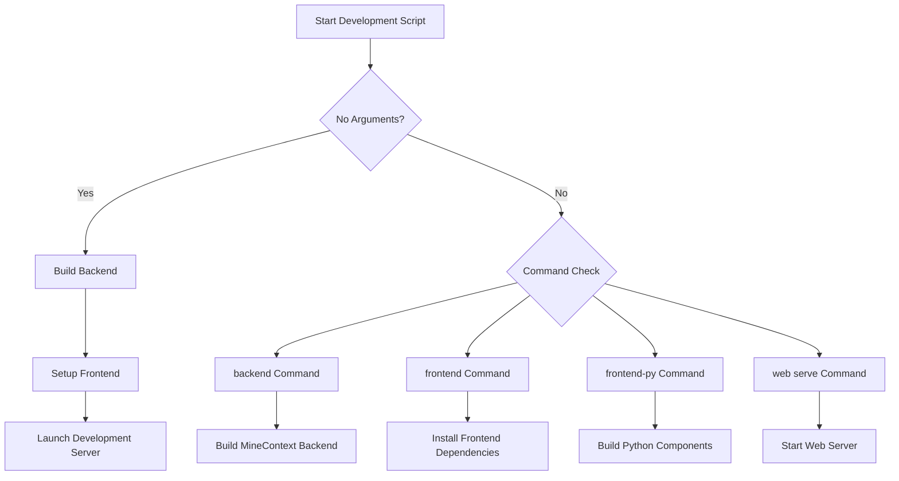
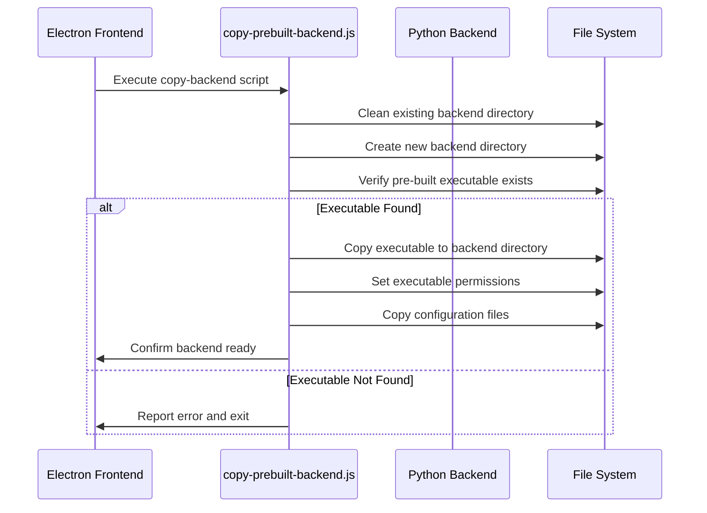
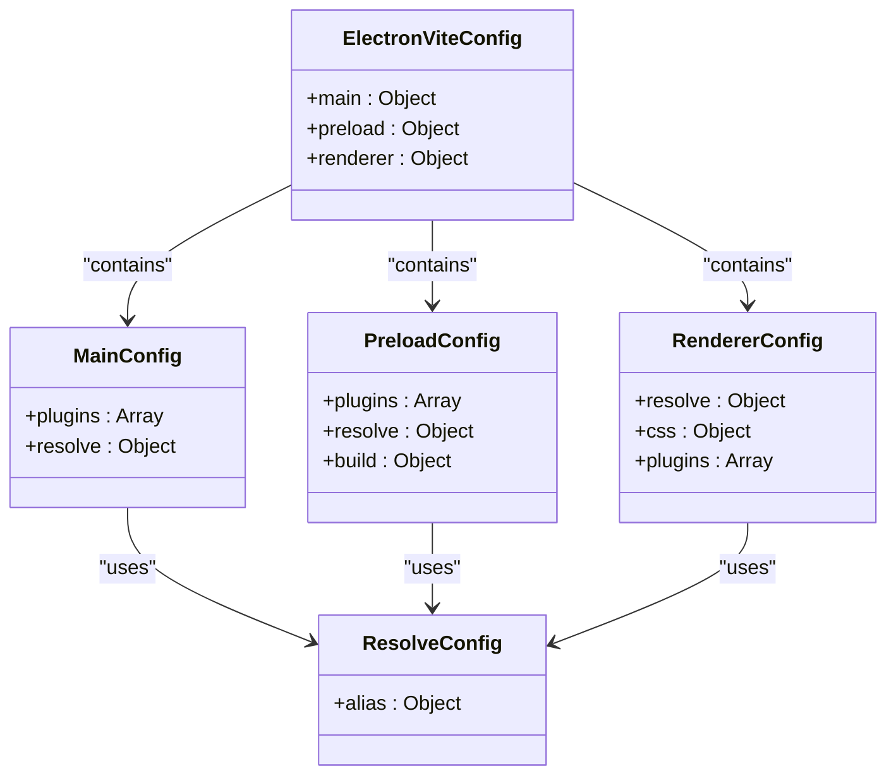
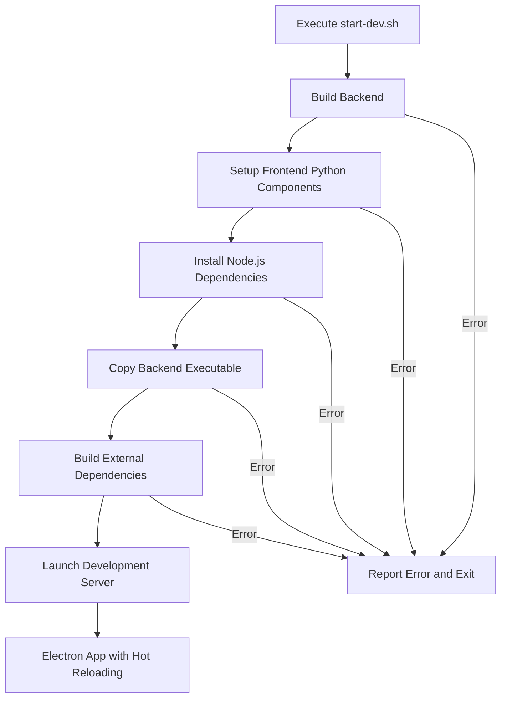

# Development Builds

<cite>
**Referenced Files in This Document**   
- [start-dev.sh](file://frontend/start-dev.sh)
- [copy-prebuilt-backend.js](file://frontend/scripts/copy-prebuilt-backend.js)
- [electron.vite.config.ts](file://frontend/electron.vite.config.ts)
- [build-python.js](file://frontend/build-python.js)
- [build-python.sh](file://frontend/build-python.sh)
- [build.sh](file://build.sh)
- [opencontext.spec](file://opencontext.spec)
- [window_capture.spec](file://frontend/externals/python/window_capture/window_capture.spec)
- [window_inspector.spec](file://frontend/externals/python/window_inspector/window_inspector.spec)
- [electron-builder.yml](file://frontend/electron-builder.yml)
- [.env.example](file://frontend/.env.example)
- [package.json](file://frontend/package.json)
</cite>

## Table of Contents
1. [Introduction](#introduction)
2. [Development Environment Setup](#development-environment-setup)
3. [Development Workflow with start-dev.sh](#development-workflow-with-start-devsh)
4. [Python Backend Integration](#python-backend-integration)
5. [Vite Configuration for Development](#vite-configuration-for-development)
6. [Dependency Management](#dependency-management)
7. [Execution Flow](#execution-flow)
8. [Common Development Issues](#common-development-issues)
9. [Performance Considerations](#performance-considerations)
10. [Conclusion](#conclusion)

## Introduction

MineContext is a sophisticated Electron-based application that integrates a Python backend with a React frontend through Electron. This document provides comprehensive guidance for setting up and managing the local development environment, focusing on the development build process, workflow orchestration, and integration between components. The development setup is designed to streamline the process of building, testing, and debugging both frontend and backend components in a cohesive manner.

## Development Environment Setup

The development environment for MineContext requires the installation and configuration of multiple tools and dependencies. The setup process is automated through scripts that handle Node.js, Python, and Electron dependencies. The environment is configured to support hot reloading, fast refresh, and seamless integration between the Electron frontend and Python backend components.

**Section sources**
- [start-dev.sh](file://frontend/start-dev.sh#L1-L286)
- [.env.example](file://frontend/.env.example#L1-L27)

## Development Workflow with start-dev.sh

The `start-dev.sh` script serves as the primary entry point for launching MineContext in development mode. This bash script orchestrates the entire development workflow, from environment setup to application launch. When executed without arguments, it performs a complete setup by building the backend, preparing the frontend, and launching the development server.

The script supports several commands:
- `backend`: Builds and prepares only the MineContext backend
- `frontend`: Installs frontend dependencies and prepares the frontend environment
- `frontend-py`: Builds only the frontend's Python executable components
- `web serve`: Starts the MineContext web server
- `-h` or `--help`: Displays usage information

The workflow begins by detecting and installing necessary tools like uv (Python package manager), nvm (Node version manager), pyenv (Python version manager), and pnpm (Node package manager). It then sets up the appropriate Python and Node.js versions, installs dependencies, and builds required components.

**Diagram sources **
- [start-dev.sh](file://frontend/start-dev.sh#L245-L252)
- [start-dev.sh](file://frontend/start-dev.sh#L255-L280)

**Section sources**
- [start-dev.sh](file://frontend/start-dev.sh#L1-L286)

## Python Backend Integration

The integration of the Python backend with the Electron frontend is facilitated by the `copy-prebuilt-backend.js` script. This Node.js script is responsible for copying the pre-built Python executable and configuration files from the project root to the frontend's backend directory, enabling the Electron application to communicate with the Python backend during development.

The script performs several critical functions:
- Cleans up any existing backend directory
- Creates a new backend directory
- Verifies the existence of the pre-built executable
- Copies the executable to the backend directory
- Sets appropriate permissions on Unix systems
- Copies configuration files from the source directory

The integration process is triggered during the frontend build process through the `copy-backend` npm script defined in package.json. This ensures that the latest version of the backend executable is always available to the Electron application.

**Diagram sources **
- [copy-prebuilt-backend.js](file://frontend/scripts/copy-prebuilt-backend.js#L1-L73)
- [package.json](file://frontend/package.json#L36)

**Section sources**
- [copy-prebuilt-backend.js](file://frontend/scripts/copy-prebuilt-backend.js#L1-L73)

## Vite Configuration for Development

The Vite configuration in `electron.vite.config.ts` is specifically tailored for the Electron environment, enabling hot reloading and fast refresh capabilities during development. The configuration leverages the electron-vite plugin to support Electron's main, preload, and renderer processes.

Key features of the Vite configuration include:
- Aliases for simplified module imports (@main, @renderer, @shared, etc.)
- Tailwind CSS integration for styling
- React SWC plugin for faster compilation
- Code inspector plugin for development debugging
- Rollup visualizer for bundle analysis
- Sourcemap generation in development mode

The configuration is divided into three sections:
- **Main**: Configuration for the Electron main process
- **Preload**: Configuration for the preload scripts with React support
- **Renderer**: Configuration for the React frontend with Tailwind CSS and development tools

The configuration also includes conditional plugins that are only enabled in development mode, such as the CodeInspectorPlugin, which provides real-time code inspection capabilities.

**Diagram sources **
- [electron.vite.config.ts](file://frontend/electron.vite.config.ts#L1-L84)

**Section sources**
- [electron.vite.config.ts](file://frontend/electron.vite.config.ts#L1-L84)

## Dependency Management

MineContext employs a comprehensive dependency management strategy that handles both Python and Node.js dependencies. The project uses uv for Python package management and pnpm for Node.js package management, ensuring consistent dependency resolution across different environments.

For Python dependencies, the project uses uv sync to install packages from pyproject.toml, with a fallback to pip for environments where uv is not available. The build process also handles the installation of PyInstaller for creating executable binaries from Python scripts.

For Node.js dependencies, pnpm is used as the package manager, with a specific configuration in package.json that defines onlyBuiltDependencies to optimize the build process. The development environment setup automatically installs pnpm if it is not already present on the system.

The dependency management process also includes version management for both Python and Node.js. The setup script uses pyenv to install and manage Python 3.11.9, and nvm to manage the stable version of Node.js, ensuring consistency across development environments.

**Section sources**
- [start-dev.sh](file://frontend/start-dev.sh#L36-L43)
- [start-dev.sh](file://frontend/start-dev.sh#L188-L194)
- [package.json](file://frontend/package.json#L147-L151)

## Execution Flow

The execution flow for development builds follows a well-defined sequence that ensures all components are properly built and integrated before launching the application. The process begins with the execution of start-dev.sh, which orchestrates the entire workflow.

The execution flow can be summarized as follows:
1. Backend build: The Python backend is built using uv and PyInstaller
2. Frontend setup: Python components are built, Node.js dependencies are installed, and the backend executable is copied
3. Development server launch: The Electron application is started in development mode with hot reloading enabled

Each step in the execution flow is designed to be idempotent, meaning that it can be safely executed multiple times without causing issues. For example, the Python component build scripts check for the existence of already-built executables before attempting to rebuild them.

The execution flow also includes error handling and cleanup mechanisms. A cleanup function is registered to run on script exit, ensuring that temporary files are removed and the environment is left in a clean state.

**Diagram sources **
- [start-dev.sh](file://frontend/start-dev.sh#L245-L252)
- [start-dev.sh](file://frontend/start-dev.sh#L134-L213)

**Section sources**
- [start-dev.sh](file://frontend/start-dev.sh#L1-L286)
- [build-python.js](file://frontend/build-python.js#L1-L134)
- [build-python.sh](file://frontend/build-python.sh#L1-L90)

## Common Development Issues

Several common issues may arise during the development of MineContext, particularly related to process synchronization, port conflicts, and environment configuration.

**Process Synchronization**: The integration between the Electron frontend and Python backend requires careful process management. The frontend must ensure that the backend process is running before attempting to communicate with it. This is typically handled by the application's startup sequence, but developers should be aware of potential race conditions.

**Port Conflicts**: The Python backend runs a web server that listens on a specific port (default 9000). If this port is already in use, the application will fail to start. Developers should ensure that the required port is available or configure the application to use a different port.

**Environment Configuration**: The development environment requires specific versions of Python and Node.js. Issues may arise if the correct versions are not installed or if there are conflicts with system-wide installations. The use of pyenv and nvm helps mitigate these issues by providing isolated environments.

**Debugging Strategies**: Effective debugging in MineContext involves monitoring both the Electron frontend and Python backend. Developers can use browser developer tools for the frontend and Python logging for the backend. The application also includes a code inspector plugin that provides additional debugging capabilities during development.

**Section sources**
- [start-dev.sh](file://frontend/start-dev.sh#L220-L231)
- [build.sh](file://build.sh#L83-L86)
- [electron.vite.config.ts](file://frontend/electron.vite.config.ts#L12-L14)

## Performance Considerations

Optimizing the development experience in MineContext involves several performance considerations:

**Build Times**: The build process for both the Python backend and frontend components can be time-consuming. To optimize build times, the build scripts check for existing executables before attempting to rebuild them. Developers should avoid unnecessary rebuilds by using the appropriate script commands (e.g., frontend instead of the full build).

**Hot Reloading**: The Vite configuration enables fast refresh and hot reloading, significantly reducing the time between code changes and seeing those changes in the application. This is particularly important for frontend development, where rapid iteration is essential.

**Memory Usage**: The Electron application and Python backend can consume significant memory, especially when processing large amounts of data. Developers should monitor memory usage and optimize code to minimize memory leaks.

**Startup Time**: The application startup time can be affected by the initialization of both the Electron frontend and Python backend. Optimizations such as lazy loading of components and asynchronous initialization can help reduce startup time.

**Section sources**
- [electron.vite.config.ts](file://frontend/electron.vite.config.ts#L66-L67)
- [start-dev.sh](file://frontend/start-dev.sh#L66-L70)
- [build-python.js](file://frontend/build-python.js#L51-L55)

## Conclusion

The development build process for MineContext is a sophisticated workflow that integrates multiple technologies and tools to create a seamless development experience. By understanding the various components and their interactions, developers can effectively set up and maintain their development environment, troubleshoot common issues, and optimize their workflow for maximum productivity. The combination of automated scripts, modern build tools, and thoughtful configuration enables rapid development and iteration on the application.