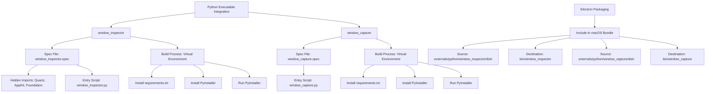
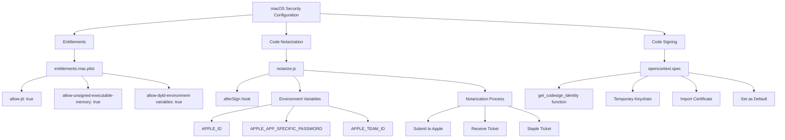
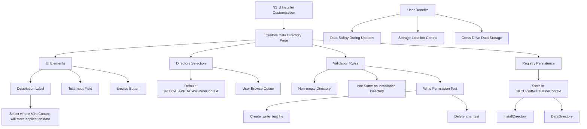

```mermaid
graph TD
A[Build Pipeline] --> B[Frontend Compilation]
A --> C[Backend Bundling]
A --> D[Electron Packaging]
A --> E[Platform-Specific Processing]
B --> B1[TypeScript Compilation]
B1 --> B1a[electron-vite build]
B1 --> B1b[React Component Bundling]
B1 --> B1c[Asset Optimization]
C --> C1[Python Virtual Environment]
C1 --> C1a[Install Dependencies]
C1 --> C1b[PyInstaller Execution]
C1 --> C1c[opencontext.spec Configuration]
C --> C2[External Python Tools]
C2 --> C2a[window_inspector.spec]
C2 --> C2b[window_capture.spec]
D --> D1[electron-builder]
D1 --> D1a[electron-builder.yml]
D1 --> D1b[File Inclusion/Exclusion]
D1 --> D1c[Resource Packaging]
E --> E1[macOS]
E1 --> E1a[Entitlements Application]
E1 --> E1b[Code Signing]
E1 --> E1c[Notarization via notarize.js]
E --> E2[Windows]
E2 --> E2a[NSIS Installer Creation]
E2 --> E2b[Custom installer.nsh Script]
E2 --> E2c[Registry Configuration]
E --> E3[Linux]
E3 --> E3a[AppImage Generation]
E3 --> E3b[snap Package]
E3 --> E3c[deb Package]
F[Runtime Configuration] --> F1[hook-opencontext.py]
F1 --> F1a[Resource Path Resolution]
F1 --> F1b[Environment Variable Setup]
```

# Production Packaging

<cite>
**Referenced Files in This Document**   
- [build.sh](file://build.sh)
- [build.bat](file://build.bat)
- [electron-builder.yml](file://frontend/electron-builder.yml)
- [entitlements.mac.plist](file://frontend/build/entitlements.mac.plist)
- [notarize.js](file://frontend/build/notarize.js)
- [installer.nsh](file://frontend/build/installer.nsh)
- [window_capture.spec](file://frontend/externals/python/window_capture/window_capture.spec)
- [window_inspector.spec](file://frontend/externals/python/window_inspector/window_inspector.spec)
- [build-python.js](file://frontend/build-python.js)
- [build-python.sh](file://frontend/build-python.sh)
- [opencontext.spec](file://opencontext.spec)
- [hook-opencontext.py](file://hook-opencontext.py)
</cite>

## Table of Contents
1. [Cross-Platform Build Scripts](#cross-platform-build-scripts)
2. [Electron Builder Configuration](#electron-builder-configuration)
3. [Python Executable Integration](#python-executable-integration)
4. [macOS Security and Notarization](#macos-security-and-notarization)
5. [Installer Customization](#installer-customization)
6. [Build Pipeline Overview](#build-pipeline-overview)

## Cross-Platform Build Scripts

The MineContext packaging process is coordinated through two primary build scripts: `build.sh` for Linux/macOS and `build.bat` for Windows. These scripts handle the complete build lifecycle from dependency installation to executable generation. The build process begins with dependency verification, checking for the presence of Python 3 and the `uv` package manager. When `uv` is available, it is used for dependency management; otherwise, the scripts fall back to standard `pip` installation. Both scripts ensure PyInstaller is installed before proceeding with the build.

The core build process involves cleaning previous build artifacts (`dist/` and `build/` directories), executing PyInstaller with the `opencontext.spec` configuration, and verifying the output executable. After successful build completion, the scripts copy the `config` directory to the distribution folder and provide instructions for running the application. Platform-specific considerations are implemented, such as ad-hoc code signing on macOS to address Gatekeeper requirements. The Windows script uses batch commands for directory operations and file verification, while the Linux/macOS script employs standard Unix commands. Both scripts implement comprehensive error handling, terminating the build process if any step fails.

**Section sources**
- [build.sh](file://build.sh#L1-L91)
- [build.bat](file://build.bat#L1-L123)

## Electron Builder Configuration

The `electron-builder.yml` configuration file defines the packaging parameters for the Electron application, specifying build targets, file inclusions, and platform-specific settings. The configuration identifies the application with `appId: com.vikingdb.desktop` and `productName: MineContext`, with output directed to the `dist` directory. The `files` section explicitly excludes development-related files and configuration files that should not be included in the final package, while the `extraResources` directive includes the backend executable and configuration files.

For Windows, the configuration specifies NSIS (Nullsoft Scriptable Install System) as the installer format with detailed customization options. The installer creates desktop shortcuts, allows users to change the installation directory, and supports per-user installation. On macOS, the configuration includes critical security entitlements through `entitlementsInherit: build/entitlements.mac.plist` and defines usage descriptions for camera, microphone, and file system access. The Linux configuration targets multiple formats including AppImage, snap, and deb packages, categorizing the application as a Utility.

**Section sources**
- [electron-builder.yml](file://frontend/electron-builder.yml#L1-L72)

```mermaid
graph TD
A[Electron Builder Configuration] --> B[Common Settings]
A --> C[Windows NSIS]
A --> D[macOS Settings]
A --> E[Linux Targets]
B --> B1[App ID: com.vikingdb.desktop]
B --> B2[Product Name: MineContext]
B --> B3[Output: dist/]
B --> B4[Extra Resources: backend/]
C --> C1[Setup Name: ${name}-${version}-setup.${ext}]
C --> C2[Desktop Shortcut: always]
C --> C3[Installation Directory: customizable]
C --> C4[Installer Script: build/installer.nsh]
D --> D1[Entitlements: build/entitlements.mac.plist]
D --> D2[Usage Descriptions: Camera, Microphone, etc.]
D --> D3[Notarization: false]
D --> D4[After Sign: build/notarize.js]
E --> E1[AppImage: ${name}-${version}.${ext}]
E --> E2[Targets: AppImage, snap, deb]
E --> E3[Category: Utility]
```

**Diagram sources**
- [electron-builder.yml](file://frontend/electron-builder.yml#L1-L72)

## Python Executable Integration

MineContext integrates two Python-based executables—`window_capture` and `window_inspector`—into its final package, which are essential for window management and screen capture functionality on macOS. These executables are built using PyInstaller from their respective `.spec` files located in the `frontend/externals/python/` directory. The `window_inspector.spec` configuration includes specific hidden imports for macOS frameworks like Quartz, CoreGraphics, AppKit, and Foundation, which are required for the application to interact with the operating system's window management system.

The build process for these Python components is orchestrated through `build-python.js` and `build-python.sh` scripts, which create isolated virtual environments, install dependencies, and execute PyInstaller. The Electron builder configuration explicitly includes these executables in the macOS package through the `extraResources` directive, mapping `window_inspector` and `window_capture` binaries to the `bin/` directory within the application bundle. This integration allows the Electron application to spawn these Python processes as needed for window inspection and capture operations, with proper path resolution handled through environment variables set in the runtime hook.

**Section sources**
- [window_capture.spec](file://frontend/externals/python/window_capture/window_capture.spec#L1-L48)
- [window_inspector.spec](file://frontend/externals/python/window_inspector/window_inspector.spec#L1-L56)
- [build-python.js](file://frontend/build-python.js#L1-L134)
- [build-python.sh](file://frontend/build-python.sh#L1-L90)
- [electron-builder.yml](file://frontend/electron-builder.yml#L37-L42)



**Diagram sources**
- [window_inspector.spec](file://frontend/externals/python/window_inspector/window_inspector.spec#L1-L56)
- [window_capture.spec](file://frontend/externals/python/window_capture/window_capture.spec#L1-L48)
- [electron-builder.yml](file://frontend/electron-builder.yml#L37-L42)

## macOS Security and Notarization

The MineContext application implements comprehensive macOS security configurations to ensure proper functionality and compliance with Apple's security requirements. The `entitlements.mac.plist` file grants critical permissions that allow the application to function effectively on modern macOS systems. These entitlements include `com.apple.security.cs.allow-jit` for just-in-time compilation, `com.apple.security.cs.allow-unsigned-executable-memory` for dynamic code generation, and `com.apple.security.cs.allow-dyld-environment-variables` for dynamic linker environment variable access—permissions essential for Python-based applications that use JIT compilation and dynamic loading.

Code notarization is handled through the `notarize.js` script, which is specified in the `afterSign` hook of the electron-builder configuration. This script uses the `@electron/notarize` package to submit the application to Apple's notarization service, requiring authentication credentials via environment variables (`APPLE_ID`, `APPLE_APP_SPECIFIC_PASSWORD`, and `APPLE_TEAM_ID`). The notarization process verifies that the application is free from known malware and meets Apple's security standards, allowing it to bypass Gatekeeper warnings on macOS. For the main Python executable, code signing is dynamically configured in the `opencontext.spec` file, which creates a temporary keychain and imports the signing certificate when building on macOS with the appropriate environment variables.

**Section sources**
- [entitlements.mac.plist](file://frontend/build/entitlements.mac.plist#L1-L13)
- [notarize.js](file://frontend/build/notarize.js#L1-L27)
- [opencontext.spec](file://opencontext.spec#L1-L127)



**Diagram sources**
- [entitlements.mac.plist](file://frontend/build/entitlements.mac.plist#L1-L13)
- [notarize.js](file://frontend/build/notarize.js#L1-L27)
- [opencontext.spec](file://opencontext.spec#L1-L127)

## Installer Customization

The Windows installer for MineContext is customized using the NSIS (Nullsoft Scriptable Install System) scripting language through the `installer.nsh` file. This script extends the default installer functionality by adding a custom page that allows users to select a dedicated data directory for application data storage. This separation of installation and data directories follows best practices for application deployment, preventing data loss during application updates and allowing users to store data on different drives.

The custom installer page provides a user-friendly interface with a description of the data directory purpose, a text input field showing the current selection, and a browse button for directory selection. Comprehensive validation ensures the selected directory is not empty, is different from the installation directory, and has write permissions. The validation process creates a temporary test file to verify write access before accepting the directory. User selections are persisted in the Windows Registry under `HKCU\Software\MineContext`, allowing the application to locate its data directory on subsequent launches. This customization enhances the user experience by providing control over data storage location while maintaining application reliability.

**Section sources**
- [installer.nsh](file://frontend/build/installer.nsh#L1-L112)



**Diagram sources**
- [installer.nsh](file://frontend/build/installer.nsh#L1-L112)

## Build Pipeline Overview

The MineContext build pipeline integrates multiple technologies to create a distributable application package. The process begins with TypeScript compilation for the Electron frontend, followed by Python bundling for the backend services using PyInstaller. The `opencontext.spec` file configures the bundling of the Python application, including data files and hidden imports, while the `hook-opencontext.py` file ensures proper resource path resolution at runtime. The Electron packaging process, managed by electron-builder, combines the compiled frontend with the bundled Python executables and additional resources.

The complete build workflow is orchestrated through npm scripts in the frontend package.json, which coordinate the execution of build steps in the correct sequence. The pipeline handles platform-specific requirements, including code signing and notarization on macOS, custom installer creation on Windows, and multi-format packaging on Linux. Environment variables control sensitive operations like code signing and notarization, allowing the same build configuration to be used across different deployment environments. This comprehensive approach ensures that MineContext can be reliably packaged for distribution across all supported platforms while maintaining security and usability standards.

**Section sources**
- [opencontext.spec](file://opencontext.spec#L1-L127)
- [hook-opencontext.py](file://hook-opencontext.py#L1-L28)
- [package.json](file://frontend/package.json#L1-L153)
- [electron.vite.config.ts](file://frontend/electron.vite.config.ts#L1-L84)



**Diagram sources**
- [opencontext.spec](file://opencontext.spec#L1-L127)
- [hook-opencontext.py](file://hook-opencontext.py#L1-L28)
- [electron-builder.yml](file://frontend/electron-builder.yml#L1-L72)
- [electron.vite.config.ts](file://frontend/electron.vite.config.ts#L1-L84)