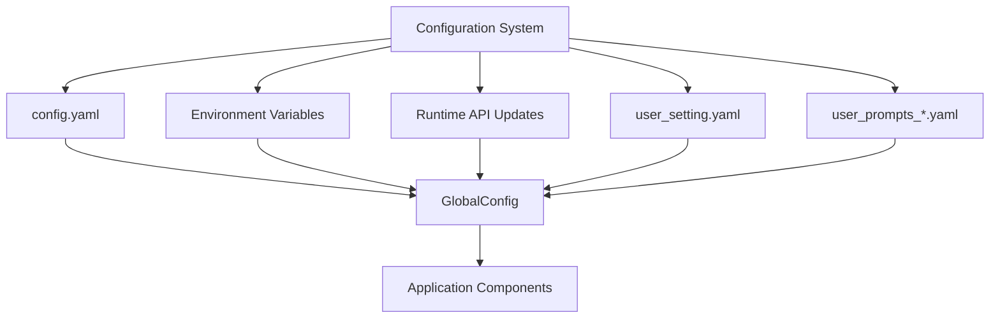
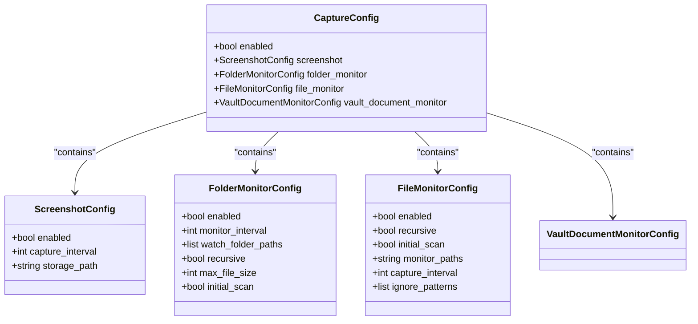
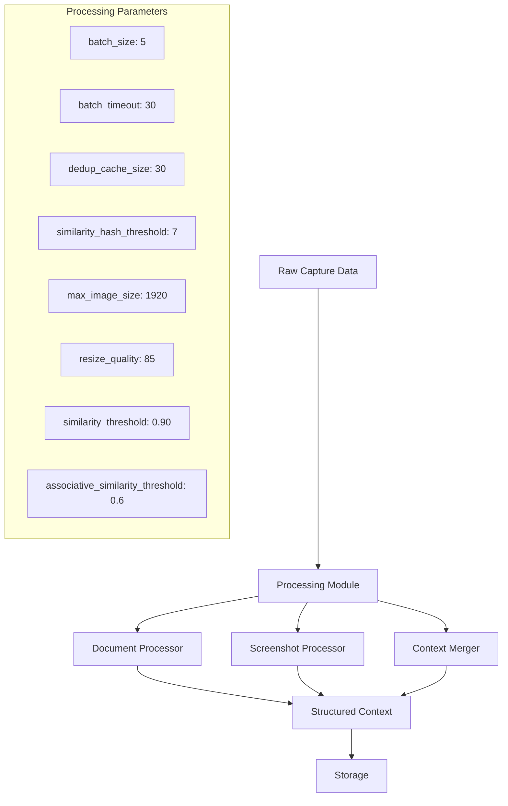
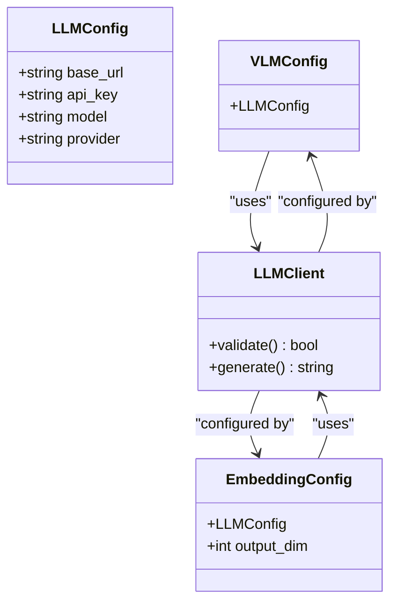
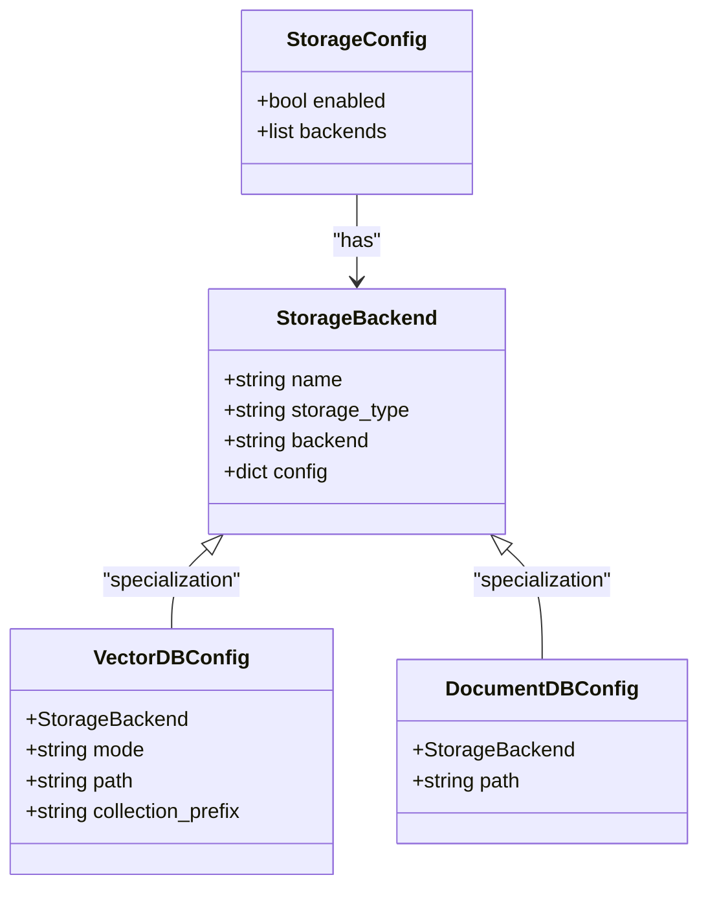
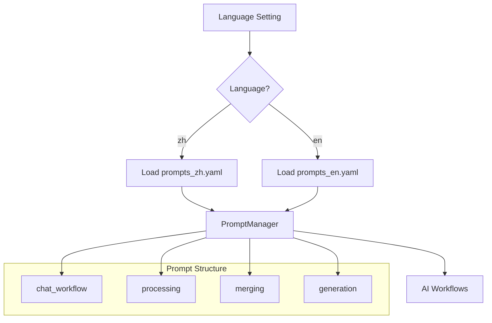
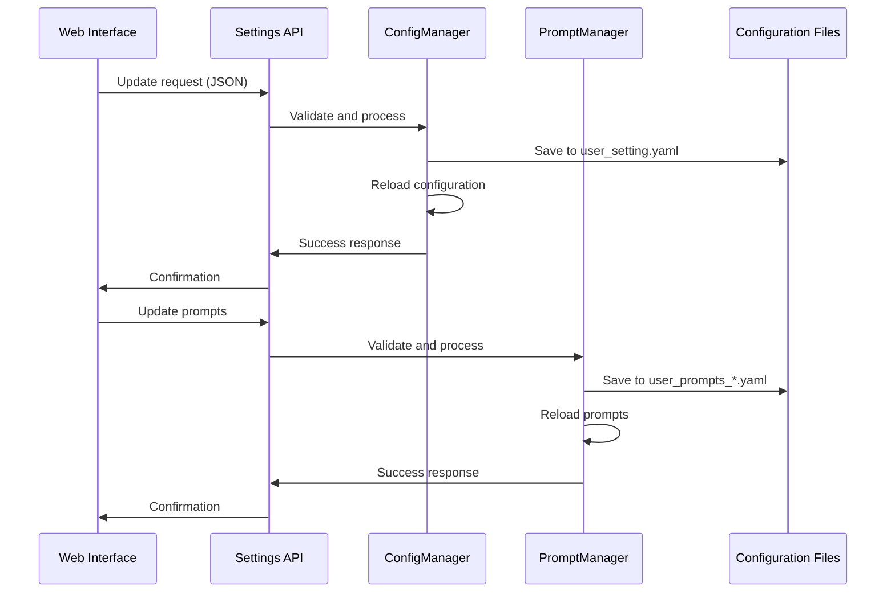
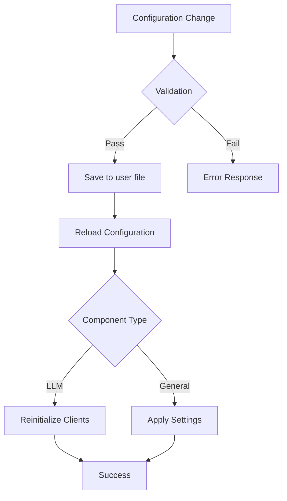

# Configuration Files

<cite>
**Referenced Files in This Document**   
- [config.yaml](file://config/config.yaml)
- [prompts_en.yaml](file://config/prompts_en.yaml)
- [prompts_zh.yaml](file://config/prompts_zh.yaml)
- [config_manager.py](file://opencontext/config/config_manager.py)
- [prompt_manager.py](file://opencontext/config/prompt_manager.py)
- [global_config.py](file://opencontext/config/global_config.py)
- [settings.py](file://opencontext/server/routes/settings.py)
</cite>

## Table of Contents
1. [Introduction](#introduction)
2. [Core Configuration Structure](#core-configuration-structure)
3. [Capture Module Configuration](#capture-module-configuration)
4. [Processing Module Configuration](#processing-module-configuration)
5. [LLM and AI Integration Settings](#llm-and-ai-integration-settings)
6. [Storage Configuration](#storage-configuration)
7. [Prompts Configuration System](#prompts-configuration-system)
8. [Runtime Configuration Management](#runtime-configuration-management)
9. [Best Practices and Validation](#best-practices-and-validation)

## Introduction
The MineContext application utilizes a comprehensive configuration system centered around YAML files that control various aspects of the application's behavior. The primary configuration file, `config.yaml`, serves as the central hub for system-wide settings, while `prompts_en.yaml` and `prompts_zh.yaml` provide multilingual prompt templates for AI interactions. This documentation details the structure, purpose, and usage of these configuration files, explaining how they work together to control capture settings, processing behavior, AI integration parameters, and system-wide options.

The configuration system follows a layered approach where default values can be overridden by file configurations, environment variables, and runtime API updates. The system uses a singleton pattern through the GlobalConfig class to provide a unified interface for accessing configurations across all components, ensuring consistency and avoiding the need to pass configuration objects between components.

**Section sources**
- [config.yaml](file://config/config.yaml#L1-L253)
- [global_config.py](file://opencontext/config/global_config.py#L23-L331)

## Core Configuration Structure
The `config.yaml` file serves as the central configuration file for MineContext, organizing settings into logical modules that correspond to different system components. The file begins with general switches and logging configuration, followed by specialized sections for each functional module.

The configuration starts with a global `enabled` flag that acts as a master switch for the entire system. The `logging` section configures the application's logging behavior, including log level and output path. Environment variable substitution is supported throughout the configuration using the `${VAR}` syntax for simple variables and `${VAR:default}` for variables with default values, allowing for flexible deployment across different environments.

**Diagram sources**
- [config.yaml](file://config/config.yaml#L1-L253)
- [config_manager.py](file://opencontext/config/config_manager.py#L37-L101)
- [global_config.py](file://opencontext/config/global_config.py#L90-L113)

The configuration system implements a hierarchical merging strategy where user-specific settings in `user_setting.yaml` are deep-merged with the base configuration, allowing users to override specific settings without modifying the main configuration file. This approach enables safe updates to the base configuration while preserving user customizations.

**Section sources**
- [config.yaml](file://config/config.yaml#L1-L253)
- [config_manager.py](file://opencontext/config/config_manager.py#L120-L141)

## Capture Module Configuration
The capture module configuration controls how MineContext collects data from various sources, including screenshots, file system monitoring, and document tracking. This module is organized under the `capture` section in the configuration file and contains several sub-components that can be individually enabled or disabled.

The screenshot capture functionality is configured with parameters such as `capture_interval` (in seconds) and `storage_path` for saving captured images. File monitoring is available through multiple mechanisms: `folder_monitor` for watching specific directories, `file_monitor` for general file system monitoring with ignore patterns, and `vault_document_monitor` for tracking documents within the user's vault. Each capture method has configurable intervals, initial scan options, and file size limits to optimize performance and resource usage.

**Diagram sources**
- [config.yaml](file://config/config.yaml#L39-L75)
- [config_manager.py](file://opencontext/config/config_manager.py#L37-L101)

The capture module supports environment variable substitution in paths, allowing for dynamic configuration of storage locations based on the deployment environment. For example, the screenshot storage path uses `${CONTEXT_PATH:.}/screenshots`, where `CONTEXT_PATH` can be set as an environment variable to redirect output to different locations.

**Section sources**
- [config.yaml](file://config/config.yaml#L39-L75)

## Processing Module Configuration
The processing module handles the transformation and analysis of captured data, converting raw inputs into structured context that can be stored and retrieved. This module is configured under the `processing` section and includes settings for document processing, screenshot analysis, and context merging.

Document processing is controlled by the `document_processor` configuration, which includes batch processing settings like `batch_size` and `batch_timeout`. Screenshot processing has more extensive configuration options, including deduplication settings (`dedup_cache_size`, `similarity_hash_threshold`), image processing parameters (`max_image_size`, `resize_quality`), and performance tuning options (`batch_size`, `batch_timeout`).

The context merging functionality is particularly sophisticated, with configurable similarity thresholds for different context types and intelligent merging strategies. The configuration includes global settings like `similarity_threshold` and `associative_similarity_threshold`, as well as type-specific thresholds for entity, activity, intent, semantic, procedural, and state contexts. Memory management and cleanup intervals can also be configured to optimize system performance.

**Diagram sources**
- [config.yaml](file://config/config.yaml#L76-L144)
- [processing](file://opencontext/context_processing)

The processing module also includes configuration for memory management and cleanup intervals, allowing users to balance between retaining historical context and managing system resources. The `cleanup_interval_hours` setting controls how frequently the system checks for expired contexts to remove, while retention days settings for each context type determine how long different types of information are preserved.

**Section sources**
- [config.yaml](file://config/config.yaml#L76-L144)

## LLM and AI Integration Settings
The AI integration settings configure how MineContext interacts with Large Language Models (LLMs) and other AI services. These settings are critical for the application's intelligent capabilities and are organized into separate configurations for different AI services.

The `vlm_model` section configures the Vision Language Model used for analyzing screenshots and other visual content, while the `embedding_model` section configures the model used for creating vector embeddings of text content. Both configurations include standard parameters like `base_url`, `api_key`, and `model`, with the embedding model also specifying `output_dim` to match the vector database requirements.

**Diagram sources**
- [config.yaml](file://config/config.yaml#L26-L37)
- [llm_client.py](file://opencontext/llm/llm_client.py)
- [global_vlm_client.py](file://opencontext/llm/global_vlm_client.py)

The system supports environment variable substitution for API keys and URLs, allowing secure configuration without exposing sensitive credentials in the configuration file. For example, the configuration uses `${LLM_BASE_URL}`, `${LLM_API_KEY}`, and related environment variables to externalize these sensitive values.

The AI integration also includes content generation settings under the `content_generation` section, which configures automated tasks like activity monitoring, smart tip generation, todo extraction, and daily report generation. Each task has configurable intervals and can be individually enabled or disabled based on user preferences.

**Section sources**
- [config.yaml](file://config/config.yaml#L26-L37)
- [config.yaml](file://config/config.yaml#L217-L239)

## Storage Configuration
The storage module configuration defines how MineContext persists data using a multi-backend approach that combines different storage technologies for optimal performance and reliability. The configuration is organized under the `storage` section and supports multiple storage backends that can be enabled simultaneously.

The system uses a hybrid storage architecture with vector databases for semantic search and retrieval, and document databases for structured data storage. The configuration includes a `backends` list where each storage backend is defined with a name, storage type, backend implementation, and specific configuration parameters.

**Diagram sources**
- [config.yaml](file://config/config.yaml#L146-L182)
- [base_storage.py](file://opencontext/storage/base_storage.py)

The default configuration includes ChromaDB as the vector database backend with local file storage, but users can switch to Qdrant by uncommenting the alternative configuration. The document database uses SQLite for storing structured data like application settings and metadata. The configuration supports environment variable substitution in paths, allowing for flexible deployment configurations.

The vector database configuration includes important parameters like `collection_prefix` to avoid naming conflicts and `path` to specify the storage location. For Qdrant, additional configuration options are available for server mode operation, including host, port, HTTPS settings, and API key authentication.

**Section sources**
- [config.yaml](file://config/config.yaml#L146-L182)

## Prompts Configuration System
The prompts configuration system provides multilingual support for AI interactions through `prompts_en.yaml` and `prompts_zh.yaml` files. These files contain structured prompt templates organized by workflow components, enabling consistent and context-aware AI responses in both English and Chinese.

The prompt system is managed by the PromptManager class, which loads the appropriate prompts file based on the language setting in `config.yaml`. The `prompts` section in the main configuration specifies the current language, which defaults to "zh" (Chinese) but can be changed to "en" (English). When the language is changed, the system automatically loads the corresponding prompts file (`prompts_en.yaml` or `prompts_zh.yaml`).

**Diagram sources**
- [config.yaml](file://config/config.yaml#L213-L214)
- [prompts_en.yaml](file://config/prompts_en.yaml#L1-L800)
- [prompts_zh.yaml](file://config/prompts_zh.yaml#L1-L800)
- [prompt_manager.py](file://opencontext/config/prompt_manager.py#L17-L220)

The prompts are organized into several major sections corresponding to different AI workflows:
- `chat_workflow`: Handles conversational interactions, including intent analysis, query classification, and response generation
- `processing`: Contains prompts for extracting and analyzing context from captured data
- `merging`: Includes prompts for intelligently merging related context items
- `generation`: Configures automated content generation tasks

Each prompt template uses a consistent structure with `system` and `user` components, where the system prompt defines the AI's role and instructions, and the user prompt provides the input format with placeholders for dynamic content. The templates include extensive documentation and examples to ensure consistent behavior across different language versions.

The system supports user customization through `user_prompts_*.yaml` files, which are automatically created in the same directory as the base prompts files. Users can modify prompts through the web interface, and changes are saved to these user-specific files, preserving the original configuration for updates.

**Section sources**
- [config.yaml](file://config/config.yaml#L213-L214)
- [prompts_en.yaml](file://config/prompts_en.yaml#L1-L800)
- [prompts_zh.yaml](file://config/prompts_zh.yaml#L1-L800)
- [prompt_manager.py](file://opencontext/config/prompt_manager.py#L17-L220)

## Runtime Configuration Management
MineContext provides a comprehensive runtime configuration management system that allows users to modify settings through a web interface without restarting the application. The system exposes REST APIs through the `settings.py` routes file, enabling dynamic updates to both configuration settings and prompts.

The configuration management follows a layered approach where changes made through the API are saved to user-specific configuration files (`user_setting.yaml` and `user_prompts_*.yaml`), preserving the original configuration files for updates. This approach ensures that user customizations are not lost when the application is updated.

**Diagram sources**
- [settings.py](file://opencontext/server/routes/settings.py#L1-L791)
- [config_manager.py](file://opencontext/config/config_manager.py#L168-L223)
- [prompt_manager.py](file://opencontext/config/prompt_manager.py#L99-L146)

The system provides separate endpoints for different configuration categories:
- `/api/model_settings/update`: Updates LLM configuration and reinitializes clients
- `/api/settings/general`: Updates general system settings like capture and processing parameters
- `/api/settings/prompts`: Updates prompt templates
- `/api/settings/prompts/language`: Changes the active language and reloads prompts

When configuration changes are applied, the system performs validation before saving and automatically reloads the updated configuration to ensure changes take effect immediately. For LLM settings, the system validates the API keys and model availability before applying changes to prevent configuration errors.

The configuration management system also includes debugging and testing features, such as the ability to export and import prompt configurations, view debug history for content generation tasks, and regenerate content with custom prompts to compare results. These features support iterative refinement of the AI behavior through prompt engineering.

**Section sources**
- [settings.py](file://opencontext/server/routes/settings.py#L1-L791)

## Best Practices and Validation
When modifying MineContext configuration files, several best practices should be followed to ensure system stability and optimal performance. The configuration system includes built-in validation mechanisms to prevent common errors and ensure configuration integrity.

For YAML syntax, it's essential to maintain proper indentation and use consistent formatting. The system uses PyYAML for parsing, which is sensitive to indentation errors. When modifying prompts, users should preserve the structure of the prompt templates, including the `system` and `user` components and their respective formatting with pipe symbols (`|`) for multi-line strings.

Environment variable substitution follows specific patterns: `${VAR}` for simple variables and `${VAR:default}` for variables with default values. Users should ensure that required environment variables are set in their deployment environment, particularly for sensitive information like API keys and URLs.

**Diagram sources**
- [config_manager.py](file://opencontext/config/config_manager.py#L67-L100)
- [settings.py](file://opencontext/server/routes/settings.py#L108-L196)

The system performs validation at multiple levels:
1. **Syntax validation**: Ensures YAML files are properly formatted
2. **Semantic validation**: Checks that configuration values are within acceptable ranges
3. **External validation**: For LLM settings, tests API connectivity and authentication
4. **Consistency validation**: Ensures related settings are compatible

When troubleshooting configuration issues, users should check the application logs for error messages, verify that environment variables are properly set, and validate YAML syntax using online tools or IDE plugins. The system's debug mode can be enabled to save detailed information about content generation processes, which can be invaluable for diagnosing prompt-related issues.

Regular backups of configuration files are recommended before making significant changes, and users should test configuration changes in a development environment before applying them to production systems. The ability to reset all settings to defaults through the web interface provides a safety net for recovering from problematic configurations.

**Section sources**
- [config_manager.py](file://opencontext/config/config_manager.py#L67-L100)
- [settings.py](file://opencontext/server/routes/settings.py#L108-L196)
- [config.yaml](file://config/config.yaml#L1-L253)