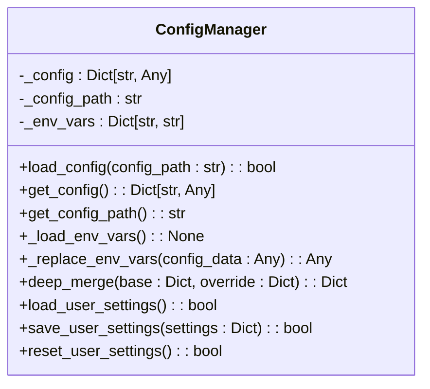
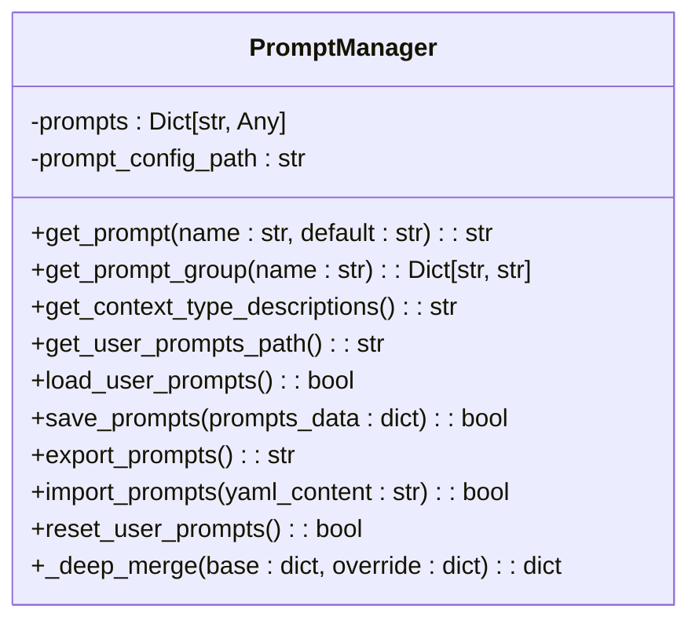
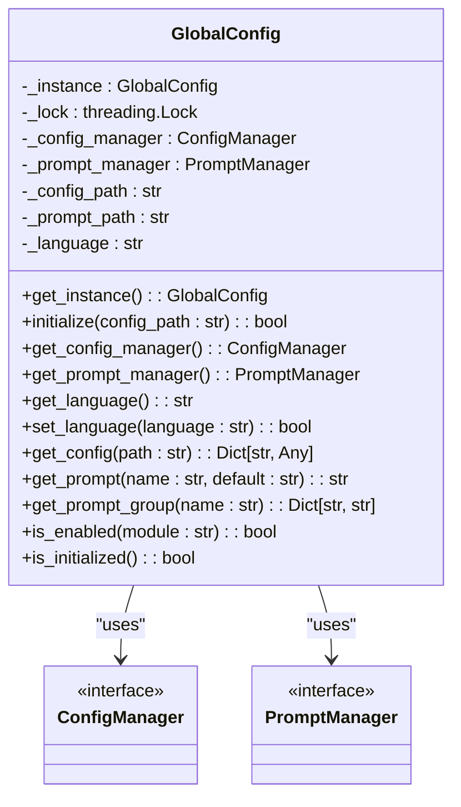

# Configuration Management

<cite>
**Referenced Files in This Document**   
- [config.yaml](file://config/config.yaml)
- [prompts_en.yaml](file://config/prompts_en.yaml)
- [prompts_zh.yaml](file://config/prompts_zh.yaml)
- [config_manager.py](file://opencontext/config/config_manager.py)
- [prompt_manager.py](file://opencontext/config/prompt_manager.py)
- [global_config.py](file://opencontext/config/global_config.py)
</cite>

## Table of Contents
1. [Introduction](#introduction)
2. [Configuration File Structure](#configuration-file-structure)
3. [ConfigManager Class](#configmanager-class)
4. [Environment Variables and Configuration](#environment-variables-and-configuration)
5. [Prompt Configuration System](#prompt-configuration-system)
6. [Global Configuration Access](#global-configuration-access)
7. [Configuration Usage Examples](#configuration-usage-examples)
8. [Conclusion](#conclusion)

## Introduction
MineContext employs a comprehensive YAML-based configuration system that enables flexible control over application settings and behavior. The system centers around the config.yaml file as the primary configuration source, supplemented by specialized prompt configuration files for multilingual AI interactions. The configuration management architecture provides a hierarchical approach to settings management, allowing for default values, environment variable overrides, and user-specific customizations. This document details the structure and functionality of the configuration system, explaining how settings are organized, loaded, validated, and accessed throughout the application.

**Section sources**
- [config.yaml](file://config/config.yaml#L1-L253)
- [config_manager.py](file://opencontext/config/config_manager.py#L1-L253)

## Configuration File Structure
The config.yaml file serves as the central configuration file for MineContext, organizing settings into logical sections that correspond to different system modules. The configuration structure follows a hierarchical organization with top-level sections for capture, processing, storage, consumption, and system behavior. Each section contains specific parameters that control the functionality of its corresponding module.

The configuration begins with general settings including a global enabled flag and logging configuration. The logging section specifies the log level and output path, using the DEBUG level by default and directing logs to a file within the context path. A user_setting_path parameter points to a separate YAML file where user-specific settings are stored, enabling persistence of user preferences without modifying the main configuration.

The document_processing section configures document handling parameters such as batch size for VLM processing, maximum image size, and DPI for PDF conversion. It also includes a text_threshold_per_page setting that determines when documents are considered scanned based on character count, triggering VLM analysis for image-based content.

The capture module contains subsections for different capture methods including screenshot, folder_monitor, file_monitor, and vault_document_monitor. Each capture method has configurable parameters such as enabled status, intervals, storage paths, and file size limits. For example, the screenshot capture can be configured with a capture_interval in seconds and a storage_path for saving captured images.

The processing module configures document and screenshot processors with parameters for batch processing, timeout settings, and image optimization. The context_merger subsection includes sophisticated settings for intelligent merging of context information, with thresholds for similarity, associative similarity, and type-specific configurations for different context types like ENTITY_CONTEXT, activity_context, and intent_context.

The storage module defines the persistence strategy with configurable backends for vector and document databases. It supports multiple storage options including ChromaDB and Qdrant for vector storage, and SQLite for document storage, with configurable paths and collection prefixes.

Additional sections configure the web server host and port, API authentication settings, content generation intervals, and tool configurations such as web search engine and result limits. The prompts section specifies the default language for prompt templates, which determines which prompt file (prompts_en.yaml or prompts_zh.yaml) is loaded.

**Section sources**
- [config.yaml](file://config/config.yaml#L1-L253)

## ConfigManager Class
The ConfigManager class is responsible for loading, validating, and providing access to configuration values in the MineContext system. Implemented as a Python class in config_manager.py, it serves as the primary interface for configuration management, handling the loading of YAML configuration files, environment variable substitution, and user settings integration.

The class initializes with internal state variables to store the configuration data, configuration file path, and environment variables. The load_config method is the primary entry point for configuration loading, which accepts an optional config_path parameter. If no path is provided, it defaults to "config/config.yaml". The method first checks for the existence of the specified configuration file, raising a FileNotFoundError if the file cannot be found.

Once the configuration file is located, it is loaded using PyYAML's safe_load function, which parses the YAML content into a Python dictionary structure. The configuration manager then loads all environment variables from the system and processes the configuration data to replace environment variable references. The _replace_env_vars method recursively traverses the configuration data structure, identifying and substituting environment variable references in the format ${VAR} or ${VAR:default} where a default value is provided.

The class implements a deep_merge method that combines configuration dictionaries hierarchically, preserving nested structures while overriding values from the base configuration with those from the override configuration. This method is used to merge user settings from the user_setting.yaml file into the main configuration, allowing user preferences to override default settings without modifying the primary configuration file.

The ConfigManager provides methods for saving and resetting user settings. The save_user_settings method extracts specific configuration sections (such as vlm_model, embedding_model, and content_generation) from provided settings and merges them into the user settings file, then reloads the configuration to incorporate the changes. The reset_user_settings method deletes the user settings file and reloads the main configuration, effectively restoring default settings.

Additional utility methods include get_config for retrieving the complete configuration dictionary and get_config_path for accessing the path of the loaded configuration file. The class is designed to be instantiated once and reused throughout the application lifecycle, providing consistent access to configuration values.

**Diagram sources**
- [config_manager.py](file://opencontext/config/config_manager.py#L24-L253)

**Section sources**
- [config_manager.py](file://opencontext/config/config_manager.py#L24-L253)

## Environment Variables and Configuration
MineContext supports environment variable integration as part of its configuration system, allowing runtime customization of settings without modifying configuration files. The ConfigManager class automatically loads all environment variables from the system environment and uses them to substitute values in the configuration file.

The environment variable substitution supports two formats: ${VAR} for simple variable references and ${VAR:default} for variables with default values. When the configuration loader encounters these patterns in string values, it replaces them with the corresponding environment variable values. If a referenced environment variable does not exist, the ${VAR:default} format uses the specified default value, while the ${VAR} format results in None.

Key environment variables referenced in the configuration include CONTEXT_PATH, which defines the base directory for the application's data and configuration files. Other important variables include LLM_BASE_URL, LLM_API_KEY, LLM_MODEL, EMBEDDING_BASE_URL, EMBEDDING_API_KEY, and EMBEDDING_MODEL, which configure the AI model endpoints and authentication. These variables allow users to specify different AI service providers and credentials without exposing sensitive information in configuration files.

The system also supports QDRANT_API_KEY for authenticating with the Qdrant vector database when that storage backend is used. This environment variable integration follows security best practices by enabling sensitive credentials to be managed externally from the configuration files.

The environment variable system works in conjunction with the hierarchical configuration approach, where environment variables take precedence over values in the configuration file. This allows for flexible deployment scenarios where default configuration files can be packaged with the application, while environment-specific settings (such as API keys and service endpoints) are provided through the deployment environment.

This approach enables secure configuration management in different environments, from development to production, without requiring changes to the configuration files themselves. It also facilitates containerized deployments where configuration can be injected through environment variables at runtime.

**Section sources**
- [config.yaml](file://config/config.yaml#L27-L37)
- [config_manager.py](file://opencontext/config/config_manager.py#L62-L99)

## Prompt Configuration System
The prompt configuration system in MineContext supports multilingual AI interactions through dedicated prompt files for different languages. The system uses prompts_en.yaml for English prompts and prompts_zh.yaml for Chinese prompts, with the active language determined by the language setting in the main configuration file.

The PromptManager class handles the loading and management of prompt configurations. It initializes with a specified prompt configuration path and loads the corresponding YAML file into a dictionary structure. The class provides methods for retrieving individual prompts and prompt groups using dot notation to navigate the nested structure. For example, get_prompt("chat_workflow.intent_analysis.system") retrieves the system prompt for intent analysis in the chat workflow.

The prompt files contain comprehensive templates for different stages of AI interaction, including intent analysis, query classification, social interaction handling, and various executor tasks. Each prompt is structured with system and user components, where the system prompt defines the AI's role and instructions, and the user prompt provides the input template with placeholders for dynamic content.

The system supports user customization through user-specific prompt files. The PromptManager can load user prompts from files like user_prompts_zh.yaml and merge them with the base prompts, allowing users to customize AI behavior without modifying the original prompt files. The save_prompts method uses a custom YAML dumper to preserve multi-line formatting, ensuring that complex prompt templates maintain their structure when saved.

The prompt configuration includes sophisticated templates for different AI capabilities. The chat_workflow section contains prompts for intent analysis, query classification, and social interaction handling. The executor section defines prompts for content generation, editing, and answering tasks, with detailed instructions for information usage principles, answer strategies, and quality control standards.

The context_collection section includes prompts for tool analysis, result validation, and sufficiency evaluation, enabling the AI to intelligently plan and execute retrieval operations. The processing section contains prompts for screenshot analysis with detailed extraction principles and style matching requirements for different context types.

The merging section includes prompts for context merging multiple items and batch merging of screenshots, with specific instructions for content fusion and metadata integration. The generation section contains prompts for merging hourly reports with intelligence aggregation and value-oriented principles.

**Diagram sources**
- [prompt_manager.py](file://opencontext/config/prompt_manager.py#L17-L220)

**Section sources**
- [prompts_en.yaml](file://config/prompts_en.yaml#L1-L800)
- [prompts_zh.yaml](file://config/prompts_zh.yaml#L1-L800)
- [prompt_manager.py](file://opencontext/config/prompt_manager.py#L17-L220)

## Global Configuration Access
MineContext provides a GlobalConfig class that implements the singleton pattern to offer a unified interface for accessing configuration and prompt values throughout the application. This global configuration manager eliminates the need to pass configuration objects between components, providing centralized access to settings.

The GlobalConfig class is implemented as a thread-safe singleton using a class-level lock to ensure only one instance exists. It maintains references to the ConfigManager and PromptManager instances, providing convenience methods for accessing configuration values and prompts. The class automatically initializes when first accessed, attempting to load the default configuration file if not explicitly initialized.

The initialization process first creates and loads the ConfigManager, then initializes the PromptManager based on the language setting in the main configuration. The prompt manager loads the appropriate prompt file (prompts_en.yaml or prompts_zh.yaml) based on the configured language, and also loads any user-specific prompts from the corresponding user_prompts file.

The GlobalConfig class provides several convenience methods for configuration access. The get_config method retrieves configuration values by path using dot notation (e.g., "processing.screenshot_processor.batch_size"), returning None if the path does not exist. The get_prompt method retrieves individual prompts by name, while get_prompt_group returns an entire group of related prompts as a dictionary.

Additional utility methods include is_enabled for checking if a module is enabled based on its enabled flag in the configuration, and get_language for retrieving the current language setting. The class also provides a set_language method that updates the language setting, saves it to user settings, and reloads the prompt manager with the new language.

To simplify access, the configuration module exports several convenience functions at the package level, including get_config, get_prompt, and get_prompt_group. These functions delegate to the global configuration instance, allowing components to access configuration values with simple function calls without needing to import or reference the GlobalConfig class directly.

This global access pattern promotes consistency and reduces coupling between components, as any part of the application can access configuration values through the same interface. It also ensures that all components see the same configuration state, avoiding potential inconsistencies from multiple configuration instances.

**Diagram sources**
- [global_config.py](file://opencontext/config/global_config.py#L23-L330)

**Section sources**
- [global_config.py](file://opencontext/config/global_config.py#L23-L330)

## Configuration Usage Examples
Configuration values are accessed throughout the MineContext application using the global configuration interface. Components retrieve settings through the get_config function or GlobalConfig.get_instance().get_config() method, specifying the path to the desired configuration value using dot notation.

For example, in the document_processor.py file, the DocumentProcessor class retrieves its configuration using get_config("processing.document_processor") to access parameters like batch_size and batch_timeout. Similarly, the ScreenshotProcessor accesses its settings with get_config("processing.screenshot_processor"), obtaining values for dedup_cache_size, similarity_hash_threshold, and image processing parameters.

LLM clients access their configuration through the same interface. The GlobalEmbeddingClient retrieves embedding model settings using get_config("embedding_model"), obtaining the base URL, API key, model name, and provider information. The GlobalVLMClient similarly accesses vlm_model configuration for vision language model settings.

The web server configuration is accessed in the CLI module, where get_config("web") retrieves the host and port settings. These values can be overridden by command-line arguments, but default to the values specified in the configuration file. The logging configuration is similarly accessed with get_config("logging") to configure the application's logging behavior.

The content generation module uses configuration to control task scheduling, with intervals for activity monitoring, tip generation, todo processing, and report generation specified in the content_generation section. These values determine how frequently various background tasks are executed.

The API authentication system checks get_config("api_auth") to determine whether authentication is enabled and to retrieve the configured API keys and excluded paths. This allows the security configuration to be controlled through the same configuration system as other application settings.

Prompt-based components access their templates through the get_prompt and get_prompt_group functions. For example, the LLMContextStrategy in the context agent retrieves prompt groups for sufficiency evaluation using get_prompt_group("chat_workflow.context_collection.sufficiency_evaluation"), which returns both the system and user prompts as a dictionary.

The debug routes in the web interface access prompt configurations to support prompt customization and export functionality. They retrieve generation prompts with prompt_manager.prompts.get("generation", {}) and handle custom prompts stored in the opencontext module's _custom_prompts attribute.

This consistent pattern of configuration access through the global interface ensures that all components use the same configuration values and that changes to configuration are immediately reflected throughout the application. The hierarchical configuration system with environment variable support and user settings persistence provides a flexible and secure approach to managing application settings.

**Section sources**
- [config_manager.py](file://opencontext/config/config_manager.py#L102-L118)
- [global_config.py](file://opencontext/config/global_config.py#L235-L282)
- [document_processor.py](file://opencontext/context_processing/processor/document_processor.py#L48-L56)
- [screenshot_processor.py](file://opencontext/context_processing/processor/screenshot_processor.py#L60-L65)
- [global_embedding_client.py](file://opencontext/llm/global_embedding_client.py#L64-L86)
- [global_vlm_client.py](file://opencontext/llm/global_vlm_client.py#L77-L99)
- [cli.py](file://opencontext/cli.py#L223-L252)

## Conclusion
MineContext's configuration management system provides a robust and flexible framework for controlling application behavior through YAML-based configuration files. The system centers around the config.yaml file, which organizes settings into logical sections for different modules including capture, processing, storage, and AI interactions. The ConfigManager class handles loading, validation, and environment variable substitution, while supporting user-specific settings through a separate user settings file.

The prompt configuration system supports multilingual AI interactions through dedicated prompt files for English and Chinese, with the active language determined by the configuration. The PromptManager class provides methods for accessing and customizing prompts, enabling users to modify AI behavior without changing the core application files.

The GlobalConfig singleton provides a unified interface for accessing configuration values throughout the application, eliminating the need to pass configuration objects between components. This global access pattern, combined with convenience functions, simplifies configuration usage and ensures consistency across the codebase.

Environment variable integration allows for secure management of sensitive credentials and runtime configuration of service endpoints, following security best practices by keeping secrets out of configuration files. The hierarchical configuration approach with multiple override levels (defaults, file configuration, environment variables, user settings) provides flexibility for different deployment scenarios.

Together, these components create a comprehensive configuration system that balances ease of use with powerful customization capabilities, enabling users to tailor MineContext to their specific needs while maintaining security and consistency across the application.