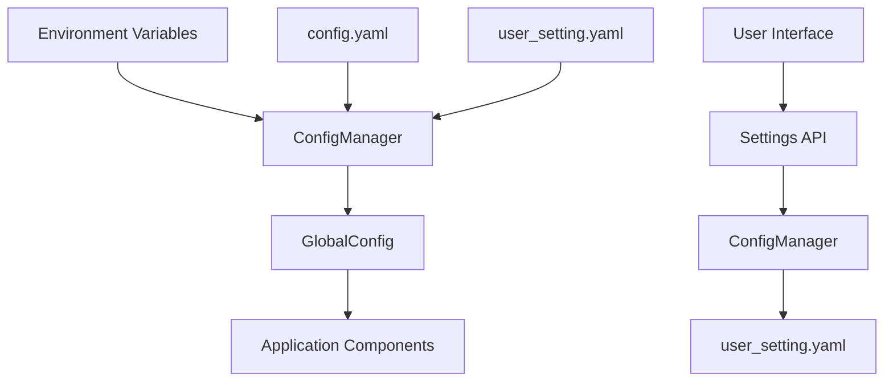
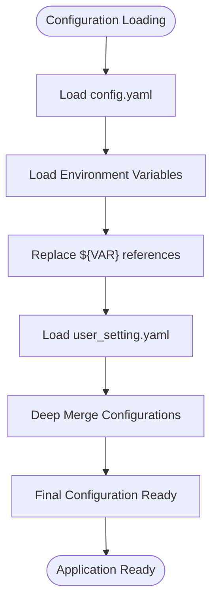
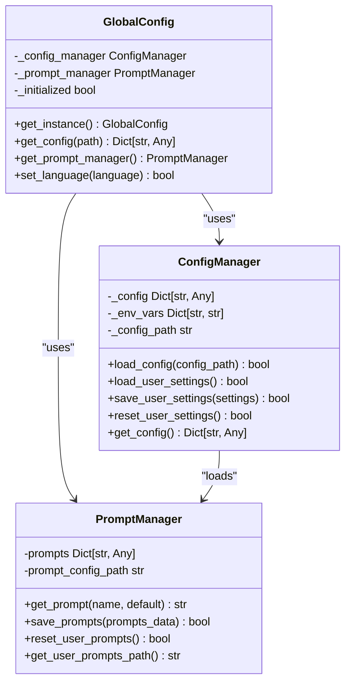
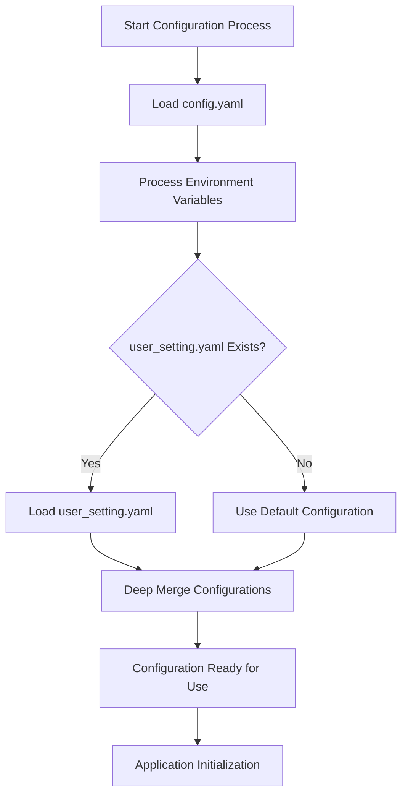
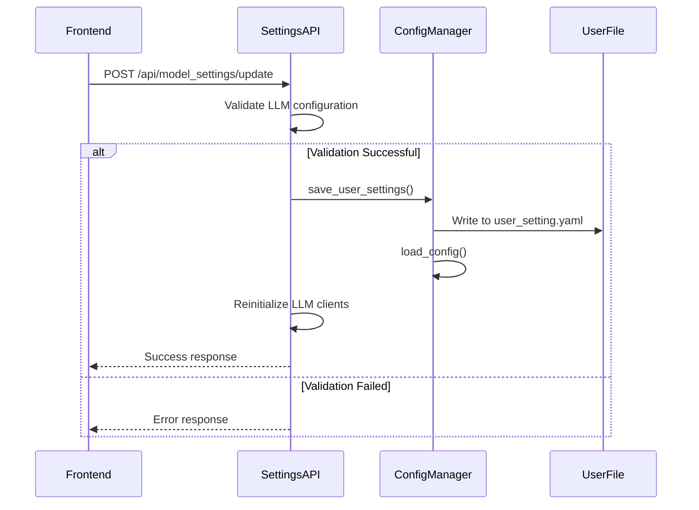

# Environment Variables and User Settings

<cite>
**Referenced Files in This Document**   
- [config.yaml](file://config/config.yaml)
- [config_manager.py](file://opencontext/config/config_manager.py)
- [global_config.py](file://opencontext/config/global_config.py)
- [prompt_manager.py](file://opencontext/config/prompt_manager.py)
- [settings.py](file://opencontext/server/routes/settings.py)
- [auth.py](file://opencontext/server/middleware/auth.py)
</cite>

## Table of Contents
1. [Introduction](#introduction)
2. [Configuration System Overview](#configuration-system-overview)
3. [Environment Variables](#environment-variables)
4. [User Settings Management](#user-settings-management)
5. [Configuration Precedence Hierarchy](#configuration-precedence-hierarchy)
6. [API Configuration Endpoints](#api-configuration-endpoints)
7. [Practical Configuration Examples](#practical-configuration-examples)
8. [Security Considerations](#security-considerations)
9. [Conclusion](#conclusion)

## Introduction

MineContext implements a flexible configuration system that combines YAML configuration files, environment variables, and user-specific settings to provide deployment flexibility and support for different environments. This documentation explains how these components work together, with a focus on environment variables and user settings that complement the core YAML configuration system. The system is designed to allow seamless transitions between development, testing, and production environments while maintaining security for sensitive data like API keys and authentication credentials.

## Configuration System Overview

MineContext's configuration system is built around a hierarchical approach that prioritizes flexibility and security. The core configuration is defined in YAML files, with the main configuration file located at `config/config.yaml`. This file contains default settings for all system components, including logging, document processing, context capture, storage, and API services.

The configuration system is managed by the `ConfigManager` class in `config_manager.py`, which handles loading, parsing, and merging configuration data from multiple sources. The `GlobalConfig` class provides a singleton interface for accessing configuration throughout the application, ensuring consistency and avoiding configuration object passing between components.



**Diagram sources**
- [config_manager.py](file://opencontext/config/config_manager.py#L24-L253)
- [global_config.py](file://opencontext/config/global_config.py#L23-L331)

**Section sources**
- [config.yaml](file://config/config.yaml#L1-L253)
- [config_manager.py](file://opencontext/config/config_manager.py#L1-L253)

## Environment Variables

Environment variables play a crucial role in MineContext's configuration system, providing a mechanism to override configuration values without modifying YAML files. This is particularly important for deployment flexibility and secret management, as sensitive information like API keys can be injected at runtime rather than stored in configuration files.

The system supports environment variable substitution in the configuration file using the `${VAR}` syntax for simple variable references and `${VAR:default}` for variables with default values. For example, in the `config.yaml` file, several key configuration values use environment variables:

```yaml
vlm_model:
  base_url: "${LLM_BASE_URL}"
  api_key: "${LLM_API_KEY}"
  model: "${LLM_MODEL}"

embedding_model:
  base_url: "${EMBEDDING_BASE_URL}"
  api_key: "${EMBEDDING_API_KEY}"
  model: "${EMBEDDING_MODEL}"
```

The `ConfigManager._replace_env_vars()` method processes these substitutions by first loading all environment variables into an internal dictionary and then recursively traversing the configuration data to replace any variable references with their actual values. If a referenced environment variable does not exist, the default value (if specified) is used instead.

Key environment variables used in MineContext include:

- `LLM_BASE_URL`: Base URL for the Large Language Model API
- `LLM_API_KEY`: Authentication key for the LLM service
- `LLM_MODEL`: Model identifier for the LLM service
- `EMBEDDING_BASE_URL`: Base URL for the embedding service
- `EMBEDDING_API_KEY`: Authentication key for the embedding service
- `EMBEDDING_MODEL`: Model identifier for the embedding service
- `CONTEXT_PATH`: Base path for the application context (defaults to current directory)
- `CONTEXT_API_KEY`: API key for authenticating requests to the application

The system also uses environment variables for development and deployment purposes, as seen in the `.env.example` file in the frontend directory, which includes variables for Apple Developer credentials and code signing.



**Diagram sources**
- [config_manager.py](file://opencontext/config/config_manager.py#L53-L58)
- [config_manager.py](file://opencontext/config/config_manager.py#L143-L164)

**Section sources**
- [config_manager.py](file://opencontext/config/config_manager.py#L62-L100)
- [config.yaml](file://config/config.yaml#L27-L35)

## User Settings Management

User settings in MineContext are managed through a dedicated `user_setting.yaml` file that stores user-specific configuration overrides. This file is specified in the main configuration file with the `user_setting_path` parameter, which defaults to `${CONTEXT_PATH:.}/config/user_setting.yaml`.

The `ConfigManager` class handles user settings through the `load_user_settings()` and `save_user_settings()` methods. When the configuration is loaded, the system automatically attempts to load the user settings file and merge its contents with the base configuration using a deep merge strategy. This ensures that user-specific settings take precedence over default values while preserving the overall configuration structure.

User settings are persisted automatically when modified through the application's settings interface. The `save_user_settings()` method selectively updates specific configuration sections (such as `vlm_model`, `embedding_model`, `content_generation`, etc.) rather than overwriting the entire user settings file. This approach preserves existing user preferences while incorporating new changes.

The system also provides a `reset_user_settings()` method that deletes the `user_setting.yaml` file and reloads the default configuration, effectively restoring the application to its initial state.



**Diagram sources**
- [config_manager.py](file://opencontext/config/config_manager.py#L24-L253)
- [global_config.py](file://opencontext/config/global_config.py#L23-L331)
- [prompt_manager.py](file://opencontext/config/prompt_manager.py#L17-L220)

**Section sources**
- [config_manager.py](file://opencontext/config/config_manager.py#L143-L253)
- [config.yaml](file://config/config.yaml#L14)

## Configuration Precedence Hierarchy

MineContext implements a clear precedence hierarchy for configuration values, ensuring predictable behavior when the same setting is defined in multiple places. The hierarchy, from highest to lowest precedence, is:

1. **Environment Variables**: Highest precedence, allowing runtime overrides
2. **User Settings**: User-specific overrides stored in `user_setting.yaml`
3. **Default Configuration**: Base values defined in `config.yaml`

This hierarchy enables flexible configuration management across different deployment scenarios. For example, during development, a developer might use environment variables to quickly test different LLM providers without modifying configuration files. In production, environment variables can securely inject API keys that should not be stored in version control.

The `ConfigManager` resolves value conflicts through a multi-step process:
1. Load the base configuration from `config.yaml`
2. Replace environment variable references with actual values
3. Load user settings from `user_setting.yaml`
4. Deep merge user settings into the base configuration, with user settings taking precedence

This approach ensures that sensitive data can be managed securely through environment variables while allowing users to customize their experience through the settings interface. The deep merge strategy preserves the configuration structure, allowing partial updates to complex nested objects without requiring the user to specify all parameters.



**Diagram sources**
- [config_manager.py](file://opencontext/config/config_manager.py#L50-L58)
- [config_manager.py](file://opencontext/config/config_manager.py#L120-L141)

**Section sources**
- [config_manager.py](file://opencontext/config/config_manager.py#L120-L141)
- [config_manager.py](file://opencontext/config/config_manager.py#L53-L58)

## API Configuration Endpoints

MineContext provides a comprehensive API for managing configuration settings, exposed through the `settings.py` routes file. These endpoints allow the frontend application to read and update configuration values dynamically, with changes persisted to the `user_setting.yaml` file.

Key API endpoints include:

- `/api/model_settings/get` and `/api/model_settings/update`: Manage LLM and embedding model configurations
- `/api/settings/general`: Read and update general system settings
- `/api/settings/prompts`: Manage prompt templates
- `/api/settings/reset`: Reset all user settings to defaults

When updating model settings, the API performs validation by testing the connection to both the VLM (Vision Language Model) and embedding services before saving the configuration. This ensures that invalid settings are caught before they are persisted. After successful validation and saving, the system reinitializes the relevant clients to use the new configuration.

The settings API also handles the `CONTEXT_PATH` environment variable, which defines the base directory for the application. This variable is used to resolve relative paths in the configuration, such as log file locations and data storage directories. The `/api/settings/system_info` endpoint exposes this path to the frontend, allowing the user interface to display relevant system information.

For prompt management, the system supports importing and exporting prompt configurations, enabling users to share and backup their custom prompts. The `save_prompts()` method in `PromptManager` uses a custom YAML dumper to preserve formatting, particularly for multi-line strings that are common in prompt templates.



**Diagram sources**
- [settings.py](file://opencontext/server/routes/settings.py#L79-L196)
- [config_manager.py](file://opencontext/config/config_manager.py#L168-L223)

**Section sources**
- [settings.py](file://opencontext/server/routes/settings.py#L79-L196)
- [config_manager.py](file://opencontext/config/config_manager.py#L168-L223)

## Practical Configuration Examples

MineContext's configuration system supports various deployment scenarios through environment variable usage. Here are practical examples for different environments:

**Development Environment:**
```bash
export CONTEXT_PATH="./dev_context"
export LLM_BASE_URL="http://localhost:11434"
export LLM_API_KEY="sk-dev-temporary-key"
export LLM_MODEL="llama3:8b"
export EMBEDDING_MODEL="nomic-embed-text"
export CONTEXT_API_KEY="dev-test-key"
```

**Production Environment:**
```bash
export CONTEXT_PATH="/opt/minecontext"
export LLM_BASE_URL="https://api.openai.com/v1"
export LLM_API_KEY=$(cat /secrets/openai_key)
export LLM_MODEL="gpt-4-turbo"
export EMBEDDING_MODEL="text-embedding-3-large"
export CONTEXT_API_KEY=$(cat /secrets/app_api_key)
```

**Testing Environment:**
```bash
export CONTEXT_PATH="./test_context"
export LLM_BASE_URL="https://api.mock.llm/v1"
export LLM_API_KEY="mock-test-key-123"
export LLM_MODEL="gpt-4-mock"
export EMBEDDING_MODEL="text-embedding-mock"
export CONTEXT_API_KEY="test-key-456"
export LOG_LEVEL="DEBUG"
```

These examples demonstrate how environment variables enable configuration of different LLM providers, API endpoints, and security settings without modifying the application code or configuration files. The `CONTEXT_PATH` variable is particularly important as it defines the base directory for all relative paths in the configuration, allowing the application to be deployed in different locations.

The system also supports configuration of API authentication through environment variables. When `api_auth.enabled` is set to `true` in the configuration, the application requires API key authentication for most endpoints (excluding health checks and static resources). The `CONTEXT_API_KEY` environment variable can be used to set the allowed API keys, or they can be specified directly in the `config.yaml` file.

## Security Considerations

MineContext's configuration system incorporates several security best practices for managing sensitive data:

1. **Environment Variables for Secrets**: Sensitive information like API keys and authentication credentials should be provided through environment variables rather than stored in configuration files. This prevents accidental exposure in version control systems.

2. **Configuration File Permissions**: The `user_setting.yaml` file may contain sensitive information and should be protected with appropriate file system permissions (e.g., 600 on Unix-like systems).

3. **API Key Authentication**: The system supports API key authentication for protecting endpoints, with configurable excluded paths for health checks and static resources.

4. **Input Validation**: Configuration updates through the API are validated before being applied, preventing invalid settings from being saved.

5. **Secure Defaults**: The default configuration has authentication disabled (`api_auth.enabled: false`), but this should be enabled in production environments.

6. **Path Resolution Security**: When resolving paths that include environment variables, the system validates that the resulting paths are within expected directories to prevent directory traversal attacks.

The system also provides a mechanism to reset all user settings to defaults through the `/api/settings/reset` endpoint, which can be useful for troubleshooting or when migrating to new configuration schemas.

For production deployments, it's recommended to:
- Use environment variables or secret management systems for all API keys
- Enable API authentication
- Set appropriate file permissions on configuration files
- Regularly audit configuration settings
- Use different API keys for different environments
- Rotate API keys periodically

## Conclusion

MineContext's configuration system effectively combines YAML configuration files, environment variables, and user settings to provide a flexible and secure approach to application configuration. The hierarchical precedence system ensures predictable behavior while allowing for deployment flexibility across different environments.

Environment variables serve as the highest-precedence configuration layer, enabling runtime overrides and secure management of sensitive data. User settings provide a persistent mechanism for storing user-specific preferences, while the base YAML configuration establishes default values for all settings.

The system's design supports common deployment patterns, from local development to production environments, while incorporating security best practices for managing sensitive configuration data. The comprehensive API for configuration management allows the frontend application to provide an intuitive user interface for adjusting settings, with changes safely persisted to disk.

By following the principles outlined in this documentation, administrators and developers can effectively configure MineContext for their specific needs while maintaining security and consistency across different deployment scenarios.