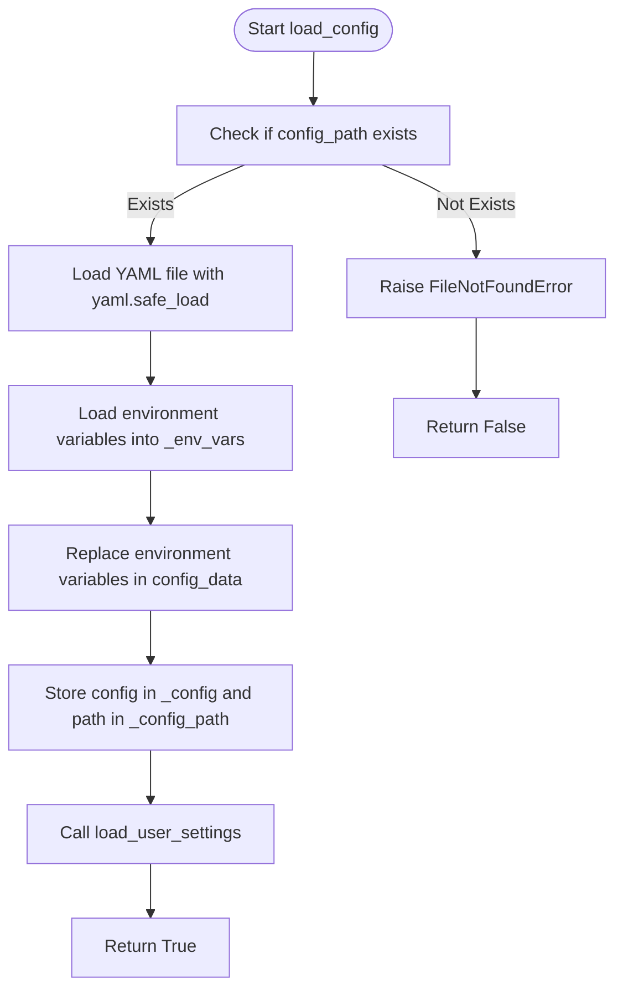
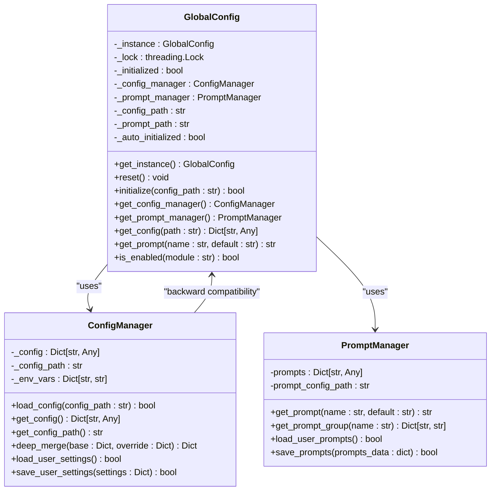
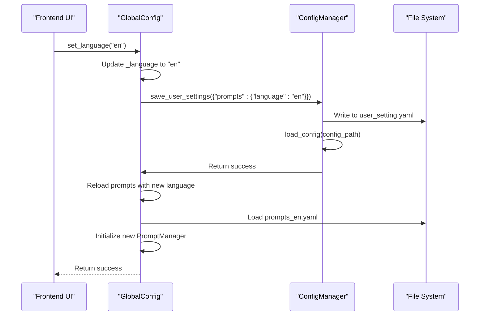
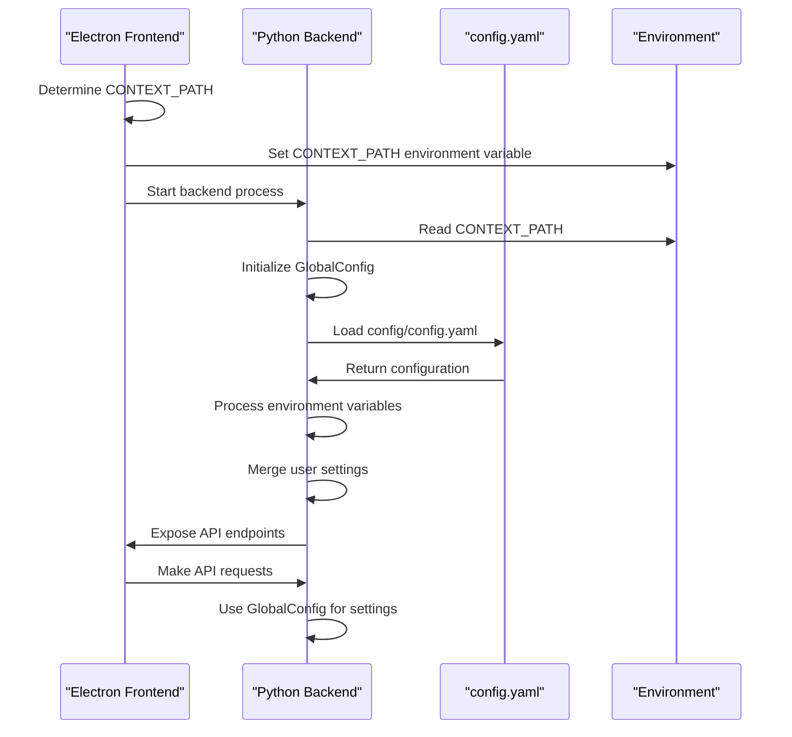
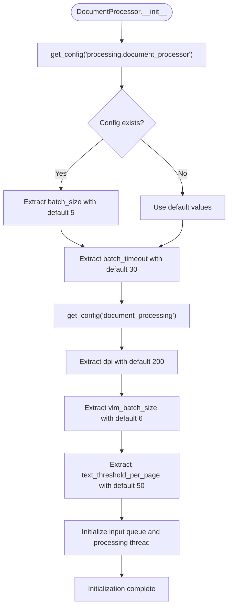
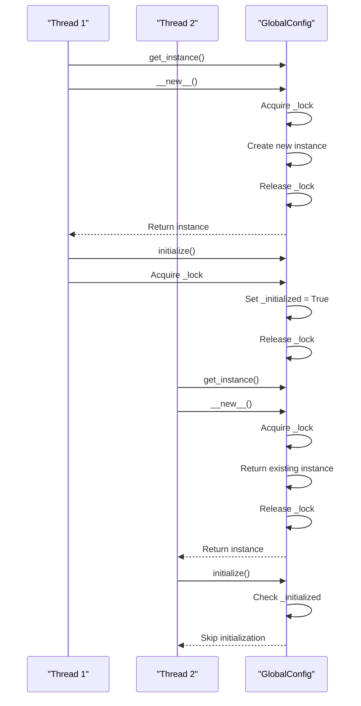

# Runtime Configuration Management

<cite>
**Referenced Files in This Document**   
- [config_manager.py](file://opencontext/config/config_manager.py)
- [global_config.py](file://opencontext/config/global_config.py)
- [config.yaml](file://config/config.yaml)
- [prompt_manager.py](file://opencontext/config/prompt_manager.py)
- [document_processor.py](file://opencontext/context_processing/processor/document_processor.py)
- [component_initializer.py](file://opencontext/server/component_initializer.py)
- [backend.ts](file://frontend/src/main/backend.ts)
</cite>

## Table of Contents
1. [Introduction](#introduction)
2. [ConfigManager: Configuration Loading and Validation](#configmanager-configuration-loading-and-validation)
3. [GlobalConfig: Singleton Configuration Access](#globalconfig-singleton-configuration-access)
4. [Configuration Reloading and Fallback Mechanisms](#configuration-reloading-and-fallback-mechanisms)
5. [Frontend-Backend Configuration Synchronization](#frontend-backend-configuration-synchronization)
6. [Service and Processor Configuration Access](#service-and-processor-configuration-access)
7. [Thread Safety and Error Handling](#thread-safety-and-error-handling)
8. [Performance Considerations and Caching](#performance-considerations-and-caching)
9. [Conclusion](#conclusion)

## Introduction
The MineContext application employs a sophisticated runtime configuration management system centered around two core classes: `ConfigManager` and `GlobalConfig`. This system is responsible for loading configuration from YAML files, validating settings, and providing a unified interface for accessing configuration values across the application. The `ConfigManager` class handles the low-level operations of loading and parsing configuration files, while the `GlobalConfig` class implements a singleton pattern to provide global access to configuration data. The system supports environment variable substitution, user-specific settings, and dynamic configuration reloading. This document provides a comprehensive analysis of the configuration management system, detailing its implementation, interaction between components, and best practices for usage.

## ConfigManager: Configuration Loading and Validation

The `ConfigManager` class is the foundation of the configuration system, responsible for loading and managing system configurations from YAML files. It provides a clean interface for configuration operations and implements several key features including environment variable substitution, deep merging of configurations, and user settings management.

The configuration loading process begins with the `load_config` method, which attempts to locate and load the main configuration file. By default, it looks for `config/config.yaml` in the application directory, but a custom path can be provided. The method first checks if the specified file exists, raising a `FileNotFoundError` if it cannot be found. Once the file is located, it is parsed using `yaml.safe_load`, which converts the YAML content into a Python dictionary structure.



**Diagram sources**
- [config_manager.py](file://opencontext/config/config_manager.py#L37-L60)

**Section sources**
- [config_manager.py](file://opencontext/config/config_manager.py#L24-L60)

A key feature of the `ConfigManager` is its support for environment variable substitution in configuration values. The `_replace_env_vars` method recursively processes the configuration data, replacing any occurrences of environment variable references in the format `${VAR}` or `${VAR:default}` with their actual values. This allows sensitive information like API keys and database credentials to be kept out of the configuration files and provided at runtime through environment variables. The method handles nested dictionaries and lists, ensuring that environment variable substitution works at any level of the configuration hierarchy.

The `ConfigManager` also implements a deep merging strategy through the `deep_merge` method, which is used to combine the base configuration with user-specific settings. When user settings are loaded from a separate file (specified by the `user_setting_path` in the main configuration), they are merged with the base configuration using a recursive merging algorithm. This ensures that user settings can override specific configuration values without requiring the entire configuration to be duplicated.

## GlobalConfig: Singleton Configuration Access

The `GlobalConfig` class implements the singleton pattern to provide a centralized point of access for configuration data throughout the application. This design eliminates the need to pass configuration objects between components and ensures that all parts of the system access a consistent configuration state.



**Diagram sources**
- [global_config.py](file://opencontext/config/global_config.py#L23-L331)
- [config_manager.py](file://opencontext/config/config_manager.py#L24-L253)
- [prompt_manager.py](file://opencontext/config/prompt_manager.py#L17-L220)

**Section sources**
- [global_config.py](file://opencontext/config/global_config.py#L23-L331)

The singleton pattern is implemented using the `__new__` method with a class-level lock to ensure thread safety during instance creation. The `_instance` class variable holds the single instance of `GlobalConfig`, and the `_lock` ensures that only one thread can create the instance at a time. This prevents race conditions in multi-threaded environments where multiple components might attempt to access the configuration simultaneously during application startup.

The `get_instance` class method is the primary way to access the `GlobalConfig` singleton. It implements lazy initialization with automatic configuration loading. If the instance has not been initialized, it attempts to auto-initialize by loading the default configuration file. This design allows components to access configuration data without explicitly initializing the configuration system, simplifying the application startup process.

The `GlobalConfig` class also provides convenience functions at the module level, such as `get_config`, `get_prompt`, and `is_enabled`, which allow for even simpler access to configuration data without requiring explicit calls to `get_instance()`. These functions are particularly useful in utility modules and helper functions where importing and calling the full class interface would be cumbersome.

## Configuration Reloading and Fallback Mechanisms

The configuration system implements several mechanisms for handling configuration changes and ensuring system stability in the face of configuration errors. These include user settings management, language switching with automatic reloading, and fallback strategies for missing or invalid configuration values.

The `ConfigManager` class provides methods for managing user-specific settings through the `load_user_settings`, `save_user_settings`, and `reset_user_settings` methods. User settings are stored in a separate file specified by the `user_setting_path` configuration parameter, allowing users to customize their experience without modifying the main configuration file. When user settings are saved, they are merged with the current configuration using the deep merge strategy, ensuring that only the specified settings are updated while preserving the rest of the configuration.



**Diagram sources**
- [global_config.py](file://opencontext/config/global_config.py#L187-L234)
- [config_manager.py](file://opencontext/config/config_manager.py#L168-L223)

**Section sources**
- [global_config.py](file://opencontext/config/global_config.py#L187-L234)

The system also supports dynamic language switching through the `set_language` method in `GlobalConfig`. When the language is changed, the method first updates the in-memory language setting, then saves this change to the user settings file. It then reloads the main configuration to ensure the new language setting is picked up, and finally reloads the prompt manager with the appropriate language-specific prompt file (e.g., `prompts_en.yaml` for English or `prompts_zh.yaml` for Chinese). This ensures that all components of the system, including UI elements and AI prompts, are updated to the new language.

For error handling, the configuration system employs a graceful degradation strategy. When configuration loading fails or a requested configuration path does not exist, the system returns `None` or a default value rather than raising an exception. This allows components to continue functioning with default settings even when specific configuration values are missing. The `get_config` method in `GlobalConfig` demonstrates this approach by returning `None` if the configuration manager is not initialized or if the requested path does not exist in the configuration.

## Frontend-Backend Configuration Synchronization

The MineContext application features a sophisticated frontend-backend architecture where configuration management plays a crucial role in ensuring system consistency. The synchronization between frontend and backend configuration systems is achieved through a combination of environment variables, command-line arguments, and file system coordination.

During application startup, the frontend Electron application is responsible for launching the backend Python server. This process involves several configuration-related steps to ensure both components operate with consistent settings. The `startBackendServer` function in `backend.ts` handles this initialization process, first checking if a backend process is already running and healthy before attempting to start a new one.



**Diagram sources**
- [backend.ts](file://frontend/src/main/backend.ts#L347-L614)
- [global_config.py](file://opencontext/config/global_config.py#L73-L89)

**Section sources**
- [backend.ts](file://frontend/src/main/backend.ts#L347-L614)

The `CONTEXT_PATH` environment variable is a key component of this synchronization mechanism. When the backend server is started, the frontend sets this variable to point to the appropriate data directory (either the development directory or the user data directory in production). This variable is then used within the configuration files themselves through environment variable substitution (e.g., `${CONTEXT_PATH:.}/logs/opencontext.log`), ensuring that file paths are correctly resolved regardless of the deployment environment.

The build process also plays a role in configuration synchronization. The `copy-prebuilt-backend.js` script ensures that configuration files from the `dist/config` directory are copied to the backend executable directory during packaging. This guarantees that the backend has access to the necessary configuration files when the application is distributed.

## Service and Processor Configuration Access

Services and processors throughout the MineContext application access configuration values through the `GlobalConfig` singleton, which provides a clean and consistent interface for retrieving configuration data. This approach eliminates the need to pass configuration objects through multiple layers of the application architecture.

The `DocumentProcessor` class provides a clear example of how components retrieve configuration values. In its constructor, it calls `get_config("processing.document_processor")` to retrieve its specific configuration section, falling back to an empty dictionary if the configuration is not available. It then extracts individual configuration parameters like `batch_size` and `batch_timeout` from this configuration object, providing default values if the parameters are not specified.



**Diagram sources**
- [document_processor.py](file://opencontext/context_processing/processor/document_processor.py#L47-L78)

**Section sources**
- [document_processor.py](file://opencontext/context_processing/processor/document_processor.py#L47-L87)

The `ProcessorFactory` class demonstrates another pattern for configuration access. When creating a processor instance, it retrieves the processor's configuration from the global configuration using `GlobalConfig.get_instance().get_config(f"processing.{type_name}")`. It then passes this configuration to the processor's validation method to ensure that the configuration is valid before the processor is used. This pattern allows for centralized configuration validation and ensures that processors are only created when their required configuration is present and valid.

The system also provides convenience methods for checking feature enablement through the `is_enabled` method in `GlobalConfig`. This method retrieves a module's configuration and checks the `enabled` flag, returning `False` if the module configuration does not exist or if the `enabled` flag is not set to `True`. This allows components to quickly determine whether they should be active without having to navigate the configuration hierarchy themselves.

## Thread Safety and Error Handling

The configuration management system in MineContext is designed with thread safety as a primary concern, given that configuration data may be accessed by multiple components and threads simultaneously. Both the `ConfigManager` and `GlobalConfig` classes employ synchronization mechanisms to prevent race conditions and ensure data consistency.

The `GlobalConfig` class uses a class-level lock (`_lock`) in both the `__new__` method and the `__init__` method to ensure that only one thread can create or initialize the singleton instance at a time. This prevents multiple threads from creating separate instances or partially initializing the configuration in an inconsistent state. The `_initialized` class variable acts as a flag to indicate whether the singleton has been properly initialized, preventing redundant initialization attempts.



**Diagram sources**
- [global_config.py](file://opencontext/config/global_config.py#L35-L54)

**Section sources**
- [global_config.py](file://opencontext/config/global_config.py#L35-L54)

For error handling, the configuration system employs a defensive programming approach, using try-except blocks around file operations and configuration parsing. When an error occurs during configuration loading or processing, the system logs the error using the application's logging framework but continues execution with default values or by skipping the problematic operation. This ensures that a single configuration error does not bring down the entire application.

The `load_user_settings` method in `ConfigManager` demonstrates this approach by catching exceptions during file reading and returning `False` if the user settings cannot be loaded, rather than propagating the exception. Similarly, the `save_user_settings` method catches exceptions during file writing and logs the error without interrupting the application flow. This resilience allows the application to continue functioning even when user-specific configuration cannot be persisted.

## Performance Considerations and Caching

The configuration management system in MineContext is designed with performance in mind, minimizing the overhead of configuration access while ensuring data consistency. Since configuration values are typically read frequently but written infrequently, the system optimizes for fast read operations.

Configuration data is loaded into memory during application startup and remains there for the duration of the application's lifecycle. This eliminates the need for repeated file I/O operations when configuration values are accessed. The `GlobalConfig` singleton holds references to the `ConfigManager` and `PromptManager` instances, allowing for direct in-memory access to configuration data without additional lookup overhead.

The system does not implement additional caching layers beyond the in-memory storage of configuration data, as the configuration is relatively small and changes infrequently. However, the design allows for efficient access patterns through the use of direct attribute access and method calls that return references to configuration data rather than creating copies.

When configuration values are accessed frequently within tight loops or performance-critical sections of code, the recommendation is to retrieve the configuration value once and store it in a local variable rather than calling the configuration access methods repeatedly. For example:

```python
# Efficient: retrieve configuration once
config = GlobalConfig.get_instance().get_config("processing.document_processor")
batch_size = config.get("batch_size", 5)
for i in range(batch_size):
    # Use batch_size without repeated configuration access
    process_item()

# Inefficient: repeated configuration access
for i in range(GlobalConfig.get_instance().get_config("processing.document_processor").get("batch_size", 5)):
    process_item()
```

The system also minimizes the performance impact of configuration loading by using efficient YAML parsing and by avoiding expensive operations during the loading process. Environment variable substitution is performed once during configuration loading rather than on each access, and the deep merging of configurations is optimized to only process the necessary parts of the configuration hierarchy.

## Conclusion
The runtime configuration management system in MineContext provides a robust, thread-safe, and user-friendly way to manage application settings. Through the `ConfigManager` and `GlobalConfig` classes, the system offers a comprehensive solution for loading, validating, and accessing configuration data across the application. The implementation of environment variable substitution, user settings management, and dynamic language switching demonstrates a thoughtful approach to configuration flexibility and user customization. The integration between frontend and backend components ensures consistent configuration across the entire application stack, while the focus on thread safety and error handling contributes to overall system stability. By providing convenient access methods and optimizing for performance, the configuration system enables developers to focus on application logic rather than configuration management details.