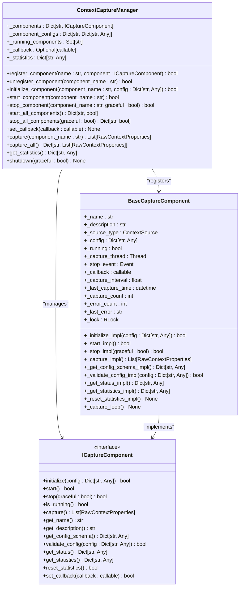
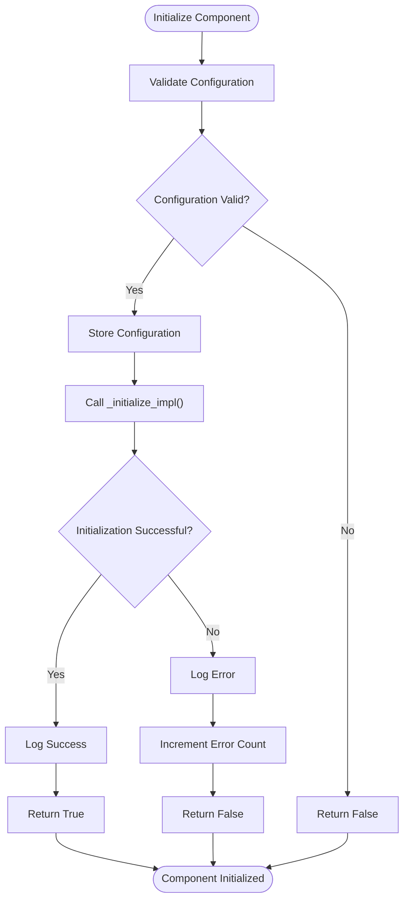
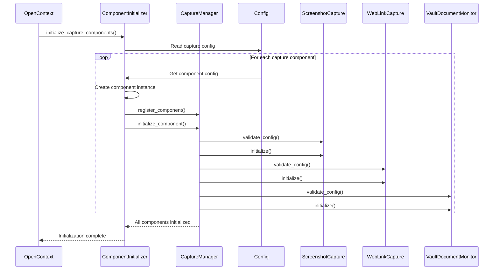
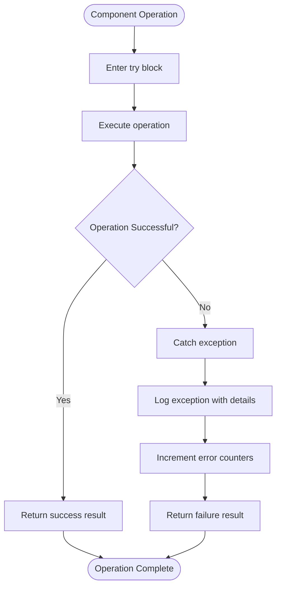
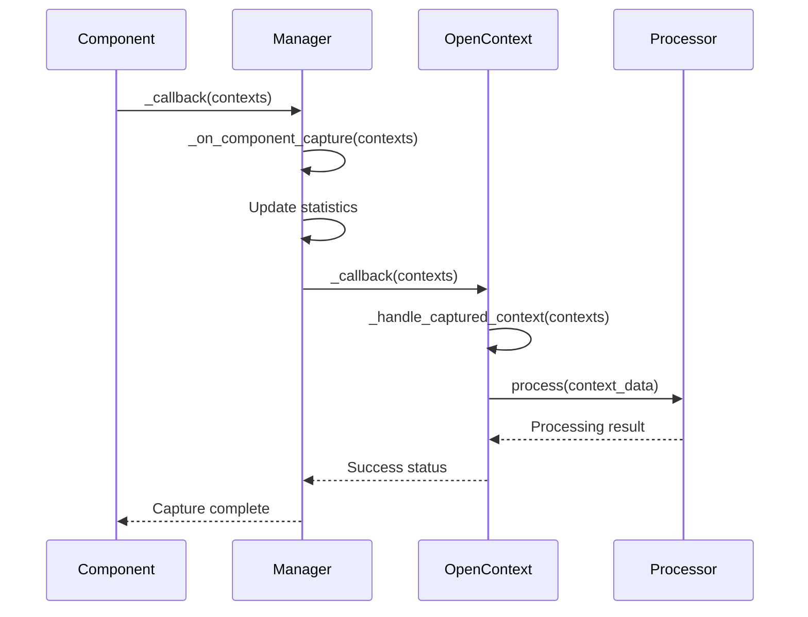

# Capture Component Management

<cite>
**Referenced Files in This Document**   
- [capture_manager.py](file://opencontext/managers/capture_manager.py)
- [component_initializer.py](file://opencontext/server/component_initializer.py)
- [capture_interface.py](file://opencontext/interfaces/capture_interface.py)
- [base.py](file://opencontext/context_capture/base.py)
- [screenshot.py](file://opencontext/context_capture/screenshot.py)
- [web_link_capture.py](file://opencontext/context_capture/web_link_capture.py)
- [vault_document_monitor.py](file://opencontext/context_capture/vault_document_monitor.py)
- [config.yaml](file://config/config.yaml)
- [opencontext.py](file://opencontext/server/opencontext.py)
</cite>

## Table of Contents
1. [Introduction](#introduction)
2. [ContextCaptureManager Architecture](#contextcapturemanager-architecture)
3. [Component Registration and Lifecycle Management](#component-registration-and-lifecycle-management)
4. [Configuration Validation and Initialization](#configuration-validation-and-initialization)
5. [Startup Process and Component Initialization](#startup-process-and-component-initialization)
6. [Capture Operations and Control](#capture-operations-and-control)
7. [Error Handling and Resilience](#error-handling-and-resilience)
8. [Statistics Aggregation System](#statistics-aggregation-system)
9. [Data Propagation and Callback Mechanism](#data-propagation-and-callback-mechanism)
10. [Component Implementation Patterns](#component-implementation-patterns)

## Introduction
The Capture Component Management system in MineContext is centered around the ContextCaptureManager, which orchestrates all context capture activities across the application. This system provides a unified interface for managing multiple capture components that collect various types of contextual data from different sources. The architecture follows a component-based design with loose coupling, allowing for extensibility and maintainability. The manager handles the complete lifecycle of capture components, from registration and initialization to startup, operation, and shutdown. It also manages configuration validation, error handling, statistics collection, and data propagation to downstream processing pipelines.

**Section sources**
- [capture_manager.py](file://opencontext/managers/capture_manager.py#L23-L391)
- [component_initializer.py](file://opencontext/server/component_initializer.py#L52-L229)

## ContextCaptureManager Architecture
The ContextCaptureManager serves as the central orchestrator for all capture components in the system. It maintains a registry of all registered components and manages their state through a comprehensive set of methods for component control. The manager uses internal data structures to track component instances, configurations, and operational status. It maintains a dictionary of registered components (`_components`), a set of running components (`_running_components`), and a comprehensive statistics structure that aggregates performance metrics across all components. The manager also implements a callback mechanism that allows captured data to be propagated to the processing pipeline. The architecture is designed to be thread-safe, with appropriate locking mechanisms to ensure data consistency during concurrent operations.

**Diagram sources **
- [capture_manager.py](file://opencontext/managers/capture_manager.py#L23-L391)
- [capture_interface.py](file://opencontext/interfaces/capture_interface.py#L18-L153)
- [base.py](file://opencontext/context_capture/base.py#L26-L515)

**Section sources**
- [capture_manager.py](file://opencontext/managers/capture_manager.py#L23-L391)
- [capture_interface.py](file://opencontext/interfaces/capture_interface.py#L18-L153)
- [base.py](file://opencontext/context_capture/base.py#L26-L515)

## Component Registration and Lifecycle Management
The ContextCaptureManager provides comprehensive lifecycle management for capture components through a series of well-defined methods. Components are first registered with the manager using the `register_component` method, which adds them to the internal registry and initializes their statistics. The manager then handles initialization through the `initialize_component` method, which validates configuration and calls the component's initialization routine. Components can be started individually with `start_component` or collectively with `start_all_components`, which iterates through all registered components. Similarly, components can be stopped individually with `stop_component` or collectively with `stop_all_components`. The manager maintains a set of running components to track operational status and prevent duplicate startups. The `unregister_component` method allows for dynamic removal of components, automatically stopping them if they are currently running.

**Section sources**
- [capture_manager.py](file://opencontext/managers/capture_manager.py#L51-L233)

## Configuration Validation and Initialization
The capture component system implements a robust configuration validation and initialization process. When a component is initialized through the `initialize_component` method, the manager first validates that the component is registered and then performs configuration validation by calling the component's `validate_config` method. This validation occurs before any initialization attempts, ensuring that invalid configurations are rejected early in the process. The BaseCaptureComponent provides a default implementation of configuration validation that checks for common parameters like `auto_capture` and `capture_interval`, while allowing subclasses to extend validation through the `_validate_config_impl` method. Configuration schemas are defined through the `get_config_schema` method, which returns a JSON Schema-compatible structure describing the required and optional configuration parameters, their types, constraints, and default values. This schema-based approach enables both runtime validation and potential UI generation for configuration interfaces.

**Diagram sources **
- [capture_manager.py](file://opencontext/managers/capture_manager.py#L100-L134)
- [base.py](file://opencontext/context_capture/base.py#L275-L310)

**Section sources**
- [capture_manager.py](file://opencontext/managers/capture_manager.py#L100-L134)
- [base.py](file://opencontext/context_capture/base.py#L275-L310)

## Startup Process and Component Initialization
The startup process for capture components is orchestrated through the ComponentInitializer class in conjunction with the ContextCaptureManager. During application initialization, the OpenContext class creates a ComponentInitializer instance and uses it to initialize all capture components. The initialization process begins by reading the configuration from config.yaml, where capture components are defined with their respective configurations and enabled status. The ComponentInitializer iterates through each enabled capture component in the configuration, creates an instance of the component class, registers it with the ContextCaptureManager, and then initializes it with its specific configuration. The component mapping is defined in the CAPTURE_COMPONENTS dictionary, which maps component names to their corresponding classes. For components not explicitly listed, the system supports dynamic import based on naming conventions. This initialization sequence ensures that all components are properly configured and ready before the system begins capturing data.

**Diagram sources **
- [component_initializer.py](file://opencontext/server/component_initializer.py#L71-L97)
- [opencontext.py](file://opencontext/server/opencontext.py#L70-L73)
- [config.yaml](file://config/config.yaml#L39-L75)

**Section sources**
- [component_initializer.py](file://opencontext/server/component_initializer.py#L71-L97)
- [opencontext.py](file://opencontext/server/opencontext.py#L70-L73)
- [config.yaml](file://config/config.yaml#L39-L75)

## Capture Operations and Control
The ContextCaptureManager provides multiple methods for controlling capture operations, both collectively and individually. The primary method for starting all capture components is `start_all_components`, which iterates through all registered components and calls `start_component` for each one. Individual components can be controlled through `start_component` and `stop_component` methods, which handle the transition between operational states. The manager also supports manual capture operations through the `capture` and `capture_all` methods, which trigger immediate capture from specified or all running components. For components with periodic capture (indicated by a `capture_interval` configuration), the BaseCaptureComponent automatically manages a dedicated capture thread that executes captures at the specified interval. The capture loop is controlled by a threading.Event that allows for graceful shutdown. Components that don't require periodic capture (like WebLinkCapture) can implement on-demand capture without a background thread.

**Section sources**
- [capture_manager.py](file://opencontext/managers/capture_manager.py#L208-L355)
- [base.py](file://opencontext/context_capture/base.py#L408-L429)

## Error Handling and Resilience
The capture component system implements comprehensive error handling to ensure system resilience and stability. Each component operation (initialization, startup, capture, and shutdown) is wrapped in try-except blocks that catch and log exceptions while preventing them from propagating and crashing the entire system. When an error occurs, the manager increments error counters in both the global statistics and the component-specific statistics. The BaseCaptureComponent includes error tracking fields (`_error_count` and `_last_error`) that are updated when exceptions occur during component operations. For periodic capture components, the capture loop includes error recovery logic that continues operation after an exception, with a delay before the next capture attempt. The system also implements graceful shutdown procedures that allow components to complete ongoing operations before terminating. Configuration validation errors are caught early in the initialization process, preventing components with invalid configurations from being activated.

**Diagram sources **
- [capture_manager.py](file://opencontext/managers/capture_manager.py#L118-L134)
- [base.py](file://opencontext/context_capture/base.py#L78-L92)

**Section sources**
- [capture_manager.py](file://opencontext/managers/capture_manager.py#L118-L134)
- [base.py](file://opencontext/context_capture/base.py#L78-L92)

## Statistics Aggregation System
The ContextCaptureManager implements a comprehensive statistics aggregation system that collects and reports performance metrics from all registered capture components. The manager maintains a global statistics structure that includes counters for total captures, contexts captured, errors, and timestamps of the last capture. For each registered component, the manager maintains component-specific statistics including captures, contexts captured, errors, and last capture time. Components themselves also maintain their own statistics through the BaseCaptureComponent's statistics fields (`_capture_count`, `_error_count`, etc.), which are updated during each capture operation. The manager's `get_statistics` method returns a copy of the complete statistics structure, enabling monitoring and debugging. The statistics system is designed to be thread-safe, with appropriate locking mechanisms to ensure data consistency during concurrent updates from multiple components and threads.

**Section sources**
- [capture_manager.py](file://opencontext/managers/capture_manager.py#L43-L49)
- [capture_manager.py](file://opencontext/managers/capture_manager.py#L357-L364)
- [base.py](file://opencontext/context_capture/base.py#L338-L362)

## Data Propagation and Callback Mechanism
The capture component system uses a callback mechanism to propagate captured data from components to the processing pipeline. The ContextCaptureManager establishes this connection by setting itself as the callback target for each component when it is started. When a component captures data, it calls its internal `_callback` function, which is set to the manager's `_on_component_capture` method. This method updates statistics and then invokes the manager's primary callback (set via `set_callback`), which typically points to the OpenContext instance's `_handle_captured_context` method. This creates a chain of responsibility where captured data flows from the component to the manager and then to the processing system. The callback accepts a list of RawContextProperties objects, allowing components to report multiple context items from a single capture operation. This decoupled design allows components to operate independently while ensuring captured data is properly routed to downstream systems.

**Diagram sources **
- [capture_manager.py](file://opencontext/managers/capture_manager.py#L157-L160)
- [capture_manager.py](file://opencontext/managers/capture_manager.py#L273-L311)
- [opencontext.py](file://opencontext/server/opencontext.py#L70)
- [opencontext.py](file://opencontext/server/opencontext.py#L103-L116)

**Section sources**
- [capture_manager.py](file://opencontext/managers/capture_manager.py#L157-L160)
- [capture_manager.py](file://opencontext/managers/capture_manager.py#L273-L311)
- [opencontext.py](file://opencontext/server/opencontext.py#L70)
- [opencontext.py](file://opencontext/server/opencontext.py#L103-L116)

## Component Implementation Patterns
Capture components in the system follow a consistent implementation pattern based on the BaseCaptureComponent class. Each concrete component inherits from BaseCaptureComponent and implements the abstract methods `_initialize_impl`, `_start_impl`, `_stop_impl`, and `_capture_impl`. The `_initialize_impl` method handles component-specific initialization, such as setting up libraries or connections. The `_start_impl` method performs any startup procedures, while `_stop_impl` handles cleanup and graceful shutdown. The `_capture_impl` method contains the core capture logic and returns a list of RawContextProperties objects. Components also extend the base configuration schema through `_get_config_schema_impl` and implement component-specific validation in `_validate_config_impl`. This pattern ensures consistency across components while allowing for specialized behavior. Examples include ScreenshotCapture, which manages periodic screen captures with deduplication, WebLinkCapture, which converts URLs to Markdown or PDF, and VaultDocumentMonitor, which monitors database changes for document updates.

**Section sources**
- [base.py](file://opencontext/context_capture/base.py#L433-L515)
- [screenshot.py](file://opencontext/context_capture/screenshot.py#L60-L508)
- [web_link_capture.py](file://opencontext/context_capture/web_link_capture.py#L160-L351)
- [vault_document_monitor.py](file://opencontext/context_capture/vault_document_monitor.py#L51-L389)