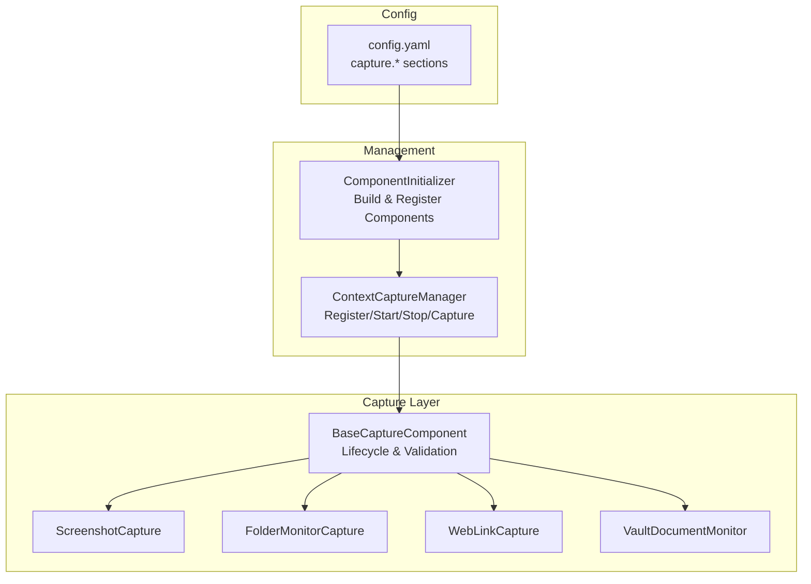
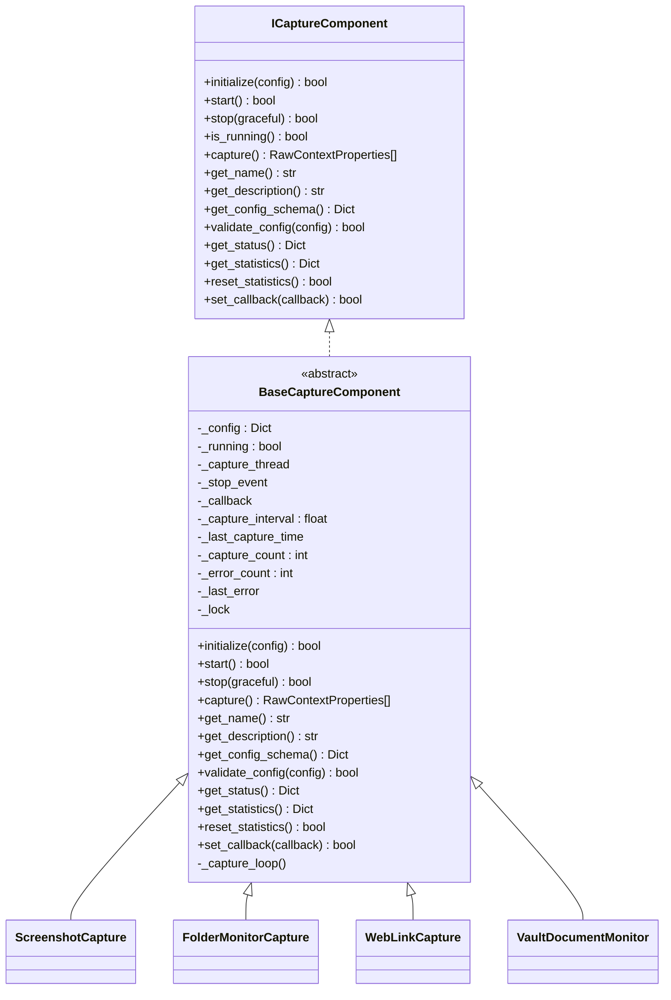
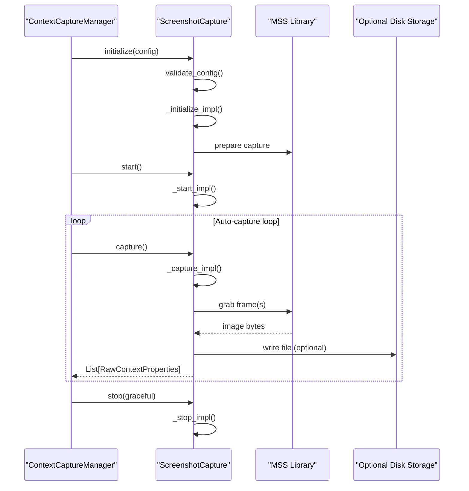
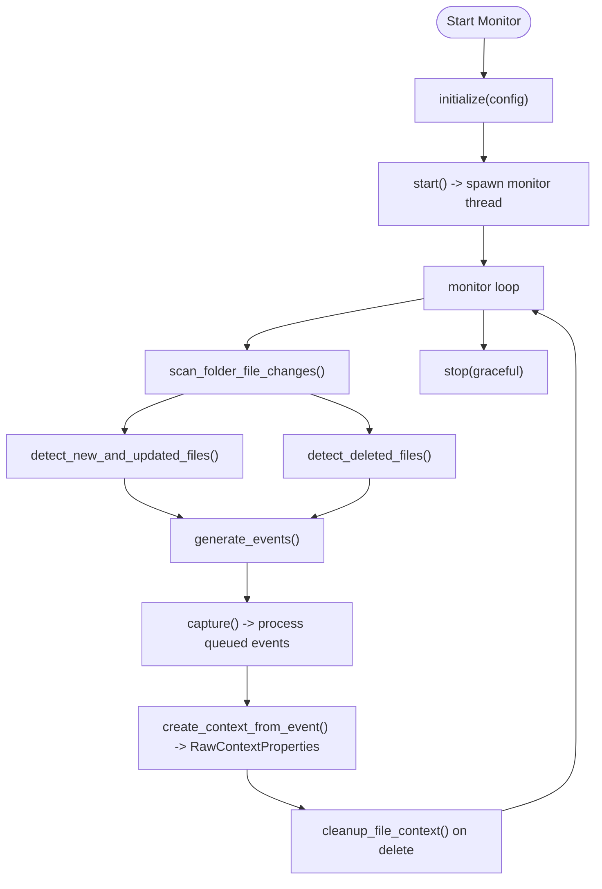
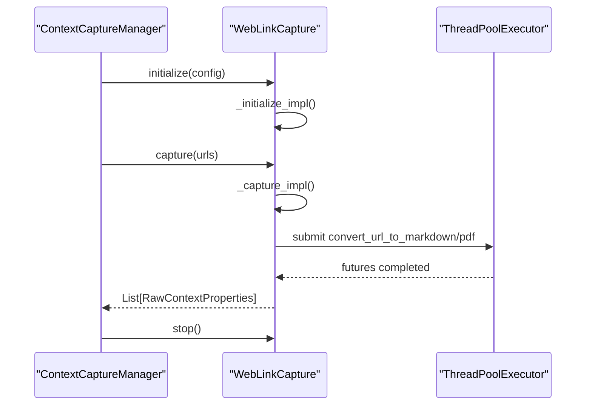
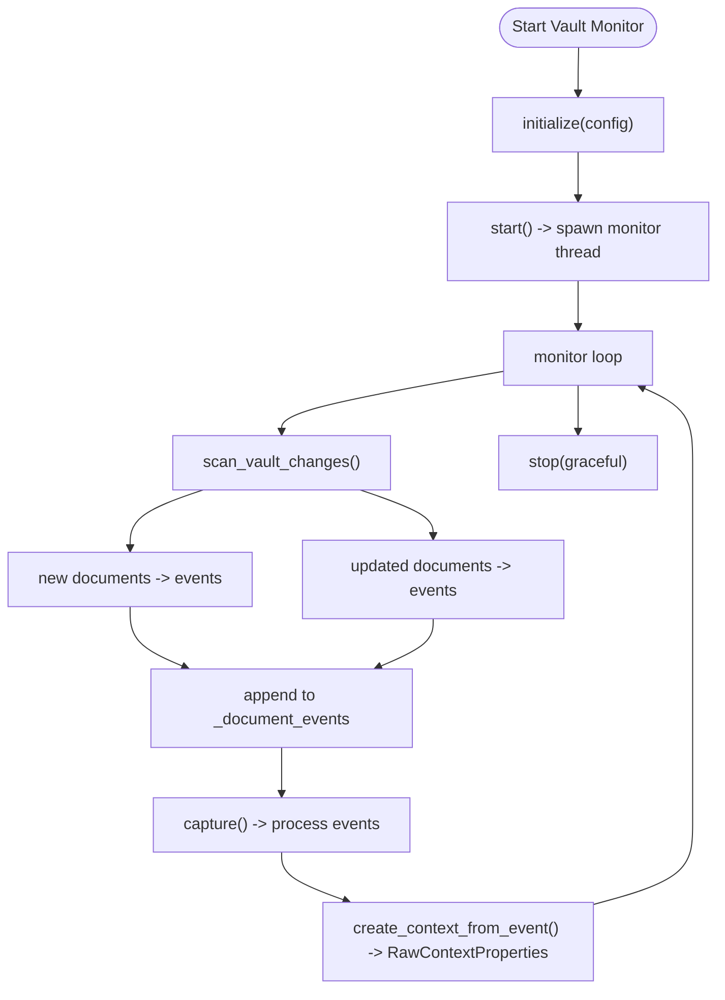
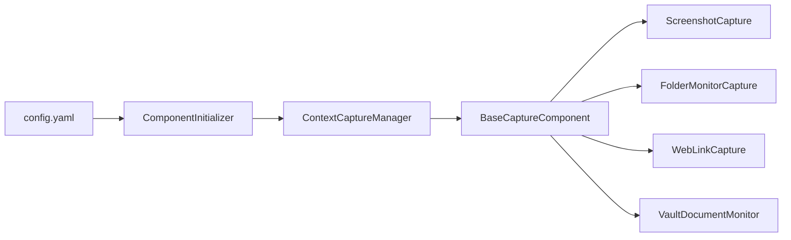

# Context Capture System

<cite>
**Referenced Files in This Document**
- [base.py](file://opencontext/context_capture/base.py)
- [screenshot.py](file://opencontext/context_capture/screenshot.py)
- [folder_monitor.py](file://opencontext/context_capture/folder_monitor.py)
- [web_link_capture.py](file://opencontext/context_capture/web_link_capture.py)
- [vault_document_monitor.py](file://opencontext/context_capture/vault_document_monitor.py)
- [capture_manager.py](file://opencontext/managers/capture_manager.py)
- [capture_interface.py](file://opencontext/interfaces/capture_interface.py)
- [component_initializer.py](file://opencontext/server/component_initializer.py)
- [config.yaml](file://config/config.yaml)
- [verify_folder_monitor.py](file://examples/verify_folder_monitor.py)
- [example_screenshot_processor.py](file://examples/example_screenshot_processor.py)
</cite>

## Table of Contents
1. [Introduction](#introduction)
2. [Project Structure](#project-structure)
3. [Core Components](#core-components)
4. [Architecture Overview](#architecture-overview)
5. [Detailed Component Analysis](#detailed-component-analysis)
6. [Dependency Analysis](#dependency-analysis)
7. [Performance Considerations](#performance-considerations)
8. [Troubleshooting Guide](#troubleshooting-guide)
9. [Conclusion](#conclusion)
10. [Appendices](#appendices)

## Introduction
This document explains MineContext’s context capture system, focusing on how digital activities are collected from multiple sources. It covers the architecture of capture components that implement the ICaptureComponent interface, the lifecycle methods (initialize, start, stop, capture), and how components are registered and managed by the CaptureManager. It also documents configuration options for each capture type in config.yaml, and provides concrete examples from the codebase for screenshot and folder monitoring. Finally, it addresses performance considerations and resource management for continuous capture scenarios.

## Project Structure
The capture system is organized around a shared base class and several specialized capture components, coordinated by a central manager. Components are registered and initialized via a component initializer that reads configuration from config.yaml.

**Diagram sources**
- [base.py](file://opencontext/context_capture/base.py#L1-L120)
- [capture_manager.py](file://opencontext/managers/capture_manager.py#L1-L120)
- [component_initializer.py](file://opencontext/server/component_initializer.py#L35-L106)
- [config.yaml](file://config/config.yaml#L39-L75)

**Section sources**
- [base.py](file://opencontext/context_capture/base.py#L1-L120)
- [capture_manager.py](file://opencontext/managers/capture_manager.py#L1-L120)
- [component_initializer.py](file://opencontext/server/component_initializer.py#L35-L106)
- [config.yaml](file://config/config.yaml#L39-L75)

## Core Components
- BaseCaptureComponent: Implements common lifecycle, configuration validation, scheduling, and statistics. Concrete components inherit from this and implement abstract methods for initialization, startup, stop, and capture.
- ScreenshotCapture: Periodically captures screenshots, optionally saves them, deduplicates frames, and emits RawContextProperties.
- FolderMonitorCapture: Watches local folders for file changes (create/update/delete), computes hashes, and emits context events.
- WebLinkCapture: Converts URLs to Markdown or PDF using external libraries and emits file-based context.
- VaultDocumentMonitor: Monitors a vaults table (via storage) for new/updated documents and emits text-based context.

Key lifecycle methods:
- initialize(config): Validates and applies configuration, sets defaults, prepares resources.
- start(): Starts background threads or subsystems.
- stop(graceful): Stops threads and performs cleanup.
- capture(): Executes a single capture operation and returns RawContextProperties.

**Section sources**
- [base.py](file://opencontext/context_capture/base.py#L33-L110)
- [screenshot.py](file://opencontext/context_capture/screenshot.py#L28-L120)
- [folder_monitor.py](file://opencontext/context_capture/folder_monitor.py#L29-L70)
- [web_link_capture.py](file://opencontext/context_capture/web_link_capture.py#L24-L51)
- [vault_document_monitor.py](file://opencontext/context_capture/vault_document_monitor.py#L26-L51)

## Architecture Overview
The capture system is designed for loose coupling:
- Components implement ICaptureComponent and are registered with ContextCaptureManager.
- Manager coordinates initialization, start/stop, and dispatches captured data via callbacks.
- ComponentInitializer reads config.yaml and dynamically creates/register components based on enabled flags.

**Diagram sources**
- [capture_interface.py](file://opencontext/interfaces/capture_interface.py#L18-L153)
- [base.py](file://opencontext/context_capture/base.py#L1-L120)
- [screenshot.py](file://opencontext/context_capture/screenshot.py#L28-L60)
- [folder_monitor.py](file://opencontext/context_capture/folder_monitor.py#L29-L51)
- [web_link_capture.py](file://opencontext/context_capture/web_link_capture.py#L24-L33)
- [vault_document_monitor.py](file://opencontext/context_capture/vault_document_monitor.py#L26-L38)

## Detailed Component Analysis

### Screenshot Monitoring
- Purpose: Periodically capture screenshots from all monitors or a configured region, optionally save to disk, deduplicate frames, and emit image-based RawContextProperties.
- Lifecycle:
  - initialize: Loads screenshot library, validates format/quality/region, sets save directory, dedup thresholds, and image scaling.
  - start: Verifies library availability.
  - stop: Optionally flushes pending contexts via callback and clears caches.
  - capture: Uses MSS to grab frames, converts to PNG/JPEG, builds RawContextProperties, and returns list.
- Configuration (config.yaml capture.screenshot.*):
  - enabled, capture_interval, storage_path, screenshot_format, screenshot_quality, screenshot_region, dedup_enabled, similarity_threshold, max_image_size, resize_quality.
- Example usage:
  - See [example_screenshot_processor.py](file://examples/example_screenshot_processor.py#L100-L148) for programmatic extraction of content from screenshots without storing in DB.

**Diagram sources**
- [screenshot.py](file://opencontext/context_capture/screenshot.py#L60-L120)
- [screenshot.py](file://opencontext/context_capture/screenshot.py#L128-L175)
- [screenshot.py](file://opencontext/context_capture/screenshot.py#L217-L245)
- [screenshot.py](file://opencontext/context_capture/screenshot.py#L246-L299)
- [capture_manager.py](file://opencontext/managers/capture_manager.py#L135-L207)

**Section sources**
- [screenshot.py](file://opencontext/context_capture/screenshot.py#L60-L120)
- [screenshot.py](file://opencontext/context_capture/screenshot.py#L128-L175)
- [screenshot.py](file://opencontext/context_capture/screenshot.py#L217-L245)
- [screenshot.py](file://opencontext/context_capture/screenshot.py#L246-L299)
- [config.yaml](file://config/config.yaml#L43-L47)
- [example_screenshot_processor.py](file://examples/example_screenshot_processor.py#L100-L148)

### Folder Monitoring
- Purpose: Watch local folders for file changes (create/update/delete), compute SHA-256 hashes, and emit context events. Supports recursive scanning and initial scan.
- Lifecycle:
  - initialize: Reads monitor_interval, watch paths, recursive flag, max file size, initial_scan, and supported formats.
  - start: Optionally performs initial scan, starts monitor thread.
  - stop: Signals stop event and joins thread.
  - capture: Processes queued events, creates RawContextProperties for supported files, and cleans up processed contexts on deletion.
- Change detection:
  - Scans current files, compares mtime/size/hash to cached state, emits file_created, file_updated, file_deleted.
- Configuration (config.yaml capture.folder_monitor.*):
  - enabled, monitor_interval, watch_folder_paths, recursive, max_file_size, initial_scan.

**Diagram sources**
- [folder_monitor.py](file://opencontext/context_capture/folder_monitor.py#L137-L196)
- [folder_monitor.py](file://opencontext/context_capture/folder_monitor.py#L190-L232)
- [folder_monitor.py](file://opencontext/context_capture/folder_monitor.py#L233-L288)
- [folder_monitor.py](file://opencontext/context_capture/folder_monitor.py#L289-L346)

**Section sources**
- [folder_monitor.py](file://opencontext/context_capture/folder_monitor.py#L59-L115)
- [folder_monitor.py](file://opencontext/context_capture/folder_monitor.py#L137-L196)
- [folder_monitor.py](file://opencontext/context_capture/folder_monitor.py#L190-L232)
- [folder_monitor.py](file://opencontext/context_capture/folder_monitor.py#L233-L288)
- [folder_monitor.py](file://opencontext/context_capture/folder_monitor.py#L289-L346)
- [config.yaml](file://config/config.yaml#L49-L58)
- [verify_folder_monitor.py](file://examples/verify_folder_monitor.py#L40-L116)

### Web Link Capture
- Purpose: Convert URLs to Markdown or PDF using external libraries and emit file-based context. Supports parallel conversion via ThreadPoolExecutor.
- Lifecycle:
  - initialize: Sets output_dir, mode, timeout, wait_until, pdf options, max_workers.
  - start/stop: No persistent threads; driven by capture().
  - capture(urls): Overrides base capture to accept a list of URLs, processes them, and returns RawContextProperties.
- Configuration (config.yaml capture.web_link_capture.*):
  - enabled, output_dir, mode, max_workers, timeout, wait_until, pdf_format, print_background, landscape.

**Diagram sources**
- [web_link_capture.py](file://opencontext/context_capture/web_link_capture.py#L160-L181)
- [web_link_capture.py](file://opencontext/context_capture/web_link_capture.py#L191-L252)

**Section sources**
- [web_link_capture.py](file://opencontext/context_capture/web_link_capture.py#L160-L181)
- [web_link_capture.py](file://opencontext/context_capture/web_link_capture.py#L191-L252)
- [config.yaml](file://config/config.yaml#L71-L75)

### Vault Document Monitoring
- Purpose: Monitor a vaults table for new/updated documents and emit text-based context. Supports initial scan and periodic polling.
- Lifecycle:
  - initialize: Initializes storage, sets monitor_interval, records last scan time.
  - start: Optionally performs initial scan, starts monitor thread.
  - stop: Signals stop event and joins thread.
  - capture: Processes queued events and creates RawContextProperties.
- Configuration (config.yaml capture.vault_document_monitor.*):
  - enabled, monitor_interval, initial_scan.

**Diagram sources**
- [vault_document_monitor.py](file://opencontext/context_capture/vault_document_monitor.py#L145-L250)
- [vault_document_monitor.py](file://opencontext/context_capture/vault_document_monitor.py#L251-L287)

**Section sources**
- [vault_document_monitor.py](file://opencontext/context_capture/vault_document_monitor.py#L51-L118)
- [vault_document_monitor.py](file://opencontext/context_capture/vault_document_monitor.py#L145-L250)
- [vault_document_monitor.py](file://opencontext/context_capture/vault_document_monitor.py#L251-L287)
- [config.yaml](file://config/config.yaml#L71-L75)

## Dependency Analysis
- Component registration and initialization:
  - ComponentInitializer reads config.yaml capture section, maps names to component classes, instantiates, registers, initializes, and logs results.
  - ContextCaptureManager holds component instances, manages lifecycle, and aggregates statistics.
- Component-to-base coupling:
  - All capture components inherit from BaseCaptureComponent, which centralizes threading, scheduling, validation, and statistics.
- External integrations:
  - ScreenshotCapture depends on MSS and PIL for image capture and serialization.
  - FolderMonitorCapture depends on OS filesystem APIs and a storage backend for cleanup.
  - WebLinkCapture depends on crawl4ai and Playwright for rendering and PDF generation.
  - VaultDocumentMonitor depends on a storage backend to query vaults and manage events.

**Diagram sources**
- [component_initializer.py](file://opencontext/server/component_initializer.py#L35-L106)
- [capture_manager.py](file://opencontext/managers/capture_manager.py#L1-L120)
- [base.py](file://opencontext/context_capture/base.py#L1-L120)

**Section sources**
- [component_initializer.py](file://opencontext/server/component_initializer.py#L35-L106)
- [capture_manager.py](file://opencontext/managers/capture_manager.py#L1-L120)
- [base.py](file://opencontext/context_capture/base.py#L1-L120)

## Performance Considerations
- Screenshot capture:
  - Use capture_interval to balance frequency vs. CPU/GPU usage.
  - Limit image size and quality to reduce memory and I/O overhead.
  - Enable deduplication to skip identical frames.
  - Consider saving to fast storage if persistence is enabled.
- Folder monitoring:
  - Tune monitor_interval and max_file_size to avoid scanning large binaries.
  - Use recursive=false for shallow scans when appropriate.
  - Initial scan can be expensive; disable if not needed.
- Web link capture:
  - Control max_workers to limit concurrency and resource contention.
  - Adjust timeout and wait_until to match network conditions.
  - Prefer Markdown mode for lightweight processing.
- Vault document monitoring:
  - Adjust monitor_interval to reduce polling overhead.
  - Use initial_scan judiciously for large vaults.
- General:
  - Use graceful stop to flush pending contexts.
  - Monitor statistics and logs to detect bottlenecks.
  - Apply rate limits and backoff strategies in loops to avoid busy-waiting.

[No sources needed since this section provides general guidance]

## Troubleshooting Guide
- Initialization failures:
  - Check configuration validity via validate_config and get_config_schema.
  - Review component-specific logs for missing dependencies (e.g., MSS, Playwright, crawl4ai).
- Capture not triggering:
  - Verify auto_capture and capture_interval are set appropriately.
  - Ensure component is registered and started via ContextCaptureManager.
- Resource exhaustion:
  - Lower capture_interval or max_workers.
  - Reduce image size or disable persistence for screenshots.
  - Filter large files in folder monitor via max_file_size.
- Cleanup on deletion:
  - Confirm storage backend is available and that cleanup logic is invoked on file deletion.

**Section sources**
- [base.py](file://opencontext/context_capture/base.py#L275-L310)
- [folder_monitor.py](file://opencontext/context_capture/folder_monitor.py#L233-L288)
- [web_link_capture.py](file://opencontext/context_capture/web_link_capture.py#L160-L181)

## Conclusion
MineContext’s context capture system provides a robust, extensible framework for collecting digital activities from diverse sources. Components share a common lifecycle and validation layer, are centrally managed, and can be configured via config.yaml. By tuning intervals, sizes, and concurrency, teams can achieve efficient continuous capture tailored to their workload.

[No sources needed since this section summarizes without analyzing specific files]

## Appendices

### Configuration Reference (config.yaml capture.*)
- screenshot
  - enabled, capture_interval, storage_path, screenshot_format, screenshot_quality, screenshot_region, dedup_enabled, similarity_threshold, max_image_size, resize_quality
- folder_monitor
  - enabled, monitor_interval, watch_folder_paths, recursive, max_file_size, initial_scan
- file_monitor
  - enabled, recursive, initial_scan, monitor_paths, capture_interval, ignore_patterns
- vault_document_monitor
  - enabled, monitor_interval, initial_scan

**Section sources**
- [config.yaml](file://config/config.yaml#L39-L75)

### Example: How screenshot.py captures screen content
- The screenshot capture flow is implemented in the component’s capture and internal helpers. See:
  - [screenshot.py](file://opencontext/context_capture/screenshot.py#L217-L245) for the capture entrypoint.
  - [screenshot.py](file://opencontext/context_capture/screenshot.py#L246-L299) for the underlying MSS capture and image serialization.

**Section sources**
- [screenshot.py](file://opencontext/context_capture/screenshot.py#L217-L245)
- [screenshot.py](file://opencontext/context_capture/screenshot.py#L246-L299)

### Example: How folder_monitor.py watches for file changes
- The monitor loop and change detection are implemented as follows:
  - [folder_monitor.py](file://opencontext/context_capture/folder_monitor.py#L137-L196) for the monitor loop and change detection.
  - [folder_monitor.py](file://opencontext/context_capture/folder_monitor.py#L190-L232) for detecting new/updated/deleted files.
  - [verify_folder_monitor.py](file://examples/verify_folder_monitor.py#L40-L116) for a test-driven verification of create/update/delete behavior.

**Section sources**
- [folder_monitor.py](file://opencontext/context_capture/folder_monitor.py#L137-L196)
- [folder_monitor.py](file://opencontext/context_capture/folder_monitor.py#L190-L232)
- [verify_folder_monitor.py](file://examples/verify_folder_monitor.py#L40-L116)