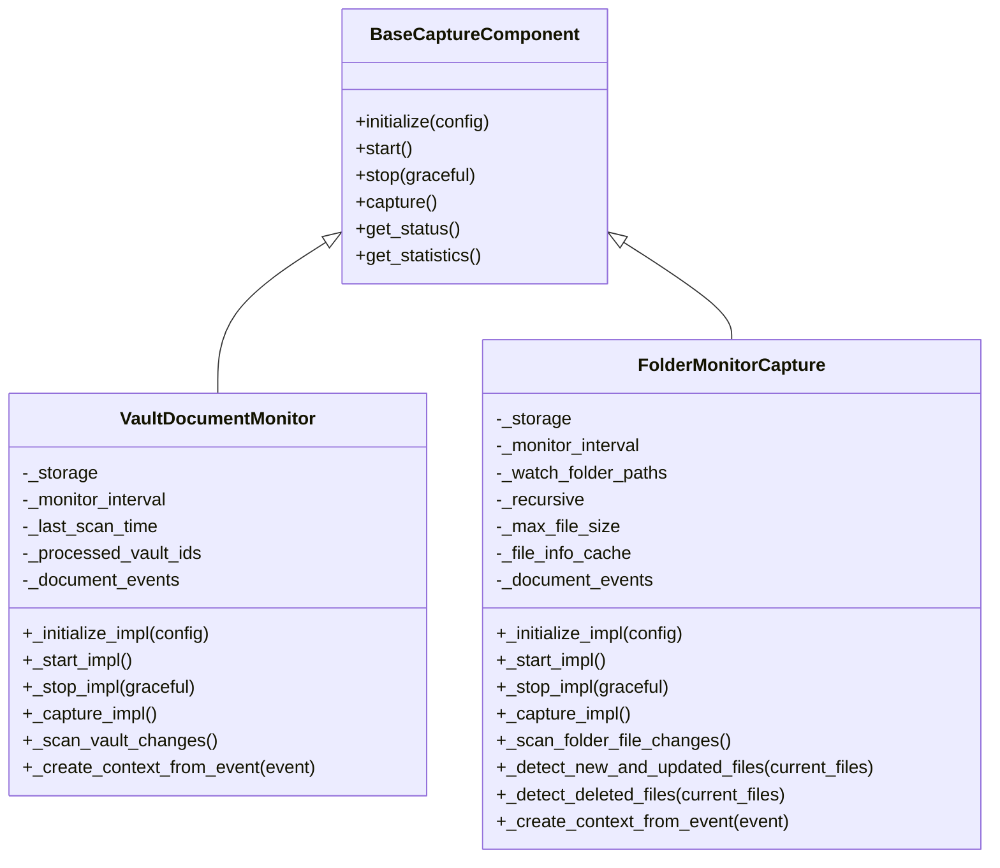
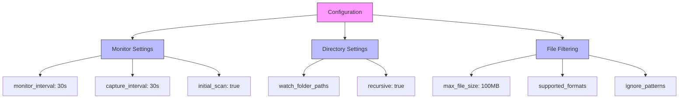
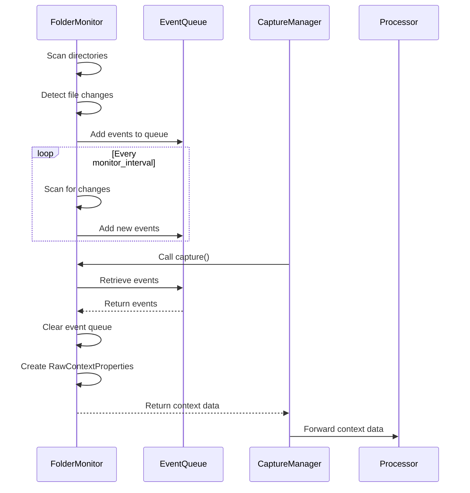
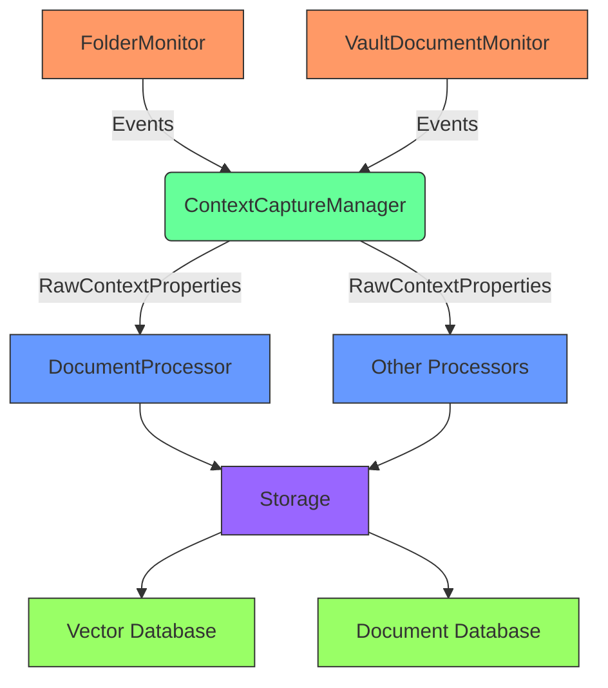
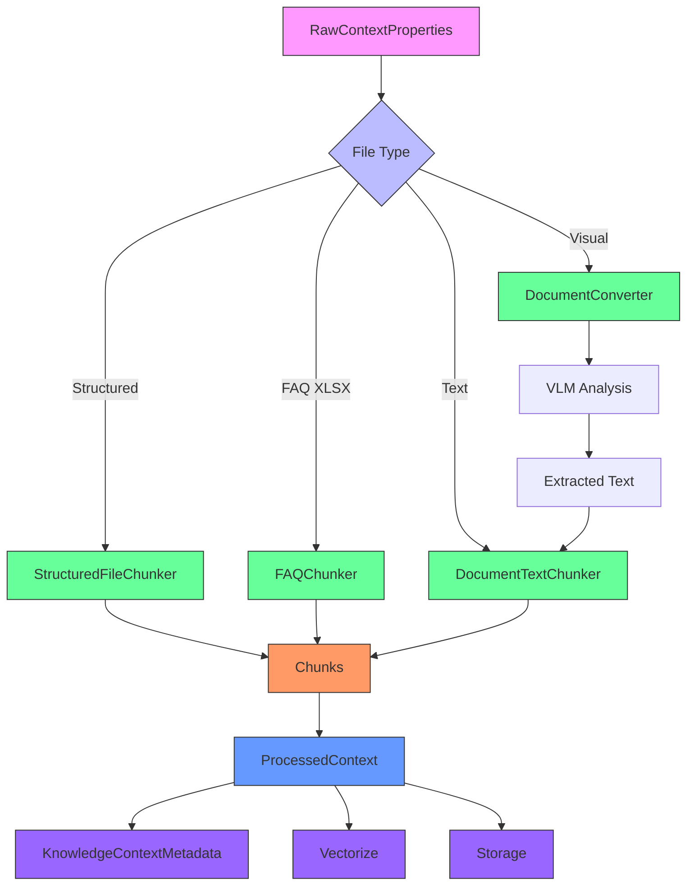

# Document Tracking

<cite>
**Referenced Files in This Document**   
- [vault_document_monitor.py](file://opencontext/context_capture/vault_document_monitor.py)
- [folder_monitor.py](file://opencontext/context_capture/folder_monitor.py)
- [config.yaml](file://config/config.yaml)
- [base.py](file://opencontext/context_capture/base.py)
- [context.py](file://opencontext/models/context.py)
- [capture_manager.py](file://opencontext/managers/capture_manager.py)
- [document_processor.py](file://opencontext/context_processing/processor/document_processor.py)
- [global_storage.py](file://opencontext/storage/global_storage.py)
- [capture_interface.py](file://opencontext/interfaces/capture_interface.py)
</cite>

## Table of Contents
1. [Introduction](#introduction)
2. [Core Components](#core-components)
3. [Configuration Options](#configuration-options)
4. [Event Capture and Processing](#event-capture-and-processing)
5. [Integration with Event Management System](#integration-with-event-management-system)
6. [Document Metadata Extraction and Enrichment](#document-metadata-extraction-and-enrichment)
7. [Performance Considerations](#performance-considerations)
8. [Error Handling](#error-handling)
9. [Conclusion](#conclusion)

## Introduction
The document tracking system in the OpenContext framework is designed to monitor changes in user directories and vaults, capturing file creation, modification, and deletion events. This system enables real-time processing of document changes by converting file system events into structured context data. The core components include the VaultDocumentMonitor for tracking database-stored documents and the FolderMonitor for monitoring local file system changes. These components work in conjunction with a centralized event management system to ensure captured events are processed efficiently and reliably.

**Section sources**
- [vault_document_monitor.py](file://opencontext/context_capture/vault_document_monitor.py#L1-L389)
- [folder_monitor.py](file://opencontext/context_capture/folder_monitor.py#L1-L472)

## Core Components

The document tracking system is built around two primary monitoring components: VaultDocumentMonitor and FolderMonitor. Both classes inherit from BaseCaptureComponent, which provides common functionality for initialization, startup, stopping, and configuration validation. The VaultDocumentMonitor specifically monitors changes in the vaults table of the database, detecting new and updated documents by comparing timestamps. It performs an initial scan of existing documents when started and then periodically checks for changes based on the configured monitor interval.

The FolderMonitor component implements file system watching by periodically scanning specified directories for changes. Rather than using platform-specific file watching APIs, it employs a polling-based approach that scans directories at regular intervals. For each file, it maintains a cache of metadata including modification time, size, and SHA-256 hash. When a file's metadata changes, it triggers a file update event. The component detects new files by comparing the current file list with its cache, and identifies deleted files by finding entries in the cache that no longer exist in the file system.

**Diagram sources **
- [base.py](file://opencontext/context_capture/base.py#L26-L515)
- [vault_document_monitor.py](file://opencontext/context_capture/vault_document_monitor.py#L26-L389)
- [folder_monitor.py](file://opencontext/context_capture/folder_monitor.py#L29-L472)

**Section sources**
- [vault_document_monitor.py](file://opencontext/context_capture/vault_document_monitor.py#L1-L389)
- [folder_monitor.py](file://opencontext/context_capture/folder_monitor.py#L1-L472)

## Configuration Options

The document tracking system is configured through the config.yaml file, which provides comprehensive options for specifying monitored directories, file type filters, and ignore patterns. The folder_monitor section in the configuration file allows users to define multiple watch_folder_paths that specify which directories should be monitored for changes. The recursive option determines whether subdirectories should be scanned, with a default value of true. The max_file_size parameter sets the maximum file size (in bytes) that will be processed, preventing excessively large files from consuming system resources.

File type filtering is implemented through the DocumentProcessor class, which maintains a list of supported file extensions. The get_supported_formats() method returns extensions for common document types including .pdf, .docx, .xlsx, .csv, .md, and .txt. When the FolderMonitor scans directories, it uses this list to determine which files to include in monitoring. The initial_scan option controls whether an initial scan of existing files should be performed when the monitor starts, allowing previously existing files to be processed immediately.

**Diagram sources **
- [config.yaml](file://config/config.yaml#L48-L75)
- [folder_monitor.py](file://opencontext/context_capture/folder_monitor.py#L66-L70)
- [document_processor.py](file://opencontext/context_processing/processor/document_processor.py#L112-L131)

**Section sources**
- [config.yaml](file://config/config.yaml#L48-L75)
- [folder_monitor.py](file://opencontext/context_capture/folder_monitor.py#L59-L444)
- [document_processor.py](file://opencontext/context_processing/processor/document_processor.py#L112-L131)

## Event Capture and Processing

File system events are captured and converted into RawContextProperties objects that contain metadata about the file changes. When a file creation, modification, or deletion event is detected, the FolderMonitor creates an event dictionary containing the event type, file path, timestamp, and file information. These events are stored in a thread-safe queue (_document_events) protected by an RLock to prevent race conditions in multi-threaded environments.

For file creation and update events, the system extracts metadata such as file path, size, modification timestamp, and content based on the file type. The _create_context_from_event method converts these events into RawContextProperties objects, which serve as the standardized format for context data throughout the system. The RawContextProperties class includes fields for content_format, source, create_time, content_path, content_text, filter_path, additional_info, and enable_merge. For text files, the content is read directly, while for other file types, only metadata is captured initially.

**Diagram sources **
- [folder_monitor.py](file://opencontext/context_capture/folder_monitor.py#L116-L132)
- [context.py](file://opencontext/models/context.py#L35-L46)
- [capture_manager.py](file://opencontext/managers/capture_manager.py#L312-L338)

**Section sources**
- [folder_monitor.py](file://opencontext/context_capture/folder_monitor.py#L116-L325)
- [context.py](file://opencontext/models/context.py#L35-L46)

## Integration with Event Management System

The document tracking components integrate with the event management system through the ContextCaptureManager, which coordinates multiple capture components and handles event routing. When a capture component is started, it registers a callback function with the manager through the set_callback method. This callback is invoked whenever new context data is captured, enabling real-time processing of events.

The ContextCaptureManager acts as a central hub that receives captured context data from all registered components and forwards it to the appropriate processing pipeline. It maintains statistics on capture operations and provides methods for starting, stopping, and monitoring components. When the FolderMonitor captures events through its capture() method, the resulting RawContextProperties objects are passed to the manager's callback function, which then routes them to the document processing system for further analysis and enrichment.

**Diagram sources **
- [capture_manager.py](file://opencontext/managers/capture_manager.py#L23-L391)
- [folder_monitor.py](file://opencontext/context_capture/folder_monitor.py#L116-L132)
- [document_processor.py](file://opencontext/context_processing/processor/document_processor.py#L41-L96)

**Section sources**
- [capture_manager.py](file://opencontext/managers/capture_manager.py#L23-L391)
- [folder_monitor.py](file://opencontext/context_capture/folder_monitor.py#L38-L51)
- [document_processor.py](file://opencontext/context_processing/processor/document_processor.py#L41-L96)

## Document Metadata Extraction and Enrichment

Document metadata is extracted and enriched through the DocumentProcessor component, which transforms RawContextProperties into ProcessedContext objects. When a document event is received, the DocumentProcessor first validates whether it can process the context based on file type and source. For supported document types, it reads the file content and applies appropriate processing strategies based on the file format.

For structured documents like CSV and XLSX files, the system uses specialized chunkers (StructuredFileChunker and FAQChunker) to parse the data into meaningful chunks. Text documents are processed using the DocumentTextChunker, which splits content into manageable segments based on configurable size parameters. The processor also handles visual documents like PDFs and DOCX files by converting them to images and using a Vision Language Model (VLM) to extract text from pages containing visual elements, while directly extracting text from pages that are primarily textual.

**Diagram sources **
- [document_processor.py](file://opencontext/context_processing/processor/document_processor.py#L41-L653)
- [context.py](file://opencontext/models/context.py#L131-L152)
- [document_converter.py](file://opencontext/context_processing/processor/document_converter.py)

**Section sources**
- [document_processor.py](file://opencontext/context_processing/processor/document_processor.py#L41-L653)
- [context.py](file://opencontext/models/context.py#L131-L152)

## Performance Considerations

The document tracking system includes several performance optimizations for monitoring large directories and handling high-frequency file events. The FolderMonitor uses a polling interval (monitor_interval) that can be configured to balance responsiveness with system resource usage. By default, it scans directories every 30 seconds, which reduces CPU and I/O load compared to continuous file watching. For high-frequency change environments, this interval can be reduced, but with consideration for increased system load.

To handle large directories efficiently, the system maintains a cache of file metadata (_file_info_cache) that stores modification times, sizes, and SHA-256 hashes. This allows the monitor to quickly identify changes without re-reading file contents. The max_file_size parameter prevents processing of excessively large files that could consume significant memory and processing time. Additionally, the system uses batch processing where possible, such as when multiple file changes are detected within a single monitoring cycle.

For high-frequency event scenarios, the system employs thread-safe data structures and synchronization mechanisms to prevent race conditions. The document_events list is protected by an RLock, ensuring that event collection and retrieval can occur concurrently without data corruption. The background processing architecture decouples event detection from processing, allowing events to be queued and processed at a controlled rate, preventing system overload during bursts of file activity.

**Section sources**
- [folder_monitor.py](file://opencontext/context_capture/folder_monitor.py#L43-L472)
- [document_processor.py](file://opencontext/context_processing/processor/document_processor.py#L69-L71)
- [base.py](file://opencontext/context_capture/base.py#L48-L55)

## Error Handling

The document tracking system implements comprehensive error handling for scenarios such as permission issues, disk access errors, and configuration problems. Each component uses try-except blocks around critical operations and logs exceptions with detailed error messages. For file system operations, OSError exceptions are specifically caught when accessing file metadata or reading file contents, allowing the system to continue monitoring other files even when individual files cannot be accessed.

When a file is deleted, the FolderMonitor triggers cleanup of associated context data by calling _cleanup_file_context, which removes processed contexts from storage. This method includes error handling to ensure that cleanup operations do not crash the monitoring system if storage operations fail. Configuration validation is performed during initialization, with detailed error messages returned for invalid settings such as non-existent directories or invalid file sizes.

The system also includes graceful shutdown procedures that allow ongoing operations to complete before termination. When stopping a monitor, the system sets a stop_event flag and waits for the monitoring thread to finish, with a configurable timeout. This prevents resource leaks and ensures that the system can recover from errors without requiring a complete restart.

**Section sources**
- [folder_monitor.py](file://opencontext/context_capture/folder_monitor.py#L134-L135)
- [vault_document_monitor.py](file://opencontext/context_capture/vault_document_monitor.py#L72-L74)
- [base.py](file://opencontext/context_capture/base.py#L86-L92)

## Conclusion

The document tracking system in OpenContext provides a robust framework for monitoring file changes in user directories and database-stored documents. By combining the VaultDocumentMonitor for database tracking and the FolderMonitor for file system monitoring, the system captures a comprehensive view of document activity. The integration with the ContextCaptureManager enables real-time processing of events, while the DocumentProcessor enriches raw context data with meaningful metadata. Configuration options in config.yaml allow fine-tuning of monitoring behavior, and the system includes performance optimizations and error handling to ensure reliable operation in various environments.