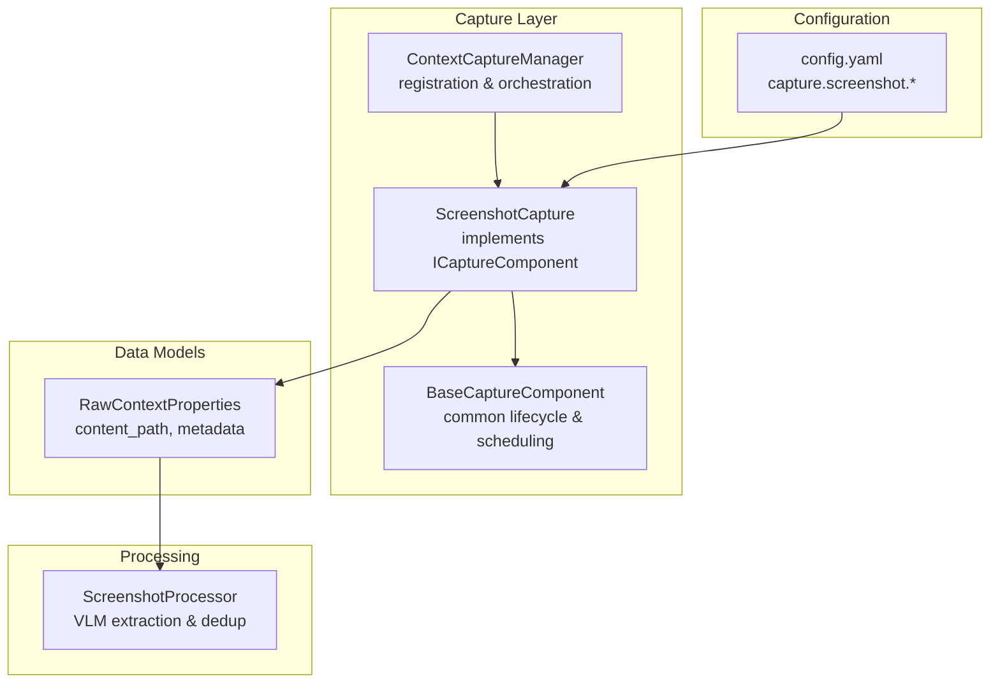
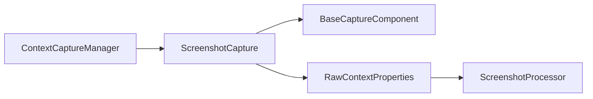

# Screenshot Monitoring

<cite>
**Referenced Files in This Document**
- [screenshot.py](file://opencontext/context_capture/screenshot.py)
- [base.py](file://opencontext/context_capture/base.py)
- [capture_interface.py](file://opencontext/interfaces/capture_interface.py)
- [capture_manager.py](file://opencontext/managers/capture_manager.py)
- [config.yaml](file://config/config.yaml)
- [context.py](file://opencontext/models/context.py)
- [screenshot_processor.py](file://opencontext/context_processing/processor/screenshot_processor.py)
- [example_screenshot_processor.py](file://examples/example_screenshot_processor.py)
- [window_capture.py](file://frontend/externals/python/window_capture/window_capture.py)
</cite>

## Table of Contents
1. [Introduction](#introduction)
2. [Project Structure](#project-structure)
3. [Core Components](#core-components)
4. [Architecture Overview](#architecture-overview)
5. [Detailed Component Analysis](#detailed-component-analysis)
6. [Dependency Analysis](#dependency-analysis)
7. [Performance Considerations](#performance-considerations)
8. [Troubleshooting Guide](#troubleshooting-guide)
9. [Conclusion](#conclusion)

## Introduction
This document explains MineContext’s screenshot monitoring feature, focusing on how the ScreenshotCapture component implements the ICaptureComponent interface and integrates with the CaptureManager. It details how the capture() method uses system-level window capture utilities to take screenshots at configured intervals, describes configuration options in config.yaml, and explains how raw image data is packaged into RawContextProperties with metadata such as timestamp and monitor identity. It also covers performance considerations, strategies to minimize system impact, and error handling for permission and display access failures.

## Project Structure
The screenshot monitoring feature spans several modules:
- Capture component and base classes: ScreenshotCapture and BaseCaptureComponent implement the ICaptureComponent interface and provide lifecycle and scheduling logic.
- Capture manager: ContextCaptureManager registers, initializes, starts, and stops capture components and aggregates statistics.
- Configuration: config.yaml defines capture settings including capture_interval and storage_path.
- Data models: RawContextProperties encapsulates captured image metadata and content path.
- Processing pipeline: ScreenshotProcessor consumes RawContextProperties, performs deduplication and asynchronous VLM extraction, and merges results.

**Diagram sources**
- [screenshot.py](file://opencontext/context_capture/screenshot.py#L28-L120)
- [base.py](file://opencontext/context_capture/base.py#L26-L120)
- [capture_manager.py](file://opencontext/managers/capture_manager.py#L23-L120)
- [config.yaml](file://config/config.yaml#L40-L70)
- [context.py](file://opencontext/models/context.py#L35-L80)
- [screenshot_processor.py](file://opencontext/context_processing/processor/screenshot_processor.py#L47-L120)

**Section sources**
- [screenshot.py](file://opencontext/context_capture/screenshot.py#L28-L120)
- [base.py](file://opencontext/context_capture/base.py#L26-L120)
- [capture_manager.py](file://opencontext/managers/capture_manager.py#L23-L120)
- [config.yaml](file://config/config.yaml#L40-L70)
- [context.py](file://opencontext/models/context.py#L35-L80)
- [screenshot_processor.py](file://opencontext/context_processing/processor/screenshot_processor.py#L47-L120)

## Core Components
- ScreenshotCapture: Implements ICaptureComponent and BaseCaptureComponent to provide periodic screen capture using system-level utilities, packaging results into RawContextProperties with metadata.
- BaseCaptureComponent: Provides shared lifecycle, scheduling, and statistics for capture components.
- ContextCaptureManager: Registers components, sets callbacks, and orchestrates start/stop and manual capture.
- RawContextProperties: Data model representing captured image content and associated metadata.
- ScreenshotProcessor: Consumes RawContextProperties, performs deduplication, and extracts context via Vision LLM asynchronously.

**Section sources**
- [screenshot.py](file://opencontext/context_capture/screenshot.py#L28-L120)
- [base.py](file://opencontext/context_capture/base.py#L26-L120)
- [capture_manager.py](file://opencontext/managers/capture_manager.py#L23-L120)
- [context.py](file://opencontext/models/context.py#L35-L80)
- [screenshot_processor.py](file://opencontext/context_processing/processor/screenshot_processor.py#L47-L120)

## Architecture Overview
The screenshot monitoring architecture follows a componentized design:
- ScreenshotCapture inherits from BaseCaptureComponent and implements ICaptureComponent.
- ContextCaptureManager registers and controls ScreenshotCapture instances, wiring a callback so captured RawContextProperties propagate upward.
- RawContextProperties carries image content_path and metadata (format, timestamp, monitor, region, tags).
- ScreenshotProcessor consumes these contexts, deduplicates images, and performs asynchronous VLM extraction and merging.

```mermaid
classDiagram
class ICaptureComponent {
+initialize(config) bool
+start() bool
+stop(graceful) bool
+is_running() bool
+capture() RawContextProperties[]
+get_name() str
+get_description() str
+get_config_schema() Dict
+validate_config(config) bool
+get_status() Dict
+get_statistics() Dict
+reset_statistics() bool
+set_callback(callback) bool
}
class BaseCaptureComponent {
-_name : str
-_description : str
-_source_type : ContextSource
-_config : Dict
-_running : bool
-_capture_thread : Thread
-_stop_event : Event
-_callback : callable
-_capture_interval : float
-_last_capture_time : datetime
-_capture_count : int
-_error_count : int
-_last_error : str
+initialize(config) bool
+start() bool
+stop(graceful) bool
+is_running() bool
+capture() RawContextProperties[]
+get_name() str
+get_description() str
+get_config_schema() Dict
+validate_config(config) bool
+get_status() Dict
+get_statistics() Dict
+reset_statistics() bool
+set_callback(callback) bool
#_initialize_impl(config) bool
#_start_impl() bool
#_stop_impl(graceful) bool
#_capture_impl() RawContextProperties[]
#_get_config_schema_impl() Dict
#_validate_config_impl(config) bool
#_get_status_impl() Dict
#_get_statistics_impl() Dict
#_reset_statistics_impl() None
}
class ScreenshotCapture {
-_screenshot_lib : str
-_screenshot_count : int
-_last_screenshot_path : str
-_last_screenshot_time : datetime
-_screenshot_format : str
-_screenshot_quality : int
-_screenshot_region : tuple
-_save_screenshots : bool
-_screenshot_dir : str
-_dedup_enabled : bool
-_similarity_threshold : float
-_max_image_size : int
-_resize_quality : int
+_initialize_impl(config) bool
+_start_impl() bool
+_stop_impl(graceful) bool
+_capture_impl() RawContextProperties[]
+_take_screenshot() list
+_get_config_schema_impl() Dict
+_validate_config_impl(config) bool
+_get_status_impl() Dict
+_get_statistics_impl() Dict
+_reset_statistics_impl() None
}
class ContextCaptureManager {
-_components : Dict[str, ICaptureComponent]
-_component_configs : Dict[str, Dict[str, Any]]
-_running_components : Set[str]
-_callback : callable
-_statistics : Dict
+register_component(name, component) bool
+unregister_component(component_name) bool
+initialize_component(component_name, config) bool
+start_component(component_name) bool
+stop_component(component_name, graceful) bool
+start_all_components() Dict[str, bool]
+stop_all_components(graceful) Dict[str, bool]
+get_component(component_name) ICaptureComponent?
+get_all_components() Dict[str, ICaptureComponent]
+get_running_components() Dict[str, ICaptureComponent]
+set_callback(callback) None
+capture(component_name) RawContextProperties[]
+capture_all() Dict[str, RawContextProperties[]]
+get_statistics() Dict
+shutdown(graceful) None
+reset_statistics() None
}
class RawContextProperties {
+content_format : ContentFormat
+source : ContextSource
+create_time : datetime
+content_path : str?
+additional_info : Dict?
+to_dict() Dict
+from_dict(data) RawContextProperties
}
class ScreenshotProcessor {
+process(context) bool
+batch_process(raw_contexts) ProcessedContext[]
+shutdown(graceful) None
+get_name() str
+get_description() str
}
ICaptureComponent <|.. BaseCaptureComponent
BaseCaptureComponent <|-- ScreenshotCapture
ContextCaptureManager --> ICaptureComponent : "controls"
ScreenshotCapture --> RawContextProperties : "produces"
ScreenshotProcessor --> RawContextProperties : "consumes"
```

**Diagram sources**
- [capture_interface.py](file://opencontext/interfaces/capture_interface.py#L18-L153)
- [base.py](file://opencontext/context_capture/base.py#L26-L120)
- [screenshot.py](file://opencontext/context_capture/screenshot.py#L28-L120)
- [capture_manager.py](file://opencontext/managers/capture_manager.py#L23-L120)
- [context.py](file://opencontext/models/context.py#L35-L80)
- [screenshot_processor.py](file://opencontext/context_processing/processor/screenshot_processor.py#L47-L120)

## Detailed Component Analysis

### ScreenshotCapture Implementation
- Implements ICaptureComponent via BaseCaptureComponent, adding:
  - Library selection and initialization for system-level capture.
  - Configuration validation and schema for capture_interval, screenshot_format, screenshot_quality, screenshot_region, storage_path, dedup_enabled, similarity_threshold, max_image_size, resize_quality.
  - Periodic capture loop managed by BaseCaptureComponent’s scheduler.
  - Packaging of captured images into RawContextProperties with metadata including format, timestamp, library, region, screenshot_format, screenshot_path, and tags.

Key behaviors:
- Initialization loads the screenshot library and applies configuration defaults and validations.
- Start/Stop manage lifecycle and graceful submission of pending contexts.
- Capture invokes _take_screenshot to capture per-monitor frames, converts to binary, and creates RawContextProperties entries.
- Status and statistics expose runtime metrics and counts.

**Section sources**
- [screenshot.py](file://opencontext/context_capture/screenshot.py#L28-L120)
- [screenshot.py](file://opencontext/context_capture/screenshot.py#L176-L245)
- [screenshot.py](file://opencontext/context_capture/screenshot.py#L246-L299)
- [screenshot.py](file://opencontext/context_capture/screenshot.py#L300-L354)
- [screenshot.py](file://opencontext/context_capture/screenshot.py#L355-L454)
- [screenshot.py](file://opencontext/context_capture/screenshot.py#L455-L508)

### BaseCaptureComponent and Scheduling
- Provides shared lifecycle management:
  - initialize validates config and sets capture_interval.
  - start spawns a capture thread if capture_interval is configured.
  - stop signals the thread and calls subclass stop logic.
  - capture executes subclass _capture_impl and invokes callback with results.
- Exposes get_config_schema, validate_config, get_status, get_statistics, reset_statistics, and set_callback.

**Section sources**
- [base.py](file://opencontext/context_capture/base.py#L57-L120)
- [base.py](file://opencontext/context_capture/base.py#L129-L165)
- [base.py](file://opencontext/context_capture/base.py#L176-L220)
- [base.py](file://opencontext/context_capture/base.py#L239-L310)
- [base.py](file://opencontext/context_capture/base.py#L311-L387)
- [base.py](file://opencontext/context_capture/base.py#L388-L431)

### ContextCaptureManager Integration
- Registers ScreenshotCapture instances and wires callbacks so captured contexts bubble up to the manager’s upper-level callback.
- Supports manual capture via capture(component_name) and batch capture via capture_all().
- Aggregates statistics across components and errors.

**Section sources**
- [capture_manager.py](file://opencontext/managers/capture_manager.py#L23-L120)
- [capture_manager.py](file://opencontext/managers/capture_manager.py#L135-L207)
- [capture_manager.py](file://opencontext/managers/capture_manager.py#L312-L356)
- [capture_manager.py](file://opencontext/managers/capture_manager.py#L357-L391)

### RawContextProperties Packaging
- Captured images are packaged into RawContextProperties with:
  - source: SCREENSHOT
  - content_format: IMAGE
  - content_path: absolute path to saved image (when enabled)
  - additional_info: format, timestamp, last_seen_timestamp, lib, region, screenshot_format, screenshot_path, duration_count, and tags including screenshot, format, lib, and monitor.
- Timestamps and metadata are included for downstream processing and UI.

**Section sources**
- [screenshot.py](file://opencontext/context_capture/screenshot.py#L176-L216)
- [context.py](file://opencontext/models/context.py#L35-L80)

### Configuration Options in config.yaml
- capture.screenshot.enabled: toggles screenshot capture.
- capture.screenshot.capture_interval: seconds between captures.
- capture.screenshot.storage_path: directory to save screenshots.

These settings are consumed by ScreenshotCapture’s configuration schema and validation.

**Section sources**
- [config.yaml](file://config/config.yaml#L40-L70)
- [screenshot.py](file://opencontext/context_capture/screenshot.py#L300-L354)
- [screenshot.py](file://opencontext/context_capture/screenshot.py#L355-L454)

### System-Level Capture Utilities and Monitors
- ScreenshotCapture uses a system-level library to capture:
  - Entire screen per monitor when no screenshot_region is configured.
  - A specified rectangular region when screenshot_region is provided.
- Captured frames are converted to binary image data and packaged into RawContextProperties with monitor identifiers and coordinates.

**Section sources**
- [screenshot.py](file://opencontext/context_capture/screenshot.py#L246-L299)

### Frontend Window Capture Utility
- The Electron-side window capture utility (window_capture.py) demonstrates system-level window capture on macOS using Quartz APIs, including window selection heuristics and fallback to screen capture with cropping. While distinct from ScreenshotCapture’s monitor-based capture, it illustrates the underlying system-level primitives used for window capture.

**Section sources**
- [window_capture.py](file://frontend/externals/python/window_capture/window_capture.py#L1-L221)

### Example: Packaging Raw Image Data into RawContextProperties
- The example shows how to construct RawContextProperties for existing image files and pass them to ScreenshotProcessor for batch processing. This mirrors how ScreenshotCapture packages captured images into RawContextProperties for downstream processing.

**Section sources**
- [example_screenshot_processor.py](file://examples/example_screenshot_processor.py#L100-L140)
- [context.py](file://opencontext/models/context.py#L35-L80)

## Dependency Analysis
- ScreenshotCapture depends on:
  - BaseCaptureComponent for lifecycle and scheduling.
  - PIL/Pillow for image manipulation and binary serialization.
  - mss for system-level screen capture.
  - RawContextProperties for output modeling.
- ContextCaptureManager depends on ICaptureComponent to orchestrate components generically.
- ScreenshotProcessor depends on:
  - Global configuration for processing parameters.
  - Async LLM clients for Vision LLM extraction.
  - Storage for batch upsert operations.
  - Image utilities for resizing and deduplication.

**Diagram sources**
- [screenshot.py](file://opencontext/context_capture/screenshot.py#L28-L120)
- [base.py](file://opencontext/context_capture/base.py#L26-L120)
- [capture_manager.py](file://opencontext/managers/capture_manager.py#L23-L120)
- [context.py](file://opencontext/models/context.py#L35-L80)
- [screenshot_processor.py](file://opencontext/context_processing/processor/screenshot_processor.py#L47-L120)

**Section sources**
- [screenshot.py](file://opencontext/context_capture/screenshot.py#L28-L120)
- [base.py](file://opencontext/context_capture/base.py#L26-L120)
- [capture_manager.py](file://opencontext/managers/capture_manager.py#L23-L120)
- [context.py](file://opencontext/models/context.py#L35-L80)
- [screenshot_processor.py](file://opencontext/context_processing/processor/screenshot_processor.py#L47-L120)

## Performance Considerations
- Continuous capture overhead:
  - Use capture_interval tuned to balance frequency and CPU/memory usage.
  - Prefer PNG for lossless capture or JPEG with appropriate screenshot_quality to trade off fidelity and file size.
  - Limit max_image_size and resize_quality to reduce memory footprint and processing cost.
- Deduplication:
  - Enable dedup_enabled and tune similarity_threshold to skip near-identical frames.
  - ScreenshotCapture maintains last stable screenshots per monitor to minimize redundant processing.
- Asynchronous processing:
  - ScreenshotProcessor batches and processes contexts concurrently, reducing latency and improving throughput.
  - Background thread queues and timeouts prevent blocking and memory pressure.
- Storage:
  - Disable saving screenshots (storage_path unset) to avoid disk I/O overhead when not needed.
  - Optionally delete duplicate files when enabled_delete is true.

[No sources needed since this section provides general guidance]

## Troubleshooting Guide
Common issues and handling:
- Permission denial or display access failures:
  - ScreenshotCapture logs exceptions during initialization, start, and capture operations. Validate configuration and ensure required libraries are installed.
  - On systems requiring explicit permissions (e.g., macOS), ensure the application has screen recording permissions.
- Invalid configuration:
  - capture_interval must be numeric and positive; screenshot_format must be one of png, jpg, jpeg; screenshot_quality must be 1–100; similarity_threshold must be 0–100; screenshot_region must contain integer left, top, width, height.
- Display configuration:
  - When screenshot_region is provided, capture is constrained to that rectangle; otherwise, captures each monitor individually.
  - If capture fails, verify monitor availability and permissions.
- Memory usage during continuous capture:
  - Reduce capture_interval, max_image_size, and resize_quality.
  - Enable deduplication to skip unchanged frames.
  - Use batch processing with appropriate batch_size and batch_timeout in ScreenshotProcessor.

**Section sources**
- [screenshot.py](file://opencontext/context_capture/screenshot.py#L128-L175)
- [screenshot.py](file://opencontext/context_capture/screenshot.py#L246-L299)
- [screenshot.py](file://opencontext/context_capture/screenshot.py#L355-L454)
- [base.py](file://opencontext/context_capture/base.py#L57-L120)
- [screenshot_processor.py](file://opencontext/context_processing/processor/screenshot_processor.py#L149-L171)

## Conclusion
MineContext’s screenshot monitoring feature combines a robust capture component with a flexible manager and a powerful processing pipeline. ScreenshotCapture implements ICaptureComponent via BaseCaptureComponent, schedules periodic captures, and packages results into RawContextProperties with rich metadata. The system supports configurable intervals, formats, regions, and deduplication, while ScreenshotProcessor asynchronously extracts and merges context from images. Proper configuration and performance tuning help minimize system impact and ensure reliable operation.