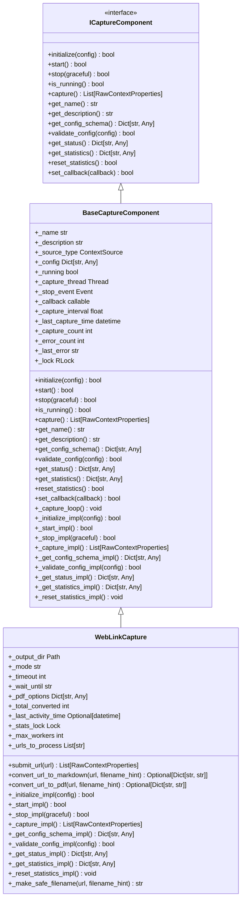
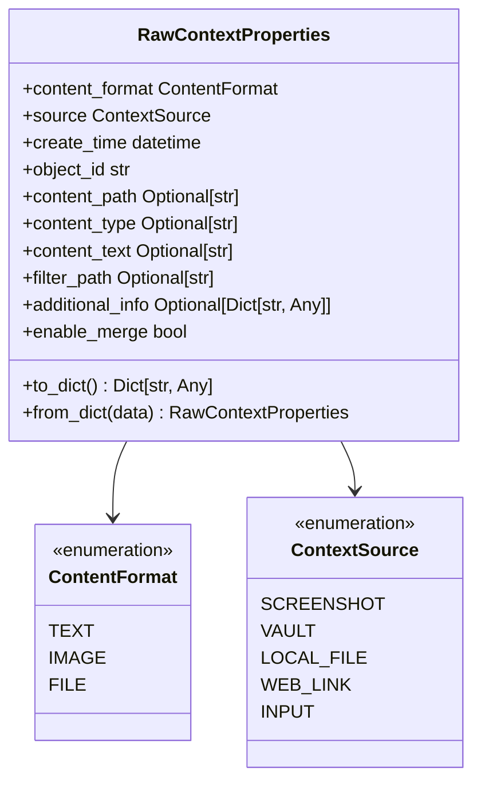

# Web Link Capture

<cite>
**Referenced Files in This Document**   
- [web_link_capture.py](file://opencontext/context_capture/web_link_capture.py)
- [config.yaml](file://config/config.yaml)
- [capture_interface.py](file://opencontext/interfaces/capture_interface.py)
- [base.py](file://opencontext/context_capture/base.py)
- [context.py](file://opencontext/models/context.py)
- [enums.py](file://opencontext/models/enums.py)
- [example_weblink_processor.py](file://examples/example_weblink_processor.py)
</cite>

## Table of Contents
1. [Introduction](#introduction)
2. [WebLinkCapture Component Implementation](#weblinkcapture-component-implementation)
3. [Configuration Options](#configuration-options)
4. [Web Link Data Packaging](#web-link-data-packaging)
5. [Capture Method Implementation](#capture-method-implementation)
6. [Privacy Considerations and User Consent](#privacy-considerations-and-user-consent)
7. [Error Handling](#error-handling)
8. [Conclusion](#conclusion)

## Introduction
The Web Link Capture feature in MineContext is designed to track user browsing activity by capturing visited URLs and converting them into structured context data. This documentation details how the WebLinkCapture component implements the ICaptureComponent interface to monitor browser activity, the configuration options available in config.yaml, how web link data is packaged into RawContextProperties with metadata, and the implementation details of the capture() method. The system focuses on privacy-conscious design while providing robust functionality for capturing and processing web content.

**Section sources**
- [web_link_capture.py](file://opencontext/context_capture/web_link_capture.py#L1-L351)

## WebLinkCapture Component Implementation

The WebLinkCapture component implements the ICaptureComponent interface through inheritance from BaseCaptureComponent, which provides the foundational structure for all capture components in the system. The component is specifically designed to capture web links and convert them into either Markdown or PDF format for further processing.

The WebLinkCapture class initializes with default values for output directory, conversion mode, timeout settings, and PDF rendering options. It implements the required methods from the ICaptureComponent interface, including initialize(), start(), stop(), and capture(). The component uses a thread-safe design with locks to manage statistics updates and handles URL processing through a temporary storage mechanism.

The implementation leverages external libraries such as crawl4ai for Markdown conversion and Playwright for PDF generation, with appropriate error handling for cases where these dependencies are not installed. The component processes URLs in parallel using ThreadPoolExecutor to improve performance when handling multiple URLs.



**Diagram sources **
- [capture_interface.py](file://opencontext/interfaces/capture_interface.py#L18-L153)
- [base.py](file://opencontext/context_capture/base.py#L26-L515)
- [web_link_capture.py](file://opencontext/context_capture/web_link_capture.py#L24-L351)

**Section sources**
- [web_link_capture.py](file://opencontext/context_capture/web_link_capture.py#L24-L351)
- [base.py](file://opencontext/context_capture/base.py#L26-L515)
- [capture_interface.py](file://opencontext/interfaces/capture_interface.py#L18-L153)

## Configuration Options

The WebLinkCapture component supports several configuration options that can be specified in the config.yaml file. These options allow users to customize the behavior of the web link capture functionality according to their needs.

The primary configuration options include:

- **output_dir**: Specifies the directory where generated files (PDFs or Markdown) will be stored. The default value is "uploads/weblinks".
- **mode**: Determines the conversion mode, with options for 'pdf' or 'markdown'. The default is 'pdf'.
- **max_workers**: Sets the maximum number of parallel threads for conversion operations. The default is 4.
- **timeout**: Defines the page load timeout in milliseconds for PDF conversion. The default is 30,000 ms.
- **wait_until**: Specifies the wait condition for page.goto in PDF conversion. The default is "networkidle".
- **pdf_format**: Sets the PDF page format (e.g., "A4").
- **print_background**: A boolean flag indicating whether to print CSS backgrounds for PDFs. The default is True.
- **landscape**: A boolean flag indicating whether to use landscape orientation for PDFs. The default is False.

These configuration options are validated during initialization to ensure they meet the required constraints. The component provides a configuration schema that describes the types and constraints of each configuration item, allowing for proper validation before use.

**Section sources**
- [web_link_capture.py](file://opencontext/context_capture/web_link_capture.py#L254-L296)
- [config.yaml](file://config/config.yaml#L1-L253)

## Web Link Data Packaging

The WebLinkCapture component packages captured web link data into RawContextProperties objects, which contain metadata about the captured content. The RawContextProperties class is defined in the context.py file and includes several key fields for storing information about the captured web content.

When a URL is captured, the system creates a RawContextProperties object with the following metadata:
- **source**: Set to ContextSource.WEB_LINK to indicate the source of the context
- **content_format**: Set to ContentFormat.FILE to indicate that the content is stored as a file
- **content_path**: The file path where the converted content (PDF or Markdown) is stored
- **create_time**: The timestamp when the context was created
- **filter_path**: The original URL, used for deduplication
- **additional_info**: A dictionary containing additional information such as the original URL and the path to the generated file
- **enable_merge**: A boolean flag indicating whether the context can be merged with similar contexts

The additional_info field contains specific metadata about the capture operation, including the original URL and the path to the generated file in the specified format (Markdown or PDF). This metadata is used by downstream components for processing and analysis.



**Diagram sources **
- [context.py](file://opencontext/models/context.py#L35-L46)
- [enums.py](file://opencontext/models/enums.py#L15-L21)

**Section sources**
- [web_link_capture.py](file://opencontext/context_capture/web_link_capture.py#L229-L238)
- [context.py](file://opencontext/models/context.py#L35-L46)

## Capture Method Implementation

The capture() method in the WebLinkCapture component is responsible for processing URLs and converting them into the specified format (Markdown or PDF). The method overrides the base capture method to accept a list of URLs, stores them for processing, and then calls the base class's capture method to initiate the capture process.

The _capture_impl() method processes the stored URLs using a ThreadPoolExecutor to handle multiple conversions in parallel. For each URL, it calls either convert_url_to_markdown() or convert_url_to_pdf() depending on the configured mode. The conversion functions use external libraries (crawl4ai for Markdown and Playwright for PDF) to render the web content and save it to the specified output directory.

The capture process includes several key steps:
1. Validation of the input URLs to ensure they are valid HTTP/HTTPS URLs
2. Creation of a safe filename based on the URL or provided filename hint
3. Directory creation for storing the output files
4. Asynchronous rendering of the web content using the appropriate library
5. Saving the rendered content to a file
6. Creation of a RawContextProperties object with metadata about the capture
7. Thread-safe update of statistics (total converted count and last activity time)

The method handles errors gracefully, logging exceptions and continuing with the remaining URLs if one fails. After processing all URLs, it clears the list of URLs to process for the next capture operation.

```mermaid
flowchart TD
Start([capture() method]) --> ValidateURLs["Validate input URLs"]
ValidateURLs --> StoreURLs["Store URLs in _urls_to_process"]
StoreURLs --> CallBaseCapture["Call super().capture()"]
CallBaseCapture --> _capture_impl["_capture_impl()"]
_capture_impl --> CheckURLs["Check if URLs exist"]
CheckURLs --> |Yes| LogStart["Log capture start"]
CheckURLs --> |No| ReturnEmpty["Return empty list"]
LogStart --> DetermineMode["Determine conversion mode"]
DetermineMode --> SetupThreadPool["Create ThreadPoolExecutor"]
SetupThreadPool --> SubmitTasks["Submit conversion tasks"]
SubmitTasks --> WaitForCompletion["Wait for task completion"]
WaitForCompletion --> ProcessResults["Process conversion results"]
ProcessResults --> CreateRawContext["Create RawContextProperties"]
CreateRawContext --> UpdateStats["Update statistics"]
ProcessResults --> HandleErrors["Handle conversion errors"]
UpdateStats --> ClearURLs["Clear _urls_to_process"]
ClearURLs --> LogFinish["Log capture completion"]
LogFinish --> ReturnResults["Return results"]
```

**Diagram sources **
- [web_link_capture.py](file://opencontext/context_capture/web_link_capture.py#L191-L252)

**Section sources**
- [web_link_capture.py](file://opencontext/context_capture/web_link_capture.py#L191-L252)
- [example_weblink_processor.py](file://examples/example_weblink_processor.py#L1-L95)

## Privacy Considerations and User Consent

The WebLinkCapture component incorporates several privacy considerations in its design and implementation. The system is designed to respect user privacy by default, with configuration options that allow users to control how their browsing activity is captured and stored.

The component does not directly integrate with browser extensions or system APIs to obtain browsing history and tab information. Instead, it relies on explicit user submission of URLs through the submit_url() method or direct calls to the capture() method. This approach ensures that only URLs intentionally provided by the user are captured, rather than automatically monitoring all browsing activity.

The configuration file includes general privacy settings through the api_auth section, which can enable authentication for API endpoints. However, there are no specific browser_support or privacy_settings options in the config.yaml file related to web link capture. This suggests that the system prioritizes user-initiated capture over automatic monitoring, which is a privacy-preserving approach.

The component also includes error handling for cases where required dependencies (crawl4ai or Playwright) are not installed, preventing the system from attempting to capture content without the necessary tools. This ensures that users are aware of the requirements for web link capture and can make informed decisions about installing the necessary components.

**Section sources**
- [web_link_capture.py](file://opencontext/context_capture/web_link_capture.py#L71-L77)
- [web_link_capture.py](file://opencontext/context_capture/web_link_capture.py#L127-L135)
- [config.yaml](file://config/config.yaml#L192-L211)

## Error Handling

The WebLinkCapture component implements comprehensive error handling for various scenarios that may occur during the capture process. The error handling strategy includes validation, exception catching, and graceful degradation to ensure the system remains stable even when individual capture operations fail.

Key error handling mechanisms include:

1. **URL validation**: The submit_url() method validates that the provided URL is a string and starts with "http://" or "https://", logging an error for invalid URLs and returning an empty list.

2. **Dependency checking**: The convert_url_to_markdown() and convert_url_to_pdf() methods check for the presence of required dependencies (crawl4ai and Playwright) and log appropriate error messages if they are not installed.

3. **Directory creation**: The component attempts to create the output directory and logs exceptions if this fails, preventing subsequent file operations from failing due to missing directories.

4. **Asynchronous operation handling**: The Markdown conversion uses asyncio.run() within a try-except block to handle potential issues with event loop management in threaded environments.

5. **Individual URL failure tolerance**: When processing multiple URLs, the component uses a future-to-url mapping with as_completed() to process results as they become available. If a specific URL conversion fails, it logs the error but continues processing the remaining URLs.

6. **Thread-safe statistics updates**: The component uses a threading.Lock to ensure that updates to statistics (total_converted and last_activity_time) are thread-safe, preventing race conditions in multi-threaded environments.

7. **Configuration validation**: The _initialize_impl() method includes comprehensive error handling for configuration issues, logging exceptions and returning False if initialization fails.

The error handling approach prioritizes system stability and user feedback, ensuring that failures in one part of the system do not cascade to other components while providing clear error messages for troubleshooting.

**Section sources**
- [web_link_capture.py](file://opencontext/context_capture/web_link_capture.py#L56-L58)
- [web_link_capture.py](file://opencontext/context_capture/web_link_capture.py#L73-L77)
- [web_link_capture.py](file://opencontext/context_capture/web_link_capture.py#L127-L135)
- [web_link_capture.py](file://opencontext/context_capture/web_link_capture.py#L243-L245)
- [web_link_capture.py](file://opencontext/context_capture/web_link_capture.py#L160-L181)

## Conclusion

The WebLinkCapture component provides a robust solution for capturing and processing web content within the MineContext system. By implementing the ICaptureComponent interface, it integrates seamlessly with the broader context capture framework while providing specialized functionality for web link capture.

The component's design emphasizes flexibility through configurable options, efficiency through parallel processing, and reliability through comprehensive error handling. The use of RawContextProperties ensures that captured web content is packaged with rich metadata for downstream processing and analysis.

Privacy is addressed through a user-initiated capture model rather than automatic monitoring of browsing activity, aligning with best practices for user privacy. The component relies on external libraries for content conversion, with appropriate error handling for missing dependencies.

The implementation demonstrates a thoughtful balance between functionality and usability, providing users with control over how their web content is captured and processed while maintaining system stability and performance.