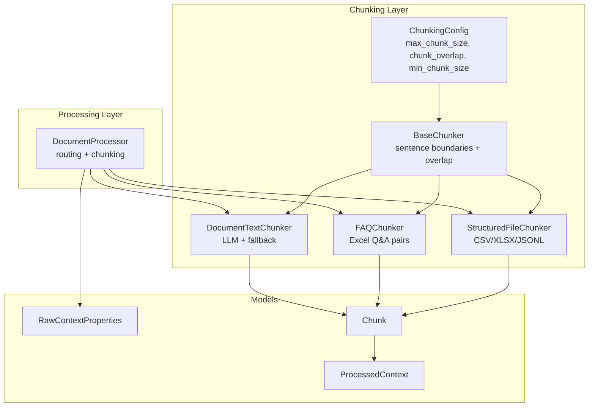
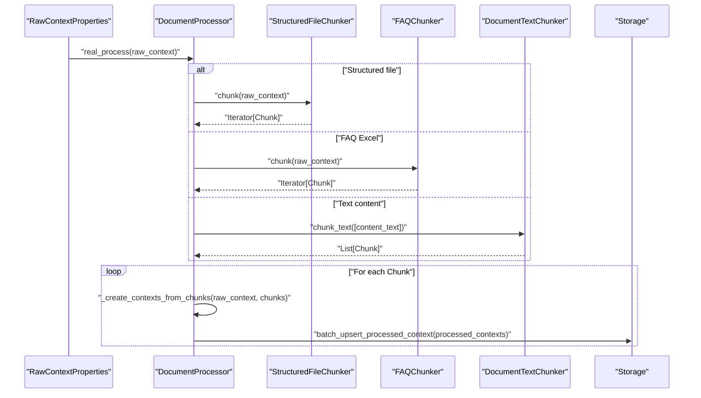
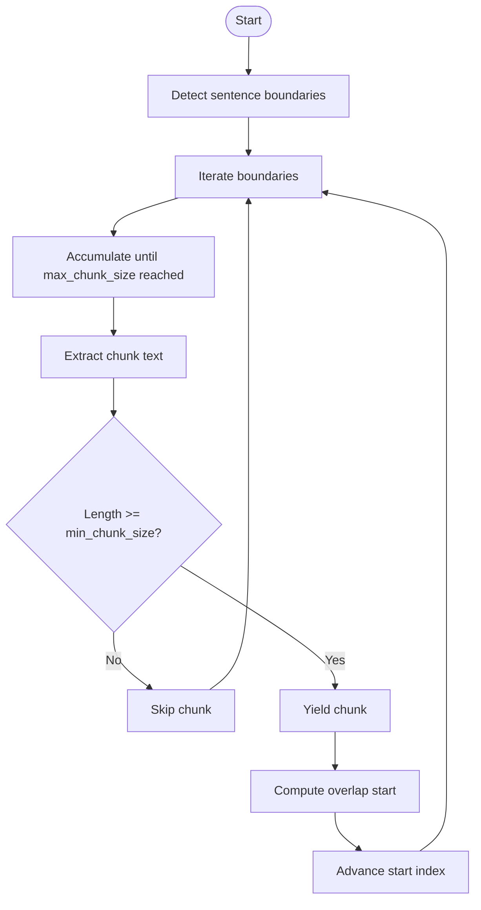
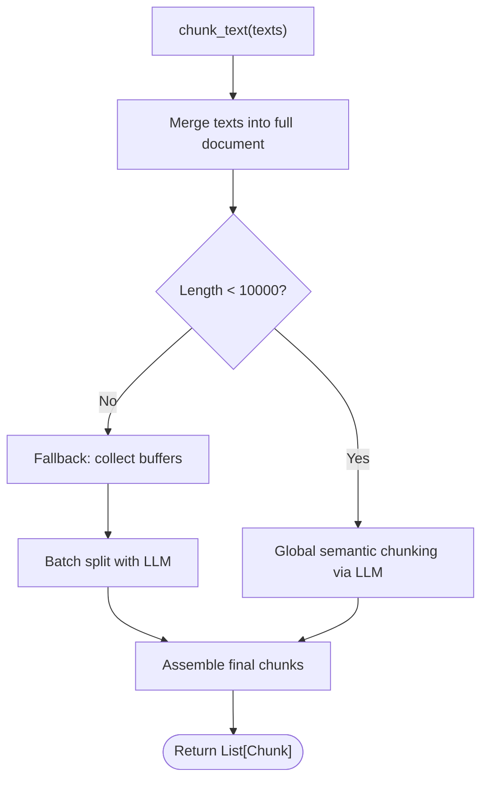
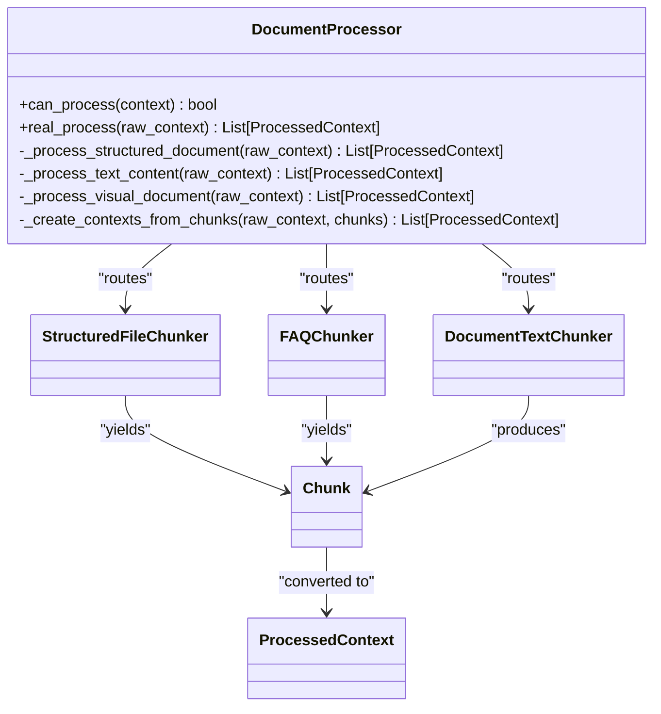
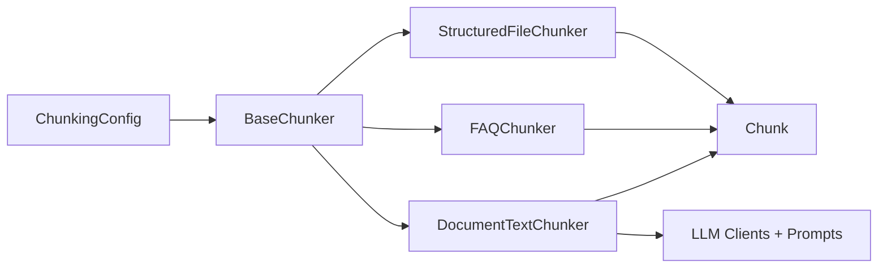

# Content Chunking Strategies

<cite>
**Referenced Files in This Document**
- [chunkers.py](file://opencontext/context_processing/chunker/chunkers.py)
- [document_text_chunker.py](file://opencontext/context_processing/chunker/document_text_chunker.py)
- [document_processor.py](file://opencontext/context_processing/processor/document_processor.py)
- [context.py](file://opencontext/models/context.py)
- [config.yaml](file://config/config.yaml)
- [prompts_en.yaml](file://config/prompts_en.yaml)
- [example_document_processor.py](file://examples/example_document_processor.py)
</cite>

## Table of Contents
1. [Introduction](#introduction)
2. [Project Structure](#project-structure)
3. [Core Components](#core-components)
4. [Architecture Overview](#architecture-overview)
5. [Detailed Component Analysis](#detailed-component-analysis)
6. [Dependency Analysis](#dependency-analysis)
7. [Performance Considerations](#performance-considerations)
8. [Troubleshooting Guide](#troubleshooting-guide)
9. [Conclusion](#conclusion)
10. [Appendices](#appendices)

## Introduction
This document explains MineContext’s content chunking strategies used in the data processing pipeline. Chunking is essential for transforming large captured content (documents, screenshots, web pages) into semantically meaningful units suitable for downstream AI processing. It ensures retrieval accuracy and LLM performance by balancing chunk size, overlap, and semantic coherence.

The chunking subsystem consists of:
- A shared configuration model for chunking parameters
- A base chunker with sentence-boundary-aware overlapping chunking
- Specialized chunkers for structured files and FAQs
- A document text chunker that intelligently splits text using LLMs and fallback strategies
- Integration points within the document processor to route content to appropriate chunkers and produce ProcessedContext objects

## Project Structure
The chunking logic resides in the processing layer, alongside the document processor and models that represent raw and processed contexts.

**Diagram sources**
- [chunkers.py](file://opencontext/context_processing/chunker/chunkers.py#L28-L154)
- [document_text_chunker.py](file://opencontext/context_processing/chunker/document_text_chunker.py#L25-L349)
- [document_processor.py](file://opencontext/context_processing/processor/document_processor.py#L41-L120)
- [context.py](file://opencontext/models/context.py#L24-L140)

**Section sources**
- [chunkers.py](file://opencontext/context_processing/chunker/chunkers.py#L28-L154)
- [document_text_chunker.py](file://opencontext/context_processing/chunker/document_text_chunker.py#L25-L349)
- [document_processor.py](file://opencontext/context_processing/processor/document_processor.py#L41-L120)
- [context.py](file://opencontext/models/context.py#L24-L140)

## Core Components
- ChunkingConfig: Centralizes chunking parameters (max chunk size, overlap, min size, batch size, caching).
- BaseChunker: Provides sentence boundary detection and overlapping chunk generation.
- StructuredFileChunker: Streams structured files (CSV, XLSX, JSONL) and emits chunks with metadata.
- FAQChunker: Parses Excel files into Q&A pair chunks.
- DocumentTextChunker: Splits text extracted from VLM into semantic chunks using LLMs or fallback strategies.
- DocumentProcessor: Routes raw contexts to the correct chunker and creates ProcessedContext objects.

Key responsibilities:
- Memory efficiency: Iterators and streaming for large files
- Configurable chunk sizes and overlaps
- Metadata preservation for structured and FAQ content
- Intelligent splitting for long documents via LLM
- Fallback mechanisms for oversized or malformed content

**Section sources**
- [chunkers.py](file://opencontext/context_processing/chunker/chunkers.py#L28-L154)
- [document_text_chunker.py](file://opencontext/context_processing/chunker/document_text_chunker.py#L25-L349)
- [document_processor.py](file://opencontext/context_processing/processor/document_processor.py#L200-L340)
- [context.py](file://opencontext/models/context.py#L24-L140)

## Architecture Overview
The chunking pipeline integrates with the document processor to transform raw content into ProcessedContext chunks. Routing logic selects the appropriate chunker based on content type and file format.

**Diagram sources**
- [document_processor.py](file://opencontext/context_processing/processor/document_processor.py#L224-L310)
- [chunkers.py](file://opencontext/context_processing/chunker/chunkers.py#L155-L439)
- [document_text_chunker.py](file://opencontext/context_processing/chunker/document_text_chunker.py#L39-L120)

## Detailed Component Analysis

### BaseChunker and Overlapping Chunking
BaseChunker implements sentence-boundary-aware overlapping chunking:
- Sentence boundary detection caches results for performance
- Overlapping chunks are generated by advancing a sliding window respecting max chunk size and overlap
- Minimum chunk size filtering prevents tiny fragments

**Diagram sources**
- [chunkers.py](file://opencontext/context_processing/chunker/chunkers.py#L82-L154)

**Section sources**
- [chunkers.py](file://opencontext/context_processing/chunker/chunkers.py#L82-L154)

### StructuredFileChunker
Handles CSV, XLSX, and JSONL files:
- CSV: Reads in batches, converts DataFrame rows to text, yields chunks with metadata
- XLSX: Iterates sheets and pages, yields chunks with sheet name and row range
- JSONL: Buffers lines by batch size, yields chunks with line counts

Metadata preserved includes file type, columns, row counts, and file path.

**Section sources**
- [chunkers.py](file://opencontext/context_processing/chunker/chunkers.py#L155-L348)

### FAQChunker
Parses Excel files into Q&A chunks:
- Identifies question and answer columns heuristically
- Falls back to first two columns if none found
- Emits chunks with metadata including row index and column names

**Section sources**
- [chunkers.py](file://opencontext/context_processing/chunker/chunkers.py#L350-L439)

### DocumentTextChunker
Intelligent text chunking for VLM-extracted text:
- Strategy selection:
  - Short documents (<10000 characters): Global semantic chunking via LLM
  - Long documents: Fallback to paragraph-based accumulation with LLM batching
- Oversized element handling:
  - If a single element exceeds max chunk size, splits by punctuation or halves
- LLM prompts:
  - Uses configured prompt groups for text chunking and global semantic chunking
- Assembly:
  - Validates LLM responses and filters by min chunk size

**Diagram sources**
- [document_text_chunker.py](file://opencontext/context_processing/chunker/document_text_chunker.py#L39-L120)
- [document_text_chunker.py](file://opencontext/context_processing/chunker/document_text_chunker.py#L133-L219)
- [document_text_chunker.py](file://opencontext/context_processing/chunker/document_text_chunker.py#L255-L319)

**Section sources**
- [document_text_chunker.py](file://opencontext/context_processing/chunker/document_text_chunker.py#L39-L120)
- [document_text_chunker.py](file://opencontext/context_processing/chunker/document_text_chunker.py#L133-L219)
- [document_text_chunker.py](file://opencontext/context_processing/chunker/document_text_chunker.py#L223-L319)

### Routing Logic in DocumentProcessor
DocumentProcessor routes raw contexts to the correct chunker:
- Structured documents: CSV/XLSX/JSONL -> StructuredFileChunker
- FAQ Excel: -> FAQChunker
- Text content: -> DocumentTextChunker
- Visual documents: Converted to images, VLM extracts text, then -> DocumentTextChunker

It then converts Chunk objects into ProcessedContext with vectorizable text and metadata.

**Diagram sources**
- [document_processor.py](file://opencontext/context_processing/processor/document_processor.py#L224-L310)
- [chunkers.py](file://opencontext/context_processing/chunker/chunkers.py#L155-L439)
- [document_text_chunker.py](file://opencontext/context_processing/chunker/document_text_chunker.py#L303-L349)
- [context.py](file://opencontext/models/context.py#L131-L192)

**Section sources**
- [document_processor.py](file://opencontext/context_processing/processor/document_processor.py#L224-L310)
- [context.py](file://opencontext/models/context.py#L131-L192)

### Configuration Options
Chunking parameters are configured centrally:
- ChunkingConfig: max_chunk_size, chunk_overlap, min_chunk_size, batch_size, enable_caching
- DocumentProcessor initializes DocumentTextChunker with default ChunkingConfig values
- Global configuration includes document processing settings (e.g., DPI, VLM batch size, text threshold)

Practical guidance:
- max_chunk_size: Tune to fit LLM context windows and embedding costs
- chunk_overlap: Helps preserve continuity across chunk boundaries
- min_chunk_size: Prevents fragmentation into useless small chunks
- batch_size: Controls streaming and processing throughput

**Section sources**
- [chunkers.py](file://opencontext/context_processing/chunker/chunkers.py#L28-L44)
- [document_processor.py](file://opencontext/context_processing/processor/document_processor.py#L75-L85)
- [config.yaml](file://config/config.yaml#L16-L31)

### Prompt-Based Chunking Behavior
The LLM prompts guide DocumentTextChunker behavior:
- Global semantic chunking: Merges semantically coherent paragraphs and maintains readability
- Text chunking: Splits at sentence boundaries with structure awareness (lists, titles, code blocks)
- Output format: JSON array of chunks

These prompts ensure semantic coherence and readability even when exceeding strict length limits.

**Section sources**
- [prompts_en.yaml](file://config/prompts_en.yaml#L1587-L1852)
- [document_text_chunker.py](file://opencontext/context_processing/chunker/document_text_chunker.py#L181-L219)
- [document_text_chunker.py](file://opencontext/context_processing/chunker/document_text_chunker.py#L255-L319)

### Concrete Examples from the Codebase
- Example usage of DocumentProcessor to process documents and inspect chunk summaries
- Routing logic demonstrates how raw contexts are transformed into ProcessedContext chunks

**Section sources**
- [example_document_processor.py](file://examples/example_document_processor.py#L120-L170)
- [document_processor.py](file://opencontext/context_processing/processor/document_processor.py#L224-L310)

## Dependency Analysis
Chunkers depend on:
- ChunkingConfig for parameters
- RawContextProperties for input
- Chunk for output
- LLM clients and prompt groups for intelligent splitting

**Diagram sources**
- [chunkers.py](file://opencontext/context_processing/chunker/chunkers.py#L28-L154)
- [document_text_chunker.py](file://opencontext/context_processing/chunker/document_text_chunker.py#L181-L219)

**Section sources**
- [chunkers.py](file://opencontext/context_processing/chunker/chunkers.py#L28-L154)
- [document_text_chunker.py](file://opencontext/context_processing/chunker/document_text_chunker.py#L181-L219)

## Performance Considerations
- Streaming and batching: StructuredFileChunker reads CSV/XLSX in chunks and JSONL in buffered lines to avoid memory spikes.
- Overlap computation: BaseChunker advances indices carefully to minimize redundant boundary scans.
- LLM batching: DocumentTextChunker batches concurrent LLM calls to reduce latency.
- Caching: Sentence boundary detection uses caching to accelerate repeated operations.
- Backpressure: DocumentProcessor uses queues and timeouts to manage throughput.

[No sources needed since this section provides general guidance]

## Troubleshooting Guide
Common issues and resolutions:
- Over-chunking:
  - Symptoms: Too many tiny chunks, low semantic coherence
  - Actions: Increase max_chunk_size and/or chunk_overlap; adjust LLM prompts to prefer larger coherent segments
- Under-chunking:
  - Symptoms: Very large chunks causing retrieval gaps
  - Actions: Decrease max_chunk_size; enforce stricter sentence boundary splitting
- Special content types:
  - Lists and code blocks: Ensure LLM prompts keep these intact; verify DocumentTextChunker fallback logic
  - FAQ Excel: Verify column detection heuristics; confirm metadata includes row indices
- Structured files:
  - CSV/XLSX/JSONL: Confirm batch_size and file encoding; check metadata completeness
- LLM failures:
  - Symptoms: Non-list responses or exceptions
  - Actions: Fallback to oversized element splitting; review prompt group configuration

**Section sources**
- [document_text_chunker.py](file://opencontext/context_processing/chunker/document_text_chunker.py#L133-L219)
- [chunkers.py](file://opencontext/context_processing/chunker/chunkers.py#L155-L348)

## Conclusion
MineContext’s chunking pipeline balances memory efficiency, semantic coherence, and performance. BaseChunker provides robust sentence-aware overlapping chunking, while specialized chunkers handle structured and FAQ content. DocumentTextChunker intelligently splits long documents using LLMs with fallback strategies. Proper configuration of chunk sizes, overlaps, and batch sizes ensures optimal retrieval accuracy and LLM performance across diverse content types.

[No sources needed since this section summarizes without analyzing specific files]

## Appendices

### Integration Points with Processor Pipeline
- DocumentProcessor routes raw contexts to the appropriate chunker based on content type and file format
- Converts Chunk objects into ProcessedContext with vectorizable text and metadata
- Stores results via batch_upsert to the unified storage backend

**Section sources**
- [document_processor.py](file://opencontext/context_processing/processor/document_processor.py#L224-L310)
- [context.py](file://opencontext/models/context.py#L131-L192)