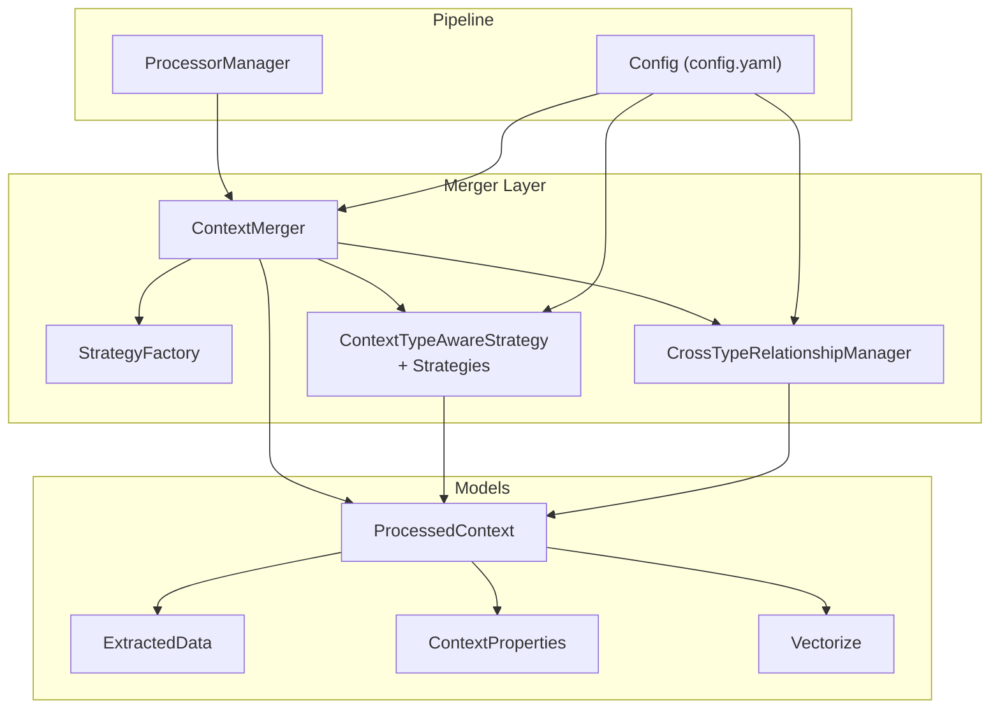
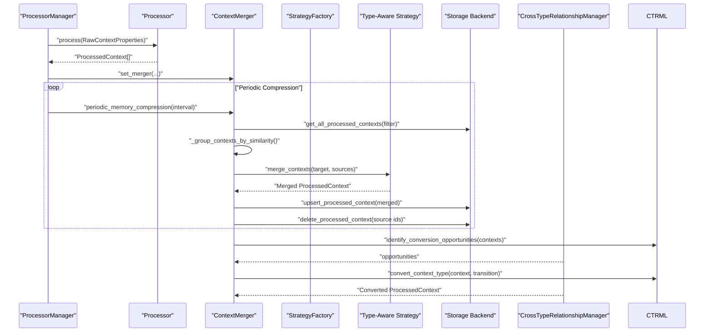
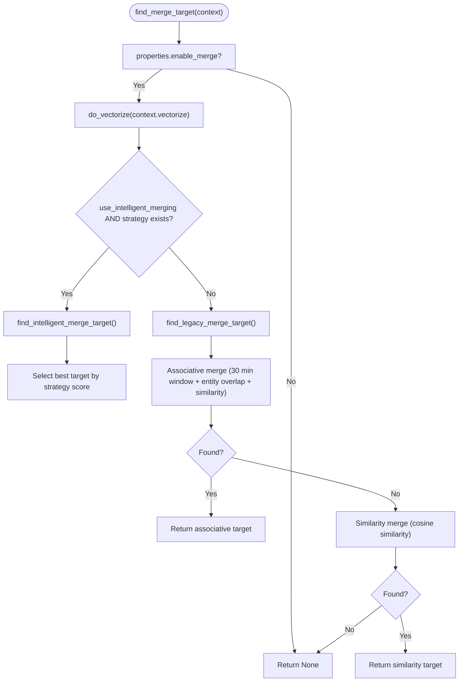
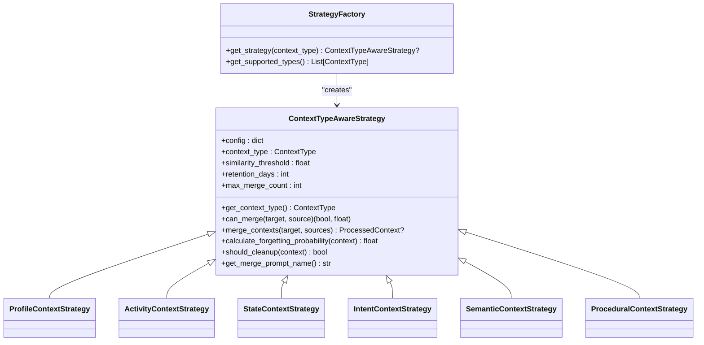
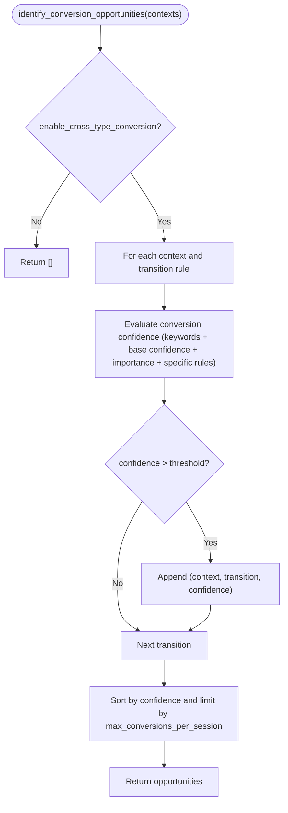
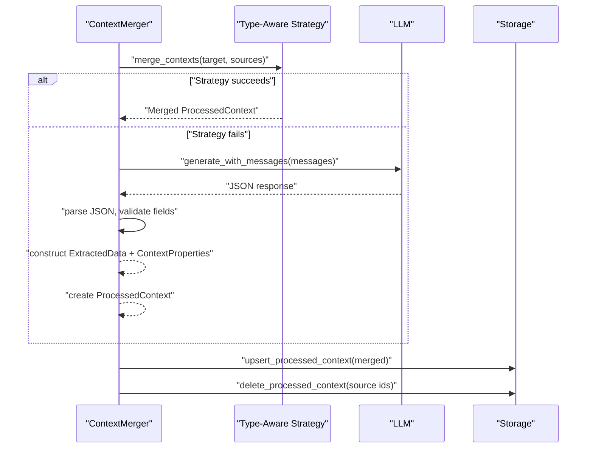
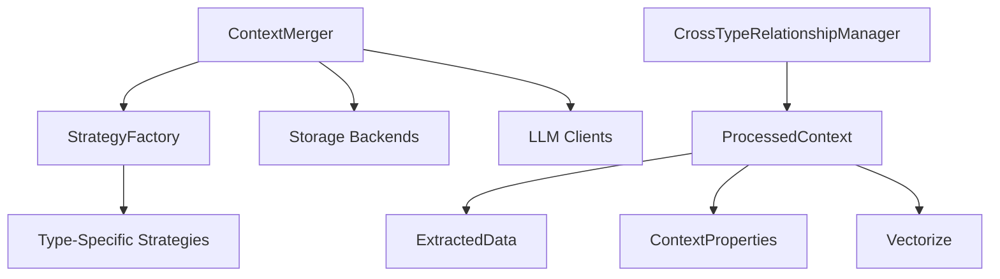

# Context Merging and Relationship Management

<cite>
**Referenced Files in This Document**
- [context_merger.py](file://opencontext/context_processing/merger/context_merger.py)
- [merge_strategies.py](file://opencontext/context_processing/merger/merge_strategies.py)
- [cross_type_relationships.py](file://opencontext/context_processing/merger/cross_type_relationships.py)
- [context.py](file://opencontext/models/context.py)
- [enums.py](file://opencontext/models/enums.py)
- [config.yaml](file://config/config.yaml)
- [processor_manager.py](file://opencontext/managers/processor_manager.py)
</cite>

## Table of Contents
1. [Introduction](#introduction)
2. [Project Structure](#project-structure)
3. [Core Components](#core-components)
4. [Architecture Overview](#architecture-overview)
5. [Detailed Component Analysis](#detailed-component-analysis)
6. [Dependency Analysis](#dependency-analysis)
7. [Performance Considerations](#performance-considerations)
8. [Troubleshooting Guide](#troubleshooting-guide)
9. [Conclusion](#conclusion)
10. [Appendices](#appendices)

## Introduction
This document explains the context merging system in MineContext that consolidates related information from multiple capture sources into enriched ProcessedContext objects. It focuses on:
- The role of ContextMerger in identifying and linking related contexts (e.g., a screenshot and its corresponding document).
- Merge strategies implemented in merge_strategies.py, including temporal proximity, semantic similarity, and source correlation.
- Cross-type relationships in cross_type_relationships.py for connecting different context types (screenshots, documents, web links).
- The ProcessedContext merging process, including conflict resolution, metadata consolidation, and relationship graph construction.
- Configuration options for merge thresholds and relationship weighting.
- Performance considerations for large-scale contextual data.

## Project Structure
The merging system resides in the context_processing/merger package and integrates with the broader processing pipeline:
- ContextMerger orchestrates intelligent merging and memory management.
- StrategyFactory and ContextTypeAwareStrategy implement type-specific merge logic.
- CrossTypeRelationshipManager identifies cross-type associations and performs conversions.
- ProcessedContext and related models define the data structures and metadata.

**Diagram sources**
- [context_merger.py](file://opencontext/context_processing/merger/context_merger.py#L39-L104)
- [merge_strategies.py](file://opencontext/context_processing/merger/merge_strategies.py#L1270-L1287)
- [cross_type_relationships.py](file://opencontext/context_processing/merger/cross_type_relationships.py#L1-L120)
- [context.py](file://opencontext/models/context.py#L131-L203)
- [processor_manager.py](file://opencontext/managers/processor_manager.py#L25-L151)
- [config.yaml](file://config/config.yaml#L95-L145)

**Section sources**
- [context_merger.py](file://opencontext/context_processing/merger/context_merger.py#L39-L104)
- [merge_strategies.py](file://opencontext/context_processing/merger/merge_strategies.py#L1270-L1287)
- [cross_type_relationships.py](file://opencontext/context_processing/merger/cross_type_relationships.py#L1-L120)
- [context.py](file://opencontext/models/context.py#L131-L203)
- [processor_manager.py](file://opencontext/managers/processor_manager.py#L25-L151)
- [config.yaml](file://config/config.yaml#L95-L145)

## Core Components
- ContextMerger: Finds merge targets using intelligent strategies and falls back to legacy logic. It also performs periodic memory compression and maintains statistics.
- StrategyFactory and ContextTypeAwareStrategy: Provide type-aware merge logic and memory management for each ContextType.
- CrossTypeRelationshipManager: Identifies cross-type conversion opportunities and suggests related contexts across types.
- ProcessedContext: The enriched output combining ExtractedData, ContextProperties, and Vectorize metadata.

Key responsibilities:
- Intelligent merging: Uses vector similarity and type-specific heuristics to propose merges.
- Legacy merging: Temporal proximity and entity overlap for associative merges; cosine similarity for similarity merges.
- Cross-type relationships: Converts between types (e.g., Intent to Activity, Activity to Profile) and suggests related contexts.
- Memory management: Periodic compression, cleanup based on forgetting curves, and reinforcement.

**Section sources**
- [context_merger.py](file://opencontext/context_processing/merger/context_merger.py#L39-L104)
- [merge_strategies.py](file://opencontext/context_processing/merger/merge_strategies.py#L1-L120)
- [cross_type_relationships.py](file://opencontext/context_processing/merger/cross_type_relationships.py#L1-L120)
- [context.py](file://opencontext/models/context.py#L131-L203)

## Architecture Overview
The merging system integrates with the processing pipeline and storage layer:
- ProcessorManager routes inputs to processors and can trigger periodic compression via ContextMerger.
- ContextMerger initializes strategies from StrategyFactory and uses storage backends for vector similarity queries.
- CrossTypeRelationshipManager operates on ProcessedContext lists to identify conversions and relationships.

**Diagram sources**
- [processor_manager.py](file://opencontext/managers/processor_manager.py#L46-L79)
- [context_merger.py](file://opencontext/context_processing/merger/context_merger.py#L462-L547)
- [merge_strategies.py](file://opencontext/context_processing/merger/merge_strategies.py#L1270-L1287)
- [cross_type_relationships.py](file://opencontext/context_processing/merger/cross_type_relationships.py#L91-L112)

## Detailed Component Analysis

### ContextMerger: Intelligent Target Finding and Merging
- Initialization: Loads configuration, sets thresholds, and initializes strategies via StrategyFactory.
- Target finding:
  - Intelligent path: Vectorizes context, queries storage for candidates, and selects best target using type-aware strategy scores.
  - Legacy path: Attempts associative merge (temporal proximity + entity overlap + similarity) then similarity merge (cosine similarity).
- Merging:
  - Intelligent strategy path: Uses StrategyFactory-selected strategy to merge multiple sources into target.
  - Fallback path: Uses LLM prompts to merge multiple sources into a target, parsing structured JSON and constructing a new ProcessedContext.
- Periodic compression: Groups contexts by similarity and merges older ones into the newest, updating storage and removing sources.
- Statistics: Tracks merges attempted/succeeded/errors and strategy counts.

**Diagram sources**
- [context_merger.py](file://opencontext/context_processing/merger/context_merger.py#L85-L184)

**Section sources**
- [context_merger.py](file://opencontext/context_processing/merger/context_merger.py#L39-L104)
- [context_merger.py](file://opencontext/context_processing/merger/context_merger.py#L185-L264)
- [context_merger.py](file://opencontext/context_processing/merger/context_merger.py#L265-L339)
- [context_merger.py](file://opencontext/context_processing/merger/context_merger.py#L340-L461)
- [context_merger.py](file://opencontext/context_processing/merger/context_merger.py#L462-L547)

### Merge Strategies: Temporal, Semantic, and Correlation Algorithms
- StrategyFactory registers strategies for each ContextType.
- ContextTypeAwareStrategy defines:
  - Thresholds per type (similarity_threshold, retention_days, max_merge_count).
  - can_merge(target, source) returning (can_merge, score).
  - merge_contexts(target, sources) returning merged ProcessedContext.
  - Memory management: calculate_forgetting_probability and should_cleanup.
- Type-specific strategies:
  - ProfileContextStrategy: High entity overlap, vector similarity, composite scoring.
  - ActivityContextStrategy: Time window checks, entity/keyword overlap, vector similarity.
  - StateContextStrategy: Very short time window, high entity overlap, special forgetting curve.
  - IntentContextStrategy: Entity/keyword overlap, vector similarity, intent-specific logic.
  - SemanticContextStrategy: Concept overlap, vector similarity, knowledge consolidation.
  - ProceduralContextStrategy: Tool/method overlap, vector similarity, procedure consolidation.

**Diagram sources**
- [merge_strategies.py](file://opencontext/context_processing/merger/merge_strategies.py#L24-L108)
- [merge_strategies.py](file://opencontext/context_processing/merger/merge_strategies.py#L1270-L1287)

**Section sources**
- [merge_strategies.py](file://opencontext/context_processing/merger/merge_strategies.py#L1-L120)
- [merge_strategies.py](file://opencontext/context_processing/merger/merge_strategies.py#L120-L262)
- [merge_strategies.py](file://opencontext/context_processing/merger/merge_strategies.py#L264-L440)
- [merge_strategies.py](file://opencontext/context_processing/merger/merge_strategies.py#L442-L629)
- [merge_strategies.py](file://opencontext/context_processing/merger/merge_strategies.py#L631-L800)
- [merge_strategies.py](file://opencontext/context_processing/merger/merge_strategies.py#L800-L1060)
- [merge_strategies.py](file://opencontext/context_processing/merger/merge_strategies.py#L1062-L1268)
- [merge_strategies.py](file://opencontext/context_processing/merger/merge_strategies.py#L1270-L1287)

### Cross-Type Relationships: Conversions and Suggestions
- CrossTypeTransition enumerates transitions (e.g., Intent to Activity, Activity to Profile, State to Activity).
- CrossTypeRelationshipManager:
  - Initializes transition rules with confidence boosts and importance adjustments.
  - identify_conversion_opportunities(contexts): Evaluates confidence based on keywords, context confidence/importance, and specific rules.
  - convert_context_type(context, transition): Creates converted ProcessedContext with adjusted importance/confidence and keywords.
  - suggest_related_contexts(context, all_contexts): Computes entity/keyword overlap strength and determines relation type.

**Diagram sources**
- [cross_type_relationships.py](file://opencontext/context_processing/merger/cross_type_relationships.py#L91-L112)
- [cross_type_relationships.py](file://opencontext/context_processing/merger/cross_type_relationships.py#L113-L178)
- [cross_type_relationships.py](file://opencontext/context_processing/merger/cross_type_relationships.py#L203-L243)

**Section sources**
- [cross_type_relationships.py](file://opencontext/context_processing/merger/cross_type_relationships.py#L1-L120)
- [cross_type_relationships.py](file://opencontext/context_processing/merger/cross_type_relationships.py#L120-L243)
- [cross_type_relationships.py](file://opencontext/context_processing/merger/cross_type_relationships.py#L244-L361)
- [cross_type_relationships.py](file://opencontext/context_processing/merger/cross_type_relationships.py#L362-L430)

### ProcessedContext Merging: Conflict Resolution and Metadata Consolidation
- Intelligent merging:
  - StrategyFactory-selected strategy merges multiple sources into target, consolidating entities, keywords, importance, and confidence.
  - Properties consolidation: min/create_time, preserved event_time, incremented merge_count, aggregated duration_count, updated update_time.
- LLM fallback merging:
  - Builds type-specific or generic prompts, parses JSON response, validates required fields, constructs ExtractedData and ContextProperties, and recomputes vectorize text.
- Relationship graph construction:
  - CrossTypeRelationshipManager suggests related contexts and converts types, implicitly building a cross-type relationship graph across ProcessedContext instances.

**Diagram sources**
- [context_merger.py](file://opencontext/context_processing/merger/context_merger.py#L301-L339)
- [context_merger.py](file://opencontext/context_processing/merger/context_merger.py#L340-L461)

**Section sources**
- [context_merger.py](file://opencontext/context_processing/merger/context_merger.py#L301-L339)
- [context_merger.py](file://opencontext/context_processing/merger/context_merger.py#L340-L461)
- [merge_strategies.py](file://opencontext/context_processing/merger/merge_strategies.py#L120-L262)
- [merge_strategies.py](file://opencontext/context_processing/merger/merge_strategies.py#L419-L440)

### Examples: Combining RawContextProperties into ProcessedContext
- ProcessedContext composition:
  - ExtractedData: title, summary, keywords, entities, context_type, confidence, importance.
  - ContextProperties: raw_properties (list), create_time, event_time, is_processed, has_compression, update_time, merge_count, duration_count, enable_merge, is_happend, last_call_time, file_path/raw_type/raw_id.
  - Vectorize: content_format, image_path/text, vector.
  - Metadata: optional structured metadata (e.g., ProfileContextMetadata, KnowledgeContextMetadata).
- Example scenarios:
  - A screenshot and a document captured around the same time with overlapping entities can be merged into a ProcessedContext with consolidated metadata and vector representation.
  - Cross-type conversion transforms an Intent into an Activity, adjusting importance/confidence and keywords accordingly.

**Section sources**
- [context.py](file://opencontext/models/context.py#L35-L108)
- [context.py](file://opencontext/models/context.py#L131-L203)
- [context.py](file://opencontext/models/context.py#L243-L343)

## Dependency Analysis
- Coupling:
  - ContextMerger depends on StrategyFactory, storage backends, and LLM clients.
  - StrategyFactory depends on ContextTypeAwareStrategy subclasses.
  - CrossTypeRelationshipManager depends on ProcessedContext and ContextType.
- Cohesion:
  - Each strategy encapsulates type-specific logic, improving cohesion.
- External dependencies:
  - Storage backends (vector DB/document DB) for similarity queries and persistence.
  - LLM clients for merging fallback and content generation.

**Diagram sources**
- [context_merger.py](file://opencontext/context_processing/merger/context_merger.py#L39-L104)
- [merge_strategies.py](file://opencontext/context_processing/merger/merge_strategies.py#L1270-L1287)
- [cross_type_relationships.py](file://opencontext/context_processing/merger/cross_type_relationships.py#L1-L120)
- [context.py](file://opencontext/models/context.py#L131-L203)

**Section sources**
- [context_merger.py](file://opencontext/context_processing/merger/context_merger.py#L39-L104)
- [merge_strategies.py](file://opencontext/context_processing/merger/merge_strategies.py#L1270-L1287)
- [cross_type_relationships.py](file://opencontext/context_processing/merger/cross_type_relationships.py#L1-L120)
- [context.py](file://opencontext/models/context.py#L131-L203)

## Performance Considerations
- Vector similarity queries:
  - Use top_k and filters to limit candidate sets; avoid retrieving self in results.
  - Consider indexing and backend tuning for large-scale vector DB operations.
- Grouping and compression:
  - Greedy grouping by cosine similarity reduces redundant comparisons; tune threshold to balance recall and cost.
  - Batch updates/deletes to storage backends to minimize round-trips.
- Threading and scheduling:
  - ProcessorManager’s periodic compression runs on a timer; adjust interval based on workload.
- Memory management:
  - Forgetting curve and cleanup reduce long-term storage footprint; configure retention_days and max_merge_count per type.
- LLM merging:
  - Prompt-based merging is expensive; prefer type-aware strategies when available to reduce LLM calls.

[No sources needed since this section provides general guidance]

## Troubleshooting Guide
- No merge target found:
  - Verify enable_merge flag and vectorize presence; ensure storage backend is initialized and contains similar contexts.
- Low similarity scores:
  - Adjust similarity_threshold and associative_similarity_threshold in configuration.
- LLM merging failures:
  - Check prompt availability and JSON parsing; ensure required fields are present in response.
- Cross-type conversion not triggered:
  - Review conversion_confidence_threshold and transition rule keywords; confirm context confidence/importance meet thresholds.
- Memory cleanup not effective:
  - Verify enable_memory_management and cleanup_interval_hours; ensure strategies support should_cleanup.

**Section sources**
- [context_merger.py](file://opencontext/context_processing/merger/context_merger.py#L185-L264)
- [context_merger.py](file://opencontext/context_processing/merger/context_merger.py#L340-L461)
- [cross_type_relationships.py](file://opencontext/context_processing/merger/cross_type_relationships.py#L91-L178)
- [config.yaml](file://config/config.yaml#L95-L145)

## Conclusion
The context merging system in MineContext provides robust, type-aware merging and cross-type relationship management. By combining vector similarity, temporal proximity, and entity/keyword overlap, it intelligently consolidates related contexts into enriched ProcessedContext objects. Cross-type conversions and relationship suggestions further enhance knowledge graph construction. Configuration options allow tuning thresholds and retention policies for diverse workloads, while periodic compression and memory management keep storage efficient.

[No sources needed since this section summarizes without analyzing specific files]

## Appendices

### Configuration Options for Merge Thresholds and Weighting
- ContextMerger:
  - similarity_threshold: cosine similarity threshold for similarity merges.
  - associative_similarity_threshold: threshold for associative merges.
  - use_intelligent_merging: toggle intelligent strategy merging vs. LLM fallback.
  - enable_memory_management, cleanup_interval_hours: memory management controls.
- CrossTypeRelationshipManager:
  - enable_cross_type_conversion, conversion_confidence_threshold, max_conversions_per_session: conversion controls.
- Type-specific strategy configs:
  - {TYPE}_similarity_threshold, {TYPE}_retention_days, {TYPE}_max_merge_count, {TYPE}_time_window_* (for Activity/State).

**Section sources**
- [config.yaml](file://config/config.yaml#L95-L145)
- [merge_strategies.py](file://opencontext/context_processing/merger/merge_strategies.py#L30-L50)
- [context_merger.py](file://opencontext/context_processing/merger/context_merger.py#L39-L54)
- [cross_type_relationships.py](file://opencontext/context_processing/merger/cross_type_relationships.py#L38-L60)