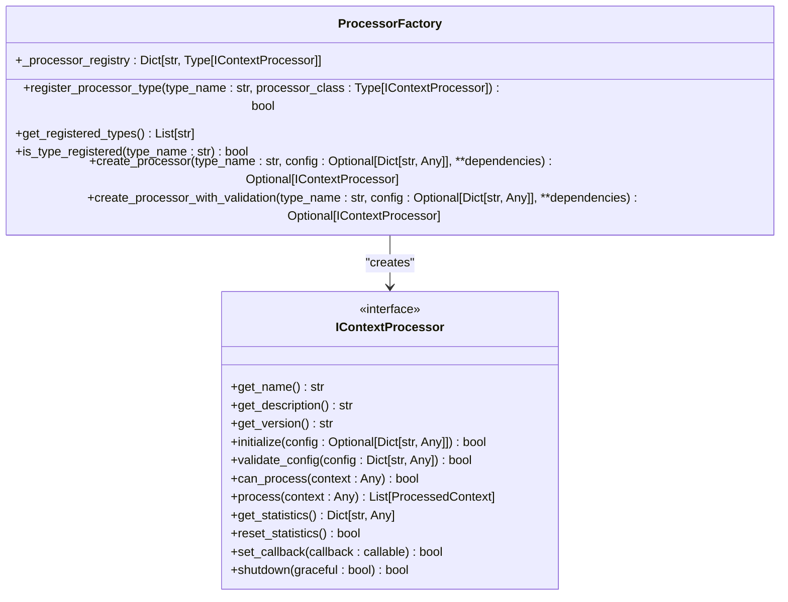
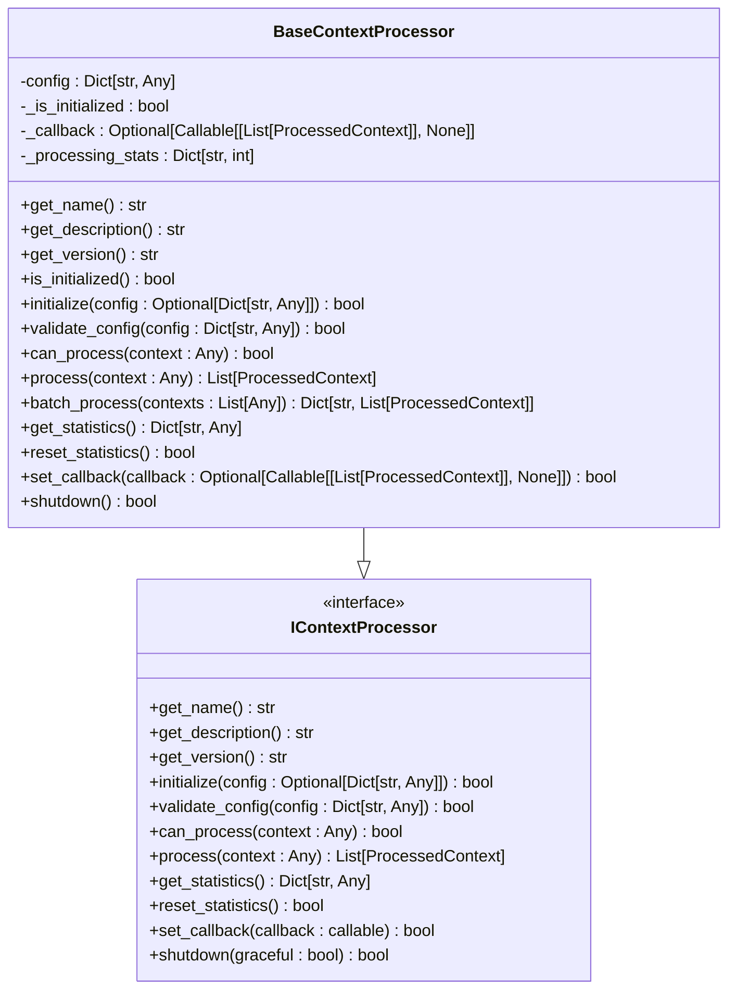
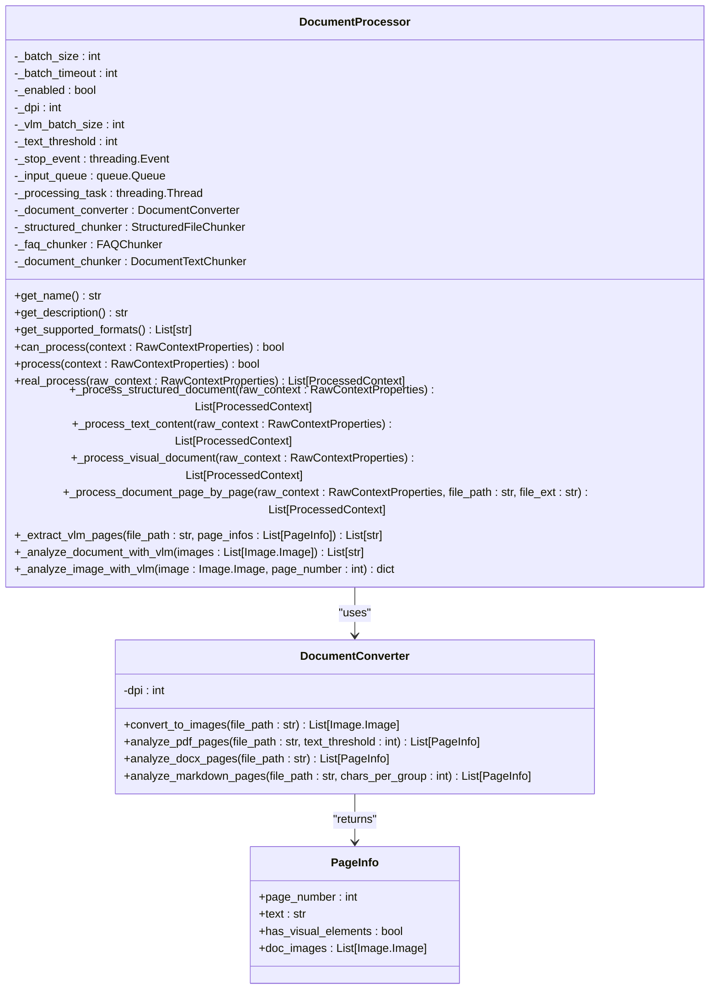
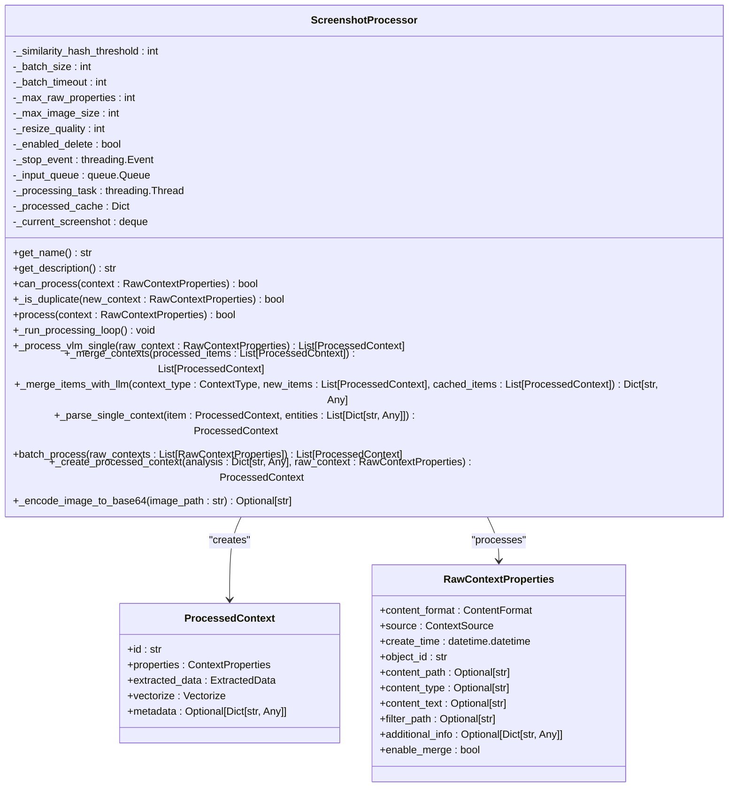
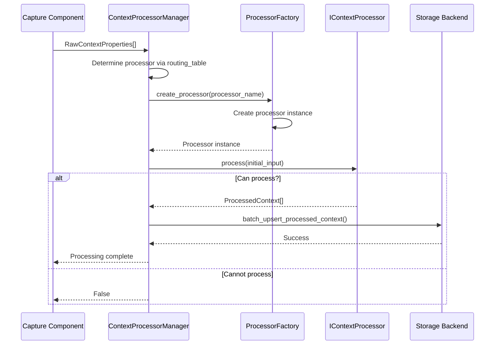
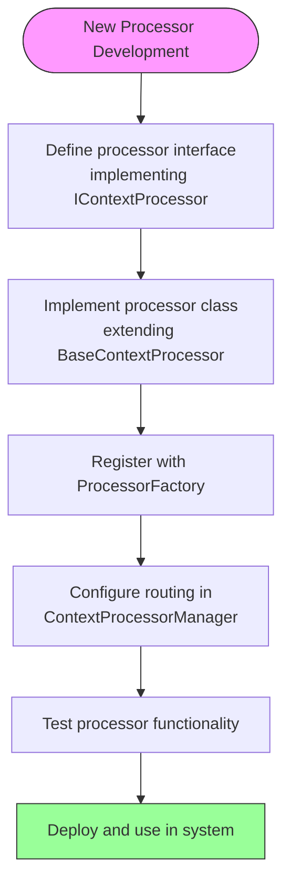
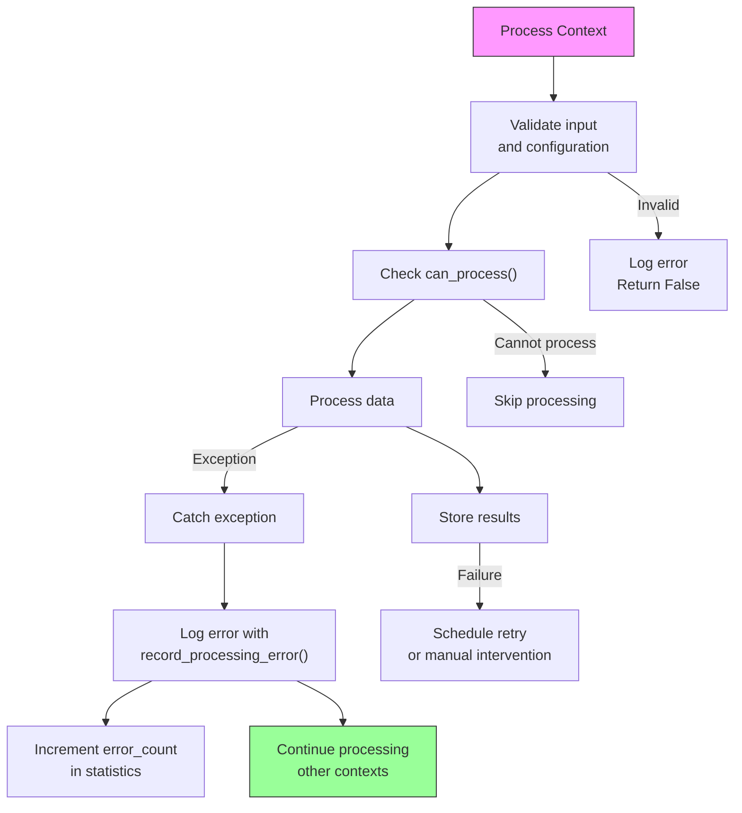

# Context Processors and Factory Pattern

<cite>
**Referenced Files in This Document**   
- [processor_factory.py](file://opencontext/context_processing/processor/processor_factory.py)
- [base_processor.py](file://opencontext/context_processing/processor/base_processor.py)
- [processor_interface.py](file://opencontext/interfaces/processor_interface.py)
- [document_processor.py](file://opencontext/context_processing/processor/document_processor.py)
- [screenshot_processor.py](file://opencontext/context_processing/processor/screenshot_processor.py)
- [document_converter.py](file://opencontext/context_processing/processor/document_converter.py)
- [context.py](file://opencontext/models/context.py)
- [processor_manager.py](file://opencontext/managers/processor_manager.py)
</cite>

## Table of Contents
1. [Introduction](#introduction)
2. [Processor Factory Pattern](#processor-factory-pattern)
3. [Base Processor and Interface](#base-processor-and-interface)
4. [Document Processor Implementation](#document-processor-implementation)
5. [Screenshot Processor Implementation](#screenshot-processor-implementation)
6. [Processing Lifecycle and Pipeline](#processing-lifecycle-and-pipeline)
7. [Processor Registration and Extension](#processor-registration-and-extension)
8. [Error Handling and Retries](#error-handling-and-retries)
9. [Conclusion](#conclusion)

## Introduction
The MineContext system employs a sophisticated processor architecture based on the Factory design pattern to handle various types of context data. This documentation details the implementation of the context processor system, focusing on the factory pattern, base processor classes, and specific processor implementations for document and screenshot processing. The system is designed to transform RawContextProperties into ProcessedContext objects through a pipeline of specialized processors, each responsible for handling specific context types and extracting meaningful information.

**Section sources**
- [processor_factory.py](file://opencontext/context_processing/processor/processor_factory.py#L1-L175)
- [base_processor.py](file://opencontext/context_processing/processor/base_processor.py#L1-L261)

## Processor Factory Pattern

The ProcessorFactory class implements the Factory design pattern to provide centralized creation and management of processor instances. This pattern enables type-safe processor registration, automatic dependency injection, and configuration management across the system.

The factory maintains a registry of processor types in its `_processor_registry` dictionary, which maps processor type names to their corresponding classes. Built-in processors are automatically registered during initialization through the `_register_built_in_processors` method, which currently registers the "document_processor" and "screenshot_processor" types.

**Diagram sources**
- [processor_factory.py](file://opencontext/context_processing/processor/processor_factory.py#L31-L175)
- [processor_interface.py](file://opencontext/interfaces/processor_interface.py#L16-L136)

The factory provides several key methods:
- `register_processor_type`: Registers a new processor class with a unique name, ensuring it implements the IContextProcessor interface
- `create_processor`: Creates a processor instance by type name, with automatic dependency injection based on constructor signatures
- `create_processor_with_validation`: Creates a processor instance with configuration validation using global configuration

The factory pattern allows for extensible processor type registration, enabling new processor types to be added to the system without modifying existing code. A global factory instance is provided for backward compatibility, making the factory accessible throughout the application.

**Section sources**
- [processor_factory.py](file://opencontext/context_processing/processor/processor_factory.py#L31-L175)

## Base Processor and Interface

The context processor system is built upon a well-defined interface and abstract base class that establish the contract for all concrete processor implementations. The IContextProcessor interface defines the essential behaviors that all processors must implement, including initialization, configuration, processing, and information retrieval.

**Diagram sources**
- [base_processor.py](file://opencontext/context_processing/processor/base_processor.py#L23-L261)
- [processor_interface.py](file://opencontext/interfaces/processor_interface.py#L16-L136)

The BaseContextProcessor class provides a concrete implementation of the IContextProcessor interface, offering common functionality that all processors can inherit. Key features include:

- **Statistics tracking**: Maintains processing statistics such as processed count, contexts generated, and error count
- **Configuration management**: Handles configuration loading and validation
- **Callback handling**: Supports callback functions that are invoked when processing is complete
- **Batch processing**: Provides a default implementation of batch processing that groups results by object ID
- **Lifecycle management**: Implements initialization and shutdown methods for resource management

The base processor also includes utility methods like `_extract_object_id` which determines the object ID from either the raw context or processed contexts, ensuring consistent grouping of related contexts.

**Section sources**
- [base_processor.py](file://opencontext/context_processing/processor/base_processor.py#L23-L261)
- [processor_interface.py](file://opencontext/interfaces/processor_interface.py#L16-L136)

## Document Processor Implementation

The DocumentProcessor class handles the conversion and text extraction from various document formats, including PDF, DOCX, images, and structured files like CSV and XLSX. It extends the BaseContextProcessor and implements specialized processing logic for document content.

**Diagram sources**
- [document_processor.py](file://opencontext/context_processing/processor/document_processor.py#L41-L653)
- [document_converter.py](file://opencontext/context_processing/processor/document_converter.py#L46-L607)

The DocumentProcessor implements a sophisticated processing strategy that adapts to different document types:

1. **Structured documents** (CSV, XLSX, JSONL): Uses specialized chunkers to parse tabular data and convert it into ProcessedContext objects
2. **Text content** (vaults text): Processes text directly using the document text chunker
3. **Visual documents** (PDF, DOCX, images): Employs a page-by-page intelligent detection strategy that combines direct text extraction with Vision Language Model (VLM) analysis

For visual documents, the processor first analyzes each page to determine if it contains visual elements like charts or diagrams. Pages with visual elements are processed using VLM to extract text, while pure text pages are processed directly. This hybrid approach optimizes performance by minimizing expensive VLM calls while ensuring comprehensive content extraction.

The processor uses a background thread model with an input queue to handle processing asynchronously. Documents are added to the queue via the `process` method, and a background thread (`_run_processing_loop`) processes them in batches, calling `real_process` to perform the actual document processing.

**Section sources**
- [document_processor.py](file://opencontext/context_processing/processor/document_processor.py#L41-L653)
- [document_converter.py](file://opencontext/context_processing/processor/document_converter.py#L46-L607)

## Screenshot Processor Implementation

The ScreenshotProcessor class is responsible for analyzing screenshot streams, deduplicating images, and asynchronously extracting context information. It extends the BaseContextProcessor and implements specialized processing logic for screenshot content.

**Diagram sources**
- [screenshot_processor.py](file://opencontext/context_processing/processor/screenshot_processor.py#L47-L590)
- [context.py](file://opencontext/models/context.py#L131-L200)

The ScreenshotProcessor implements several key features:

- **Real-time deduplication**: Uses perceptual hashing (pHash) to identify and filter duplicate screenshots before processing, reducing redundant VLM calls
- **Background processing**: Employs a background thread model with an input queue to handle screenshots asynchronously
- **Context-aware information extraction**: Uses Vision Language Models (VLM) to extract structured information from screenshots
- **Periodic memory compression**: Merges related contexts to reduce redundancy and improve information density

The processor first checks if a screenshot is a duplicate by comparing its perceptual hash against recently processed screenshots. If it's not a duplicate, the screenshot is added to the processing queue. The background processing loop (`_run_processing_loop`) handles batches of screenshots, processing them concurrently using VLM.

After VLM analysis, the processor merges newly processed items with cached items based on context type semantics. This merging process uses LLM to combine related contexts, reducing redundancy and creating more comprehensive context representations. The processor also handles entity extraction and vectorization as part of the processing pipeline.

**Section sources**
- [screenshot_processor.py](file://opencontext/context_processing/processor/screenshot_processor.py#L47-L590)

## Processing Lifecycle and Pipeline

The context processing pipeline in MineContext follows a well-defined lifecycle from raw context ingestion to processed context storage. This pipeline is orchestrated by the ContextProcessorManager, which uses the processor factory to route different context types to appropriate processors.

**Diagram sources**
- [processor_manager.py](file://opencontext/managers/processor_manager.py#L21-L213)
- [processor_factory.py](file://opencontext/context_processing/processor/processor_factory.py#L31-L175)

The processing lifecycle begins when a capture component (such as a screenshot monitor or document watcher) generates RawContextProperties objects. These objects contain metadata about the context source, creation time, file path, and other relevant information.

The ContextProcessorManager receives these raw contexts and determines the appropriate processor using its `_routing_table`, which maps context sources to processor names:

- `ContextSource.SCREENSHOT` → "screenshot_processor"
- `ContextSource.LOCAL_FILE` → "document_processor"
- `ContextSource.VAULT` → "document_processor"
- `ContextSource.WEB_LINK` → "document_processor"

Once the processor is determined, the manager uses the ProcessorFactory to create or retrieve the appropriate processor instance. The manager then calls the processor's `process` method with the raw context.

For the DocumentProcessor, processing is asynchronous - the document is added to an input queue and processed in the background. For the ScreenshotProcessor, processing can be synchronous (via `process`) or batch asynchronous (via `batch_process`).

After processing, the resulting ProcessedContext objects are stored in the configured storage backend (such as SQLite, ChromaDB, or Qdrant). The ProcessedContext class contains structured information extracted from the raw context, including titles, summaries, keywords, entities, and vector embeddings.

The entire pipeline supports callback mechanisms, allowing components to be notified when processing is complete. This enables real-time updates in the user interface and integration with other system components.

**Section sources**
- [processor_manager.py](file://opencontext/managers/processor_manager.py#L21-L213)
- [context.py](file://opencontext/models/context.py#L131-L200)

## Processor Registration and Extension

The processor system in MineContext is designed to be extensible, allowing new processor types to be registered and used within the processing pipeline. This extensibility is achieved through the ProcessorFactory's registration mechanism and the ContextProcessorManager's routing capabilities.

New processors can be registered with the factory using the `register_processor_type` method, which requires a unique type name and a processor class that implements the IContextProcessor interface. Once registered, processors can be created using the `create_processor` method.

**Diagram sources**
- [processor_factory.py](file://opencontext/context_processing/processor/processor_factory.py#L62-L86)
- [processor_manager.py](file://opencontext/managers/processor_manager.py#L87-L97)

To create a custom processor, developers must:

1. Create a new class that extends BaseContextProcessor or implements IContextProcessor directly
2. Implement the required abstract methods: `get_name`, `get_description`, `can_process`, and `process`
3. Optionally override other methods like `initialize`, `validate_config`, or `batch_process`
4. Register the processor type with the factory using `register_processor_type`

The ContextProcessorManager's `_routing_table` can be modified to route specific context sources to the new processor. This routing table is defined in the `_define_routing` method and maps ContextSource enum values to processor names.

Extension points available for custom processors include:
- Custom context source types in the ContextSource enum
- Specialized chunking strategies for new document formats
- Alternative VLM or LLM providers for content extraction
- Custom storage backends for processed contexts
- Additional metadata extraction and enrichment

The factory pattern ensures that adding new processors does not require modifications to existing code, adhering to the Open/Closed Principle of object-oriented design.

**Section sources**
- [processor_factory.py](file://opencontext/context_processing/processor/processor_factory.py#L62-L86)
- [processor_manager.py](file://opencontext/managers/processor_manager.py#L87-L97)

## Error Handling and Retries

The context processor system implements comprehensive error handling strategies to ensure robustness and reliability when processing various context types. Each processor includes mechanisms for error detection, reporting, and recovery.

**Diagram sources**
- [base_processor.py](file://opencontext/context_processing/processor/base_processor.py#L163-L166)
- [monitor.py](file://opencontext/monitoring/monitor.py#L530-L568)

Key error handling features include:

- **Exception wrapping**: All processing exceptions are caught and logged with detailed information, preventing crashes from propagating up the call stack
- **Statistics tracking**: Each processor maintains an error count in its processing statistics, allowing monitoring of processing reliability
- **Graceful degradation**: When a processor encounters an error, it returns appropriate values (typically False or empty lists) rather than raising exceptions
- **Detailed logging**: Comprehensive error logging with context information to aid in debugging and troubleshooting

The system uses the `record_processing_error` function from the monitoring module to log processing errors with additional metadata such as processor name and context count. This enables centralized error tracking and analysis.

For the DocumentProcessor, errors during document conversion or VLM analysis are caught and logged, with the processor continuing to process other documents in the queue. The ScreenshotProcessor implements similar error handling, with additional retry logic for VLM processing failures.

The ContextProcessorManager also implements error handling at the orchestration level, catching exceptions from individual processors and continuing to process other contexts in batch operations. This ensures that a failure in processing one context does not prevent the processing of others.

**Section sources**
- [base_processor.py](file://opencontext/context_processing/processor/base_processor.py#L163-L166)
- [monitor.py](file://opencontext/monitoring/monitor.py#L530-L568)

## Conclusion
The context processor system in MineContext demonstrates a well-architected implementation of the Factory design pattern combined with a robust processing pipeline. The system effectively routes different context types to specialized processors through the ProcessorFactory and ContextProcessorManager, ensuring that each context is processed by the most appropriate component.

Key strengths of the system include:
- **Modularity**: Clear separation of concerns between the factory, base processor, and concrete implementations
- **Extensibility**: Easy registration of new processor types without modifying existing code
- **Robustness**: Comprehensive error handling and statistics tracking
- **Performance**: Asynchronous processing with background threads and batch operations
- **Intelligence**: Context-aware processing with deduplication and semantic merging

The DocumentProcessor and ScreenshotProcessor implementations showcase sophisticated strategies for handling complex document formats and visual content, leveraging both traditional text extraction methods and modern Vision Language Models. The system's design allows for seamless integration of new processing capabilities while maintaining stability and reliability.

This architecture provides a solid foundation for extending MineContext's capabilities to handle additional context types and processing requirements in the future.