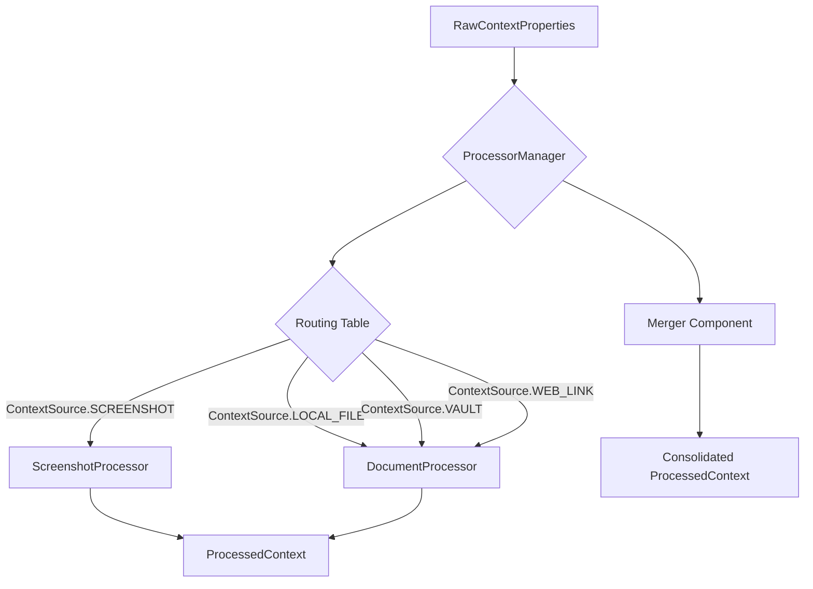
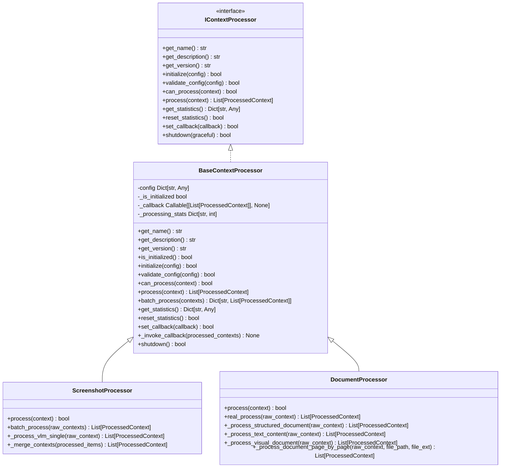
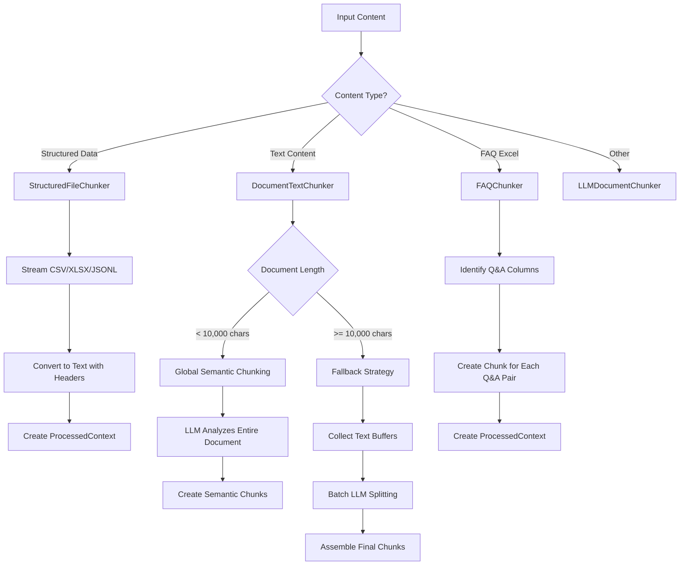
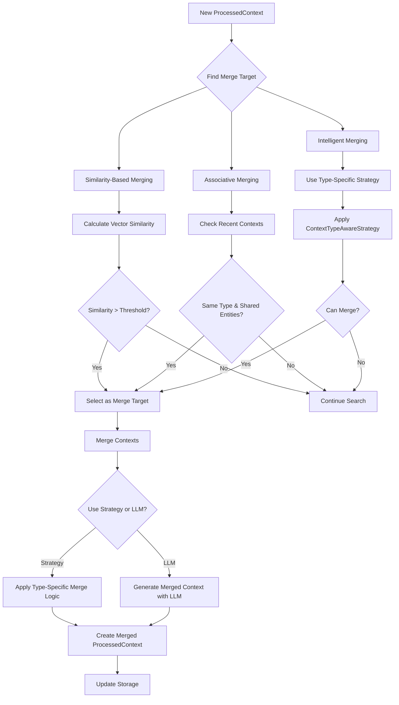
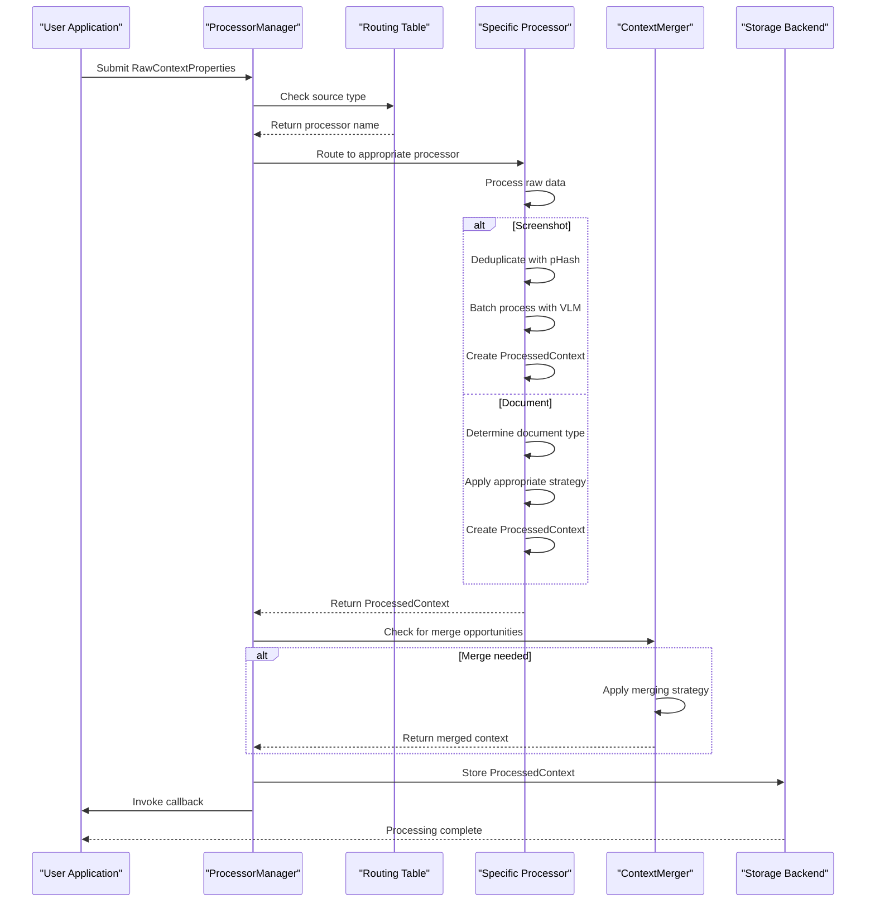

# Data Processing Pipeline

<cite>
**Referenced Files in This Document**   
- [processor_manager.py](file://opencontext/managers/processor_manager.py)
- [base_processor.py](file://opencontext/context_processing/processor/base_processor.py)
- [processor_factory.py](file://opencontext/context_processing/processor/processor_factory.py)
- [chunkers.py](file://opencontext/context_processing/chunker/chunkers.py)
- [document_text_chunker.py](file://opencontext/context_processing/chunker/document_text_chunker.py)
- [context_merger.py](file://opencontext/context_processing/merger/context_merger.py)
- [screenshot_processor.py](file://opencontext/context_processing/processor/screenshot_processor.py)
- [document_processor.py](file://opencontext/context_processing/processor/document_processor.py)
- [context.py](file://opencontext/models/context.py)
- [processor_interface.py](file://opencontext/interfaces/processor_interface.py)
</cite>

## Table of Contents
1. [Introduction](#introduction)
2. [Processor Manager and Routing](#processor-manager-and-routing)
3. [Processor Interface and Implementation](#processor-interface-and-implementation)
4. [Chunking Strategies](#chunking-strategies)
5. [Context Merging Process](#context-merging-process)
6. [Callback Mechanism](#callback-mechanism)
7. [Data Flow Example](#data-flow-example)
8. [Conclusion](#conclusion)

## Introduction
The MineContext data processing pipeline is responsible for transforming raw captured data into structured, meaningful context. This system is designed to handle various data sources such as screenshots, documents, and web links, processing them through a series of specialized components. The pipeline architecture is built around the ProcessorManager, which orchestrates the processing chain, routes data to appropriate processors based on source type, manages context merging, and handles callbacks upon completion. This document details the architecture and functionality of this pipeline, focusing on how raw data is transformed into ProcessedContext objects through a series of well-defined processing stages.

## Processor Manager and Routing

The ContextProcessorManager is the central orchestrator of the data processing pipeline, managing the lifecycle and coordination of multiple context processing components. It implements a routing mechanism that directs different context sources to appropriate processors based on the _routing_table configuration. This routing table is defined in code and maps ContextSource enum values to specific processor names, ensuring that each type of input is handled by the most suitable processor.

When a raw context is submitted for processing, the manager uses the source attribute of the RawContextProperties object to determine which processor should handle it. For example, screenshots are routed to the "screenshot_processor", while local files, vault content, and web links are all directed to the "document_processor". This routing decision is made dynamically at runtime, allowing for flexible processing chains that can be easily extended or modified.

The processor manager also manages the lifecycle of all registered processors, providing methods to register new processors, set a merger component for context consolidation, and manage callbacks for processing completion. It maintains statistics on processing activities, including the total number of processed inputs, contexts generated, and errors encountered, providing valuable insights into the pipeline's performance.

**Diagram sources**
- [processor_manager.py](file://opencontext/managers/processor_manager.py#L87-L97)
- [processor_manager.py](file://opencontext/managers/processor_manager.py#L136-L142)

**Section sources**
- [processor_manager.py](file://opencontext/managers/processor_manager.py#L21-L213)

## Processor Interface and Implementation

The processing pipeline is built on a well-defined processor interface that ensures consistency across different processing components. The IContextProcessor interface defines the contract that all processors must implement, including methods for initialization, configuration validation, processing capability checks, actual processing, statistics retrieval, and shutdown procedures. This interface enables a plug-and-play architecture where new processors can be easily integrated into the system.

All processors inherit from the BaseContextProcessor abstract class, which provides common functionality such as statistics tracking, configuration management, and callback handling. This base class implements the IContextProcessor interface and provides default implementations for many methods, reducing code duplication and ensuring consistent behavior across processors. Each processor must implement the can_process method to determine if it can handle a given context, and the process method to perform the actual transformation of raw data into structured context.

Two primary processors are implemented in the system: the ScreenshotProcessor and the DocumentProcessor. The ScreenshotProcessor is specialized for analyzing visual content from screenshots, using Vision Language Models (VLM) to extract textual information and context. The DocumentProcessor is a unified processor that handles various document formats, including structured data (CSV, XLSX), text content, and visual documents (PDF, DOCX, images). It employs different strategies based on the document type, such as direct text extraction for pure text files and VLM analysis for documents with visual elements.

**Diagram sources**
- [processor_interface.py](file://opencontext/interfaces/processor_interface.py#L16-L136)
- [base_processor.py](file://opencontext/context_processing/processor/base_processor.py#L23-L261)
- [screenshot_processor.py](file://opencontext/context_processing/processor/screenshot_processor.py#L47-L590)
- [document_processor.py](file://opencontext/context_processing/processor/document_processor.py#L41-L653)

**Section sources**
- [processor_interface.py](file://opencontext/interfaces/processor_interface.py#L16-L136)
- [base_processor.py](file://opencontext/context_processing/processor/base_processor.py#L23-L261)
- [screenshot_processor.py](file://opencontext/context_processing/processor/screenshot_processor.py#L47-L590)
- [document_processor.py](file://opencontext/context_processing/processor/document_processor.py#L41-L653)

## Chunking Strategies

The chunking module provides various strategies for breaking down content into manageable pieces, which is essential for efficient processing and storage. The system implements different chunkers based on the type of content being processed. The BaseChunker serves as an abstract base class that defines the common interface for all chunkers, while specialized chunkers handle specific content types.

For structured documents like CSV, XLSX, and JSONL files, the StructuredFileChunker is used. This chunker processes large files in a memory-efficient manner by streaming and batching the data. It reads the file in chunks, converts each chunk to a text representation with headers, and creates ProcessedContext objects for each chunk. This approach allows the system to handle large structured files without loading the entire file into memory.

For text content, the DocumentTextChunker provides intelligent semantic chunking. It uses a multi-phase strategy that first attempts global semantic chunking for shorter documents (<10,000 characters) by analyzing the entire document at once with an LLM. For longer documents, it falls back to a paragraph-based accumulation strategy, where it collects text buffers and uses LLM to split them into semantically meaningful chunks. This ensures that the resulting chunks maintain contextual coherence and are suitable for downstream processing.

The system also includes a specialized FAQChunker for FAQ Excel files, which treats each Q&A pair as a separate chunk. This allows for fine-grained processing of FAQ content, making it easier to retrieve specific questions and answers later.

**Diagram sources**
- [chunkers.py](file://opencontext/context_processing/chunker/chunkers.py#L46-L439)
- [document_text_chunker.py](file://opencontext/context_processing/chunker/document_text_chunker.py#L25-L349)

**Section sources**
- [chunkers.py](file://opencontext/context_processing/chunker/chunkers.py#L46-L439)
- [document_text_chunker.py](file://opencontext/context_processing/chunker/document_text_chunker.py#L25-L349)

## Context Merging Process

The context merging process is a critical component of the data processing pipeline, responsible for consolidating similar or related contexts into a unified representation. This process is managed by the ContextMerger component, which implements intelligent merging strategies based on context type. The merger uses multiple approaches to identify potential merge targets, including similarity-based merging, associative merging, and type-aware intelligent merging.

Similarity-based merging identifies contexts that are semantically similar by comparing their vector embeddings. The system calculates cosine similarity between embeddings and merges contexts that exceed a configurable threshold (default 0.85). Associative merging looks for recent contexts of the same type that share entities and are created within a specific time window (30 minutes), indicating they are likely related. The intelligent merging strategy uses type-specific merge strategies that understand the semantics of different context types, allowing for more sophisticated merging logic.

The merger supports two primary merging methods: LLM-based merging and strategy-based merging. LLM-based merging uses a language model to combine multiple source contexts into a target context, preserving the most important information while eliminating redundancy. Strategy-based merging uses predefined rules and algorithms specific to each context type, such as ActivityContextStrategy for behavior activity records or ProfileContextStrategy for personal identity profiles. This dual approach ensures that merging is both flexible and contextually appropriate.

**Diagram sources**
- [context_merger.py](file://opencontext/context_processing/merger/context_merger.py#L35-L800)
- [merge_strategies.py](file://opencontext/context_processing/merger/merge_strategies.py#L24-L800)

**Section sources**
- [context_merger.py](file://opencontext/context_processing/merger/context_merger.py#L35-L800)
- [merge_strategies.py](file://opencontext/context_processing/merger/merge_strategies.py#L24-L800)

## Callback Mechanism

The data processing pipeline includes a callback mechanism that notifies interested parties when processing is complete. This mechanism is implemented through the set_callback method in the BaseContextProcessor class, which allows external components to register a callback function that will be invoked when processing is finished. The callback function accepts a list of ProcessedContext objects as its parameter, providing access to the results of the processing operation.

Each processor maintains its own callback reference, which is invoked after the processing of a context is complete. The _invoke_callback method handles the actual invocation, including error handling to prevent exceptions in the callback from disrupting the processing pipeline. This design allows for flexible integration with other system components, such as storage systems, notification services, or user interfaces, that need to react to newly processed context.

The ProcessorManager also provides a set_callback method that sets a callback for the entire processing chain. This allows for centralized notification handling at the manager level, in addition to the per-processor callbacks. This dual callback system provides both fine-grained and coarse-grained notification options, accommodating different integration requirements.

**Section sources**
- [base_processor.py](file://opencontext/context_processing/processor/base_processor.py#L216-L245)
- [processor_manager.py](file://opencontext/managers/processor_manager.py#L129-L131)

## Data Flow Example

The data flow in the MineContext processing pipeline begins with a RawContextProperties object containing the raw captured data. This object includes essential metadata such as the source of the data, creation time, and content path. When submitted to the ProcessorManager, the routing table is consulted to determine the appropriate processor based on the context source.

For a screenshot, the ScreenshotProcessor is selected. It first performs real-time deduplication using perceptual hashing (pHash) to avoid processing identical or near-identical screenshots. If the screenshot is new, it is added to a processing queue. In a background thread, the processor batches multiple screenshots and processes them concurrently using a Vision Language Model (VLM). The VLM analyzes each screenshot and extracts structured information, which is then used to create ProcessedContext objects.

For a document, the DocumentProcessor is selected. It determines the document type and applies the appropriate processing strategy. For structured documents like CSV or XLSX files, it uses the StructuredFileChunker to stream and batch the data. For visual documents like PDF or DOCX files, it may convert pages to images and use VLM to extract text, or directly extract text from pure text pages. The extracted text is then chunked using the DocumentTextChunker and converted into ProcessedContext objects.

After individual processing, the ContextMerger may consolidate similar contexts. Finally, the processed contexts are stored in the appropriate backend storage, and any registered callbacks are invoked to notify interested parties of the processing completion.

**Diagram sources**
- [context.py](file://opencontext/models/context.py#L35-L55)
- [processor_manager.py](file://opencontext/managers/processor_manager.py#L132-L160)
- [screenshot_processor.py](file://opencontext/context_processing/processor/screenshot_processor.py#L149-L170)
- [document_processor.py](file://opencontext/context_processing/processor/document_processor.py#L186-L195)

**Section sources**
- [context.py](file://opencontext/models/context.py#L35-L55)
- [processor_manager.py](file://opencontext/managers/processor_manager.py#L132-L160)
- [screenshot_processor.py](file://opencontext/context_processing/processor/screenshot_processor.py#L149-L170)
- [document_processor.py](file://opencontext/context_processing/processor/document_processor.py#L186-L195)

## Conclusion
The MineContext data processing pipeline is a sophisticated system that transforms raw captured data into structured, meaningful context through a well-orchestrated series of processing stages. The architecture is centered around the ProcessorManager, which manages the routing of different context sources to appropriate processors based on a configurable routing table. The system employs specialized processors for different data types, with the ScreenshotProcessor handling visual content and the DocumentProcessor managing various document formats.

The pipeline incorporates advanced chunking strategies to break down content into manageable pieces, ensuring efficient processing and storage. The context merging process consolidates similar or related contexts using both similarity-based and type-aware intelligent strategies, reducing redundancy and creating more comprehensive context representations. A flexible callback mechanism allows external components to be notified when processing is complete, enabling integration with other system components.

This architecture provides a robust foundation for transforming diverse raw data sources into structured context that can be effectively stored, retrieved, and utilized for various applications. The modular design, with well-defined interfaces and abstract base classes, allows for easy extension and customization, making the system adaptable to evolving requirements and new data types.