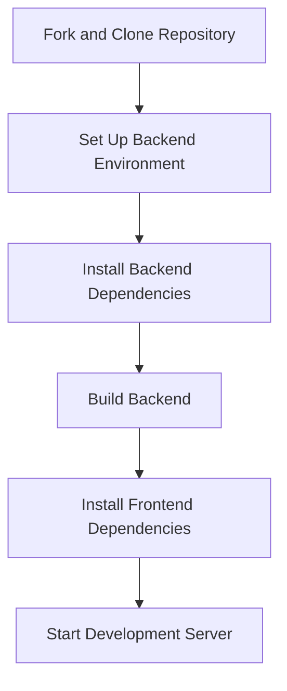

# Developer Guide

<cite>
**Referenced Files in This Document**   
- [CONTRIBUTING.md](file://CONTRIBUTING.md)
- [README.md](file://README.md)
- [pyproject.toml](file://pyproject.toml)
- [package.json](file://package.json)
- [config/config.yaml](file://config/config.yaml)
- [frontend/electron.vite.config.ts](file://frontend/electron.vite.config.ts)
- [frontend/package.json](file://frontend/package.json)
- [opencontext/cli.py](file://opencontext/cli.py)
- [opencontext/config/global_config.py](file://opencontext/config/global_config.py)
- [opencontext/managers/capture_manager.py](file://opencontext/managers/capture_manager.py)
- [opencontext/context_processing/processor/document_processor.py](file://opencontext/context_processing/processor/document_processor.py)
- [opencontext/context_processing/processor/screenshot_processor.py](file://opencontext/context_processing/processor/screenshot_processor.py)
- [frontend/src/main/bootstrap.ts](file://frontend/src/main/bootstrap.ts)
- [examples/example_document_processor.py](file://examples/example_document_processor.py)
- [examples/example_screenshot_processor.py](file://examples/example_screenshot_processor.py)
</cite>

## Table of Contents
1. [Introduction](#introduction)
2. [Setting Up the Development Environment](#setting-up-the-development-environment)
3. [Code Style and Standards](#code-style-and-standards)
4. [Testing Strategy and Procedures](#testing-strategy-and-procedures)
5. [Contribution Process and Pull Request Workflow](#contribution-process-and-pull-request-workflow)
6. [Project Architecture and Code Organization](#project-architecture-and-code-organization)
7. [Backend Module Development](#backend-module-development)
8. [Frontend Development](#frontend-development)
9. [Examples Directory and Best Practices](#examples-directory-and-best-practices)
10. [Documentation Requirements](#documentation-requirements)
11. [Debugging and Troubleshooting](#debugging-and-troubleshooting)
12. [Release Process and Versioning](#release-process-and-versioning)

## Introduction

This Developer Guide provides comprehensive instructions for contributing to the MineContext codebase. It covers the entire development lifecycle, from setting up the environment to submitting pull requests. MineContext is an open-source, proactive context-aware AI partner designed to bring clarity and efficiency to work, study, and creation by capturing and processing digital context from various sources such as screenshots, documents, and web links. The project follows a modular, layered architecture with a clear separation of concerns between its frontend and backend components. This guide aims to equip developers with the knowledge and tools necessary to make effective contributions, ensuring consistency in code quality, testing, and documentation across the project.

**Section sources**
- [README.md](file://README.md#L75-L83)
- [CONTRIBUTING.md](file://CONTRIBUTING.md#L1-L388)

## Setting Up the Development Environment

To begin contributing to MineContext, you must first set up a local development environment. The process involves forking the repository, cloning it to your local machine, and installing the necessary dependencies. The project uses different tools for its Python backend and TypeScript/React frontend. For the backend, it is recommended to use `uv`, a fast and reliable dependency manager for Python, although a traditional virtual environment with `pip` is also supported. After cloning the repository, navigate to the project root and install the backend dependencies. For the frontend, the project uses `pnpm` as its package manager. Ensure you are using the original PyPI source to avoid version conflicts. The development environment can be initialized with a series of commands that set up both the backend and frontend components.



**Diagram sources **
- [CONTRIBUTING.md](file://CONTRIBUTING.md#L9-L73)
- [README.md](file://README.md#L230-L248)

**Section sources**
- [CONTRIBUTING.md](file://CONTRIBUTING.md#L9-L73)
- [README.md](file://README.md#L230-L248)

## Code Style and Standards

MineContext enforces strict code style guidelines for both Python and TypeScript to maintain consistency and readability across the codebase. For Python code, the project adheres to PEP 8 standards and uses automated formatting tools. The configuration is managed in the `pyproject.toml` file, which specifies the use of `black` for code formatting and `isort` for organizing import statements. The maximum line length is set to 100 characters. A pre-commit hook is used to automatically format code upon every commit, ensuring that all contributions meet the project's style requirements without requiring manual intervention. For TypeScript code, the project uses `prettier` for code formatting, configured in the `frontend/.prettierrc.yaml` file. The frontend also employs `eslint` for linting, with rules defined in `frontend/eslint.config.mjs`. Type hints are encouraged in Python code, and TypeScript's static type checking provides robust type safety for the frontend. Following these standards is mandatory for all contributions.

**Section sources**
- [CONTRIBUTING.md](file://CONTRIBUTING.md#L129-L205)
- [pyproject.toml](file://pyproject.toml#L71-L99)
- [frontend/package.json](file://frontend/package.json#L19-L23)

## Testing Strategy and Procedures

The testing strategy for MineContext is designed to ensure the reliability and stability of both the backend and frontend components. While the provided documentation does not detail a comprehensive test suite, it emphasizes the importance of adding tests for new features and ensuring all tests pass before submitting a pull request. The contribution guidelines mandate that new features must be accompanied by corresponding tests. The project's architecture, with its modular design, facilitates unit testing of individual components such as capture modules and processors. For example, the `ScreenshotProcessor` and `DocumentProcessor` classes can be tested in isolation. The examples in the `examples/` directory, such as `example_screenshot_processor.py` and `example_document_processor.py`, serve as practical demonstrations of how to test and use these components. Developers are expected to write tests for any new code they contribute, covering both positive and negative scenarios to ensure robustness.

**Section sources**
- [CONTRIBUTING.md](file://CONTRIBUTING.md#L130-L159)
- [examples/example_screenshot_processor.py](file://examples/example_screenshot_processor.py)
- [examples/example_document_processor.py](file://examples/example_document_processor.py)

## Contribution Process and Pull Request Workflow

The contribution process for MineContext is well-defined and follows a standard open-source workflow. Contributors are expected to follow a specific branch naming convention to categorize their work, such as `feature/` for new features, `fix/` for bug fixes, and `docs/` for documentation updates. The process begins by creating a new branch from the main branch. Before making changes, developers should set up the pre-commit hooks to ensure code is automatically formatted. After implementing the changes, writing tests, and updating documentation, the changes are committed with a descriptive message following the conventional commit format (e.g., `feat: add new feature`). The branch is then pushed to the contributor's fork, and a pull request is created against the main repository. Before submission, contributors must verify that their code is properly formatted, all tests pass, and documentation is up to date. The pull request will be reviewed by the project maintainers before being merged.

**Section sources**
- [CONTRIBUTING.md](file://CONTRIBUTING.md#L91-L154)

## Project Architecture and Code Organization

MineContext follows a modular, layered architecture that clearly separates concerns between its various components. The backend, located in the `opencontext/` directory, is organized into distinct layers: `server/` for the API layer, `managers/` for business logic, `context_capture/` for data acquisition, `context_processing/` for data analysis, `storage/` for data persistence, and `llm/` for LLM integration. This design promotes loose coupling and high cohesion. The frontend, located in the `frontend/` directory, is a cross-platform desktop application built with Electron, React, and TypeScript. It follows a standard Electron architecture with separate directories for the main process, preload scripts, and renderer process. The `packages/shared/` directory contains utilities and constants shared between the main and renderer processes. This clear separation of concerns makes the codebase easier to understand, maintain, and extend.

```mermaid
graph TB
subgraph "Frontend"
A[Electron Main Process]
B[Preload Script]
C[React Renderer Process]
end
subgraph "Backend"
D[FastAPI Server]
E[Capture Manager]
F[Processor Manager]
G[Storage Layer]
H[LLM Integration]
end
A < --> B
B < --> C
A < --> D
E < --> F
F < --> G
H < --> F
```

**Diagram sources **
- [README.md](file://README.md#L184-L227)
- [README.md](file://README.md#L277-L287)

**Section sources**
- [README.md](file://README.md#L167-L287)

## Backend Module Development

Developing custom backend modules in MineContext involves creating either capture modules or processor modules. Capture modules are responsible for collecting raw data from various sources and converting it into `RawContextProperties`. They must implement the `ICaptureComponent` interface, with the core method being `capture()`, which returns a list of `RawContextProperties`. Processor modules analyze raw data and extract structured information for storage and search. They extend the `BaseContextProcessor` class and must implement the `can_process()` and `process()` methods. The `process()` method receives `RawContextProperties` and returns a list of `ProcessedContext` objects, which contain the extracted data and embeddings for search. The project provides reference examples in `opencontext/context_processing/processor/` for both screenshot and document processing. New modules can be registered in the processor factory or configuration to be integrated into the system.

**Section sources**
- [CONTRIBUTING.md](file://CONTRIBUTING.md#L206-L368)

## Frontend Development

Frontend development for MineContext involves working with a modern stack of Electron, React, and TypeScript. The development server can be started using the `pnpm dev` command, which launches the Electron application in development mode. The build process is configured with `electron-vite`, and the application can be packaged for distribution using `electron-builder` with commands like `pnpm build:mac` or `pnpm build:win`. The project uses `tailwindcss` for styling, providing a utility-first approach to CSS. The `frontend/src/main/` directory contains the Electron main process code, responsible for window management and IPC communication. The `frontend/src/renderer/` directory contains the React application, which is the user interface. The `frontend/packages/shared/` directory contains shared utilities, such as IPC channels and logging, that can be used by both the main and renderer processes. During development, it is normal for the screen capture area selection to be slow, but this issue does not exist in the packaged application.

**Section sources**
- [README.md](file://README.md#L250-L268)

## Examples Directory and Best Practices

The `examples/` directory contains several Python scripts that demonstrate best practices for using and extending the MineContext backend. These examples serve as practical guides for developers looking to understand how to interact with the system's core components. For instance, `example_screenshot_processor.py` shows how to use the `ScreenshotProcessor` to extract content from image files without storing them in the database. Similarly, `example_document_processor.py` demonstrates how to process various document formats like PDF, DOCX, and Markdown. These scripts illustrate how to initialize processors, create `RawContextProperties`, and handle the processing results. They also show how to scan directories for files and process them in batches. By studying these examples, developers can learn the correct patterns for integrating with the system and can use them as templates for their own custom modules.

**Section sources**
- [examples/example_screenshot_processor.py](file://examples/example_screenshot_processor.py)
- [examples/example_document_processor.py](file://examples/example_document_processor.py)

## Documentation Requirements

Documentation is a critical part of any contribution to the MineContext project. When submitting new features or making significant changes, contributors are required to update the relevant documentation to reflect the changes. This includes updating the `README.md` for user-facing changes, adding comments to the code for complex logic, and potentially updating the `CONTRIBUTING.md` guide for changes to the development workflow. The project uses docstrings in Python code to document classes and methods, following a standard format. For new modules, comprehensive docstrings should be provided to explain their purpose, usage, and any configuration options. The examples in the `examples/` directory also serve as a form of documentation, demonstrating how to use the system's APIs. Clear and thorough documentation ensures that the project remains accessible and maintainable for both current and future contributors.

**Section sources**
- [CONTRIBUTING.md](file://CONTRIBUTING.md#L131-L132)
- [examples/example_screenshot_processor.py](file://examples/example_screenshot_processor.py#L7-L26)
- [examples/example_document_processor.py](file://examples/example_document_processor.py#L7-L26)

## Debugging and Troubleshooting

Debugging and troubleshooting in MineContext can be approached from both the frontend and backend perspectives. For the backend, the system provides a web-based debugging interface accessible at `http://localhost:1733`. This interface allows developers to view token consumption, usage statistics, and configure automated tasks. The backend uses the `loguru` library for logging, with log levels configurable in the `config/config.yaml` file. Logs are written to a file specified by the `log_path` parameter. For the frontend, developers can use standard Electron and React debugging tools. The `mainLog` utility in `@shared/logger/main` can be used to log messages from the main process. When encountering issues, developers should first check the logs for error messages. The modular architecture also allows for isolating components; for example, a problem with screenshot processing can be debugged by running the `example_screenshot_processor.py` script independently of the main application.

**Section sources**
- [README.md](file://README.md#L154-L164)
- [config/config.yaml](file://config/config.yaml#L10-L13)
- [frontend/src/main/bootstrap.ts](file://frontend/src/main/bootstrap.ts#L9)

## Release Process and Versioning

The release process for MineContext involves packaging the application for different operating systems and publishing it to the GitHub releases page. The versioning scheme follows semantic versioning (MAJOR.MINOR.PATCH), as indicated by the version number in `pyproject.toml` and `frontend/package.json`. The project uses `electron-builder` to create distributable packages for macOS, Windows, and Linux. The build scripts, such as `build.bat` and `build.sh`, automate the process of building the backend and packaging the frontend application. Before a release, the maintainers ensure that all tests pass, the documentation is up to date, and the changelog is complete. The release is then tagged in Git and published on GitHub, where users can download the pre-built binaries. The project also supports a headless mode, which can be useful for server deployments or automated testing.

**Section sources**
- [pyproject.toml](file://pyproject.toml#L3)
- [frontend/package.json](file://frontend/package.json#L3)
- [README.md](file://README.md#L29-L30)
- [build.bat](file://build.bat)
- [build.sh](file://build.sh)