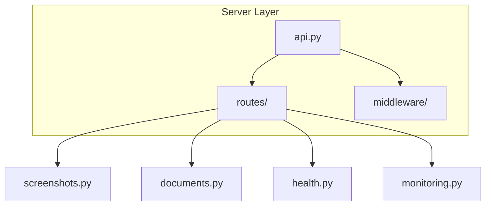
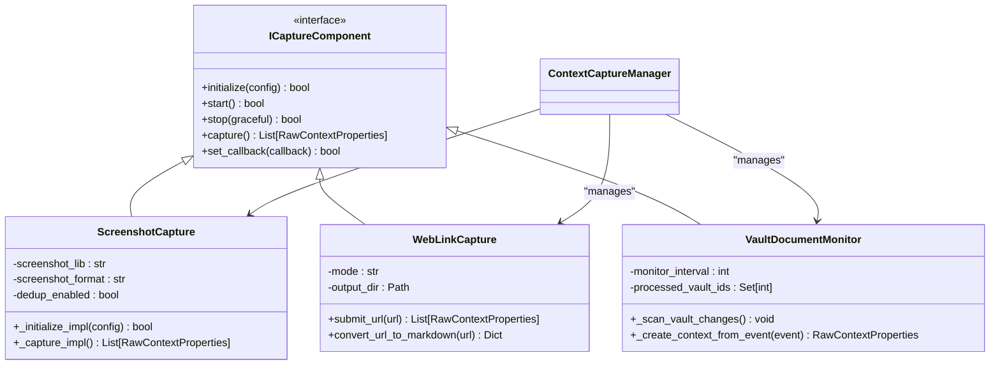
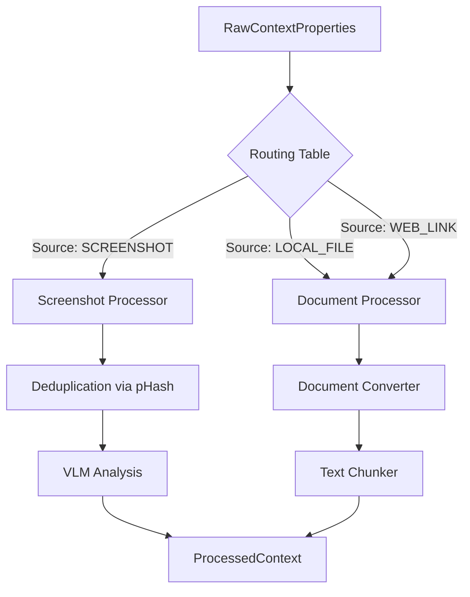
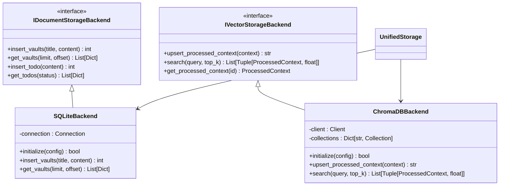
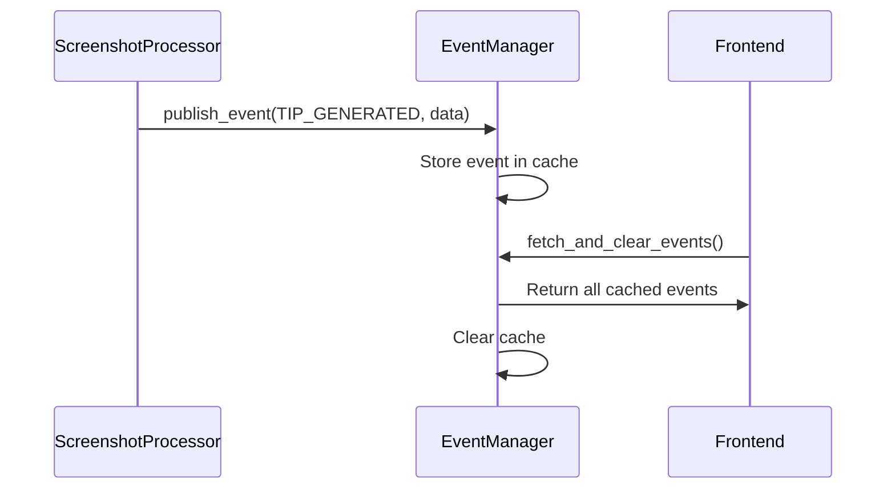

# Backend Structure

<cite>
**Referenced Files in This Document**   
- [api.py](file://opencontext/server/api.py)
- [component_initializer.py](file://opencontext/server/component_initializer.py)
- [capture_manager.py](file://opencontext/managers/capture_manager.py)
- [processor_manager.py](file://opencontext/managers/processor_manager.py)
- [event_manager.py](file://opencontext/managers/event_manager.py)
- [screenshot.py](file://opencontext/context_capture/screenshot.py)
- [web_link_capture.py](file://opencontext/context_capture/web_link_capture.py)
- [vault_document_monitor.py](file://opencontext/context_capture/vault_document_monitor.py)
- [document_processor.py](file://opencontext/context_processing/processor/document_processor.py)
- [screenshot_processor.py](file://opencontext/context_processing/processor/screenshot_processor.py)
- [sqlite_backend.py](file://opencontext/storage/backends/sqlite_backend.py)
- [chromadb_backend.py](file://opencontext/storage/backends/chromadb_backend.py)
- [config_manager.py](file://opencontext/config/config_manager.py)
- [global_config.py](file://opencontext/config/global_config.py)
</cite>

## Table of Contents
1. [Introduction](#introduction)
2. [System Initialization](#system-initialization)
3. [Server Layer and API Design](#server-layer-and-api-design)
4. [Context Capture Modules](#context-capture-modules)
5. [Processing Pipeline](#processing-pipeline)
6. [Storage Backends](#storage-backends)
7. [LLM Integration](#llm-integration)
8. [Event-Driven Coordination](#event-driven-coordination)
9. [Configuration Management](#configuration-management)
10. [Extensibility through Interface-Based Design](#extensibility-through-interface-based-design)

## Introduction
The MineContext Python service is a modular backend system designed for context-aware AI assistance. It captures user activities from multiple sources, processes them through a sophisticated pipeline, stores the data in specialized backends, and enables intelligent consumption via LLMs. The architecture is built on FastAPI for the server layer, with a clear separation of concerns between capture, processing, storage, and consumption components. This document provides a comprehensive breakdown of the backend structure, detailing how the various modules interact to form a cohesive system.

## System Initialization
The backend system is initialized through a well-defined process orchestrated by the `component_initializer.py` module. This process begins with the creation of a `ComponentInitializer` instance, which leverages the `GlobalConfig` singleton to access the application's configuration. The initializer first loads the main configuration via `ConfigManager`, which parses the `config.yaml` file and resolves environment variable references (e.g., `${VAR}` or `${VAR:default}`). It then proceeds to initialize the core managers: the `ContextCaptureManager`, `ContextProcessorManager`, and `ConsumptionManager`. Each manager is populated with its respective components based on the configuration, ensuring that the system is fully bootstrapped before the server starts.

**Section sources**
- [component_initializer.py](file://opencontext/server/component_initializer.py#L1-L229)
- [global_config.py](file://opencontext/config/global_config.py#L1-L331)
- [config_manager.py](file://opencontext/config/config_manager.py#L1-L253)

## Server Layer and API Design
The server layer is built on FastAPI, providing a RESTful API that serves as the primary interface for the frontend and external clients. The main router is defined in `api.py`, which aggregates all route modules from the `routes/` directory. This includes endpoints for health checks, context capture (e.g., screenshots, documents), content generation, and monitoring. The API design is modular, with each route file (e.g., `screenshots.py`, `documents.py`) handling a specific domain. Authentication is managed through middleware in the `middleware/` directory, ensuring that all requests are properly validated before being processed.

**Diagram sources**
- [api.py](file://opencontext/server/api.py#L1-L58)
- [routes/](file://opencontext/server/routes/)

**Section sources**
- [api.py](file://opencontext/server/api.py#L1-L58)

## Context Capture Modules
The system supports multiple context capture sources, each implemented as a component that adheres to the `ICaptureComponent` interface. The `CaptureManager` coordinates these components, allowing them to be started, stopped, and monitored independently. Key capture modules include:
- **Screenshot Capture**: Periodically captures the user's screen using the `mss` library, with options for region selection, image quality, and deduplication based on perceptual hashing.
- **Web Link Capture**: Converts URLs to Markdown or PDF using libraries like `crawl4ai` and `Playwright`, enabling the system to process web content.
- **Vault Document Monitor**: Monitors a local SQLite database for changes in documents, triggering context capture events when new or updated content is detected.

These modules are dynamically loaded and initialized based on the configuration, allowing for easy extensibility.

**Diagram sources**
- [capture_interface.py](file://opencontext/interfaces/capture_interface.py#L1-L153)
- [screenshot.py](file://opencontext/context_capture/screenshot.py#L1-L508)
- [web_link_capture.py](file://opencontext/context_capture/web_link_capture.py#L1-L351)
- [vault_document_monitor.py](file://opencontext/context_capture/vault_document_monitor.py#L1-L389)
- [capture_manager.py](file://opencontext/managers/capture_manager.py#L1-L391)

**Section sources**
- [screenshot.py](file://opencontext/context_capture/screenshot.py#L1-L508)
- [web_link_capture.py](file://opencontext/context_capture/web_link_capture.py#L1-L351)
- [vault_document_monitor.py](file://opencontext/context_capture/vault_document_monitor.py#L1-L389)
- [capture_manager.py](file://opencontext/managers/capture_manager.py#L1-L391)

## Processing Pipeline
The processing pipeline is managed by the `ProcessorManager`, which orchestrates the transformation of raw captured data into structured, actionable context. The pipeline consists of two main processors:
- **Document Processor**: Handles text-based content from various sources (e.g., PDFs, DOCX, Markdown). It uses a `DocumentConverter` to extract text and images, then applies a `DocumentTextChunker` to split the content into manageable chunks. For visual documents, it employs a Vision Language Model (VLM) to analyze images and extract text.
- **Screenshot Processor**: Processes screenshots by first deduplicating them using perceptual hashing. It then uses a VLM to analyze the image content, extracting titles, summaries, and keywords. The processor supports batch processing and periodic memory compression to manage resource usage.

The `ProcessorManager` uses a routing table to direct incoming data to the appropriate processor based on the source type, ensuring efficient and accurate processing.

**Diagram sources**
- [processor_manager.py](file://opencontext/managers/processor_manager.py#L1-L213)
- [document_processor.py](file://opencontext/context_processing/processor/document_processor.py#L1-L653)
- [screenshot_processor.py](file://opencontext/context_processing/processor/screenshot_processor.py#L1-L590)

**Section sources**
- [processor_manager.py](file://opencontext/managers/processor_manager.py#L1-L213)
- [document_processor.py](file://opencontext/context_processing/processor/document_processor.py#L1-L653)
- [screenshot_processor.py](file://opencontext/context_processing/processor/screenshot_processor.py#L1-L590)

## Storage Backends
The system utilizes two primary storage backends to persist data:
- **SQLite Backend**: A relational database that stores structured data such as user documents, to-do items, and activity records. It is implemented as an `IDocumentStorageBackend` and provides CRUD operations for various data types. The schema includes tables for `vaults`, `todo`, and `activity`, with appropriate indexes for performance.
- **ChromaDB Backend**: A vector database that stores embeddings of processed context for semantic search and retrieval. It creates a separate collection for each `ContextType` (e.g., `semantic_context`, `activity_context`), enabling efficient querying. The backend handles vectorization of text using an embedding model and supports upsert operations to keep the data current.

The `UnifiedStorage` class provides a single interface to both backends, abstracting the underlying storage details from the rest of the system.

**Diagram sources**
- [sqlite_backend.py](file://opencontext/storage/backends/sqlite_backend.py#L1-L800)
- [chromadb_backend.py](file://opencontext/storage/backends/chromadb_backend.py#L1-L800)
- [base_storage.py](file://opencontext/storage/base_storage.py)

**Section sources**
- [sqlite_backend.py](file://opencontext/storage/backends/sqlite_backend.py#L1-L800)
- [chromadb_backend.py](file://opencontext/storage/backends/chromadb_backend.py#L1-L800)

## LLM Integration
The system integrates with Large Language Models (LLMs) through the `llm/` module, which provides clients for both text and vision models. The `global_embedding_client.py` handles text vectorization, converting text into embeddings that can be stored in ChromaDB. The `global_vlm_client.py` manages interactions with Vision Language Models, enabling the analysis of images and screenshots. These clients are used by the processors to extract meaningful context from raw data. For example, the `ScreenshotProcessor` uses the VLM client to analyze screenshots and generate summaries, while the `DocumentProcessor` uses it to extract text from images within documents.

**Section sources**
- [llm_client.py](file://opencontext/llm/llm_client.py)
- [global_embedding_client.py](file://opencontext/llm/global_embedding_client.py)
- [global_vlm_client.py](file://opencontext/llm/global_vlm_client.py)

## Event-Driven Coordination
The system employs an event-driven architecture to coordinate activities between components. The `EventManager` acts as a central hub for publishing and consuming events. Components such as the `SmartTipGenerator` and `SmartTodoManager` publish events (e.g., `TIP_GENERATED`, `TODO_GENERATED`) when they produce new content. These events are cached in a thread-safe queue and can be fetched and cleared by consumers, such as the frontend, which displays the generated content to the user. This decoupled design allows components to operate independently while still being able to communicate and share data.

**Diagram sources**
- [event_manager.py](file://opencontext/managers/event_manager.py#L1-L117)

**Section sources**
- [event_manager.py](file://opencontext/managers/event_manager.py#L1-L117)

## Configuration Management
Configuration is managed through a hierarchical system that combines a main `config.yaml` file with user-specific settings. The `ConfigManager` loads the main configuration and replaces environment variable references, while the `GlobalConfig` singleton provides a unified interface for accessing both configuration and prompts. User settings are stored in a separate file (e.g., `user_setting.yaml`) and are merged with the main configuration, allowing users to customize the system without modifying the core files. Prompts are loaded from language-specific YAML files (e.g., `prompts_en.yaml`, `prompts_zh.yaml`) and can be overridden by user-defined prompts.

**Section sources**
- [config_manager.py](file://opencontext/config/config_manager.py#L1-L253)
- [global_config.py](file://opencontext/config/global_config.py#L1-L331)
- [prompt_manager.py](file://opencontext/config/prompt_manager.py)

## Extensibility through Interface-Based Design
The system's extensibility is achieved through a robust interface-based design. Core components such as capture, processing, and storage adhere to well-defined interfaces (e.g., `ICaptureComponent`, `IContextProcessor`, `IDocumentStorageBackend`). This allows new modules to be added without modifying existing code. For example, a new capture source can be implemented by creating a class that inherits from `BaseCaptureComponent` and registering it in the configuration. Similarly, new storage backends can be integrated by implementing the `IVectorStorageBackend` interface. This design promotes loose coupling and makes the system highly modular and maintainable.

**Section sources**
- [capture_interface.py](file://opencontext/interfaces/capture_interface.py#L1-L153)
- [processor_interface.py](file://opencontext/interfaces/processor_interface.py)
- [storage_interface.py](file://opencontext/interfaces/storage_interface.py)