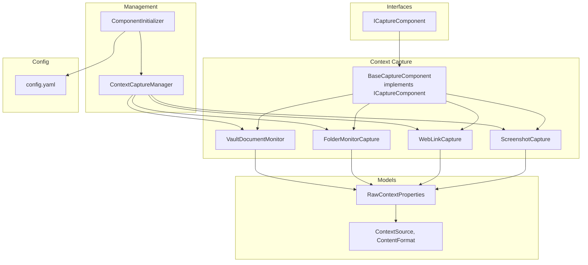
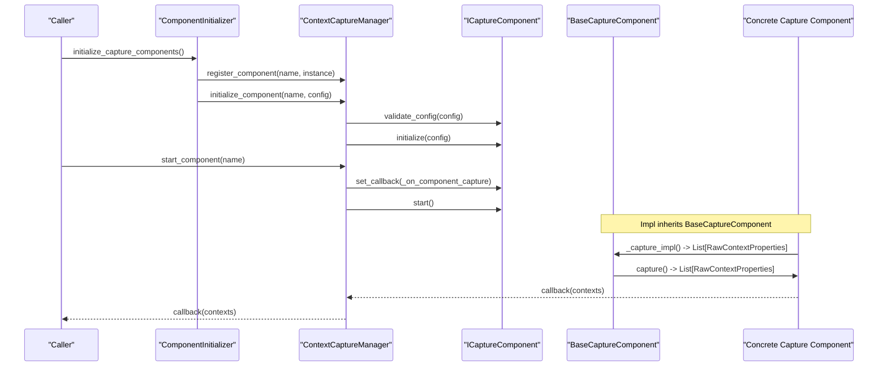
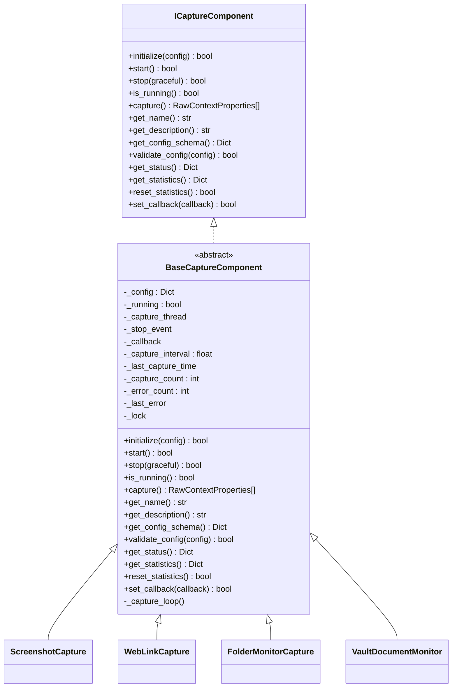
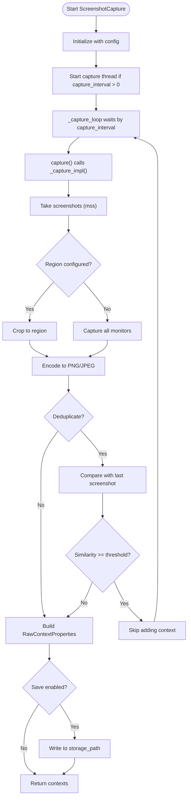
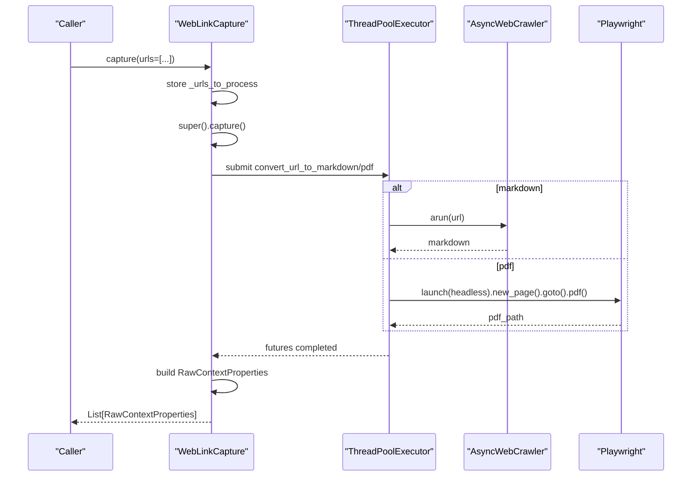
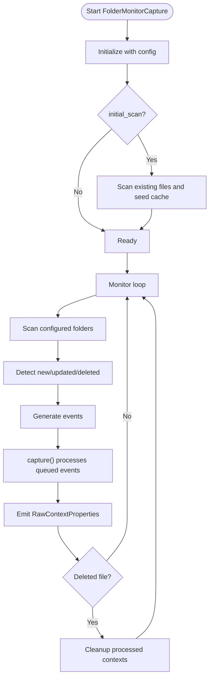
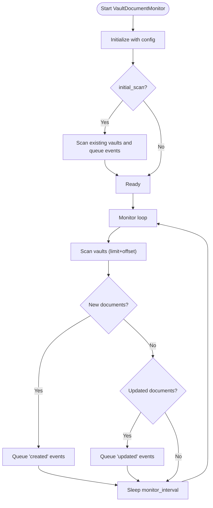
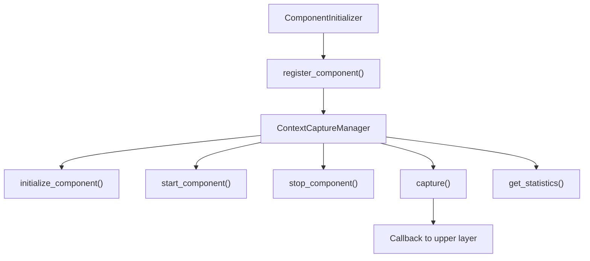

# Context Capture

<cite>
**Referenced Files in This Document**
- [base.py](file://opencontext/context_capture/base.py)
- [screenshot.py](file://opencontext/context_capture/screenshot.py)
- [web_link_capture.py](file://opencontext/context_capture/web_link_capture.py)
- [folder_monitor.py](file://opencontext/context_capture/folder_monitor.py)
- [vault_document_monitor.py](file://opencontext/context_capture/vault_document_monitor.py)
- [capture_interface.py](file://opencontext/interfaces/capture_interface.py)
- [capture_manager.py](file://opencontext/managers/capture_manager.py)
- [component_initializer.py](file://opencontext/server/component_initializer.py)
- [config.yaml](file://config/config.yaml)
- [context.py](file://opencontext/models/context.py)
- [enums.py](file://opencontext/models/enums.py)
- [example_screenshot_processor.py](file://examples/example_screenshot_processor.py)
- [example_weblink_processor.py](file://examples/example_weblink_processor.py)
- [verify_folder_monitor.py](file://examples/verify_folder_monitor.py)
</cite>

## Table of Contents
1. [Introduction](#introduction)
2. [Project Structure](#project-structure)
3. [Core Components](#core-components)
4. [Architecture Overview](#architecture-overview)
5. [Detailed Component Analysis](#detailed-component-analysis)
6. [Dependency Analysis](#dependency-analysis)
7. [Performance Considerations](#performance-considerations)
8. [Troubleshooting Guide](#troubleshooting-guide)
9. [Conclusion](#conclusion)
10. [Appendices](#appendices)

## Introduction
This document explains the context capture system that collects user digital activities across multiple sources: screenshots, web links, local folder changes, and vault document updates. It details how each capture component implements the ICaptureComponent interface, registers with CaptureManager, and integrates with the broader system. It also covers configuration options, timing and metadata collection, and practical examples from the codebase. Finally, it addresses common issues such as permission errors on macOS, missed captures, and resource usage optimization.

## Project Structure
The context capture subsystem resides under opencontext/context_capture and is orchestrated by managers and interfaces. Components are registered and initialized by ComponentInitializer, then managed by ContextCaptureManager.

**Diagram sources**
- [base.py](file://opencontext/context_capture/base.py#L1-L120)
- [screenshot.py](file://opencontext/context_capture/screenshot.py#L1-L120)
- [web_link_capture.py](file://opencontext/context_capture/web_link_capture.py#L1-L120)
- [folder_monitor.py](file://opencontext/context_capture/folder_monitor.py#L1-L120)
- [vault_document_monitor.py](file://opencontext/context_capture/vault_document_monitor.py#L1-L120)
- [capture_interface.py](file://opencontext/interfaces/capture_interface.py#L1-L153)
- [capture_manager.py](file://opencontext/managers/capture_manager.py#L1-L120)
- [component_initializer.py](file://opencontext/server/component_initializer.py#L1-L120)
- [context.py](file://opencontext/models/context.py#L1-L120)
- [enums.py](file://opencontext/models/enums.py#L1-L120)
- [config.yaml](file://config/config.yaml#L1-L120)

**Section sources**
- [base.py](file://opencontext/context_capture/base.py#L1-L120)
- [capture_interface.py](file://opencontext/interfaces/capture_interface.py#L1-L153)
- [capture_manager.py](file://opencontext/managers/capture_manager.py#L1-L120)
- [component_initializer.py](file://opencontext/server/component_initializer.py#L1-L120)
- [config.yaml](file://config/config.yaml#L1-L120)

## Core Components
- BaseCaptureComponent: Implements ICaptureComponent and provides shared lifecycle, scheduling, callbacks, and statistics. Concrete components extend it to implement capture logic.
- ScreenshotCapture: Periodically captures screenshots, supports region selection, format/quality, deduplication, and optional saving.
- WebLinkCapture: Converts URLs to Markdown or PDF and enqueues RawContextProperties for downstream processing.
- FolderMonitorCapture: Watches local folders for new/updated/deleted files, builds RawContextProperties, and cleans up processed contexts on deletion.
- VaultDocumentMonitor: Monitors vaults table for new/updated documents and emits RawContextProperties.

All components implement the ICaptureComponent interface and are registered with ContextCaptureManager, which manages their lifecycle and aggregates statistics.

**Section sources**
- [base.py](file://opencontext/context_capture/base.py#L1-L200)
- [screenshot.py](file://opencontext/context_capture/screenshot.py#L1-L120)
- [web_link_capture.py](file://opencontext/context_capture/web_link_capture.py#L1-L120)
- [folder_monitor.py](file://opencontext/context_capture/folder_monitor.py#L1-L120)
- [vault_document_monitor.py](file://opencontext/context_capture/vault_document_monitor.py#L1-L120)
- [capture_interface.py](file://opencontext/interfaces/capture_interface.py#L1-L153)

## Architecture Overview
The capture components are loosely coupled through ICaptureComponent and coordinated by ContextCaptureManager. ComponentInitializer reads config.yaml and registers components with the manager. Each component’s capture method returns a list of RawContextProperties, which are forwarded to the manager’s callback and then to the upper layer.

**Diagram sources**
- [component_initializer.py](file://opencontext/server/component_initializer.py#L70-L120)
- [capture_manager.py](file://opencontext/managers/capture_manager.py#L100-L210)
- [base.py](file://opencontext/context_capture/base.py#L170-L220)
- [screenshot.py](file://opencontext/context_capture/screenshot.py#L210-L260)
- [web_link_capture.py](file://opencontext/context_capture/web_link_capture.py#L190-L260)
- [folder_monitor.py](file://opencontext/context_capture/folder_monitor.py#L110-L170)
- [vault_document_monitor.py](file://opencontext/context_capture/vault_document_monitor.py#L110-L170)

## Detailed Component Analysis

### BaseCaptureComponent
- Implements ICaptureComponent and provides:
  - Lifecycle: initialize, start, stop, is_running
  - Scheduling: configurable capture_interval with internal capture thread
  - Callback: set_callback and internal callback invocation
  - Validation: validate_config and get_config_schema
  - Stats: get_statistics, reset_statistics, status reporting
- Subclasses override:
  - _initialize_impl, _start_impl, _stop_impl, _capture_impl
  - Optional: _get_config_schema_impl, _validate_config_impl, _get_status_impl, _get_statistics_impl, _reset_statistics_impl

**Diagram sources**
- [capture_interface.py](file://opencontext/interfaces/capture_interface.py#L1-L153)
- [base.py](file://opencontext/context_capture/base.py#L1-L200)
- [screenshot.py](file://opencontext/context_capture/screenshot.py#L1-L120)
- [web_link_capture.py](file://opencontext/context_capture/web_link_capture.py#L1-L120)
- [folder_monitor.py](file://opencontext/context_capture/folder_monitor.py#L1-L120)
- [vault_document_monitor.py](file://opencontext/context_capture/vault_document_monitor.py#L1-L120)

**Section sources**
- [base.py](file://opencontext/context_capture/base.py#L1-L200)
- [capture_interface.py](file://opencontext/interfaces/capture_interface.py#L1-L153)

### Screenshot Capture
- Timing: configurable capture_interval; internal thread runs _capture_loop to call capture() at intervals.
- Region selection: optional screenshot_region rectangle; if not provided, captures all monitors.
- Metadata: includes format, timestamp, library used, region, path, and tags; deduplication enabled by default with similarity threshold.
- Saving: optional storage_path to persist screenshots; saves per monitor with timestamped filenames.
- Implementation highlights:
  - Uses mss for fast screen capture and PIL for format conversion.
  - _capture_impl returns list of RawContextProperties with ContentFormat.IMAGE and ContextSource.SCREENSHOT.
  - _get_config_schema_impl/_validate_config_impl define screenshot-specific options.

**Diagram sources**
- [screenshot.py](file://opencontext/context_capture/screenshot.py#L210-L360)
- [base.py](file://opencontext/context_capture/base.py#L408-L430)

**Section sources**
- [screenshot.py](file://opencontext/context_capture/screenshot.py#L1-L200)
- [screenshot.py](file://opencontext/context_capture/screenshot.py#L210-L360)
- [screenshot.py](file://opencontext/context_capture/screenshot.py#L360-L508)
- [context.py](file://opencontext/models/context.py#L1-L120)
- [enums.py](file://opencontext/models/enums.py#L1-L120)

### Web Link Capture
- Purpose: Convert URLs to Markdown or PDF and produce RawContextProperties for downstream processing.
- Concurrency: Uses ThreadPoolExecutor to parallelize conversions.
- Modes: markdown or pdf; configurable output_dir, timeout, wait_until, and PDF options.
- Override: capture(urls: List[str]) allows submitting URLs directly; _capture_impl processes them and returns contexts.

**Diagram sources**
- [web_link_capture.py](file://opencontext/context_capture/web_link_capture.py#L190-L260)
- [web_link_capture.py](file://opencontext/context_capture/web_link_capture.py#L260-L351)

**Section sources**
- [web_link_capture.py](file://opencontext/context_capture/web_link_capture.py#L1-L120)
- [web_link_capture.py](file://opencontext/context_capture/web_link_capture.py#L190-L351)
- [context.py](file://opencontext/models/context.py#L1-L120)
- [enums.py](file://opencontext/models/enums.py#L1-L120)

### Folder Monitoring
- Purpose: Watch local folders for file changes and emit RawContextProperties for new/updated/deleted files.
- Scanning: Periodic scan with monitor_interval; initial_scan option to pre-seed cache.
- Detection: Compares mtime/size/hash to detect new/updated/deleted files.
- Cleanup: On deletion, queries and deletes processed contexts associated with the file.
- Output: Maps file extensions to ContentFormat; text files are read for content_text.

**Diagram sources**
- [folder_monitor.py](file://opencontext/context_capture/folder_monitor.py#L110-L210)
- [folder_monitor.py](file://opencontext/context_capture/folder_monitor.py#L210-L320)
- [folder_monitor.py](file://opencontext/context_capture/folder_monitor.py#L320-L472)

**Section sources**
- [folder_monitor.py](file://opencontext/context_capture/folder_monitor.py#L1-L120)
- [folder_monitor.py](file://opencontext/context_capture/folder_monitor.py#L110-L210)
- [folder_monitor.py](file://opencontext/context_capture/folder_monitor.py#L210-L320)
- [folder_monitor.py](file://opencontext/context_capture/folder_monitor.py#L320-L472)
- [context.py](file://opencontext/models/context.py#L1-L120)
- [enums.py](file://opencontext/models/enums.py#L1-L120)

### Vault Document Monitoring
- Purpose: Monitor vaults table for new/updated documents and emit RawContextProperties.
- Scanning: Periodic scan with monitor_interval; initial_scan to seed processed ids.
- Detection: Compares created_at/updated_at timestamps against last_scan_time.
- Output: Builds RawContextProperties with ContextSource.VAULT and ContentFormat.TEXT.

**Diagram sources**
- [vault_document_monitor.py](file://opencontext/context_capture/vault_document_monitor.py#L110-L210)
- [vault_document_monitor.py](file://opencontext/context_capture/vault_document_monitor.py#L210-L320)
- [vault_document_monitor.py](file://opencontext/context_capture/vault_document_monitor.py#L320-L389)

**Section sources**
- [vault_document_monitor.py](file://opencontext/context_capture/vault_document_monitor.py#L1-L120)
- [vault_document_monitor.py](file://opencontext/context_capture/vault_document_monitor.py#L110-L210)
- [vault_document_monitor.py](file://opencontext/context_capture/vault_document_monitor.py#L210-L320)
- [vault_document_monitor.py](file://opencontext/context_capture/vault_document_monitor.py#L320-L389)
- [context.py](file://opencontext/models/context.py#L1-L120)
- [enums.py](file://opencontext/models/enums.py#L1-L120)

## Dependency Analysis
- Registration and initialization:
  - ComponentInitializer maps component names to classes and registers them with ContextCaptureManager.
  - ComponentInitializer reads capture configs from config.yaml and passes them to initialize_component.
- Management:
  - ContextCaptureManager validates config, sets callbacks, starts/stops components, and aggregates statistics.
- Data contracts:
  - All capture components return List[RawContextProperties].
  - RawContextProperties carries source, content_format, content_path/text, create_time, filter_path, and additional_info.

**Diagram sources**
- [component_initializer.py](file://opencontext/server/component_initializer.py#L70-L120)
- [capture_manager.py](file://opencontext/managers/capture_manager.py#L100-L210)
- [context.py](file://opencontext/models/context.py#L1-L120)

**Section sources**
- [component_initializer.py](file://opencontext/server/component_initializer.py#L1-L120)
- [capture_manager.py](file://opencontext/managers/capture_manager.py#L1-L210)
- [context.py](file://opencontext/models/context.py#L1-L120)

## Performance Considerations
- ScreenshotCapture
  - Use capture_interval judiciously; lower intervals increase CPU/GPU usage.
  - Enable deduplication to avoid redundant processing; tune similarity_threshold.
  - Limit image size and quality to balance fidelity and memory usage.
  - Consider disabling storage_path to reduce disk I/O.
- WebLinkCapture
  - Control max_workers to balance throughput vs. resource contention.
  - Adjust timeout and wait_until to match network conditions.
- FolderMonitorCapture
  - Increase monitor_interval to reduce scan frequency.
  - Tune max_file_size to skip large files.
  - Disable recursive scanning if not needed.
- VaultDocumentMonitor
  - Adjust monitor_interval to balance freshness and overhead.
  - Use initial_scan carefully in large vaults to avoid heavy initial scans.

[No sources needed since this section provides general guidance]

## Troubleshooting Guide
- Permission errors on macOS
  - Screenshot capture relies on mss; ensure appropriate permissions for screen capture.
  - If mss import fails, install the required system libraries or adjust to a supported backend.
- Missed captures
  - Verify capture_interval is set and component is running.
  - For FolderMonitorCapture, confirm watch_folder_paths exist and are readable.
  - For WebLinkCapture, ensure external dependencies (crawl4ai/playwright) are installed.
- Resource usage optimization
  - Lower capture_interval or disable components not needed.
  - Reduce screenshot quality/size or disable saving.
  - Limit max_workers for WebLinkCapture and increase timeouts cautiously.
  - Use initial_scan only when necessary and disable recursive scanning if not required.

**Section sources**
- [screenshot.py](file://opencontext/context_capture/screenshot.py#L60-L120)
- [web_link_capture.py](file://opencontext/context_capture/web_link_capture.py#L160-L220)
- [folder_monitor.py](file://opencontext/context_capture/folder_monitor.py#L140-L210)
- [vault_document_monitor.py](file://opencontext/context_capture/vault_document_monitor.py#L140-L210)

## Conclusion
The context capture system provides a modular, extensible framework for collecting user digital activities. BaseCaptureComponent encapsulates lifecycle and scheduling, while specialized components implement source-specific capture logic. ContextCaptureManager orchestrates registration, initialization, and runtime coordination. Configuration-driven behavior allows tuning for performance and privacy. The examples demonstrate practical usage patterns for screenshots and web links.

[No sources needed since this section summarizes without analyzing specific files]

## Appendices

### Configuration Options
- Capture module (config.yaml capture.*)
  - screenshot.enabled, screenshot.capture_interval, screenshot.storage_path
  - folder_monitor.enabled, folder_monitor.monitor_interval, folder_monitor.watch_folder_paths, folder_monitor.recursive, folder_monitor.max_file_size, folder_monitor.initial_scan
  - file_monitor.enabled, file_monitor.recursive, file_monitor.initial_scan, file_monitor.monitor_paths, file_monitor.capture_interval, file_monitor.ignore_patterns
  - vault_document_monitor.enabled, vault_document_monitor.monitor_interval, vault_document_monitor.initial_scan

**Section sources**
- [config.yaml](file://config/config.yaml#L40-L120)

### How Components Implement ICaptureComponent and Register with CaptureManager
- Implementations:
  - ScreenshotCapture, WebLinkCapture, FolderMonitorCapture, VaultDocumentMonitor all inherit BaseCaptureComponent and implement _initialize_impl, _start_impl, _stop_impl, _capture_impl.
- Registration:
  - ComponentInitializer maps component names to classes and registers them with ContextCaptureManager.
  - ComponentInitializer reads capture configs and calls initialize_component/start_component accordingly.

**Section sources**
- [screenshot.py](file://opencontext/context_capture/screenshot.py#L60-L120)
- [web_link_capture.py](file://opencontext/context_capture/web_link_capture.py#L160-L220)
- [folder_monitor.py](file://opencontext/context_capture/folder_monitor.py#L110-L170)
- [vault_document_monitor.py](file://opencontext/context_capture/vault_document_monitor.py#L110-L170)
- [component_initializer.py](file://opencontext/server/component_initializer.py#L70-L120)
- [capture_manager.py](file://opencontext/managers/capture_manager.py#L100-L210)

### Concrete Examples from the Codebase
- Screenshot processor example
  - Demonstrates creating RawContextProperties for images and processing them with ScreenshotProcessor.
- Web link processor example
  - Demonstrates initializing WebLinkCapture, capturing a URL, and processing the resulting file context with DocumentProcessor.
- Folder monitor verification
  - Demonstrates initializing FolderMonitorCapture, simulating file creation/update/deletion, and verifying cleanup behavior.

**Section sources**
- [example_screenshot_processor.py](file://examples/example_screenshot_processor.py#L1-L181)
- [example_weblink_processor.py](file://examples/example_weblink_processor.py#L1-L95)
- [verify_folder_monitor.py](file://examples/verify_folder_monitor.py#L1-L160)