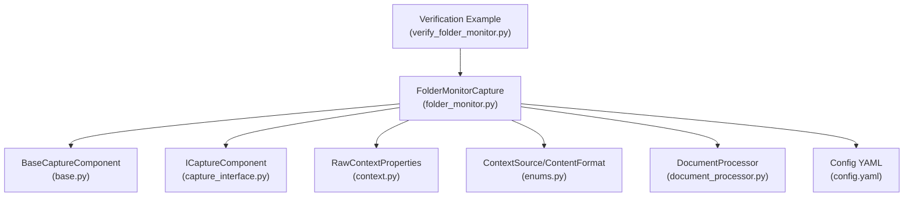
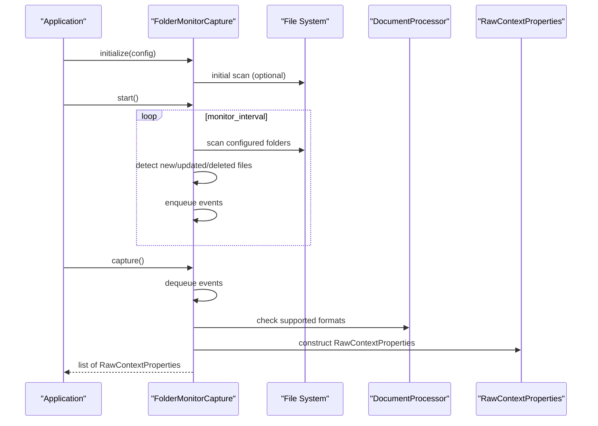
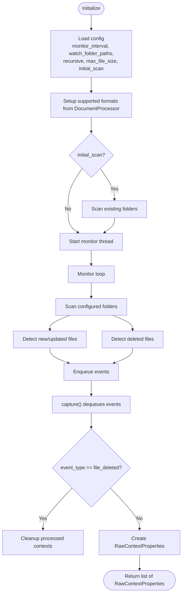
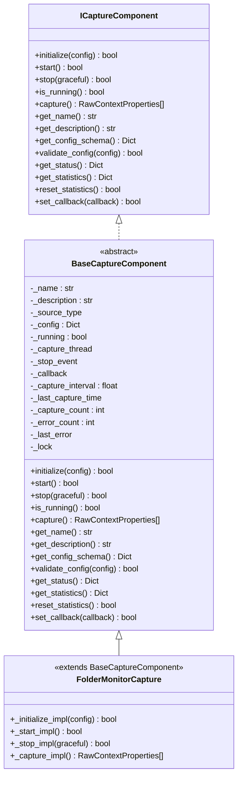
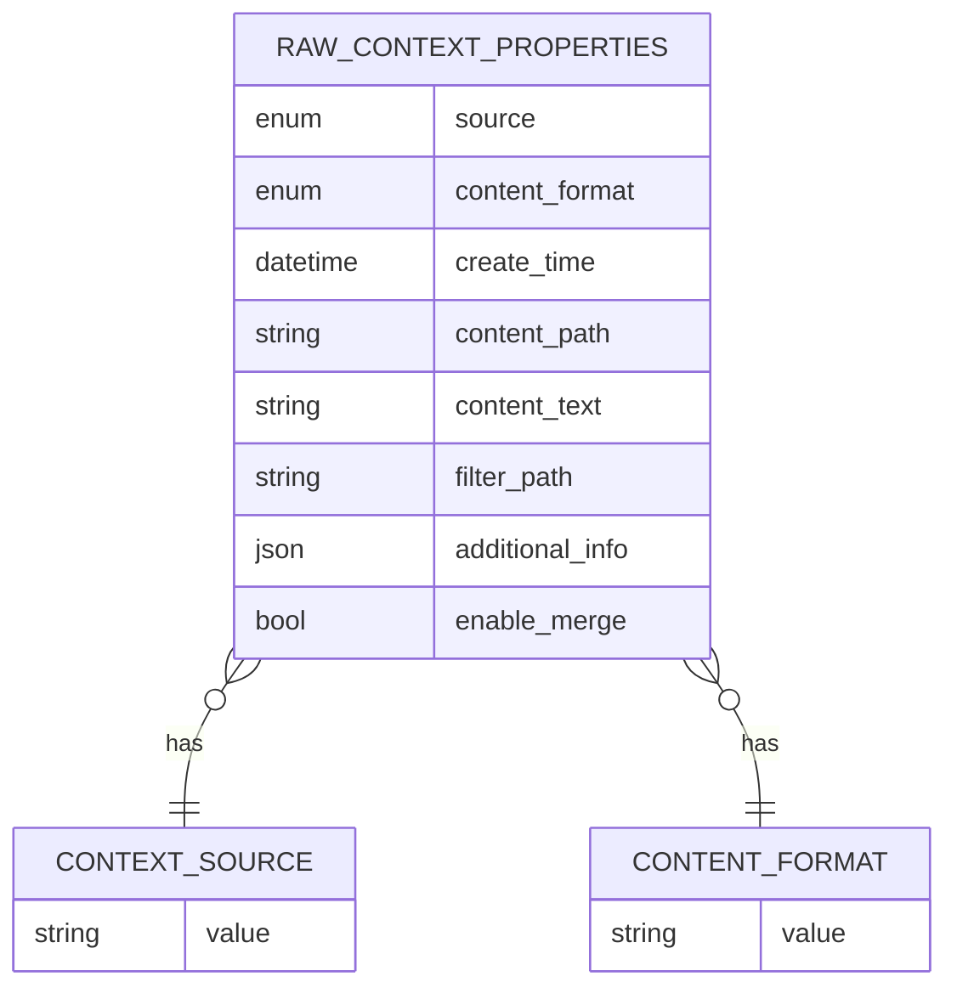
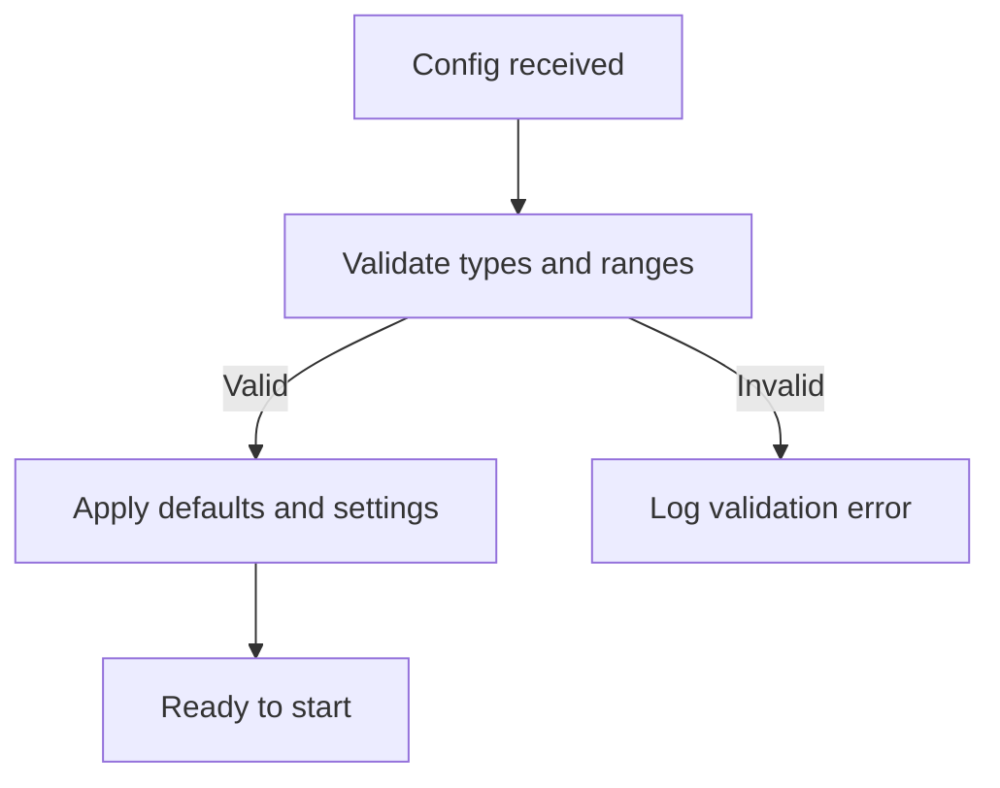
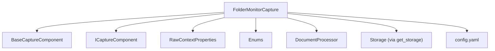

# Folder Monitoring

<cite>
**Referenced Files in This Document**
- [folder_monitor.py](file://opencontext/context_capture/folder_monitor.py)
- [base.py](file://opencontext/context_capture/base.py)
- [capture_interface.py](file://opencontext/interfaces/capture_interface.py)
- [context.py](file://opencontext/models/context.py)
- [enums.py](file://opencontext/models/enums.py)
- [document_processor.py](file://opencontext/context_processing/processor/document_processor.py)
- [config.yaml](file://config/config.yaml)
- [verify_folder_monitor.py](file://examples/verify_folder_monitor.py)
</cite>

## Table of Contents
1. [Introduction](#introduction)
2. [Project Structure](#project-structure)
3. [Core Components](#core-components)
4. [Architecture Overview](#architecture-overview)
5. [Detailed Component Analysis](#detailed-component-analysis)
6. [Dependency Analysis](#dependency-analysis)
7. [Performance Considerations](#performance-considerations)
8. [Troubleshooting Guide](#troubleshooting-guide)
9. [Conclusion](#conclusion)
10. [Appendices](#appendices)

## Introduction
This document explains the folder monitoring component responsible for tracking file system changes in local directories and generating context capture events. The implementation uses periodic polling to detect file creation, modification, and deletion within configured directories. It transforms detected events into RawContextProperties enriched with metadata such as path, size, modification time, and file type. The component integrates with the broader context capture pipeline and supports configuration for monitored directories, recursion depth, and file size limits.

## Project Structure
The folder monitoring feature resides in the context capture module and interacts with shared interfaces, models, and configuration. The following diagram shows the relevant files and their roles.

**Diagram sources**
- [folder_monitor.py](file://opencontext/context_capture/folder_monitor.py#L1-L120)
- [base.py](file://opencontext/context_capture/base.py#L1-L120)
- [capture_interface.py](file://opencontext/interfaces/capture_interface.py#L1-L120)
- [context.py](file://opencontext/models/context.py#L1-L80)
- [enums.py](file://opencontext/models/enums.py#L1-L80)
- [document_processor.py](file://opencontext/context_processing/processor/document_processor.py#L110-L135)
- [config.yaml](file://config/config.yaml#L48-L70)
- [verify_folder_monitor.py](file://examples/verify_folder_monitor.py#L40-L116)

**Section sources**
- [folder_monitor.py](file://opencontext/context_capture/folder_monitor.py#L1-L120)
- [base.py](file://opencontext/context_capture/base.py#L1-L120)
- [capture_interface.py](file://opencontext/interfaces/capture_interface.py#L1-L120)
- [context.py](file://opencontext/models/context.py#L1-L80)
- [enums.py](file://opencontext/models/enums.py#L1-L80)
- [document_processor.py](file://opencontext/context_processing/processor/document_processor.py#L110-L135)
- [config.yaml](file://config/config.yaml#L48-L70)
- [verify_folder_monitor.py](file://examples/verify_folder_monitor.py#L40-L116)

## Core Components
- FolderMonitorCapture: Implements the ICaptureComponent interface to monitor local directories, detect file changes, and emit RawContextProperties for downstream processing.
- BaseCaptureComponent: Provides common lifecycle and configuration handling for all capture components.
- ICaptureComponent: Defines the contract for capture components, including initialization, start/stop, capture, and status/statistics.
- RawContextProperties: Data model representing captured context with fields for source, content format, path, text, and additional metadata.
- ContextSource and ContentFormat: Enumerations defining the origin and content type of captured data.
- DocumentProcessor: Supplies supported file formats used by FolderMonitorCapture to filter eligible files.

Key responsibilities:
- Periodic scanning of configured directories
- Detection of new, updated, and deleted files
- Event queuing and capture execution
- Context creation with enriched metadata
- Cleanup of processed contexts upon file deletion

**Section sources**
- [folder_monitor.py](file://opencontext/context_capture/folder_monitor.py#L29-L120)
- [base.py](file://opencontext/context_capture/base.py#L26-L120)
- [capture_interface.py](file://opencontext/interfaces/capture_interface.py#L18-L120)
- [context.py](file://opencontext/models/context.py#L35-L80)
- [enums.py](file://opencontext/models/enums.py#L15-L72)
- [document_processor.py](file://opencontext/context_processing/processor/document_processor.py#L110-L135)

## Architecture Overview
The folder monitor operates as a periodic scanner that maintains a file info cache and compares current filesystem state against previous snapshots. Detected changes are queued as events and later transformed into RawContextProperties during capture.

**Diagram sources**
- [folder_monitor.py](file://opencontext/context_capture/folder_monitor.py#L59-L120)
- [folder_monitor.py](file://opencontext/context_capture/folder_monitor.py#L137-L189)
- [folder_monitor.py](file://opencontext/context_capture/folder_monitor.py#L245-L326)
- [document_processor.py](file://opencontext/context_processing/processor/document_processor.py#L110-L135)
- [context.py](file://opencontext/models/context.py#L35-L80)

## Detailed Component Analysis

### FolderMonitorCapture Implementation
- Lifecycle:
  - initialize(config): Loads configuration (monitor_interval, watch_folder_paths, recursive, max_file_size, initial_scan), sets up supported formats, clears caches, and logs settings.
  - start(): Optionally performs an initial scan, then starts a monitor thread that periodically scans for changes.
  - stop(graceful): Signals the monitor thread to stop and waits for graceful termination.
  - capture(): Dequeues queued events, processes deletions, and creates RawContextProperties for new/updated events.
- Change detection:
  - scan_folder_file_changes(): Aggregates files from all watch folders, detects new/updated/deleted files, and enqueues events.
  - detect_new_and_updated_files(): Compares mtime and size; computes SHA-256 hashes to detect updates; caches file metadata.
  - detect_deleted_files(): Removes entries from cache and logs deletions.
- Event processing:
  - _process_file_event(): Handles deletion events by cleaning up processed contexts associated with the deleted file via storage.
  - _create_context_from_event(): Builds RawContextProperties for created/updated events, infers content format from file extension, reads text content for text files, and attaches additional metadata including file_path, file_name, file_type, event_type, and file_info.
- Configuration and validation:
  - _get_config_schema_impl(): Exposes configuration keys: capture_interval, monitor_interval, initial_scan, watch_folder_paths, recursive, max_file_size.
  - _validate_config_impl(): Validates numeric constraints and list of paths.
- Status and statistics:
  - _get_status_impl(): Reports monitor_interval, pending_events, last_scan_time, is_monitoring, watched_folders, cached_files.
  - _get_statistics_impl(): Tracks total_processed and last_activity_time.
  - _reset_statistics_impl(): Resets counters and clears queued events.

**Diagram sources**
- [folder_monitor.py](file://opencontext/context_capture/folder_monitor.py#L59-L120)
- [folder_monitor.py](file://opencontext/context_capture/folder_monitor.py#L137-L189)
- [folder_monitor.py](file://opencontext/context_capture/folder_monitor.py#L245-L326)

**Section sources**
- [folder_monitor.py](file://opencontext/context_capture/folder_monitor.py#L59-L120)
- [folder_monitor.py](file://opencontext/context_capture/folder_monitor.py#L137-L189)
- [folder_monitor.py](file://opencontext/context_capture/folder_monitor.py#L190-L232)
- [folder_monitor.py](file://opencontext/context_capture/folder_monitor.py#L245-L326)
- [folder_monitor.py](file://opencontext/context_capture/folder_monitor.py#L384-L424)
- [folder_monitor.py](file://opencontext/context_capture/folder_monitor.py#L446-L472)

### BaseCaptureComponent and ICaptureComponent
- BaseCaptureComponent:
  - Implements common lifecycle, configuration validation, capture scheduling, and statistics.
  - Provides a capture thread that periodically invokes capture() when capture_interval is configured.
- ICaptureComponent:
  - Defines the interface contract for all capture components, including initialize, start, stop, capture, get_name, get_description, get_config_schema, validate_config, get_status, get_statistics, reset_statistics, and set_callback.

**Diagram sources**
- [capture_interface.py](file://opencontext/interfaces/capture_interface.py#L18-L153)
- [base.py](file://opencontext/context_capture/base.py#L26-L120)
- [folder_monitor.py](file://opencontext/context_capture/folder_monitor.py#L29-L60)

**Section sources**
- [capture_interface.py](file://opencontext/interfaces/capture_interface.py#L18-L153)
- [base.py](file://opencontext/context_capture/base.py#L26-L120)
- [folder_monitor.py](file://opencontext/context_capture/folder_monitor.py#L29-L60)

### RawContextProperties and Metadata Enrichment
- RawContextProperties fields used by FolderMonitorCapture:
  - source: ContextSource.LOCAL_FILE
  - content_format: ContentFormat.TEXT, ContentFormat.IMAGE, or ContentFormat.FILE depending on file extension
  - content_text: Populated for text files
  - content_path: Absolute path to the file
  - create_time: Timestamp of the event
  - filter_path: Same as content_path
  - additional_info: Includes file_path, file_name, file_type, event_type, and file_info (mtime, size, hash)
  - enable_merge: False by default for capture events
- Content format mapping:
  - Images: .png, .jpg, .jpeg, .gif, .bmp, .webp
  - Structured/visual documents: .pdf, .docx, .doc, .pptx, .ppt, .xlsx, .xls, .csv, .jsonl, .md
  - Plain text: .md, .txt

**Diagram sources**
- [context.py](file://opencontext/models/context.py#L35-L80)
- [enums.py](file://opencontext/models/enums.py#L15-L72)

**Section sources**
- [context.py](file://opencontext/models/context.py#L35-L80)
- [enums.py](file://opencontext/models/enums.py#L15-L72)
- [folder_monitor.py](file://opencontext/context_capture/folder_monitor.py#L289-L326)

### Configuration Options
- Configurable parameters exposed by FolderMonitorCapture:
  - capture_interval: Capture interval in seconds (used by BaseCaptureComponent’s capture thread)
  - monitor_interval: Monitor interval in seconds (used by FolderMonitorCapture’s monitor loop)
  - initial_scan: Whether to perform an initial scan of watched folders
  - watch_folder_paths: List of folder paths to monitor
  - recursive: Whether to scan folders recursively
  - max_file_size: Maximum file size to process (bytes)
- Default values and constraints are validated by BaseCaptureComponent and FolderMonitorCapture.

**Diagram sources**
- [base.py](file://opencontext/context_capture/base.py#L275-L310)
- [folder_monitor.py](file://opencontext/context_capture/folder_monitor.py#L384-L424)

**Section sources**
- [base.py](file://opencontext/context_capture/base.py#L275-L310)
- [folder_monitor.py](file://opencontext/context_capture/folder_monitor.py#L384-L424)

### Real-time Monitoring vs Polling
- Current implementation uses periodic polling rather than platform-specific file system watchers (e.g., inotify, FSEvents). The monitor loop sleeps for monitor_interval between scans.
- Pros: Simpler, cross-platform, and easier to reason about.
- Cons: Higher latency compared to native watchers; potential overhead for large directory trees.

**Section sources**
- [folder_monitor.py](file://opencontext/context_capture/folder_monitor.py#L137-L189)

### File Type Filters and Supported Formats
- Supported formats are derived from DocumentProcessor.get_supported_formats().
- FolderMonitorCapture uses these formats to filter eligible files during scanning and to infer content_format for RawContextProperties.

**Section sources**
- [document_processor.py](file://opencontext/context_processing/processor/document_processor.py#L110-L135)
- [folder_monitor.py](file://opencontext/context_capture/folder_monitor.py#L347-L371)

### Example: Event Transformation to RawContextProperties
- The verification example demonstrates:
  - Creating a file triggers a “file_created” event captured as RawContextProperties with content_text populated for text files.
  - Updating a file triggers a “file_updated” event.
  - Deleting a file triggers cleanup of processed contexts and returns zero events from capture().

**Section sources**
- [verify_folder_monitor.py](file://examples/verify_folder_monitor.py#L40-L116)
- [folder_monitor.py](file://opencontext/context_capture/folder_monitor.py#L289-L326)

## Dependency Analysis
- Internal dependencies:
  - FolderMonitorCapture depends on BaseCaptureComponent for lifecycle and scheduling.
  - Uses ICaptureComponent for the interface contract.
  - Relies on RawContextProperties and enums for context modeling.
  - Uses DocumentProcessor.get_supported_formats() for filtering.
  - Uses get_storage() for cleanup of processed contexts on deletion.
- External configuration:
  - config.yaml defines default settings for folder_monitor, including monitor_interval, watch_folder_paths, recursive, max_file_size, and initial_scan.

**Diagram sources**
- [folder_monitor.py](file://opencontext/context_capture/folder_monitor.py#L29-L120)
- [base.py](file://opencontext/context_capture/base.py#L26-L120)
- [capture_interface.py](file://opencontext/interfaces/capture_interface.py#L18-L153)
- [context.py](file://opencontext/models/context.py#L35-L80)
- [enums.py](file://opencontext/models/enums.py#L15-L72)
- [document_processor.py](file://opencontext/context_processing/processor/document_processor.py#L110-L135)
- [config.yaml](file://config/config.yaml#L48-L70)

**Section sources**
- [folder_monitor.py](file://opencontext/context_capture/folder_monitor.py#L29-L120)
- [base.py](file://opencontext/context_capture/base.py#L26-L120)
- [capture_interface.py](file://opencontext/interfaces/capture_interface.py#L18-L153)
- [context.py](file://opencontext/models/context.py#L35-L80)
- [enums.py](file://opencontext/models/enums.py#L15-L72)
- [document_processor.py](file://opencontext/context_processing/processor/document_processor.py#L110-L135)
- [config.yaml](file://config/config.yaml#L48-L70)

## Performance Considerations
- Polling overhead:
  - monitor_interval controls scan frequency; lower intervals increase CPU usage and I/O.
  - For large directory trees, consider increasing monitor_interval to reduce overhead.
- File size limits:
  - max_file_size prevents processing very large files; adjust according to memory and processing capacity.
- Hash computation:
  - SHA-256 hashing is used to detect updates; for very large files, hashing adds cost. Consider skipping hashing for extremely large files or using sampling techniques if needed.
- Concurrency:
  - Events are queued with a lock; capture() processes events synchronously. For high-frequency changes, consider batching or adjusting capture_interval.
- Cleanup on deletion:
  - Storage cleanup for deleted files is performed via get_all_processed_contexts and delete_processed_context; ensure storage backends scale appropriately.

[No sources needed since this section provides general guidance]

## Troubleshooting Guide
- Permission errors:
  - If scanning fails for certain directories, OS permission errors are logged. Verify read permissions for watch_folder_paths.
- Unsupported file types:
  - Only files with supported extensions are processed. Confirm extensions are included in DocumentProcessor.get_supported_formats().
- Large volumes of changes:
  - Increase monitor_interval and/or max_file_size to reduce load. Consider limiting watch_folder_paths to essential directories.
- Cross-platform compatibility:
  - The implementation uses standard library file operations and pathlib. Ensure paths are valid and accessible on the target platform.
- Resource usage:
  - Monitor pending_events and cached_files via get_status(). If memory grows, reduce recursive scanning or adjust max_file_size.

**Section sources**
- [folder_monitor.py](file://opencontext/context_capture/folder_monitor.py#L147-L189)
- [folder_monitor.py](file://opencontext/context_capture/folder_monitor.py#L347-L371)
- [folder_monitor.py](file://opencontext/context_capture/folder_monitor.py#L446-L472)

## Conclusion
The folder monitoring component provides a robust, cross-platform mechanism to track file system changes and produce context-ready data. While it currently relies on polling rather than native file system watchers, it offers configurable scanning intervals, recursive traversal, and precise metadata enrichment. By tuning configuration parameters and leveraging supported formats, teams can balance responsiveness with resource usage for diverse directory structures.

[No sources needed since this section summarizes without analyzing specific files]

## Appendices

### Configuration Reference
- Config keys for folder_monitor:
  - enabled: Enable/disable the component
  - monitor_interval: Seconds between scans
  - watch_folder_paths: List of directories to monitor
  - recursive: Recursively scan subdirectories
  - max_file_size: Bytes
  - initial_scan: Perform initial snapshot

**Section sources**
- [config.yaml](file://config/config.yaml#L48-L70)

### Example Usage
- See the verification example for end-to-end testing of creation, update, and deletion events.

**Section sources**
- [verify_folder_monitor.py](file://examples/verify_folder_monitor.py#L40-L116)