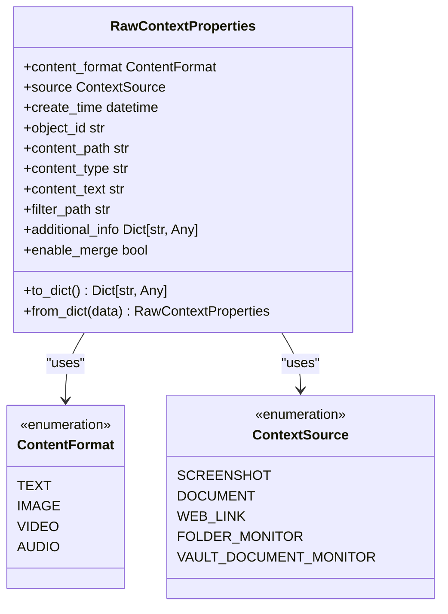

# Screenshot Capture

<cite>
**Referenced Files in This Document**   
- [screenshot.py](file://opencontext/context_capture/screenshot.py)
- [base.py](file://opencontext/context_capture/base.py)
- [capture_interface.py](file://opencontext/interfaces/capture_interface.py)
- [context.py](file://opencontext/models/context.py)
- [image.py](file://opencontext/utils/image.py)
- [screenshot_processor.py](file://opencontext/context_processing/processor/screenshot_processor.py)
- [config.yaml](file://config/config.yaml)
- [get-capture-sources.ts](file://frontend/src/main/utils/get-capture-sources.ts)
- [ScreenshotService.ts](file://frontend/src/main/services/ScreenshotService.ts)
</cite>

## Table of Contents
1. [Introduction](#introduction)
2. [Core Components](#core-components)
3. [Architecture Overview](#architecture-overview)
4. [Detailed Component Analysis](#detailed-component-analysis)
5. [Configuration Options](#configuration-options)
6. [Metadata Population](#metadata-population)
7. [Common Issues and Solutions](#common-issues-and-solutions)
8. [Conclusion](#conclusion)

## Introduction
The Screenshot Capture component is a critical part of the OpenContext system, responsible for periodic and event-triggered capture of user screen activity. This component implements a robust screenshot capture system that handles multi-monitor environments, provides flexible configuration options, and integrates with downstream processing components to extract meaningful context from visual data. The system is designed to balance performance, privacy, and resource usage while providing comprehensive screen monitoring capabilities.

## Core Components

The screenshot capture functionality is implemented through several interconnected components that work together to capture, process, and analyze screen activity. The core of the system is the `ScreenshotCapture` class, which implements the `ICaptureComponent` interface and handles the actual screen capture operations. This component works in conjunction with the `ScreenshotProcessor` which analyzes captured images and extracts contextual information. The capture manager coordinates multiple capture components and ensures proper lifecycle management.

**Section sources**
- [screenshot.py](file://opencontext/context_capture/screenshot.py#L28-L508)
- [screenshot_processor.py](file://opencontext/context_processing/processor/screenshot_processor.py#L47-L590)
- [capture_interface.py](file://opencontext/interfaces/capture_interface.py#L18-L153)

## Architecture Overview

The screenshot capture system follows a modular architecture with clear separation of concerns between capture, processing, and storage components. The system is designed to be extensible and maintainable, with well-defined interfaces between components.

**Diagram sources**
- [screenshot.py](file://opencontext/context_capture/screenshot.py#L28-L508)
- [screenshot_processor.py](file://opencontext/context_processing/processor/screenshot_processor.py#L47-L590)
- [context.py](file://opencontext/models/context.py#L35-L143)

## Detailed Component Analysis

### ScreenshotCapture Implementation

The `ScreenshotCapture` class implements the `ICaptureComponent` interface, providing a standardized way to manage the lifecycle and configuration of the screenshot capture functionality. The component follows a well-defined initialization, start/stop lifecycle, and capture execution pattern.

#### Initialization and Configuration
The component is initialized with default values and then configured through the `initialize` method, which validates and applies configuration parameters. The initialization process sets up the screenshot library (mss), configures image format and quality settings, and prepares the storage directory for saved screenshots.

**Diagram sources**
- [capture_interface.py](file://opencontext/interfaces/capture_interface.py#L18-L153)
- [base.py](file://opencontext/context_capture/base.py#L26-L515)
- [screenshot.py](file://opencontext/context_capture/screenshot.py#L28-L508)

#### Capture Execution
The capture process is executed through the `_capture_impl` method, which orchestrates the screenshot capture workflow. This method coordinates with the underlying screenshot library (mss) to capture screen regions, processes the captured images according to configuration settings, and creates `RawContextProperties` objects containing the captured data and metadata.

**Diagram sources**
- [screenshot.py](file://opencontext/context_capture/screenshot.py#L217-L245)
- [base.py](file://opencontext/context_capture/base.py#L176-L220)

### Multi-Monitor and Region Handling

The screenshot capture component supports both full-screen capture across multiple monitors and selective region capture. When no specific region is configured, the component captures each monitor individually, allowing for proper handling of multi-monitor setups. The region selection is implemented through the `_screenshot_region` parameter, which defines the rectangular area to capture in terms of left, top, width, and height coordinates.

**Diagram sources**
- [screenshot.py](file://opencontext/context_capture/screenshot.py#L246-L295)
- [get-capture-sources.ts](file://frontend/src/main/utils/get-capture-sources.ts#L561-L579)

### Image Compression and Quality Settings

The component implements flexible image compression strategies to balance image quality with storage and performance requirements. The compression settings are configurable through the `screenshot_format`, `screenshot_quality`, `max_image_size`, and `resize_quality` parameters. The system supports PNG and JPEG/JPG formats, with quality settings specifically applicable to JPEG compression.

**Diagram sources**
- [screenshot.py](file://opencontext/context_capture/screenshot.py#L280-L287)
- [image.py](file://opencontext/utils/image.py#L46-L62)

## Configuration Options

The screenshot capture component provides a comprehensive set of configuration options that allow users to customize its behavior according to their specific needs. These options are defined in the component's configuration schema and can be set through the system configuration file.

### Core Configuration Parameters

The following table outlines the key configuration options available for the screenshot capture component:

| Configuration Parameter | Type | Default Value | Description | Constraints |
|------------------------|------|---------------|-------------|-------------|
| capture_interval | number | 5.0 | Screenshot capture interval in seconds | Minimum: 0.1 |
| screenshot_format | string | "png" | Image format for captured screenshots | Enum: ["png", "jpg", "jpeg"] |
| screenshot_quality | integer | 80 | Image quality for JPEG/JPG format (1-100) | Range: 1-100 |
| screenshot_region | object | null | Specific screen region to capture | Must contain left, top, width, height |
| storage_path | string | "./screenshots" | Directory path for saving screenshots | Must be valid directory path |
| dedup_enabled | boolean | true | Enable screenshot deduplication | true/false |
| similarity_threshold | number | 98 | Image similarity threshold for deduplication (0-100) | Range: 0-100 |

**Section sources**
- [screenshot.py](file://opencontext/context_capture/screenshot.py#L300-L353)
- [config.yaml](file://config/config.yaml#L43-L47)

### Configuration Validation

The component implements robust configuration validation to ensure that all settings are valid before initialization. The validation process checks data types, value ranges, and required fields, providing clear error messages when invalid configurations are detected.

**Diagram sources**
- [screenshot.py](file://opencontext/context_capture/screenshot.py#L355-L454)

## Metadata Population

The screenshot capture component enriches each captured screenshot with comprehensive metadata that provides context about the capture event. This metadata is stored in the `additional_info` field of the `RawContextProperties` object and includes various details about the capture environment and settings.

### RawContextProperties Structure

The `RawContextProperties` class is used to encapsulate all information related to a captured screenshot. This includes the content format, source type, creation time, file path, and additional metadata specific to the screenshot capture.

**Diagram sources**
- [context.py](file://opencontext/models/context.py#L35-L55)
- [screenshot.py](file://opencontext/context_capture/screenshot.py#L176-L216)

### Metadata Fields

The following metadata fields are populated for each captured screenshot:

| Metadata Field | Description | Example Value |
|---------------|-------------|---------------|
| format | Image format of the captured screenshot | "png" |
| timestamp | ISO formatted timestamp of capture | "2025-01-15T10:30:45.123456" |
| last_seen_timestamp | ISO formatted timestamp of last capture | "2025-01-15T10:30:45.123456" |
| lib | Screenshot library used for capture | "mss" |
| region | Capture region coordinates (if applicable) | {"left": 0, "top": 0, "width": 1920, "height": 1080} |
| screenshot_format | Configured screenshot format | "png" |
| screenshot_path | Absolute path to saved screenshot file | "/Users/username/screenshots/screenshot_monitor_1_20250115_103045_123456.png" |
| duration_count | Number of times this context has been captured | 1 |
| monitor | Monitor identifier for multi-monitor setups | "monitor_1" |
| coordinates | Monitor coordinates used for capture | {"left": 0, "top": 0, "width": 1920, "height": 1080} |

**Section sources**
- [screenshot.py](file://opencontext/context_capture/screenshot.py#L191-L207)
- [context.py](file://opencontext/models/context.py#L35-L55)

## Common Issues and Solutions

### Permission Errors on macOS

macOS implements strict privacy controls that require explicit user permission for screen recording. The system must handle these permissions gracefully and guide users through the process of granting the necessary access.

**Diagram sources**
- [get-capture-sources.ts](file://frontend/src/main/utils/get-capture-sources.ts#L336-L345)
- [ScreenshotService.ts](file://frontend/src/main/services/ScreenshotService.ts#L28-L34)

### Screen Capture Failures in Secure Contexts

Certain applications and system interfaces may prevent screen capture for security reasons. The system handles these cases by implementing fallback mechanisms and providing clear error reporting.

**Section sources**
- [screenshot.py](file://opencontext/context_capture/screenshot.py#L296-L298)
- [get-capture-sources.ts](file://frontend/src/main/utils/get-capture-sources.ts#L615-L620)

### Memory Usage Optimization

High-frequency screenshot capture can lead to significant memory usage. The system implements several optimization strategies to mitigate this issue, including image resizing, compression, and efficient memory management.

**Diagram sources**
- [image.py](file://opencontext/utils/image.py#L46-L62)
- [config.yaml](file://config/config.yaml#L89-L91)

## Conclusion

The Screenshot Capture component provides a comprehensive solution for capturing and processing user screen activity. By implementing a modular architecture with clear separation of concerns, the system offers flexible configuration options, robust error handling, and efficient resource management. The integration with the `RawContextProperties` model ensures that captured screenshots are enriched with meaningful metadata, enabling downstream processing components to extract valuable context from visual data. The system's design addresses common challenges such as permission management on macOS, secure context limitations, and memory optimization for high-frequency capture scenarios.